<div align="center">
  
</div>

---

# Overview

This module documents the creation of the first virtual machine in my IT Operations Homelab.

The objective was to provision a Windows Server 2025 virtual machine named **SRV01** using VMware Workstation Pro.

SRV01 will become the primary Windows Server in the lab. Later modules will use it for services such as:

- Active Directory Domain Services
- DNS
- DHCP
- Group Policy
- Windows LAPS
- File and Print Services
- Monitoring and administration

These roles were not configured during this module. This module focused only on planning and creating the virtual machine.

Instead of using VMware Easy Install, I selected the custom configuration option so I could review and choose each virtual hardware setting manually.

---

# Why I Built This Module

Before installing Windows Server, I wanted to understand how a virtual machine is planned and provisioned.

It is easy to accept default settings without knowing what they control. By using the custom installation process, I was able to make decisions about:

- Firmware
- CPU allocation
- Memory allocation
- Virtual storage
- Network mode
- Operating system compatibility

My goal was not to give the virtual machine the highest possible specifications. My goal was to create a server that could perform its planned roles while leaving enough host resources for additional client and server virtual machines.

---

# Business Scenario

An organization is preparing a new Windows Server that will support internal infrastructure services.

Before the operating system can be installed, the Infrastructure Team must create a virtual machine and determine its hardware configuration.

The server requires:

- Sufficient CPU and memory for its planned workload
- Modern firmware and boot security
- Adequate storage for the operating system and lab data
- Internet access for updates
- Network separation from the physical home network

Production environments may use platforms such as VMware ESXi, Microsoft Hyper-V, Nutanix AHV, or Proxmox VE.

This homelab uses VMware Workstation Pro because it allows me to practice virtual machine planning and administration using the hardware available on my personal computer.

---

# Learning Objectives

By completing this module, I practiced the following:

- Understanding the relationship between a host and guest operating system
- Creating a virtual machine using VMware Workstation Pro
- Selecting a custom virtual machine configuration
- Choosing an operating system compatibility profile
- Configuring UEFI and Secure Boot
- Allocating virtual CPU and memory
- Creating a thin-provisioned virtual disk
- Selecting an appropriate network mode
- Reviewing virtual hardware before deployment
- Explaining the reason behind each configuration choice

---

# Key Concepts Learned

## Host and Guest Operating Systems

The **host operating system** is the operating system installed on the physical computer.

In this lab:

```text
Host Operating System: Windows 11
```

The **guest operating system** is installed inside the virtual machine.

In this lab:

```text
Guest Operating System: Windows Server 2025
```

VMware Workstation Pro provides the virtualization layer that allows the guest system to use virtual CPU, memory, storage, and networking resources from the host.

---

## Virtual Machine Resource Allocation

Virtual machines share the physical resources of the host computer.

Giving one virtual machine too many resources can reduce the number of systems that the host can run at the same time.

The configuration therefore needs to balance:

```text
Virtual Machine Performance
            +
Available Host Resources
            +
Future Lab Expansion
```

---

## Thin Provisioning

Thin provisioning allows the virtual disk file to grow as data is written.

An 80 GB virtual disk does not immediately consume the full 80 GB of physical storage.

This helps conserve host storage, although the administrator must still monitor physical disk capacity as the virtual disk grows.

---

## NAT Networking

NAT allows the virtual machine to access external networks through the host computer.

For this lab, NAT provides internet connectivity while keeping the virtual environment logically separated from the physical home network.

This is important because later modules will introduce services such as DHCP. I do not want lab DHCP traffic interfering with devices on my home network.

---

# Lab Environment Specifications

| Component | Configuration |
|------------|---------------|
| Hypervisor | VMware Workstation Pro |
| Host Operating System | Windows 11 |
| Planned Guest Operating System | Windows Server 2025 |
| Virtual Machine Name | SRV01 |
| Firmware | UEFI |
| Secure Boot | Enabled |
| Processor Configuration | 1 processor, 2 cores |
| Total Virtual CPUs | 2 vCPUs |
| Memory | 4 GB / 4096 MB |
| Virtual Disk | 80 GB NVMe |
| Disk Allocation | Thin provisioned |
| Network Mode | NAT |

---

# Folder Structure

```text
00-Lab-Setup
│
└── 01-Enterprise-Virtualization
    │
    ├── README.md
    │
    └── Evidence
        └── Screenshots
            ├── 01-New-Virtual-Machine-Wizard.png
            ├── 02-Custom-Configuration.png
            ├── 03-Hardware-Compatibility.png
            ├── 04-Install-Operating-System-Later.png
            ├── 05-Guest-Operating-System.png
            ├── 06-VM-Name.png
            ├── 07-UEFI-SecureBoot.png
            ├── 08-CPU-Configuration.png
            ├── 09-Memory-Configuration.png
            ├── 10-NVMe-Disk.png
            ├── 11-NAT-Network.png
            └── 12-VM-Hardware-Summary.png
```

---

# Step-by-Step Implementation

---

## Step 1 — Create a New Virtual Machine

Opened VMware Workstation Pro and launched the **New Virtual Machine Wizard**.

This wizard begins the process of defining the virtual hardware that will be assigned to SRV01.

<p align="center">
  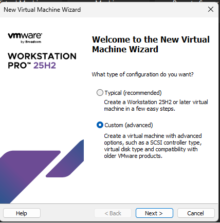
</p>

---

## Step 2 — Select Custom Configuration

Selected:

```text
Custom (Advanced)
```

I chose the custom option because I wanted to review each hardware setting instead of allowing VMware to configure the virtual machine using default values.

This provided more control over:

- Hardware compatibility
- Firmware
- CPU
- Memory
- Storage controller
- Disk type
- Network mode

<p align="center">
  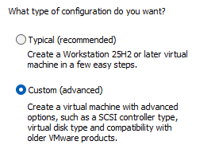
</p>

---

## Step 3 — Select Hardware Compatibility

Kept the current VMware hardware compatibility version.

The hardware compatibility setting determines which virtual hardware features are available to the virtual machine.

Using the current version allows the VM to use modern VMware virtual hardware supported by Windows Server 2025.

<p align="center">
  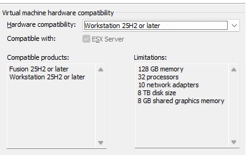
</p>

---

## Step 4 — Install the Operating System Later

Selected:

```text
I will install the operating system later
```

This prevented VMware Easy Install from automatically performing the operating system installation.

I wanted the Windows Server installation to be completed manually in the next module so that I could review:

- Boot behavior
- Edition selection
- Disk selection
- Installation options
- Initial administrator setup

<p align="center">
  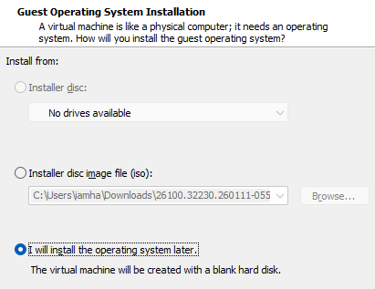
</p>

---

## Step 5 — Select the Guest Operating System

Configured the virtual machine profile for:

```text
Microsoft Windows Server 2025
```

The guest operating system profile helps VMware select compatible virtual hardware defaults and optimization settings.

<p align="center">
  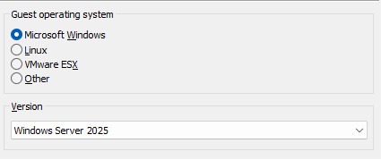
</p>

---

## Step 6 — Name the Virtual Machine

Assigned the virtual machine name:

```text
SRV01
```

I used a short and consistent naming format:

```text
SRV = Server
01  = First server
```

A clear naming convention makes systems easier to identify as the lab grows.

Future systems may follow the same pattern:

```text
SRV02
CLIENT01
CLIENT02
```

<p align="center">
  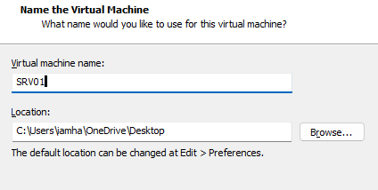
</p>

---

## Step 7 — Configure UEFI and Secure Boot

Selected **UEFI** firmware and enabled **Secure Boot**.

UEFI is the modern replacement for legacy BIOS and supports features such as:

- Secure Boot
- GPT partitioning
- Modern operating system compatibility
- Improved firmware management

Secure Boot helps prevent unauthorized or untrusted boot components from loading during startup.

<p align="center">
  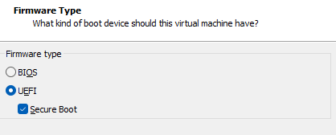
</p>

---

## Step 8 — Allocate Processor Resources

Configured:

```text
Processors: 1
Cores per processor: 2
Total vCPUs: 2
```

Two virtual CPUs provide enough processing capacity for the initial Windows Server roles planned for this homelab.

I avoided allocating more CPU than necessary because the physical host must also support additional virtual machines later.

<p align="center">
  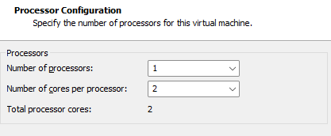
</p>

---

## Step 9 — Allocate Memory

Allocated:

```text
4096 MB
```

or:

```text
4 GB RAM
```

Four gigabytes is a practical starting point for this homelab server.

It allows Windows Server to run while preserving host memory for future systems such as:

- Windows 11 client
- Additional Windows Server
- Monitoring server
- Security testing systems

Before this module, I assumed that giving a virtual machine more memory would always make it better.

I learned that over-allocation can limit the number of virtual machines the host can run and may not provide a meaningful performance improvement.

<p align="center">
  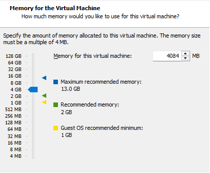
</p>

---

## Step 10 — Create the Virtual Disk

Created an:

```text
80 GB NVMe virtual disk
```

The disk was configured using thin provisioning.

This means the virtual disk file will grow as data is written instead of immediately reserving the complete 80 GB on the host drive.

The disk must still be monitored because thin provisioning does not remove the possibility of the host running out of storage.

<p align="center">
  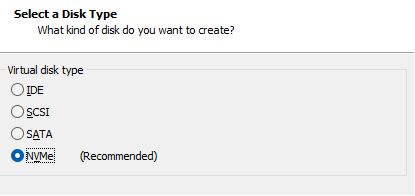
</p>

---

## Step 11 — Configure NAT Networking

Selected:

```text
NAT
```

NAT allows SRV01 to reach external networks through the host computer.

I selected NAT because the server requires internet access for tasks such as:

- Windows updates
- Software downloads
- Microsoft documentation
- Package installation

At the same time, NAT helps separate the lab from the physical home network.

This will become especially important when DHCP is configured later.

<p align="center">
  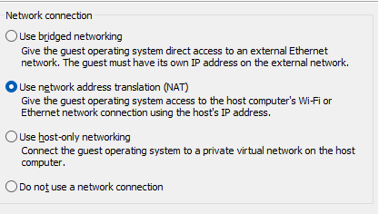
</p>

---

## Step 12 — Review the Hardware Summary

Reviewed the final virtual hardware configuration before completing the wizard.

The review confirmed:

- Correct virtual machine name
- Windows Server 2025 profile
- UEFI firmware
- Secure Boot
- 2 vCPUs
- 4 GB memory
- 80 GB virtual disk
- NAT networking

This final check reduces the chance of continuing into the operating system installation with an incorrect configuration.

<p align="center">
  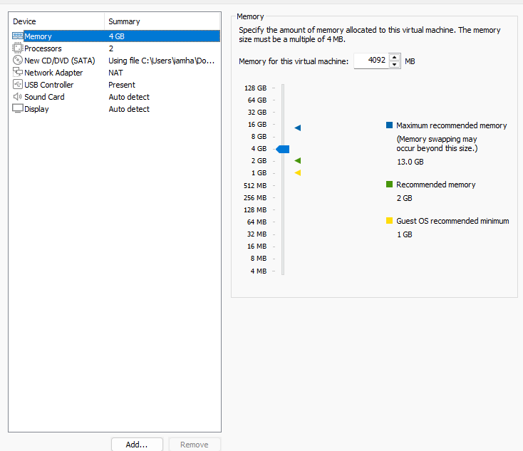
</p>

---

# Virtualization Architecture

```text
Physical Computer
│
├── Windows 11 Host Operating System
│
├── VMware Workstation Pro
│   │
│   └── SRV01 Virtual Machine
│       ├── 2 vCPUs
│       ├── 4 GB RAM
│       ├── 80 GB Virtual Disk
│       ├── UEFI and Secure Boot
│       └── NAT Network Adapter
│
└── Physical CPU, Memory, Storage, and Network
```

---

# Technical Decisions

## Why Use Custom Instead of Typical?

The Custom option allowed me to review and control the virtual hardware configuration.

The Typical option would have been faster, but it would provide less visibility into decisions such as firmware, controller type, and resource allocation.

---

## Why Use UEFI Instead of Legacy BIOS?

UEFI supports modern operating systems, Secure Boot, and GPT partitioning.

It is the more appropriate choice for a new Windows Server 2025 deployment.

---

## Why Enable Secure Boot?

Secure Boot verifies that trusted components are used during the startup process.

It reduces the risk of unauthorized bootloaders or certain forms of boot-level malware being loaded.

---

## Why Allocate Only 4 GB of RAM?

This is a homelab running on limited physical hardware.

The goal is to provide enough memory for SRV01 while leaving capacity for additional machines.

In a production environment, memory would be sized based on:

- Server roles
- Number of users
- Application requirements
- Monitoring data
- Performance testing
- Growth expectations

---

## Why Use Thin Provisioning?

Thin provisioning conserves physical storage by allowing the virtual disk to grow as required.

The trade-off is that the administrator must monitor the physical host disk to make sure enough storage remains available.

---

## Why Use NAT Instead of Bridged Networking?

NAT provides internet connectivity while reducing direct exposure to the physical home network.

It also helps prevent future lab services, particularly DHCP, from interfering with physical network devices.

---

# Validation Results

| Validation Check | Result |
|------------------|--------|
| New Virtual Machine Wizard opened | ✅ |
| Custom configuration selected | ✅ |
| Hardware compatibility selected | ✅ |
| Automated operating system installation disabled | ✅ |
| Windows Server 2025 profile selected | ✅ |
| Virtual machine named SRV01 | ✅ |
| UEFI configured | ✅ |
| Secure Boot enabled | ✅ |
| 2 vCPUs allocated | ✅ |
| 4 GB RAM allocated | ✅ |
| 80 GB virtual disk created | ✅ |
| Thin provisioning selected | ✅ |
| NAT networking configured | ✅ |
| Final virtual hardware reviewed | ✅ |

---

# Skills Demonstrated

- VMware Workstation Pro
- Virtual Machine Provisioning
- Virtual CPU and Memory Allocation
- Virtual Storage Planning
- Thin Provisioning
- UEFI Configuration
- Secure Boot
- NAT Networking
- Capacity Planning
- Technical Documentation
- Infrastructure Planning

---

# Interview Notes

## Why did you choose Custom instead of Typical configuration?

I selected Custom because I wanted control over the virtual hardware configuration.

It allowed me to review firmware, processors, memory, storage, and networking instead of relying entirely on VMware defaults.

---

## Why did you allocate only 4 GB of RAM?

The server is part of a homelab with limited host resources.

Four gigabytes provides enough memory for the initial server configuration while preserving capacity for additional client and server virtual machines.

In a production environment, I would size memory according to the server workload and performance data.

---

## What is the difference between a host and a guest operating system?

The host operating system runs directly on the physical computer.

The guest operating system runs inside a virtual machine and uses virtual hardware provided by the hypervisor.

---

## What is thin provisioning?

Thin provisioning creates a virtual disk with a maximum capacity but only consumes physical host storage as data is written.

It improves storage efficiency, but available physical storage must still be monitored.

---

## Why did you select NAT networking?

NAT gives the server internet access through the host while keeping the lab logically separated from the physical home network.

This reduces the risk of lab traffic interfering with home devices.

---

# What I Learned

The most important lesson from this module was that virtual machine provisioning is not only about selecting the largest available specifications.

Each resource decision affects the rest of the environment.

I initially assumed that assigning more CPU and memory would always improve a virtual machine. I learned that unnecessary allocation can reduce the number of systems the host can run and may not provide a noticeable benefit.

I also learned why network mode matters.

Using NAT gives the server internet access while helping protect the physical home network from services that will be introduced later, such as DHCP.

Choosing the custom configuration took more time than using the default wizard, but it helped me understand what VMware was creating.

---

# Future Improvements

To make this virtualization environment closer to a larger production environment, I would add:

- A second Windows Server
- Multiple Windows client virtual machines
- A dedicated virtual network
- Separate server and client network segments
- Virtual machine snapshots before major changes
- Centralized backup of VM configuration files
- Hyper-V or VMware ESXi experience
- Infrastructure documentation and network diagrams
- Resource monitoring over time

---

# Key Takeaways

This module established the virtualization foundation for the rest of the IT Operations Homelab.

The virtual machine was created with:

- A clear naming convention
- Modern UEFI firmware
- Secure Boot
- Balanced CPU and memory allocation
- Thin-provisioned storage
- NAT network connectivity

The main lesson was that good virtual machine design requires balancing performance, security, storage, networking, and available host resources.

---

<div align="center">

### Module Status

✅ Completed Successfully

**Next Module:** [Windows Server Installation](../02-Windows-Server-Installation/)

</div>
