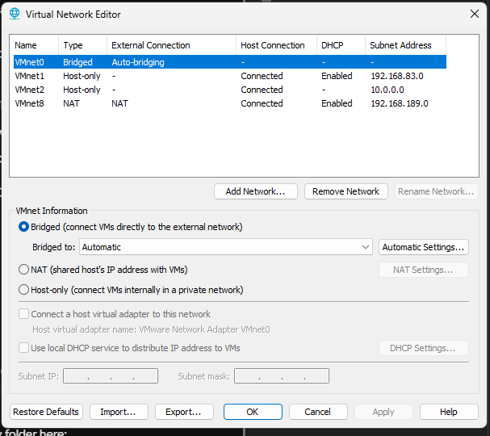

# Hypervisor Networking & Virtual Switch Engineering

## 1. Project Overview
Engineered an isolated, Host-Only virtual network switch (`VMnet2`) within a Type-2 hypervisor to serve as the secure Local Area Network (LAN) backbone for the enterprise homelab environment.

## 2. Environment
* **Host OS:** Windows 11 Pro
* **Hypervisor:** VMware Workstation Pro
* **Target Network:** `VMnet2`

## 3. Architecture
* **Switch Type:** Host-Only (Air-gapped from physical WAN/LAN)
* **Subnet:** `10.0.0.0`
* **Subnet Mask:** `255.0.0.0` (`/8`)
* **Native DHCP:** Disabled (Delegated to future Windows Server instance)

## 4. Configuration
1. Elevated VMware Virtual Network Editor to Administrator privileges.
2. Provisioned a new virtual switch designated as `VMnet2`.
3. Assigned the Host-Only network type to ensure absolute isolation from the physical network adapter.
4. Explicitly disabled the native VMware DHCP service to prevent future IP allocation conflicts (Rogue DHCP) with the planned Windows Server infrastructure.
5. Assigned the static IPv4 subnet `10.0.0.0/8`.

## 5. Verification
Verified network parameters within the Virtual Network Editor interface, confirming the DHCP status column registered as disabled (`-`) for `VMnet2`.

## 6. Troubleshooting
*See Incident Reports for preventative troubleshooting regarding Rogue DHCP scenarios.*

## 7. Evidence
* 

## 8. Incident Reports
* `INC-001-Rogue-DHCP-Prevention.md`

## 9. Lessons Learned
Hypervisors often run hidden background services designed for consumer convenience. In an enterprise lab, these "helper" services (like native DHCP or NAT routing) must be aggressively audited and disabled to ensure they do not interfere with the actual server infrastructure being built.

## 10. Skills Demonstrated
* Hypervisor Network Engineering
* Subnet Allocation
* Preventative Troubleshooting (Rogue DHCP Mitigation)

## 11. Interview Questions
*(Pending Review)*

## 12. References
* VMware Workstation Pro Documentation: Virtual Network Types
