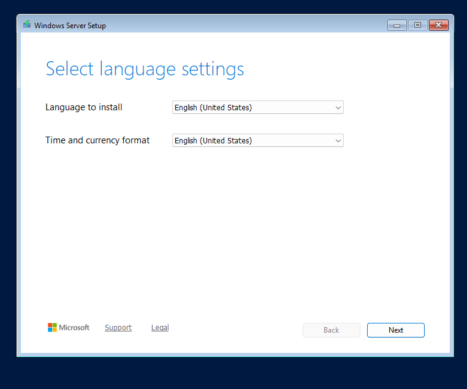
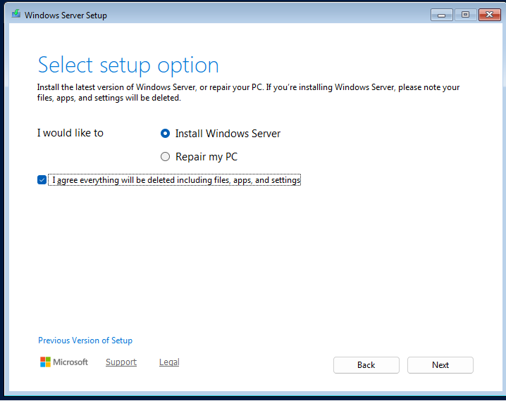
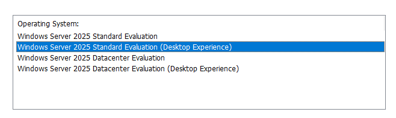
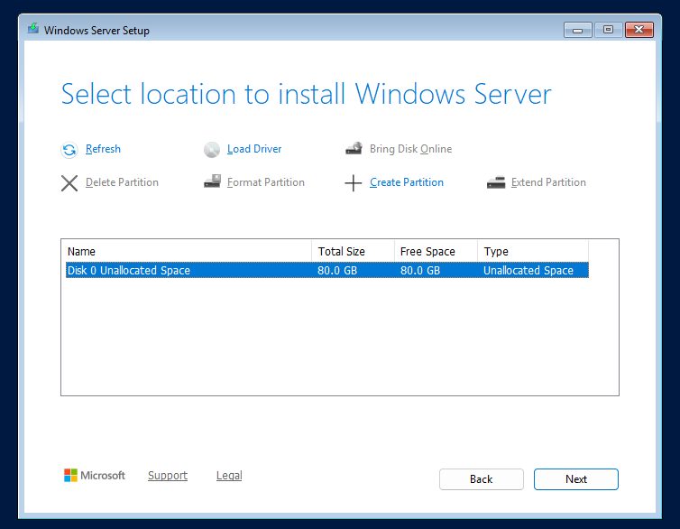
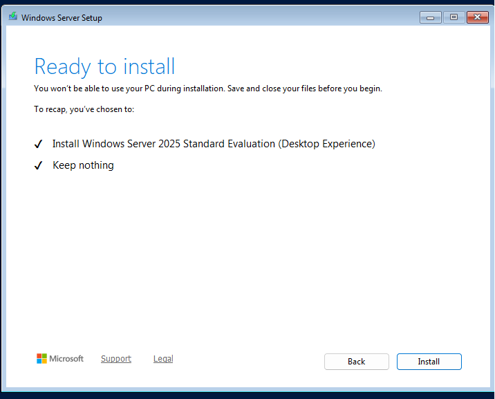
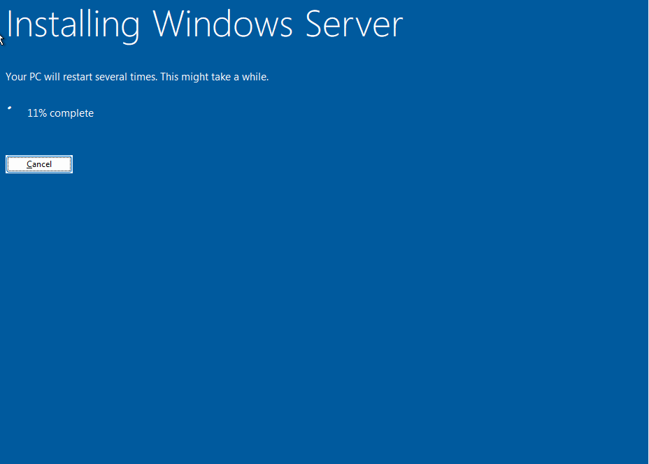
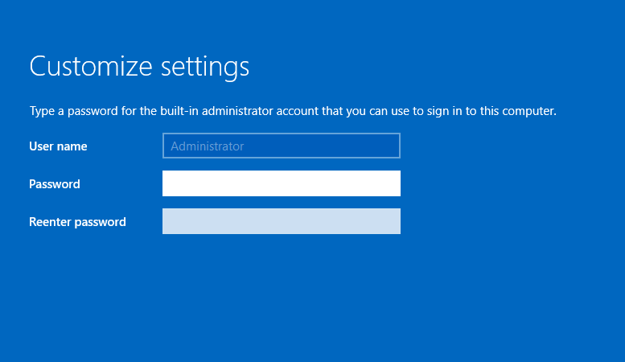
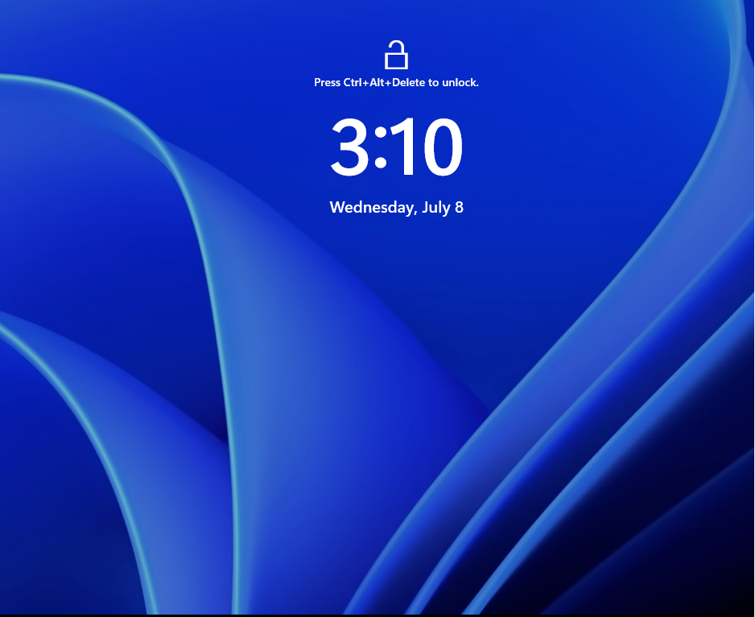

<div align="center">
  
</div>

---

# Overview

This module documents the manual installation of **Windows Server 2025 Standard Evaluation with Desktop Experience** on the virtual machine created in the previous module.

The objective was to install the operating system on **SRV01** and understand each stage of the deployment process instead of allowing VMware Easy Install to complete the installation automatically.

This module focuses only on the operating system installation.

Server naming, static IP configuration, Windows updates, time settings, and server role deployment are completed in later modules.

---

# Why I Built This Module

I wanted to understand what happens during a Windows Server installation instead of relying on an automated deployment process.

Installing the operating system manually allowed me to review:

- Language and keyboard settings
- Windows Server editions
- Desktop Experience and Server Core options
- Disk selection
- Installation progress
- Initial Administrator password configuration
- Secure sign-in requirements

I selected **Desktop Experience** because I am still developing my Windows Server administration skills and wanted to become familiar with the graphical tools before relying more heavily on PowerShell, Server Core, and remote management.

---

# Business Scenario

An organization has provisioned a new virtual machine that will eventually support internal infrastructure services.

Before the server can be configured for Active Directory, DNS, DHCP, Group Policy, file services, or other roles, the Infrastructure Team must install the operating system.

The administrator is responsible for:

- Selecting the correct Windows Server edition
- Choosing the appropriate installation type
- Confirming the destination disk
- Completing the installation
- Securing the local Administrator account
- Verifying that the operating system starts successfully

This homelab simulates the manual deployment process that an infrastructure technician or junior systems administrator may perform when preparing a new Windows Server.

---

# Learning Objectives

By completing this module, I practiced the following:

- Booting a virtual machine from Windows Server installation media
- Reviewing regional and keyboard settings
- Starting a manual Windows Server installation
- Comparing Windows Server installation options
- Selecting Windows Server 2025 Standard Evaluation
- Selecting Desktop Experience
- Choosing the correct destination disk
- Monitoring the installation process
- Configuring the local Administrator password
- Reaching the Windows Server secure sign-in screen
- Understanding the difference between operating system installation and full server configuration

---

# Key Concepts Learned

## Windows Server Editions

Windows Server is available in different editions designed for different workloads and licensing requirements.

For this homelab, I selected:

```text
Windows Server 2025 Standard Evaluation
```

The Standard edition is suitable for general-purpose server roles and provides the features needed for the planned homelab environment.

The Evaluation edition allows Windows Server to be tested for learning and lab purposes.

---

## Desktop Experience

Windows Server can be installed with either:

```text
Server Core
```

or:

```text
Desktop Experience
```

Desktop Experience includes the Windows graphical interface and tools such as:

- Server Manager
- File Explorer
- Microsoft Management Console
- Local graphical administration tools

Server Core has a smaller attack surface and lower resource usage but relies more heavily on PowerShell, command-line tools, and remote administration.

I selected Desktop Experience because I wanted to learn the graphical administration tools before progressing toward more command-line and remote-management workflows.

---

## Manual Installation

VMware Easy Install can automate several parts of the operating system deployment.

For this module, the automated option was intentionally avoided.

A manual installation provides better visibility into:

- Edition selection
- Installation type
- Disk selection
- Password setup
- Restart behavior
- First sign-in requirements

---

## Installation Is Not the Same as Configuration

Reaching the Windows Server login screen confirms that the operating system was installed successfully.

It does not mean that the server is ready to provide services.

The following tasks still need to be completed:

- Rename the server
- Configure a static IP address
- Configure DNS settings
- Set the correct time zone
- Install updates
- Review firewall settings
- Configure remote management
- Install server roles

These tasks are covered in the next module.

---

# Lab Environment Specifications

| Component | Configuration |
|------------|---------------|
| Hypervisor | VMware Workstation Pro |
| Host Operating System | Windows 11 |
| Virtual Machine | SRV01 |
| Operating System | Windows Server 2025 Standard Evaluation |
| Installation Type | Desktop Experience |
| Firmware | UEFI |
| Secure Boot | Enabled |
| Processor | 2 vCPUs |
| Memory | 4 GB |
| Virtual Disk | 80 GB NVMe |
| Network Mode | NAT |
| Installation Method | Manual installation |
| Administrator Account | Local Administrator |

---

# Folder Structure

```text
00-Lab-Setup
│
└── 02-Windows-Server-Installation
    │
    ├── README.md
    │
    └── Evidence
        └── Screenshots
            ├── 01-Windows-Setup-Language.png
            ├── 02-Start-Windows-Installation.png
            ├── 03-Select-Windows-Server-Edition.png
            ├── 04-Select-Installation-Disk.png
            ├── 05-Ready-To-Install.png
            ├── 06-Windows-Installation-Progress.png
            ├── 07-Administrator-Password-Setup.png
            └── 08-Ctrl-Alt-Delete-Login-Screen.png
```

---

# Step-by-Step Implementation

---

## Step 1 — Review Language and Keyboard Settings

Booted SRV01 from the Windows Server 2025 installation media.

The Windows Setup screen displayed the regional configuration options.

Reviewed:

- Language to install
- Time and currency format
- Keyboard or input method

These settings determine how the operating system displays regional information and interprets keyboard input.

<p align="center">
  
</p>

---

## Step 2 — Start the Windows Server Installation

Selected:

```text
Install now
```

This started the Windows Server installation workflow.

The installation was performed manually so that each deployment stage could be reviewed and documented.

<p align="center">
  
</p>

---

## Step 3 — Select the Windows Server Edition

Selected:

```text
Windows Server 2025 Standard Evaluation
Desktop Experience
```

Desktop Experience was selected because it includes the graphical user interface and administration tools.

This is useful during the early stages of the homelab because it allows me to understand the available Windows Server tools before moving toward PowerShell and remote administration.

<p align="center">
  
</p>

---

## Step 4 — Select the Installation Disk

Selected the available:

```text
80 GB virtual disk
```

This virtual disk was created during the Enterprise Virtualization module.

Because the disk was new and did not contain another operating system, Windows Setup could create the required system partitions automatically.

Before selecting a disk in a real environment, an administrator should confirm:

- The correct disk is selected
- Existing data is not required
- The disk has enough capacity
- The partition layout matches organizational requirements

<p align="center">
  
</p>

---

## Step 5 — Confirm the Installation

Reviewed the selected operating system and installation destination before continuing.

The final review confirmed:

- Windows Server 2025 Standard Evaluation
- Desktop Experience
- Correct virtual disk
- New operating system installation

This check helps prevent installing the wrong edition or selecting the wrong storage device.

<p align="center">
  
</p>

---

## Step 6 — Monitor the Installation Process

Windows Setup began:

- Copying operating system files
- Preparing files for installation
- Installing Windows features
- Installing updates included with the media
- Finalizing the installation

The virtual machine restarted automatically during the process.

Interrupting the virtual machine during this stage could cause an incomplete or corrupted installation.

<p align="center">
  
</p>

---

## Step 7 — Configure the Administrator Password

After installation, Windows Server required a password for the built-in local Administrator account.

A strong password should include:

- Uppercase letters
- Lowercase letters
- Numbers
- Special characters
- Sufficient length
- No easily guessed personal information

The password used in the lab is not stored in this repository.

<p align="center">
  
</p>

---

## Step 8 — Reach the Secure Sign-In Screen

The server displayed the secure sign-in screen requiring:

```text
Ctrl + Alt + Delete
```

Reaching this screen confirmed that Windows Server 2025 had installed and started successfully.

At this stage, the operating system was installed, but the server still required post-installation configuration.

<p align="center">
  
</p>

---

# Windows Server Installation Workflow

```text
Windows Server Installation Media
              │
              ▼
Language and Keyboard Selection
              │
              ▼
Start Installation
              │
              ▼
Select Windows Server Edition
              │
              ▼
Select Installation Disk
              │
              ▼
Copy and Install Files
              │
              ▼
Automatic Restart
              │
              ▼
Configure Administrator Password
              │
              ▼
Secure Sign-In Screen
              │
              ▼
Post-Installation Configuration
```

---

# Technical Decisions

## Why Select Windows Server 2025 Standard?

The Standard edition provides the Windows Server features required for this homelab, including support for roles such as:

- Active Directory Domain Services
- DNS
- DHCP
- File Services
- Print Services
- Group Policy

The Datacenter edition includes additional virtualization and software-defined infrastructure capabilities that are not required for the initial homelab design.

---

## Why Use the Evaluation Edition?

The Evaluation edition is intended for testing, learning, and evaluation.

This makes it appropriate for a personal homelab where the objective is to practice Windows Server administration rather than operate a licensed production environment.

---

## Why Select Desktop Experience?

I selected Desktop Experience because I wanted to become familiar with the Windows Server graphical interface and administration tools.

This includes:

- Server Manager
- Windows Administrative Tools
- Event Viewer
- Services
- File Explorer
- Graphical role-management tools

As my skills develop, I plan to perform more administration through PowerShell, Windows Admin Center, remote tools, and Server Core.

---

## Why Perform a Manual Installation?

A manual installation allowed me to see each deployment stage.

This helped me understand:

- Which edition was installed
- Where the operating system was installed
- Which interface option was selected
- When the password was configured
- What Windows required before the first login

Using automation is valuable, but understanding the manual process makes troubleshooting automated deployments easier.

---

## Why Is the Administrator Password Important?

The local Administrator account has complete control over the server.

A weak or exposed password could allow unauthorized access to:

- System settings
- Server roles
- Files
- User accounts
- Security policies
- Event logs

The password should be protected and should never be committed to a public GitHub repository.

---

# Validation Results

| Validation Check | Result |
|------------------|--------|
| Windows Server installation media booted | ✅ |
| Language and keyboard settings reviewed | ✅ |
| Manual installation started | ✅ |
| Windows Server 2025 Standard Evaluation selected | ✅ |
| Desktop Experience selected | ✅ |
| Correct virtual disk selected | ✅ |
| Installation files copied successfully | ✅ |
| Virtual machine restarted successfully | ✅ |
| Local Administrator password configured | ✅ |
| Secure sign-in screen reached | ✅ |
| Server renamed to SRV01 inside Windows | ⏭️ Next module |
| Static IP address configured | ⏭️ Next module |
| Time zone configured | ⏭️ Next module |
| Windows updates installed | ⏭️ Next module |
| Server roles installed | ⏭️ Later modules |

---

# Security Notes

## Password Protection

The Administrator password used during this module is not included in:

- Screenshots
- Scripts
- Notes
- README files
- Git commits

Credentials should never be stored in a public repository.

---

## Installation Media

Operating system ISO files should not be uploaded to GitHub.

They are large files and may also be subject to licensing restrictions.

The repository documents the deployment process without distributing the installation media.

---

## Default Administrator Account

The built-in Administrator account is required during the initial installation.

In a larger environment, administrators should later consider:

- Using named administrative accounts
- Applying least privilege
- Managing local administrator passwords
- Auditing administrator activity
- Restricting interactive logon
- Using Windows LAPS

---

## Updates and Hardening

A newly installed server should not immediately be treated as ready for service.

Before production use, it should receive:

- Security updates
- Firewall review
- Secure network configuration
- Time synchronization
- Endpoint protection
- Logging and auditing configuration
- Organizational security policies

These tasks are introduced in later modules.

---

# Skills Demonstrated

- Windows Server 2025 Installation
- Manual Operating System Deployment
- Windows Server Edition Selection
- Desktop Experience Deployment
- Virtual Disk Selection
- Administrator Account Configuration
- Secure Sign-In
- VMware Workstation Pro
- Installation Validation
- Technical Documentation
- Basic Server Security Awareness

---

# Interview Notes

## What is the difference between Server Core and Desktop Experience?

Server Core does not include the full Windows graphical interface.

It uses fewer resources and has a smaller attack surface, but it relies more heavily on PowerShell, command-line tools, Windows Admin Center, and remote administration.

Desktop Experience includes the graphical interface and administration tools.

I selected Desktop Experience because I was still learning the Windows Server interface and wanted to understand the graphical tools before progressing toward Server Core and remote administration.

---

## Why did you install Windows Server manually?

I wanted to understand each part of the deployment process instead of relying on VMware Easy Install.

Manual installation allowed me to review the operating system edition, installation type, destination disk, restart process, and Administrator password configuration.

---

## What should be done after installing Windows Server?

After installation, I would normally:

1. Rename the server
2. Configure a static IP address
3. Configure DNS
4. Set the time zone
5. Install updates
6. Review firewall settings
7. Configure remote administration
8. Install security tools
9. Add server roles
10. Document and validate the configuration

---

## Why should a server use a static IP address?

Servers provide services that clients and other systems must locate consistently.

If a server's IP address changes unexpectedly, services such as DNS, DHCP, file sharing, remote management, and Active Directory may become unavailable.

---

## Does reaching the login screen mean the server is ready for production?

No.

It confirms that the operating system installed and started successfully.

The server still requires post-installation configuration, updates, security hardening, network configuration, monitoring, backup, and role-specific validation before it could be considered ready for service.

---

## Why should passwords not appear in GitHub screenshots?

A public repository can be viewed and copied by other people.

Exposing an administrator password could allow unauthorized access if the credential is reused or the environment becomes accessible.

Screenshots and documentation should be reviewed before every commit to ensure credentials and sensitive data are not visible.

---

# What I Learned

The main lesson from this module was that installing Windows Server is only the beginning of building a server.

Reaching the login screen confirmed that the operating system had installed correctly, but the server was not yet configured for its intended purpose.

It still required:

- A proper computer name
- Static network settings
- Updates
- Time configuration
- Security review
- Remote management
- Server roles

I also learned why edition and installation-type selection matter.

I selected Desktop Experience because I wanted to understand the graphical administration tools first. In the future, I want to repeat the deployment using Server Core and perform more of the configuration remotely.

Performing the installation manually took more time than using an automated process, but it gave me a better understanding of what an automated deployment would need to configure.

---

# Future Improvements

To improve this module in a future version, I would add:

- Windows Server Core installation
- An unattended installation answer file
- PowerShell-based post-installation configuration
- Automated VMware deployment
- ISO checksum verification
- Installation documentation with exact build information
- Windows Deployment Services
- Microsoft Deployment Toolkit
- Standardized server build checklist
- Automated validation report

---

# Key Takeaways

This module completed the manual installation of Windows Server 2025 on SRV01.

The installation included:

- Reviewing regional settings
- Selecting Windows Server 2025 Standard Evaluation
- Selecting Desktop Experience
- Choosing the virtual disk
- Monitoring the installation
- Configuring the local Administrator password
- Confirming successful startup

The most important lesson was understanding the difference between:

```text
Operating system installed
```

and:

```text
Server fully configured and ready to provide services
```

The next module completes the initial configuration required before SRV01 can support infrastructure roles.

---

<div align="center">

### Module Status

✅ Completed Successfully

**Next Module:** [Initial Server Configuration](../03-Initial-Server-Configuration/)

</div>
