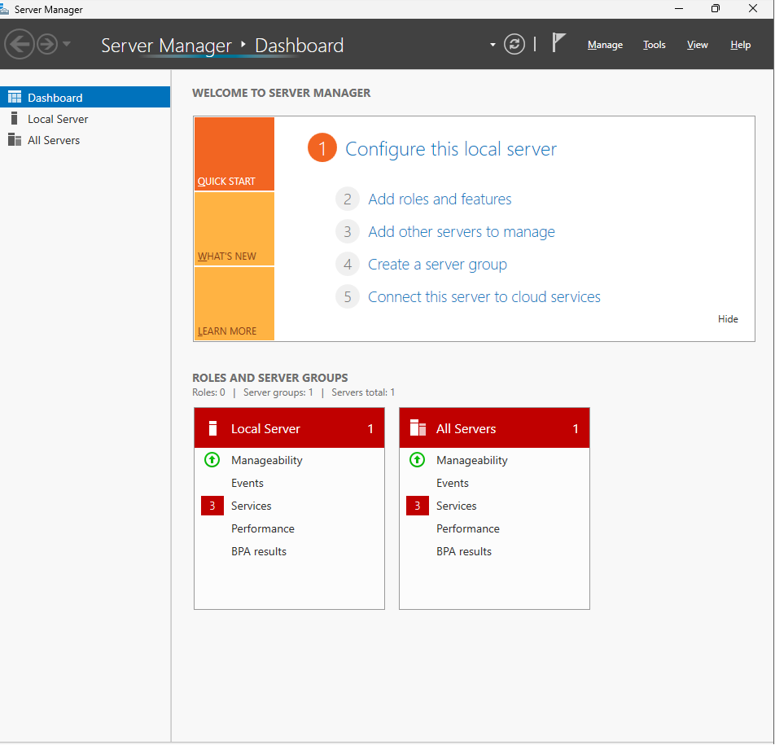
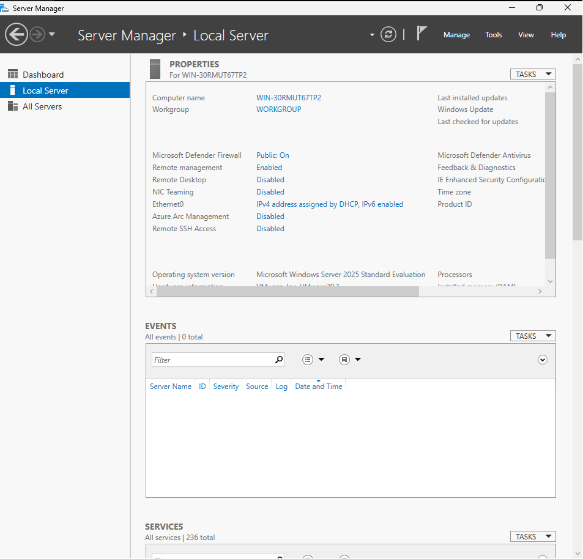
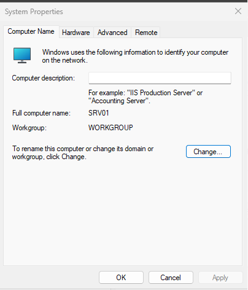
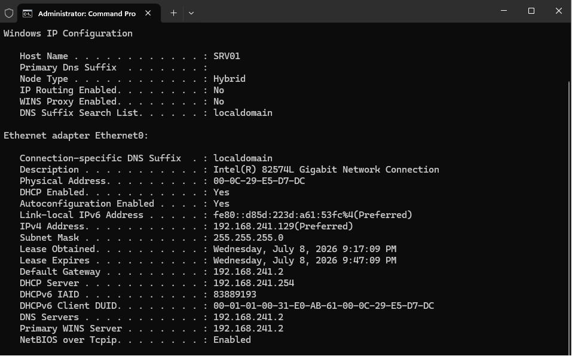
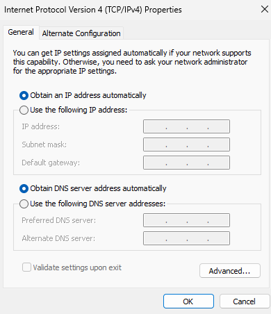
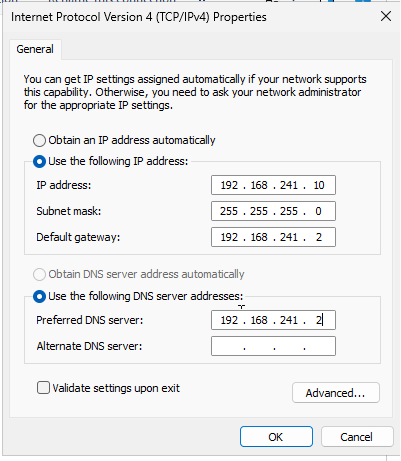
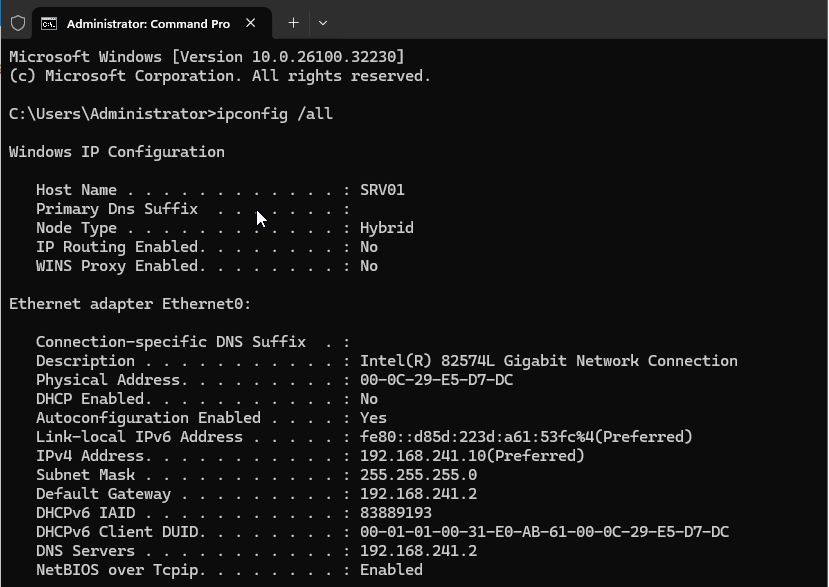

<div align="center">
  
</div>

---

# Overview

This module documents the initial configuration of **SRV01** after completing the Windows Server 2025 installation.

The purpose of this stage was to prepare the server for future infrastructure roles by confirming the computer name and replacing the temporary DHCP-assigned network configuration with a static IPv4 address.

A server should not depend on a changing IP address when it will later provide services such as:

- Active Directory Domain Services
- DNS
- DHCP
- Group Policy
- File Services
- Print Services
- Remote administration

This module focuses on two foundational tasks:

```text
Server Identity
+
Stable Network Configuration
```

---

# Why I Built This Module

Installing Windows Server only provides a working operating system.

Before the server can support other computers, it needs a predictable identity and network address.

I wanted to understand why these settings are completed before installing server roles.

If a server changes its IP address after services such as DNS or Active Directory are configured, clients may no longer be able to locate it correctly.

This module helped me understand that initial server configuration is not just a setup checklist. It establishes the foundation that future services will depend on.

---

# Business Scenario

An organization has completed the installation of a new Windows Server.

The server will eventually provide identity and network services to employees and company computers.

Before installing any server roles, the Infrastructure Team must:

- Confirm the server hostname
- Review the current network configuration
- Assign a static IPv4 address
- Verify that the new configuration is active
- Document the final settings

A stable server identity and IP address reduce the risk of service interruptions and make the system easier to manage.

This homelab simulates the preparation of a Windows Server before it is promoted to a domain controller and configured with additional infrastructure roles.

---

# Learning Objectives

By completing this module, I practiced the following:

- Navigating Server Manager
- Reviewing Local Server properties
- Confirming the Windows Server hostname
- Understanding the purpose of server naming conventions
- Reviewing DHCP-assigned network settings
- Opening IPv4 adapter properties
- Configuring a static IPv4 address
- Understanding the purpose of subnet masks, gateways, and DNS servers
- Verifying the applied network configuration
- Preparing a server for future infrastructure roles
- Documenting configuration evidence

---

# Key Concepts Learned

## Server Hostname

A hostname is the unique name assigned to a computer on a network.

The server in this lab is named:

```text
SRV01
```

The naming format means:

```text
SRV = Server
01  = First server in the environment
```

A consistent naming convention helps administrators identify and manage systems as the environment grows.

Example future names:

```text
SRV02
FS01
CLIENT01
CLIENT02
```

---

## Dynamic IP Address

A dynamic IP address is normally assigned automatically by a DHCP server.

Dynamic addressing is useful for client computers because their address can change without affecting most user activities.

However, a changing IP address can cause problems for servers that provide network services.

---

## Static IP Address

A static IP address remains assigned to the server unless an administrator changes it manually.

SRV01 was configured with:

```text
192.168.241.10
```

A static address is important because future services and clients will need to locate SRV01 consistently.

---

## IPv4 Address

An IPv4 address identifies a device on an IP network.

Example:

```text
192.168.241.10
```

The address allows other systems to communicate with SRV01.

---

## Subnet Mask

The subnet mask identifies which part of the IPv4 address represents the network and which part represents the host.

A common lab subnet mask is:

```text
255.255.255.0
```

This is also written as:

```text
/24
```

---

## Default Gateway

The default gateway provides a path from the local network to other networks.

In this VMware NAT environment, the gateway allows SRV01 to reach external networks through the host system.

---

## DNS Server

A DNS server translates names into IP addresses.

For example:

```text
SRV01.homelab.local
```

can be resolved to:

```text
192.168.241.10
```

DNS becomes especially important when Active Directory Domain Services is introduced because domain clients rely heavily on DNS to locate domain controllers and other services.

---

# Lab Environment Specifications

| Component | Configuration |
|------------|---------------|
| Hypervisor | VMware Workstation Pro |
| Host Operating System | Windows 11 |
| Server Operating System | Windows Server 2025 Standard Evaluation |
| Server Name | SRV01 |
| Network Mode | VMware NAT |
| IPv4 Configuration | Static |
| Server IPv4 Address | 192.168.241.10 |
| Server Interface | Ethernet |
| Administration Tool | Server Manager |
| Verification Tool | Command Prompt / `ipconfig` |

---

# Folder Structure

```text
00-Lab-Setup
│
└── 03-Initial-Server-Configuration
    │
    ├── README.md
    │
    └── Evidence
        └── Screenshots
            ├── 01-Server-Manager-Dashboard.png
            ├── 02-Local-Server.png
            ├── 03-System-Properties-SRV01.png
            ├── 04-Current-Network-Configuration.png
            ├── 05-IPv4-Properties.png
            ├── 06-Static-IP-Configuration.png
            └── 07-Static-IP-Verification.png
```

---

# Step-by-Step Implementation

---

## Step 1 — Open Server Manager

Signed in to Windows Server and opened **Server Manager**.

Server Manager provides a central interface for:

- Reviewing server information
- Installing roles and features
- Managing local and remote servers
- Reviewing alerts and service status
- Accessing server configuration tools

At this stage, Server Manager was used to begin the initial configuration of SRV01.

<p align="center">
  
</p>

---

## Step 2 — Open Local Server

Selected:

```text
Local Server
```

The Local Server page displays important configuration information such as:

- Computer name
- Workgroup or domain membership
- Ethernet configuration
- Remote management
- Remote Desktop
- Windows Firewall
- Time zone
- Windows Update status

This page provides a quick overview of whether the server is ready for additional configuration.

<p align="center">
  
</p>

---

## Step 3 — Confirm the Server Name

Opened System Properties and confirmed the server name:

```text
SRV01
```

A clear hostname is easier to identify than the automatically generated Windows computer name.

The server naming convention was selected before configuring Active Directory because changing the hostname after installing important roles can create unnecessary administrative work and service problems.

<p align="center">
  
</p>

---

## Step 4 — Review the Current Network Configuration

Reviewed the current Ethernet configuration before making changes.

At this stage, the network settings had been obtained automatically through DHCP.

The existing values were reviewed to identify:

- Current IPv4 address
- Subnet mask
- Default gateway
- DNS server
- Network adapter status

Reviewing the existing configuration helped confirm which network range was being used by the VMware NAT network.

<p align="center">
  
</p>

---

## Step 5 — Open IPv4 Properties

Opened the properties of:

```text
Internet Protocol Version 4 (TCP/IPv4)
```

The IPv4 Properties window allows an administrator to configure:

- IP address
- Subnet mask
- Default gateway
- Preferred DNS server
- Alternate DNS server

The configuration was changed from automatic addressing to manual addressing.

<p align="center">
  
</p>

---

## Step 6 — Configure the Static IPv4 Address

Assigned a static IPv4 configuration to SRV01.

The server address was configured as:

```text
192.168.241.10
```

The subnet mask, default gateway, and DNS values were configured to match the VMware NAT network and the planned server environment.

A static IP address was selected because future services will depend on SRV01 being reachable at a consistent address.

<p align="center">
  
</p>

---

## Step 7 — Verify the Static IP Configuration

Opened Command Prompt and reviewed the active network configuration.

Command used:

```cmd
ipconfig /all
```

The output was checked to confirm:

- The expected IPv4 address was assigned
- The subnet mask was present
- The default gateway was configured
- DNS settings were applied
- DHCP was no longer controlling the server address

This step confirmed that the manual configuration had been accepted by Windows.

<p align="center">
  
</p>

---

# Initial Configuration Workflow

```text
Windows Server Installation Completed
              │
              ▼
Open Server Manager
              │
              ▼
Review Local Server Settings
              │
              ▼
Confirm Hostname
              │
              ▼
Review Existing Network Configuration
              │
              ▼
Open IPv4 Properties
              │
              ▼
Assign Static IPv4 Address
              │
              ▼
Verify with ipconfig
              │
              ▼
Server Ready for Infrastructure Roles
```

---

# Technical Decisions

## Why Name the Server Before Installing Roles?

The server name becomes part of how administrators and other systems identify the computer.

Changing the name after installing roles such as Active Directory or issuing certificates can create additional work and may affect service references.

It is better to assign the correct name early.

---

## Why Use SRV01?

The name is short, readable, and scalable.

```text
SRV01
```

clearly identifies the machine as the first general-purpose server in the lab.

In a larger environment, a more detailed naming convention could also include:

- Location
- Environment
- Server role
- Sequence number

Example:

```text
MNL-DC01
MNL-FS01
LAB-SRV01
```

---

## Why Configure a Static IP Address?

Infrastructure servers should be reachable at predictable addresses.

SRV01 will later provide services such as:

- Active Directory
- DNS
- DHCP
- Group Policy
- File sharing
- Remote administration

If the server's address changed unexpectedly, clients and services could lose connectivity.

---

## Why Review the Existing DHCP Configuration First?

The DHCP-assigned settings showed which network, gateway, and DNS values VMware was currently providing.

This reduced the risk of manually entering values that did not match the virtual network.

---

## Why Verify with `ipconfig /all`?

Opening the configuration window only shows what was entered.

The command:

```cmd
ipconfig /all
```

shows the configuration Windows is currently using.

This makes it a useful validation step after applying network changes.

---

## Why Not Install Active Directory Immediately?

Active Directory depends heavily on stable DNS and network configuration.

Installing it before confirming the hostname and static IP address could create avoidable problems.

The safer order is:

```text
Install Windows Server
        ↓
Configure Hostname
        ↓
Configure Static IP
        ↓
Verify Networking
        ↓
Install Active Directory
```

---

# Validation Results

| Validation Check | Result |
|------------------|--------|
| Server Manager opened successfully | ✅ |
| Local Server page reviewed | ✅ |
| Server hostname confirmed as SRV01 | ✅ |
| Existing network configuration reviewed | ✅ |
| IPv4 properties opened | ✅ |
| Static IPv4 address configured | ✅ |
| SRV01 assigned 192.168.241.10 | ✅ |
| Configuration verified with `ipconfig /all` | ✅ |
| Server joined to a domain | ⏭️ Future module |
| Active Directory installed | ⏭️ Next infrastructure module |
| DNS role installed | ⏭️ Future module |
| DHCP role installed | ⏭️ Future module |

---

# Troubleshooting Notes

## Duplicate IP Address

A static address must not already be assigned to another device.

A duplicate address may cause:

- Intermittent connectivity
- Address conflict warnings
- Failed remote connections
- DNS problems
- Unpredictable service availability

Before assigning a static address in a larger environment, the administrator should check:

- DHCP reservations
- Address-management records
- Existing devices
- Network documentation

---

## Incorrect Default Gateway

An incorrect gateway may allow communication inside the local subnet while preventing access to external networks.

Possible symptom:

```text
Local ping works
Internet access fails
```

---

## Incorrect DNS Server

An incorrect DNS setting may allow communication by IP address but prevent communication by hostname.

Example:

```text
ping 192.168.241.10
```

works, but:

```text
ping SRV01
```

fails.

That would suggest a name-resolution problem rather than a complete network failure.

---

## Configuration Does Not Apply

Useful commands include:

```cmd
ipconfig /all
```

```cmd
ipconfig /flushdns
```

```cmd
ping 127.0.0.1
```

```cmd
ping 192.168.241.10
```

```cmd
ping <default-gateway>
```

Each test checks a different part of the network stack.

---

# Security Notes

## Avoid Exposing Public Services

The server is connected through VMware NAT and is not intentionally exposed directly to the public internet.

This reduces unnecessary external access while still allowing the server to download updates and software.

---

## Protect Network Information

Private lab IP addresses are generally safe to document, but screenshots should still be reviewed for:

- Public IP addresses
- Wi-Fi details
- Credentials
- MAC addresses when unnecessary
- VPN information
- Personal device names
- Organization-specific data

---

## Static IP Does Not Equal Security

A static address provides consistency.

It does not protect the server by itself.

Security still requires:

- Firewall configuration
- Updates
- Strong credentials
- Least privilege
- Logging
- Endpoint protection
- Secure remote administration

---

# Skills Demonstrated

- Windows Server 2025 Administration
- Server Manager
- Windows System Properties
- Server Naming Conventions
- IPv4 Configuration
- Static IP Addressing
- Subnet and Gateway Awareness
- DNS Configuration Awareness
- Network Validation
- Command Prompt
- `ipconfig /all`
- Infrastructure Preparation
- Technical Documentation

---

# Interview Notes

## Why should a server use a static IP address?

A server provides services that clients and other systems need to locate consistently.

If its address changes unexpectedly, DNS records, remote administration, file shares, and other services may stop working correctly.

---

## What is the difference between a hostname and an IP address?

A hostname is a human-readable name assigned to a system.

An IP address is the numeric network address used for communication.

DNS connects the two by resolving the hostname to the correct address.

---

## Why configure the hostname before installing Active Directory?

After a server becomes a domain controller, changing its name becomes more complex and may affect DNS records, replication, certificates, and administrative references.

It is safer to assign the final name first.

---

## What command would you use to verify the network configuration?

I would use:

```cmd
ipconfig /all
```

It shows the active IPv4 address, subnet mask, gateway, DNS servers, adapter information, and DHCP status.

---

## What happens if the default gateway is incorrect?

The server may still communicate with systems on the same subnet but may be unable to reach external networks.

---

## What happens if the DNS server is incorrect?

The server may be able to reach devices using IP addresses but fail to locate them using hostnames.

This can also prevent Active Directory operations because Active Directory depends heavily on DNS.

---

## How would you test a network problem?

I would test in layers:

```text
1. Check adapter configuration
2. Ping the loopback address
3. Ping the server's own IP
4. Ping the default gateway
5. Ping another device by IP
6. Test DNS resolution
7. Test the required service
```

This helps identify where communication is failing.

---

# What I Learned

The main lesson from this module was that a server needs a stable identity before it can reliably provide services.

I understood that a static IP was important, but this module helped me see why the order of configuration matters.

Configuring Active Directory or DNS before finalizing the hostname and network settings could create additional problems later.

I also learned that entering a static address is not enough. The configuration must be verified after it is applied.

Using:

```cmd
ipconfig /all
```

allowed me to confirm the actual network settings Windows was using.

The sequence I want to remember is:

```text
Configure
    ↓
Verify
    ↓
Document
```

---

# Future Improvements

To improve this initial configuration process, I would add:

- PowerShell-based hostname configuration
- PowerShell-based static IP configuration
- Automated validation scripts
- Windows Update installation
- Time-zone and time-synchronization validation
- Remote Desktop configuration
- Windows Remote Management testing
- Firewall profile review
- Server baseline hardening
- Configuration export and reporting
- A second network adapter for multi-network testing

Example PowerShell commands for a future version:

```powershell
Rename-Computer -NewName "SRV01" -Restart
```

```powershell
New-NetIPAddress `
    -InterfaceAlias "Ethernet0" `
    -IPAddress "192.168.241.10" `
    -PrefixLength 24 `
    -DefaultGateway "<Lab-Gateway>"
```

```powershell
Set-DnsClientServerAddress `
    -InterfaceAlias "Ethernet0" `
    -ServerAddresses "<DNS-Server>"
```

The interface name and network values would need to be verified before running these commands.

---

# Key Takeaways

This module completed the initial identity and network preparation of SRV01.

The server was configured with:

- A consistent hostname
- A static IPv4 address
- Network values appropriate for the VMware NAT environment
- Verified active network settings

The most important lesson was that infrastructure roles depend on a stable foundation.

Before Active Directory, DNS, DHCP, or file services are installed, the administrator should confirm:

```text
Correct Hostname
+
Stable IP Address
+
Valid Network Configuration
+
Successful Verification
```

SRV01 is now prepared for the next stage of the homelab.

---

<div align="center">

### Module Status

✅ Completed Successfully

**Next Module:** [Active Directory Domain Services](../../01-Identity-and-Access-Management/01-Active-Directory-Domain-Services/)

</div>
