<div align="center">
  
</div>

---

# Overview

This module documents the deployment of **Active Directory Domain Services** on SRV01 and the creation of the first domain in the homelab:

```text
homelab.local
```

The objective was to convert SRV01 from a standalone Windows Server into the first domain controller in the environment.

This required:

- Installing the Active Directory Domain Services role
- Adding the required management tools
- Promoting SRV01 to a domain controller
- Creating a new Active Directory forest
- Configuring the domain name
- Reviewing DNS and NetBIOS settings
- Completing the prerequisites check
- Verifying that the domain was created successfully

This module establishes the identity foundation used by later projects involving users, groups, computers, Group Policy, Windows LAPS, auditing, and automation.

---

# Why I Built This Module

Before this module, SRV01 was only a standalone Windows Server with a hostname and static IP address.

That meant every account and configuration existed only on the local machine.

I wanted to understand how organizations centrally manage:

- User identities
- Computer accounts
- Authentication
- Security groups
- Administrative permissions
- Password policies
- Group Policy
- Access to shared resources

Active Directory provides this centralized identity system.

This module helped me understand that installing the AD DS role is only the first part of the process. The server must also be promoted to a domain controller before it can authenticate domain users and manage directory objects.

---

# Business Scenario

An organization is expanding beyond a small number of standalone computers.

Managing separate local accounts on every computer has become inefficient and difficult to secure.

The IT team needs a centralized identity platform that allows administrators to:

- Create and manage employee accounts
- Join company computers to a domain
- Organize users and devices
- Apply security policies
- Control access using groups
- Reset passwords centrally
- Disable accounts during offboarding
- Audit authentication activity

SRV01 will be configured as the first domain controller for the organization.

The new Active Directory forest and domain will use:

```text
homelab.local
```

This homelab simulates the initial deployment of a small Windows domain for learning and testing purposes.

---

# Learning Objectives

By completing this module, I practiced the following:

- Understanding the purpose of Active Directory Domain Services
- Installing the AD DS server role
- Adding the required role-management tools
- Selecting the correct destination server
- Promoting a Windows Server to a domain controller
- Creating a new Active Directory forest
- Configuring a domain name
- Understanding DNS integration with Active Directory
- Reviewing the NetBIOS domain name
- Reviewing database, log, and SYSVOL paths
- Running the domain controller prerequisites check
- Verifying the domain after promotion
- Opening Active Directory administrative tools
- Understanding the difference between a server role and domain-controller promotion

---

# Key Concepts Learned

## Active Directory Domain Services

Active Directory Domain Services is Microsoft's directory service for Windows domain environments.

It stores and manages objects such as:

- Users
- Groups
- Computers
- Servers
- Organizational Units
- Group Policy objects
- Service accounts

Active Directory allows administrators to manage identities and access from a central location.

---

## Domain

A domain is a logical administrative boundary containing users, computers, policies, and other directory objects.

The domain created in this lab is:

```text
homelab.local
```

Systems joined to the domain can use centralized authentication and management.

---

## Forest

A forest is the highest-level Active Directory structure.

It can contain one or more domains that share:

- A common schema
- A global catalog
- Trust relationships
- Configuration information

Because this was the first domain in the environment, a new forest was created.

---

## Domain Controller

A domain controller is a Windows Server that runs Active Directory Domain Services and authenticates domain users and computers.

SRV01 became the first domain controller in the homelab.

Its responsibilities include:

- Authentication
- Directory lookups
- Group Policy processing
- Computer-account management
- User-account management
- DNS integration
- Replication in future multi-domain-controller environments

---

## DNS and Active Directory

Active Directory depends heavily on DNS.

Domain clients use DNS to locate services such as:

- Domain controllers
- Kerberos authentication
- LDAP
- Global Catalog
- Group Policy
- Domain joins

This is why DNS is installed and integrated during domain-controller promotion.

---

## NetBIOS Domain Name

The NetBIOS name is a shorter version of the domain name used for compatibility and certain logon formats.

For example:

```text
Full domain name: homelab.local
NetBIOS name: HOMELAB
```

A user may later sign in using:

```text
HOMELAB\username
```

or:

```text
username@homelab.local
```

---

## SYSVOL

SYSVOL is a shared folder on a domain controller.

It stores important domain files including:

- Group Policy templates
- Logon scripts
- Domain-wide configuration files

SYSVOL must be available for Group Policy and other domain functions to work correctly.

---

## Directory Services Restore Mode

During promotion, Windows requires a Directory Services Restore Mode password.

This password is used when Active Directory must be started in a special recovery mode.

It should be:

- Strong
- Protected
- Stored securely
- Different from commonly used administrator passwords

The password used in this lab is not stored in the repository.

---

# Lab Environment Specifications

| Component | Configuration |
|------------|---------------|
| Hypervisor | VMware Workstation Pro |
| Host Operating System | Windows 11 |
| Server Operating System | Windows Server 2025 Standard Evaluation |
| Server Name | SRV01 |
| Server IPv4 Address | 192.168.241.10 |
| Server Role | Active Directory Domain Services |
| Domain Controller | SRV01 |
| Forest Name | homelab.local |
| Domain Name | homelab.local |
| NetBIOS Name | HOMELAB |
| DNS Integration | Active Directory-integrated DNS |
| Administration Tool | Server Manager |
| Verification Tools | Server Manager, Active Directory Users and Computers |

---

# Folder Structure

```text
01-Identity-and-Access-Management
│
└── 01-Active-Directory-Domain-Services
    │
    ├── README.md
    │
    ├── Evidence
    │   └── Screenshots
    │       ├── 01-Add-Roles-and-Features.png
    │       ├── 02-Select-Destination-Server.png
    │       ├── 03-Select-ADDS-Role.png
    │       ├── 04-Add-Required-Features.png
    │       ├── 05-Promote-Server-to-Domain-Controller.png
    │       ├── 06-Create-New-Forest.png
    │       ├── 07-DNS-Delegation-Warning.png
    │       ├── 08-Confirm-NetBIOS-Name.png
    │       ├── 09-Active-Directory-Paths.png
    │       ├── 10-Review-Deployment-Options.png
    │       ├── 11-Prerequisites-Check.png
    │       ├── 12-Server-Manager-After-Promotion.png
    │       ├── 13-Open-Administrative-Tools.png
    │       └── 14-Verify-Active-Directory-Domain.png
    │
    └── Notes
        └── Domain-Promotion.md
```

---

# Step-by-Step Implementation

---

## Step 1 — Open Add Roles and Features

Opened Server Manager and selected:

```text
Manage
    ↓
Add Roles and Features
```

The Add Roles and Features Wizard is used to install server roles, role services, and Windows features.

<p align="center">
  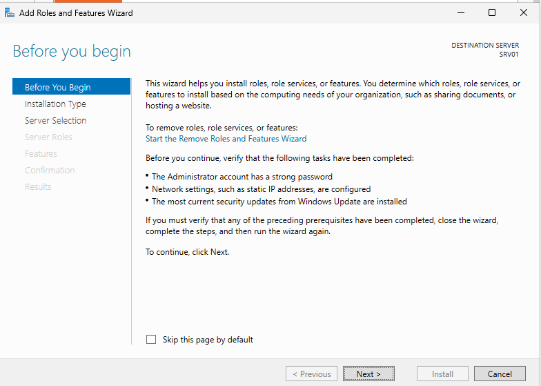
</p>

---

## Step 2 — Select the Destination Server

Selected SRV01 as the destination server.

This confirmed that the Active Directory Domain Services role would be installed on the correct machine.

Before installing a role in a larger environment, an administrator should verify:

- Server name
- IP address
- Operating system
- Available resources
- Current installed roles
- Intended server purpose

<p align="center">
  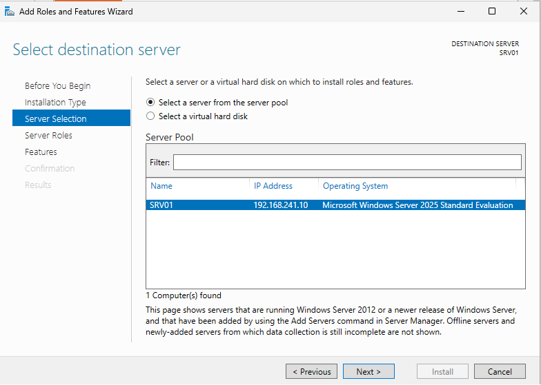
</p>

---

## Step 3 — Select Active Directory Domain Services

Selected:

```text
Active Directory Domain Services
```

The AD DS role installs the components required for a Windows Server to provide directory services.

Installing the role alone does not make the server a domain controller.

The server must still be promoted after the role installation completes.

<p align="center">
  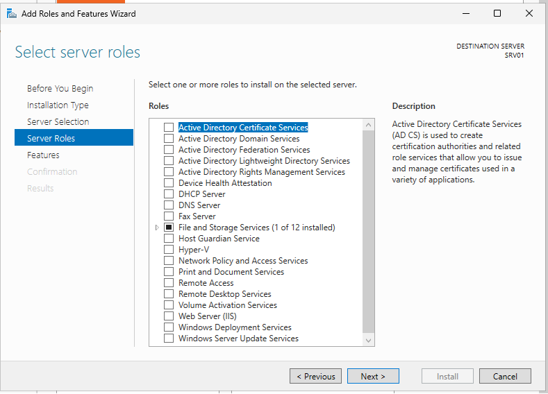
</p>

---

## Step 4 — Add Required Features

Accepted the additional features and management tools required by Active Directory Domain Services.

These tools allow the administrator to manage the domain after deployment.

Examples include:

- Active Directory Users and Computers
- Active Directory Administrative Center
- Active Directory Domains and Trusts
- Active Directory Sites and Services
- PowerShell modules for Active Directory

<p align="center">
  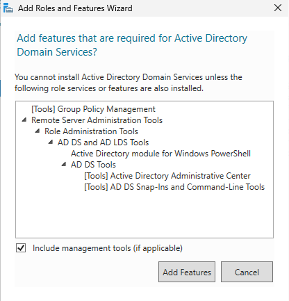
</p>

---

## Step 5 — Promote SRV01 to a Domain Controller

After the role installation completed, selected:

```text
Promote this server to a domain controller
```

This opened the Active Directory Domain Services Configuration Wizard.

This step is separate from role installation because the wizard must configure:

- Forest
- Domain
- DNS
- Database
- SYSVOL
- Recovery settings
- Domain-controller services

<p align="center">
  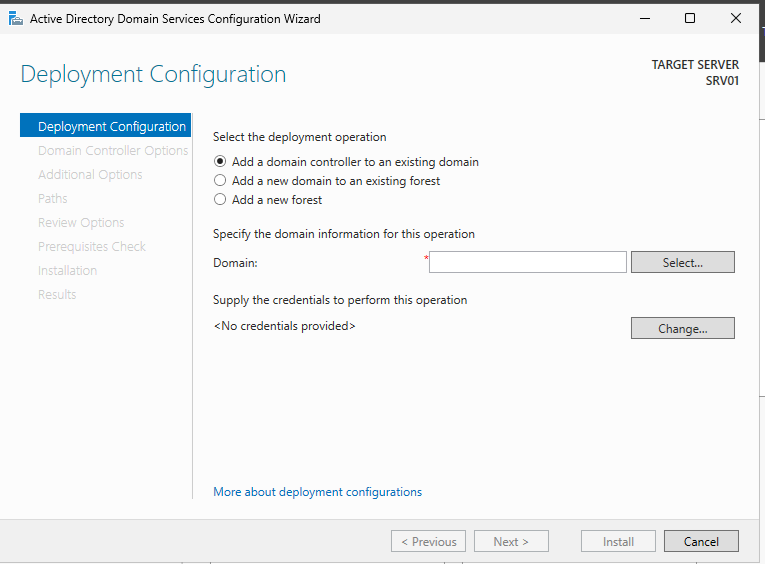
</p>

---

## Step 6 — Create a New Forest

Selected:

```text
Add a new forest
```

Configured the root domain name as:

```text
homelab.local
```

A new forest was required because no Active Directory environment existed before this module.

The forest name also became the first domain name.

<p align="center">
  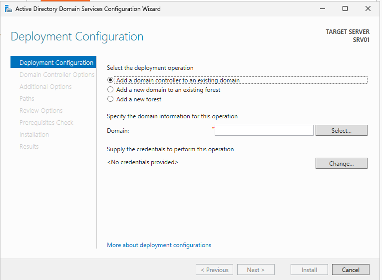
</p>

---

## Step 7 — Review the DNS Delegation Warning

The wizard displayed a DNS delegation warning.

This warning is expected in a new standalone lab forest because no parent DNS zone exists where a delegation can be created.

For example, there was no existing parent DNS infrastructure managing:

```text
local
```

The warning was reviewed rather than treated automatically as a failure.

This taught me that warnings must be interpreted in the context of the environment.

<p align="center">
  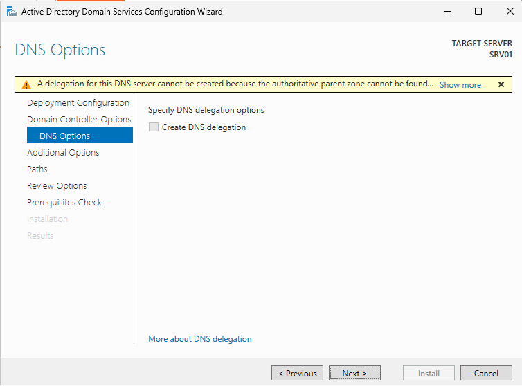
</p>

---

## Step 8 — Confirm the NetBIOS Name

Reviewed the automatically generated NetBIOS domain name:

```text
HOMELAB
```

The NetBIOS name provides a shorter domain identifier.

Users may later sign in using:

```text
HOMELAB\username
```

The value was confirmed before continuing.

<p align="center">
  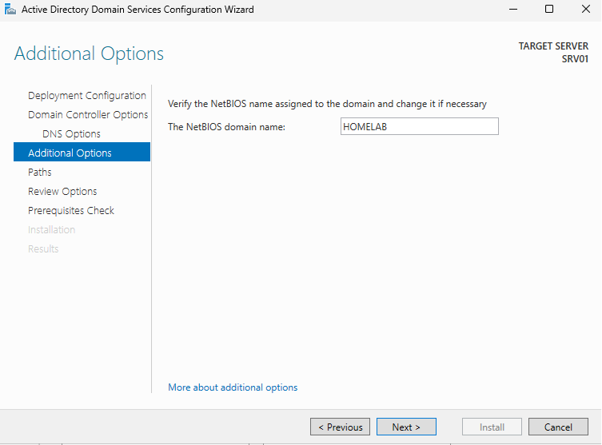
</p>

---

## Step 9 — Review Active Directory Paths

Reviewed the default storage paths for:

- Active Directory database
- Active Directory log files
- SYSVOL

Typical default paths include:

```text
C:\Windows\NTDS
```

and:

```text
C:\Windows\SYSVOL
```

For this homelab, the default paths were accepted.

In larger environments, administrators may use separate volumes depending on performance, recovery, and organizational requirements.

<p align="center">
  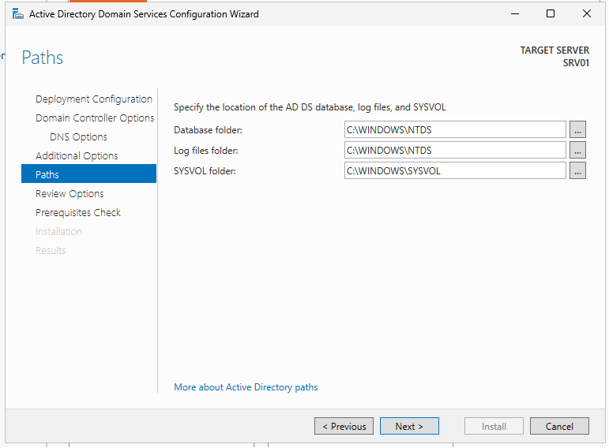
</p>

---

## Step 10 — Review Deployment Options

Reviewed the selected configuration before installation.

The review confirmed:

- New forest
- Root domain name
- DNS installation
- NetBIOS name
- Database path
- Log path
- SYSVOL path
- Domain-controller options

This step reduced the risk of promoting the server with an incorrect domain name or configuration.

<p align="center">
  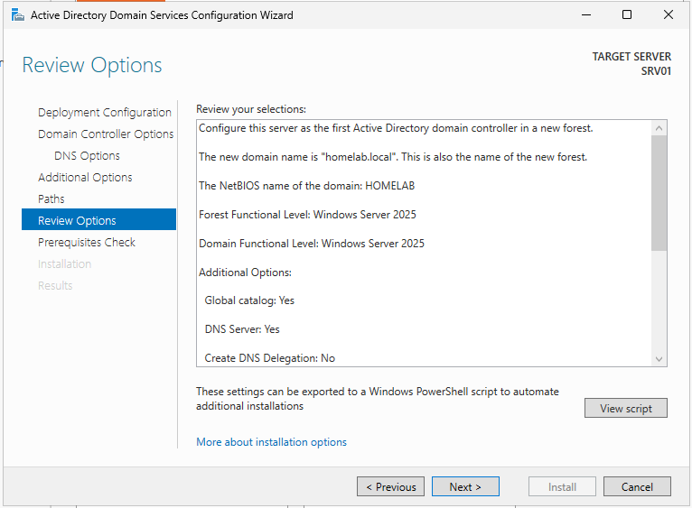
</p>

---

## Step 11 — Run the Prerequisites Check

The wizard performed a prerequisites check before promotion.

The check reviewed whether SRV01 was ready to become a domain controller.

The result was reviewed for:

- Blocking errors
- Configuration warnings
- DNS messages
- Network readiness
- Required services
- Compatibility issues

The promotion continued after the prerequisites check completed successfully.

<p align="center">
  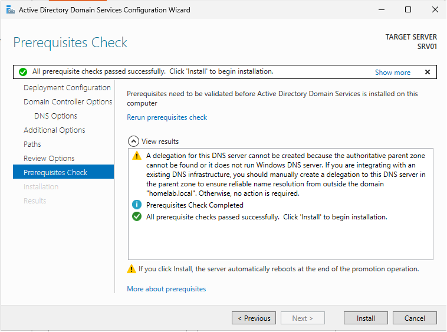
</p>

---

## Step 12 — Restart After Promotion

After the promotion process completed, SRV01 restarted automatically.

The restart was required because Windows needed to activate:

- Active Directory Domain Services
- Domain-controller authentication
- DNS integration
- SYSVOL
- Directory database services

After restart, SRV01 was no longer only a standalone server.

It had become the first domain controller in the `homelab.local` domain.

<p align="center">
  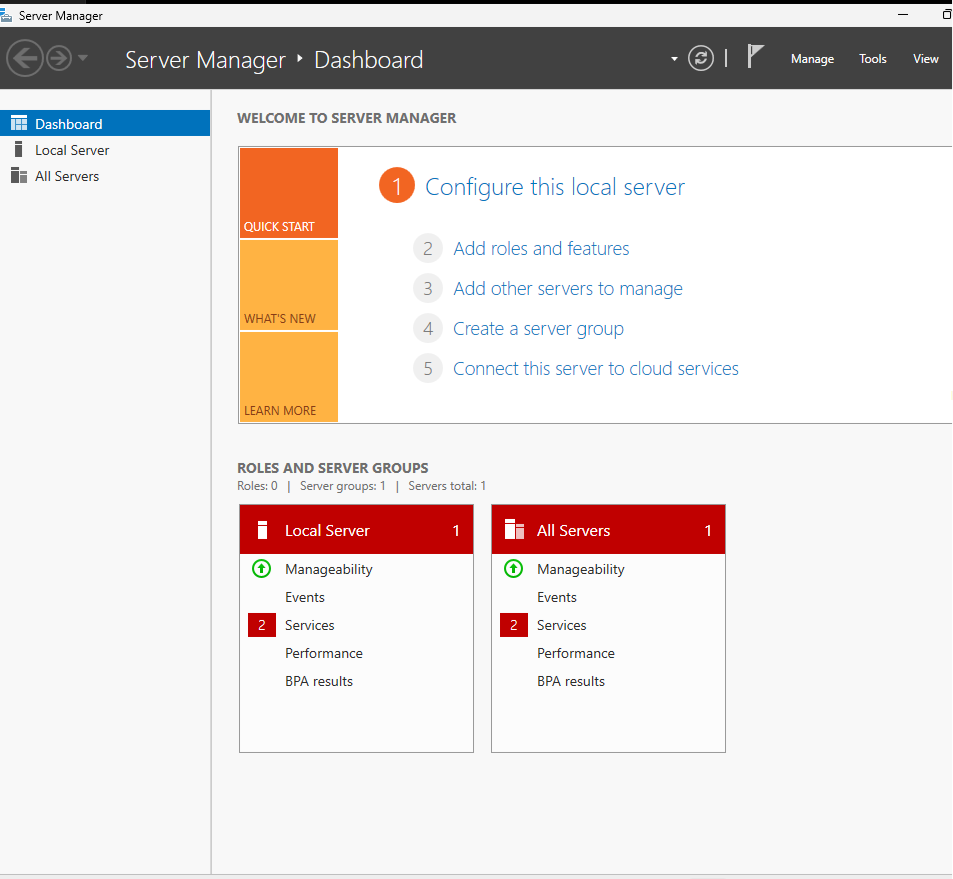
</p>

---

## Step 13 — Open Administrative Tools

Opened the Windows administrative tools available after promotion.

These tools provide interfaces for managing:

- Users
- Groups
- Computers
- Organizational Units
- Domains
- Trusts
- Sites
- Services
- Group Policy
- DNS

<p align="center">
  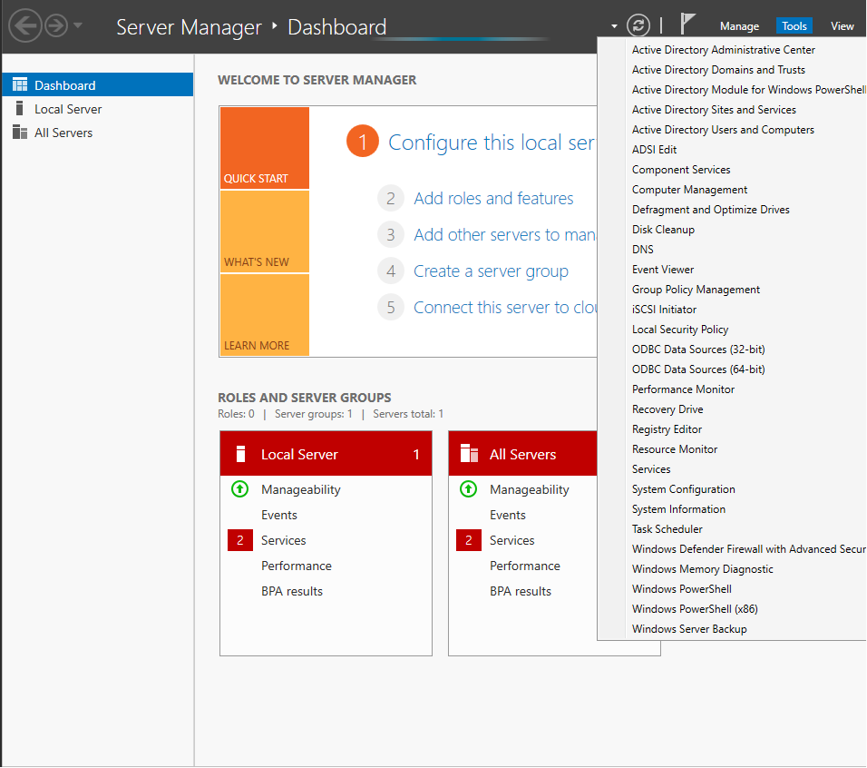
</p>

---

## Step 14 — Verify the Active Directory Domain

Opened Active Directory Users and Computers and confirmed that:

```text
homelab.local
```

was present.

The default Active Directory containers were visible, including locations for:

- Users
- Computers
- Domain Controllers
- Built-in groups

This confirmed that the domain had been created and that SRV01 was operating as a domain controller.

<p align="center">
  
</p>

---

# Active Directory Deployment Workflow

```text
Standalone Windows Server
          │
          ▼
Install AD DS Role
          │
          ▼
Add Management Tools
          │
          ▼
Promote Server
          │
          ▼
Create New Forest
          │
          ▼
Configure homelab.local
          │
          ▼
Install DNS
          │
          ▼
Configure Database and SYSVOL
          │
          ▼
Run Prerequisites Check
          │
          ▼
Restart Server
          │
          ▼
SRV01 Becomes Domain Controller
          │
          ▼
Verify Active Directory Domain
```

---

# Technical Decisions

## Why Create a New Forest?

No Active Directory environment existed before this module.

A new forest was therefore required to establish the first domain and directory structure.

---

## Why Use `homelab.local`?

The domain name clearly identifies the environment as a private learning lab.

It keeps the lab separate from any real public domain owned by an organization.

For a new production design, a subdomain of a registered public domain is usually a better naming choice.

Example:

```text
ad.example.com
```

This homelab continues using:

```text
homelab.local
```

because it was already selected for the existing lab design.

---

## Why Install DNS with Active Directory?

Active Directory relies on DNS to locate domain services.

Without properly configured DNS, clients may experience problems with:

- Domain joins
- Authentication
- Group Policy
- Service discovery
- Domain-controller communication

Installing DNS during promotion created the DNS infrastructure required by the new domain.

---

## Why Use SRV01 as the First Domain Controller?

SRV01 was already configured with:

- A consistent hostname
- A static IP address
- Windows Server 2025
- Sufficient lab resources
- Stable VMware NAT networking

This made it suitable for the first domain-controller role in the homelab.

---

## Why Accept the Default Database Paths?

This homelab uses one virtual disk and has a small workload.

The default paths are sufficient for learning and testing.

In a larger environment, administrators may separate the operating system, database, logs, and SYSVOL based on:

- Performance requirements
- Recovery planning
- Storage design
- Monitoring
- Organizational standards

---

## Why Is the DNS Delegation Warning Acceptable?

A DNS delegation is normally created in a parent DNS zone.

This was a new isolated forest without an existing parent DNS infrastructure.

Because no parent zone existed, the warning was expected.

The warning was reviewed and understood rather than ignored blindly.

---

# Validation Results

| Validation Check | Result |
|------------------|--------|
| Add Roles and Features Wizard opened | ✅ |
| SRV01 selected as destination server | ✅ |
| Active Directory Domain Services role selected | ✅ |
| Required management tools added | ✅ |
| AD DS role installation completed | ✅ |
| Domain-controller promotion started | ✅ |
| New forest selected | ✅ |
| `homelab.local` configured | ✅ |
| DNS delegation warning reviewed | ✅ |
| NetBIOS name confirmed as `HOMELAB` | ✅ |
| Active Directory paths reviewed | ✅ |
| Prerequisites check completed | ✅ |
| SRV01 restarted after promotion | ✅ |
| Administrative tools available | ✅ |
| `homelab.local` visible in Active Directory | ✅ |
| User organizational structure created | ⏭️ Next module |
| Administrative groups created | ⏭️ Next module |
| Windows client joined to domain | ⏭️ Later module |
| Group Policy configured | ⏭️ Later module |
| Secondary domain controller deployed | ⏭️ Future improvement |

---

# Troubleshooting Notes

## AD DS Role Installed but No Domain Exists

Installing the role does not automatically create a domain.

The administrator must still select:

```text
Promote this server to a domain controller
```

Without promotion, the server remains a member or standalone server with the AD DS files installed.

---

## DNS Delegation Warning

A DNS delegation warning may appear during the creation of a new forest.

In an isolated new environment, this can be expected.

The administrator should still verify that the warning matches the design and is not hiding a real DNS configuration issue.

---

## Incorrect Domain Name

The domain name should be reviewed carefully before promotion.

Changing an Active Directory domain name later is significantly more complex than correcting it before deployment.

---

## Dynamic IP Address

A domain controller should use a stable IP address.

If the address changes unexpectedly, clients may fail to locate:

- DNS
- Kerberos
- LDAP
- Group Policy
- Domain-controller services

SRV01 was assigned a static address before promotion.

---

## Incorrect DNS Configuration

A domain controller should use DNS settings appropriate for the Active Directory environment.

Public DNS servers such as:

```text
8.8.8.8
```

do not contain the private Active Directory records required for `homelab.local`.

Public DNS resolution should normally be handled using DNS forwarders rather than configuring domain clients to bypass the domain DNS server.

---

## Domain Controller Promotion Failure

Useful areas to investigate include:

- Static IP configuration
- DNS settings
- Event Viewer
- Prerequisites-check messages
- Available disk space
- Administrator permissions
- Server restart state
- Existing role conflicts

Useful commands may include:

```powershell
Get-WindowsFeature AD-Domain-Services
```

```powershell
Get-Service NTDS
```

```powershell
Get-Service DNS
```

```powershell
Get-ADDomain
```

```powershell
Get-ADForest
```

---

# Security Notes

## Directory Services Restore Mode Password

The DSRM password is a sensitive recovery credential.

It should not be:

- Stored in the README
- Included in screenshots
- Committed to GitHub
- Reused for normal accounts
- Shared unnecessarily

---

## Domain Administrator Privileges

Domain-level administrative accounts have extensive control over the environment.

They should be:

- Used only when required
- Protected with strong passwords
- Monitored
- Separated from normal daily-use accounts
- Subject to least privilege

Later modules will introduce delegated administration and more structured account management.

---

## Single Domain Controller Risk

This homelab currently uses one domain controller.

If SRV01 becomes unavailable, the lab may lose:

- Domain authentication
- Active Directory
- DNS
- Group Policy processing
- Directory administration

A larger environment should normally have at least two domain controllers for availability and recovery.

---

## Backups

Active Directory requires more than copying ordinary files.

A proper recovery plan should include:

- System State backup
- Tested restore procedures
- DSRM credentials
- Backup monitoring
- Multiple domain controllers
- Recovery documentation

These topics are expanded in later infrastructure modules.

---

# Skills Demonstrated

- Active Directory Domain Services
- Windows Server 2025
- Domain Controller Promotion
- Active Directory Forest Creation
- Windows Domain Deployment
- DNS Integration
- NetBIOS Configuration
- SYSVOL Awareness
- Active Directory Administrative Tools
- Server Manager
- Identity Infrastructure
- Prerequisites Validation
- Technical Documentation
- Security Awareness

---

# Interview Notes

## What is Active Directory Domain Services?

Active Directory Domain Services is a centralized directory service used to manage users, groups, computers, authentication, policies, and access in a Windows domain environment.

---

## What is the difference between a domain and a forest?

A domain is an administrative boundary containing directory objects such as users, groups, and computers.

A forest is the highest-level Active Directory structure and can contain one or more domains that share a schema and configuration.

---

## What is a domain controller?

A domain controller is a Windows Server running Active Directory Domain Services.

It authenticates users and computers and provides access to directory information and domain services.

---

## Why does Active Directory depend on DNS?

Clients use DNS records to locate domain controllers and services such as Kerberos, LDAP, Global Catalog, and Group Policy.

Without working DNS, domain authentication and service discovery may fail.

---

## What is SYSVOL?

SYSVOL is a shared folder on domain controllers that stores Group Policy templates, scripts, and other domain-wide files.

---

## Why should a domain controller use a static IP address?

Clients and other servers must be able to locate the domain controller consistently.

If its address changes unexpectedly, DNS and authentication services may become unavailable.

---

## What is the purpose of the DSRM password?

The Directory Services Restore Mode password is used when starting a domain controller in a special recovery mode for Active Directory repair or restoration.

---

## Does installing the AD DS role automatically create a domain?

No.

After installing the role, the server must be promoted to a domain controller and configured as part of a new or existing forest or domain.

---

## Why should there be more than one domain controller?

Multiple domain controllers improve availability, authentication continuity, DNS redundancy, and recovery options.

If one server fails, another domain controller can continue servicing clients.

---

# What I Learned

The most important lesson from this module was the difference between installing Active Directory Domain Services and promoting a server to a domain controller.

I initially thought of Active Directory as one feature that could simply be installed.

The deployment showed that several components must work together:

```text
Stable server identity
+
Static network configuration
+
DNS
+
Domain-controller promotion
+
Directory database
+
SYSVOL
+
Authentication services
```

I also learned that warnings are not automatically errors.

The DNS delegation warning appeared during deployment, but it made sense in the context of a brand-new isolated forest with no parent DNS zone.

The correct response was to understand the message before deciding whether it required action.

This module also showed why the order of previous work mattered.

Configuring the hostname and static IP address before domain-controller promotion created a more stable foundation for Active Directory.

---

# Future Improvements

To make this Active Directory environment more resilient and closer to a larger organization, I would add:

- A second domain controller
- DNS redundancy
- Active Directory Sites and Services
- System State backups
- DSRM recovery testing
- Active Directory health checks
- Replication monitoring
- Time synchronization validation
- Active Directory Recycle Bin
- Fine-grained password policies
- Privileged administrative accounts
- Tiered administrative access
- Microsoft Entra ID integration
- Hybrid identity synchronization
- Automated domain-controller deployment using PowerShell

Example PowerShell deployment for a future lab:

```powershell
Install-WindowsFeature `
    -Name AD-Domain-Services `
    -IncludeManagementTools
```

```powershell
Install-ADDSForest `
    -DomainName "homelab.local" `
    -DomainNetbiosName "HOMELAB" `
    -InstallDNS
```

Passwords and other sensitive values should be entered securely and not stored directly in scripts.

---

# Key Takeaways

This module established the identity foundation of the homelab.

SRV01 was configured as:

```text
The first domain controller
```

for:

```text
homelab.local
```

The deployment included:

- Installing Active Directory Domain Services
- Adding management tools
- Creating a new forest
- Configuring the domain
- Integrating DNS
- Reviewing NetBIOS and SYSVOL settings
- Running prerequisites validation
- Verifying the completed domain

The main lesson was that Active Directory depends on several supporting components and must be built on a stable server and network configuration.

The environment is now ready for user, group, computer, and organizational-unit administration.

---

<div align="center">

### Module Status

✅ Completed Successfully

**Next Module:** [Active Directory Administration](../02-Active-Directory-Administration/)

</div>