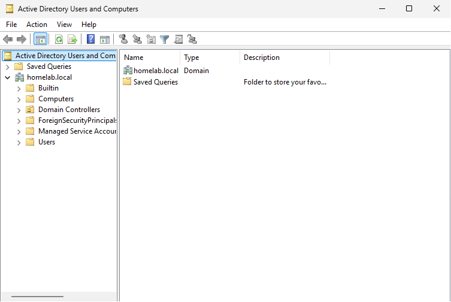
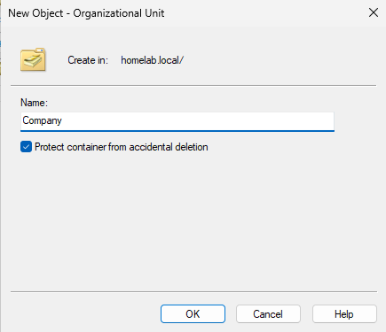
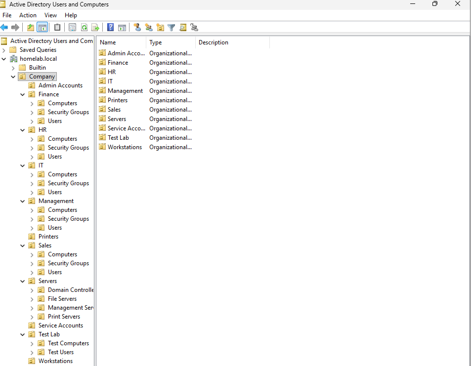
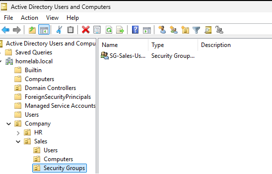
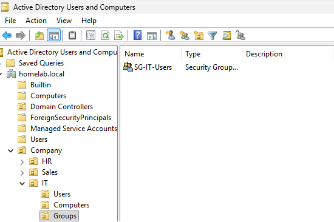
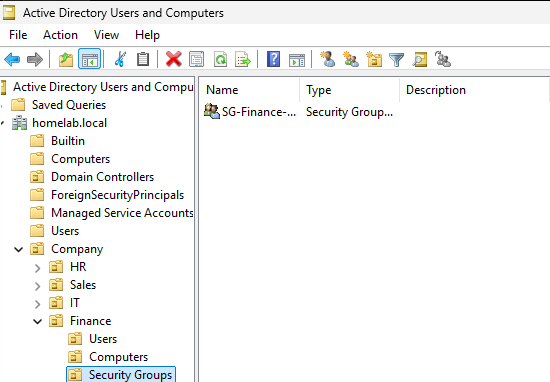
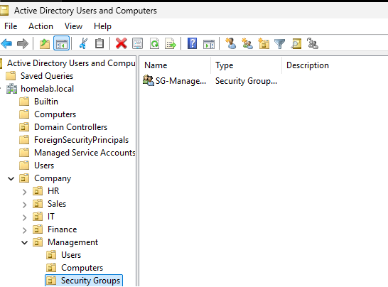
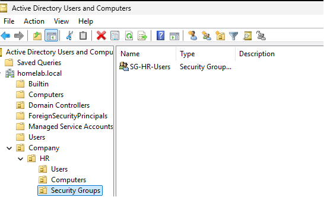
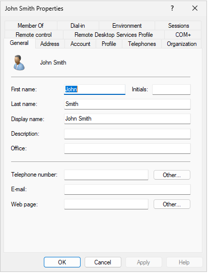
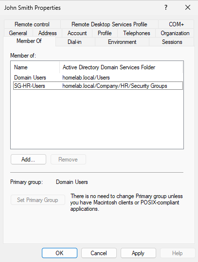

<div align="center">
  
</div>

---

# Overview

This module documents the initial administration of the `homelab.local` Active Directory domain after SRV01 was promoted to a domain controller.

The objective was to organize the directory using Organizational Units, create departmental security groups, provision a test user account, and assign the user to the appropriate group.

The following departments were represented in the lab:

- Human Resources
- Sales
- Information Technology
- Finance
- Management

The module focuses on the basic identity-management workflow used when an organization begins managing employee accounts and access centrally.

```text
Create Directory Structure
          ↓
Create Department Groups
          ↓
Create User Account
          ↓
Assign Group Membership
          ↓
Verify the Configuration
```

---

# Why I Built This Module

After creating the `homelab.local` domain, Active Directory contained only the default containers and objects.

The next challenge was learning how administrators organize users and computers in a way that remains understandable as the environment grows.

I wanted to understand the difference between:

- Organizational Units
- Security groups
- User accounts
- Group membership
- Permissions
- Group Policy targeting

Before this module, it was easy to think that an OU and a security group performed the same function because both can contain users.

I learned that they solve different problems:

```text
Organizational Units
=
Administration and Group Policy organization

Security Groups
=
Permissions and access control
```

This distinction is important because a well-organized directory makes future Group Policy, delegation, auditing, and automation easier to manage.

---

# Business Scenario

The organization has created its first Active Directory domain.

The IT team now needs a directory structure that represents the company's departments.

Management requires the following:

- Employees must be organized by department
- Departmental access must be controlled using groups
- New users must receive standardized account information
- Permissions should not be assigned directly to individual users
- The directory structure must support future Group Policy deployment
- The structure should remain understandable as more users and computers are added

The Infrastructure Team creates a company Organizational Unit structure and departmental security groups.

A test employee named **John Smith** is then created in the Human Resources department and added to the appropriate HR security group.

---

# Learning Objectives

By completing this module, I practiced the following:

- Opening Active Directory Users and Computers
- Navigating an Active Directory domain
- Understanding default containers
- Creating a company Organizational Unit
- Creating departmental Organizational Units
- Designing a basic Active Directory hierarchy
- Creating departmental security groups
- Understanding security group scope
- Creating a domain user account
- Assigning a user to a security group
- Understanding role-based access control
- Applying the principle of least privilege
- Separating directory organization from resource permissions
- Documenting identity-management changes

---

# Key Concepts Learned

## Active Directory Users and Computers

Active Directory Users and Computers, commonly called **ADUC**, is a Microsoft Management Console tool used to administer Active Directory objects.

It can be used to manage:

- Users
- Groups
- Computers
- Organizational Units
- Contacts
- Domain Controllers
- Object properties
- Group memberships

ADUC provides a graphical interface for many common directory-administration tasks.

---

## Organizational Units

An Organizational Unit, or OU, is a container used to organize Active Directory objects.

OUs can contain:

- Users
- Groups
- Computers
- Other Organizational Units

OUs are commonly used for:

- Group Policy targeting
- Administrative delegation
- Logical organization
- Automation scope
- Object management

In this lab, the directory was organized around company departments.

---

## Default Containers vs Custom OUs

Active Directory creates several default containers, including:

```text
Users
Computers
Builtin
Domain Controllers
```

The default `Users` and `Computers` locations are containers rather than standard Organizational Units.

Custom OUs provide more flexibility because administrators can:

- Link Group Policy Objects
- Delegate administrative control
- Build a clearer hierarchy
- Target automation more precisely

For this reason, company objects were placed into custom Organizational Units instead of relying only on the default containers.

---

## Security Groups

A security group is used to assign permissions to multiple users or computers.

Instead of assigning access directly to every employee, administrators assign permissions to a group and then manage the group's membership.

Example:

```text
John Smith
     ↓
HR Security Group
     ↓
Access to HR Resources
```

This is easier to manage than assigning permissions directly to John Smith.

---

## Group Scope

Active Directory security groups can use different scopes:

- Domain Local
- Global
- Universal

Departmental user groups are commonly created as **Global security groups** because their members normally belong to the same domain.

A common access-control design is:

```text
Accounts
   ↓
Global Group
   ↓
Domain Local Group
   ↓
Permission
```

This approach is often remembered as:

```text
AGDLP
```

Meaning:

```text
Accounts
→ Global Groups
→ Domain Local Groups
→ Permissions
```

This lab establishes the first part of that model by creating departmental global groups.

---

## Role-Based Access Control

Role-Based Access Control, or RBAC, assigns access according to a user's job function rather than assigning permissions individually.

Example:

```text
HR Employees
     ↓
HR Security Group
     ↓
HR Folder Access
```

When a new HR employee joins, the administrator adds the account to the HR group.

When the employee transfers departments, group membership can be changed without manually editing every resource permission.

---

## Least Privilege

The principle of least privilege means users should receive only the access necessary to perform their assigned work.

For example:

- HR users should not automatically receive Finance access
- Sales users should not receive administrative privileges
- Standard users should not be Domain Administrators
- IT permissions should be separated according to responsibility

Security groups help apply least privilege consistently.

---

## User Account

A domain user account represents an individual identity in Active Directory.

A user account can contain information such as:

- First name
- Last name
- Display name
- User logon name
- Department
- Email address
- Job title
- Manager
- Group memberships

The test user created in this module was:

```text
John Smith
```

The account was placed in the Human Resources organizational structure.

---

# Lab Environment Specifications

| Component | Configuration |
|------------|---------------|
| Hypervisor | VMware Workstation Pro |
| Server | SRV01 |
| Server Operating System | Windows Server 2025 Standard Evaluation |
| Active Directory Domain | homelab.local |
| NetBIOS Domain Name | HOMELAB |
| Domain Controller | SRV01 |
| Administration Tool | Active Directory Users and Computers |
| Company Structure | Department-based OUs |
| Group Type | Security |
| Group Purpose | Departmental access management |
| Test User | John Smith |
| Test Department | Human Resources |

---

# Folder Structure

```text
01-Identity-and-Access-Management
│
└── 02-Active-Directory-Administration
    │
    ├── README.md
    │
    └── Evidence
        └── Screenshots
            ├── 01-Open-Active-Directory-Users-and-Computers.png
            ├── 02-Create-Company-OU.png
            ├── 03-Enterprise-OU-Structure.png
            ├── 04-Create-Sales-Security-Group.png
            ├── 05-Create-IT-Security-Group.png
            ├── 06-Create-Finance-Security-Group.png
            ├── 07-Create-Management-Security-Group.png
            ├── 08-Create-HR-Security-Group.png
            ├── 09-Create-HR-User-John-Smith.png
            └── 10-HR-User-Added-to-Security-Group.png
```

---

# Step-by-Step Implementation

---

## Step 1 — Open Active Directory Users and Computers

Opened:

```text
Server Manager
      ↓
Tools
      ↓
Active Directory Users and Computers
```

Active Directory Users and Computers provides a graphical interface for managing directory objects within the `homelab.local` domain.

The console displayed the domain and its default containers.

<p align="center">
  
</p>

---

## Step 2 — Create the Company Organizational Unit

Created a top-level Organizational Unit to represent the company structure.

This parent OU provides one central location for company-managed Active Directory objects.

A dedicated company OU makes it easier to:

- Separate custom objects from default containers
- Apply Group Policy
- Delegate administrative control
- Run automation against a defined path
- Keep the directory easier to navigate

<p align="center">
  
</p>

---

## Step 3 — Build the Departmental OU Structure

Created a department-based Organizational Unit structure beneath the main company OU.

The structure included departments such as:

```text
Company
│
├── Human Resources
├── Sales
├── Information Technology
├── Finance
└── Management
```

This structure represents how users can be organized according to business function.

It will also support future tasks such as:

- Department-specific Group Policy
- Delegated administration
- User provisioning
- Auditing
- PowerShell automation
- Departmental reporting

<p align="center">
  
</p>

---

## Step 4 — Create the Sales Security Group

Created a departmental security group for Sales employees.

The group will eventually be used to grant Sales users access to resources such as:

- Sales shared folders
- Sales printers
- Sales applications
- Department-specific systems

Permissions should be assigned to the group rather than directly to each Sales employee.

<p align="center">
  
</p>

---

## Step 5 — Create the IT Security Group

Created a departmental security group for the Information Technology team.

The IT group represents users who perform technical support or infrastructure responsibilities.

Creating an IT group does not mean that every IT user should automatically receive Domain Administrator privileges.

Administrative permissions should still be separated according to role and least privilege.

<p align="center">
  
</p>

---

## Step 6 — Create the Finance Security Group

Created a departmental security group for Finance employees.

Finance resources may contain confidential information such as:

- Financial reports
- Payment records
- Budget documents
- Payroll data
- Audit information

A dedicated security group supports controlled access to these resources.

<p align="center">
  
</p>

---

## Step 7 — Create the Management Security Group

Created a departmental security group for members of Management.

The Management group can later be used to control access to resources intended for company leadership.

Group membership should be reviewed carefully because management resources may contain sensitive business information.

<p align="center">
  
</p>

---

## Step 8 — Create the HR Security Group

Created a departmental security group for Human Resources employees.

The HR group will later be used to control access to resources such as:

- Employee records
- Recruitment documents
- Personnel files
- HR forms
- Onboarding and offboarding documentation

Because HR information may contain sensitive personal data, access should be limited to approved users.

<p align="center">
  
</p>

---

## Step 9 — Create the HR User John Smith

Created a test domain user account for:

```text
John Smith
```

The account was created in the Human Resources Organizational Unit.

Creating the account in the correct OU ensures that the user is logically organized and can receive policies targeted to HR users in future modules.

When creating a real employee account, an administrator should verify:

- Correct spelling
- Unique username
- Department
- Job role
- Manager
- Required group memberships
- Password-handling procedure
- Start date
- Approval or service request

<p align="center">
  
</p>

---

## Step 10 — Add John Smith to the HR Security Group

Added John Smith to the Human Resources security group.

The resulting access relationship is:

```text
John Smith
     ↓
HR Security Group
     ↓
Future HR Resource Permissions
```

This approach avoids assigning permissions directly to the user account.

If John Smith later changes departments, the administrator can update the group membership instead of editing permissions on every HR resource.

<p align="center">
  
</p>

---

# Active Directory Administration Workflow

```text
Active Directory Domain
          │
          ▼
Create Company OU
          │
          ▼
Create Department OUs
          │
          ▼
Create Department Security Groups
          │
          ▼
Create User Account
          │
          ▼
Place User in Correct OU
          │
          ▼
Assign Department Group Membership
          │
          ▼
Validate Directory Structure
```

---

# OU and Group Design

```text
homelab.local
│
└── Company
    │
    ├── Human Resources
    │   ├── Users
    │   │   └── John Smith
    │   └── Groups
    │       └── HR Security Group
    │
    ├── Sales
    │   └── Sales Security Group
    │
    ├── Information Technology
    │   └── IT Security Group
    │
    ├── Finance
    │   └── Finance Security Group
    │
    └── Management
        └── Management Security Group
```

The exact OU hierarchy may be expanded later as more users, computers, groups, and policies are introduced.

---

# Technical Decisions

## Why Create a Top-Level Company OU?

A dedicated company OU separates custom organizational objects from Active Directory's default containers.

This makes the directory easier to manage and provides a clear location for:

- Group Policy
- Delegation
- Automation
- Departmental OUs
- Company-managed users and computers

---

## Why Organize Users by Department?

Department-based OUs make it easier to identify where users belong and apply policies according to business needs.

Examples include:

- HR drive mappings
- Sales desktop settings
- IT administrative tools
- Finance restrictions
- Management configurations

However, OU structure should be designed around administration and policy requirements rather than copying every detail of an organization chart.

---

## Why Use Security Groups?

Security groups allow administrators to manage access collectively.

Instead of assigning folder permissions to ten individual HR users, the administrator can assign the permission once to the HR security group.

Users receive the access when they become members of that group.

---

## Why Not Assign Permissions Directly to Users?

Direct user permissions become difficult to track as the number of users and resources grows.

For example:

```text
Direct Permission Model
John → HR Folder
Anna → HR Folder
Maria → HR Folder
```

A group-based model is easier to manage:

```text
John  ─┐
Anna  ─┼→ HR Security Group → HR Folder
Maria ─┘
```

When an employee leaves HR, the account can be removed from the group.

---

## Why Are OUs and Groups Different?

An OU is primarily used for organization, policy, and delegated administration.

A security group is primarily used for access and permissions.

```text
OU
=
Where the object is managed

Security Group
=
What the object can access
```

A user can exist in only one OU at a time but can belong to multiple security groups.

---

## Why Create Separate Department Groups?

Separate groups support least privilege.

A Human Resources employee should receive HR access without automatically receiving Finance, Sales, Management, or IT access.

Departmental groups make these access boundaries easier to understand and audit.

---

## Why Place John Smith in the HR OU?

John Smith was created as a Human Resources employee.

Placing the account in the HR OU supports:

- Logical organization
- HR-specific Group Policy
- Delegated HR account management
- Easier PowerShell queries
- Departmental auditing
- Standardized lifecycle automation

---

# Validation Results

| Validation Check | Result |
|------------------|--------|
| Active Directory Users and Computers opened | ✅ |
| Company OU created | ✅ |
| Departmental OU structure created | ✅ |
| Sales security group created | ✅ |
| IT security group created | ✅ |
| Finance security group created | ✅ |
| Management security group created | ✅ |
| HR security group created | ✅ |
| John Smith user account created | ✅ |
| John Smith placed in the HR structure | ✅ |
| John Smith added to the HR security group | ✅ |
| Resource permissions assigned through groups | ⏭️ File Services module |
| Group Policy linked to department OUs | ⏭️ Group Policy module |
| User creation automated | ⏭️ User Lifecycle Automation module |
| Access review process implemented | ⏭️ Future improvement |

---

# Troubleshooting Notes

## User Created in the Wrong OU

A user account may accidentally be created in the default `Users` container or in the wrong department.

Possible effects include:

- Incorrect Group Policy application
- Confusing directory organization
- Failed automation
- Incorrect delegation scope
- Inaccurate reporting

The account can be moved to the correct OU using Active Directory Users and Computers.

---

## User Cannot Access a Resource

Before changing permissions, check:

1. Is the user in the correct security group?
2. Is the security group assigned permission to the resource?
3. Has the user signed out and back in?
4. Is there a deny permission overriding access?
5. Is the resource available?
6. Is the user accessing the correct path?

Useful command:

```cmd
whoami /groups
```

This displays the security groups included in the user's current sign-in token.

---

## New Group Membership Is Not Active

A user's existing logon session may not immediately reflect newly added group membership.

The user may need to:

```text
Sign out
    ↓
Sign back in
```

This creates a new security token containing the updated group membership.

---

## Duplicate User Logon Name

Active Directory requires unique user logon names.

If another John Smith is hired, the organization needs a naming standard.

Examples:

```text
john.smith
john.smith2
jsmith
john.a.smith
```

The standard should be documented and applied consistently.

---

## Security Group Created in the Wrong Location

A security group can still function when stored in a different OU, but poor placement makes administration and automation more difficult.

Groups should be stored according to a consistent directory design.

---

## User Receives Too Much Access

Check whether the user belongs to:

- Multiple department groups
- Privileged groups
- Nested groups
- Old groups from a previous role
- Groups assigned broad access

Access should be reviewed whenever an employee changes roles.

---

# Security Notes

## Protect Privileged Groups

Membership in groups such as the following should be tightly controlled:

```text
Domain Admins
Enterprise Admins
Schema Admins
Administrators
Account Operators
Server Operators
Backup Operators
```

Department membership does not automatically justify administrative privileges.

---

## Use Named Administrator Accounts

Administrators should not use highly privileged accounts for ordinary activities such as:

- Email
- Web browsing
- Documentation
- Standard workstation use

A future design can separate:

```text
Derrick Perez
=
Standard daily account

Derrick Perez Admin
=
Administrative account
```

This reduces the exposure of privileged credentials.

---

## Do Not Store Passwords in GitHub

The password assigned to John Smith should not appear in:

- Screenshots
- README files
- Scripts
- Git history
- Notes
- Public reports

Test credentials should still be handled responsibly.

---

## Disable Accounts Instead of Immediately Deleting Them

When an employee leaves, immediately deleting the account can remove useful information and complicate investigation or recovery.

A safer offboarding workflow may include:

```text
Disable Account
      ↓
Reset Password
      ↓
Remove Access
      ↓
Move to Disabled Users OU
      ↓
Record Offboarding Date
      ↓
Delete According to Retention Policy
```

This is covered in a later module.

---

## Review Group Membership Regularly

Group membership can become outdated when employees:

- Transfer departments
- Change job roles
- Receive temporary access
- Leave the organization
- Complete a project

Access reviews help identify permissions that are no longer required.

---

# Useful PowerShell Commands

## View the domain

```powershell
Get-ADDomain
```

---

## List Organizational Units

```powershell
Get-ADOrganizationalUnit `
    -Filter * |
Select-Object Name, DistinguishedName
```

---

## List users

```powershell
Get-ADUser `
    -Filter * |
Select-Object Name, SamAccountName, Enabled
```

---

## List security groups

```powershell
Get-ADGroup `
    -Filter * |
Where-Object GroupCategory -eq "Security" |
Select-Object Name, GroupScope
```

---

## Check John Smith's group memberships

```powershell
Get-ADPrincipalGroupMembership `
    -Identity "john.smith" |
Select-Object Name, GroupScope, GroupCategory
```

The actual username must match the value created in the lab.

---

## Add a user to a group

```powershell
Add-ADGroupMember `
    -Identity "HR Security Group" `
    -Members "john.smith"
```

The exact group and username must be verified before running the command.

---

## Find users inside an OU

```powershell
Get-ADUser `
    -SearchBase "OU=Human Resources,OU=Company,DC=homelab,DC=local" `
    -Filter *
```

The distinguished name must match the actual OU structure.

---

# Skills Demonstrated

- Active Directory Administration
- Active Directory Users and Computers
- Organizational Unit Design
- User Account Provisioning
- Security Group Management
- Group Membership Administration
- Role-Based Access Control
- Least Privilege
- Identity and Access Management
- Directory Structure Planning
- Windows Server 2025
- Access-Control Fundamentals
- PowerShell Awareness
- Technical Documentation

---

# Interview Notes

## What is an Organizational Unit?

An Organizational Unit is an Active Directory container used to organize objects, apply Group Policy, and delegate administrative control.

---

## What is the difference between an OU and a security group?

An OU is used for organization, Group Policy, and administration.

A security group is used to assign permissions and access.

A user can exist in one OU at a time but can belong to multiple groups.

---

## Why should permissions be assigned to groups instead of users?

Group-based permissions are easier to manage, audit, and update.

When an employee joins or leaves a department, the administrator changes group membership instead of editing permissions on every resource.

---

## What is least privilege?

Least privilege means users receive only the access required to perform their job.

They should not receive unnecessary department access or administrative rights.

---

## What is role-based access control?

Role-based access control assigns permissions according to job function.

For example, HR employees receive access through an HR security group rather than through individual permissions.

---

## What is AGDLP?

AGDLP is a Microsoft access-management model:

```text
Accounts
→ Global Groups
→ Domain Local Groups
→ Permissions
```

User accounts are added to global role groups. Global groups are added to domain local resource groups, and permissions are assigned to the domain local groups.

---

## Why might a user need to sign out after being added to a group?

Windows includes group membership in the user's security token at sign-in.

Signing out and back in creates a new token containing the updated memberships.

---

## How would you verify a user's Active Directory groups?

From PowerShell:

```powershell
Get-ADPrincipalGroupMembership -Identity "username"
```

From the user session:

```cmd
whoami /groups
```

---

## Why create custom OUs instead of using the default Users container?

Custom OUs support Group Policy links, delegated administration, clearer organization, and more precise automation.

---

## Should all members of the IT department be Domain Administrators?

No.

IT users should receive only the administrative access required by their responsibilities.

Help Desk, desktop support, server administration, security operations, and domain administration should be separated where possible.

---

# What I Learned

The most important lesson from this module was understanding that Organizational Units and security groups serve different purposes.

At first, both looked like ways to place users into categories.

After building the structure, the difference became clearer:

```text
OU
=
Where the account is organized and managed

Security Group
=
Which resources the account can access
```

I also learned why direct user permissions become difficult to manage.

Adding John Smith to the HR group creates a reusable access model. Future HR employees can be added to the same group instead of receiving separate permissions.

This module also made me think about user creation as part of a larger lifecycle.

Creating the account is only one stage:

```text
Approval
   ↓
Account Creation
   ↓
OU Placement
   ↓
Group Assignment
   ↓
Access Validation
   ↓
Role Changes
   ↓
Offboarding
```

That lifecycle will be expanded in later automation and offboarding modules.

---

# Future Improvements

To make the directory structure more scalable, I would add:

- Separate `Users`, `Computers`, `Groups`, and `Service Accounts` OUs
- Standard group-naming conventions
- Description fields for every security group
- Group ownership documentation
- Separate privileged administrative accounts
- Department-specific computer OUs
- Delegated Help Desk permissions
- Automated user provisioning
- Approval-based group membership
- Temporary-access expiration
- Scheduled access reviews
- Disabled Users OU
- Service-account management
- PowerShell validation reports
- AGDLP-based file permissions

A more developed structure could look like:

```text
Company
│
├── Users
│   ├── Human Resources
│   ├── Sales
│   ├── Information Technology
│   ├── Finance
│   └── Management
│
├── Computers
│   ├── Workstations
│   ├── Laptops
│   └── Servers
│
├── Groups
│   ├── Role Groups
│   └── Resource Groups
│
├── Service Accounts
│
└── Disabled Objects
```

The best structure depends on administrative, Group Policy, automation, and reporting requirements.

---

# Key Takeaways

This module established the first organized identity structure inside the `homelab.local` domain.

The implementation included:

- Opening Active Directory Users and Computers
- Creating a company Organizational Unit
- Building department-based OUs
- Creating departmental security groups
- Creating the John Smith HR user account
- Assigning John Smith to the HR security group

The main lessons were:

```text
Use OUs for organization, policy, and delegation.
```

```text
Use security groups for permissions and access.
```

```text
Assign access to groups instead of individual users.
```

```text
Apply least privilege and review membership regularly.
```

The directory is now prepared for Windows client domain joining and Group Policy management.

---

<div align="center">

### Module Status

✅ Completed Successfully

**Next Module:** [Windows 11 Domain Join](../03-Windows-11-Domain-Join/)

</div>