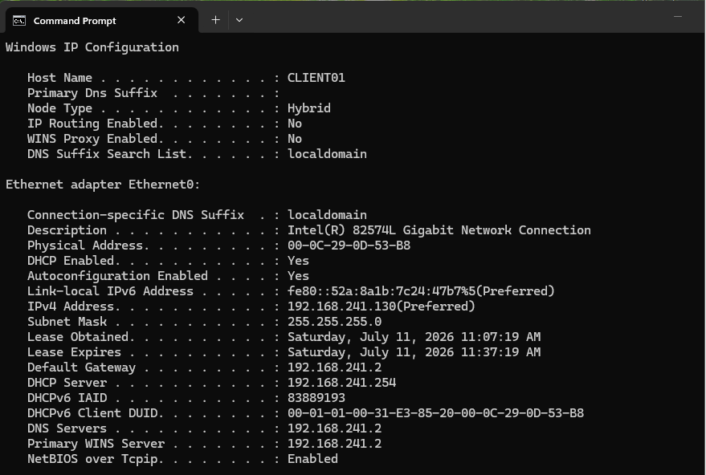
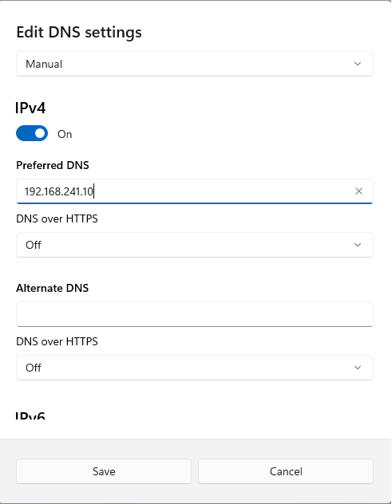
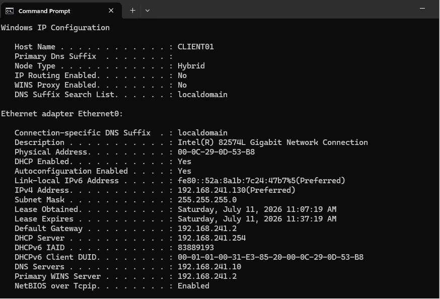
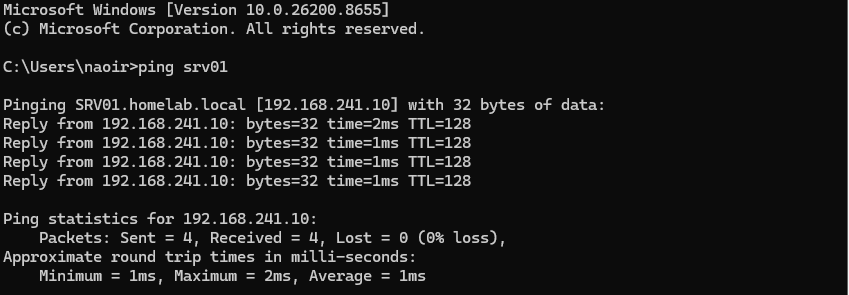
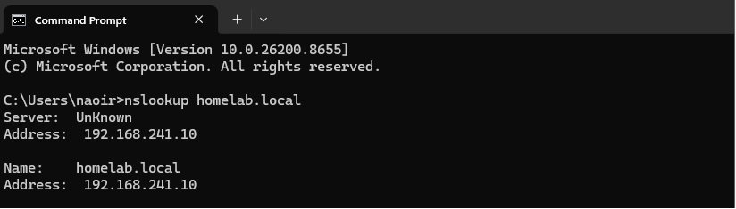
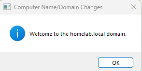
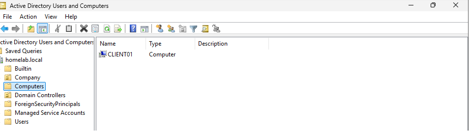
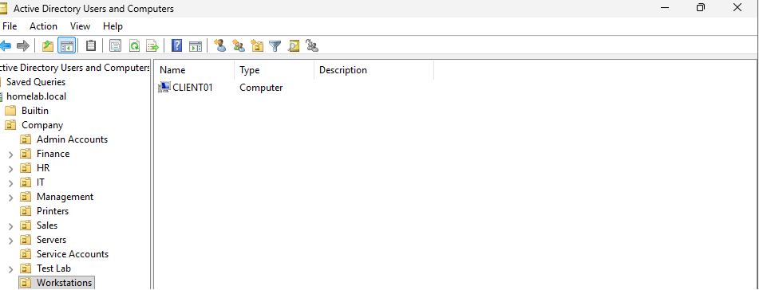

<div align="center">
  
</div>

---

# Overview

This module documents the process of joining a Windows 11 client computer named **CLIENT01** to the `homelab.local` Active Directory domain.

The objective was to move the client from a standalone workgroup computer into a centrally managed Windows domain.

The implementation included:

- Reviewing the existing client network configuration
- Configuring SRV01 as the client's DNS server
- Testing connectivity to the domain controller
- Confirming DNS resolution for `homelab.local`
- Joining CLIENT01 to the domain
- Signing in using a domain user account
- Verifying the CLIENT01 computer object in Active Directory
- Moving the computer object into the Workstations Organizational Unit

This module demonstrates the basic client-onboarding process used in Windows domain environments.

---

# Why I Built This Module

After creating the Active Directory domain and user structure, I needed to connect an actual Windows client to the environment.

Before this module, CLIENT01 operated as a standalone computer using local accounts.

That meant:

- The account existed only on CLIENT01
- Active Directory could not manage the computer
- Domain users could not sign in
- Group Policy could not apply
- The computer did not have a trust relationship with the domain

I wanted to understand how a Windows client discovers a domain controller, why DNS is required, and what changes after a computer joins a domain.

The most important lesson was that domain joining is not only a name-and-password process.

It depends on several components working together:

```text
Network Connectivity
+
Correct DNS Configuration
+
Domain Controller Availability
+
Valid Credentials
+
Computer Trust
```

---

# Business Scenario

The organization has deployed Active Directory and created its first employee accounts.

A new Windows 11 workstation has been prepared for an employee.

Before the employee can use the device, the IT team must:

- Confirm that the workstation can communicate with the domain controller
- Configure the workstation to use the internal DNS server
- Join the workstation to the company domain
- Confirm that a domain user can sign in
- Verify that the computer account exists in Active Directory
- Move the computer into the correct Organizational Unit

Joining the workstation to the domain allows the Infrastructure Team to manage the device centrally and prepares it for future security policies, software deployment, auditing, and access control.

---

# Learning Objectives

By completing this module, I practiced the following:

- Understanding local accounts and domain accounts
- Reviewing a Windows 11 client's network configuration
- Configuring an internal DNS server
- Verifying DNS settings
- Testing connectivity to a domain controller
- Testing domain-name resolution
- Joining Windows 11 to Active Directory
- Authenticating with a domain user account
- Understanding computer objects
- Understanding the machine trust relationship
- Verifying the client in Active Directory Users and Computers
- Moving a computer object into the correct OU
- Preparing a workstation for Group Policy management
- Troubleshooting common domain-join problems

---

# Key Concepts Learned

## Local Account

A local account exists only on one Windows computer.

Example:

```text
CLIENT01\LocalUser
```

The account can normally sign in only to CLIENT01 and is managed locally.

Local accounts may be appropriate for:

- Initial setup
- Recovery
- Standalone systems
- Emergency administration
- Devices outside a domain

They do not provide centralized identity management across multiple computers.

---

## Domain Account

A domain account is stored in Active Directory.

Example:

```text
HOMELAB\john.smith
```

or:

```text
john.smith@homelab.local
```

A domain account can be centrally managed and may be used to sign in to authorized domain-joined computers.

Administrators can manage:

- Password policies
- Group membership
- Account status
- Logon restrictions
- Access permissions
- Group Policy
- Auditing

---

## Domain Join

A domain join connects a Windows computer to an Active Directory domain.

During the process:

- The client locates a domain controller
- Domain credentials are verified
- A computer object is created or reused
- A machine password is established
- A trust relationship is created
- The client becomes manageable through the domain

The computer must restart before the domain membership becomes fully active.

---

## Computer Object

A computer object represents a domain-joined device in Active Directory.

The CLIENT01 computer object can later be used for:

- Group Policy
- Security-group membership
- Delegated administration
- Auditing
- Inventory
- Software deployment
- Device-based permissions

The computer object is separate from the employee's user account.

---

## Machine Trust Relationship

When a computer joins the domain, it establishes a secure trust relationship with Active Directory.

The workstation and domain maintain a machine-account password that is used for secure communication.

A broken trust relationship may produce errors such as:

```text
The trust relationship between this workstation and the primary domain failed.
```

Possible causes include:

- Restoring an old virtual-machine snapshot
- Resetting or deleting the computer object
- Machine-password mismatch
- Reusing a computer name incorrectly
- Replication problems

---

## DNS and Domain Joining

Active Directory depends on DNS service records to help clients find domain controllers.

CLIENT01 must use the internal Active Directory DNS server:

```text
192.168.241.10
```

Public DNS servers do not contain the private records for:

```text
homelab.local
```

For example, public DNS cannot provide the required Active Directory service records for:

- LDAP
- Kerberos
- Global Catalog
- Domain Controllers

This is why correct DNS configuration is one of the first checks during domain-join troubleshooting.

---

## Workgroup vs Domain

A workgroup is a decentralized model where each computer manages its own accounts and settings.

A domain is a centralized model where Active Directory manages users, computers, policies, and access.

```text
Workgroup
=
Each computer manages itself

Domain
=
Centralized administration through Active Directory
```

---

## Computer Organizational Units

Computer objects should be placed into appropriate Organizational Units instead of being left indefinitely in the default `Computers` container.

Custom OUs allow administrators to:

- Apply computer-based Group Policy
- Delegate support permissions
- Organize workstations and servers
- Target automation
- Create reports
- Separate device types

CLIENT01 was moved into the Workstations OU after the domain join.

---

# Lab Environment Specifications

| Component | Configuration |
|------------|---------------|
| Hypervisor | VMware Workstation Pro |
| Domain Controller | SRV01 |
| Domain Controller OS | Windows Server 2025 Standard Evaluation |
| Client Computer | CLIENT01 |
| Client Operating System | Windows 11 Enterprise |
| Active Directory Domain | homelab.local |
| NetBIOS Domain Name | HOMELAB |
| Domain Controller IP | 192.168.241.10 |
| Client DNS Server | 192.168.241.10 |
| Domain User | John Smith |
| Client OU | Workstations |
| Network Mode | VMware NAT |
| Administration Tool | Active Directory Users and Computers |

---

# Folder Structure

```text
01-Identity-and-Access-Management
│
└── 03-Windows-11-Domain-Join
    │
    ├── README.md
    │
    └── Evidence
        └── Screenshots
            ├── 01-Windows-11-Desktop.png
            ├── 02-Current-Network-Configuration.png
            ├── 03-DNS-Server-Configuration.png
            ├── 04-DNS-Configuration-Verification.png
            ├── 05-Ping-SRV01.png
            ├── 06-NSLookup-homelab.local.png
            ├── 07-Domain-Join-Success.png
            ├── 08-Domain-User-Desktop.png
            ├── 09-CLIENT01-Computer-Object.png
            └── 10-CLIENT01-in-Workstations-OU.png
```

---

# Step-by-Step Implementation

---

## Step 1 — Prepare the Windows 11 Client

Started the Windows 11 Enterprise virtual machine that would become the first domain-joined workstation.

The client was assigned the name:

```text
CLIENT01
```

Before the domain join, CLIENT01 operated as a standalone workstation using local authentication.

The desktop was reviewed to confirm that Windows 11 had started successfully and was ready for network configuration.

<p align="center">
  
</p>

---

## Step 2 — Review the Current Network Configuration

Opened the client's current network configuration before making changes.

The following values were reviewed:

- IPv4 address
- Subnet mask
- Default gateway
- DNS server
- DHCP status
- Network adapter

Reviewing the existing settings first helped confirm that CLIENT01 was connected to the same VMware NAT network as SRV01.

Useful command:

```cmd
ipconfig /all
```

<p align="center">
  
</p>

---

## Step 3 — Configure SRV01 as the DNS Server

Opened the IPv4 network settings and configured CLIENT01 to use:

```text
Preferred DNS Server: 192.168.241.10
```

This is the IP address of SRV01, which hosts the DNS service used by the `homelab.local` domain.

The client must use the Active Directory DNS server so it can locate:

- Domain controllers
- LDAP services
- Kerberos services
- Global Catalog services
- Domain records

Using only a public DNS server would prevent CLIENT01 from locating private Active Directory records.

<p align="center">
  
</p>

---

## Step 4 — Verify the DNS Configuration

Opened Command Prompt and verified that the DNS configuration had been applied.

Command used:

```cmd
ipconfig /all
```

The output was checked to confirm that the DNS server was:

```text
192.168.241.10
```

This step was completed before attempting the domain join because incorrect DNS is one of the most common causes of Active Directory join failures.

<p align="center">
  
</p>

---

## Step 5 — Test Connectivity to SRV01

Tested basic network communication between CLIENT01 and SRV01.

Command used:

```cmd
ping 192.168.241.10
```

A successful response confirmed that CLIENT01 could reach the domain controller by IP address.

This test verified basic Layer 3 connectivity, but it did not yet prove that DNS or Active Directory services were working.

<p align="center">
  
</p>

---

## Step 6 — Test Domain Name Resolution

Used `nslookup` to test whether CLIENT01 could resolve the domain name.

Command used:

```cmd
nslookup homelab.local
```

This test verified that CLIENT01 was querying the correct DNS server and could resolve the private domain.

A successful DNS test showed that the client was ready to locate Active Directory services.

<p align="center">
  
</p>

---

## Step 7 — Join CLIENT01 to the Domain

Opened the Windows system settings and changed the computer membership from a workgroup to the domain:

```text
homelab.local
```

Authorized domain credentials were provided when requested.

The domain returned a success message confirming that CLIENT01 had joined `homelab.local`.

The computer was then restarted so the new domain membership and machine trust could become active.

<p align="center">
  
</p>

---

## Step 8 — Sign In Using a Domain Account

After restarting CLIENT01, signed in using the domain user account created in the previous module.

The account could be entered using either format:

```text
HOMELAB\john.smith
```

or:

```text
john.smith@homelab.local
```

A successful sign-in confirmed that:

- CLIENT01 recognized the domain
- The domain controller was reachable
- DNS was functioning
- The account credentials were valid
- Domain authentication succeeded

<p align="center">
  
</p>

---

## Step 9 — Verify the CLIENT01 Computer Object

Opened Active Directory Users and Computers on SRV01.

Verified that a computer object named:

```text
CLIENT01
```

had been created in Active Directory.

The computer object confirmed that the workstation was registered as a domain member.

Newly joined computers commonly appear in the default:

```text
Computers
```

container unless a different location is configured.

<p align="center">
  
</p>

---

## Step 10 — Move CLIENT01 to the Workstations OU

Moved the CLIENT01 computer object from the default container into the Workstations Organizational Unit.

The resulting structure was:

```text
homelab.local
│
└── Company
    └── Computers
        └── Workstations
            └── CLIENT01
```

Placing CLIENT01 in the correct OU prepares the computer for:

- Computer-based Group Policy
- Security baselines
- Software deployment
- Administrative delegation
- Device reporting
- Automation

<p align="center">
  
</p>

---

# Domain Join Workflow

```text
Standalone Windows 11 Client
              │
              ▼
Review Network Configuration
              │
              ▼
Configure Internal DNS
              │
              ▼
Verify DNS Settings
              │
              ▼
Test Connectivity to SRV01
              │
              ▼
Resolve homelab.local
              │
              ▼
Join CLIENT01 to Domain
              │
              ▼
Restart Client
              │
              ▼
Sign In with Domain User
              │
              ▼
Verify Computer Object
              │
              ▼
Move CLIENT01 to Workstations OU
```

---

# Authentication Flow

```text
John Smith enters domain credentials
                │
                ▼
CLIENT01 queries DNS
                │
                ▼
DNS locates SRV01
                │
                ▼
CLIENT01 contacts domain controller
                │
                ▼
Active Directory validates credentials
                │
                ▼
Domain logon token is created
                │
                ▼
User desktop loads
```

---

# Technical Decisions

## Why Configure DNS Before Joining the Domain?

Active Directory uses DNS records to advertise domain controllers and services.

If CLIENT01 uses an incorrect DNS server, it may still have internet access but fail to find `homelab.local`.

That can produce errors such as:

```text
An Active Directory Domain Controller for the domain could not be contacted.
```

Configuring SRV01 as the DNS server was therefore required before the domain join.

---

## Why Test IP Connectivity and DNS Separately?

A ping by IP address verifies basic network connectivity.

A DNS query verifies name resolution.

These are related but different tests.

```text
Ping by IP succeeds
+
DNS lookup fails
=
Network works, but DNS requires investigation
```

Testing them separately helps narrow the problem.

---

## Why Restart After the Domain Join?

The restart activates the new domain membership and machine trust relationship.

It also allows the Windows sign-in screen to offer domain authentication.

---

## Why Use a Domain Account After Joining?

A successful domain-account sign-in validates more than the join message alone.

It confirms that:

- The computer can locate the domain
- The trust relationship works
- Authentication succeeds
- The user account is enabled
- DNS and network communication are functional

---

## Why Move CLIENT01 Out of the Default Computers Container?

The default `Computers` container cannot be used like a normal OU for Group Policy linking.

Moving CLIENT01 into a custom Workstations OU allows administrators to apply:

- Security policies
- Firewall settings
- Desktop restrictions
- Software settings
- Update policies
- Device-specific configurations

---

## Why Keep User and Computer Objects Separate?

User and computer policies target different types of objects.

```text
User Configuration
=
Follows the employee account

Computer Configuration
=
Follows the workstation
```

Separating users and computers into appropriate OUs improves Group Policy design and troubleshooting.

---

# Validation Results

| Validation Check | Result |
|------------------|--------|
| CLIENT01 started successfully | ✅ |
| Existing network configuration reviewed | ✅ |
| SRV01 configured as DNS server | ✅ |
| DNS configuration verified | ✅ |
| CLIENT01 reached SRV01 by IP address | ✅ |
| `homelab.local` resolved successfully | ✅ |
| CLIENT01 joined the domain | ✅ |
| CLIENT01 restarted after domain join | ✅ |
| Domain user signed in successfully | ✅ |
| CLIENT01 computer object created | ✅ |
| CLIENT01 moved to Workstations OU | ✅ |
| Computer Group Policy configured | ⏭️ Later module |
| Software deployed centrally | ⏭️ Future module |
| Device compliance monitored | ⏭️ Future module |

---

# Troubleshooting Notes

## Domain Controller Cannot Be Contacted

Common causes include:

- Incorrect DNS server
- Domain name typed incorrectly
- Network connectivity failure
- DNS service unavailable
- Domain controller offline
- Firewall issue
- Incorrect system time

Useful commands:

```cmd
ipconfig /all
```

```cmd
ping 192.168.241.10
```

```cmd
nslookup homelab.local
```

```cmd
nslookup SRV01.homelab.local
```

```cmd
nltest /dsgetdc:homelab.local
```

---

## Internet Works but Domain Join Fails

This often indicates that the client is using public or external DNS instead of the internal Active Directory DNS server.

For example:

```text
Internet browsing works
Domain lookup fails
```

The administrator should check the DNS server configured on the client.

---

## Ping by IP Works but Hostname Fails

This suggests that basic connectivity is available but name resolution is failing.

Investigation should focus on:

- Client DNS settings
- DNS service status
- DNS records
- Firewall rules
- Search suffixes
- Cached DNS results

Useful commands:

```cmd
ipconfig /flushdns
```

```cmd
nslookup SRV01.homelab.local
```

```powershell
Resolve-DnsName SRV01.homelab.local
```

---

## Incorrect Domain Credentials

The domain join requires an account authorized to add computers to the domain.

The administrator should verify:

- Username format
- Password
- Account status
- Domain name
- Delegated rights
- Lockout state

Possible username formats:

```text
HOMELAB\Administrator
```

or:

```text
Administrator@homelab.local
```

---

## Duplicate Computer Name

A computer name must be unique within the domain.

If another object named CLIENT01 already exists, the administrator should determine whether it is:

- An active device
- An old object
- A stale object
- A restored VM
- An accidental duplicate

The existing object should not be deleted without understanding why it exists.

---

## Trust Relationship Failure

Possible symptoms:

```text
The trust relationship between this workstation and the primary domain failed.
```

Possible investigation steps:

1. Confirm DNS and connectivity
2. Confirm the computer object exists
3. Check system time
4. Test the secure channel
5. Reset the machine account if appropriate
6. Rejoin the domain only after understanding the cause

Useful PowerShell command:

```powershell
Test-ComputerSecureChannel -Verbose
```

Possible repair command:

```powershell
Test-ComputerSecureChannel `
    -Repair `
    -Credential HOMELAB\Administrator
```

Administrative credentials should be entered securely and never stored in the repository.

---

## Domain User Cannot Sign In

Check:

- Is the account enabled?
- Is the password correct?
- Is the account locked?
- Is the user selecting the domain sign-in option?
- Can CLIENT01 reach SRV01?
- Is DNS configured correctly?
- Is the system time synchronized?
- Does the computer trust remain healthy?

---

# Security Notes

## Use Authorized Accounts for Domain Join

Only approved accounts should be allowed to join computers to the domain.

In a larger environment, this right may be delegated to:

- Help Desk staff
- Desktop support technicians
- Endpoint administrators
- Provisioning automation

Domain Administrator credentials should not be used for every routine workstation join when less-privileged delegation is available.

---

## Protect Domain Credentials

Domain credentials should not appear in:

- Screenshots
- Documentation
- Scripts
- GitHub commits
- Command history
- Public notes

Screenshots should be reviewed before upload.

---

## Verify Device Ownership

Before joining a workstation to the domain, administrators should verify:

- Asset ownership
- Assigned user
- Serial number
- Device name
- Operating system edition
- Security status
- Approval ticket
- Intended OU

This reduces the risk of unauthorized systems being added to the domain.

---

## Use Separate Administrative Accounts

An administrator should not use a privileged domain account for normal work.

A future design may include:

```text
derrick.perez
=
Standard user account

derrick.perez-admin
=
Administrative account
```

This helps reduce exposure of privileged credentials.

---

## Apply Baselines After Joining

A newly joined workstation should receive security controls such as:

- Password and lockout policies
- Microsoft Defender settings
- Firewall rules
- Audit policies
- Screen-lock settings
- Restricted local administrator access
- Update policies
- Application controls

These are introduced in later modules.

---

# Useful Commands

## Review network settings

```cmd
ipconfig /all
```

---

## Test the domain controller by IP

```cmd
ping 192.168.241.10
```

---

## Test the domain controller by hostname

```cmd
ping SRV01.homelab.local
```

---

## Test DNS resolution

```cmd
nslookup homelab.local
```

```cmd
nslookup SRV01.homelab.local
```

---

## Locate a domain controller

```cmd
nltest /dsgetdc:homelab.local
```

---

## Display current identity

```cmd
whoami
```

Expected domain-user format:

```text
homelab\john.smith
```

---

## View domain information

```powershell
Get-CimInstance Win32_ComputerSystem |
Select-Object Name, Domain, PartOfDomain
```

---

## Check the secure channel

```powershell
Test-ComputerSecureChannel -Verbose
```

---

## View the client computer object

Run on SRV01:

```powershell
Get-ADComputer `
    -Identity "CLIENT01" `
    -Properties *
```

---

## Move the client using PowerShell

```powershell
Get-ADComputer `
    -Identity "CLIENT01" |
Move-ADObject `
    -TargetPath "OU=Workstations,OU=Computers,OU=Company,DC=homelab,DC=local"
```

The distinguished name must match the actual OU structure before running the command.

---

# Skills Demonstrated

- Windows 11 Administration
- Active Directory Domain Join
- Client Onboarding
- DNS Client Configuration
- Network Troubleshooting
- Domain Authentication
- Computer Object Management
- Organizational Unit Management
- Active Directory Users and Computers
- Machine Trust Relationships
- Windows Command Line
- Identity and Access Management
- Endpoint Preparation
- Technical Documentation
- Validation and Troubleshooting

---

# Interview Notes

## What happens when a computer joins an Active Directory domain?

A computer object is created in Active Directory, a machine account password is established, and a trust relationship is formed between the client and the domain.

The computer can then authenticate domain users and receive centralized policies.

---

## Why must a domain client use the Active Directory DNS server?

The client uses DNS service records to locate domain controllers and services such as Kerberos and LDAP.

Public DNS servers do not contain the private records for the internal Active Directory domain.

---

## What is the difference between a local account and a domain account?

A local account exists on one computer and is managed locally.

A domain account is stored in Active Directory and can be centrally managed and used across authorized domain-joined computers.

---

## How would you troubleshoot a domain-join failure?

I would check:

1. Client IP configuration
2. DNS server configuration
3. Connectivity to the domain controller
4. Domain-name resolution
5. Domain Controller availability
6. System time
7. Credential format and permissions
8. Existing computer-object conflicts
9. Relevant client and server event logs

---

## What command can locate a domain controller?

```cmd
nltest /dsgetdc:homelab.local
```

---

## Why should a computer object be moved into a custom OU?

A custom OU allows administrators to apply computer-based Group Policy, delegate administration, organize devices, and target automation.

---

## What is a trust relationship?

It is the secure relationship between a domain-joined computer and Active Directory.

It allows the computer and domain to authenticate each other.

---

## Why might a trust relationship fail after restoring a VM snapshot?

The restored computer may contain an older machine-account password than the one stored in Active Directory.

This creates a mismatch between the workstation and the domain.

---

## Does successful ping prove that a domain join will work?

No.

Ping only confirms basic network communication.

A domain join also requires:

- Correct DNS
- Active Directory service discovery
- Domain Controller availability
- Valid credentials
- Working time synchronization
- Required ports and services

---

## What is the difference between user and computer Group Policy?

User Configuration follows the user account.

Computer Configuration applies to the device regardless of which user signs in.

---

# What I Learned

The most important lesson from this module was that DNS is not optional in Active Directory.

At first, it was easy to think that if CLIENT01 could ping SRV01, the domain join should work.

The lab showed that basic IP connectivity and Active Directory service discovery are different.

```text
Ping by IP
=
The devices can communicate

DNS resolution
=
The client can locate domain services
```

I also learned that a successful join message is not the final validation.

I still needed to:

- Restart the workstation
- Sign in using a domain account
- Confirm the computer object
- Move the object into the correct OU

This created a more complete onboarding process.

The workflow I want to remember is:

```text
Configure DNS
      ↓
Test Connectivity
      ↓
Test Name Resolution
      ↓
Join Domain
      ↓
Restart
      ↓
Test Domain Sign-In
      ↓
Verify Computer Object
      ↓
Place Device in Correct OU
```

---

# Future Improvements

To make the client-onboarding process more scalable, I would add:

- PowerShell-based domain joining
- Standardized workstation naming
- Automated OU placement
- Help Desk delegation for domain joins
- Pre-created computer accounts
- Windows Autopilot
- Microsoft Intune enrollment
- Device compliance policies
- BitLocker deployment
- Microsoft Defender onboarding
- Local administrator management using Windows LAPS
- Automated software installation
- Asset-inventory records
- Join-validation scripts
- Formal onboarding tickets
- Hybrid Microsoft Entra join

Example PowerShell command for a future version:

```powershell
Add-Computer `
    -DomainName "homelab.local" `
    -Credential "HOMELAB\AuthorizedJoinAccount" `
    -Restart
```

Credentials should be entered interactively and not stored in plain text.

---

# Key Takeaways

This module connected the first Windows 11 workstation to the `homelab.local` domain.

The implementation included:

- Reviewing network settings
- Configuring SRV01 as the DNS server
- Testing IP connectivity
- Testing domain-name resolution
- Joining CLIENT01 to Active Directory
- Signing in with a domain user
- Verifying the computer object
- Moving CLIENT01 to the Workstations OU

The main lessons were:

```text
Active Directory depends on DNS.
```

```text
IP connectivity and name resolution must be tested separately.
```

```text
A domain join creates a computer object and trust relationship.
```

```text
The join is not fully validated until domain authentication works.
```

```text
Computer objects should be organized into custom OUs for management.
```

CLIENT01 is now ready to receive domain-based security settings through Group Policy.

---

<div align="center">

### Module Status

✅ Completed Successfully

**Next Module:** [Group Policy Hardening](../04-Group-Policy-Hardening/)

</div>