<div align="center">
  
</div>

---

# Overview

This module documents the deployment of **Windows Local Administrator Password Solution**, commonly known as **Windows LAPS**, in the `homelab.local` Active Directory environment.

The objective was to configure automatic management of the local administrator password on CLIENT01.

The implementation included:

- Verifying the Windows LAPS PowerShell commands
- Updating the Active Directory schema
- Granting computer self-permissions
- Creating a Windows LAPS Group Policy Object
- Configuring Active Directory password backup
- Configuring password length, complexity, and rotation
- Reviewing automatic local account management
- Applying the policy to CLIENT01
- Verifying Group Policy processing
- Retrieving the managed password from Active Directory
- Confirming the final LAPS configuration

This module demonstrates how organizations can reduce the security risk created by shared or reused local administrator passwords.

---

# Why I Built This Module

Local administrator accounts are often needed for:

- Troubleshooting
- Offline support
- Software installation
- Recovery
- Emergency administration

The problem occurs when many computers use the same local administrator password.

If one workstation is compromised and the password is discovered, an attacker may be able to reuse that credential on other computers.

This creates a path for lateral movement.

Before this module, I understood that passwords should be strong, but I had not fully considered the risk of using the same strong password on every workstation.

Windows LAPS solves that problem by giving each managed computer its own password and rotating it automatically.

The main security model is:

```text
Unique Password per Device
          +
Automatic Rotation
          +
Controlled Retrieval
          +
Centralized Backup
```

---

# Business Scenario

The organization manages several Windows workstations.

Each workstation has a local administrator account that may be required by the Help Desk for support and recovery.

Management identifies the following risks:

- The same local administrator password may be reused
- Passwords may remain unchanged for long periods
- Credentials may be shared informally
- Former technicians may still know local passwords
- A compromised password may work on multiple devices
- Password retrieval may not be controlled or audited

The Infrastructure Team must implement a solution that:

- Generates a unique password for every managed computer
- Rotates passwords automatically
- Stores passwords securely in Active Directory
- Limits who can retrieve them
- Allows authorized support staff to recover a device
- Reduces credential reuse across endpoints

Windows LAPS is selected for this purpose.

---

# Learning Objectives

By completing this module, I practiced the following:

- Understanding the purpose of Windows LAPS
- Identifying the risk of reused local administrator passwords
- Verifying Windows LAPS PowerShell support
- Updating the Active Directory schema
- Granting managed computers permission to update their own password attributes
- Creating a dedicated Windows LAPS GPO
- Configuring Active Directory as the password-backup directory
- Configuring password complexity and length
- Configuring password age and rotation
- Reviewing automatic local administrator account management
- Applying the LAPS policy to a Windows 11 client
- Verifying Group Policy processing
- Retrieving a managed password
- Understanding delegated password retrieval
- Protecting sensitive password evidence
- Troubleshooting common LAPS deployment problems

---

# Key Concepts Learned

## Windows LAPS

Windows LAPS is a Microsoft feature that manages local administrator passwords on Windows computers.

It can:

- Generate unique passwords
- Rotate passwords automatically
- Back up passwords to Active Directory or Microsoft Entra ID
- Control who can retrieve passwords
- Record password-expiration information
- Reduce password reuse
- Support account-management policies

In this homelab, passwords were backed up to:

```text
Active Directory
```

---

## Local Administrator Account

A local administrator account exists on an individual Windows computer.

Example:

```text
CLIENT01\Administrator
```

It is separate from domain accounts such as:

```text
HOMELAB\Administrator
```

or:

```text
HOMELAB\john.smith
```

The local account can remain useful if the domain is unavailable, but its password must be protected carefully.

---

## Password Reuse Risk

If the same local administrator password is used on many computers, compromising one system may expose access to others.

Example:

```text
CLIENT01 Local Admin Password
        =
CLIENT02 Local Admin Password
        =
CLIENT03 Local Admin Password
```

If one password is recovered, all three devices may be at risk.

Windows LAPS changes the model to:

```text
CLIENT01 = Unique Password A
CLIENT02 = Unique Password B
CLIENT03 = Unique Password C
```

---

## Lateral Movement

Lateral movement occurs when an attacker uses access from one compromised computer to reach other systems.

Reused local administrator credentials can make lateral movement easier.

Unique per-device passwords reduce that risk because a password obtained from CLIENT01 should not work on CLIENT02.

---

## Active Directory Schema

The Active Directory schema defines the object types and attributes that can exist in the directory.

Windows LAPS requires Active Directory attributes for storing information such as:

- Encrypted or clear-text managed password data
- Password expiration time
- Account-management information

The schema was updated using the Windows LAPS PowerShell module.

---

## Computer Self-Permission

The managed computer needs permission to write its own LAPS password and expiration information to Active Directory.

This is commonly granted at the OU level.

Example:

```text
Workstations OU
      ↓
CLIENT01 receives self-permission
      ↓
CLIENT01 writes its LAPS data
```

This does not give CLIENT01 permission to modify other computers.

---

## Password Backup Directory

Windows LAPS can back up passwords to:

- Active Directory
- Microsoft Entra ID

This homelab uses:

```text
Active Directory
```

The selected backup directory must match the identity infrastructure and management design.

---

## Password Rotation

Password rotation means that Windows automatically replaces the managed local administrator password after the configured age is reached.

Example:

```text
Password created
      ↓
Password remains valid for configured period
      ↓
Password expires
      ↓
New random password generated
      ↓
New password backed up
```

---

## Automatic Account Management

Windows LAPS can also manage aspects of the local administrator account.

Depending on the configured platform and policy, this can include:

- Selecting an existing account
- Managing a custom account
- Enabling or disabling the account
- Renaming or creating a managed account
- Randomizing account names in supported configurations

This feature should be planned carefully so the Help Desk knows which local account is being managed.

---

## Password Retrieval

Authorized administrators can retrieve the current managed password from Active Directory.

Password retrieval should be limited to approved roles such as:

- Help Desk
- Desktop Support
- Endpoint Administrators
- Security Operations
- Systems Administrators

Retrieving a password should be treated as privileged activity.

---

# Windows LAPS vs Legacy Microsoft LAPS

Legacy Microsoft LAPS required a separate installation package and additional management components.

Windows LAPS is built into supported modern Windows versions and provides expanded capabilities.

| Area | Legacy Microsoft LAPS | Windows LAPS |
|------|-----------------------|--------------|
| Deployment | Separate installation | Built into supported Windows versions |
| Active Directory backup | Supported | Supported |
| Microsoft Entra ID backup | Not supported | Supported |
| Password encryption | Limited legacy design | Supported in modern deployments |
| Automatic account management | Not available | Available on supported systems |
| Policy management | Legacy ADMX | Windows LAPS policy settings |
| PowerShell module | Legacy commands | `LAPS` PowerShell module |

This module uses **Windows LAPS**, not the legacy standalone product.

---

# Lab Environment Specifications

| Component | Configuration |
|------------|---------------|
| Domain Controller | SRV01 |
| Domain Controller OS | Windows Server 2025 Standard Evaluation |
| Managed Client | CLIENT01 |
| Client Operating System | Windows 11 Enterprise |
| Active Directory Domain | homelab.local |
| Managed Computer OU | Workstations |
| Password Backup | Active Directory |
| Policy Tool | Group Policy Management |
| PowerShell Module | LAPS |
| Validation Tools | `gpupdate`, `gpresult`, Event Viewer, LAPS PowerShell commands |
| Managed Account | Local administrator account |
| Password Retrieval | Authorized Active Directory administrator |

---

# Folder Structure

```text
01-Identity-and-Access-Management
│
└── 05-Windows-LAPS
    │
    ├── README.md
    │
    └── Evidence
        └── Screenshots
            ├── 01-Open-Server-Manager.png
            ├── 02-Verify-LAPS-Commands.png
            ├── 03-Update-LAPS-AD-Schema.png
            ├── 04-Grant-LAPS-Self-Permission.png
            ├── 05-Create-LAPS-GPO.png
            ├── 06-LAPS-Backup-Directory.png
            ├── 07-LAPS-Password-Policy.png
            ├── 08-LAPS-Automatic-Account-Management.png
            ├── 09-LAPS-GPO-Configured.png
            ├── 10-GPUpdate-Client01.png
            ├── 11-LAPS-Policy-Processing.png
            ├── 12-LAPS-GPO-Applied.png
            ├── 13-LAPS-Password-Retrieved.png
            └── 14-LAPS-Final-Configuration.png
```

---

# Step-by-Step Implementation

---

## Step 1 — Open Server Manager

Opened Server Manager on SRV01.

Server Manager provided access to the administration tools required for:

- Active Directory
- Group Policy
- PowerShell
- Server roles
- Domain management

This was the starting point for preparing the environment for Windows LAPS.

<p align="center">
  
</p>

---

## Step 2 — Verify Windows LAPS Commands

Opened PowerShell and verified that the Windows LAPS commands were available.

Example command:

```powershell
Get-Command -Module LAPS
```

This displays commands provided by the Windows LAPS PowerShell module.

Important commands include:

```powershell
Update-LapsADSchema
```

```powershell
Set-LapsADComputerSelfPermission
```

```powershell
Find-LapsADExtendedRights
```

```powershell
Get-LapsADPassword
```

```powershell
Reset-LapsPassword
```

Verifying the commands first confirmed that the system supported the management tasks required by the lab.

<p align="center">
  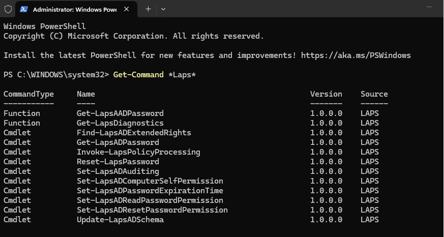
</p>

---

## Step 3 — Update the Active Directory Schema

Updated the Active Directory schema for Windows LAPS.

Command used:

```powershell
Update-LapsADSchema
```

This added the directory attributes required for Windows LAPS password and expiration information.

Schema changes affect the entire Active Directory forest and should therefore be:

- Planned
- Performed by an authorized administrator
- Documented
- Backed up
- Validated

In a production environment, schema changes should follow formal change-management procedures.

<p align="center">
  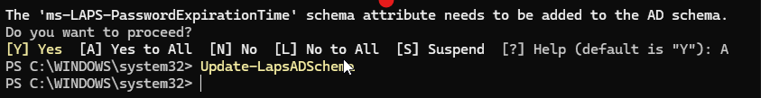
</p>

---

## Step 4 — Grant Computer Self-Permission

Granted the computers in the Workstations OU permission to update their own Windows LAPS attributes.

Example command:

```powershell
Set-LapsADComputerSelfPermission `
    -Identity "OU=Workstations,OU=Computers,OU=Company,DC=homelab,DC=local"
```

The exact distinguished name must match the real OU structure.

This permission allows each managed computer to write only its own password and expiration data.

<p align="center">
  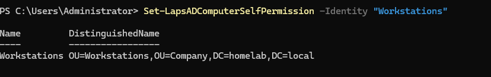
</p>

---

## Step 5 — Create the Windows LAPS GPO

Opened Group Policy Management and created a dedicated Group Policy Object for Windows LAPS.

Example GPO name:

```text
Windows LAPS Policy
```

Using a separate GPO makes the configuration easier to:

- Identify
- Test
- Troubleshoot
- Back up
- Change
- Audit

The GPO was linked to the OU containing CLIENT01.

<p align="center">
  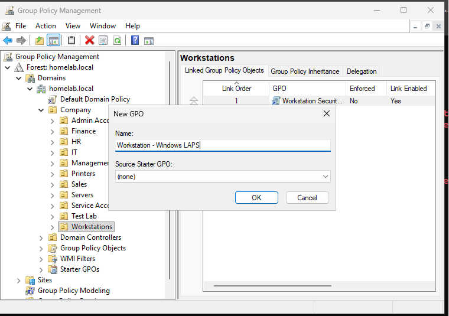
</p>

---

## Step 6 — Configure the Password Backup Directory

Configured Windows LAPS to back up the managed password to:

```text
Active Directory
```

This setting determines where Windows stores the password and expiration information.

In this homelab, Active Directory was the correct destination because CLIENT01 is joined to `homelab.local`.

<p align="center">
  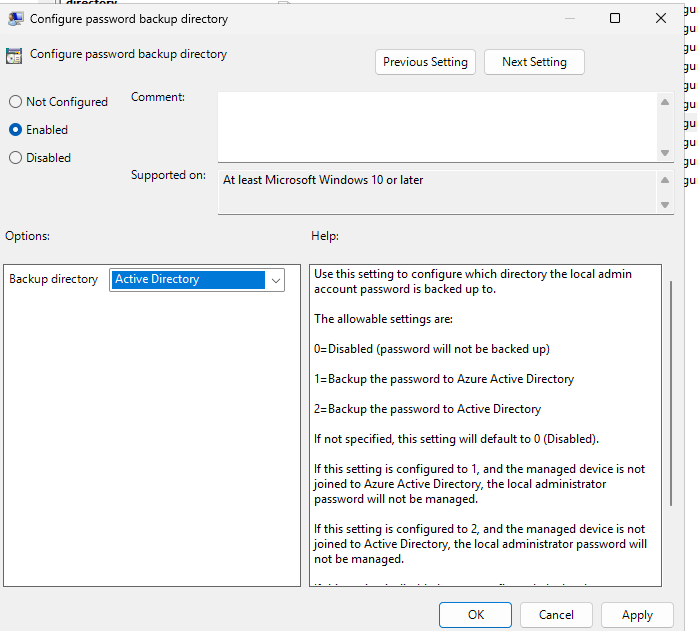
</p>

---

## Step 7 — Configure the Password Policy

Configured the Windows LAPS password policy.

The policy can define settings such as:

- Password complexity
- Password length
- Password age
- Rotation schedule

A strong managed password should be:

- Unique
- Random
- Long enough to resist guessing
- Automatically rotated
- Not manually reused

The exact policy should match the organization's security requirements.

<p align="center">
  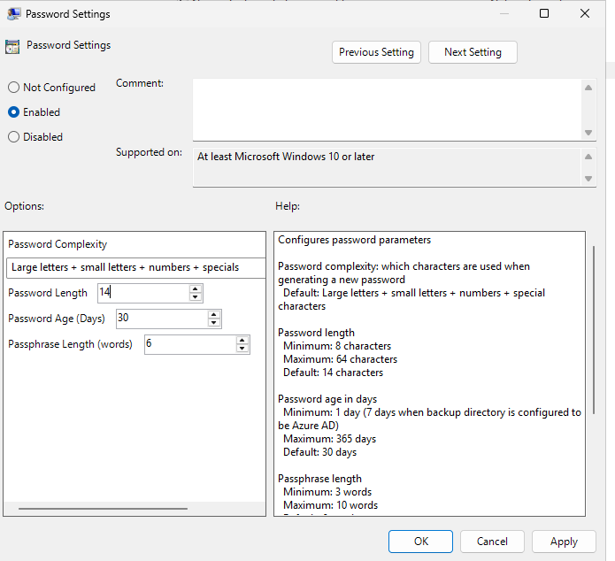
</p>

---

## Step 8 — Configure Automatic Account Management

Reviewed and configured Windows LAPS automatic account-management settings.

This determines how the local administrator account is handled.

Possible configuration areas include:

- Managing the built-in Administrator account
- Managing a custom local account
- Account enablement
- Account name handling
- Account creation on supported systems

This setting must match the actual account that the organization expects Help Desk staff to use.

<p align="center">
  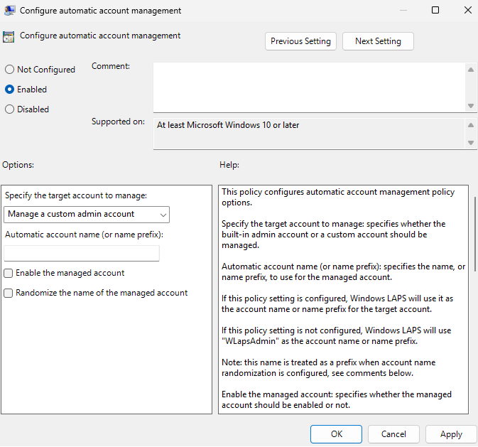
</p>

---

## Step 9 — Review the Completed LAPS GPO

Reviewed the final Windows LAPS Group Policy configuration.

The policy included the required settings for:

- Password backup
- Password generation
- Password rotation
- Local administrator account management
- Client processing

The GPO was linked to the correct workstation scope.

<p align="center">
  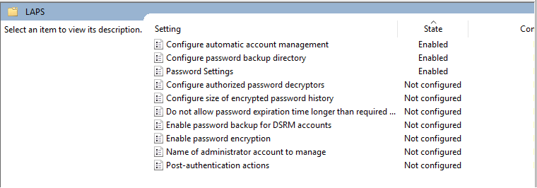
</p>

---

## Step 10 — Force Group Policy Update on CLIENT01

On CLIENT01, ran:

```cmd
gpupdate /force
```

This forced the computer to retrieve the newly configured Windows LAPS policy.

Computer-based settings may also require:

- Restart
- Background policy refresh
- LAPS processing cycle

<p align="center">
  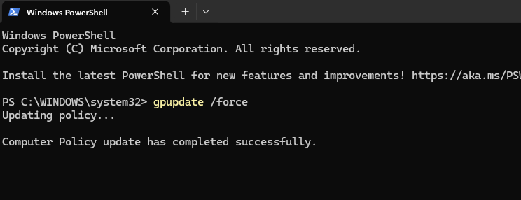
</p>

---

## Step 11 — Verify Windows LAPS Policy Processing

Reviewed Windows LAPS policy processing on CLIENT01.

Possible validation locations include:

```text
Event Viewer
    ↓
Applications and Services Logs
    ↓
Microsoft
    ↓
Windows
    ↓
LAPS
    ↓
Operational
```

The event log can show whether:

- Policy was discovered
- The account was found
- Password generation succeeded
- Active Directory backup succeeded
- A permission problem occurred
- Rotation was scheduled

<p align="center">
  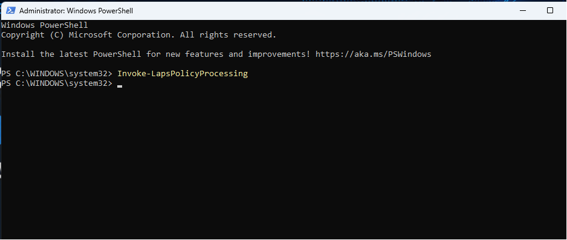
</p>

---

## Step 12 — Confirm the LAPS GPO Applied

Verified that the Windows LAPS GPO applied to CLIENT01.

Useful command:

```cmd
gpresult /r
```

A detailed report can also be generated:

```cmd
gpresult /h C:\Reports\LAPS-GPResult.html
```

This confirmed that CLIENT01 was in the correct GPO scope.

<p align="center">
  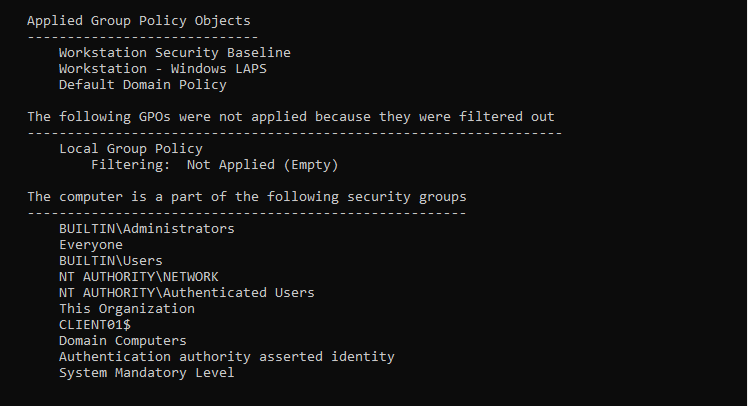
</p>

---

## Step 13 — Retrieve the Managed Password

Retrieved the current Windows LAPS password for CLIENT01 using an authorized account.

Example command:

```powershell
Get-LapsADPassword `
    -Identity "CLIENT01"
```

An authorized administrator may use:

```powershell
Get-LapsADPassword `
    -Identity "CLIENT01" `
    -AsPlainText
```

The output may include:

- Computer name
- Managed account
- Password
- Password expiration time
- Password-update status

> The password value must be redacted or blurred before publishing the screenshot in a public repository.

<p align="center">
  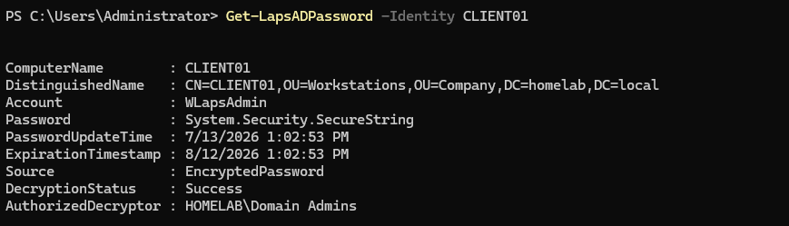
</p>

---

## Step 14 — Verify the Final Configuration

Reviewed the completed Windows LAPS configuration.

The final validation confirmed:

- Active Directory schema support was available
- CLIENT01 had permission to write its LAPS attributes
- The LAPS GPO was linked and applied
- Password backup was configured for Active Directory
- Password policy settings were configured
- The local administrator account was managed
- An authorized administrator could retrieve the password

<p align="center">
  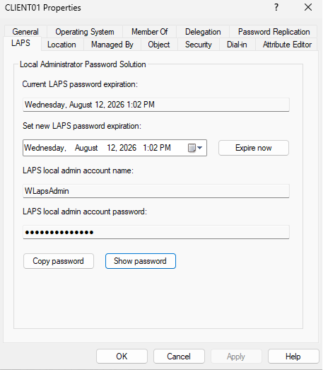
</p>

---

# Windows LAPS Workflow

```text
Prepare Active Directory
          │
          ▼
Update LAPS Schema
          │
          ▼
Grant Computer Self-Permission
          │
          ▼
Create Windows LAPS GPO
          │
          ▼
Configure Password Backup
          │
          ▼
Configure Password Policy
          │
          ▼
Configure Account Management
          │
          ▼
Apply GPO to CLIENT01
          │
          ▼
Generate Unique Password
          │
          ▼
Back Up Password to Active Directory
          │
          ▼
Authorized Retrieval
          │
          ▼
Automatic Rotation
```

---

# Security Model

```text
CLIENT01
   │
   ├── Unique Local Admin Password
   ├── Automatic Password Rotation
   └── Password Backed Up to AD
              │
              ▼
      Authorized Administrators
              │
              ▼
      Controlled Password Retrieval
```

---

# Validation Results

| Validation Check | Result |
|------------------|--------|
| Server Manager opened | ✅ |
| Windows LAPS commands verified | ✅ |
| Active Directory schema updated | ✅ |
| Computer self-permission granted | ✅ |
| Windows LAPS GPO created | ✅ |
| Password backup configured for Active Directory | ✅ |
| Password policy configured | ✅ |
| Automatic account management reviewed | ✅ |
| LAPS GPO configuration completed | ✅ |
| Group Policy refreshed on CLIENT01 | ✅ |
| Windows LAPS policy processing reviewed | ✅ |
| LAPS GPO confirmed as applied | ✅ |
| Managed password backed up | ✅ |
| Authorized password retrieval succeeded | ✅ |
| Password value protected in public evidence | Required before publishing |
| Password rotation tested | Future validation |

---

# Troubleshooting Notes

## Windows LAPS Commands Are Missing

Check:

- Operating system version
- Installed Windows updates
- PowerShell module availability
- Whether the command is being run on a supported system
- Administrative permissions

Command:

```powershell
Get-Command -Module LAPS
```

---

## Schema Update Fails

Possible causes include:

- Insufficient forest-level permissions
- Active Directory connectivity failure
- Replication issues
- Unsupported environment
- Previous incomplete schema update
- DNS problems

Check:

```powershell
Get-ADForest
```

```powershell
Get-ADDomain
```

```cmd
dcdiag
```

---

## Password Is Not Backed Up

Check:

1. Is the LAPS GPO applied?
2. Is Active Directory selected as the backup directory?
3. Does the computer have self-permission?
4. Is CLIENT01 in the correct OU?
5. Can CLIENT01 contact a domain controller?
6. Is DNS working?
7. Does Event Viewer show a LAPS error?
8. Has Group Policy refreshed?

Useful commands:

```cmd
gpupdate /force
```

```cmd
gpresult /r
```

```powershell
Invoke-LapsPolicyProcessing
```

---

## Access Denied When Retrieving Password

The account may not have permission to read the Windows LAPS password attributes.

Check delegated permissions.

Useful command:

```powershell
Find-LapsADExtendedRights `
    -Identity "OU=Workstations,OU=Computers,OU=Company,DC=homelab,DC=local"
```

Password retrieval should not be granted broadly.

---

## Wrong Local Account Is Being Managed

Check:

- Automatic account-management settings
- Configured account name
- Whether the account exists
- Built-in Administrator status
- GPO conflicts
- CLIENT01 event logs

The Help Desk must know which account Windows LAPS is managing.

---

## GPO Applies but Password Is Missing

This may indicate that policy delivery succeeded but LAPS processing failed.

Review:

```text
Event Viewer
→ Applications and Services Logs
→ Microsoft
→ Windows
→ LAPS
→ Operational
```

Possible causes include:

- Missing self-permission
- Schema problem
- Active Directory connectivity
- Unsupported account configuration
- Encryption or permissions problem
- Policy conflict

---

## Force Immediate Password Rotation

An administrator can request immediate rotation from the managed client:

```powershell
Reset-LapsPassword
```

or force processing:

```powershell
Invoke-LapsPolicyProcessing
```

These commands should be run only by authorized administrators and followed by validation.

---

# Security Notes

## Redact the Retrieved Password

The screenshot:

```text
13-LAPS-Password-Retrieved.png
```

must not display the real managed password publicly.

Before uploading to GitHub:

- Blur the password
- Cover the password
- Crop the value
- Replace it with `[REDACTED]`

Do not rely only on the README warning. The image itself must be safe.

---

## Restrict Password Readers

Not every domain user should be able to retrieve local administrator passwords.

Retrieval rights should be limited to approved support or administrative roles.

Example:

```text
Help Desk LAPS Readers
```

or:

```text
Endpoint Administrators
```

---

## Separate Retrieval and Administration

In a larger environment, the ability to retrieve a password should be separated from the ability to change LAPS configuration.

This supports least privilege and clearer auditing.

---

## Protect Domain Administrator Accounts

Domain Administrator credentials should not be used for routine password retrieval when delegated access is available.

A dedicated support group is safer and easier to audit.

---

## Rotate Passwords After Use

If a password is retrieved and used during a support session, the organization may require immediate rotation afterward.

This reduces the period during which the exposed password remains valid.

---

## Audit Password Retrieval

Password retrieval should be logged and reviewed.

A production process should record:

- Who requested the password
- Which device was involved
- Why access was required
- Ticket number
- Retrieval time
- Whether the password was rotated after use

---

# Useful PowerShell Commands

## List Windows LAPS commands

```powershell
Get-Command -Module LAPS
```

---

## Update the Active Directory schema

```powershell
Update-LapsADSchema
```

---

## Grant computer self-permission

```powershell
Set-LapsADComputerSelfPermission `
    -Identity "OU=Workstations,OU=Computers,OU=Company,DC=homelab,DC=local"
```

---

## Find delegated LAPS rights

```powershell
Find-LapsADExtendedRights `
    -Identity "OU=Workstations,OU=Computers,OU=Company,DC=homelab,DC=local"
```

---

## Retrieve password metadata

```powershell
Get-LapsADPassword `
    -Identity "CLIENT01"
```

---

## Retrieve the password in plain text

```powershell
Get-LapsADPassword `
    -Identity "CLIENT01" `
    -AsPlainText
```

Plain-text retrieval should be used only when required and should not be copied into public documentation.

---

## Force LAPS policy processing

Run on CLIENT01:

```powershell
Invoke-LapsPolicyProcessing
```

---

## Reset the local administrator password

Run on CLIENT01:

```powershell
Reset-LapsPassword
```

---

## Verify Group Policy

```cmd
gpresult /r
```

---

## Generate a Group Policy report

```cmd
gpresult /h C:\Reports\LAPS-GPResult.html
```

---

# Skills Demonstrated

- Windows LAPS
- Active Directory Schema Management
- Local Administrator Security
- Password Rotation
- Active Directory Permissions
- Group Policy Management
- Windows 11 Endpoint Management
- PowerShell
- Least Privilege
- Credential Protection
- Delegated Administration
- Group Policy Validation
- Event Log Analysis
- Identity and Access Management
- Security Hardening
- Technical Documentation

---

# Interview Notes

## What is Windows LAPS?

Windows LAPS is a Microsoft feature that automatically manages and rotates local administrator passwords on Windows devices.

It can back up passwords to Active Directory or Microsoft Entra ID and control who is allowed to retrieve them.

---

## Why is local administrator password reuse dangerous?

If the same local administrator password is used on multiple computers, an attacker who obtains it from one device may use it to access other devices.

This can support lateral movement.

---

## How does Windows LAPS reduce risk?

It gives each managed device a unique password, rotates it automatically, backs it up centrally, and limits retrieval to authorized users.

---

## What is the purpose of `Update-LapsADSchema`?

It adds the Active Directory schema attributes required by Windows LAPS.

---

## Why must computers receive self-permission?

The managed computer needs permission to write its own password and expiration data to its Active Directory computer object.

---

## How do you retrieve a Windows LAPS password?

An authorized administrator can use:

```powershell
Get-LapsADPassword -Identity "CLIENT01" -AsPlainText
```

The account must have permission to read the password.

---

## How would you troubleshoot a missing LAPS password?

I would check:

1. Whether the GPO applies
2. Whether Active Directory backup is configured
3. Whether the schema was updated
4. Whether the computer has self-permission
5. Whether the client can reach the domain controller
6. Whether DNS works
7. Windows LAPS operational events
8. Whether the correct account is managed

---

## What is the difference between Windows LAPS and legacy Microsoft LAPS?

Windows LAPS is built into supported modern Windows systems and includes capabilities such as Microsoft Entra ID backup, improved policy support, password encryption options, and automatic account management.

Legacy Microsoft LAPS required a separate package.

---

## Why should a password be rotated after Help Desk use?

Once the password has been viewed and used, it is no longer known only to the system.

Rotating it reduces the time that the exposed credential remains valid.

---

## Should every Help Desk technician be a Domain Administrator to retrieve LAPS passwords?

No.

Password retrieval should be delegated to a dedicated group with only the required read permission.

---

# What I Learned

The most important lesson from this module was that strong passwords are not enough when the same password is reused on many computers.

A single strong shared password can still create a serious security problem.

Windows LAPS changes the model from:

```text
One password known by many people
```

to:

```text
One unique password per managed device
```

I also learned that Windows LAPS is not only a Group Policy setting.

The complete deployment depends on:

```text
Active Directory schema
+
OU permissions
+
Group Policy
+
Client processing
+
Authorized retrieval
```

If one of these parts is missing, the policy may appear configured while the password is never backed up.

The workflow I want to remember is:

```text
Prepare AD
    ↓
Grant permissions
    ↓
Configure policy
    ↓
Apply policy
    ↓
Check events
    ↓
Retrieve password
    ↓
Protect the evidence
```

---

# Future Improvements

To expand this module, I would add:

- Delegated LAPS password-reader group
- Password-retrieval auditing
- Immediate password rotation after support use
- Encrypted password storage in Active Directory
- Microsoft Entra ID password backup
- Microsoft Intune policy deployment
- Multiple managed workstations
- Separate local admin account
- Automatic account-name randomization
- Help Desk recovery runbook
- PowerShell compliance report
- LAPS event forwarding
- SIEM alerting for password retrieval
- Expired-password monitoring
- Break-glass support procedure

---

# Key Takeaways

This module implemented centralized local administrator password management using Windows LAPS.

The deployment included:

- Verifying Windows LAPS commands
- Updating the Active Directory schema
- Granting computer self-permission
- Creating a dedicated LAPS GPO
- Configuring Active Directory password backup
- Configuring password and account-management settings
- Applying the policy to CLIENT01
- Validating policy processing
- Retrieving the managed password
- Reviewing the final configuration

The main lessons were:

```text
Do not reuse local administrator passwords.
```

```text
Use a unique password for every managed computer.
```

```text
Rotate passwords automatically.
```

```text
Limit password retrieval to authorized roles.
```

```text
Never expose managed passwords in screenshots or GitHub.
```

CLIENT01 now has a centrally managed local administrator password that can be retrieved only by an authorized administrator.

---

<div align="center">

### Module Status

✅ Completed Successfully

**Next Module:** [User Lifecycle Automation](../06-User-Lifecycle-Automation/)

</div>