<div align="center">
  
</div>

---

# Overview

This module documents the development of a PowerShell-based employee onboarding workflow for the `homelab.local` Active Directory environment.

The objective was to reduce the manual work required to create multiple employee accounts while maintaining consistent:

- Usernames
- Organizational Unit placement
- Department assignments
- Security-group memberships
- Initial passwords
- Account settings
- Validation and error reporting

The project evolved through several script versions:

```text
Onboarding.ps1
      ↓
Onboarding-v2.ps1
      ↓
Onboarding-v3.ps1
      ↓
Onboarding-v4.ps1
```

Each version added improvements such as input validation, duplicate-user detection, username generation, department mapping, password generation, security-group assignment, and reporting.

The final script used in this module is:

```text
Scripts/Onboarding-v4.ps1
```

---

# Why I Built This Module

Creating one Active Directory user manually is manageable.

Creating many users becomes repetitive and increases the chance of mistakes.

Without automation, an administrator may accidentally:

- Use inconsistent usernames
- Place users in the wrong OU
- Forget a required security group
- Reuse an initial password
- Create a duplicate account
- Miss required employee information
- Fail to record which accounts were created
- Continue after an error without noticing it

I wanted to understand how PowerShell can turn a repeated administrative task into a consistent and auditable workflow.

The most important lesson was that automation is not only about making a task faster.

A useful administrative script should also:

```text
Validate
    ↓
Create
    ↓
Verify
    ↓
Report
```

---

# Business Scenario

The organization is onboarding employees across several departments:

- Human Resources
- Sales
- Information Technology
- Finance
- Management

The Help Desk receives employee details in a CSV file.

The Infrastructure Team must create each account using a consistent process.

For every employee, the script should:

- Validate the required information
- Generate a unique username
- Check whether the account already exists
- Select the correct departmental OU
- Generate an initial password
- Create the Active Directory account
- Assign the correct departmental security group
- Require a password change at first sign-in
- Record successful and failed operations
- Confirm that the accounts appear in the correct OUs

The automation should reduce manual errors while still giving administrators clear evidence of what occurred.

---

# Learning Objectives

By completing this module, I practiced the following:

- Importing the Active Directory PowerShell module
- Reading user information from a CSV file
- Validating required input fields
- Generating standardized usernames
- Checking for existing Active Directory users
- Mapping departments to Organizational Units
- Mapping departments to security groups
- Generating initial passwords
- Creating Active Directory user accounts
- Requiring password changes at first sign-in
- Assigning security-group membership
- Handling errors with `try` and `catch`
- Creating success and error reports
- Verifying account placement
- Improving a script through multiple versions
- Understanding idempotency and safe reruns
- Avoiding plain-text credential exposure

---

# Key Concepts Learned

## User Lifecycle

The identity lifecycle is often described as:

```text
Joiner
Mover
Leaver
```

### Joiner

A new employee joins the organization.

Typical tasks include:

- Create account
- Assign username
- Set initial password
- Place account in the correct OU
- Add department groups
- Provide access

### Mover

An employee changes department or job role.

Typical tasks include:

- Update department
- Change group membership
- Remove old access
- Add new access
- Move the account to another OU
- Review privileges

### Leaver

An employee leaves the organization.

Typical tasks include:

- Disable account
- Reset password
- Remove group memberships
- Revoke access
- Move the account to a disabled-users OU
- Record the action
- Retain or delete the account according to policy

This module focuses on the **Joiner** stage.

---

## CSV-Driven Provisioning

A CSV file allows multiple users to be processed in one operation.

Example structure:

```csv
FirstName,LastName,Department,JobTitle
John,Smith,HR,HR Specialist
Anna,Cruz,Finance,Accountant
Mark,Santos,IT,Support Technician
```

Each row represents one employee.

The script reads each row and uses the values to create the account.

---

## Input Validation

Input validation checks whether required information is present and acceptable before the script creates an account.

Examples include checking:

- First name exists
- Last name exists
- Department is supported
- Username is not blank
- OU exists
- Security group exists
- Duplicate account does not already exist

Validation helps prevent incomplete or incorrectly placed accounts.

---

## Username Generation

A username standard creates predictable and consistent account names.

Example:

```text
First name: John
Last name: Smith
Username: john.smith
```

Possible standards include:

```text
john.smith
jsmith
johns
john.a.smith
```

The organization should select one standard and apply it consistently.

---

## Duplicate User Detection

Before creating an account, the script should check whether the generated username already exists.

Example:

```powershell
Get-ADUser -Filter "SamAccountName -eq '$Username'"
```

If an account exists, the script should:

- Skip the duplicate
- Generate an alternative username
- Record the error
- Request administrator review

It should not create conflicting identities silently.

---

## Department Mapping

The script maps each department to the correct Active Directory path.

Example:

```text
HR
→ HR Users OU
→ HR Security Group

Finance
→ Finance Users OU
→ Finance Security Group
```

This allows one script to process employees from several departments.

---

## Initial Password

The initial password should be:

- Random
- Complex
- Unique
- Temporary
- Protected
- Changed at first sign-in

The password should not be permanently stored in the script.

In a production workflow, credentials should be delivered through a secure approved channel rather than email or public reports.

---

## Error Handling

PowerShell error handling prevents one failed account from ending the entire onboarding process.

Example:

```powershell
try {
    # Create the user
}
catch {
    # Record the failure
}
```

A good automation workflow records:

- Which user failed
- When the error occurred
- What the error message was
- Whether processing continued
- What an administrator should review

---

## Idempotency

An idempotent script can be run more than once without creating duplicate or conflicting objects.

For onboarding, this requires checks such as:

- Does the account already exist?
- Is the user already in the group?
- Does the OU exist?
- Was the account already created during a previous run?

Safe reruns are important because scripts may stop partway through or need to be executed again after correcting data.

---

# Lab Environment Specifications

| Component | Configuration |
|------------|---------------|
| Domain Controller | SRV01 |
| Server Operating System | Windows Server 2025 Standard Evaluation |
| Active Directory Domain | homelab.local |
| Automation Language | PowerShell |
| PowerShell Module | ActiveDirectory |
| Input Method | CSV |
| Departments | HR, Sales, IT, Finance, Management |
| Final Script | `Onboarding-v4.ps1` |
| Account Destination | Departmental Organizational Units |
| Group Assignment | Departmental security groups |
| Password Handling | Generated initial password |
| First Sign-In | Password change required |
| Reporting | Success and error output |

---

# Folder Structure

```text
01-Identity-and-Access-Management
│
└── 06-User-Lifecycle-Automation
    │
    ├── README.md
    │
    ├── Evidence
    │   └── Screenshots
    │       ├── 01-AD-Module (2).png
    │       ├── 02-OU-Structure.png
    │       ├── 03-Security-Groups.png
    │       ├── 06-CSV-Validation.png
    │       ├── 07-Username-Generation.png
    │       ├── 08-Department-Mapping.png
    │       ├── 09-Existing-User-Check.png
    │       ├── 10-Success-Report-Generated.png
    │       ├── 11-Error-Report-Generated.png
    │       ├── 12-Password-Generation.png
    │       ├── 13-AD-Account-Creation.png
    │       ├── 14-Security-Group-Assignment.png
    │       └── 15-Users-Created-In-OU.png
    │
    └── Scripts
        ├── Onboarding.ps1
        ├── Onboarding-v2.ps1
        ├── Onboarding-v3.ps1
        └── Onboarding-v4.ps1
```

> `Onboarding-v4.ps1` is the final version used for the completed workflow. Earlier versions are retained to show how the script improved during development.

---

# Script Development History

## Version 1 — Basic User Creation

```text
Onboarding.ps1
```

The first version established the basic onboarding process.

Its purpose was to confirm that PowerShell could:

- Import employee data
- Connect to Active Directory
- Create user accounts
- Place users in Active Directory

---

## Version 2 — Validation Improvements

```text
Onboarding-v2.ps1
```

The second version introduced stronger input checks.

Improvements included:

- Required-field validation
- Department checking
- Better handling of incomplete rows
- More consistent output

---

## Version 3 — Duplicate and Mapping Logic

```text
Onboarding-v3.ps1
```

The third version expanded the workflow with:

- Username generation
- Existing-user detection
- Department-to-OU mapping
- Department-to-group mapping
- Safer account provisioning

---

## Version 4 — Final Workflow

```text
Onboarding-v4.ps1
```

The final version combined:

- CSV validation
- Username generation
- Duplicate-user detection
- OU mapping
- Security-group mapping
- Password generation
- Active Directory account creation
- Group assignment
- Success reporting
- Error reporting
- Final account validation

---

# Step-by-Step Implementation

---

## Step 1 — Import the Active Directory Module

Verified that the Active Directory PowerShell module was available.

Example command:

```powershell
Import-Module ActiveDirectory
```

The module provides commands such as:

```powershell
Get-ADUser
```

```powershell
New-ADUser
```

```powershell
Add-ADGroupMember
```

```powershell
Get-ADOrganizationalUnit
```

Without the Active Directory module, the onboarding script cannot manage domain objects.

<p align="center">
  
</p>

---

## Step 2 — Review the Organizational Unit Structure

Reviewed the existing Active Directory OU structure before writing the department-mapping logic.

The script requires valid destination paths for each employee.

Example:

```text
Company
│
├── Human Resources
├── Sales
├── Information Technology
├── Finance
└── Management
```

Each department in the CSV must map to a real OU.

<p align="center">
  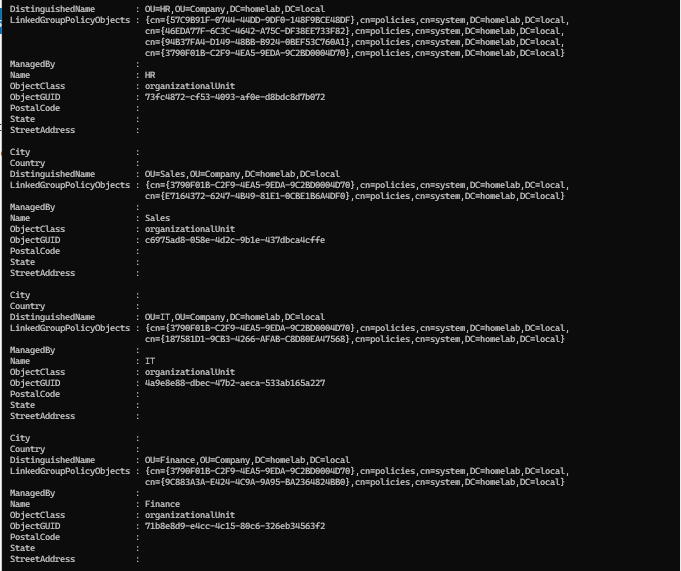
</p>

---

## Step 3 — Review Department Security Groups

Confirmed that the required departmental security groups existed.

Examples include:

- HR Security Group
- Sales Security Group
- IT Security Group
- Finance Security Group
- Management Security Group

The script uses these groups to assign the employee's initial department access.

<p align="center">
  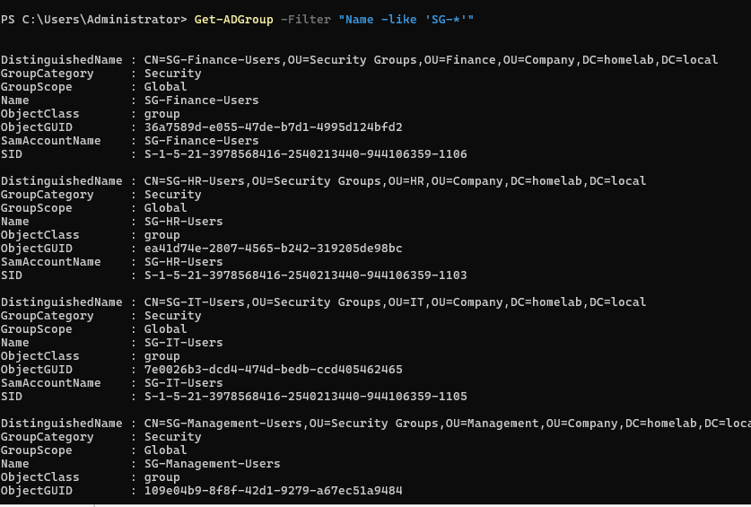
</p>

---

## Step 4 — Validate the CSV Input

Added validation logic to check employee data before account creation.

Example checks include:

```powershell
if (
    [string]::IsNullOrWhiteSpace($User.FirstName) -or
    [string]::IsNullOrWhiteSpace($User.LastName) -or
    [string]::IsNullOrWhiteSpace($User.Department)
) {
    # Record invalid input
}
```

Invalid rows should be skipped and recorded instead of creating incomplete accounts.

<p align="center">
  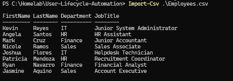
</p>

---

## Step 5 — Generate Standardized Usernames

Generated usernames according to a consistent naming convention.

Example:

```powershell
$Username = (
    "$($User.FirstName).$($User.LastName)"
).ToLower()
```

For:

```text
John Smith
```

the resulting username is:

```text
john.smith
```

The script should also remove unsupported characters and handle names that produce duplicate usernames.

<p align="center">
  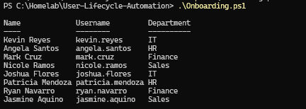
</p>

---

## Step 6 — Map Departments to OUs and Groups

Created department-mapping logic.

Example:

```powershell
switch ($User.Department) {
    "HR" {
        $OU = "OU=Human Resources,OU=Company,DC=homelab,DC=local"
        $Group = "HR Security Group"
    }

    "Sales" {
        $OU = "OU=Sales,OU=Company,DC=homelab,DC=local"
        $Group = "Sales Security Group"
    }

    "IT" {
        $OU = "OU=Information Technology,OU=Company,DC=homelab,DC=local"
        $Group = "IT Security Group"
    }

    "Finance" {
        $OU = "OU=Finance,OU=Company,DC=homelab,DC=local"
        $Group = "Finance Security Group"
    }

    "Management" {
        $OU = "OU=Management,OU=Company,DC=homelab,DC=local"
        $Group = "Management Security Group"
    }
}
```

The actual distinguished names must match the Active Directory environment.

<p align="center">
  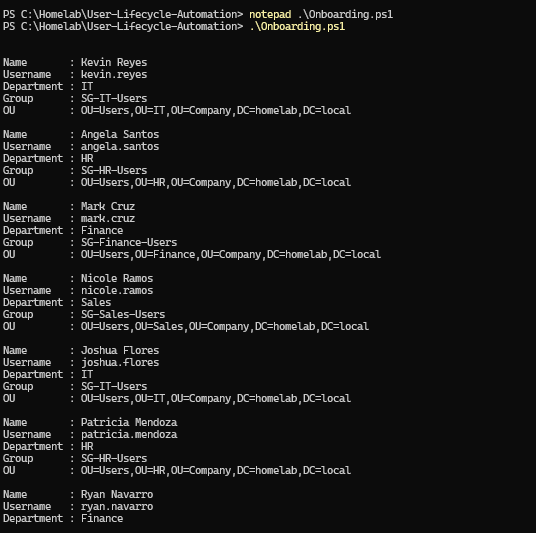
</p>

---

## Step 7 — Check for Existing Users

Added a duplicate-user check before account creation.

Example:

```powershell
$ExistingUser = Get-ADUser `
    -Filter "SamAccountName -eq '$Username'" `
    -ErrorAction SilentlyContinue
```

If an account already exists, the script records the conflict rather than trying to create the same username again.

This protects Active Directory from duplicate-account errors and accidental overwriting.

<p align="center">
  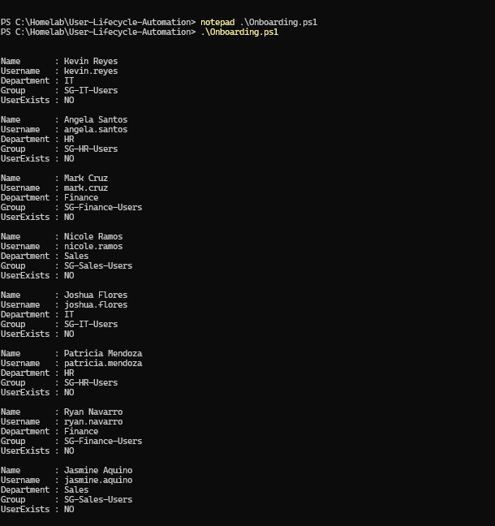
</p>

---

## Step 8 — Generate the Success Report

Created a success report for accounts that completed the onboarding process.

Useful report fields include:

- Employee name
- Username
- Department
- OU
- Security group
- Account-created status
- Timestamp

Example object:

```powershell
$SuccessResults += [PSCustomObject]@{
    Name       = "$($User.FirstName) $($User.LastName)"
    Username   = $Username
    Department = $User.Department
    OU         = $OU
    Group      = $Group
    Status     = "Created"
    Timestamp  = Get-Date
}
```

<p align="center">
  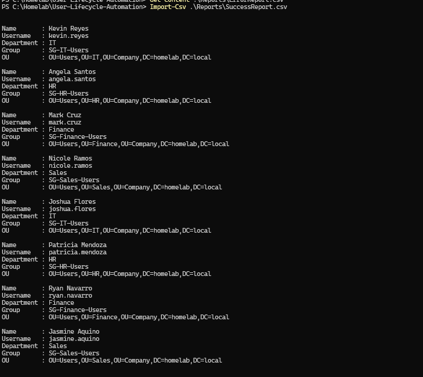
</p>

---

## Step 9 — Generate the Error Report

Created a separate report for users who could not be provisioned.

Possible error reasons include:

- Missing required field
- Unsupported department
- Duplicate username
- Missing OU
- Missing security group
- Password-generation error
- Active Directory creation failure
- Group-assignment failure

Example:

```powershell
$ErrorResults += [PSCustomObject]@{
    Name      = "$($User.FirstName) $($User.LastName)"
    Username  = $Username
    Error     = $_.Exception.Message
    Timestamp = Get-Date
}
```

<p align="center">
  
</p>

---

## Step 10 — Generate an Initial Password

Generated an initial password for each account.

A secure initial password should be:

- Random
- Unique
- Complex
- Temporary
- Changed at first sign-in

The password should be converted to a secure string before use with `New-ADUser`.

Example:

```powershell
$SecurePassword = ConvertTo-SecureString `
    $GeneratedPassword `
    -AsPlainText `
    -Force
```

The plain-text password should exist only for the minimum time required to create and securely deliver the credential.

<p align="center">
  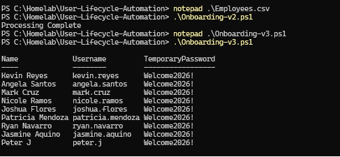
</p>

---

## Step 11 — Create the Active Directory Account

Created each account with `New-ADUser`.

Example:

```powershell
New-ADUser `
    -Name "$($User.FirstName) $($User.LastName)" `
    -GivenName $User.FirstName `
    -Surname $User.LastName `
    -DisplayName "$($User.FirstName) $($User.LastName)" `
    -SamAccountName $Username `
    -UserPrincipalName "$Username@homelab.local" `
    -Department $User.Department `
    -Path $OU `
    -AccountPassword $SecurePassword `
    -Enabled $true `
    -ChangePasswordAtLogon $true
```

The account was enabled and configured to require a password change at first sign-in.

<p align="center">
  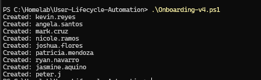
</p>

---

## Step 12 — Assign the Department Security Group

After the account was created, added the user to the correct departmental security group.

Example:

```powershell
Add-ADGroupMember `
    -Identity $Group `
    -Members $Username
```

This connected the user's department identity to future permissions and resources.

The resulting model was:

```text
Employee
    ↓
Department Security Group
    ↓
Department Resources
```

<p align="center">
  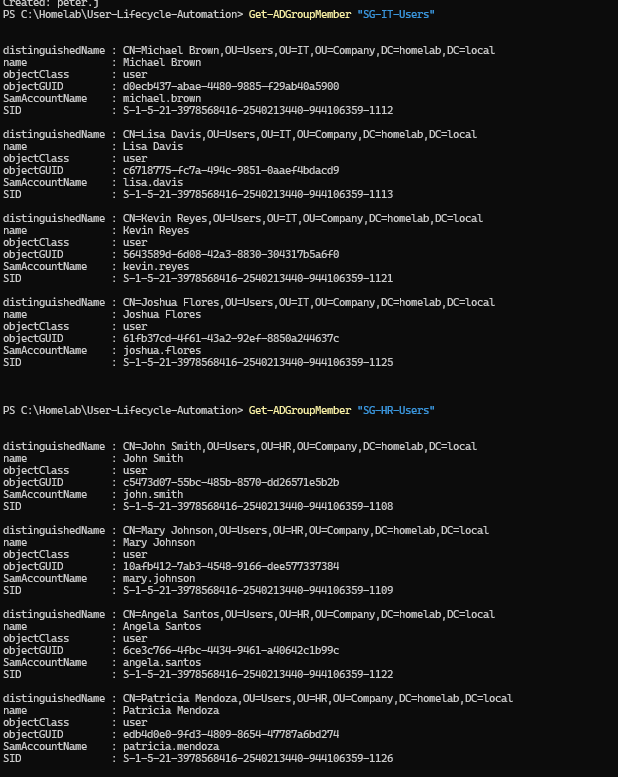
</p>

---

## Step 13 — Validate the Created Users

Opened Active Directory Users and Computers and confirmed that the new accounts were created in the correct departmental OUs.

Validation included checking:

- Account name
- Username
- Enabled status
- OU placement
- Department
- Security-group membership
- Password-change requirement

<p align="center">
  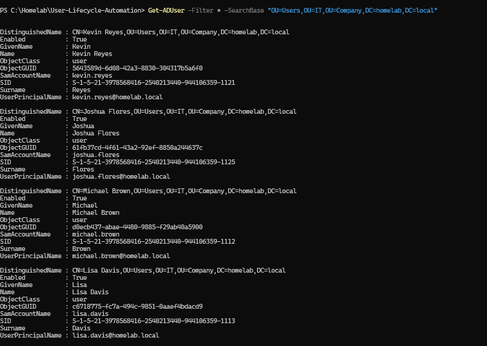
</p>

---

# Automated Onboarding Workflow

```text
Employee CSV
      │
      ▼
Import Employee Data
      │
      ▼
Validate Required Fields
      │
      ▼
Generate Username
      │
      ▼
Check Existing User
      │
      ├── Exists → Error Report
      │
      └── Does Not Exist
               │
               ▼
        Map Department
               │
               ▼
        Generate Password
               │
               ▼
        Create AD Account
               │
               ▼
        Assign Security Group
               │
               ▼
        Validate User
               │
               ▼
        Success Report
```

---

# Identity Lifecycle Workflow

```text
Joiner
  │
  ├── Create account
  ├── Assign OU
  ├── Assign groups
  ├── Set initial password
  └── Validate access

Mover
  │
  ├── Update department
  ├── Remove old groups
  ├── Add new groups
  └── Review permissions

Leaver
  │
  ├── Disable account
  ├── Remove access
  ├── Reset password
  ├── Move account
  └── Record offboarding
```

---

# Example Script Structure

The final script follows a structure similar to:

```powershell
Import-Module ActiveDirectory

$Users = Import-Csv ".\Employees.csv"

$SuccessResults = @()
$ErrorResults = @()

foreach ($User in $Users) {
    try {
        # Validate required fields

        # Generate username

        # Check whether user exists

        # Map department to OU and group

        # Generate a temporary password

        # Create Active Directory user

        # Add departmental group membership

        # Verify account creation

        # Add success result
    }
    catch {
        # Add error result
    }
}

$SuccessResults |
Export-Csv ".\Reports\Onboarding-Success.csv" `
    -NoTypeInformation

$ErrorResults |
Export-Csv ".\Reports\Onboarding-Errors.csv" `
    -NoTypeInformation
```

The repository script should be treated as the source of truth for the exact implementation.

---

# Validation Results

| Validation Check | Result |
|------------------|--------|
| Active Directory module verified | ✅ |
| OU structure reviewed | ✅ |
| Department security groups reviewed | ✅ |
| CSV validation implemented | ✅ |
| Username generation implemented | ✅ |
| Department mapping implemented | ✅ |
| Existing-user check implemented | ✅ |
| Success reporting implemented | ✅ |
| Error reporting implemented | ✅ |
| Password generation implemented | ✅ |
| Active Directory account creation completed | ✅ |
| Department security groups assigned | ✅ |
| Users created in correct OUs | ✅ |
| Password change required at first sign-in | ✅ |
| Duplicate-user handling included | ✅ |
| Previous script versions preserved | ✅ |
| Mover automation | ⏭️ Future module |
| Leaver automation | ⏭️ Offboarding module |
| Approval workflow integration | ⏭️ Future improvement |

---

# Troubleshooting Notes

## Active Directory Module Is Not Found

Possible error:

```text
The specified module 'ActiveDirectory' was not loaded
```

Check:

- Active Directory management tools are installed
- Script is running on a management system with RSAT
- Correct PowerShell edition is being used
- Module path is available

Command:

```powershell
Get-Module -ListAvailable ActiveDirectory
```

---

## CSV File Cannot Be Found

Check:

- File path
- Working directory
- Filename
- File extension
- Access permissions

Use a script-relative path:

```powershell
$ScriptRoot = $PSScriptRoot
$CsvPath = Join-Path $ScriptRoot "Employees.csv"
```

This is more reliable than assuming the current terminal directory.

---

## Unsupported Department

If the CSV contains a department not included in the mapping, the script should not guess.

Example:

```text
Department: Marketing
```

Possible response:

```text
Skip account
Record unsupported department
Request administrator review
```

---

## Duplicate Username

Two employees may produce the same username.

Example:

```text
John Smith
John Smith
```

The script needs a conflict-resolution rule such as:

```text
john.smith
john.smith2
```

or:

```text
john.a.smith
```

Duplicate handling should be predictable and documented.

---

## OU Does Not Exist

`New-ADUser` fails when the `-Path` value is incorrect.

Verify the path:

```powershell
Get-ADOrganizationalUnit -Filter * |
Select-Object Name, DistinguishedName
```

---

## Security Group Does Not Exist

Before adding membership, confirm the group exists:

```powershell
Get-ADGroup -Identity $Group
```

The script can validate all required groups before processing the CSV.

---

## User Created but Group Assignment Failed

Account creation and group assignment are separate operations.

A user may be created successfully but fail during group assignment.

The report should distinguish:

```text
Account Created
Group Assignment Failed
```

rather than describing the entire process as a complete failure.

---

## Password Does Not Meet Policy

The generated password must satisfy the domain password policy.

Check:

- Minimum length
- Complexity
- Password history
- Restricted words
- Custom password filters

PowerShell command:

```powershell
Get-ADDefaultDomainPasswordPolicy
```

---

## Script Is Run More Than Once

A safe rerun should not create duplicate accounts.

The script should:

- Check whether the account exists
- Skip or report existing users
- Avoid duplicate group operations
- Avoid replacing valid passwords
- Produce a clear rerun report

---

# Security Notes

## Do Not Store Plain-Text Passwords in the Script

Avoid:

```powershell
$Password = "CompanyPassword123!"
```

A password embedded in a public script can be copied by anyone.

The repository should not contain:

- Real passwords
- Reusable initial passwords
- Domain administrator credentials
- Secure-string exports tied to your user account
- Credential files

---

## Protect Generated Password Reports

If a report contains initial passwords, it becomes sensitive.

It should not be committed to GitHub.

A production workflow should use:

- Secure password delivery
- Restricted file permissions
- Encryption
- Password-management tools
- Expiring secure links
- Approved identity-verification procedures

---

## Use Least Privilege

The account running the onboarding script should have only the rights required to:

- Create users in approved OUs
- Update required attributes
- Assign approved groups
- Reset initial passwords when authorized

It should not automatically be a Domain Administrator.

---

## Validate CSV Sources

A CSV file should come from an approved source such as:

- HR onboarding ticket
- Identity request system
- Authorized manager
- Controlled export

Untrusted input can create incorrect or unauthorized accounts.

---

## Avoid Automatic Privileged Group Assignment

The onboarding script should not automatically add employees to groups such as:

```text
Domain Admins
Enterprise Admins
Schema Admins
Administrators
Account Operators
```

Privileged access should require a separate approval process.

---

## Review Scripts Before Execution

Before running an updated script:

- Review the code
- Test against sample users
- Use a test OU
- Use `-WhatIf` where supported
- Back up relevant data
- Confirm the input file
- Check the target domain
- Record the change

---

# Useful PowerShell Commands

## Import the Active Directory module

```powershell
Import-Module ActiveDirectory
```

---

## View available AD commands

```powershell
Get-Command -Module ActiveDirectory
```

---

## Import employee records

```powershell
$Users = Import-Csv ".\Employees.csv"
```

---

## Check whether a username exists

```powershell
Get-ADUser `
    -Filter "SamAccountName -eq 'john.smith'" `
    -ErrorAction SilentlyContinue
```

---

## View Organizational Units

```powershell
Get-ADOrganizationalUnit `
    -Filter * |
Select-Object Name, DistinguishedName
```

---

## View security groups

```powershell
Get-ADGroup `
    -Filter * |
Where-Object GroupCategory -eq "Security" |
Select-Object Name, GroupScope
```

---

## Create a user

```powershell
New-ADUser `
    -Name "John Smith" `
    -GivenName "John" `
    -Surname "Smith" `
    -SamAccountName "john.smith" `
    -UserPrincipalName "john.smith@homelab.local" `
    -Path "OU=Human Resources,OU=Company,DC=homelab,DC=local" `
    -AccountPassword $SecurePassword `
    -Enabled $true `
    -ChangePasswordAtLogon $true
```

---

## Add the user to a security group

```powershell
Add-ADGroupMember `
    -Identity "HR Security Group" `
    -Members "john.smith"
```

---

## Verify a created account

```powershell
Get-ADUser `
    -Identity "john.smith" `
    -Properties Department, MemberOf
```

---

## Export a success report

```powershell
$SuccessResults |
Export-Csv `
    -Path ".\Reports\Onboarding-Success.csv" `
    -NoTypeInformation
```

---

## Export an error report

```powershell
$ErrorResults |
Export-Csv `
    -Path ".\Reports\Onboarding-Errors.csv" `
    -NoTypeInformation
```

---

# Skills Demonstrated

- PowerShell Automation
- Active Directory Administration
- User Account Provisioning
- CSV Processing
- Input Validation
- Username Generation
- Duplicate Detection
- OU Mapping
- Security Group Assignment
- Password Generation
- Error Handling
- Success and Error Reporting
- Identity Lifecycle Management
- Least Privilege Awareness
- Administrative Scripting
- Technical Documentation

---

# Interview Notes

## Why automate Active Directory user creation?

Automation improves speed, consistency, validation, reporting, and repeatability.

It reduces manual errors during high-volume onboarding.

---

## What should an onboarding script validate?

It should validate:

- Required employee fields
- Department
- Username uniqueness
- Destination OU
- Security group
- Password policy
- Account-creation result
- Group-assignment result

---

## What is idempotency?

Idempotency means that running a process multiple times does not create duplicate or conflicting results.

An onboarding script should check for existing accounts before creation.

---

## Why should a script not contain a plain-text password?

Anyone with access to the script or Git history could read and reuse the password.

Passwords should be generated securely and handled only for the minimum required time.

---

## How would you handle duplicate usernames?

I would use a documented conflict-resolution standard, such as adding a middle initial or numeric suffix, and record the result in the report.

---

## Why create separate success and error reports?

Separate reports show which users were created and which require administrator review.

This prevents failed rows from being overlooked.

---

## What is the Joiner-Mover-Leaver model?

It describes the identity lifecycle:

- Joiner: create and grant initial access
- Mover: update access when a role changes
- Leaver: disable and remove access when employment ends

---

## Why should group assignment happen after account creation?

The user object must exist before it can be added as a member of an Active Directory group.

---

## What happens if the user is created but group assignment fails?

The account exists but may not have the required access.

The script should report the partial result clearly so an administrator can correct it.

---

## Should an onboarding script use Domain Administrator credentials?

Not necessarily.

A delegated service or administrative account with only the required permissions is safer and follows least privilege.

---

# What I Learned

The most important lesson from this module was that automation is not only a faster version of manual work.

A reliable automation process must handle situations where the data is incomplete, incorrect, or already exists.

The first version focused mainly on creating accounts.

As the script evolved, I added more checks:

```text
Does the CSV contain the required values?
```

```text
Does the department exist?
```

```text
Does the username already exist?
```

```text
Does the OU exist?
```

```text
Did account creation succeed?
```

```text
Did group assignment succeed?
```

This made the final version safer and easier to troubleshoot.

I also learned that preserving earlier script versions can show how a technical solution developed, but the repository should clearly identify which version is considered final.

For this project:

```text
Final version = Onboarding-v4.ps1
```

The workflow I want to remember is:

```text
Validate input
      ↓
Generate identity
      ↓
Check existing objects
      ↓
Create account
      ↓
Assign access
      ↓
Verify result
      ↓
Write report
```

---

# Future Improvements

To expand this project, I would add:

- Standard `Employees.csv` template
- Script parameters
- `CmdletBinding`
- `-WhatIf` support
- Pre-flight validation
- Logging with transcript files
- A dry-run mode
- Automatic duplicate-name resolution
- Employee ID as a unique identifier
- Manager assignment
- Job-title and email attributes
- Home-folder creation
- Microsoft 365 license assignment
- Microsoft Entra ID integration
- Approval workflow
- Service-desk ticket integration
- Secure password delivery
- Unit testing with Pester
- Git-based script versioning
- Scheduled onboarding jobs
- Formal rollback process

A future production-style script could begin with:

```powershell
[CmdletBinding(SupportsShouldProcess)]
param(
    [Parameter(Mandatory)]
    [ValidateScript({ Test-Path $_ })]
    [string]$CsvPath
)
```

This would make the script safer and easier to reuse.

---

# Key Takeaways

This module automated the employee onboarding process in Active Directory.

The final workflow included:

- CSV validation
- Username generation
- Department mapping
- Duplicate-user detection
- Initial password generation
- Active Directory account creation
- Security-group assignment
- Success reporting
- Error reporting
- OU validation

The main lessons were:

```text
Automation must validate before changing Active Directory.
```

```text
Scripts should be safe to rerun.
```

```text
Passwords must not be stored in public code.
```

```text
Partial failures must be reported clearly.
```

```text
Successful account creation must still be validated.
```

The onboarding workflow is now prepared for the next identity-lifecycle stage: automated employee offboarding.

---

<div align="center">

### Module Status

✅ Completed Successfully

**Final Script:** [`Onboarding-v4.ps1`](Scripts/Onboarding-v4.ps1)

**Next Module:** [Offboarding Automation](../07-Offboarding-Automation/)

</div>