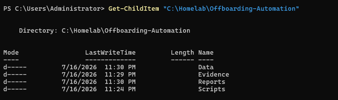
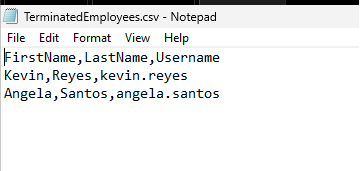
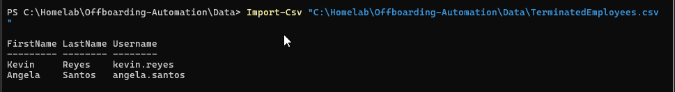
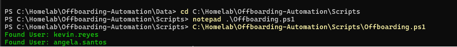
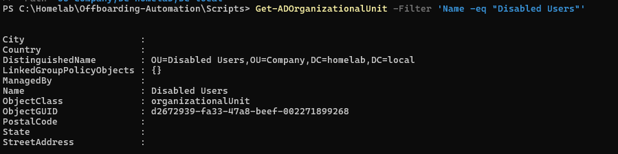
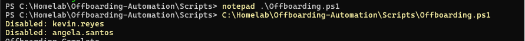
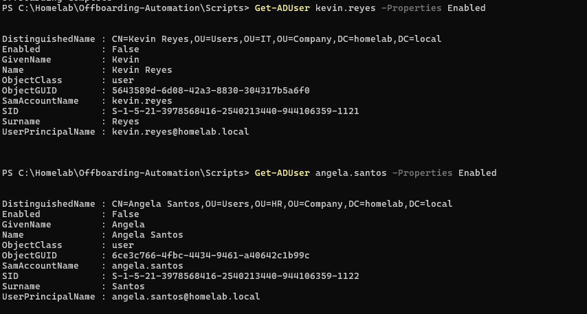
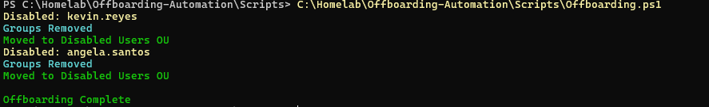
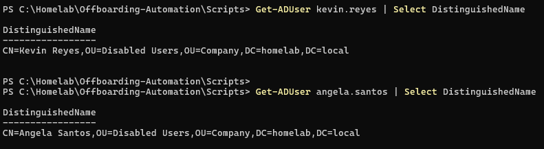
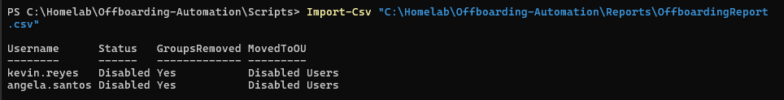

<div align="center">
  
</div>

---

# Overview

This module documents the development of a PowerShell-based employee offboarding workflow for the `homelab.local` Active Directory environment.

The objective was to automate the process of disabling terminated employee accounts, removing unnecessary group memberships, moving accounts into a dedicated Disabled Users Organizational Unit, and generating an offboarding report.

The implementation included:

- Creating an offboarding project structure
- Preparing a terminated-employee CSV file
- Importing employee records into PowerShell
- Validating Active Directory accounts before making changes
- Creating a Disabled Users OU
- Disabling terminated employee accounts
- Verifying disabled account status
- Removing security-group memberships
- Moving accounts into the Disabled Users OU
- Generating a final offboarding report

This module represents the **Leaver** stage of the identity lifecycle.

---

# Why I Built This Module

Creating accounts is only one part of identity management.

An organization also needs a reliable process for removing access when an employee leaves.

Manual offboarding can fail when an administrator:

- Forgets to disable an account
- Misses one of the user's security groups
- Deletes an account too early
- Moves the account to the wrong OU
- Offboards the wrong employee
- Fails to record what actions were completed
- Leaves access active after the employee's last day

I wanted to understand how PowerShell could make offboarding more consistent and reduce the chance of leaving unnecessary access behind.

The most important lesson was that an employee account should not normally be deleted immediately.

A safer first response is:

```text
Validate
   ↓
Disable
   ↓
Remove Access
   ↓
Move
   ↓
Report
```

---

# Business Scenario

The Human Resources department provides the Infrastructure Team with a list of employees whose access must be removed.

Management requires the IT team to:

- Validate that each employee account exists
- Disable the account
- Remove departmental and business-access groups
- Preserve required default group membership
- Move the account to a Disabled Users OU
- Record whether the offboarding process succeeded
- Retain the disabled account until the organization's retention period ends

The offboarding process must be repeatable, documented, and safe to run against multiple employee accounts.

---

# Learning Objectives

By completing this module, I practiced the following:

- Understanding the Leaver stage of the identity lifecycle
- Preparing a CSV-based offboarding request
- Importing records into PowerShell
- Validating Active Directory users before modification
- Creating a Disabled Users OU
- Disabling domain accounts
- Verifying account status
- Reviewing and removing group memberships
- Preserving required default groups
- Moving user objects between OUs
- Generating offboarding reports
- Handling missing or invalid users
- Understanding safe script reruns
- Applying least privilege during access revocation
- Documenting identity-management changes

---

# Key Concepts Learned

## Joiner, Mover, Leaver

The identity lifecycle is commonly divided into three stages:

```text
Joiner
Mover
Leaver
```

### Joiner

A new employee joins the organization.

Typical actions include:

- Create account
- Assign username
- Set initial password
- Add department groups
- Grant access

### Mover

An employee changes role or department.

Typical actions include:

- Remove old access
- Add new access
- Update department
- Move the account to another OU
- Review privileges

### Leaver

An employee leaves the organization.

Typical actions include:

- Disable account
- Reset or invalidate credentials
- Remove group memberships
- Revoke access
- Move account to a disabled OU
- Record the offboarding date
- Delete the account later according to policy

This module focuses on the **Leaver** stage.

---

## Disable vs Delete

Disabling an account prevents the user from signing in while preserving the Active Directory object.

This retains useful information such as:

- Security identifier
- Group history
- User attributes
- Audit references
- Mailbox linkage
- File ownership
- Investigation evidence

Deleting the account immediately may remove information needed for recovery, audit, or legal retention.

---

## Disabled Users OU

A dedicated Disabled Users OU separates inactive employee accounts from active users.

Benefits include:

- Easier reporting
- Clearer directory organization
- Reduced accidental reactivation
- Policy targeting
- Retention management
- Simplified review and deletion

Example:

```text
Company
│
├── Active Users
└── Disabled Users
```

---

## Group Membership Removal

Removing group memberships revokes access inherited through those groups.

Examples include:

- Department folders
- Mapped drives
- Printers
- Applications
- Remote systems
- Administrative permissions

The account's default primary group should be preserved.

For most users, that group is:

```text
Domain Users
```

---

## Account Validation

Before making any change, the script should confirm:

- The username is not blank
- The account exists
- The account is the intended user
- The user is not already disabled
- The user is not a protected administrative account
- The target OU exists
- The request came from an approved source

Automation should not modify Active Directory based only on unverified input.

---

## Offboarding Report

A report records the result of each user operation.

Useful fields include:

- Employee name
- Username
- Validation result
- Account-disabled result
- Groups removed
- Target OU
- Final status
- Error message
- Timestamp

The report provides evidence that the request was processed.

---

## Safe Reruns

An offboarding script may need to be run again after correcting an error.

A safe rerun should recognize when:

- The account is already disabled
- The user is already in the Disabled Users OU
- Optional groups were already removed
- The employee no longer exists
- The account was previously processed

The script should report the existing state instead of failing unnecessarily.

---

# Lab Environment Specifications

| Component | Configuration |
|------------|---------------|
| Domain Controller | SRV01 |
| Server Operating System | Windows Server 2025 Standard Evaluation |
| Active Directory Domain | homelab.local |
| Automation Language | PowerShell |
| PowerShell Module | ActiveDirectory |
| Input Method | CSV |
| Script | `Offboarding.ps1` |
| Target Accounts | Terminated employee accounts |
| Target OU | Disabled Users |
| Account Action | Disable |
| Group Action | Remove non-required memberships |
| Reporting | Offboarding result report |

---

# Folder Structure

```text
01-Identity-and-Access-Management
│
└── 07-Offboarding-Automation
    │
    ├── README.md
    │
    ├── Evidence
    │   └── Screenshots
    │       ├── 01-Offboarding-Project-Folder.png
    │       ├── 02-TerminatedEmployees-CSV.png
    │       ├── 03-TerminatedEmployees-Import.png
    │       ├── 04-Offboarding-User-Validation.png
    │       ├── 05-Disabled-Users-OU.png
    │       ├── 06-Disable-Accounts.png
    │       ├── 07-Accounts-Disabled-Verification.png
    │       ├── 08-Security-Groups-Removed.png
    │       ├── 09-Users-Moved-To-Disabled-OU.png
    │       └── 10-Offboarding-Report.png
    │
    └── Scripts
        └── Offboarding.ps1
```

---

# Step-by-Step Implementation

---

## Step 1 — Create the Offboarding Project Structure

Created the project structure for the PowerShell script, screenshots, and documentation.

The project separates:

- Automation code
- Evidence
- Reports
- Documentation

This makes the offboarding workflow easier to review and maintain.

<p align="center">
  
</p>

---

## Step 2 — Create the Terminated Employees CSV

Created a CSV file containing the employee accounts selected for offboarding.

Example structure:

```csv
SamAccountName,EmployeeName,TerminationDate
john.smith,John Smith,2026-07-24
anna.cruz,Anna Cruz,2026-07-24
```

The username is used to locate the Active Directory account.

A real offboarding file should come from an approved source such as:

- HR termination request
- Service desk ticket
- Manager-approved request
- Identity governance system

<p align="center">
  
</p>

---

## Step 3 — Import the Terminated Employee Records

Imported the CSV file into PowerShell.

Example:

```powershell
$TerminatedEmployees = Import-Csv `
    -Path ".\TerminatedEmployees.csv"
```

Each CSV row became a PowerShell object that could be processed by the script.

The imported records were reviewed before any Active Directory changes were made.

<p align="center">
  
</p>

---

## Step 4 — Validate the User Accounts

Validated each username before performing offboarding actions.

Example:

```powershell
$User = Get-ADUser `
    -Identity $Employee.SamAccountName `
    -Properties Enabled, MemberOf, DistinguishedName `
    -ErrorAction SilentlyContinue
```

The validation checked whether:

- The account existed
- The username matched an Active Directory object
- The account was already disabled
- The current OU could be identified
- Group memberships could be reviewed

If the account was not found, the script recorded an error instead of continuing with invalid data.

<p align="center">
  
</p>

---

## Step 5 — Create the Disabled Users OU

Created a dedicated Organizational Unit for terminated or inactive users.

Example location:

```text
OU=Disabled Users,OU=Company,DC=homelab,DC=local
```

The Disabled Users OU provides a central location for:

- Inactive accounts
- Retention review
- Audit checks
- Future deletion
- Policy targeting

The OU path must exist before the script attempts to move user objects.

<p align="center">
  
</p>

---

## Step 6 — Disable the Employee Accounts

Disabled each validated Active Directory account.

Example command:

```powershell
Disable-ADAccount `
    -Identity $Employee.SamAccountName
```

Disabling the account prevents future domain sign-in while preserving the user object and its historical information.

The script used error handling so one failed account would not stop the entire process.

<p align="center">
  
</p>

---

## Step 7 — Verify the Accounts Were Disabled

Verified that the affected accounts had:

```text
Enabled = False
```

Example command:

```powershell
Get-ADUser `
    -Identity $Employee.SamAccountName `
    -Properties Enabled |
Select-Object SamAccountName, Enabled
```

This step confirmed the current Active Directory state instead of assuming that the disable command succeeded.

<p align="center">
  
</p>

---

## Step 8 — Remove Security-Group Memberships

Removed the terminated users from non-required security groups.

The script preserved the required primary group, usually:

```text
Domain Users
```

Example logic:

```powershell
$Groups = Get-ADPrincipalGroupMembership `
    -Identity $Employee.SamAccountName |
Where-Object Name -ne "Domain Users"

foreach ($Group in $Groups) {
    Remove-ADGroupMember `
        -Identity $Group `
        -Members $Employee.SamAccountName `
        -Confirm:$false
}
```

Removing group memberships revokes access to resources connected to those groups.

<p align="center">
  
</p>

---

## Step 9 — Move Users to the Disabled Users OU

Moved each disabled account into the dedicated Disabled Users OU.

Example:

```powershell
Get-ADUser `
    -Identity $Employee.SamAccountName |
Move-ADObject `
    -TargetPath "OU=Disabled Users,OU=Company,DC=homelab,DC=local"
```

This separated inactive accounts from active employee accounts and made future review easier.

<p align="center">
  
</p>

---

## Step 10 — Generate the Offboarding Report

Generated a report containing the result of each processed account.

Example report fields:

```text
Employee
Username
AccountFound
AccountDisabled
GroupsRemoved
MovedToDisabledOU
Status
Timestamp
Error
```

The report provides evidence of what the script completed and which accounts require manual review.

<p align="center">
  
</p>

---

# Automated Offboarding Workflow

```text
Approved Termination Request
             │
             ▼
Import Terminated Employee CSV
             │
             ▼
Validate Active Directory User
             │
             ├── Not Found → Error Report
             │
             └── Found
                    │
                    ▼
             Disable Account
                    │
                    ▼
          Verify Disabled Status
                    │
                    ▼
         Remove Security Groups
                    │
                    ▼
       Move to Disabled Users OU
                    │
                    ▼
          Generate Final Report
```

---

# Identity Lifecycle Relationship

```text
Joiner
  │
  └── User Lifecycle Automation
          ├── Create account
          ├── Assign OU
          └── Assign groups

Mover
  │
  └── Future role-change workflow
          ├── Remove old access
          └── Add new access

Leaver
  │
  └── Offboarding Automation
          ├── Disable account
          ├── Remove groups
          ├── Move account
          └── Generate report
```

---

# Example Script Structure

The offboarding script follows a structure similar to:

```powershell
Import-Module ActiveDirectory

$Employees = Import-Csv ".\TerminatedEmployees.csv"
$Results = @()

foreach ($Employee in $Employees) {
    try {
        $User = Get-ADUser `
            -Identity $Employee.SamAccountName `
            -Properties Enabled, MemberOf, DistinguishedName `
            -ErrorAction Stop

        if ($User.Enabled) {
            Disable-ADAccount -Identity $User
        }

        $Groups = Get-ADPrincipalGroupMembership `
            -Identity $User |
        Where-Object Name -ne "Domain Users"

        foreach ($Group in $Groups) {
            Remove-ADGroupMember `
                -Identity $Group `
                -Members $User `
                -Confirm:$false
        }

        Move-ADObject `
            -Identity $User.DistinguishedName `
            -TargetPath "OU=Disabled Users,OU=Company,DC=homelab,DC=local"

        $Results += [PSCustomObject]@{
            Username       = $Employee.SamAccountName
            AccountFound   = $true
            AccountDisabled = $true
            GroupsRemoved  = $Groups.Count
            Status         = "Completed"
            Timestamp      = Get-Date
            Error          = ""
        }
    }
    catch {
        $Results += [PSCustomObject]@{
            Username        = $Employee.SamAccountName
            AccountFound    = $false
            AccountDisabled = $false
            GroupsRemoved   = 0
            Status          = "Failed"
            Timestamp       = Get-Date
            Error           = $_.Exception.Message
        }
    }
}

$Results |
Export-Csv `
    -Path ".\Offboarding-Report.csv" `
    -NoTypeInformation
```

The repository script is the source of truth for the exact implementation.

---

# Validation Results

| Validation Check | Result |
|------------------|--------|
| Offboarding project structure created | ✅ |
| Terminated employee CSV created | ✅ |
| Employee records imported | ✅ |
| Active Directory users validated | ✅ |
| Disabled Users OU created | ✅ |
| Terminated accounts disabled | ✅ |
| Disabled status verified | ✅ |
| Non-required security groups removed | ✅ |
| Required default membership preserved | ✅ |
| Users moved to Disabled Users OU | ✅ |
| Offboarding report generated | ✅ |
| Account deletion postponed for retention | ✅ |
| Cloud sessions revoked | ⏭️ Future improvement |
| Microsoft 365 access removed | ⏭️ Future improvement |
| Manager or HR approval integration | ⏭️ Future improvement |

---

# Troubleshooting Notes

## User Account Is Not Found

Possible causes:

- Incorrect username
- User already deleted
- Wrong domain
- CSV formatting problem
- Leading or trailing spaces
- Typographical error

Useful check:

```powershell
Get-ADUser `
    -Filter "SamAccountName -eq '$($Employee.SamAccountName)'"
```

The script should report the missing account and continue.

---

## Account Is Already Disabled

An already-disabled account should not be treated automatically as a failure.

The script can record:

```text
Already Disabled
```

and continue with group removal and OU placement when appropriate.

---

## Group Removal Fails

Possible causes include:

- Protected group membership
- Insufficient permissions
- Group no longer exists
- Replication delay
- User is a member through group nesting
- Attempt to remove the primary group

The script should preserve `Domain Users` unless a carefully planned alternative primary group exists.

---

## Move to Disabled OU Fails

Check:

- Target OU exists
- Distinguished name is correct
- Account still exists
- Administrator has Move permissions
- Object is protected from accidental deletion
- The object is not already in the target OU

Useful command:

```powershell
Get-ADOrganizationalUnit `
    -Filter * |
Select-Object Name, DistinguishedName
```

---

## Account Remains Signed In

Disabling the Active Directory account prevents new authentication, but an existing Windows session may remain active for some time.

A complete production offboarding process may also require:

- Sign-out or restart of assigned devices
- VPN session termination
- Remote session termination
- Cloud token revocation
- Microsoft 365 sign-out
- Password reset
- Device collection
- Badge revocation

---

## Script Is Run Twice

A safe rerun should detect that:

- The account is already disabled
- Groups were already removed
- The account is already in the Disabled Users OU

The report should indicate the existing state instead of creating an unnecessary failure.

---

## Wrong User Is Listed in the CSV

This is one of the highest-risk failure scenarios.

The script should use more than one identifier when possible:

- SamAccountName
- Employee ID
- Full name
- Department
- Termination date
- Approval ticket

High-risk actions should be based on verified requests, not unconfirmed spreadsheets.

---

# Security Notes

## Require an Approved Offboarding Request

The script should not disable accounts based on an unverified file.

A valid request should include:

- Employee identity
- Manager or HR approval
- Effective termination time
- Asset information
- Access-revocation requirements
- Ticket number
- Legal or retention instructions

---

## Do Not Immediately Delete Accounts

Immediate deletion may remove useful information needed for:

- Audit
- Investigation
- Litigation hold
- File ownership
- Mailbox transfer
- Access review
- Recovery

Disable first, then delete according to retention policy.

---

## Review Privileged Accounts Carefully

Accounts belonging to privileged groups require additional checks.

Examples include:

```text
Domain Admins
Enterprise Admins
Schema Admins
Administrators
Backup Operators
Server Operators
```

Privileged accounts may require an emergency change process or additional approval.

---

## Remove Access Beyond Active Directory

Active Directory group removal may not remove every form of access.

A complete enterprise workflow may also include:

- Microsoft 365 license removal
- Microsoft Entra session revocation
- VPN removal
- Application-account deactivation
- SaaS account suspension
- MFA method removal
- Device wipe
- Badge deactivation
- Password-manager access removal

---

## Protect Offboarding Reports

Reports may contain personal or employment information.

They should not expose:

- Private HR details
- Passwords
- Legal reasons for termination
- Personal addresses
- Sensitive manager comments
- Confidential ticket information

Public GitHub evidence should use test users and sanitized data.

---

## Use Least Privilege

The automation account should have only the rights required to:

- Read users
- Disable approved accounts
- Remove approved group memberships
- Move users into the Disabled Users OU
- Write reports

It should not automatically be a Domain Administrator.

---

# Useful PowerShell Commands

## Import the Active Directory module

```powershell
Import-Module ActiveDirectory
```

---

## Import terminated employees

```powershell
$Employees = Import-Csv ".\TerminatedEmployees.csv"
```

---

## Verify a user

```powershell
Get-ADUser `
    -Identity "john.smith" `
    -Properties Enabled, MemberOf, DistinguishedName
```

---

## Disable a user

```powershell
Disable-ADAccount `
    -Identity "john.smith"
```

---

## Verify disabled status

```powershell
Get-ADUser `
    -Identity "john.smith" `
    -Properties Enabled |
Select-Object SamAccountName, Enabled
```

---

## List group membership

```powershell
Get-ADPrincipalGroupMembership `
    -Identity "john.smith" |
Select-Object Name
```

---

## Remove a user from a group

```powershell
Remove-ADGroupMember `
    -Identity "HR Security Group" `
    -Members "john.smith" `
    -Confirm:$false
```

---

## Move a user to the Disabled Users OU

```powershell
Get-ADUser `
    -Identity "john.smith" |
Move-ADObject `
    -TargetPath "OU=Disabled Users,OU=Company,DC=homelab,DC=local"
```

---

## Find disabled accounts

```powershell
Search-ADAccount `
    -AccountDisabled `
    -UsersOnly |
Select-Object Name, SamAccountName, DistinguishedName
```

---

## Export an offboarding report

```powershell
$Results |
Export-Csv `
    -Path ".\Offboarding-Report.csv" `
    -NoTypeInformation
```

---

# Skills Demonstrated

- PowerShell Automation
- Active Directory Administration
- Employee Offboarding
- Identity Lifecycle Management
- Account Disablement
- Security Group Removal
- Organizational Unit Management
- CSV Processing
- User Validation
- Error Handling
- Reporting
- Least Privilege
- Access Revocation
- Identity Governance Awareness
- Technical Documentation

---

# Interview Notes

## Why disable an account before deleting it?

Disabling stops new sign-ins while preserving the account's attributes, SID, group history, audit value, and ownership information.

Deletion should follow the organization's retention policy.

---

## What should an offboarding script validate?

It should validate:

- Approved request
- Username
- Account existence
- Account status
- User identity
- Target OU
- Group memberships
- Whether the account is privileged

---

## Why remove group memberships?

Group memberships may provide access to folders, applications, printers, VPNs, and administrative resources.

Removing them reduces remaining access.

---

## Which group should normally be preserved?

For a standard domain user, the primary group is usually:

```text
Domain Users
```

The script should not remove the primary group without a planned replacement.

---

## What is the purpose of a Disabled Users OU?

It separates inactive accounts from active employees and supports retention, reporting, policy targeting, and review.

---

## Does disabling an AD account immediately terminate all sessions?

Not always.

Existing Windows, VPN, application, or cloud sessions may need separate revocation.

---

## How would you make the script safe to rerun?

I would check whether:

- The account is already disabled
- Groups were already removed
- The account is already in the target OU
- The user still exists

The script should report current state rather than repeating harmful operations.

---

## Why should offboarding use an approved ticket?

Disabling the wrong account can interrupt business operations and create legal or security problems.

The request should be verified and documented before access is removed.

---

## Should offboarding delete the user's files?

Not automatically.

Files may need to be transferred to a manager, retained, archived, or placed under legal hold.

---

## What else should be revoked outside Active Directory?

Examples include Microsoft 365, Microsoft Entra sessions, VPN access, SaaS applications, MFA methods, building access, and managed devices.

---

# What I Learned

The most important lesson from this module was that offboarding is not simply deleting a user.

A safe offboarding process needs to preserve evidence while stopping access.

The sequence matters:

```text
Validate first
```

```text
Disable before deleting
```

```text
Remove access
```

```text
Move the account
```

```text
Record the outcome
```

I also learned that a disabled Active Directory account does not automatically end every active session.

A complete real-world offboarding process may need to reach beyond Active Directory into cloud services, applications, VPN systems, physical security, and endpoint management.

The workflow I want to remember is:

```text
Approved request
      ↓
Verify identity
      ↓
Disable account
      ↓
Remove access
      ↓
Move account
      ↓
Validate state
      ↓
Generate report
```

---

# Future Improvements

To expand this module, I would add:

- Script parameters
- `CmdletBinding`
- `-WhatIf` support
- Dry-run mode
- Employee ID validation
- Manager and HR approval fields
- Password reset during offboarding
- Description field with termination date
- Account expiration configuration
- Home-folder archival
- File-ownership transfer
- Microsoft 365 license removal
- Microsoft Entra token revocation
- VPN access removal
- Microsoft Intune device retirement
- Service desk integration
- Email and mailbox transfer
- Pester testing
- Scheduled retention review
- Automated deletion after approval
- Formal rollback and reactivation workflow

Example production-style beginning:

```powershell
[CmdletBinding(SupportsShouldProcess)]
param(
    [Parameter(Mandatory)]
    [ValidateScript({ Test-Path $_ })]
    [string]$CsvPath,

    [Parameter(Mandatory)]
    [string]$DisabledUsersOU
)
```

---

# Key Takeaways

This module automated the Active Directory offboarding process.

The final workflow included:

- Importing terminated employee records
- Validating user accounts
- Creating a Disabled Users OU
- Disabling accounts
- Verifying disabled status
- Removing security-group memberships
- Moving users into the Disabled Users OU
- Generating an offboarding report

The main lessons were:

```text
Disable accounts before deleting them.
```

```text
Validate identity before making access changes.
```

```text
Remove unnecessary group memberships.
```

```text
Preserve required default membership.
```

```text
Move inactive accounts into a controlled OU.
```

```text
Document every offboarding result.
```

This completes the automated Joiner and Leaver workflows in the identity lifecycle.

---

<div align="center">

### Module Status

✅ Completed Successfully

**Script:** [`Offboarding.ps1`](Scripts/Offboarding.ps1)

**Next Module:** [Active Directory Auditing](../08-Active-Directory-Auditing/)

</div>