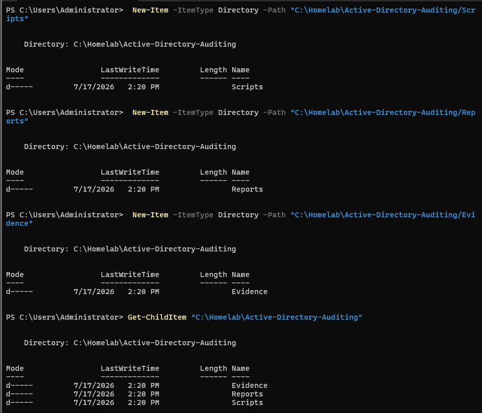
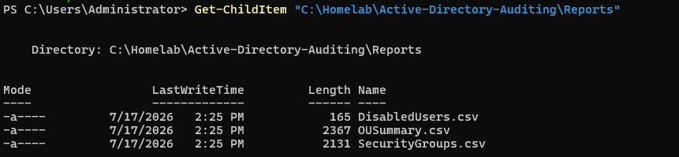
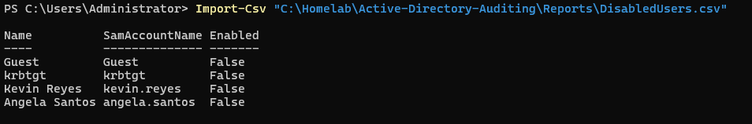
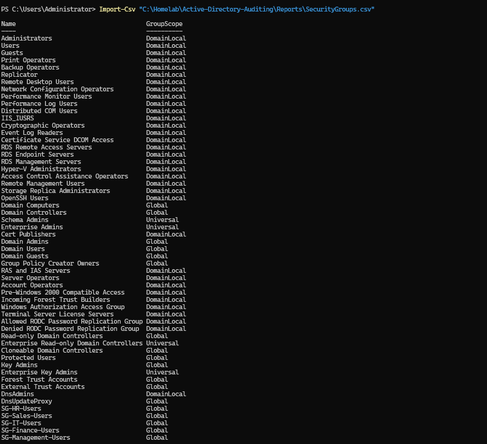
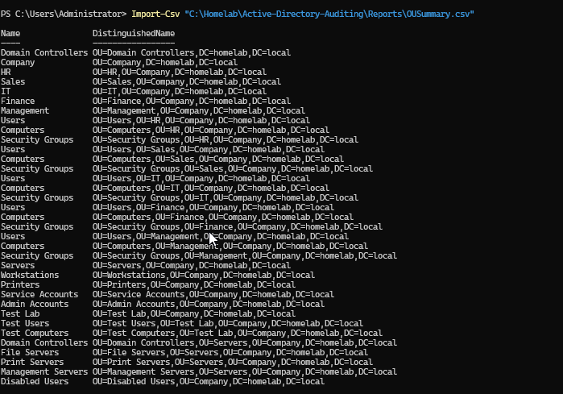
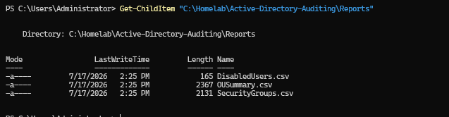

<div align="center">
  
</div>

---

# Overview

This module documents the development of a PowerShell-based Active Directory auditing workflow for the `homelab.local` environment.

The objective was to collect useful directory information and export it into structured CSV reports that could be reviewed by an administrator.

The audit focused on three areas:

- Disabled user accounts
- Active Directory security groups
- Organizational Unit structure

The implementation included:

- Creating the audit project structure
- Developing the `ADAudit.ps1` script
- Executing the audit
- Exporting CSV reports
- Reviewing disabled accounts
- Reviewing security groups
- Reviewing Organizational Units
- Confirming the final report files

This module demonstrates how PowerShell can be used to turn Active Directory data into practical administrative evidence.

---

# Why I Built This Module

As the Active Directory environment grew, it became harder to review everything manually through Active Directory Users and Computers.

An administrator may need to answer questions such as:

- Which user accounts are disabled?
- Which security groups exist?
- What scope does each group use?
- How is the OU structure organized?
- Are inactive accounts still present?
- Does the directory structure still match the intended design?

I wanted to understand how PowerShell could collect this information automatically and export it into reports that are easier to review.

The most important lesson was that auditing is not only about finding errors.

It is also about creating a clear record of the current environment.

```text
Collect
   ↓
Organize
   ↓
Review
   ↓
Report
   ↓
Improve
```

---

# Business Scenario

The organization has created users, security groups, Organizational Units, and automated identity-management workflows.

Management asks the Infrastructure Team to perform a basic Active Directory review.

The administrator must provide reports showing:

- Disabled user accounts
- Existing security groups
- Current Organizational Unit structure

The reports may be used for:

- Access reviews
- Offboarding checks
- Administrative cleanup
- Security assessments
- Compliance evidence
- Directory documentation
- Troubleshooting

The audit must be repeatable so updated reports can be generated whenever required.

---

# Learning Objectives

By completing this module, I practiced the following:

- Importing the Active Directory PowerShell module
- Querying Active Directory user accounts
- Identifying disabled accounts
- Querying security groups
- Reviewing group scope and category
- Querying Organizational Units
- Exporting PowerShell objects to CSV
- Building reusable reporting logic
- Creating structured audit evidence
- Reviewing report accuracy
- Understanding the difference between auditing and monitoring
- Protecting sensitive directory information
- Documenting administrative findings

---

# Key Concepts Learned

## Active Directory Auditing

Active Directory auditing is the process of reviewing directory objects, permissions, activity, and configuration.

Auditing can include:

- User accounts
- Disabled accounts
- Privileged accounts
- Group memberships
- Organizational Units
- Computer accounts
- Password settings
- Inactive objects
- Recent changes
- Security events

This module focuses on inventory-style auditing and reporting.

---

## Audit vs Monitoring

Auditing and monitoring are related but different.

```text
Auditing
=
Reviewing evidence and current or historical state
```

```text
Monitoring
=
Continuously watching for activity or conditions
```

This module generates point-in-time reports.

A later monitoring solution could alert administrators when specific changes happen.

---

## Disabled User Accounts

A disabled user account cannot normally sign in to the domain.

Disabled accounts may exist because:

- An employee left
- Access was suspended
- The account is awaiting deletion
- The user is on extended leave
- An administrator is investigating activity
- The account is retained according to policy

Disabled accounts should still be reviewed because they may remain members of sensitive groups or remain in active-user OUs.

---

## Security Groups

Security groups are used to assign access and permissions.

An audit can review:

- Group name
- Group scope
- Group category
- Description
- Membership
- Managed-by information
- Whether the group is privileged
- Whether the group is still required

Unused or poorly documented groups can make access management difficult.

---

## Group Scope

Common Active Directory group scopes include:

- Global
- Domain Local
- Universal

A report that includes group scope helps administrators understand how the group may be used.

---

## Group Category

Active Directory groups can be:

```text
Security
```

or:

```text
Distribution
```

Security groups can be used for permissions.

Distribution groups are mainly used for email distribution and are not security principals.

This audit focuses on security groups.

---

## Organizational Units

Organizational Units are used to organize directory objects and support:

- Group Policy
- Delegated administration
- Automation
- Reporting
- Separation of users and computers

An OU summary helps confirm whether the directory structure still matches the intended design.

---

## CSV Reporting

CSV files are useful because they can be opened with:

- Microsoft Excel
- PowerShell
- Reporting tools
- Data-analysis tools
- Ticketing or compliance systems

CSV reports also make it easier to sort, filter, and compare directory data.

---

## Point-in-Time Evidence

The reports represent the state of Active Directory when the script was executed.

They do not automatically update after directory changes.

Each report should therefore include or be associated with:

- Generation date
- Generation time
- Domain
- Script version
- Administrator
- Report purpose

---

# Lab Environment Specifications

| Component | Configuration |
|------------|---------------|
| Domain Controller | SRV01 |
| Server Operating System | Windows Server 2025 Standard Evaluation |
| Active Directory Domain | homelab.local |
| Automation Language | PowerShell |
| PowerShell Module | ActiveDirectory |
| Audit Script | `ADAudit.ps1` |
| User Report | `DisabledUsers.csv` |
| Group Report | `SecurityGroups.csv` |
| OU Report | `OUSummary.csv` |
| Report Format | CSV |
| Audit Type | Point-in-time directory review |

---

# Folder Structure

```text
01-Identity-and-Access-Management
│
└── 08-Active-Directory-Auditing
    │
    ├── README.md
    │
    ├── Evidence
    │   └── Screenshots
    │       ├── 01-Audit-Project-Folder.png
    │       ├── 02-Audit-Script-Execution.png
    │       ├── 03-Audit-Reports-Generated.png
    │       ├── 04-Disabled-Users-Report.png
    │       ├── 05-Security-Groups-Report.png
    │       ├── 06-OU-Summary-Report.png
    │       └── 07-Final-Audit-Reports.png
    │
    ├── Scripts
    │   └── ADAudit.ps1
    │
    └── Reports
        ├── DisabledUsers.csv
        ├── OUSummary.csv
        └── SecurityGroups.csv
```

---

# Step-by-Step Implementation

---

## Step 1 — Create the Audit Project Structure

Created the project structure for:

- PowerShell script
- CSV reports
- Screenshots
- Documentation

Separating scripts and reports makes the project easier to maintain and review.

<p align="center">
  
</p>

---

## Step 2 — Execute the Active Directory Audit Script

Opened PowerShell and executed:

```powershell
.\Scripts\ADAudit.ps1
```

The script queried Active Directory and generated reports for:

- Disabled users
- Security groups
- Organizational Units

The script required access to the Active Directory PowerShell module.

Example:

```powershell
Import-Module ActiveDirectory
```

<p align="center">
  
</p>

---

## Step 3 — Confirm the Audit Reports Were Generated

Verified that the script created the expected CSV files.

Generated reports:

```text
DisabledUsers.csv
SecurityGroups.csv
OUSummary.csv
```

This confirmed that the script completed the export process.

<p align="center">
  
</p>

---

## Step 4 — Review the Disabled Users Report

Opened:

```text
Reports/DisabledUsers.csv
```

The report identified Active Directory user accounts with:

```text
Enabled = False
```

Useful report fields may include:

- Name
- SamAccountName
- Enabled status
- Distinguished name
- Description
- Last logon date
- Password last set
- Account expiration date

The report can help administrators review accounts retained after offboarding.

<p align="center">
  
</p>

---

## Step 5 — Review the Security Groups Report

Opened:

```text
Reports/SecurityGroups.csv
```

The report documented security groups in the domain.

Useful fields may include:

- Group name
- Group scope
- Group category
- Description
- Distinguished name
- Member count

This report can support access reviews and identify groups requiring cleanup or documentation.

<p align="center">
  
</p>

---

## Step 6 — Review the OU Summary Report

Opened:

```text
Reports/OUSummary.csv
```

The report listed Organizational Units in the domain.

Useful fields may include:

- OU name
- Distinguished name
- Protected-from-deletion status
- Linked purpose
- Parent OU
- Object counts

The report helped confirm the current directory structure.

<p align="center">
  
</p>

---

## Step 7 — Verify the Final Audit Reports

Reviewed the completed report set and confirmed that the three expected files were present.

The final audit package included:

```text
DisabledUsers.csv
SecurityGroups.csv
OUSummary.csv
```

These reports provide a point-in-time view of the Active Directory environment.

<p align="center">
  
</p>

---

# Active Directory Audit Workflow

```text
Active Directory
      │
      ▼
PowerShell Audit Script
      │
      ├──────────────┬────────────────┬──────────────
      ▼              ▼                ▼
Disabled Users   Security Groups   Organizational Units
      │              │                │
      └──────────────┴────────────────┘
                     │
                     ▼
                 CSV Reports
                     │
                     ▼
          Administrative Review
                     │
                     ▼
       Cleanup, Validation, or Action
```

---

# Example Script Structure

The audit script follows a structure similar to:

```powershell
Import-Module ActiveDirectory

$ReportPath = Join-Path $PSScriptRoot "..\Reports"

if (-not (Test-Path $ReportPath)) {
    New-Item `
        -Path $ReportPath `
        -ItemType Directory |
    Out-Null
}

Get-ADUser `
    -Filter "Enabled -eq 'False'" `
    -Properties Enabled, DistinguishedName |
Select-Object `
    Name,
    SamAccountName,
    Enabled,
    DistinguishedName |
Export-Csv `
    -Path (Join-Path $ReportPath "DisabledUsers.csv") `
    -NoTypeInformation

Get-ADGroup `
    -Filter "GroupCategory -eq 'Security'" |
Select-Object `
    Name,
    GroupScope,
    GroupCategory,
    DistinguishedName |
Export-Csv `
    -Path (Join-Path $ReportPath "SecurityGroups.csv") `
    -NoTypeInformation

Get-ADOrganizationalUnit `
    -Filter * |
Select-Object `
    Name,
    DistinguishedName,
    ProtectedFromAccidentalDeletion |
Export-Csv `
    -Path (Join-Path $ReportPath "OUSummary.csv") `
    -NoTypeInformation
```

The repository script is the source of truth for the exact implementation.

---

# Validation Results

| Validation Check | Result |
|------------------|--------|
| Audit project structure created | ✅ |
| Active Directory module loaded | ✅ |
| Audit script executed | ✅ |
| Disabled users queried | ✅ |
| Security groups queried | ✅ |
| Organizational Units queried | ✅ |
| `DisabledUsers.csv` generated | ✅ |
| `SecurityGroups.csv` generated | ✅ |
| `OUSummary.csv` generated | ✅ |
| Disabled user report reviewed | ✅ |
| Security group report reviewed | ✅ |
| OU summary report reviewed | ✅ |
| Final audit files confirmed | ✅ |
| Automated scheduling | ⏭️ Future improvement |
| Historical comparison | ⏭️ Future improvement |
| Privileged-group membership report | ⏭️ Future improvement |

---

# Troubleshooting Notes

## Active Directory Module Is Missing

Possible error:

```text
The specified module 'ActiveDirectory' was not loaded
```

Check:

```powershell
Get-Module -ListAvailable ActiveDirectory
```

The system may require:

- Active Directory Domain Services tools
- RSAT
- Correct PowerShell environment
- Administrative access

---

## Reports Folder Does Not Exist

The script should create the report directory when missing.

Example:

```powershell
if (-not (Test-Path $ReportPath)) {
    New-Item `
        -Path $ReportPath `
        -ItemType Directory |
    Out-Null
}
```

---

## CSV File Is Empty

An empty report may mean:

- No matching objects exist
- The filter is incorrect
- The script is connected to the wrong domain
- The query failed
- The account lacks read permissions
- The export path is wrong

Validate the query before exporting:

```powershell
Get-ADUser -Filter "Enabled -eq 'False'"
```

---

## Security Groups Are Missing

Check whether the script filters only security groups.

Example:

```powershell
Get-ADGroup `
    -Filter "GroupCategory -eq 'Security'"
```

Also confirm the expected groups exist:

```powershell
Get-ADGroup -Filter *
```

---

## OU Report Is Missing Objects

Check:

- Query scope
- Active Directory connectivity
- Permissions
- Whether the expected location is actually an OU
- Whether it is a default container instead

Default containers such as `Users` and `Computers` are not standard OUs.

---

## Script Runs from the Wrong Directory

Using relative paths based only on the current PowerShell location may cause reports to appear in an unexpected folder.

Use:

```powershell
$PSScriptRoot
```

to build paths relative to the script.

---

## Report File Is Locked

A CSV export may fail if the report is already open in Excel.

Close the file and run the script again.

---

# Security Notes

## Reports May Contain Sensitive Information

Active Directory reports may reveal:

- Employee names
- Usernames
- Group names
- Directory structure
- Privileged access
- Disabled accounts
- Internal naming standards

Public reports should use test data or sanitized information.

---

## Do Not Export Password Information

The audit script should never export:

- User passwords
- LAPS passwords
- Password hashes
- Recovery keys
- Authentication tokens
- Plain-text credentials

---

## Restrict Access to Audit Reports

In a real environment, audit reports should be accessible only to approved roles such as:

- Systems Administrators
- Security Operations
- Internal Audit
- Identity Administrators
- Compliance staff

---

## Protect Report Integrity

Audit evidence should not be edited without documentation.

A stronger workflow may include:

- Read-only storage
- File hashes
- Generation timestamps
- Script version
- Administrator identity
- Restricted permissions
- Centralized evidence repository

---

## Review Privileged Groups Separately

Groups such as the following deserve dedicated review:

```text
Domain Admins
Enterprise Admins
Schema Admins
Administrators
Account Operators
Server Operators
Backup Operators
```

A general group report is useful, but privileged membership should be reviewed more closely.

---

# Useful PowerShell Commands

## Import the Active Directory module

```powershell
Import-Module ActiveDirectory
```

---

## Find disabled users

```powershell
Get-ADUser `
    -Filter "Enabled -eq 'False'" `
    -Properties Enabled, DistinguishedName
```

---

## Find disabled accounts using Search-ADAccount

```powershell
Search-ADAccount `
    -AccountDisabled `
    -UsersOnly
```

---

## List security groups

```powershell
Get-ADGroup `
    -Filter "GroupCategory -eq 'Security'" |
Select-Object Name, GroupScope, GroupCategory
```

---

## List Organizational Units

```powershell
Get-ADOrganizationalUnit `
    -Filter * |
Select-Object Name, DistinguishedName
```

---

## View protected OUs

```powershell
Get-ADOrganizationalUnit `
    -Filter * `
    -Properties ProtectedFromAccidentalDeletion |
Select-Object `
    Name,
    ProtectedFromAccidentalDeletion
```

---

## Export disabled users

```powershell
Get-ADUser `
    -Filter "Enabled -eq 'False'" `
    -Properties Enabled, DistinguishedName |
Select-Object `
    Name,
    SamAccountName,
    Enabled,
    DistinguishedName |
Export-Csv `
    -Path ".\Reports\DisabledUsers.csv" `
    -NoTypeInformation
```

---

## Export security groups

```powershell
Get-ADGroup `
    -Filter "GroupCategory -eq 'Security'" |
Select-Object `
    Name,
    GroupScope,
    GroupCategory,
    DistinguishedName |
Export-Csv `
    -Path ".\Reports\SecurityGroups.csv" `
    -NoTypeInformation
```

---

## Export OU summary

```powershell
Get-ADOrganizationalUnit `
    -Filter * `
    -Properties ProtectedFromAccidentalDeletion |
Select-Object `
    Name,
    DistinguishedName,
    ProtectedFromAccidentalDeletion |
Export-Csv `
    -Path ".\Reports\OUSummary.csv" `
    -NoTypeInformation
```

---

# Skills Demonstrated

- Active Directory Auditing
- PowerShell Automation
- Active Directory Reporting
- Disabled Account Review
- Security Group Inventory
- Organizational Unit Review
- CSV Export
- Directory Documentation
- Identity Governance Awareness
- Security Review
- Administrative Reporting
- Data Validation
- Technical Documentation
- Windows Server 2025
- Active Directory PowerShell Module

---

# Interview Notes

## What is Active Directory auditing?

Active Directory auditing is the process of reviewing directory objects, configuration, permissions, and activity to identify security, operational, or compliance issues.

---

## Why audit disabled user accounts?

Disabled accounts may still contain group memberships, sensitive attributes, or privileged access.

They should be reviewed and retained or deleted according to policy.

---

## Why audit security groups?

Security groups control access to resources.

Auditing helps identify unused groups, undocumented groups, excessive permissions, and privileged memberships.

---

## Why audit Organizational Units?

OU audits help confirm directory structure, Group Policy scope, delegated administration, and object organization.

---

## What is the difference between auditing and monitoring?

Auditing reviews evidence or the current state.

Monitoring continuously watches for events and may generate alerts.

---

## Why export audit data to CSV?

CSV reports are easy to open, sort, filter, compare, and import into reporting or compliance tools.

---

## How would you improve this audit?

I would add:

- Last logon data
- Password age
- Privileged-group membership
- Inactive accounts
- Empty groups
- Group owners
- GPO links
- Computer inventory
- Historical comparison
- Automated scheduling

---

## Are disabled accounts automatically safe?

No.

They cannot normally sign in, but they may still retain group memberships, file ownership, mailbox data, or sensitive attributes.

---

# What I Learned

The most important lesson from this module was that Active Directory administration does not end after objects are created.

The environment must be reviewed regularly.

The audit reports helped turn directory information into something easier to inspect.

Instead of clicking through each OU and group manually, the script generated structured evidence.

I also learned that a report is only a snapshot.

```text
Report generated today
≠
Directory remains unchanged tomorrow
```

For that reason, auditing should be repeated and historical reports should be compared.

The workflow I want to remember is:

```text
Query directory
      ↓
Export data
      ↓
Review results
      ↓
Identify exceptions
      ↓
Take action
      ↓
Repeat regularly
```

---

# Future Improvements

To expand this audit, I would add:

- Inactive user report
- Password-never-expires report
- Password-age report
- Locked-out user report
- Privileged-group membership report
- Empty security-group report
- Groups without descriptions
- Users without departments
- Users outside approved OUs
- Computer inventory
- Stale computer accounts
- Group Policy link report
- LAPS compliance report
- Historical report comparison
- HTML dashboard
- Email summary
- Task Scheduler automation
- SIEM integration
- Pester testing
- Report hashing and evidence integrity

A future report set could include:

```text
DisabledUsers.csv
InactiveUsers.csv
PrivilegedGroups.csv
StaleComputers.csv
PasswordExceptions.csv
OUSummary.csv
SecurityGroups.csv
```

---

# Key Takeaways

This module created a repeatable Active Directory audit using PowerShell.

The final workflow included:

- Querying disabled users
- Querying security groups
- Querying Organizational Units
- Exporting CSV reports
- Reviewing the results
- Confirming the final report files

The main lessons were:

```text
Active Directory should be reviewed regularly.
```

```text
Automation makes audits faster and more consistent.
```

```text
Reports are point-in-time evidence.
```

```text
Disabled accounts and security groups still require review.
```

```text
Audit reports must be protected as sensitive administrative data.
```

The environment now has a basic directory-auditing process that can be expanded into compliance reporting and security monitoring.

---

<div align="center">

### Module Status

✅ Completed Successfully

**Script:** [`ADAudit.ps1`](Scripts/ADAudit.ps1)

**Reports:**

- [`DisabledUsers.csv`](Reports/DisabledUsers.csv)
- [`SecurityGroups.csv`](Reports/SecurityGroups.csv)
- [`OUSummary.csv`](Reports/OUSummary.csv)

**Next Module:** [Helpdesk Automation](../09-Helpdesk-Automation/)

</div>