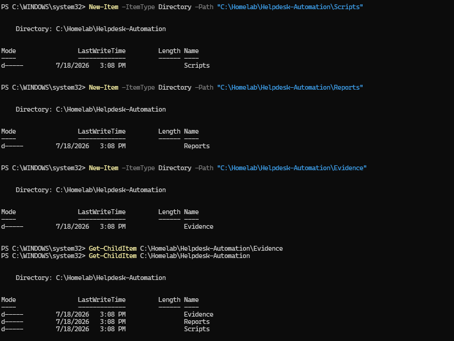
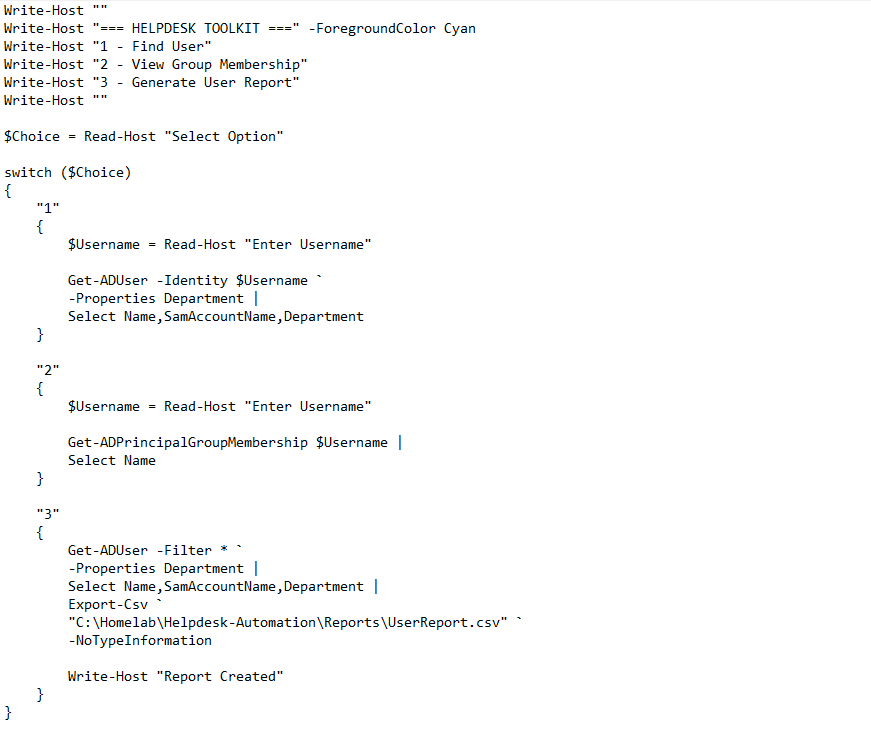
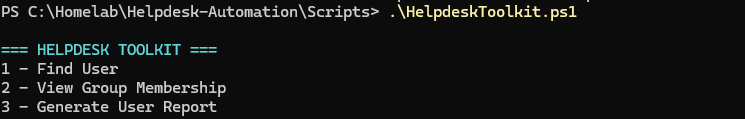
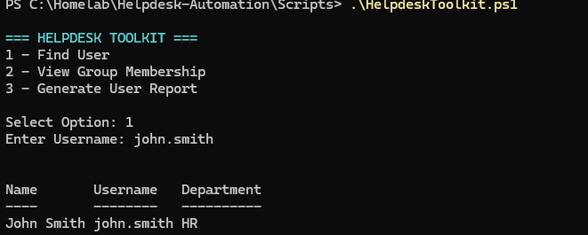
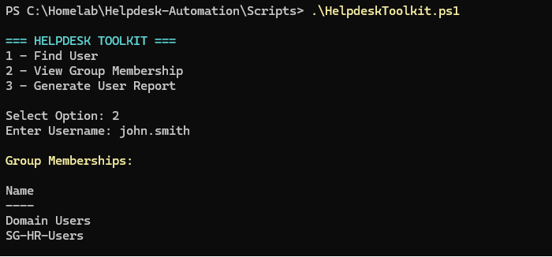
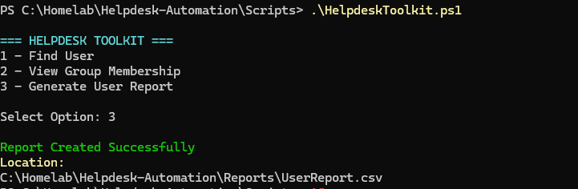
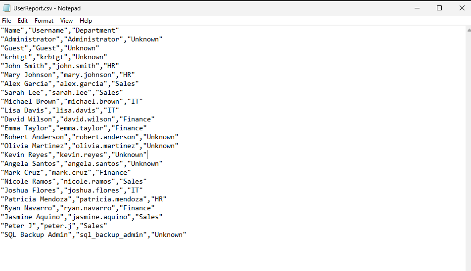
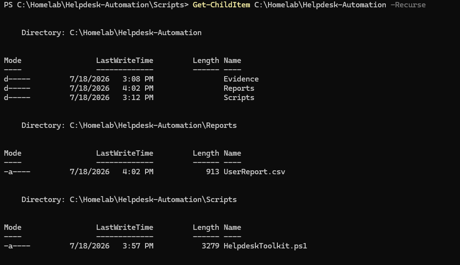

<div align="center">
  
</div>

---

# Overview

This module documents the development of a PowerShell-based Help Desk toolkit for the `homelab.local` Active Directory environment.

The objective was to create a simple menu-driven tool that could help support technicians perform common user-account checks more consistently.

The toolkit included functions for:

- Searching for an Active Directory user
- Displaying account information
- Reviewing security-group membership
- Generating a user report
- Exporting results to CSV
- Presenting common Help Desk actions through a menu

The final script used in this module is:

```text
Scripts/HelpdeskToolkit.ps1
```

The generated report is:

```text
Reports/UserReport.csv
```

---

# Why I Built This Module

Help Desk work often includes repetitive Active Directory tasks.

Examples include:

- Finding a user account
- Confirming whether an account exists
- Checking whether the account is enabled
- Reviewing department information
- Checking group membership
- Gathering account details for a ticket
- Creating a report for escalation

These tasks can be completed manually through Active Directory Users and Computers, but repeating them for many tickets can take time and lead to inconsistent results.

I wanted to understand how PowerShell functions and menus could turn several common support tasks into one reusable toolkit.

The main lesson was that Help Desk automation should not remove technician judgment.

The tool should support a workflow such as:

```text
Receive Request
      ↓
Verify User Identity
      ↓
Collect Account Information
      ↓
Perform Approved Action
      ↓
Validate the Result
      ↓
Document the Ticket
```

---

# Business Scenario

The organization receives regular support requests involving Active Directory user accounts.

The Help Desk needs a faster way to retrieve basic user information without manually navigating through several administrative tools.

Support technicians need to answer questions such as:

- Does the user account exist?
- Is the account enabled?
- Which department is the user assigned to?
- Which security groups is the user a member of?
- Which OU contains the user?
- Can the user information be exported for escalation or review?

The Infrastructure Team creates a PowerShell toolkit that presents these tasks through a menu and generates a standardized user report.

The tool is intended for authorized support use and should follow least-privilege and ticket-validation procedures.

---

# Learning Objectives

By completing this module, I practiced the following:

- Building a menu-driven PowerShell script
- Importing the Active Directory module
- Creating reusable PowerShell functions
- Searching for Active Directory users
- Handling missing users
- Displaying user properties
- Reviewing security-group membership
- Creating PowerShell custom objects
- Exporting user data to CSV
- Building a repeatable Help Desk workflow
- Separating data collection from account modification
- Applying error handling
- Understanding least privilege
- Protecting user information
- Documenting support-tool behavior

---

# Key Concepts Learned

## Help Desk Automation

Help Desk automation uses scripts or tools to reduce repetitive support work.

Examples include:

- User lookup
- Password reset
- Account unlock
- Group membership review
- Device lookup
- Report generation
- Ticket documentation

Automation is most useful when it improves:

- Consistency
- Speed
- Validation
- Reporting
- Repeatability

---

## Menu-Driven Script

A menu-driven script allows the technician to select an action without remembering every PowerShell command.

Example:

```text
1. Find User
2. Display Group Membership
3. Generate User Report
4. Exit
```

The menu can call different functions depending on the selected option.

---

## PowerShell Function

A function is a reusable block of PowerShell code.

Example:

```powershell
function Find-HelpdeskUser {
    param(
        [string]$Username
    )

    Get-ADUser `
        -Identity $Username `
        -Properties *
}
```

Functions make scripts easier to:

- Read
- Test
- Reuse
- Troubleshoot
- Expand

---

## Active Directory User Lookup

A Help Desk technician may need to locate a user using:

- SamAccountName
- User Principal Name
- Full name
- Email address
- Employee ID

The script should avoid making changes until the technician confirms that the correct account was found.

---

## Group Membership

Group membership can determine access to:

- Shared folders
- Mapped drives
- Printers
- Applications
- VPN
- Administrative tools
- Department resources

Reviewing group membership is an important troubleshooting step when a user reports missing or excessive access.

---

## Custom PowerShell Object

A custom object allows selected data to be organized into a structured report.

Example:

```powershell
[PSCustomObject]@{
    Name           = $User.Name
    Username       = $User.SamAccountName
    Enabled        = $User.Enabled
    Department     = $User.Department
    DistinguishedName = $User.DistinguishedName
}
```

This object can then be displayed or exported.

---

## CSV Report

CSV reports are useful because they can be opened with:

- Microsoft Excel
- PowerShell
- Reporting tools
- Ticketing systems
- Audit tools

The generated report in this module is:

```text
UserReport.csv
```

---

## Least Privilege

Help Desk staff should receive only the permissions required for approved support tasks.

They should not automatically receive:

```text
Domain Admins
```

for routine actions.

Examples of delegated Help Desk permissions may include:

- Read user properties
- Reset passwords
- Unlock accounts
- Update selected attributes
- Add users to approved groups

---

## Identity Verification

Before performing an account action, the technician should verify the user according to organizational procedure.

Examples may include:

- Employee ID
- Manager confirmation
- Approved ticket
- Security questions
- Verified callback
- Identity-management workflow

Automation should not bypass identity verification.

---

# Lab Environment Specifications

| Component | Configuration |
|------------|---------------|
| Domain Controller | SRV01 |
| Server Operating System | Windows Server 2025 Standard Evaluation |
| Active Directory Domain | homelab.local |
| Automation Language | PowerShell |
| PowerShell Module | ActiveDirectory |
| Toolkit Script | `HelpdeskToolkit.ps1` |
| Report | `UserReport.csv` |
| Interface | Menu-driven console |
| Primary Functions | User lookup, group review, user reporting |
| Intended Role | Help Desk / IT Support |
| Access Model | Authorized and least-privileged use |

---

# Folder Structure

```text
01-Identity-and-Access-Management
│
└── 09-Helpdesk-Automation
    │
    ├── README.md
    │
    ├── Evidence
    │   └── Screenshots
    │       ├── 01-Project-Folder.png
    │       ├── 02-Create-Helpdesk-Script.png
    │       ├── 03-Menu-Displayed.png
    │       ├── 04-Find-User-Function.png
    │       ├── 05-Display-Group-Membership.png
    │       ├── 06-Generate-User-Report.png
    │       ├── 07-UserReport-CSV.png
    │       └── 08-Helpdesk-Toolkit-Complete.png
    │
    ├── Scripts
    │   └── HelpdeskToolkit.ps1
    │
    └── Reports
        └── UserReport.csv
```

---

# Step-by-Step Implementation

---

## Step 1 — Create the Help Desk Project Structure

Created the project folders for:

- Script
- Report
- Screenshots
- Documentation

The structure separates automation code from generated output and evidence.

<p align="center">
  
</p>

---

## Step 2 — Create the Help Desk Toolkit Script

Created:

```text
HelpdeskToolkit.ps1
```

The script imported the Active Directory module and defined the menu and Help Desk functions.

Example starting point:

```powershell
Import-Module ActiveDirectory
```

The toolkit was designed so additional support functions could be added later.

<p align="center">
  
</p>

---

## Step 3 — Display the Help Desk Menu

Created a console menu that displayed the available actions.

Example:

```text
Help Desk Toolkit

1. Find User
2. Display Group Membership
3. Generate User Report
4. Exit
```

A menu makes the script easier to use for technicians who may not remember every command.

Example structure:

```powershell
do {
    Clear-Host

    Write-Host "Help Desk Toolkit"
    Write-Host "1. Find User"
    Write-Host "2. Display Group Membership"
    Write-Host "3. Generate User Report"
    Write-Host "4. Exit"

    $Choice = Read-Host "Select an option"

    switch ($Choice) {
        "1" { }
        "2" { }
        "3" { }
        "4" { }
        default {
            Write-Host "Invalid selection"
        }
    }
}
while ($Choice -ne "4")
```

<p align="center">
  
</p>

---

## Step 4 — Create the Find User Function

Created a function that searches Active Directory for a user.

Example:

```powershell
function Find-HelpdeskUser {
    param(
        [Parameter(Mandatory)]
        [string]$Username
    )

    try {
        Get-ADUser `
            -Identity $Username `
            -Properties `
                DisplayName,
                Enabled,
                Department,
                Title,
                EmailAddress,
                DistinguishedName `
            -ErrorAction Stop
    }
    catch {
        Write-Warning "User account was not found."
    }
}
```

The function helps the technician confirm:

- User exists
- Account name
- Enabled status
- Department
- OU location
- Other selected attributes

The account should be verified before any password or access change is performed.

<p align="center">
  
</p>

---

## Step 5 — Display Security Group Membership

Created a function that displays the user's Active Directory group memberships.

Example:

```powershell
function Show-UserGroupMembership {
    param(
        [Parameter(Mandatory)]
        [string]$Username
    )

    Get-ADPrincipalGroupMembership `
        -Identity $Username |
    Sort-Object Name |
    Select-Object `
        Name,
        GroupScope,
        GroupCategory
}
```

This function can help investigate:

- Missing file-share access
- Missing mapped drives
- Department access
- Unexpected permissions
- Old group memberships
- Privileged access

The technician should interpret the memberships rather than automatically adding or removing groups without approval.

<p align="center">
  
</p>

---

## Step 6 — Generate a User Report

Created a function that gathers selected user information and exports it to CSV.

Example:

```powershell
function Export-HelpdeskUserReport {
    param(
        [Parameter(Mandatory)]
        [string]$Username
    )

    $User = Get-ADUser `
        -Identity $Username `
        -Properties `
            DisplayName,
            Enabled,
            Department,
            Title,
            EmailAddress,
            PasswordLastSet,
            LastLogonDate,
            DistinguishedName `
        -ErrorAction Stop

    $Groups = Get-ADPrincipalGroupMembership `
        -Identity $Username |
    Select-Object -ExpandProperty Name

    $Report = [PSCustomObject]@{
        Name              = $User.DisplayName
        Username          = $User.SamAccountName
        Enabled           = $User.Enabled
        Department        = $User.Department
        Title             = $User.Title
        EmailAddress      = $User.EmailAddress
        PasswordLastSet   = $User.PasswordLastSet
        LastLogonDate     = $User.LastLogonDate
        Groups            = $Groups -join "; "
        DistinguishedName = $User.DistinguishedName
        GeneratedAt       = Get-Date
    }

    $Report |
    Export-Csv `
        -Path ".\Reports\UserReport.csv" `
        -NoTypeInformation
}
```

The report provides a consistent set of account information for review or escalation.

<p align="center">
  
</p>

---

## Step 7 — Review the Generated User Report

Opened:

```text
Reports/UserReport.csv
```

The report contained the account information collected by the toolkit.

Useful fields may include:

- Name
- Username
- Enabled status
- Department
- Job title
- Email address
- Group membership
- Password last set
- Last logon date
- Distinguished name
- Report timestamp

The report can be attached to a support ticket or used during escalation.

<p align="center">
  
</p>

---

## Step 8 — Verify the Completed Help Desk Toolkit

Reviewed the completed script and confirmed that the main functions were available through the menu.

The final toolkit included:

```text
Menu
  │
  ├── Find User
  ├── Display Group Membership
  ├── Generate User Report
  └── Exit
```

This created a foundation that could later be expanded with approved account-management actions.

<p align="center">
  
</p>

---

# Help Desk Workflow

```text
Support Ticket Received
          │
          ▼
Verify Request and User Identity
          │
          ▼
Open Help Desk Toolkit
          │
          ▼
Find Active Directory User
          │
          ▼
Review Account Information
          │
          ├───────────────┐
          ▼               ▼
Check Groups       Generate Report
          │               │
          └───────┬───────┘
                  ▼
          Document Ticket
                  │
                  ▼
       Escalate or Close Request
```

---

# Toolkit Architecture

```text
HelpdeskToolkit.ps1
│
├── Import Active Directory Module
│
├── Show Menu
│
├── Find-HelpdeskUser
│
├── Show-UserGroupMembership
│
├── Export-HelpdeskUserReport
│
└── Exit Toolkit
```

---

# Example Menu Logic

```powershell
Import-Module ActiveDirectory

function Show-HelpdeskMenu {
    Write-Host ""
    Write-Host "Help Desk Toolkit"
    Write-Host "1. Find User"
    Write-Host "2. Display Group Membership"
    Write-Host "3. Generate User Report"
    Write-Host "4. Exit"
}

do {
    Show-HelpdeskMenu

    $Choice = Read-Host "Select an option"

    switch ($Choice) {
        "1" {
            $Username = Read-Host "Enter username"
            Find-HelpdeskUser -Username $Username
        }

        "2" {
            $Username = Read-Host "Enter username"
            Show-UserGroupMembership -Username $Username
        }

        "3" {
            $Username = Read-Host "Enter username"
            Export-HelpdeskUserReport -Username $Username
        }

        "4" {
            Write-Host "Closing Help Desk Toolkit"
        }

        default {
            Write-Warning "Invalid option"
        }
    }
}
while ($Choice -ne "4")
```

The repository script is the source of truth for the exact implementation.

---

# Validation Results

| Validation Check | Result |
|------------------|--------|
| Project folder created | ✅ |
| Help Desk script created | ✅ |
| Active Directory module imported | ✅ |
| Menu displayed successfully | ✅ |
| User lookup function created | ✅ |
| User account search tested | ✅ |
| Group-membership function created | ✅ |
| User group membership displayed | ✅ |
| User-report function created | ✅ |
| `UserReport.csv` generated | ✅ |
| Report reviewed | ✅ |
| Completed toolkit validated | ✅ |
| Password reset function | ⏭️ Future improvement |
| Account unlock function | ⏭️ Future improvement |
| Ticket-system integration | ⏭️ Future improvement |
| Action logging | ⏭️ Future improvement |

---

# Troubleshooting Notes

## Active Directory Module Is Missing

Possible error:

```text
The specified module 'ActiveDirectory' was not loaded
```

Check:

```powershell
Get-Module -ListAvailable ActiveDirectory
```

The computer may require:

- RSAT Active Directory tools
- Active Directory management tools
- Correct PowerShell environment
- Access to a domain controller

---

## User Cannot Be Found

Possible causes:

- Incorrect username
- Account was deleted
- Wrong domain
- Leading or trailing spaces
- Search uses the wrong attribute
- Typographical error

Useful alternatives:

```powershell
Get-ADUser `
    -Filter "SamAccountName -eq 'john.smith'"
```

```powershell
Get-ADUser `
    -Filter "Name -like '*John Smith*'"
```

A partial-name search may return several users, so the technician must confirm the correct account.

---

## Group Membership Is Missing

Check:

- User was recently added to the group
- Active Directory replication
- Correct username
- Nested group membership
- Group exists
- Technician has read access

Command:

```powershell
Get-ADPrincipalGroupMembership `
    -Identity "john.smith"
```

---

## User Has Access but Group Is Not Obvious

The access may come from:

- Nested groups
- Domain Local groups
- Direct permissions
- Authenticated Users
- Domain Users
- Local computer groups
- Cached security token

The toolkit report may need expansion to show nested group relationships.

---

## Report Is Not Generated

Check:

- Reports folder exists
- File path is correct
- File is not already open in Excel
- Script has write permission
- User query succeeded
- `$PSScriptRoot` is used correctly

Example:

```powershell
$ReportPath = Join-Path `
    $PSScriptRoot `
    "..\Reports\UserReport.csv"
```

---

## Report Is Empty

An empty report may mean:

- User lookup failed
- The object was not assigned to the variable
- The export happened before data collection
- The function returned no object
- An error was hidden by `SilentlyContinue`

Use `-ErrorAction Stop` and `try/catch` for clearer failure handling.

---

## Menu Repeats Incorrectly

Check:

- `do/while` condition
- Exit option
- Invalid-input handling
- Variable type
- Extra spaces in the selected value

---

# Security Notes

## Verify the User Before Account Actions

Before resetting a password or unlocking an account, the technician should verify the user's identity according to organizational policy.

A valid username alone is not enough.

---

## Use Least Privilege

The toolkit should run under an account with delegated Help Desk permissions.

Routine support work should not require Domain Administrator privileges.

---

## Do Not Display Passwords

The script should never:

- Print generated passwords to public logs
- Export passwords to CSV
- Store passwords in the script
- Include credentials in screenshots
- Save reusable credentials in GitHub

---

## Protect User Reports

`UserReport.csv` may contain internal information such as:

- Usernames
- Email addresses
- Departments
- Group memberships
- OU paths
- Last logon dates

Public repository reports should use test users or sanitized data.

---

## Validate Tickets Before Group Changes

Group membership can grant access to sensitive resources.

The Help Desk should not add or remove groups without:

- Approved ticket
- Manager authorization
- Application-owner approval
- Documented business reason

---

## Log Administrative Actions

A stronger toolkit should record:

- Technician
- User account
- Selected action
- Time
- Result
- Ticket number
- Error message

This creates accountability and supports audits.

---

# Useful PowerShell Commands

## Import the Active Directory module

```powershell
Import-Module ActiveDirectory
```

---

## Find a user by username

```powershell
Get-ADUser `
    -Identity "john.smith" `
    -Properties *
```

---

## Find a user by name

```powershell
Get-ADUser `
    -Filter "Name -like '*John Smith*'" |
Select-Object Name, SamAccountName, Enabled
```

---

## Display selected user properties

```powershell
Get-ADUser `
    -Identity "john.smith" `
    -Properties `
        Department,
        Title,
        EmailAddress,
        LastLogonDate,
        PasswordLastSet |
Select-Object `
    Name,
    SamAccountName,
    Enabled,
    Department,
    Title,
    EmailAddress,
    LastLogonDate,
    PasswordLastSet
```

---

## View group membership

```powershell
Get-ADPrincipalGroupMembership `
    -Identity "john.smith" |
Select-Object Name, GroupScope, GroupCategory
```

---

## Check whether an account is locked

```powershell
Get-ADUser `
    -Identity "john.smith" `
    -Properties LockedOut |
Select-Object SamAccountName, LockedOut
```

---

## Unlock an account

Future toolkit function:

```powershell
Unlock-ADAccount `
    -Identity "john.smith"
```

This should only be performed after identity and ticket validation.

---

## Reset a password

Future toolkit function:

```powershell
Set-ADAccountPassword `
    -Identity "john.smith" `
    -Reset `
    -NewPassword $SecurePassword
```

The password should be handled securely and not stored in the script.

---

## Require password change at next sign-in

```powershell
Set-ADUser `
    -Identity "john.smith" `
    -ChangePasswordAtLogon $true
```

---

## Export a user report

```powershell
$UserReport |
Export-Csv `
    -Path ".\Reports\UserReport.csv" `
    -NoTypeInformation
```

---

# Skills Demonstrated

- PowerShell Automation
- Help Desk Operations
- Active Directory Administration
- Menu-Driven Scripting
- PowerShell Functions
- User Account Lookup
- Group Membership Review
- CSV Report Generation
- Error Handling
- Identity Verification Awareness
- Least Privilege
- Support Documentation
- Administrative Reporting
- Windows Server 2025
- Technical Documentation

---

# Interview Notes

## Why automate Help Desk tasks?

Automation improves speed, consistency, reporting, and repeatability.

It also reduces typing mistakes during repetitive support work.

---

## What should happen before resetting a user's password?

The technician should verify:

- User identity
- Approved support ticket
- Account name
- Account status
- Organizational password-reset procedure

---

## Why should Help Desk staff not be Domain Administrators?

Domain Administrator privileges provide control over the entire domain.

Help Desk staff should receive only the delegated permissions required for their support responsibilities.

---

## How would you find a user's security groups?

```powershell
Get-ADPrincipalGroupMembership -Identity "username"
```

---

## How would you check whether an account is locked?

```powershell
Get-ADUser -Identity "username" -Properties LockedOut
```

---

## Why generate a user report?

A report provides consistent evidence for troubleshooting, ticket escalation, access review, and documentation.

---

## What should a Help Desk report avoid?

It should avoid passwords, authentication tokens, recovery keys, confidential HR data, and information not required for the support request.

---

## What is the benefit of using PowerShell functions?

Functions make code easier to organize, reuse, test, and maintain.

---

## How should the toolkit handle an invalid user?

It should display a clear message, record the error when appropriate, and avoid performing any account action.

---

## Why log Help Desk actions?

Logs show who performed an action, which account was affected, when it occurred, and whether it succeeded.

---

# What I Learned

The most important lesson from this module was that a support tool should help technicians make better decisions, not simply perform commands faster.

Finding a user and displaying group memberships are low-risk read operations.

Actions such as password resets, account unlocks, or group changes require stronger controls.

The workflow should remain:

```text
Verify the request
      ↓
Verify the user
      ↓
Collect evidence
      ↓
Perform only the approved action
      ↓
Validate the result
      ↓
Document the ticket
```

I also learned that menu-driven PowerShell tools can make scripts more accessible to technicians who may not remember every command.

However, the script still needs:

- Input validation
- Error handling
- Least privilege
- Clear output
- Secure data handling
- Action logging

The toolkit created in this module is mainly a reporting and account-review tool. That is a safer foundation before adding account-modification functions.

---

# Future Improvements

To expand this toolkit, I would add:

- Account-lockout status check
- Account unlock function
- Secure password-reset function
- Password-expiration review
- Account enable and disable functions
- Computer lookup
- Group membership comparison
- Approved group-addition workflow
- Ticket-number input
- Technician action logging
- Transcript logging
- `-WhatIf` support
- Role-based menu options
- Windows Forms or WPF interface
- Remote support checks
- Microsoft 365 user lookup
- Microsoft Entra ID integration
- Service desk API integration
- Pester testing
- Signed PowerShell script
- Centralized deployment

A future menu could include:

```text
1. Find User
2. Check Lockout Status
3. Unlock Account
4. Review Groups
5. Reset Password
6. Generate Report
7. Find Computer
8. Exit
```

High-risk actions should require approval and stronger validation.

---

# Key Takeaways

This module created a reusable PowerShell Help Desk toolkit.

The implementation included:

- A menu-driven interface
- Active Directory user lookup
- Group-membership review
- User-report generation
- CSV export
- Final toolkit validation

The main lessons were:

```text
Verify identity before making account changes.
```

```text
Use least privilege for Help Desk work.
```

```text
Automate repetitive checks before automating high-risk changes.
```

```text
Generate reports for ticket documentation and escalation.
```

```text
Never expose passwords or sensitive account data.
```

The toolkit now provides a foundation for safer and more consistent Active Directory support.

---

<div align="center">

### Module Status

✅ Completed Successfully

**Script:** [`HelpdeskToolkit.ps1`](Scripts/HelpdeskToolkit.ps1)

**Report:** [`UserReport.csv`](Reports/UserReport.csv)

**Next Module:** [Group Policy Compliance Reporting](../10-Group-Policy-Compliance-Reporting/)

</div>