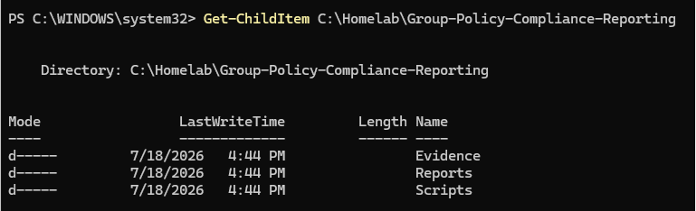
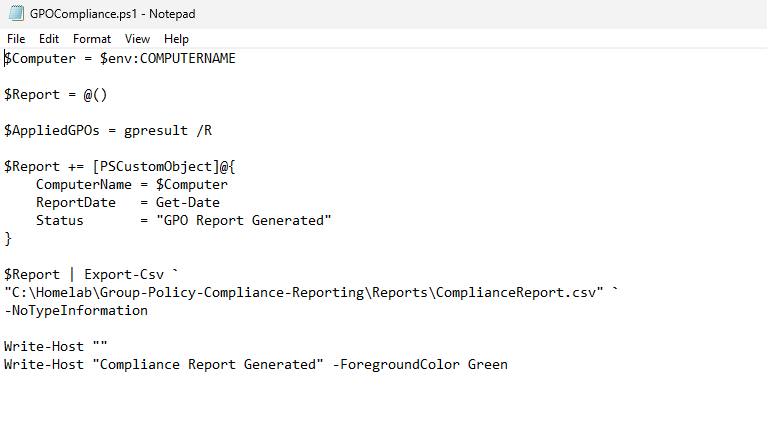
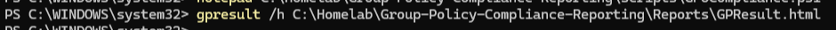
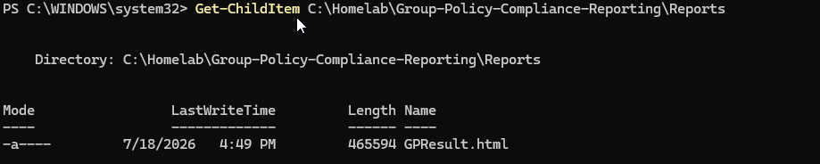
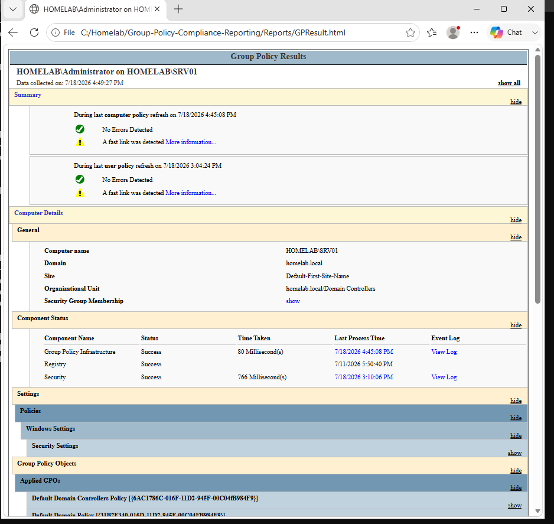
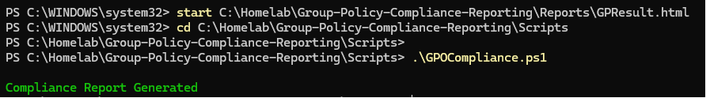
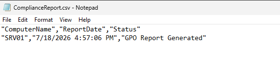
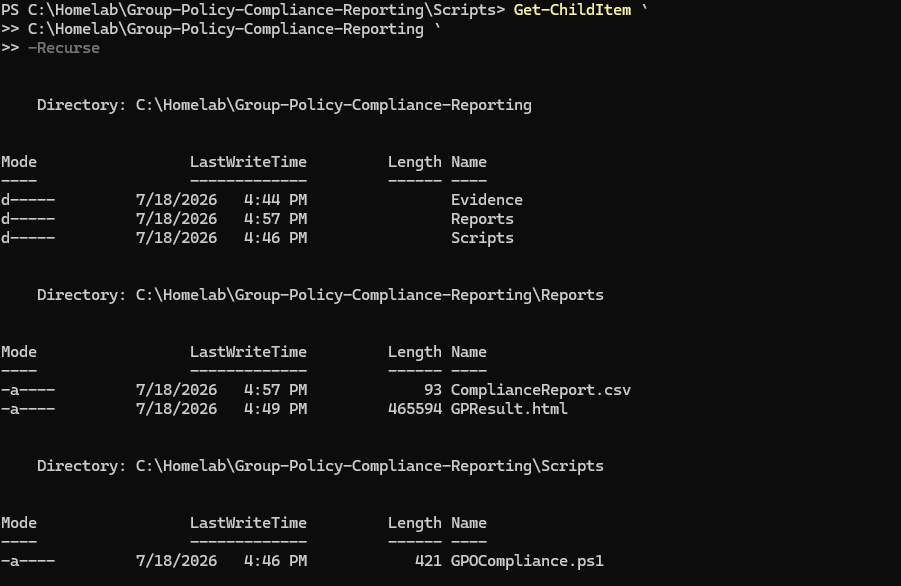

<div align="center">
  
</div>

---

# Overview

This module documents the creation of a PowerShell-based Group Policy compliance reporting workflow for the `homelab.local` environment.

The objective was to verify which Group Policy Objects were applied to a domain-joined workstation and convert the results into reusable evidence.

The implementation included:

- Creating the compliance-reporting project structure
- Developing the `GPOCompliance.ps1` script
- Running `gpresult` against the target system
- Generating an HTML Resultant Set of Policy report
- Reviewing applied and denied policies
- Creating a structured CSV compliance report
- Confirming that the final report files were generated

The final script used in this module is:

```text
Scripts/GPOCompliance.ps1
```

The generated reports are:

```text
Reports/GPResult.html
Reports/ComplianceReport.csv
```

---

# Why I Built This Module

Creating a Group Policy Object does not prove that it reached the intended user or computer.

A GPO may exist in Group Policy Management but still fail to apply because of:

- Incorrect OU placement
- Missing GPO link
- Security filtering
- Blocked inheritance
- Conflicting policies
- DNS or domain-controller connectivity
- User and computer scope differences
- Client-side processing failures

Earlier modules showed how to create and configure policies.

This module focused on answering a different question:

```text
Did the required policy actually apply?
```

I wanted to understand how an administrator can collect evidence from the client, review the Resultant Set of Policy, and document whether the system appears compliant.

The workflow I learned was:

```text
Define expectation
        ↓
Collect actual result
        ↓
Compare expected and applied policy
        ↓
Report compliance status
        ↓
Investigate exceptions
```

---

# Business Scenario

The organization manages Windows 11 workstations through Active Directory Group Policy.

Management requires evidence that approved workstation policies are reaching domain clients.

The Infrastructure Team must verify that required policies are being processed and provide a report showing:

- Target computer
- Target user
- Applied Group Policy Objects
- Missing or denied policies
- Report-generation time
- Compliance status
- Evidence location

The report may be used for:

- Security reviews
- Troubleshooting
- Change validation
- Audit evidence
- Configuration management
- Help Desk escalation
- Policy remediation

CLIENT01 is used as the test workstation for this module.

---

# Learning Objectives

By completing this module, I practiced the following:

- Understanding Group Policy compliance
- Distinguishing configuration from validation
- Running `gpresult`
- Generating an HTML Group Policy report
- Reviewing Resultant Set of Policy data
- Identifying applied GPOs
- Reviewing denied or filtered GPOs
- Understanding user and computer policy scope
- Creating a PowerShell compliance script
- Exporting compliance results to CSV
- Recording point-in-time evidence
- Understanding policy exceptions
- Building a basic remediation workflow
- Protecting administrative reports
- Documenting validation results

---

# Key Concepts Learned

## Group Policy Compliance

Group Policy compliance means that a user or computer is receiving the policies required by the organization.

Example:

```text
Required Policy:
Workstation Security Baseline
```

A compliant result means the expected policy appears in the client's applied policy data.

A non-compliant result may mean:

- The policy did not apply
- The policy was denied
- The system was outside the intended scope
- The report could not be collected
- The expected policy name did not match
- The client had not refreshed policy

---

## Configuration vs Compliance

Configuration and compliance are not the same.

```text
Configuration
=
The GPO was created and configured
```

```text
Compliance
=
The target user or computer received the required policy
```

A GPO can be configured correctly in the console but fail to apply to the client.

---

## Resultant Set of Policy

Resultant Set of Policy, or RSoP, shows the final policy settings and GPOs that affect a user or computer.

RSoP helps answer:

- Which GPOs applied?
- Which GPOs were denied?
- Which user was evaluated?
- Which computer was evaluated?
- Which policy source configured a setting?
- Was security filtering involved?
- Was the system in the expected OU?

---

## `gpupdate`

The command:

```cmd
gpupdate /force
```

forces Windows to refresh Group Policy.

It requests policy processing but does not provide a complete compliance report.

---

## `gpresult`

The command:

```cmd
gpresult /r
```

displays a summary of Group Policy results.

It can show:

- Applied Computer Settings
- Applied User Settings
- Security groups
- Applied GPOs
- Denied GPOs
- Domain information
- Logon information

---

## HTML GPResult Report

A detailed report can be generated using:

```cmd
gpresult /h C:\Reports\GPResult.html
```

The HTML version provides more detail than the basic text output and is easier to review or archive.

---

## Applied GPO

An applied GPO is a policy object that passed scope, inheritance, and filtering checks and was processed for the target user or computer.

---

## Denied GPO

A GPO may appear as denied because of:

- Security filtering
- WMI filtering
- Empty policy sections
- Disabled user settings
- Disabled computer settings
- GPO status
- Scope mismatch

A denied result is not automatically an error. It must be interpreted according to the intended design.

---

## User and Computer Scope

Group Policy has two major sections:

```text
Computer Configuration
```

and:

```text
User Configuration
```

Computer Configuration applies according to the computer object's location and scope.

User Configuration applies according to the user object's location and scope.

A policy may therefore apply to one section but not the other.

---

## Point-in-Time Evidence

The reports generated in this module represent Group Policy state at the time of collection.

They do not update automatically.

If the OU, GPO link, security filter, or client state changes, a new report must be generated.

---

# Lab Environment Specifications

| Component | Configuration |
|------------|---------------|
| Domain Controller | SRV01 |
| Domain | homelab.local |
| Client Computer | CLIENT01 |
| Client Operating System | Windows 11 Enterprise |
| Server Operating System | Windows Server 2025 Standard Evaluation |
| Automation Language | PowerShell |
| Script | `GPOCompliance.ps1` |
| HTML Report | `GPResult.html` |
| CSV Report | `ComplianceReport.csv` |
| Validation Command | `gpresult` |
| Report Type | Point-in-time compliance evidence |

---

# Folder Structure

```text
01-Identity-and-Access-Management
│
└── 10-Group-Policy-Compliance-Reporting
    │
    ├── README.md
    │
    ├── Evidence
    │   └── Screenshots
    │       ├── 01-Project-Folder.png
    │       ├── 02-Create-Compliance-Script.png
    │       ├── 03-Run-GPResult.png
    │       ├── 04-Generate-HTML-Report.png
    │       ├── 05-Open-GPResult-Report.png
    │       ├── 06-Create-Compliance-CSV.png
    │       ├── 07-Compliance-Report-Generated.png
    │       └── 08-Module-Complete.png
    │
    ├── Scripts
    │   └── GPOCompliance.ps1
    │
    └── Reports
        ├── ComplianceReport.csv
        └── GPResult.html
```

---

# Step-by-Step Implementation

---

## Step 1 — Create the Compliance Project Structure

Created the module folders for:

- PowerShell automation
- Generated reports
- Screenshots
- Documentation

Separating the script from generated evidence keeps the project easier to review and maintain.

<p align="center">
  
</p>

---

## Step 2 — Create the Compliance Script

Created:

```text
GPOCompliance.ps1
```

The script was designed to:

- Create the Reports folder when required
- Run Group Policy reporting commands
- Generate an HTML result
- Record compliance information
- Export the final CSV report

Example setup:

```powershell
$ReportPath = Join-Path `
    $PSScriptRoot `
    "..\Reports"

if (-not (Test-Path $ReportPath)) {
    New-Item `
        -Path $ReportPath `
        -ItemType Directory |
    Out-Null
}
```

Using `$PSScriptRoot` makes the script more reliable because it does not depend on the current terminal location.

<p align="center">
  
</p>

---

## Step 3 — Run GPResult

Ran Group Policy Result collection on the target client.

Command:

```cmd
gpresult /r
```

The output was reviewed for:

- Computer name
- User name
- Domain
- Applied computer GPOs
- Applied user GPOs
- Denied GPOs
- Group memberships

This provided a quick summary of the active policy state.

<p align="center">
  
</p>

---

## Step 4 — Generate the HTML Report

Generated a detailed Group Policy report.

Command:

```cmd
gpresult /h Reports\GPResult.html /f
```

The `/f` option allows an existing report file to be overwritten.

A full path may also be used:

```cmd
gpresult /h C:\Reports\GPResult.html /f
```

The HTML report provides a more detailed view than the basic console output.

<p align="center">
  
</p>

---

## Step 5 — Open and Review the GPResult Report

Opened:

```text
Reports/GPResult.html
```

The report was reviewed for:

- Target computer
- Target user
- Applied GPOs
- Denied GPOs
- Security-group membership
- Component status
- Policy-processing information

The HTML report became the main detailed evidence for the target workstation.

<p align="center">
  
</p>

---

## Step 6 — Create the Compliance CSV

Created a structured compliance record and exported it to:

```text
Reports/ComplianceReport.csv
```

Example report fields:

```text
ComputerName
UserName
ExpectedGPO
ComplianceStatus
EvidenceFile
GeneratedAt
Notes
```

Example PowerShell object:

```powershell
$ComplianceResult = [PSCustomObject]@{
    ComputerName     = $env:COMPUTERNAME
    UserName         = $env:USERNAME
    ExpectedGPO      = "Workstation Security Baseline"
    ComplianceStatus = "Compliant"
    EvidenceFile     = "GPResult.html"
    GeneratedAt      = Get-Date
    Notes            = "Expected policy found in Group Policy results."
}
```

The exact compliance logic depends on the implementation inside `GPOCompliance.ps1`.

<p align="center">
  
</p>

---

## Step 7 — Confirm the Compliance Report Was Generated

Verified that:

```text
ComplianceReport.csv
```

was created successfully.

The report provided a concise summary that could be sorted, filtered, or compared with future results.

<p align="center">
  
</p>

---

## Step 8 — Verify the Completed Module

Reviewed the final project and confirmed the presence of:

```text
Scripts/GPOCompliance.ps1
```

```text
Reports/GPResult.html
```

```text
Reports/ComplianceReport.csv
```

This completed the first version of the Group Policy compliance workflow.

<p align="center">
  
</p>

---

# Compliance Workflow

```text
Required Policy Defined
          │
          ▼
Run Group Policy Collection
          │
          ▼
Generate GPResult HTML
          │
          ▼
Review Applied and Denied GPOs
          │
          ▼
Compare Expected Policy
          │
          ├── Found
          │     ↓
          │  Compliant
          │
          ├── Not Found
          │     ↓
          │  Non-Compliant
          │
          └── Collection Failed
                ↓
           Not Evaluated
          │
          ▼
Export Compliance CSV
          │
          ▼
Document Remediation
```

---

# Suggested Compliance States

| Status | Meaning |
|--------|---------|
| Compliant | Required GPO was found in the applied policy results |
| Non-Compliant | Required GPO was expected but was not applied |
| Not Evaluated | Report could not be collected or the target was unavailable |
| Not Applicable | Policy was not intended for the target |
| Review Required | Evidence was incomplete or conflicting |

Using more than only `Pass` and `Fail` creates clearer reporting.

---

# Example Script Structure

The compliance script may follow a structure similar to:

```powershell
$ReportDirectory = Join-Path `
    $PSScriptRoot `
    "..\Reports"

$HtmlReport = Join-Path `
    $ReportDirectory `
    "GPResult.html"

$CsvReport = Join-Path `
    $ReportDirectory `
    "ComplianceReport.csv"

$ExpectedGPO = "Workstation Security Baseline"

if (-not (Test-Path $ReportDirectory)) {
    New-Item `
        -Path $ReportDirectory `
        -ItemType Directory |
    Out-Null
}

gpresult /h $HtmlReport /f

$GpResultText = gpresult /r

if ($GpResultText -match [regex]::Escape($ExpectedGPO)) {
    $Status = "Compliant"
    $Notes = "Expected GPO found in applied results."
}
else {
    $Status = "Non-Compliant"
    $Notes = "Expected GPO not found in applied results."
}

[PSCustomObject]@{
    ComputerName     = $env:COMPUTERNAME
    UserName         = $env:USERNAME
    ExpectedGPO      = $ExpectedGPO
    ComplianceStatus = $Status
    EvidenceFile     = "GPResult.html"
    GeneratedAt      = Get-Date
    Notes            = $Notes
} |
Export-Csv `
    -Path $CsvReport `
    -NoTypeInformation
```

The repository script is the source of truth for the exact implementation.

---

# Validation Results

| Validation Check | Result |
|------------------|--------|
| Project folder created | ✅ |
| Compliance script created | ✅ |
| Group Policy result collected | ✅ |
| `gpresult /r` executed | ✅ |
| HTML GPResult report generated | ✅ |
| GPResult report opened and reviewed | ✅ |
| Compliance CSV logic created | ✅ |
| `ComplianceReport.csv` generated | ✅ |
| Final report files confirmed | ✅ |
| Multi-computer collection | ⏭️ Future improvement |
| Remote collection | ⏭️ Future improvement |
| Historical trend comparison | ⏭️ Future improvement |
| Automated remediation | ⏭️ Future improvement |

---

# Troubleshooting Notes

## `gpresult` Returns Access Denied

Some Group Policy reporting operations require an elevated Command Prompt or PowerShell session.

Run the terminal as an authorized administrator and retry.

---

## No RSoP Data Is Available

Possible causes include:

- User has not signed in
- Computer has not completed policy processing
- WMI repository issue
- Client is not domain joined
- Domain controller is unavailable
- DNS is incorrect
- Report is being generated for the wrong user

Useful commands:

```cmd
gpupdate /force
```

```cmd
gpresult /r
```

---

## Required GPO Does Not Appear

Check:

1. Is the GPO linked?
2. Is the target in the correct OU?
3. Is the correct user or computer scope being checked?
4. Does security filtering allow the target?
5. Is inheritance blocked?
6. Is the GPO enabled?
7. Is one section disabled?
8. Is a WMI filter denying application?
9. Has Group Policy refreshed?
10. Can the client contact the domain controller?

---

## GPO Appears as Denied

The HTML report may show a reason such as:

- Security Filtering
- WMI Filter
- Empty GPO
- Disabled GPO section
- Inaccessible GPO
- Scope mismatch

The denied reason should be compared with the intended design.

---

## HTML Report Is Not Created

Check:

- Reports folder exists
- The script has write permission
- File is not open
- Path is valid
- `gpresult` completed
- Existing file requires `/f`

Command:

```cmd
gpresult /h Reports\GPResult.html /f
```

---

## CSV Report Is Empty

Possible causes include:

- Compliance object was not created
- Export ran before data collection
- Script stopped due to an error
- Output path is wrong
- Expected GPO variable is blank
- `gpresult` output was not captured correctly

Use:

```powershell
$ErrorActionPreference = "Stop"
```

and `try/catch` for clearer error handling.

---

## Script Works Only from One Folder

This usually happens when the script uses a relative path based on the terminal's current location.

Use:

```powershell
$PSScriptRoot
```

to build reliable paths.

---

## Computer Policy Is Missing but User Policy Appears

The GPO may contain only user settings, or the computer object may be outside the linked OU.

Check both sections separately:

```text
Computer Configuration
User Configuration
```

---

## Policy Was Recently Changed

Group Policy changes may require:

- `gpupdate /force`
- User sign-out and sign-in
- Computer restart
- Active Directory replication
- SYSVOL replication
- Background refresh

Do not mark a client non-compliant before confirming that it had a reasonable opportunity to process the change.

---

# Remediation Workflow

When a required GPO is missing:

```text
Confirm Expected Policy
        ↓
Check Target OU
        ↓
Check GPO Link
        ↓
Check Security Filtering
        ↓
Check Inheritance
        ↓
Check WMI Filter
        ↓
Check DNS and Domain Connectivity
        ↓
Run gpupdate
        ↓
Generate New gpresult
        ↓
Confirm Compliance
```

The remediation should address the cause rather than only forcing policy repeatedly.

---

# Security Notes

## Reports May Contain Sensitive Information

GPResult reports may reveal:

- Usernames
- Computer names
- Domain names
- Security groups
- GPO names
- OU paths
- Internal configuration
- Security settings
- Administrative design

Public evidence should use test data and should be reviewed before upload.

---

## Do Not Publish Confidential Policy Details

Some GPOs may contain information related to:

- Security controls
- Administrative paths
- Software deployment locations
- Internal servers
- Logon scripts
- Restricted groups
- Firewall configuration

Only publish information suitable for a public portfolio.

---

## Protect Report Integrity

Compliance reports should not be changed silently after collection.

A stronger evidence process may include:

- Generation timestamp
- File hash
- Script version
- Collector identity
- Read-only storage
- Change ticket
- Central repository

---

## Compliance Does Not Guarantee Security

A system can receive all required GPOs and still have:

- Vulnerable software
- Local misconfiguration
- Malware
- Missing updates
- Unauthorized applications
- Weak operational controls

Group Policy compliance is one part of a broader security program.

---

## Avoid Automatic Remediation Without Testing

A script that automatically changes OU membership, GPO links, or security filtering can affect many systems.

Automatic remediation should include:

- Approval
- Test scope
- Logging
- Rollback
- Validation
- Change control

---

# Useful Commands

## Force Group Policy refresh

```cmd
gpupdate /force
```

---

## Display Group Policy summary

```cmd
gpresult /r
```

---

## Generate HTML GPResult report

```cmd
gpresult /h Reports\GPResult.html /f
```

---

## Generate report for a specific user

```cmd
gpresult /user HOMELAB\john.smith /h Reports\JohnSmith-GPResult.html /f
```

---

## Generate computer-only report

```cmd
gpresult /scope computer /r
```

---

## Generate user-only report

```cmd
gpresult /scope user /r
```

---

## View GPOs in the domain

Run on SRV01:

```powershell
Get-GPO -All |
Select-Object DisplayName, Id, GpoStatus, ModificationTime
```

---

## Export a GPO configuration report

```powershell
Get-GPOReport `
    -Name "Workstation Security Baseline" `
    -ReportType Html `
    -Path ".\Reports\Workstation-Security-Baseline.html"
```

---

## Generate RSoP through PowerShell

```powershell
Get-GPResultantSetOfPolicy `
    -ReportType Html `
    -Path ".\Reports\RSoP.html"
```

---

## Review computer domain membership

```powershell
Get-CimInstance Win32_ComputerSystem |
Select-Object Name, Domain, PartOfDomain
```

---

## Verify domain-controller discovery

```cmd
nltest /dsgetdc:homelab.local
```

---

# Skills Demonstrated

- Group Policy Compliance
- PowerShell Automation
- Resultant Set of Policy
- `gpresult`
- Group Policy Troubleshooting
- HTML Report Generation
- CSV Reporting
- Compliance Validation
- Policy Scope Analysis
- Security Filtering Awareness
- OU and GPO Link Review
- Administrative Reporting
- Evidence Collection
- Windows 11 Administration
- Windows Server 2025
- Technical Documentation

---

# Interview Notes

## What is Group Policy compliance?

Group Policy compliance means that the required policies are being applied to the intended users or computers.

---

## Why does creating a GPO not prove compliance?

A GPO may be created but not linked, may target the wrong OU, may be denied by filtering, or may fail to process on the client.

---

## What is the difference between `gpupdate` and `gpresult`?

`gpupdate` requests a policy refresh.

`gpresult` shows which policies were applied or denied.

---

## What is Resultant Set of Policy?

RSoP is the final combination of Group Policy settings that affect a user or computer after scope, inheritance, filtering, and precedence are evaluated.

---

## How would you verify a GPO applied?

I would use:

```cmd
gpresult /r
```

or generate a detailed report:

```cmd
gpresult /h GPResult.html
```

Then I would confirm the GPO appears in the applied list and validate the expected client behavior.

---

## Why might a GPO appear as denied?

Possible causes include security filtering, WMI filtering, disabled GPO sections, empty settings, or scope mismatch.

---

## What is the difference between computer and user policy?

Computer policy applies according to the computer object.

User policy applies according to the user object.

---

## What does Non-Compliant mean?

It means an expected policy was not found or the required configuration was not confirmed.

The reason must still be investigated.

---

## What does Not Evaluated mean?

It means valid compliance evidence could not be collected, such as when the client was offline or reporting failed.

---

## Why are reports point-in-time evidence?

They represent the state when the report was generated.

Later policy or directory changes require a new report.

---

# What I Learned

The most important lesson from this module was that configuration and compliance are two separate stages.

Earlier, I focused on creating GPOs and confirming that the settings looked correct in Group Policy Management.

This module required me to check the client's actual result.

```text
GPO created
```

does not always mean:

```text
GPO applied
```

The HTML report made it easier to see applied and denied policies, while the CSV report provided a simpler compliance summary.

I also learned that non-compliance is a result, not a root cause.

A missing policy may be caused by:

- OU placement
- Link configuration
- Filtering
- Inheritance
- Client communication
- DNS
- Processing delay

The workflow I want to remember is:

```text
Define the expected policy
        ↓
Collect the real client result
        ↓
Compare expected and actual state
        ↓
Investigate exceptions
        ↓
Generate new evidence after remediation
```

---

# Future Improvements

To expand this module, I would add:

- Multi-computer compliance collection
- Remote PowerShell collection
- Computer inventory input
- Required-GPO baseline file
- Multiple policy checks
- Compliant, Non-Compliant, and Not Evaluated states
- Policy-version comparison
- GPO modification timestamps
- HTML compliance dashboard
- Scheduled reporting
- Email summary
- Historical trend comparison
- Automatic exception tickets
- Central evidence storage
- Report hashing
- Script logging
- Pester testing
- Microsoft Intune compliance comparison
- Microsoft Defender configuration review
- CIS benchmark mapping

A future baseline file could look like:

```csv
TargetType,TargetName,RequiredGPO
Computer,CLIENT01,Workstation Security Baseline
Computer,CLIENT01,Windows LAPS Policy
User,john.smith,Screen Saver Policy
```

The script could then compare each target against its required policies.

---

# Key Takeaways

This module created a repeatable Group Policy compliance-reporting workflow.

The final implementation included:

- Running Group Policy Result collection
- Generating an HTML RSoP report
- Reviewing applied and denied GPOs
- Creating a structured compliance CSV
- Confirming the final report files

The main lessons were:

```text
Creating a GPO does not prove that it applied.
```

```text
Use gpresult to validate the client state.
```

```text
Compare expected policy with actual results.
```

```text
Treat reports as point-in-time evidence.
```

```text
Investigate the cause before applying remediation.
```

This completes the initial Identity and Access Management section of the homelab.

---

<div align="center">

### Module Status

✅ Completed Successfully

**Script:** [`GPOCompliance.ps1`](Scripts/GPOCompliance.ps1)

**Reports:**

- [`ComplianceReport.csv`](Reports/ComplianceReport.csv)
- [`GPResult.html`](Reports/GPResult.html)

**Next Category:** [Core Infrastructure](../../02-Core-Infrastructure/)

**Next Module:** [DNS Infrastructure](../../02-Core-Infrastructure/01-DNS-Infrastructure/)

</div>