<div align="center">
  
</div>

---

# Overview

This module documents the configuration and validation of Domain Name System services in the `homelab.local` environment.

DNS was installed automatically when SRV01 was promoted to a domain controller, but the purpose of this module was to understand how the DNS infrastructure is organized and how name resolution is validated.

The implementation included:

- Opening DNS Manager
- Reviewing the forward lookup zone
- Reviewing the `homelab.local` zone
- Verifying the domain controller A record
- Creating a test A record
- Creating a reverse lookup zone
- Verifying PTR records
- Testing forward name resolution
- Testing reverse name resolution
- Testing hostname connectivity
- Reviewing the completed DNS configuration

This module demonstrates why DNS is one of the most important supporting services in an Active Directory environment.

---

# Why I Built This Module

Earlier in the homelab, CLIENT01 had to use SRV01 as its DNS server before it could join the domain.

At first, it was easy to think of DNS only as a service that translates a hostname into an IP address.

This module helped me understand that Active Directory uses DNS for much more than ordinary name lookup.

Domain computers use DNS to locate:

- Domain controllers
- Kerberos authentication services
- LDAP
- Global Catalog servers
- Group Policy resources
- Other domain services

I also learned that basic connectivity and DNS resolution should be tested separately.

```text
IP address works
+
Hostname fails
=
Likely DNS problem
```

That troubleshooting distinction is important because a successful ping by IP does not prove that DNS is functioning.

---

# Business Scenario

The organization uses Active Directory to manage users, computers, authentication, and Group Policy.

Domain clients must be able to locate SRV01 and the `homelab.local` domain reliably.

The Infrastructure Team must verify that the DNS environment provides:

- Forward name resolution
- Reverse name resolution
- Domain-controller records
- Host A records
- PTR records
- Client name-resolution support
- Consistent results from administrative tools

A test DNS record is created to demonstrate how administrators add and validate host records.

A reverse lookup zone is also created to support IP-to-name resolution.

---

# Learning Objectives

By completing this module, I practiced the following:

- Opening DNS Manager
- Navigating DNS server zones
- Understanding forward lookup zones
- Reviewing an Active Directory-integrated DNS zone
- Understanding A records
- Creating a test host record
- Understanding reverse lookup zones
- Understanding PTR records
- Running forward lookup tests
- Running reverse lookup tests
- Testing name resolution with `ping`
- Distinguishing IP connectivity from DNS resolution
- Understanding Active Directory DNS dependencies
- Troubleshooting common DNS failures
- Documenting DNS evidence

---

# Key Concepts Learned

## Domain Name System

DNS translates human-readable names into IP addresses.

Example:

```text
SRV01.homelab.local
```

resolves to:

```text
192.168.241.10
```

This allows users and systems to communicate using names instead of remembering numeric addresses.

---

## Forward Lookup Zone

A forward lookup zone translates:

```text
Hostname
→ IP address
```

Example:

```text
SRV01.homelab.local
→ 192.168.241.10
```

The forward lookup zone in this lab is:

```text
homelab.local
```

---

## Reverse Lookup Zone

A reverse lookup zone translates:

```text
IP address
→ Hostname
```

Example:

```text
192.168.241.10
→ SRV01.homelab.local
```

Reverse lookup is useful for:

- Troubleshooting
- Logging
- Some applications
- Security investigations
- Administrative verification

---

## A Record

An A record maps an IPv4 hostname to an IPv4 address.

Example:

```text
test.homelab.local
→ 192.168.241.20
```

A records are commonly used for:

- Servers
- Workstations
- Applications
- Network devices
- Internal services

---

## PTR Record

A PTR record maps an IP address to a hostname.

Example:

```text
192.168.241.10
→ SRV01.homelab.local
```

PTR records are stored in reverse lookup zones.

---

## SRV Record

Service records identify systems that provide specific services.

Active Directory uses SRV records to advertise services such as:

- LDAP
- Kerberos
- Global Catalog
- Domain controllers

Example service lookup:

```text
_ldap._tcp.dc._msdcs.homelab.local
```

These records help clients discover domain controllers.

---

## Active Directory-Integrated DNS

An Active Directory-integrated zone stores DNS information inside Active Directory.

Benefits include:

- Secure dynamic updates
- Active Directory replication
- Multi-domain-controller support
- Centralized management
- Improved availability

This lab uses an Active Directory-integrated DNS zone.

---

## Recursive DNS Resolution

When the DNS server does not host a requested external domain, it can query other DNS servers.

Example:

```text
CLIENT01 asks SRV01 for microsoft.com
           ↓
SRV01 does not host that zone
           ↓
SRV01 forwards or recursively resolves the request
           ↓
Answer returned to CLIENT01
```

---

## DNS Forwarder

A DNS forwarder is another DNS server used for queries that the local server cannot answer.

Examples may include:

- ISP DNS
- Router DNS
- Approved public DNS
- Central corporate DNS

Domain clients should still use the internal Active Directory DNS server directly.

The internal DNS server can then forward external queries.

---

## DNS Cache

DNS clients and servers store recent results temporarily.

Caching improves performance but may cause old results to remain visible after a record changes.

Useful command:

```cmd
ipconfig /flushdns
```

This clears the client DNS resolver cache.

---

# Lab Environment Specifications

| Component | Configuration |
|------------|---------------|
| DNS Server | SRV01 |
| Server Operating System | Windows Server 2025 Standard Evaluation |
| Active Directory Domain | homelab.local |
| DNS Zone | homelab.local |
| DNS Zone Type | Active Directory-integrated |
| Domain Controller IP | 192.168.241.10 |
| Client Computer | CLIENT01 |
| Client DNS Server | 192.168.241.10 |
| Forward Lookup | Hostname to IPv4 |
| Reverse Lookup | IPv4 to hostname |
| Administration Tool | DNS Manager |
| Validation Tools | `nslookup`, `ping`, `Resolve-DnsName` |

---

# Folder Structure

```text
02-Core-Infrastructure
│
└── 01-DNS-Infrastructure
    │
    ├── README.md
    │
    └── Evidence
        └── Screenshots
            ├── 01-Open-DNS-Manager.png
            ├── 02-Forward-Lookup-Zone.png
            ├── 03-homelab.local-Zone.png
            ├── 04-Domain-Controller-A-Record.png
            ├── 05-Create-Test-A-Record.png
            ├── 06-Test-A-Record-Created.png
            ├── 07-Reverse-Lookup-Zone-Wizard.png
            ├── 08-Reverse-Lookup-Zone-Created.png
            ├── 09-PTR-Records-Verification.png
            ├── 10-NSLookup-Test.png
            ├── 11-Reverse-NSLookup-Test.png
            ├── 12-Ping-Name-Resolution-Test.png
            └── 13-DNS-Manager-Final-Configuration.png
```

---

# Step-by-Step Implementation

---

## Step 1 — Open DNS Manager

Opened:

```text
Server Manager
      ↓
Tools
      ↓
DNS
```

DNS Manager provides a graphical interface for managing:

- DNS servers
- Forward lookup zones
- Reverse lookup zones
- Resource records
- Forwarders
- Root hints
- Server properties

<p align="center">
  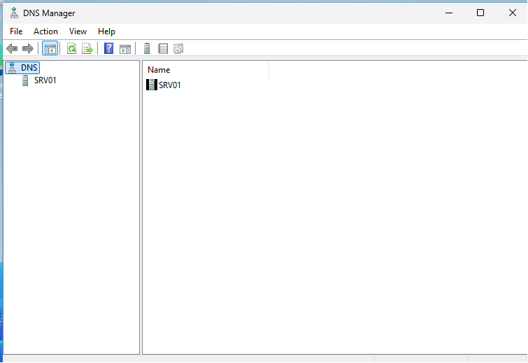
</p>

---

## Step 2 — Review the Forward Lookup Zone

Expanded the DNS server and opened:

```text
Forward Lookup Zones
```

Forward lookup zones contain records used to resolve names into IP addresses.

The zone created for Active Directory was visible under this section.

<p align="center">
  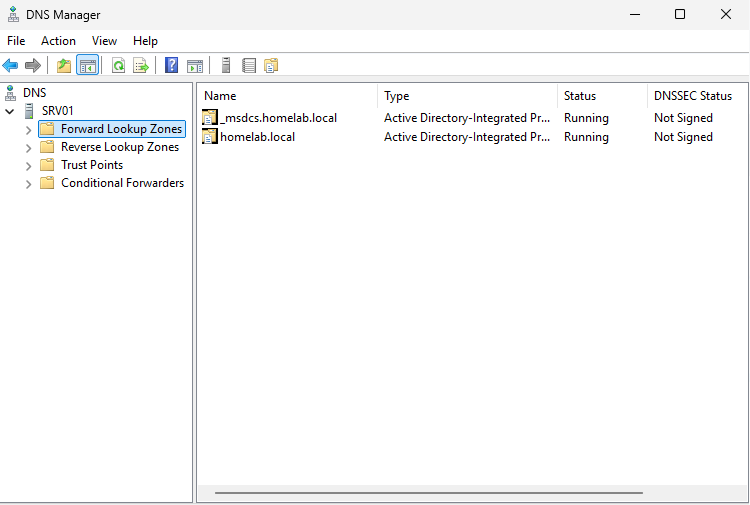
</p>

---

## Step 3 — Review the `homelab.local` Zone

Opened:

```text
homelab.local
```

The zone contained DNS records used by the domain.

These records included:

- Host records
- Name server records
- Start of Authority record
- Active Directory service records
- Domain-controller records

The zone is required for domain clients to locate Active Directory services.

<p align="center">
  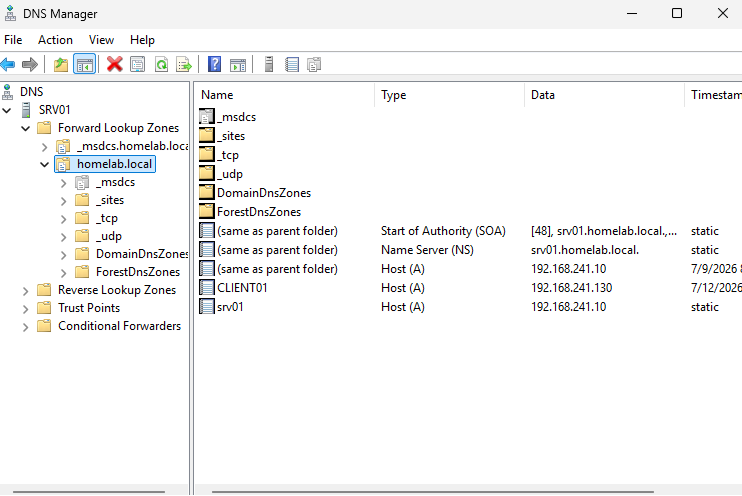
</p>

---

## Step 4 — Verify the Domain Controller A Record

Reviewed the A record for SRV01.

The expected relationship was:

```text
SRV01.homelab.local
→ 192.168.241.10
```

This record allows domain computers to resolve the domain controller by hostname.

<p align="center">
  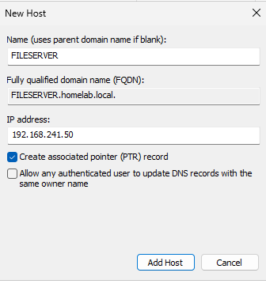
</p>

---

## Step 5 — Create a Test A Record

Created a test host record in the `homelab.local` zone.

The record was used to practice manually adding a hostname and IPv4 address.

A record creation requires:

- Hostname
- IPv4 address
- Correct zone
- Optional PTR record creation

The test entry should use an address that does not conflict with another device.

<p align="center">
  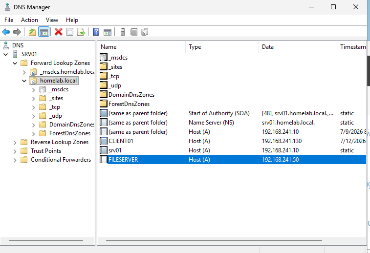
</p>

---

## Step 6 — Verify the Test A Record

Confirmed that the new host record appeared in the forward lookup zone.

This verified that the record was created successfully.

The new entry could then be queried using:

```cmd
nslookup <test-hostname>.homelab.local
```

<p align="center">
  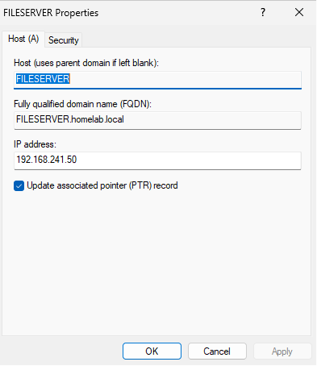
</p>

---

## Step 7 — Start the Reverse Lookup Zone Wizard

Opened the New Zone Wizard under:

```text
Reverse Lookup Zones
```

A reverse lookup zone was required to support IP-to-hostname resolution.

The wizard was used to define the reverse network range.

<p align="center">
  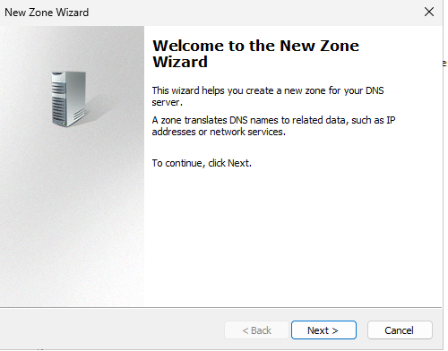
</p>

---

## Step 8 — Create the Reverse Lookup Zone

Completed the reverse lookup zone configuration.

For a `/24` network such as:

```text
192.168.241.0/24
```

the corresponding reverse zone is based on:

```text
241.168.192.in-addr.arpa
```

The zone stores PTR records for addresses in the network.

<p align="center">
  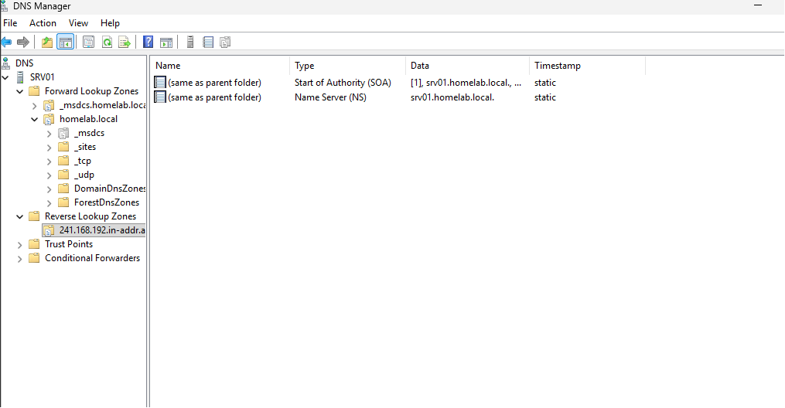
</p>

---

## Step 9 — Verify PTR Records

Reviewed the reverse lookup zone and confirmed that PTR records were available.

The expected domain-controller mapping was:

```text
192.168.241.10
→ SRV01.homelab.local
```

A PTR record supports reverse name resolution.

<p align="center">
  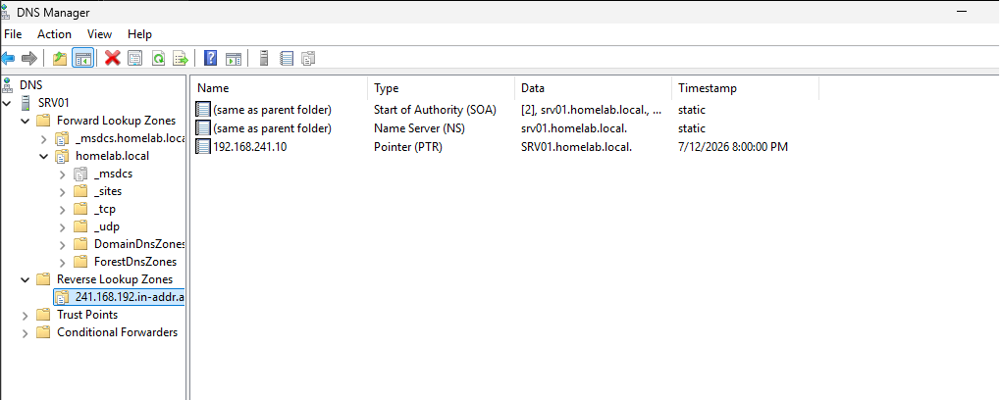
</p>

---

## Step 10 — Test Forward Resolution with NSLookup

Used `nslookup` to test forward name resolution.

Example:

```cmd
nslookup SRV01.homelab.local
```

Expected result:

```text
Name:    SRV01.homelab.local
Address: 192.168.241.10
```

This confirmed that the hostname could be resolved to the expected IP address.

<p align="center">
  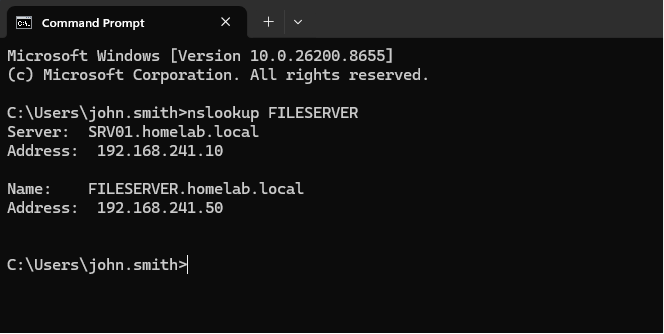
</p>

---

## Step 11 — Test Reverse Resolution with NSLookup

Used `nslookup` with the IP address.

Command:

```cmd
nslookup 192.168.241.10
```

Expected result:

```text
Name: SRV01.homelab.local
```

This confirmed that the PTR record supported reverse lookup.

<p align="center">
  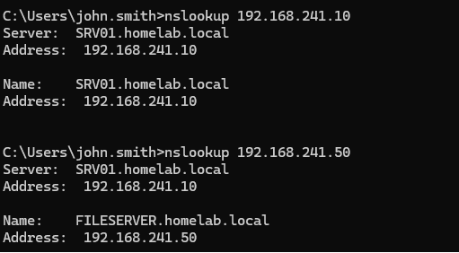
</p>

---

## Step 12 — Test Name Resolution with Ping

Tested hostname resolution and basic connectivity using:

```cmd
ping SRV01.homelab.local
```

The test checked two things:

1. Whether the hostname resolved
2. Whether the target responded to ICMP

A failed ping does not always mean DNS failed because ICMP may be blocked.

However, the displayed IP address still shows whether name resolution succeeded.

<p align="center">
  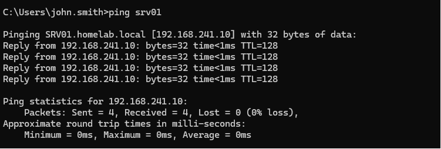
</p>

---

## Step 13 — Review the Final DNS Configuration

Reviewed DNS Manager after completing the forward and reverse lookup configuration.

The final environment included:

- `homelab.local` forward lookup zone
- SRV01 A record
- Test A record
- Reverse lookup zone
- PTR records
- Successful forward lookup
- Successful reverse lookup
- Successful hostname resolution

<p align="center">
  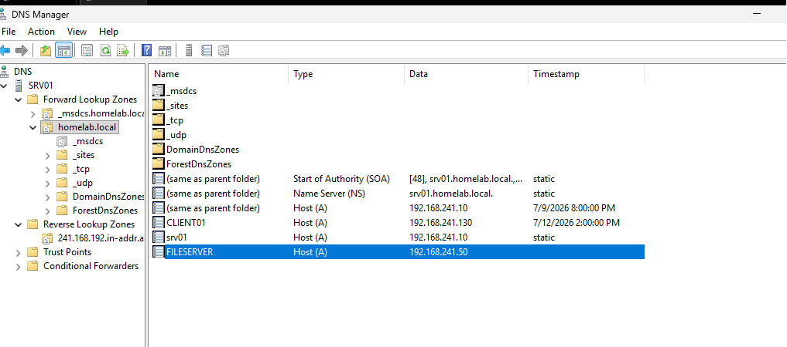
</p>

---

# DNS Resolution Workflow

```text
CLIENT01
   │
   ▼
DNS Query Sent to SRV01
   │
   ├── Internal name?
   │      │
   │      └── Answer from homelab.local zone
   │
   └── External name?
          │
          └── Forward or recursively resolve
                   │
                   ▼
              Return Answer
```

---

# Forward and Reverse Resolution

```text
Forward Lookup

SRV01.homelab.local
        ↓
192.168.241.10
```

```text
Reverse Lookup

192.168.241.10
        ↓
SRV01.homelab.local
```

---

# Active Directory DNS Workflow

```text
CLIENT01 needs a domain controller
               │
               ▼
Queries DNS for Active Directory service records
               │
               ▼
DNS returns SRV01 service information
               │
               ▼
CLIENT01 contacts SRV01
               │
               ▼
Authentication and Group Policy proceed
```

---

# Validation Results

| Validation Check | Result |
|------------------|--------|
| DNS Manager opened | ✅ |
| Forward Lookup Zones reviewed | ✅ |
| `homelab.local` zone reviewed | ✅ |
| SRV01 A record verified | ✅ |
| Test A record created | ✅ |
| Test A record visible in zone | ✅ |
| Reverse lookup zone created | ✅ |
| PTR records reviewed | ✅ |
| Forward `nslookup` succeeded | ✅ |
| Reverse `nslookup` succeeded | ✅ |
| Hostname resolution tested with `ping` | ✅ |
| Final DNS configuration reviewed | ✅ |
| DNS forwarders documented | ⏭️ Future improvement |
| DNS event logging reviewed | ⏭️ Future improvement |
| DNS scavenging configured | ⏭️ Future improvement |

---

# Troubleshooting Guide

## Scenario 1 — IP Address Works but Hostname Fails

Example:

```cmd
ping 192.168.241.10
```

works, but:

```cmd
ping SRV01.homelab.local
```

fails.

This usually indicates a DNS problem rather than a complete network failure.

### Step 1 — Check the client DNS server

```cmd
ipconfig /all
```

Confirm that CLIENT01 uses:

```text
192.168.241.10
```

as its DNS server.

### Step 2 — Query the record directly

```cmd
nslookup SRV01.homelab.local
```

### Step 3 — Use PowerShell resolution

```powershell
Resolve-DnsName SRV01.homelab.local
```

### Step 4 — Check the A record

On SRV01:

```powershell
Get-DnsServerResourceRecord `
    -ZoneName "homelab.local" `
    -Name "SRV01"
```

### Step 5 — Check the DNS service

```powershell
Get-Service DNS
```

### Step 6 — Clear the client cache

```cmd
ipconfig /flushdns
```

### Step 7 — Register DNS again

```cmd
ipconfig /registerdns
```

---

## Scenario 2 — Hostname Resolves to the Wrong IP

Possible causes:

- Old A record
- Duplicate A record
- Cached DNS response
- Dynamic update issue
- Reused hostname
- Incorrect manual record

Check:

```cmd
nslookup SRV01.homelab.local
```

Then review the record in DNS Manager or PowerShell.

```powershell
Get-DnsServerResourceRecord `
    -ZoneName "homelab.local" `
    -Name "SRV01"
```

After correcting the record:

```cmd
ipconfig /flushdns
```

---

## Scenario 3 — Forward Lookup Works but Reverse Lookup Fails

Example:

```cmd
nslookup SRV01.homelab.local
```

works, but:

```cmd
nslookup 192.168.241.10
```

fails.

This usually means:

- Reverse lookup zone is missing
- PTR record is missing
- PTR record contains the wrong hostname
- The reverse zone uses the wrong network ID

Check:

```powershell
Get-DnsServerZone
```

and:

```powershell
Get-DnsServerResourceRecord `
    -ZoneName "241.168.192.in-addr.arpa"
```

---

## Scenario 4 — Internet Works but Domain Join Fails

This often happens when the client uses public DNS instead of the internal Active Directory DNS server.

Example:

```text
Internet websites resolve
homelab.local does not resolve
```

Correct design:

```text
CLIENT01 DNS
→ SRV01
```

Then SRV01 resolves or forwards external queries.

Incorrect design:

```text
CLIENT01 DNS
→ Public DNS only
```

Public DNS does not contain the private Active Directory records.

---

## Scenario 5 — NSLookup Shows the Wrong DNS Server

Run:

```cmd
nslookup
```

The first lines show which DNS server is being queried.

If it is not SRV01, review:

- Static adapter configuration
- DHCP options
- Alternate DNS server
- VPN adapter
- Multiple network adapters
- IPv6 configuration

---

## Scenario 6 — DNS Server Is Running but Queries Fail

Check:

```powershell
Get-Service DNS
```

Then review:

- DNS Manager
- Zone status
- Event Viewer
- Firewall rules
- Network interface binding
- Active Directory health
- Server IP configuration

Useful commands:

```cmd
dcdiag /test:dns
```

```powershell
Get-DnsServerZone
```

```powershell
Get-DnsServerForwarder
```

---

## Scenario 7 — Recent Record Change Is Not Visible

The old result may be cached.

Clear the client cache:

```cmd
ipconfig /flushdns
```

Clear server cache when appropriate:

```powershell
Clear-DnsServerCache -Force
```

Then test again:

```cmd
nslookup <hostname>
```

---

# Technical Decisions

## Why Should Domain Clients Use SRV01 for DNS?

SRV01 hosts the private records required for `homelab.local`.

These records are not available from public DNS services.

Using SRV01 allows clients to locate:

- Domain controllers
- Kerberos
- LDAP
- Group Policy
- Internal systems

---

## Why Not Configure Public DNS Directly on CLIENT01?

If CLIENT01 uses public DNS directly, it may resolve internet names but fail to resolve private Active Directory services.

The correct model is:

```text
CLIENT01
   ↓
SRV01 DNS
   ↓
Forwarder for external names
```

---

## Why Create a Reverse Lookup Zone?

A reverse zone supports IP-to-hostname resolution.

It is useful for:

- Troubleshooting
- Security logs
- Administrative validation
- Some network applications
- Identifying hosts by address

---

## Why Create a Test A Record?

The test record demonstrated the complete record lifecycle:

```text
Create
  ↓
Verify
  ↓
Query
  ↓
Document
```

It also provided a safe way to practice DNS administration without changing the SRV01 record.

---

## Why Test with More Than One Tool?

Each tool provides a different type of evidence.

```text
ping
=
Name resolution plus ICMP connectivity
```

```text
nslookup
=
DNS query result and responding DNS server
```

```text
Resolve-DnsName
=
Detailed PowerShell DNS output
```

Using multiple tools helps confirm the result and narrow failures.

---

# Security Notes

## Restrict Dynamic Updates

Active Directory-integrated zones should normally use secure dynamic updates.

This reduces the risk of unauthorized systems registering or changing records.

---

## Protect DNS Administration

Only approved administrators should be allowed to:

- Create zones
- Delete zones
- Modify critical records
- Change forwarders
- Clear server cache
- Configure scavenging

---

## Avoid Publishing Real Infrastructure Details

Public documentation should avoid exposing:

- Public IP addresses
- Real company domain names
- External DNS architecture
- Production server names
- Sensitive internal records
- Credential information

This portfolio uses a test domain and private address range.

---

## Monitor DNS Changes

Unauthorized DNS changes can redirect users or disrupt authentication.

A stronger environment should audit:

- Record creation
- Record deletion
- Zone changes
- Forwarder changes
- Dynamic update failures
- DNS service failures

---

## Back Up Active Directory and DNS

Active Directory-integrated DNS records are protected through Active Directory backup and replication.

A recovery plan should still include:

- System State backup
- Multiple domain controllers
- Tested restore procedures
- Configuration documentation
- Disaster recovery runbooks

---

# Useful Commands

## Review client IP and DNS configuration

```cmd
ipconfig /all
```

---

## Clear client DNS cache

```cmd
ipconfig /flushdns
```

---

## Register client DNS records

```cmd
ipconfig /registerdns
```

---

## Test forward resolution

```cmd
nslookup SRV01.homelab.local
```

---

## Test reverse resolution

```cmd
nslookup 192.168.241.10
```

---

## Test with PowerShell

```powershell
Resolve-DnsName SRV01.homelab.local
```

---

## List DNS zones

```powershell
Get-DnsServerZone
```

---

## List records in the domain zone

```powershell
Get-DnsServerResourceRecord `
    -ZoneName "homelab.local"
```

---

## View SRV01 record

```powershell
Get-DnsServerResourceRecord `
    -ZoneName "homelab.local" `
    -Name "SRV01"
```

---

## View DNS forwarders

```powershell
Get-DnsServerForwarder
```

---

## Check DNS service

```powershell
Get-Service DNS
```

---

## Run domain-controller DNS diagnostics

```cmd
dcdiag /test:dns
```

---

## Locate a domain controller

```cmd
nltest /dsgetdc:homelab.local
```

---

# Skills Demonstrated

- Windows DNS Server
- DNS Manager
- Active Directory-Integrated DNS
- Forward Lookup Zones
- Reverse Lookup Zones
- A Records
- PTR Records
- SRV Record Awareness
- DNS Client Configuration
- Name Resolution Testing
- `nslookup`
- `Resolve-DnsName`
- DNS Troubleshooting
- Active Directory Infrastructure
- Windows Server 2025
- Technical Documentation

---

# Interview Notes

## What is DNS?

DNS translates names into IP addresses and supports service discovery.

---

## Why does Active Directory depend on DNS?

Domain clients use DNS service records to locate domain controllers, Kerberos, LDAP, Global Catalog, and other domain services.

---

## What is an A record?

An A record maps a hostname to an IPv4 address.

---

## What is a PTR record?

A PTR record maps an IP address to a hostname.

---

## What is the difference between forward and reverse lookup?

Forward lookup resolves a hostname to an IP address.

Reverse lookup resolves an IP address to a hostname.

---

## Why should domain clients use the internal DNS server?

The internal DNS server contains the private Active Directory records required for domain discovery and authentication.

---

## What does it mean if ping by IP works but ping by hostname fails?

Basic IP connectivity works, but DNS resolution is likely failing.

---

## How would you test DNS resolution?

I would use:

```cmd
nslookup hostname
```

and:

```powershell
Resolve-DnsName hostname
```

I would also verify the client DNS server using:

```cmd
ipconfig /all
```

---

## What is an Active Directory-integrated zone?

It is a DNS zone stored in Active Directory and replicated through Active Directory.

It supports secure dynamic updates and centralized replication.

---

## Why use DNS forwarders?

Forwarders allow the internal DNS server to send external queries to another approved DNS server.

This allows clients to use internal DNS for both private and public resolution.

---

# What I Learned

The most important lesson from this module was that DNS troubleshooting should begin by separating connectivity from name resolution.

The pattern is:

```text
Can I reach the IP?
```

```text
Can I resolve the hostname?
```

```text
Is the correct DNS server answering?
```

Before this module, I sometimes treated a successful ping as proof that the whole network configuration was correct.

Now I understand:

```text
Ping by IP succeeds
```

only proves that basic communication is possible.

It does not prove that:

- DNS is configured correctly
- The record exists
- The correct server is answering
- Active Directory service records are available

I also learned why domain clients should use the internal DNS server instead of public DNS directly.

Public DNS may resolve internet names, but it cannot resolve the private records required by `homelab.local`.

The workflow I want to remember is:

```text
Check client DNS
      ↓
Test by IP
      ↓
Test forward lookup
      ↓
Test reverse lookup
      ↓
Inspect DNS record
      ↓
Clear cache
      ↓
Retest
```

---

# Future Improvements

To expand this module, I would add:

- DNS forwarder configuration
- Secure dynamic update validation
- DNS scavenging
- Aging configuration
- Stale-record cleanup
- DNS event-log review
- PowerShell record creation
- DNS health report
- Secondary DNS server
- Second domain controller
- DNS replication testing
- Conditional forwarders
- DNSSEC investigation
- Query logging
- Centralized DNS monitoring
- Automated record inventory
- Backup and restore testing

Example PowerShell record creation:

```powershell
Add-DnsServerResourceRecordA `
    -Name "APP01" `
    -ZoneName "homelab.local" `
    -IPv4Address "192.168.241.20" `
    -CreatePtr
```

---

# Key Takeaways

This module documented and validated the DNS infrastructure supporting the `homelab.local` domain.

The implementation included:

- Reviewing the forward lookup zone
- Verifying the domain-controller A record
- Creating a test A record
- Creating a reverse lookup zone
- Verifying PTR records
- Testing forward resolution
- Testing reverse resolution
- Testing hostname connectivity
- Reviewing the completed configuration

The main lessons were:

```text
Active Directory depends on DNS.
```

```text
Domain clients should use the internal DNS server.
```

```text
A records support hostname-to-IP lookup.
```

```text
PTR records support IP-to-hostname lookup.
```

```text
IP connectivity and DNS resolution must be tested separately.
```

```text
If IP works but the hostname fails, investigate DNS first.
```

The DNS environment is now documented and ready to support DHCP integration and additional infrastructure services.

---

<div align="center">

### Module Status

✅ Completed Successfully

**Next Module:** [DHCP Infrastructure](../02-DHCP-Infrastructure/)

</div>