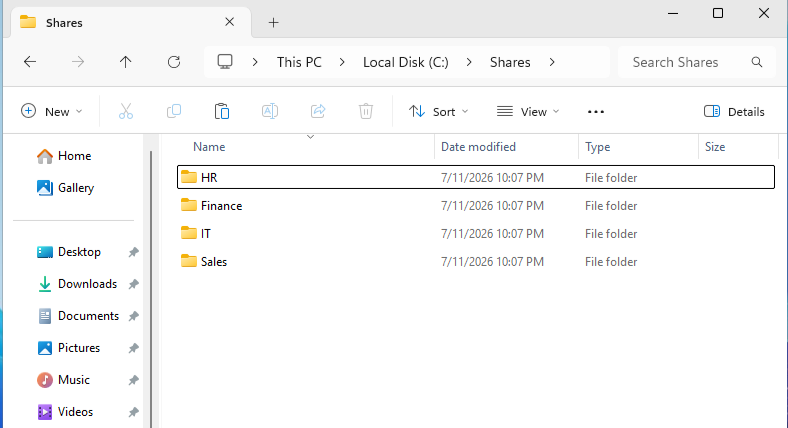
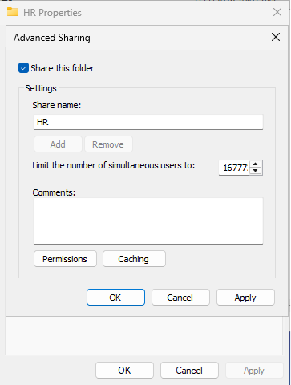
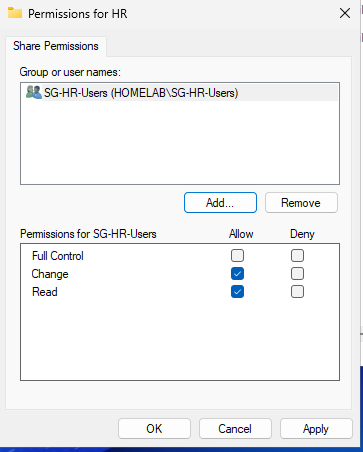
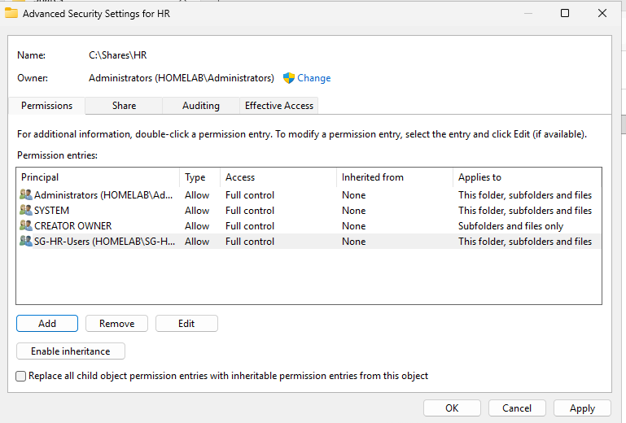
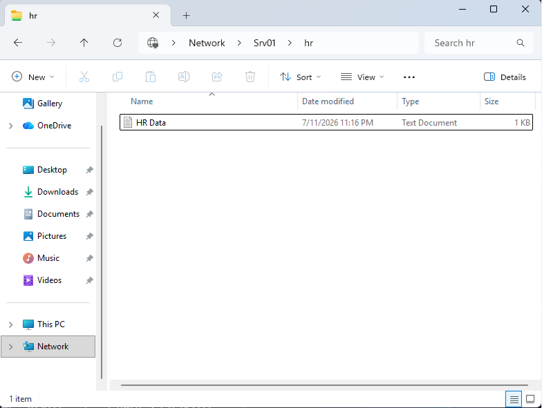
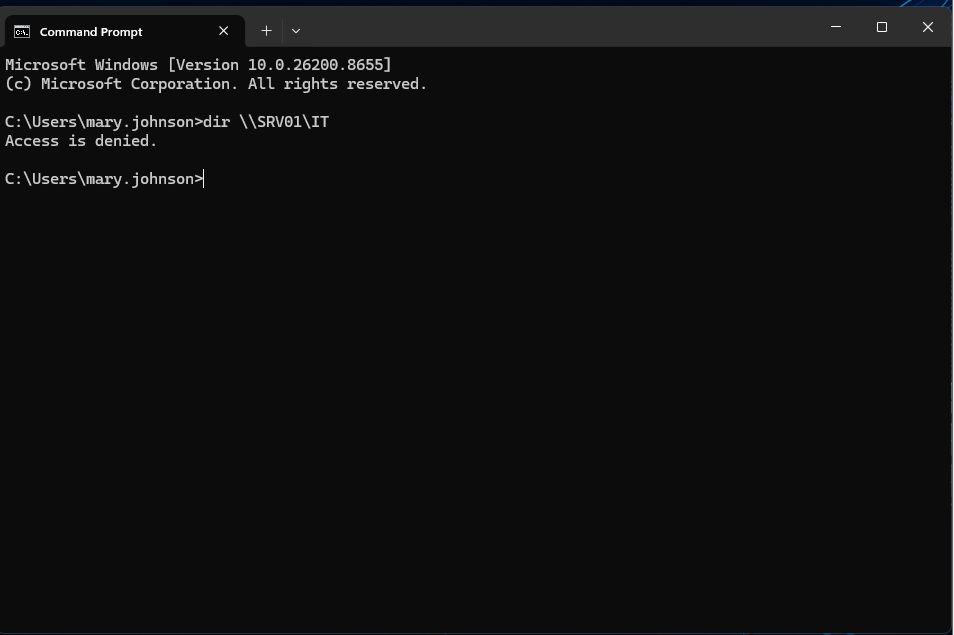
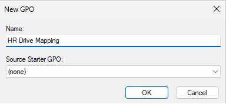
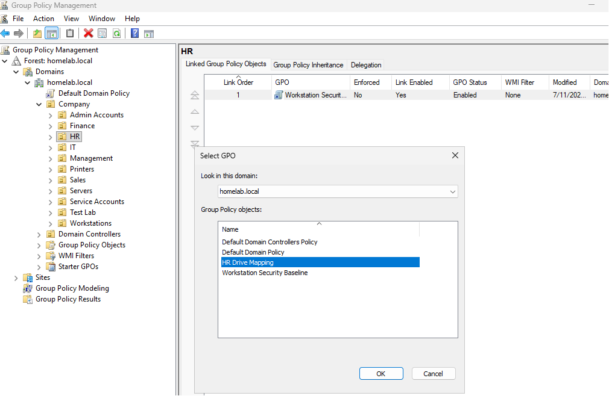
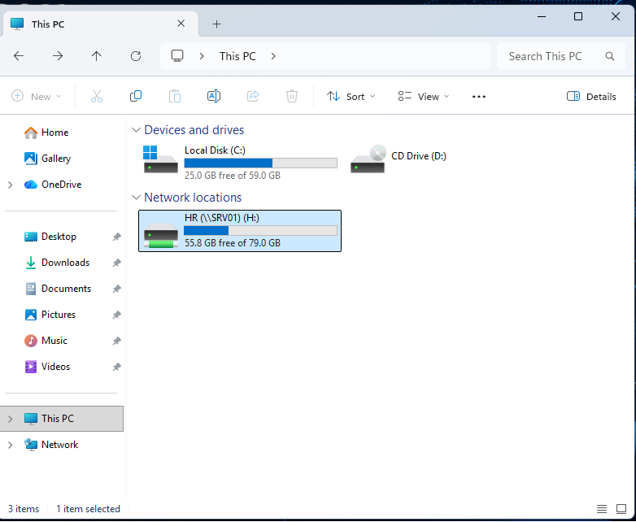

Below are the two complete README files.

---

# 1. Group Policy Hardening

Use this path:

```text
01-Identity-and-Access-Management/04-Group-Policy-Hardening/README.md
```

````markdown
<div align="center">
  
</div>

---

# Overview

This module documents the use of Group Policy to manage and harden domain-joined Windows workstations in the `homelab.local` environment.

The objective was to create centralized policies that could be applied to CLIENT01 without configuring each setting manually on the device.

The implemented policies included:

- Corporate desktop wallpaper
- Domain password policy review
- USB storage restriction
- Password-protected screen saver
- Fifteen-minute inactivity timeout
- Forced screen saver configuration
- Policy refresh using `gpupdate`
- Policy validation using `gpresult`
- Client-side confirmation

This module demonstrates how Active Directory administrators can apply standardized configuration and security settings across multiple computers from one central location.

---

# Why I Built This Module

After joining CLIENT01 to the domain, the next step was to understand how the workstation could be managed centrally.

Without Group Policy, an administrator would need to configure settings manually on every computer.

That approach becomes difficult to maintain when:

- More users are hired
- Additional workstations are deployed
- Security settings change
- Devices are moved between departments
- Audit requirements increase
- Users modify local settings

I wanted to understand how a Group Policy Object is created, edited, linked, applied, and verified.

The most important lesson was that creating a policy is not enough.

A complete Group Policy workflow requires:

```text
Create
   ↓
Configure
   ↓
Link
   ↓
Refresh
   ↓
Validate
```

---

# Business Scenario

The organization has started joining Windows 11 workstations to the `homelab.local` domain.

Management requires consistent workstation settings across company devices.

The Infrastructure Team must enforce the following controls:

- Display the approved company wallpaper
- Apply domain password requirements
- Restrict removable USB storage
- Lock inactive workstations
- Require password protection after inactivity
- Confirm that policies are actually applied

The goal is to reduce inconsistent configurations and strengthen endpoint security through centralized management.

---

# Learning Objectives

By completing this module, I practiced the following:

- Opening Group Policy Management
- Navigating the Group Policy hierarchy
- Creating a new Group Policy Object
- Editing computer and user policy settings
- Linking a GPO to an Organizational Unit
- Understanding policy scope
- Applying desktop standardization
- Reviewing domain password settings
- Restricting removable storage
- Configuring inactivity lock controls
- Forcing Group Policy refresh
- Validating applied policies with `gpresult`
- Troubleshooting policy application
- Understanding the difference between user and computer settings

---

# Key Concepts Learned

## Group Policy

Group Policy is a Windows management feature used to configure users and computers in an Active Directory domain.

Administrators can use Group Policy to control:

- Security settings
- Password policies
- Desktop configuration
- Windows components
- Firewall rules
- Removable storage
- Scripts
- Software settings
- Browser configuration
- Screen locking
- Audit policies

---

## Group Policy Object

A Group Policy Object, or GPO, is a collection of configuration settings.

A GPO does not affect users or computers until it is linked to a valid scope.

Common scopes include:

- Site
- Domain
- Organizational Unit

---

## User Configuration

User Configuration follows the user account.

Examples include:

- Desktop wallpaper
- Start menu settings
- Drive mappings
- User scripts
- Screen saver settings

---

## Computer Configuration

Computer Configuration applies to the workstation or server.

Examples include:

- Firewall settings
- USB restrictions
- Security options
- Windows services
- Update configuration
- Device restrictions

---

## GPO Linking

A GPO must be linked to a Site, Domain, or Organizational Unit before it can apply.

Example:

```text
Workstation Security Baseline GPO
              ↓
Workstations OU
              ↓
CLIENT01
```

The GPO applies only when the target object is inside the linked scope and passes any security or WMI filtering.

---

## Group Policy Processing

Group Policy is processed during:

- Computer startup
- User sign-in
- Background refresh
- Manual refresh

A manual refresh can be triggered using:

```cmd
gpupdate /force
```

---

## Group Policy Results

The `gpresult` command shows which policies were applied or denied.

Example:

```cmd
gpresult /r
```

A more detailed HTML report can be generated using:

```cmd
gpresult /h C:\Reports\GPResult.html
```

---

## Default Domain Policy

The Default Domain Policy usually contains domain-wide account policies such as:

- Password history
- Password age
- Minimum password length
- Password complexity
- Account lockout settings

It should not become a general storage location for unrelated workstation settings.

Custom GPOs are easier to manage, troubleshoot, and document.

---

## Policy Precedence

When multiple GPOs apply, Windows processes them in this general order:

```text
Local
  ↓
Site
  ↓
Domain
  ↓
Organizational Unit
```

This is commonly remembered as:

```text
LSDOU
```

Later policies normally have higher precedence unless inheritance, enforcement, filtering, or loopback processing changes the result.

---

# Lab Environment Specifications

| Component | Configuration |
|------------|---------------|
| Domain Controller | SRV01 |
| Client Computer | CLIENT01 |
| Server Operating System | Windows Server 2025 Standard Evaluation |
| Client Operating System | Windows 11 Enterprise |
| Active Directory Domain | homelab.local |
| Management Tool | Group Policy Management Console |
| Client OU | Workstations |
| Primary GPO | Workstation Security Baseline |
| Wallpaper Delivery | Shared network folder |
| USB Control | Removable storage restriction |
| Screen Saver Timeout | 900 seconds |
| Validation Tools | `gpupdate`, `gpresult` |

---

# Folder Structure

```text
01-Identity-and-Access-Management
│
└── 04-Group-Policy-Hardening
    │
    ├── README.md
    │
    └── Evidence
        └── Screenshots
            ├── 01-Open-Group-Policy-Management.png
            ├── 02-Group-Policy-Management-Console.png
            ├── 03-Create-Workstation-Security-Baseline-GPO.png
            ├── 04-Workstation-Security-Baseline-GPO-Editor.png
            ├── 05-Wallpaper-Shared-Folder.png
            ├── 06-Desktop-Wallpaper-Policy.png
            ├── 07-GPUpdate-Force.png
            ├── 08-GPResult-Workstation-Security-Baseline.png
            ├── 09-Corporate-Wallpaper-Applied.png
            ├── 10-Default-Domain-Policy.png
            ├── 11-Password-Policy-Settings.png
            ├── 12-GPUpdate-Password-Policy.png
            ├── 13-USB-Storage-Restriction-GPO.png
            ├── 14-GPUpdate-USB-Policy.png
            ├── 15-GPResult-USB-Policy.png
            ├── 16-Enable-Screen-Saver-Policy.png
            ├── 17-Password-Protect-Screen-Saver-Policy.png
            ├── 18-Screen-Saver-Timeout-900-Seconds.png
            ├── 19-Force-Specific-Screen-Saver.png
            ├── 20-Screen-Saver-Policy-Summary.png
            ├── 21-GPUpdate-Screen-Saver-Policy.png
            ├── 22-GPResult-Screen-Saver-Policy.png
            └── 23-Screen-Saver-Lock-Screen.png
```

---

# Step-by-Step Implementation

---

## Step 1 — Open Group Policy Management

Opened:

```text
Server Manager
      ↓
Tools
      ↓
Group Policy Management
```

The Group Policy Management Console provides a centralized interface for creating, linking, editing, backing up, and reviewing Group Policy Objects.

<p align="center">
  
</p>

---

## Step 2 — Review the Group Policy Management Console

Reviewed the domain structure and available policy locations.

The console displayed:

- Forest
- Domain
- Organizational Units
- Group Policy Objects
- Default Domain Policy
- Default Domain Controllers Policy
- Group Policy Results
- Group Policy Modeling

This helped identify where custom workstation policies should be created and linked.

<p align="center">
  
</p>

---

## Step 3 — Create the Workstation Security Baseline GPO

Created a custom GPO named:

```text
Workstation Security Baseline
```

A separate GPO was used instead of placing all settings in the Default Domain Policy.

This improves:

- Troubleshooting
- Change tracking
- Policy separation
- Documentation
- Future rollback

<p align="center">
  
</p>

---

## Step 4 — Open the GPO Editor

Opened the Group Policy Management Editor for the new baseline.

The editor separates settings into:

```text
Computer Configuration
```

and:

```text
User Configuration
```

This distinction determines whether the policy follows the device or the user.

<p align="center">
  
</p>

---

## Step 5 — Prepare the Shared Wallpaper Folder

Created a shared folder containing the approved corporate wallpaper.

The image needed to be accessible from CLIENT01 through a UNC path.

Example:

```text
\\SRV01\Wallpaper\Corporate-Wallpaper.jpg
```

Using a shared location allows multiple domain users to receive the same image.

<p align="center">
  
</p>

---

## Step 6 — Configure the Desktop Wallpaper Policy

Configured the desktop wallpaper policy to use the shared image.

This setting provides a consistent desktop appearance for targeted users.

Although wallpaper is not a major security control, it demonstrates centralized user configuration and confirms that Group Policy processing is functioning.

<p align="center">
  
</p>

---

## Step 7 — Force Group Policy Update

On CLIENT01, ran:

```cmd
gpupdate /force
```

This forced Windows to process both computer and user policy settings.

Some settings may still require sign-out, sign-in, or restart.

<p align="center">
  
</p>

---

## Step 8 — Validate the Workstation Baseline

Ran:

```cmd
gpresult /r
```

The output was reviewed to confirm that the Workstation Security Baseline GPO appeared in the applied policy list.

This step was important because a policy existing in Group Policy Management does not prove that it reached the client.

<p align="center">
  
</p>

---

## Step 9 — Confirm the Corporate Wallpaper

Verified that the approved wallpaper appeared on CLIENT01.

This confirmed that:

- The GPO was linked correctly
- The client could access the shared image
- User policy processing succeeded
- The policy path was valid

<p align="center">
  
</p>

---

## Step 10 — Review the Default Domain Policy

Opened the Default Domain Policy to review domain-level account settings.

The Default Domain Policy commonly contains password and account-lockout configuration.

It should be kept focused on domain-wide account policy rather than unrelated workstation settings.

<p align="center">
  
</p>

---

## Step 11 — Review Password Policy Settings

Reviewed password settings such as:

- Password history
- Maximum password age
- Minimum password age
- Minimum password length
- Complexity requirements
- Reversible encryption

These settings apply to domain accounts and support a consistent authentication baseline.

<p align="center">
  
</p>

---

## Step 12 — Refresh the Password Policy

Ran a Group Policy refresh after reviewing or updating the password policy.

Command:

```cmd
gpupdate /force
```

Password policy behavior should also be checked using domain-level tools because account policies are processed by domain controllers.

<p align="center">
  
</p>

---

## Step 13 — Configure USB Storage Restriction

Created or configured a GPO that restricts removable storage access.

USB restrictions can help reduce risks such as:

- Unauthorized data copying
- Malware introduced through removable devices
- Unapproved software
- Loss of sensitive information
- Use of unmanaged storage

The exact policy should match business needs because some departments may require approved removable media.

<p align="center">
  
</p>

---

## Step 14 — Apply the USB Policy

Ran:

```cmd
gpupdate /force
```

This forced CLIENT01 to retrieve the updated removable-storage policy.

<p align="center">
  
</p>

---

## Step 15 — Validate the USB Policy

Used `gpresult` to confirm that the USB restriction GPO applied to CLIENT01.

This helped distinguish between:

```text
Policy configured
```

and:

```text
Policy applied
```

<p align="center">
  
</p>

---

## Step 16 — Enable the Screen Saver Policy

Enabled the screen saver policy for targeted users.

A screen saver policy can support workstation locking after inactivity.

<p align="center">
  
</p>

---

## Step 17 — Require Password Protection

Enabled password protection for the screen saver.

When the workstation becomes inactive and the screen saver activates, the user must authenticate again before returning to the desktop.

<p align="center">
  
</p>

---

## Step 18 — Configure the Inactivity Timeout

Configured the screen saver timeout to:

```text
900 seconds
```

This equals:

```text
15 minutes
```

A defined inactivity period reduces the risk of an unattended workstation remaining accessible.

<p align="center">
  
</p>

---

## Step 19 — Force a Specific Screen Saver

Configured a specific screen saver executable.

This ensured that the policy used a known Windows screen saver rather than depending on an individual user selection.

<p align="center">
  
</p>

---

## Step 20 — Review the Screen Saver Policy

Reviewed the complete screen saver configuration before applying it.

The policy included:

- Screen saver enabled
- Password protection enabled
- Fifteen-minute timeout
- Specific screen saver selected

<p align="center">
  
</p>

---

## Step 21 — Apply the Screen Saver Policy

On CLIENT01, ran:

```cmd
gpupdate /force
```

This refreshed the client policy after the screen saver settings were configured.

<p align="center">
  
</p>

---

## Step 22 — Validate with GPResult

Ran:

```cmd
gpresult /r
```

The result confirmed that the screen saver policy was included in the applied GPO list.

<p align="center">
  
</p>

---

## Step 23 — Confirm the Client Lock Screen

Waited for the configured inactivity period and confirmed that CLIENT01 displayed the lock screen.

This validated the original policy objective:

```text
Inactive workstation
        ↓
Screen saver activates
        ↓
Workstation locks
        ↓
User must authenticate
```

<p align="center">
  
</p>

---

# Group Policy Workflow

```text
Business Requirement
        │
        ▼
Create GPO
        │
        ▼
Configure Policy Settings
        │
        ▼
Link GPO to Correct Scope
        │
        ▼
Run gpupdate
        │
        ▼
Verify with gpresult
        │
        ▼
Test Client Behavior
        │
        ▼
Document Result
```

---

# Validation Results

| Validation Check | Result |
|------------------|--------|
| Group Policy Management opened | ✅ |
| Workstation Security Baseline created | ✅ |
| GPO editor opened | ✅ |
| Wallpaper share prepared | ✅ |
| Wallpaper policy configured | ✅ |
| Corporate wallpaper applied | ✅ |
| Default Domain Policy reviewed | ✅ |
| Password policy settings reviewed | ✅ |
| USB storage restriction configured | ✅ |
| USB policy processed on CLIENT01 | ✅ |
| Screen saver enabled | ✅ |
| Password protection enabled | ✅ |
| Timeout configured to 900 seconds | ✅ |
| Specific screen saver configured | ✅ |
| Policies refreshed with `gpupdate` | ✅ |
| Policies validated with `gpresult` | ✅ |
| CLIENT01 lock screen confirmed | ✅ |

---

# Troubleshooting Notes

## GPO Does Not Apply

Check:

- Is the GPO linked?
- Is the user or computer in the correct OU?
- Is the GPO enabled?
- Does security filtering allow the target?
- Is inheritance blocked?
- Is another GPO overriding the setting?
- Can the client contact the domain controller?
- Is DNS working?
- Has policy refreshed?

Useful commands:

```cmd
gpupdate /force
```

```cmd
gpresult /r
```

```cmd
gpresult /h C:\Reports\GPResult.html
```

---

## Wallpaper Does Not Display

Possible causes:

- Incorrect UNC path
- User cannot read the shared file
- File name changed
- Share unavailable
- GPO linked to the wrong OU
- User policy not refreshed
- Unsupported image path

Test the path directly:

```text
\\SRV01\Wallpaper\Corporate-Wallpaper.jpg
```

---

## USB Restriction Does Not Work

Check:

- Whether the setting is under Computer Configuration or User Configuration
- Whether CLIENT01 is in the linked OU
- Whether the GPO is applied
- Whether another policy has higher precedence
- Whether the device was already connected
- Whether restart is required

---

## Screen Saver Does Not Lock

Check:

- Screen saver enabled
- Password protection enabled
- Timeout configured
- Correct screen saver path
- User policy applied
- Conflicting local settings
- Group Policy precedence

---

# Security Notes

## Avoid Editing Default Policies Unnecessarily

The Default Domain Policy should remain focused on domain-wide account settings.

Custom workstation controls should normally use separate GPOs.

---

## Test Before Broad Deployment

A policy should first be tested on:

- A test workstation
- A test user
- A pilot OU
- A limited security group

A misconfigured GPO can affect many systems quickly.

---

## Use Change Documentation

Record:

- Policy name
- Purpose
- Owner
- Linked OU
- Date created
- Settings changed
- Validation result
- Rollback method

---

## Do Not Use GPOs Without Scope Planning

A policy linked at the domain level may affect more objects than intended.

The administrator should understand:

- OU structure
- Security filtering
- Inheritance
- Enforcement
- Loopback processing
- WMI filters

---

# Skills Demonstrated

- Group Policy Management
- Windows Server 2025
- Active Directory
- Workstation Hardening
- Centralized Configuration
- Password Policy Review
- USB Storage Restriction
- Screen Lock Enforcement
- Corporate Desktop Standardization
- `gpupdate`
- `gpresult`
- Group Policy Troubleshooting
- Endpoint Security
- Technical Documentation

---

# Interview Notes

## What is a Group Policy Object?

A GPO is a collection of Windows configuration settings that can be applied to users and computers through Active Directory.

---

## What is the difference between Computer Configuration and User Configuration?

Computer Configuration applies to the device.

User Configuration applies to the user account.

---

## What is LSDOU?

LSDOU describes normal Group Policy processing order:

```text
Local
Site
Domain
Organizational Unit
```

---

## How do you force a policy update?

```cmd
gpupdate /force
```

---

## How do you confirm which GPOs applied?

```cmd
gpresult /r
```

or:

```cmd
gpresult /h C:\Reports\GPResult.html
```

---

## Why create custom GPOs instead of using only the Default Domain Policy?

Custom GPOs improve organization, troubleshooting, change control, testing, and rollback.

---

## Why might a GPO fail to apply?

Possible reasons include incorrect linking, wrong OU placement, security filtering, inheritance, DNS problems, replication issues, or conflicting policies.

---

# What I Learned

The most important lesson was that creating a GPO does not prove that it works.

A complete validation requires:

```text
GPO exists
+
GPO is linked
+
Target is in scope
+
Client processes policy
+
Expected result appears
```

I also learned that Group Policy can be used for both standardization and security.

The wallpaper policy demonstrated centralized configuration, while the USB and screen-lock policies demonstrated endpoint hardening.

The commands I want to remember are:

```cmd
gpupdate /force
```

and:

```cmd
gpresult /r
```

They help separate a configuration problem from an application problem.

---

# Future Improvements

To expand this module, I would add:

- Microsoft Defender policies
- Windows Firewall rules
- Audit policy settings
- Account lockout policy
- Local administrator restrictions
- PowerShell execution controls
- AppLocker
- Windows Update policy
- Browser hardening
- BitLocker policy
- Security baseline comparison
- Group Policy backup and restore
- Policy change reporting
- Central Store for ADMX templates

---

# Key Takeaways

This module demonstrated centralized workstation management through Group Policy.

The implementation included:

- Corporate wallpaper deployment
- Password policy review
- USB storage restriction
- Screen saver and lock enforcement
- Manual policy refresh
- Result validation
- Client-side confirmation

The main lesson was:

```text
Configure
   ↓
Link
   ↓
Refresh
   ↓
Verify
   ↓
Test
```

Group Policy is now being used to provide consistent configuration and security controls across domain-joined devices.

---

<div align="center">

### Module Status

✅ Completed Successfully

**Next Module:** [Windows LAPS](../05-Windows-LAPS/)

</div>
````

---

# 2. File Services

Use this path:

```text
02-Core-Infrastructure/03-File-Services/README.md
```

````markdown
<div align="center">
  
</div>

---

# Overview

This module documents the implementation of departmental file services in the `homelab.local` environment.

The objective was to create shared folders, configure SMB sharing, apply NTFS permissions, validate authorized and unauthorized access, and deploy mapped drives using Group Policy Preferences.

The implementation included:

- Department share folders
- HR share configuration
- SMB share permissions
- NTFS security permissions
- Permission inheritance control
- Authorized access testing
- Unauthorized access testing
- Departmental mapped drives
- Item-level targeting
- Security-group-based drive assignment
- Client validation using File Explorer and `net use`

This module connects Active Directory security groups to practical resource access.

---

# Why I Built This Module

After creating users and security groups, I wanted to understand how those identities are used to control access to real resources.

A security group by itself does not provide business value until it is connected to something such as:

- Shared folders
- Applications
- Printers
- Remote systems
- Databases

File Services allowed me to apply the access model created in the Active Directory Administration module.

The most important lesson was that share permissions and NTFS permissions work together.

I also learned that mapped drives can be assigned according to security-group membership, which allows different departments to receive only the resources they are authorized to use.

---

# Business Scenario

The organization stores department files on SRV01.

Each department requires a private shared folder:

- Human Resources
- Sales
- Information Technology
- Finance
- Management

Management requires the following:

- Department users should access their own folder
- Unauthorized users should be denied
- Permissions should be assigned through groups
- Users should receive the correct mapped drive automatically
- Drive assignments should follow department membership
- Access should be validated from CLIENT01

The Infrastructure Team must create the shares and connect them to the existing Active Directory groups.

---

# Learning Objectives

By completing this module, I practiced the following:

- Creating departmental folders
- Configuring SMB sharing
- Understanding share permissions
- Configuring NTFS permissions
- Disabling inherited permissions
- Assigning access through security groups
- Testing authorized access
- Testing denied access
- Understanding effective permissions
- Creating Group Policy Preferences
- Configuring mapped drives
- Using item-level targeting
- Targeting security groups
- Verifying mapped drives with `net use`
- Troubleshooting file-access problems

---

# Key Concepts Learned

## SMB File Sharing

Server Message Block, or SMB, is the protocol used by Windows for shared folders and files.

A shared folder may be accessed using a UNC path such as:

```text
\\SRV01\HR
```

---

## Share Permissions

Share permissions apply when a folder is accessed over the network.

Common share permissions include:

- Read
- Change
- Full Control

Share permissions do not replace NTFS permissions.

---

## NTFS Permissions

NTFS permissions apply to files and folders stored on an NTFS volume.

Common permissions include:

- Full Control
- Modify
- Read and Execute
- List Folder Contents
- Read
- Write

NTFS permissions apply both locally and over the network.

---

## Effective Access

When a user accesses a shared folder over the network, both share and NTFS permissions are evaluated.

The more restrictive effective result normally controls access.

Example:

```text
Share Permission: Full Control
NTFS Permission: Read
Effective Access: Read
```

---

## Permission Inheritance

Permissions normally flow from a parent folder to child folders.

Disabling inheritance allows a folder to use a more specific permission set.

This should be done carefully because removing inherited entries may accidentally remove administrator or system access.

---

## Security-Group-Based Access

Permissions were assigned to departmental security groups rather than individual users.

Example:

```text
John Smith
     ↓
HR Security Group
     ↓
HR Folder Permission
```

This makes onboarding, role changes, and offboarding easier.

---

## Mapped Drive

A mapped drive assigns a drive letter to a network share.

Example:

```text
H:
```

mapped to:

```text
\\SRV01\HR
```

Mapped drives give users a familiar way to access departmental resources.

---

## Group Policy Preferences

Group Policy Preferences can create, update, replace, or delete mapped drives.

Unlike a traditional policy setting, a preference provides a managed default that can be targeted using conditions.

---

## Item-Level Targeting

Item-level targeting allows a Group Policy Preference item to apply only when specific conditions are met.

Examples include:

- Security-group membership
- Computer name
- Operating system
- IP range
- Organizational Unit
- User name

In this lab, drive mapping was targeted using department security groups.

---

# Lab Environment Specifications

| Component | Configuration |
|------------|---------------|
| File Server | SRV01 |
| Server Operating System | Windows Server 2025 Standard Evaluation |
| Client | CLIENT01 |
| Client Operating System | Windows 11 Enterprise |
| Domain | homelab.local |
| Department Groups | HR, Sales, IT, Finance, Management |
| File Protocol | SMB |
| Storage Permissions | NTFS |
| Management Tools | File Explorer, Advanced Sharing, Group Policy Management |
| Validation Tools | File Explorer, `net use`, domain user testing |

---

# Folder Structure

```text
02-Core-Infrastructure
│
└── 03-File-Services
    │
    ├── README.md
    │
    └── Evidence
        └── Screenshots
            ├── 01-Department-Share-Folders.png
            ├── 02-HR-Advanced-Sharing.png
            ├── 03-HR-Share-Permissions.png
            ├── 04-HR-Advanced-Security-Settings.png
            ├── 05-HR-Disable-Permission-Inheritance.png
            ├── 06-HR-Final-NTFS-Permissions.png
            ├── 07-HR-Share-Access-Success.png
            ├── 08-Unauthorized-Access-Denied.png
            ├── 09-HR-Authorized-Access-Granted.png
            ├── 10-Open-Group-Policy-Management-for-Drive-Mapping.png
            ├── 11-Create-HR-Drive-Mapping-GPO.png
            ├── 12-Open-Drive-Maps-Preferences.png
            ├── 13-Configure-HR-Mapped-Drive.png
            ├── 14-Enable-Item-Level-Targeting.png
            ├── 15-Target-HR-Security-Group.png
            ├── 16-Link-HR-Drive-Mapping-GPO.png
            ├── 17-HR-Drive-Mapped-Successfully.png
            ├── 18-Verify-HR-Drive-with-Net-Use.png
            ├── 19-Department-Drive-Mappings.png
            └── 20-Verify-IT-User-Receives-Only-IT-Drive.png
```

---

# Step-by-Step Implementation

---

## Step 1 — Create Department Share Folders

Created folders for the organization's departments.

Example structure:

```text
C:\Shares
│
├── HR
├── Sales
├── IT
├── Finance
└── Management
```

This provided a consistent storage location for departmental data.

<p align="center">
  
</p>

---

## Step 2 — Enable Advanced Sharing for HR

Opened the HR folder properties and enabled Advanced Sharing.

The folder was shared using a network name such as:

```text
HR
```

The resulting UNC path was:

```text
\\SRV01\HR
```

<p align="center">
  
</p>

---

## Step 3 — Configure HR Share Permissions

Configured the share-level permissions for the HR folder.

Share permissions were kept broad enough to allow network access while NTFS permissions provided the more detailed security boundary.

The final design should always be documented so administrators understand which permission layer is intended to provide the main restriction.

<p align="center">
  
</p>

---

## Step 4 — Open Advanced Security Settings

Opened the Advanced Security Settings for the HR folder.

This interface was used to review:

- Permission entries
- Inheritance
- Object ownership
- Effective access
- Principal assignments
- Scope of permissions

<p align="center">
  
</p>

---

## Step 5 — Disable Permission Inheritance

Disabled inherited permissions on the HR folder.

This allowed the HR folder to use a department-specific access list.

Before removing inherited entries, the administrator must ensure that required accounts such as administrators and SYSTEM retain appropriate access.

<p align="center">
  
</p>

---

## Step 6 — Configure Final NTFS Permissions

Configured the final NTFS permissions for the HR share.

The permission model included appropriate access for:

- HR security group
- Administrators
- SYSTEM
- Other required management principals

Permissions were assigned to groups rather than individual users.

<p align="center">
  
</p>

---

## Step 7 — Test HR Share Access

Tested access to:

```text
\\SRV01\HR
```

using an authorized HR user.

The successful connection confirmed that:

- SMB sharing was active
- The server was reachable
- The user belonged to the correct group
- Share permissions allowed access
- NTFS permissions allowed access

<p align="center">
  
</p>

---

## Step 8 — Test Unauthorized Access

Attempted to access the HR share using a user who was not authorized.

The access-denied result confirmed that the permission boundary was working.

A denied test is important because successful access alone does not prove that unauthorized users are blocked.

<p align="center">
  
</p>

---

## Step 9 — Confirm Authorized HR Access

Signed in with the authorized HR user and confirmed access to the HR shared folder.

This validated the relationship:

```text
HR User
   ↓
HR Security Group
   ↓
HR Folder Permission
   ↓
Access Granted
```

<p align="center">
  
</p>

---

# Department Drive Mapping with Group Policy Preferences

---

## Step 10 — Open Group Policy Management

Opened Group Policy Management to create a drive-mapping policy.

The goal was to map the HR share automatically for authorized HR users.

<p align="center">
  
</p>

---

## Step 11 — Create the HR Drive Mapping GPO

Created a GPO for the HR mapped drive.

Example name:

```text
HR Drive Mapping
```

A dedicated GPO makes the purpose easier to identify and troubleshoot.

<p align="center">
  
</p>

---

## Step 12 — Open Drive Maps Preferences

Navigated to:

```text
User Configuration
      ↓
Preferences
      ↓
Windows Settings
      ↓
Drive Maps
```

This location allows administrators to configure network drive mappings for domain users.

<p align="center">
  
</p>

---

## Step 13 — Configure the HR Mapped Drive

Configured the mapped drive settings.

Example:

```text
Location: \\SRV01\HR
Drive Letter: H:
Label: HR Department
Action: Update
```

The `Update` action allows the preference to create the mapping when missing and update it when configuration changes.

<p align="center">
  
</p>

---

## Step 14 — Enable Item-Level Targeting

Enabled item-level targeting.

Without targeting, the drive mapping could apply to every user in the linked scope.

Item-level targeting allowed the mapping to be restricted according to department membership.

<p align="center">
  
</p>

---

## Step 15 — Target the HR Security Group

Configured the targeting condition so the mapped drive applied only to members of the HR security group.

The logic became:

```text
User is a member of HR Security Group
              ↓
Create H: drive
```

Users outside the group should not receive the HR mapping.

<p align="center">
  
</p>

---

## Step 16 — Link the HR Drive Mapping GPO

Linked the HR drive mapping GPO to the correct user scope.

The linked OU needed to contain the intended user accounts or a parent OU that included them.

<p align="center">
  
</p>

---

## Step 17 — Confirm the HR Drive Mapping

Signed in as an HR user and confirmed that the mapped drive appeared successfully.

The drive provided direct access to:

```text
\\SRV01\HR
```

<p align="center">
  
</p>

---

## Step 18 — Verify with NET USE

Ran:

```cmd
net use
```

The command displayed active network connections and confirmed the mapped drive path and drive letter.

<p align="center">
  
</p>

---

## Step 19 — Configure Department Drive Mappings

Created or reviewed drive mappings for the other departments.

Example design:

```text
H: → HR
S: → Sales
I: → IT
F: → Finance
M: → Management
```

Each drive mapping should use security-group targeting so users receive only their approved department resources.

<p align="center">
  
</p>

---

## Step 20 — Validate IT User Targeting

Signed in using an IT department user and confirmed that the user received the IT drive but not the HR drive.

This validated item-level targeting and security-group separation.

<p align="center">
  
</p>

---

# File Access Workflow

```text
User Account
      │
      ▼
Department Security Group
      │
      ▼
Share and NTFS Permissions
      │
      ▼
Authorized Department Folder
      │
      ▼
Mapped Drive through Group Policy
      │
      ▼
User Access Validated
```

---

# Permission Evaluation

```text
Network Access Request
        │
        ▼
Share Permission Check
        │
        ▼
NTFS Permission Check
        │
        ▼
Group Membership Evaluation
        │
        ▼
Most Restrictive Effective Result
        │
        ├── Access Granted
        └── Access Denied
```

---

# Validation Results

| Validation Check | Result |
|------------------|--------|
| Department folders created | ✅ |
| HR folder shared | ✅ |
| Share permissions configured | ✅ |
| NTFS permissions configured | ✅ |
| Inheritance reviewed and disabled | ✅ |
| HR group assigned access | ✅ |
| Authorized HR access succeeded | ✅ |
| Unauthorized access was denied | ✅ |
| HR drive mapping GPO created | ✅ |
| Drive Maps preference configured | ✅ |
| Item-level targeting enabled | ✅ |
| HR group targeted | ✅ |
| HR drive mapped successfully | ✅ |
| Mapping verified with `net use` | ✅ |
| Department drive mappings configured | ✅ |
| IT user received only approved drive | ✅ |

---

# Troubleshooting Notes

## User Receives Access Denied

Check:

1. User group membership
2. Share permissions
3. NTFS permissions
4. Deny entries
5. Permission inheritance
6. User security token
7. Correct UNC path
8. Server availability

Useful command:

```cmd
whoami /groups
```

---

## User Was Added to the Group but Still Cannot Access

The user may need to sign out and sign back in.

Group memberships are included in the user's security token during sign-in.

---

## Share Works Locally but Not Over the Network

Possible causes:

- SMB share not enabled
- Firewall blocking File and Printer Sharing
- Incorrect share name
- Share permissions
- DNS failure
- Server unavailable

---

## Drive Mapping Does Not Appear

Check:

- GPO link
- User OU location
- Security filtering
- Item-level targeting
- Share path
- User group membership
- `gpupdate`
- `gpresult`
- Existing conflicting mapping

Commands:

```cmd
gpupdate /force
```

```cmd
gpresult /r
```

```cmd
net use
```

---

## User Receives the Wrong Department Drive

Check:

- Old group memberships
- Nested groups
- Incorrect item-level targeting
- GPO linked too broadly
- Multiple drive mapping policies
- Stale user token

---

# Security Notes

## Avoid Direct User Permissions

Assign permissions to security groups whenever possible.

Direct user permissions are harder to audit and maintain.

---

## Be Careful with Deny Permissions

Explicit Deny entries override Allow permissions in many situations.

Deny should be used only when required and after testing.

---

## Protect Administrative Access

Keep appropriate access for:

- SYSTEM
- Administrators
- Backup operators when required
- Approved file-server administrators

Do not accidentally remove management access while disabling inheritance.

---

## Separate Sensitive Departments

Folders such as HR and Finance may contain sensitive information.

Access should be limited, documented, reviewed, and audited.

---

## Review Access Regularly

Department membership changes over time.

Regular access reviews should check:

- Users who changed roles
- Former employees
- Temporary access
- Nested group membership
- Privileged users
- Stale accounts

---

# Useful Commands

## View current mapped drives

```cmd
net use
```

---

## Access the share directly

```text
\\SRV01\HR
```

---

## Review user groups

```cmd
whoami /groups
```

---

## Test path availability

```powershell
Test-Path "\\SRV01\HR"
```

---

## View SMB shares

```powershell
Get-SmbShare
```

---

## View SMB share permissions

```powershell
Get-SmbShareAccess -Name "HR"
```

---

## Review NTFS permissions

```powershell
Get-Acl "C:\Shares\HR" |
Format-List
```

---

## View user group membership

```powershell
Get-ADPrincipalGroupMembership `
    -Identity "john.smith" |
Select-Object Name
```

---

# Skills Demonstrated

- Windows File Services
- SMB Sharing
- NTFS Permissions
- Share Permissions
- Permission Inheritance
- Effective Access
- Active Directory Security Groups
- Role-Based Access Control
- Least Privilege
- Group Policy Preferences
- Drive Mapping
- Item-Level Targeting
- Access Validation
- Windows Server 2025
- File Access Troubleshooting
- Technical Documentation

---

# Interview Notes

## What is the difference between share and NTFS permissions?

Share permissions apply only when the folder is accessed through the network.

NTFS permissions apply both locally and over the network.

When both apply, the effective result is normally the most restrictive combination.

---

## Why use security groups for file permissions?

Groups make access easier to manage and audit.

Administrators update group membership instead of editing folder permissions for every user.

---

## What is permission inheritance?

Inheritance allows child folders and files to receive permissions from a parent folder.

It simplifies administration but may need to be disabled for sensitive folders requiring unique permissions.

---

## What is a UNC path?

A UNC path identifies a network resource.

Example:

```text
\\SRV01\HR
```

---

## What is item-level targeting?

Item-level targeting allows a Group Policy Preference item to apply only when defined conditions are met, such as security-group membership.

---

## How would you troubleshoot a missing mapped drive?

I would verify the GPO link, user OU, group membership, item-level targeting, share path, policy processing, and current mappings using `gpresult` and `net use`.

---

## Why test unauthorized access?

Successful authorized access proves that valid users can connect.

A denied test proves that the security boundary blocks users who should not have access.

---

# What I Learned

The biggest lesson was understanding that file access depends on multiple layers.

A user may be in the correct department group but still fail because of:

- Share permissions
- NTFS permissions
- Inheritance
- Deny entries
- Stale group membership
- Incorrect drive targeting

I also learned that access validation should include both positive and negative tests.

```text
Authorized user succeeds
+
Unauthorized user is denied
=
Better evidence that permissions are working
```

The drive-mapping section showed how Active Directory groups can be connected to user experience.

A user does not need to remember the UNC path when the correct drive is delivered automatically based on department membership.

---

# Future Improvements

To expand this module, I would add:

- Access-Based Enumeration
- File Server Resource Manager
- Quotas
- File screening
- Shadow Copies
- DFS Namespace
- DFS Replication
- File classification
- Audit logging
- Automated permission reports
- AGDLP resource groups
- Department share provisioning scripts
- Approval-based access requests
- Periodic access reviews
- Separate file server instead of combining roles on SRV01

---

# Key Takeaways

This module connected identity management to actual resource access.

The implementation included:

- Department share folders
- SMB sharing
- NTFS permissions
- Security-group-based access
- Authorized and denied testing
- Group Policy drive mapping
- Item-level targeting
- Department-specific validation

The main lessons were:

```text
Assign permissions to groups, not individual users.
```

```text
Share and NTFS permissions must be evaluated together.
```

```text
Test both allowed and denied access.
```

```text
Use item-level targeting to deliver only the correct mapped drive.
```

The file-service environment is now ready for folder redirection, auditing, backup, and disaster-recovery modules.

---

<div align="center">

### Module Status

✅ Completed Successfully

**Next Module:** [Folder Redirection](../04-Folder-Redirection/)

</div>
````