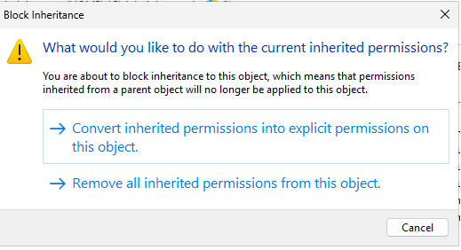
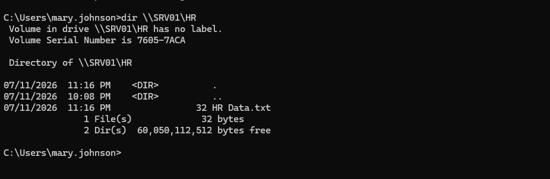
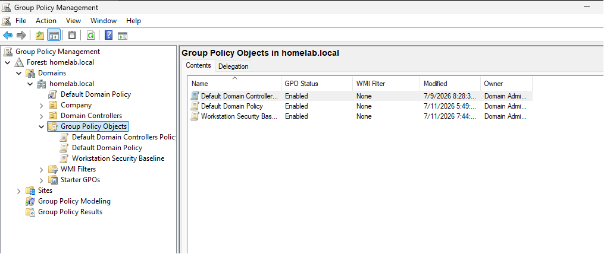
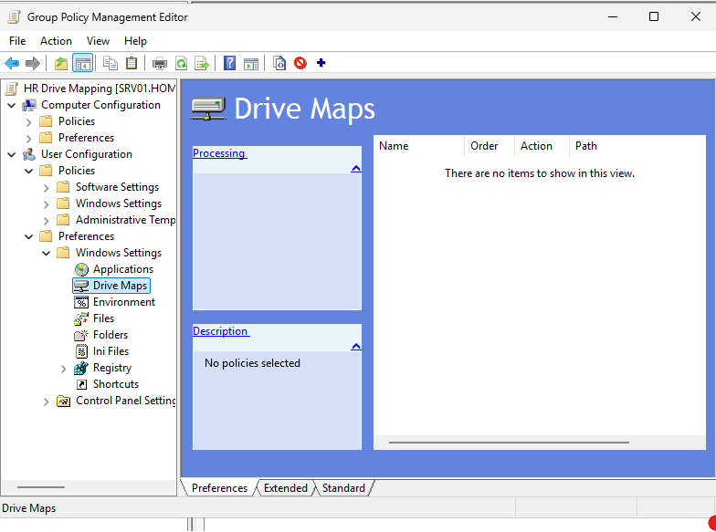
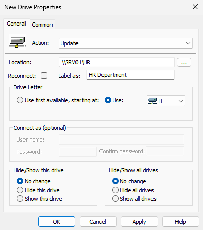
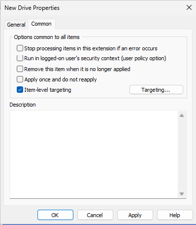
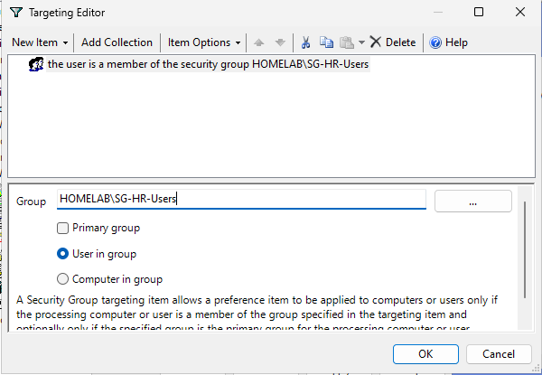
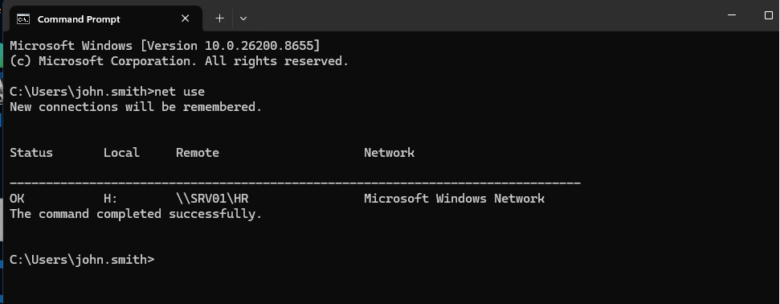
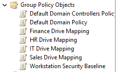
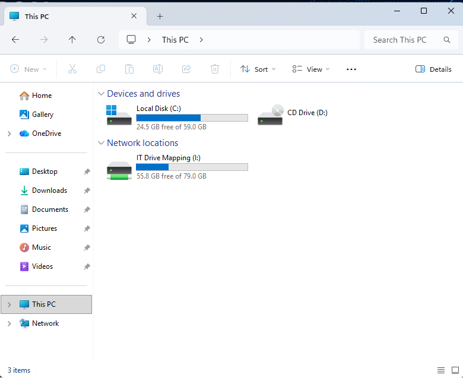

<div align="center">
  
</div>

---

# Overview

This module documents the implementation of departmental file services in the `homelab.local` environment.

The objective was to create shared folders, configure SMB sharing, apply NTFS permissions, validate authorized and unauthorized access, and automatically deploy departmental mapped drives using Group Policy Preferences.

The implementation included:

- Department share folders
- HR share configuration
- SMB share permissions
- NTFS permissions
- Permission inheritance control
- Authorized access testing
- Unauthorized access testing
- Group Policy drive mapping
- Item-level targeting
- Security-group-based drive assignment
- Client-side validation using File Explorer and `net use`

This module connects Active Directory users and security groups to actual business resources.

---

# Why I Built This Module

After creating users and security groups in Active Directory, I wanted to understand how those identities are used to control access to real resources.

A security group does not provide much value by itself until it is connected to something such as:

- Shared folders
- Applications
- Printers
- Databases
- Remote systems

File Services allowed me to apply the identity and access model created in the previous modules.

The most important lesson was that file access depends on several layers:

```text
User Account
+
Security Group Membership
+
Share Permissions
+
NTFS Permissions
+
Group Policy Targeting
```

I also learned that testing only successful access is not enough. A secure configuration should prove that approved users can access the folder and unauthorized users are denied.

---

# Business Scenario

The organization stores department files on SRV01.

The following departments require their own shared folders:

- Human Resources
- Sales
- Information Technology
- Finance
- Management

Management requires the following:

- Department users should access only their approved folders
- Unauthorized users should be denied
- Permissions should be assigned through security groups
- Department drives should appear automatically
- Drive assignments should follow department membership
- Access should be validated from CLIENT01

The Infrastructure Team must create the departmental file structure, configure permissions, and deploy mapped drives through Group Policy Preferences.

---

# Learning Objectives

By completing this module, I practiced the following:

- Creating department share folders
- Configuring SMB sharing
- Understanding share permissions
- Configuring NTFS permissions
- Reviewing permission inheritance
- Disabling inheritance when required
- Assigning access through Active Directory security groups
- Testing authorized access
- Testing unauthorized access
- Understanding effective permissions
- Creating drive mappings with Group Policy Preferences
- Using item-level targeting
- Targeting users by security-group membership
- Verifying mapped drives with `net use`
- Troubleshooting file-access and drive-mapping problems
- Documenting resource-access controls

---

# Key Concepts Learned

## SMB File Sharing

Server Message Block, or SMB, is the protocol used by Windows systems to access shared files and folders over a network.

A shared folder can be accessed using a UNC path such as:

```text
\\SRV01\HR
```

---

## Share Permissions

Share permissions apply when a folder is accessed over the network.

Common share permissions include:

- Read
- Change
- Full Control

Share permissions do not replace NTFS permissions.

Both permission layers may affect access.

---

## NTFS Permissions

NTFS permissions apply to files and folders stored on an NTFS volume.

Common permissions include:

- Full Control
- Modify
- Read and Execute
- List Folder Contents
- Read
- Write

NTFS permissions apply whether the folder is accessed locally or through the network.

---

## Effective Access

When a user accesses a shared folder over the network, Windows evaluates both:

```text
Share Permissions
+
NTFS Permissions
```

The most restrictive effective result normally controls access.

Example:

```text
Share Permission: Full Control
NTFS Permission: Read
Effective Access: Read
```

---

## Permission Inheritance

Permissions normally flow from a parent folder to child folders.

Disabling inheritance allows a folder to use a more specific access-control list.

This must be handled carefully because removing inherited entries may accidentally remove access required by:

- Administrators
- SYSTEM
- Backup operators
- File-server administrators

---

## Security-Group-Based Access

Permissions were assigned to security groups instead of individual users.

Example:

```text
John Smith
     ↓
HR Security Group
     ↓
HR Folder Permission
```

This makes onboarding, department changes, and offboarding easier to manage.

---

## Mapped Drives

A mapped drive assigns a drive letter to a network share.

Example:

```text
H:
```

mapped to:

```text
\\SRV01\HR
```

Mapped drives provide users with a familiar way to access departmental files.

---

## Group Policy Preferences

Group Policy Preferences can create, update, replace, or remove settings such as mapped drives.

Unlike traditional policy settings, preferences can use conditional targeting.

---

## Item-Level Targeting

Item-level targeting allows a preference item to apply only when specific conditions are true.

Examples include:

- Security-group membership
- User name
- Computer name
- Operating system
- IP range
- Organizational Unit

In this module, drive mappings were targeted according to department security groups.

---

# Lab Environment Specifications

| Component | Configuration |
|------------|---------------|
| File Server | SRV01 |
| Server Operating System | Windows Server 2025 Standard Evaluation |
| Client | CLIENT01 |
| Client Operating System | Windows 11 Enterprise |
| Domain | homelab.local |
| File Protocol | SMB |
| File System | NTFS |
| Department Groups | HR, Sales, IT, Finance, Management |
| Management Tools | File Explorer, Advanced Sharing, Group Policy Management |
| Validation Tools | File Explorer, `net use`, `whoami /groups`, `gpresult` |
| Primary Test Share | `\\SRV01\HR` |

---

# Folder Structure

```text
02-Core-Infrastructure
│
└── 03-File-Services
    │
    ├── README.md
    │
    └── Evidence
        └── Screenshots
            ├── 01-Department-Share-Folders.png
            ├── 02-HR-Advanced-Sharing.png
            ├── 03-HR-Share-Permissions.png
            ├── 04-Advanced-Security-Settings-HR.png
            ├── 05-Disable-Inheritance-HR.png
            ├── 06-HR-Final-NTFS-Permissions.png
            ├── 07-HR-Share-Access-Success.png
            ├── 08-Unauthorized-Access-Denied.png
            ├── 09-HR-Share-Access-Granted.png
            ├── 10-Open-Group-Policy-Management-Drive-Mapping.png
            ├── 11-Create-HR-Drive-Mapping-GPO.png
            ├── 12-HR-Drive-Maps-Node.png
            ├── 13-HR-Mapped-Drive-General-Settings.png
            ├── 14-HR-Item-Level-Targeting-Enabled.png
            ├── 15-HR-Security-Group-Targeting.png
            ├── 16-Link-HR-Drive-Mapping-GPO.png
            ├── 17-HR-Drive-Mapped-Successfully.png
            ├── 18-Net-Use-HR-Drive-Mapping.png
            ├── 19-All-Department-Drive-Mappings.png
            └── 20-IT-User-Receives-Only-IT-Drive.png
```

---

# Step-by-Step Implementation

---

## Step 1 — Create Department Share Folders

Created folders for each department.

Example structure:

```text
C:\Shares
│
├── HR
├── Sales
├── IT
├── Finance
└── Management
```

This provided a consistent storage location for departmental data.

<p align="center">
  
</p>

---

## Step 2 — Enable Advanced Sharing for HR

Opened the HR folder properties and enabled Advanced Sharing.

The folder was shared using the name:

```text
HR
```

The resulting UNC path was:

```text
\\SRV01\HR
```

<p align="center">
  
</p>

---

## Step 3 — Configure HR Share Permissions

Configured the share-level permissions for the HR folder.

Share permissions control network access to the folder.

The permission design was reviewed together with the NTFS permissions because both layers affect the final result.

<p align="center">
  
</p>

---

## Step 4 — Review Advanced Security Settings

Opened the Advanced Security Settings for the HR folder.

This interface was used to review:

- Permission entries
- Inheritance
- Object ownership
- Permission scope
- Security principals
- Effective access

<p align="center">
  
</p>

---

## Step 5 — Disable Permission Inheritance

Disabled permission inheritance for the HR folder.

This allowed the HR folder to use a more specific permission set instead of automatically receiving all permissions from the parent folder.

Before changing inheritance, I confirmed that required administrative principals would retain access.

<p align="center">
  
</p>

---

## Step 6 — Configure Final NTFS Permissions

Configured the final NTFS permissions for the HR folder.

The access-control list included appropriate entries for:

- HR security group
- Administrators
- SYSTEM
- Other required management accounts

Permissions were assigned to groups instead of directly to individual users.

<p align="center">
  
</p>

---

## Step 7 — Test HR Share Access

Tested access to:

```text
\\SRV01\HR
```

using an authorized HR user.

The successful result confirmed that:

- The server was reachable
- SMB sharing was active
- The user belonged to the correct group
- Share permissions allowed access
- NTFS permissions allowed access

<p align="center">
  
</p>

---

## Step 8 — Test Unauthorized Access

Attempted to access the HR folder using an unauthorized user.

The access-denied result confirmed that the permission boundary was working.

A successful test alone would not prove that unauthorized users were blocked, so this negative test was required.

<p align="center">
  
</p>

---

## Step 9 — Confirm HR Access Is Granted

Signed in using the approved HR account and confirmed access to the HR shared folder.

The access path was:

```text
HR User
   ↓
HR Security Group
   ↓
HR Folder Permissions
   ↓
Access Granted
```

<p align="center">
  
</p>

---

# Department Drive Mapping with Group Policy Preferences

---

## Step 10 — Open Group Policy Management

Opened Group Policy Management to begin creating the mapped-drive policy.

The goal was to automatically provide the HR drive only to approved HR users.

<p align="center">
  
</p>

---

## Step 11 — Create the HR Drive Mapping GPO

Created a dedicated GPO for the HR drive mapping.

Example name:

```text
HR Drive Mapping
```

Using a dedicated GPO makes the purpose easier to identify, test, and troubleshoot.

<p align="center">
  
</p>

---

## Step 12 — Open the Drive Maps Node

Navigated to:

```text
User Configuration
      ↓
Preferences
      ↓
Windows Settings
      ↓
Drive Maps
```

This node allows administrators to create and manage mapped network drives.

<p align="center">
  
</p>

---

## Step 13 — Configure the HR Mapped Drive

Configured the general mapped-drive settings.

Example configuration:

```text
Action: Update
Location: \\SRV01\HR
Drive Letter: H:
Label: HR Department
```

The `Update` action allows the mapping to be created when missing and updated when the configuration changes.

<p align="center">
  
</p>

---

## Step 14 — Enable Item-Level Targeting

Enabled item-level targeting for the HR mapped drive.

Without targeting, the mapping could apply to every user within the GPO scope.

Item-level targeting restricts the mapping according to specific conditions.

<p align="center">
  
</p>

---

## Step 15 — Target the HR Security Group

Configured the targeting rule so the drive mapping applied only to members of the HR security group.

The targeting logic was:

```text
User is a member of HR Security Group
              ↓
Create H: drive
```

Users outside the group should not receive the HR drive.

<p align="center">
  
</p>

---

## Step 16 — Link the HR Drive Mapping GPO

Linked the HR Drive Mapping GPO to the appropriate user Organizational Unit.

The GPO needed to be linked to a location containing the target user accounts.

<p align="center">
  
</p>

---

## Step 17 — Confirm the HR Drive Mapping

Signed in using an HR account and confirmed that the HR mapped drive appeared successfully.

The mapped drive provided access to:

```text
\\SRV01\HR
```

through:

```text
H:
```

<p align="center">
  
</p>

---

## Step 18 — Verify the Mapping with NET USE

Ran:

```cmd
net use
```

The output showed the active network drive connection and confirmed:

- Drive letter
- UNC path
- Connection status

<p align="center">
  
</p>

---

## Step 19 — Review All Department Drive Mappings

Created or reviewed mapped-drive policies for all departments.

Example design:

```text
H: → HR
S: → Sales
I: → IT
F: → Finance
M: → Management
```

Each mapping should use department-specific group targeting.

<p align="center">
  
</p>

---

## Step 20 — Verify IT User Receives Only the IT Drive

Signed in using an IT department user and confirmed that the user received the IT mapped drive but did not receive the HR mapped drive.

This validated:

- Security-group targeting
- Department separation
- Item-level targeting
- Least-privilege access

<p align="center">
  
</p>

---

# File Services Workflow

```text
Create Department Folders
          │
          ▼
Enable SMB Sharing
          │
          ▼
Configure Share Permissions
          │
          ▼
Configure NTFS Permissions
          │
          ▼
Assign Security Groups
          │
          ▼
Test Authorized Access
          │
          ▼
Test Unauthorized Access
          │
          ▼
Create Drive Mapping GPO
          │
          ▼
Apply Item-Level Targeting
          │
          ▼
Validate Department Drives
```

---

# Permission Evaluation Workflow

```text
User Requests Access
        │
        ▼
Security Group Membership Checked
        │
        ▼
Share Permissions Evaluated
        │
        ▼
NTFS Permissions Evaluated
        │
        ▼
Effective Access Calculated
        │
        ├── Access Granted
        └── Access Denied
```

---

# Validation Results

| Validation Check | Result |
|------------------|--------|
| Department folders created | ✅ |
| HR folder shared | ✅ |
| Share permissions configured | ✅ |
| Advanced security settings reviewed | ✅ |
| Permission inheritance disabled | ✅ |
| Final NTFS permissions configured | ✅ |
| Authorized HR access succeeded | ✅ |
| Unauthorized access was denied | ✅ |
| HR access confirmed through security group | ✅ |
| Group Policy Management opened | ✅ |
| HR drive-mapping GPO created | ✅ |
| Drive Maps preference configured | ✅ |
| Item-level targeting enabled | ✅ |
| HR security group targeted | ✅ |
| HR drive-mapping GPO linked | ✅ |
| HR mapped drive appeared successfully | ✅ |
| Mapping verified with `net use` | ✅ |
| Department drive mappings reviewed | ✅ |
| IT user received only the IT drive | ✅ |

---

# Troubleshooting Notes

## User Receives Access Denied

Check:

1. Is the user in the correct security group?
2. Does the group have share permission?
3. Does the group have NTFS permission?
4. Is there an explicit Deny entry?
5. Was inheritance changed?
6. Has the user signed out and back in?
7. Is the UNC path correct?
8. Is SRV01 reachable?

Useful command:

```cmd
whoami /groups
```

---

## Group Membership Was Added but Access Still Fails

A user's existing sign-in session may still contain an old security token.

The user may need to:

```text
Sign out
    ↓
Sign back in
```

This creates a new token containing the updated group memberships.

---

## Share Works Locally but Not over the Network

Possible causes include:

- SMB sharing not enabled
- Windows Firewall blocking File and Printer Sharing
- Incorrect share name
- Share permission problem
- DNS failure
- Server unavailable
- Incorrect UNC path

---

## Drive Mapping Does Not Appear

Check:

- GPO link
- User OU
- Security filtering
- Item-level targeting
- User group membership
- Share path
- Policy processing
- Existing mapped drive conflicts

Useful commands:

```cmd
gpupdate /force
```

```cmd
gpresult /r
```

```cmd
net use
```

---

## User Receives the Wrong Department Drive

Check:

- Old group memberships
- Nested security groups
- Incorrect targeting rule
- GPO linked too broadly
- Multiple drive-mapping policies
- Stale user security token
- Incorrect group name

---

## Mapped Drive Appears but Cannot Be Opened

This may indicate that the mapping GPO worked but the file permissions did not.

Check:

- Share permissions
- NTFS permissions
- Group membership
- Server availability
- UNC path
- Effective access

---

# Security Notes

## Use Groups Instead of Direct User Permissions

Permissions should be assigned to security groups whenever possible.

This improves:

- Access reviews
- Onboarding
- Offboarding
- Department transfers
- Troubleshooting
- Auditing

---

## Be Careful with Deny Permissions

Explicit Deny entries may override Allow permissions.

Deny should be used only when required and after proper testing.

---

## Protect Administrative Access

Required administrative principals should retain appropriate access.

Examples include:

- SYSTEM
- Administrators
- Approved file-server administrators
- Backup operators when required

---

## Separate Sensitive Departments

HR and Finance folders may contain confidential data.

Access should be:

- Limited
- Approved
- Documented
- Audited
- Reviewed regularly

---

## Test Both Positive and Negative Access

A secure configuration should prove both:

```text
Authorized user succeeds
```

and:

```text
Unauthorized user is denied
```

---

# Useful Commands

## View mapped drives

```cmd
net use
```

---

## Review current user identity

```cmd
whoami
```

---

## Review current user groups

```cmd
whoami /groups
```

---

## Test whether the share path exists

```powershell
Test-Path "\\SRV01\HR"
```

---

## View SMB shares

```powershell
Get-SmbShare
```

---

## View share permissions

```powershell
Get-SmbShareAccess -Name "HR"
```

---

## Review NTFS permissions

```powershell
Get-Acl "C:\Shares\HR" |
Format-List
```

---

## Check user group membership

```powershell
Get-ADPrincipalGroupMembership `
    -Identity "john.smith" |
Select-Object Name, GroupScope, GroupCategory
```

The actual username must match the account created in Active Directory.

---

## Force Group Policy refresh

```cmd
gpupdate /force
```

---

## Review applied Group Policy

```cmd
gpresult /r
```

---

# Skills Demonstrated

- Windows File Services
- SMB Sharing
- NTFS Permissions
- Share Permissions
- Permission Inheritance
- Effective Access
- Active Directory Security Groups
- Role-Based Access Control
- Least Privilege
- Group Policy Preferences
- Drive Mapping
- Item-Level Targeting
- Access Validation
- File Access Troubleshooting
- Windows Server 2025
- Technical Documentation

---

# Interview Notes

## What is the difference between share and NTFS permissions?

Share permissions apply only when a folder is accessed through the network.

NTFS permissions apply both locally and through the network.

When both apply, the effective result is normally the most restrictive combination.

---

## Why use security groups for folder permissions?

Security groups make permissions easier to manage and audit.

Administrators can update group membership instead of modifying folder permissions for every individual user.

---

## What is permission inheritance?

Inheritance allows child folders and files to receive permissions from their parent folder.

It simplifies management but may need to be disabled for sensitive folders requiring unique permissions.

---

## What is a UNC path?

A UNC path identifies a shared network resource.

Example:

```text
\\SRV01\HR
```

---

## What is item-level targeting?

Item-level targeting allows a Group Policy Preference item to apply only when certain conditions are met, such as membership in a specific security group.

---

## How would you troubleshoot a missing mapped drive?

I would check:

1. GPO link
2. User OU
3. Group membership
4. Item-level targeting
5. Share path
6. Policy processing
7. Existing mappings
8. `gpresult`
9. `net use`

---

## Why test unauthorized access?

Successful access proves that authorized users can connect.

An access-denied test proves that the security boundary is blocking users who should not have access.

---

## What could cause a mapped drive to appear but still show Access Denied?

The Group Policy mapping may have worked, but the user's share or NTFS permissions may be incorrect.

---

# What I Learned

The most important lesson was that file access depends on more than one setting.

A user may belong to the correct department group but still fail to access a folder because of:

- Share permissions
- NTFS permissions
- Permission inheritance
- Explicit Deny entries
- Stale group membership
- Incorrect drive targeting
- Incorrect UNC paths

I also learned that access validation should include both approved and denied tests.

```text
Authorized user succeeds
+
Unauthorized user is denied
=
Stronger evidence that permissions are correct
```

The drive-mapping section showed how Active Directory group membership can directly affect the user experience.

HR users received the HR drive, while an IT user received only the IT drive.

That demonstrated how centralized identity, file permissions, and Group Policy can work together.

---

# Future Improvements

To expand this module, I would add:

- Access-Based Enumeration
- File Server Resource Manager
- Storage quotas
- File screening
- Shadow Copies
- DFS Namespace
- DFS Replication
- File access auditing
- Automated permission reports
- AGDLP-based permission groups
- Scheduled access reviews
- Automated department share provisioning
- Separate file server instead of using SRV01
- Formal access-request tickets
- Backup and recovery validation

---

# Key Takeaways

This module connected Active Directory identity management to real file access.

The implementation included:

- Department share folders
- SMB sharing
- NTFS permissions
- Security-group-based access
- Authorized-access testing
- Unauthorized-access testing
- Group Policy drive mapping
- Item-level targeting
- Department-specific drive validation

The main lessons were:

```text
Assign permissions to groups, not individual users.
```

```text
Share and NTFS permissions must be evaluated together.
```

```text
Test both allowed and denied access.
```

```text
Use item-level targeting to deliver only the correct department drive.
```

The environment is now prepared for folder redirection, file auditing, and backup modules.

---

<div align="center">

### Module Status

✅ Completed Successfully

**Next Module:** [Folder Redirection](../04-Folder-Redirection/)

</div>