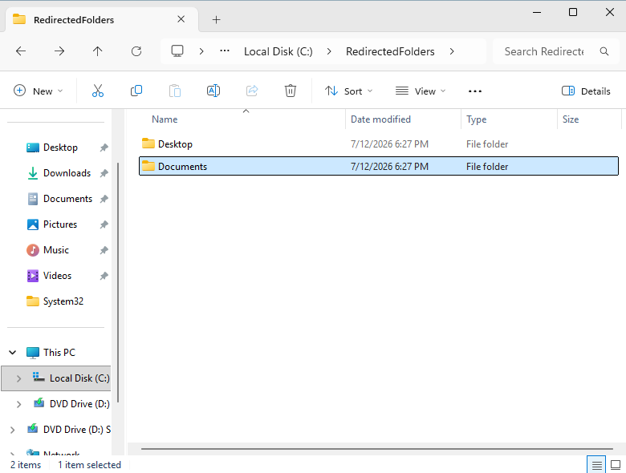
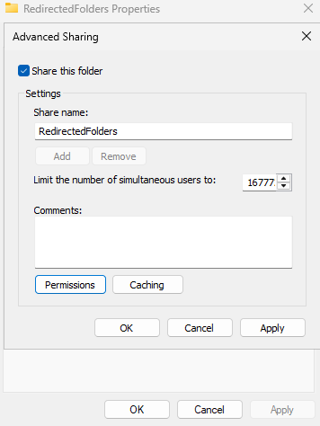
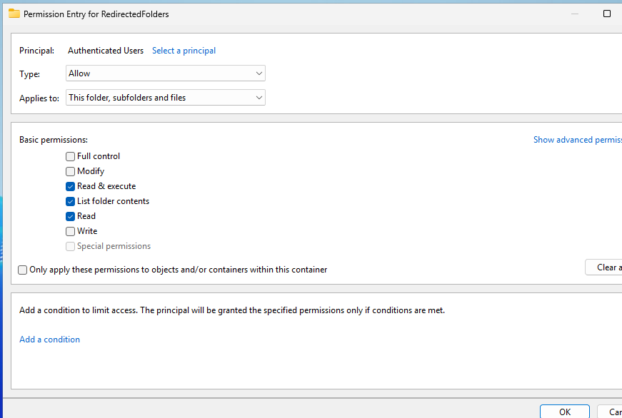
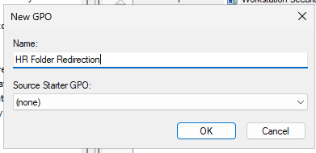
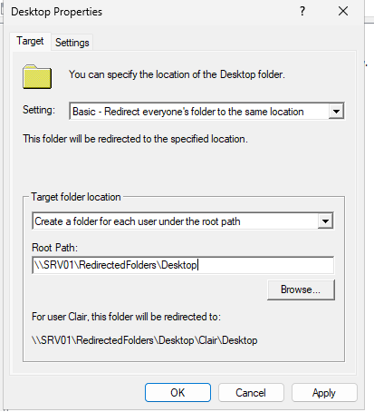
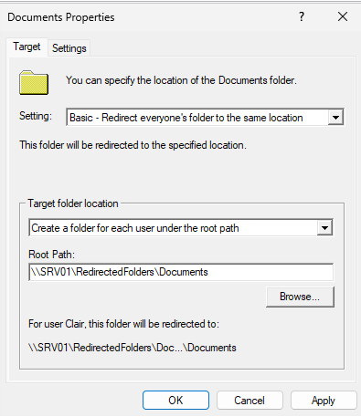
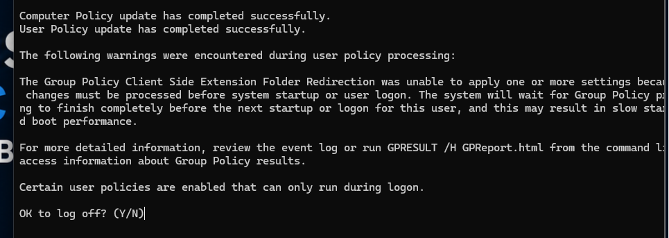
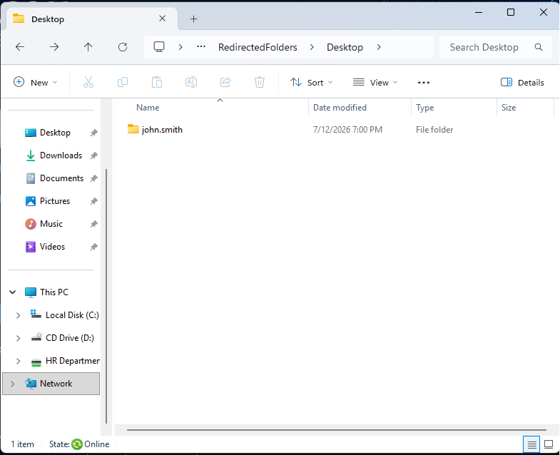
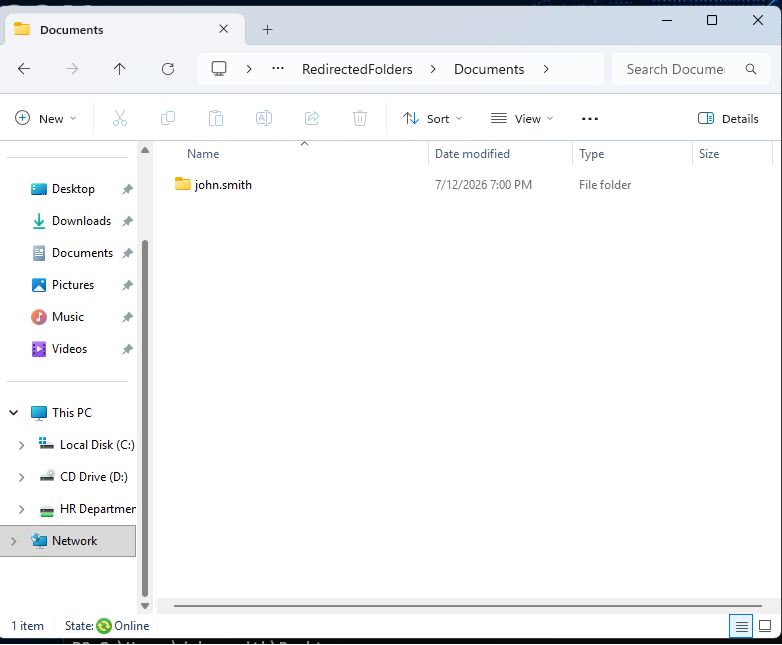
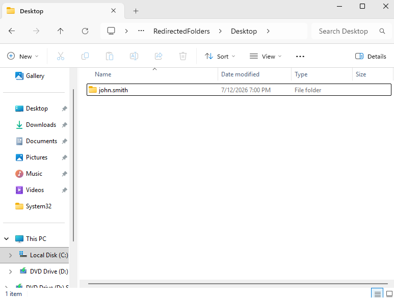

<div align="center">
  
</div>

---

# Overview

This module documents the implementation of Group Policy-based Folder Redirection in the `homelab.local` environment.

The objective was to redirect user Desktop and Documents folders from CLIENT01 to a centralized location on SRV01.

The implementation included:

- Creating a server-side folder-redirection directory
- Sharing the directory over SMB
- Configuring share permissions
- Creating a dedicated Folder Redirection GPO
- Redirecting the Desktop folder
- Redirecting the Documents folder
- Refreshing Group Policy
- Signing out and signing back in
- Verifying the redirected client folders
- Confirming the per-user folders on SRV01

This module demonstrates how organizations can centralize user data instead of storing it only on individual workstations.

---

# Why I Built This Module

Before this module, files stored in a user's Desktop or Documents folder remained primarily on the local workstation.

That creates several operational risks:

- Data may be lost if the workstation fails
- Files may not follow the user to another domain computer
- Backups may not include local user data
- Help Desk staff may have difficulty recovering files
- User information becomes distributed across many endpoints
- Device replacement becomes more complicated

I wanted to understand how Group Policy could redirect user folders to a server without requiring the employee to manually save files to a network share.

The most important lesson was that Folder Redirection is different from ordinary drive mapping.

```text
Mapped Drive
=
Provides access to a network location
```

```text
Folder Redirection
=
Changes where a Windows user folder stores its data
```

---

# Business Scenario

The organization stores important employee documents on Windows 11 workstations.

Management is concerned that locally stored Desktop and Documents files may be lost if a device is damaged, replaced, or reimaged.

The Infrastructure Team must implement a centralized storage solution that:

- Redirects user Desktop folders
- Redirects user Documents folders
- Creates a separate folder for each employee
- Keeps user data on SRV01
- Limits access to the correct user
- Supports backup and recovery
- Allows the same user data to be available from approved domain computers

The solution is deployed through Group Policy to users in the appropriate Organizational Unit.

---

# Learning Objectives

By completing this module, I practiced the following:

- Understanding Windows Folder Redirection
- Creating a centralized redirected-folder directory
- Configuring SMB sharing
- Understanding share-permission requirements
- Creating a Folder Redirection GPO
- Configuring user-based Group Policy settings
- Redirecting the Desktop folder
- Redirecting the Documents folder
- Using a root path for automatic per-user folders
- Applying Group Policy on a Windows client
- Understanding why sign-out may be required
- Verifying redirected folder locations
- Reviewing server-side user folders
- Distinguishing Folder Redirection from mapped drives
- Troubleshooting common redirection failures
- Understanding data-protection benefits

---

# Key Concepts Learned

## Folder Redirection

Folder Redirection changes the storage location of supported Windows user folders.

Instead of storing data only in a local path such as:

```text
C:\Users\john.smith\Desktop
```

the folder can be redirected to a network location such as:

```text
\\SRV01\RedirectedFolders\john.smith\Desktop
```

The user can continue using the normal Desktop and Documents interface while Windows stores the data on the server.

---

## Local User Profile

A local profile contains user-specific Windows data on one computer.

Typical path:

```text
C:\Users\<username>
```

It may include:

- Desktop
- Documents
- Downloads
- Pictures
- AppData
- User settings

Folder Redirection moves selected folders but does not move the entire profile.

---

## Redirected Folder Root Path

The Group Policy setting uses a network root path.

Example:

```text
\\SRV01\RedirectedFolders
```

Windows can automatically create a separate folder for each user below that path.

Example:

```text
\\SRV01\RedirectedFolders\john.smith
```

This reduces the need to manually create every user folder.

---

## Desktop Redirection

Desktop redirection moves files and shortcuts from the user's local Desktop to the configured network location.

The user still sees the normal Windows Desktop.

The storage location changes behind the interface.

---

## Documents Redirection

Documents redirection moves the user's Documents folder to the centralized network location.

This is useful because many applications use Documents as a default save location.

---

## Basic Redirection

A common Folder Redirection configuration is:

```text
Basic — Redirect everyone's folder to the same location
```

This does not mean every user shares the exact same folder.

Windows creates a separate folder for each user under the configured root path.

---

## User Configuration

Folder Redirection settings are normally located under:

```text
User Configuration
    ↓
Policies
    ↓
Windows Settings
    ↓
Folder Redirection
```

Because it is a user policy, the GPO must apply to the user account rather than only the computer account.

---

## Exclusive Rights

Folder Redirection can grant the user exclusive rights to the redirected folder.

This may improve privacy, but it can also make backup, administration, and recovery more difficult if administrators cannot access the folder.

The setting should match the organization's support and backup requirements.

---

## Offline Files

Windows Offline Files can cache network-based user folders on the workstation.

This allows users to continue working when the file server is temporarily unavailable.

Offline Files must be planned carefully because synchronization conflicts and cached sensitive data may create additional support or security concerns.

---

## Folder Redirection vs Roaming Profiles

Folder Redirection moves selected folders such as Desktop and Documents.

Roaming Profiles move a broader set of profile data between computers.

Folder Redirection is often easier to manage because it keeps large user files outside the roaming profile.

---

## Folder Redirection vs OneDrive Known Folder Move

Modern Microsoft 365 environments often use OneDrive Known Folder Move for Desktop, Documents, and Pictures.

This module uses traditional on-premises Group Policy Folder Redirection to demonstrate Windows Server-based user-data management.

---

# Lab Environment Specifications

| Component | Configuration |
|------------|---------------|
| File Server | SRV01 |
| Domain Controller | SRV01 |
| Server Operating System | Windows Server 2025 Standard Evaluation |
| Client Computer | CLIENT01 |
| Client Operating System | Windows 11 Enterprise |
| Active Directory Domain | homelab.local |
| Management Tool | Group Policy Management |
| Redirection Method | Group Policy Folder Redirection |
| Redirected Folders | Desktop and Documents |
| Storage Protocol | SMB |
| Root Share | RedirectedFolders |
| Policy Scope | Domain user accounts |
| Validation | CLIENT01 and SRV01 |

---

# Folder Structure

```text
02-Core-Infrastructure
│
└── 04-Folder-Redirection
    │
    ├── README.md
    │
    └── Evidence
        └── Screenshots
            ├── 01-Create-RedirectedFolders-Directory.png
            ├── 02-Create-RedirectedFolders-Share.png
            ├── 03-RedirectedFolders-Share-Permissions.png
            ├── 04-Create-Folder-Redirection-GPO.png
            ├── 05-Desktop-Folder-Redirection-Policy.png
            ├── 06-Documents-Folder-Redirection-Policy.png
            ├── 07-GPUpdate-Folder-Redirection.png
            ├── 08-Desktop-Redirected-Successfully.png
            ├── 09-Documents-Redirected-Successfully.png
            └── 10-Server-Redirected-User-Folders.png
```

---

# Step-by-Step Implementation

---

## Step 1 — Create the Redirected Folders Directory

Created a centralized directory on SRV01 for redirected user data.

Example:

```text
C:\RedirectedFolders
```

The folder serves as the root storage location for user Desktop and Documents folders.

A dedicated root folder makes it easier to:

- Configure permissions
- Apply backups
- Monitor storage
- Locate user data
- Separate redirected content from other file shares

<p align="center">
  
</p>

---

## Step 2 — Share the Redirected Folders Directory

Enabled sharing for the root folder.

The share name was configured as:

```text
RedirectedFolders
```

The resulting UNC path was:

```text
\\SRV01\RedirectedFolders
```

Group Policy uses the UNC path instead of a local drive path because clients must access the location over the network.

<p align="center">
  
</p>

---

## Step 3 — Configure Share Permissions

Configured share permissions for the redirected-folder root.

The permissions must allow authorized users to create or access their own folders while preventing inappropriate access to other users' data.

The final effective access also depends on NTFS permissions.

This means both layers must be reviewed:

```text
Share Permissions
+
NTFS Permissions
=
Effective Network Access
```

<p align="center">
  
</p>

---

## Step 4 — Create the Folder Redirection GPO

Opened Group Policy Management and created a dedicated GPO.

Example name:

```text
Folder Redirection Policy
```

Using a separate GPO makes the configuration easier to:

- Identify
- Test
- Troubleshoot
- Back up
- Roll back
- Document

The GPO was linked to the Organizational Unit containing the target user accounts.

<p align="center">
  
</p>

---

## Step 5 — Configure Desktop Folder Redirection

Navigated to:

```text
User Configuration
    ↓
Policies
    ↓
Windows Settings
    ↓
Folder Redirection
    ↓
Desktop
```

Configured the Desktop folder to redirect to the centralized server location.

Example root path:

```text
\\SRV01\RedirectedFolders
```

Windows then creates a user-specific path below the root.

Example:

```text
\\SRV01\RedirectedFolders\john.smith\Desktop
```

<p align="center">
  
</p>

---

## Step 6 — Configure Documents Folder Redirection

Configured the Documents folder using the same redirected-folder root.

Example resulting path:

```text
\\SRV01\RedirectedFolders\john.smith\Documents
```

Redirecting Documents centralizes common user files and makes them easier to protect through server backups.

<p align="center">
  
</p>

---

## Step 7 — Refresh Group Policy

On CLIENT01, ran:

```cmd
gpupdate /force
```

This forced Windows to retrieve the new user policy.

Folder Redirection may require:

- User sign-out
- User sign-in
- Background synchronization
- Network access to the file server

The policy may not fully activate during the existing user session.

<p align="center">
  
</p>

---

## Step 8 — Verify Desktop Redirection

Signed out and signed back in using the domain user account.

Verified that the Desktop folder was redirected successfully.

Possible verification methods include:

- Opening Desktop properties
- Reviewing the Location tab
- Creating a test file
- Checking the server-side folder
- Reviewing Group Policy results

The expected storage path was on SRV01 rather than only in the local profile.

<p align="center">
  
</p>

---

## Step 9 — Verify Documents Redirection

Verified that the Documents folder was redirected to the server location.

A test file stored in Documents should appear inside the user's server-side redirected folder.

This validated that the Group Policy setting was applied and the client could access the SMB share.

<p align="center">
  
</p>

---

## Step 10 — Verify the User Folders on SRV01

Opened the redirected-folder directory on SRV01.

Confirmed that user-specific folders were created beneath the shared root.

Example:

```text
C:\RedirectedFolders
│
└── john.smith
    ├── Desktop
    └── Documents
```

This confirmed that the user data was being stored centrally.

<p align="center">
  
</p>

---

# Folder Redirection Workflow

```text
User Signs In to CLIENT01
          │
          ▼
Group Policy Is Processed
          │
          ▼
Folder Redirection Policy Applies
          │
          ├── Desktop
          └── Documents
          │
          ▼
Windows Connects to SRV01
          │
          ▼
User-Specific Folder Is Created
          │
          ▼
Files Are Stored on the Server
```

---

# Data Storage Comparison

## Before Redirection

```text
CLIENT01
└── C:\Users\john.smith
    ├── Desktop
    └── Documents
```

Data depends mainly on the local workstation.

## After Redirection

```text
SRV01
└── RedirectedFolders
    └── john.smith
        ├── Desktop
        └── Documents
```

The client continues to display the standard Desktop and Documents folders while the data is stored centrally.

---

# Folder Redirection and Backup Relationship

```text
User Saves File
      │
      ▼
Redirected Folder on SRV01
      │
      ▼
Centralized Server Backup
      │
      ▼
Recovery after:
      ├── Device failure
      ├── Accidental deletion
      ├── Device replacement
      └── Local profile corruption
```

Centralized storage does not replace backups.

It makes user data easier to include in a server-side backup plan.

---

# Validation Results

| Validation Check | Result |
|------------------|--------|
| Redirected folder root created | ✅ |
| Redirected folder root shared | ✅ |
| Share permissions configured | ✅ |
| Folder Redirection GPO created | ✅ |
| Desktop redirection configured | ✅ |
| Documents redirection configured | ✅ |
| Group Policy refreshed | ✅ |
| User signed out and signed back in | ✅ |
| Desktop redirected successfully | ✅ |
| Documents redirected successfully | ✅ |
| User-specific server folders created | ✅ |
| Centralized user data confirmed | ✅ |
| Backup integration | ⏭️ Backup module |
| Offline Files validation | ⏭️ Future improvement |
| Multiple-user testing | ⏭️ Future improvement |

---

# Troubleshooting Guide

## Folder Redirection Policy Does Not Apply

Check:

1. Is the GPO linked to the correct user OU?
2. Is the user account inside that OU?
3. Is the user section of the GPO enabled?
4. Does security filtering allow the user?
5. Is inheritance blocked?
6. Can CLIENT01 reach SRV01?
7. Does DNS resolve SRV01?
8. Can the user open the share manually?
9. Has the user signed out and signed back in?
10. Does `gpresult` show the GPO?

Useful commands:

```cmd
gpupdate /force
```

```cmd
gpresult /r
```

```cmd
gpresult /h C:\Reports\FolderRedirection-GPResult.html /f
```

---

## IP Works but the Share Name Fails

Example:

```text
\\192.168.241.10\RedirectedFolders
```

works, but:

```text
\\SRV01\RedirectedFolders
```

fails.

This suggests a DNS or hostname-resolution problem.

Check:

```cmd
ipconfig /all
```

```cmd
nslookup SRV01.homelab.local
```

```cmd
ping SRV01.homelab.local
```

CLIENT01 should use SRV01 as its DNS server.

---

## User Cannot Open the Share

Test:

```text
\\SRV01\RedirectedFolders
```

Possible causes:

- Incorrect share permissions
- Incorrect NTFS permissions
- SMB blocked by firewall
- Server unavailable
- Wrong UNC path
- User not authenticated to the domain
- DNS failure

---

## Desktop Redirects but Documents Does Not

Check the Documents policy separately.

Possible causes:

- Documents setting was not configured
- GPO edit was not saved
- Different policy setting
- Known Folder relationship
- User has not signed out
- Permission issue in the Documents path
- Policy conflict

---

## GPO Appears Applied but Folder Location Is Still Local

Possible causes:

- Sign-out was not completed
- Folder Redirection failed during logon
- The target path is unavailable
- Permissions prevented folder creation
- Existing folder policy conflicts
- Offline Files or cache behavior
- Event log contains an error

Review:

```text
Event Viewer
→ Applications and Services Logs
→ Microsoft
→ Windows
→ Folder Redirection
→ Operational
```

---

## Access Denied During Folder Creation

This usually indicates a permission problem.

Check:

- Root share permissions
- Root NTFS permissions
- Creator Owner permissions
- Authenticated Users permissions
- User-specific folder ownership
- Exclusive rights configuration

The root folder often needs permissions that allow users to create their own folder without giving them access to other users' folders.

---

## User Can See Another User's Folder

This indicates that the permission model may be too broad.

Review:

- NTFS permissions
- Inheritance
- Authenticated Users rights
- Domain Users rights
- Folder ownership
- Access-Based Enumeration

Users should not automatically receive access to other employees' redirected data.

---

## Folder Redirection Is Slow

Possible causes:

- Large existing profile data
- Slow network
- Offline Files synchronization
- File-server performance
- Antivirus scanning
- Many small files
- Unavailable server during sign-in

The first sign-in after enabling redirection may take longer if existing data is moved.

---

## File Server Is Unavailable

If SRV01 is unavailable, the user may:

- Receive redirection errors
- Use cached Offline Files
- Experience slow sign-in
- Temporarily lose access
- Work with stale cached data

A production design should consider:

- File-server redundancy
- Offline Files
- DFS
- Backups
- Monitoring
- Restore procedures

---

# Technical Decisions

## Why Redirect Desktop and Documents?

These folders commonly contain important user files.

Redirecting them improves:

- Centralization
- Backup coverage
- Device replacement
- User mobility
- Recovery
- Administrative visibility

---

## Why Use a Dedicated Root Share?

A dedicated root keeps redirected data separate from ordinary department shares.

This makes permissions, backup, and troubleshooting easier.

---

## Why Use a UNC Path?

Clients access the storage over the network.

A UNC path remains independent of local drive-letter assignments.

Example:

```text
\\SRV01\RedirectedFolders
```

---

## Why Link the GPO to a User OU?

Folder Redirection is a user setting.

The GPO must apply to the user's account scope.

Linking only to the Workstations OU may not apply the user policy unless loopback processing is intentionally configured.

---

## Why Sign Out and Sign Back In?

Folder Redirection is normally processed during user sign-in.

`gpupdate /force` retrieves the policy, but a new user session may be required to complete the redirection.

---

## Why Verify Both Client and Server?

Client validation confirms that Windows shows the redirected folders.

Server validation confirms that the data exists in the centralized location.

```text
Client folder location
+
Server-side user folder
=
Stronger validation
```

---

# Security Notes

## Protect User Privacy

Redirected folders may contain:

- Personal employee documents
- Confidential work
- Screenshots
- Downloads
- Business records
- Sensitive information

Permissions should prevent unauthorized users from accessing another employee's folder.

---

## Review Exclusive Rights Carefully

Granting exclusive rights may prevent administrators and backup software from accessing user folders.

Disabling exclusive rights may simplify support but requires a carefully designed permission model.

The decision should be documented.

---

## Use Least Privilege

Users should receive access only to their own redirected folder.

Administrators should receive only the access required for:

- Backup
- Recovery
- Troubleshooting
- Security investigation
- Approved support

---

## Centralized Storage Still Requires Backups

Folder Redirection moves data to SRV01.

It does not automatically protect the data from:

- Server failure
- Accidental deletion
- Ransomware
- Corruption
- Administrator error

The redirected folder root should be included in backup and recovery planning.

---

## Protect Offline Copies

Offline Files may store cached copies on the workstation.

Sensitive data may therefore exist on both:

- SRV01
- CLIENT01 cache

BitLocker and endpoint security should protect client devices.

---

## Monitor Storage Usage

Redirected folders may grow over time.

A production file server should monitor:

- Available disk space
- User storage growth
- Large files
- Quotas
- Backup size
- File-type restrictions

---

# Useful Commands

## Force Group Policy update

```cmd
gpupdate /force
```

---

## Review applied Group Policy

```cmd
gpresult /r
```

---

## Generate a detailed report

```cmd
gpresult /h C:\Reports\FolderRedirection-GPResult.html /f
```

---

## Test the redirected-folder share

```powershell
Test-Path "\\SRV01\RedirectedFolders"
```

---

## Review the user's Desktop path

```powershell
[Environment]::GetFolderPath("Desktop")
```

---

## Review the user's Documents path

```powershell
[Environment]::GetFolderPath("MyDocuments")
```

---

## View the share on SRV01

```powershell
Get-SmbShare `
    -Name "RedirectedFolders"
```

---

## View share access

```powershell
Get-SmbShareAccess `
    -Name "RedirectedFolders"
```

---

## Review NTFS permissions

```powershell
Get-Acl "C:\RedirectedFolders" |
Format-List
```

---

## Test DNS resolution

```cmd
nslookup SRV01.homelab.local
```

---

## Open the share manually

```text
\\SRV01\RedirectedFolders
```

---

# Skills Demonstrated

- Windows Folder Redirection
- Group Policy Management
- User Configuration
- SMB File Sharing
- Share Permissions
- NTFS Permission Awareness
- Centralized User Data
- Desktop Redirection
- Documents Redirection
- Windows Server 2025
- Windows 11 Administration
- Group Policy Troubleshooting
- Data Protection
- User Profile Management
- Technical Documentation

---

# Interview Notes

## What is Folder Redirection?

Folder Redirection changes the storage location of supported Windows user folders from the local profile to another location, commonly a network share.

---

## Why redirect Desktop and Documents?

These folders often contain important user data.

Redirecting them supports centralized backup, recovery, and access from approved domain computers.

---

## Is Folder Redirection the same as a mapped drive?

No.

A mapped drive gives the user access to a network path.

Folder Redirection changes the actual storage location used by a Windows known folder.

---

## Is Folder Redirection the same as a roaming profile?

No.

Folder Redirection moves selected folders.

A roaming profile moves a larger part of the user's profile between computers.

---

## Why is Folder Redirection under User Configuration?

The redirected path follows the user account rather than only the workstation.

---

## Why may sign-out be required?

Folder Redirection is normally processed during user sign-in, and Windows may need a new session to move or initialize the folder.

---

## How would you verify redirection?

I would:

1. Run `gpresult`
2. Check the folder Location tab
3. Create a test file
4. Verify the file on SRV01
5. Confirm the user's server-side folder
6. Review Folder Redirection event logs

---

## What permissions are important?

The user needs permission to create and access their own folder.

The permission design should prevent access to other users' folders while preserving backup and administrative requirements.

---

## What happens if the file server is unavailable?

The user may lose access, receive errors, or use cached Offline Files depending on the configuration.

---

## Does Folder Redirection replace backup?

No.

It centralizes data so backup is easier, but the server data must still be backed up and recovery tested.

---

# What I Learned

The most important lesson from this module was that Folder Redirection changes where Windows stores user data without changing how the user normally accesses the folders.

The user still opens:

```text
Desktop
```

and:

```text
Documents
```

but the data is stored on SRV01.

I also learned that successful redirection depends on more than the GPO.

The complete configuration requires:

```text
Working DNS
+
Available SMB Share
+
Correct Share Permissions
+
Correct NTFS Permissions
+
Correct User GPO Scope
+
User Sign-Out and Sign-In
```

If one of these pieces fails, the GPO may appear configured while the folder remains local.

The troubleshooting order I want to remember is:

```text
Check GPO scope
      ↓
Check gpresult
      ↓
Test DNS
      ↓
Test UNC path
      ↓
Check permissions
      ↓
Sign out and sign in
      ↓
Check event logs
      ↓
Verify server-side folder
```

---

# Future Improvements

To expand this module, I would add:

- Pictures folder redirection
- Favorites redirection
- Offline Files testing
- Access-Based Enumeration
- File Server Resource Manager quotas
- Storage monitoring
- Shadow Copies
- DFS Namespace
- Separate dedicated file server
- Folder Redirection health report
- Multi-user validation
- Backup and restore test
- Migration to OneDrive Known Folder Move
- Microsoft Intune policy comparison
- File access auditing
- Automated permission validation
- User-data migration script

A future PowerShell validation script could check:

```powershell
[PSCustomObject]@{
    UserName      = $env:USERNAME
    DesktopPath   = [Environment]::GetFolderPath("Desktop")
    DocumentsPath = [Environment]::GetFolderPath("MyDocuments")
    DesktopExists = Test-Path ([Environment]::GetFolderPath("Desktop"))
    DocumentsExists = Test-Path ([Environment]::GetFolderPath("MyDocuments"))
}
```

---

# Key Takeaways

This module implemented centralized user-data storage through Group Policy Folder Redirection.

The deployment included:

- Creating a redirected-folder root
- Sharing the root over SMB
- Configuring share permissions
- Creating a dedicated GPO
- Redirecting Desktop
- Redirecting Documents
- Applying Group Policy
- Verifying client-side redirection
- Confirming server-side user folders

The main lessons were:

```text
Folder Redirection changes where Windows stores user data.
```

```text
User policy scope must be correct.
```

```text
Share and NTFS permissions must support automatic folder creation.
```

```text
Sign-out and sign-in may be required.
```

```text
Centralized data is easier to back up but still requires a recovery plan.
```

The environment now supports centralized Desktop and Documents storage for domain users.

---

<div align="center">

### Module Status

✅ Completed Successfully

**Next Module:** [Print Server Management](../05-Print-Server-Management/)

</div>