<div align="center">
  
</div>

---

# Overview

This module documents the deployment of centralized print services in the `homelab.local` environment.

The objective was to configure SRV01 as a print server, create and share an HR printer, configure printer permissions, deploy the printer through Group Policy, and verify that CLIENT01 received the printer automatically.

The implementation included:

- Installing Print and Document Services
- Opening the Print Management console
- Creating the HR printer
- Sharing the printer
- Verifying the printer in Print Management
- Configuring printer sharing
- Reviewing printer permissions
- Creating a printer deployment GPO
- Deploying the printer through Group Policy
- Refreshing Group Policy on CLIENT01
- Confirming the GPO applied
- Verifying the printer on CLIENT01
- Testing the printer through the Windows print dialog
- Reviewing the Print Spooler service

This module demonstrates how organizations can centrally manage printers instead of configuring each workstation manually.

---

# Why I Built This Module

Printer support is a common Help Desk and systems administration responsibility.

Without centralized print management, technicians may need to configure printers separately on every workstation.

That approach becomes difficult when:

- Many users need the same printer
- Printer drivers must be updated
- Departments require different printers
- Printer permissions must be controlled
- Devices are replaced
- Printer names or addresses change
- Users accidentally remove printers

I wanted to understand how a Windows print server can provide one central location for printer configuration and deployment.

The most important lesson was that a shared printer consists of more than the physical device.

A complete print solution includes:

```text
Printer
+
Driver
+
Print Queue
+
Share
+
Permissions
+
Client Deployment
```

---

# Business Scenario

The Human Resources department requires access to a centralized office printer.

Management wants the printer to appear automatically for approved users instead of requiring manual installation on every workstation.

The Infrastructure Team must:

- Install the print server role
- Create the HR printer
- Share the printer from SRV01
- Configure access permissions
- Deploy the printer through Group Policy
- Confirm that CLIENT01 receives the printer
- Verify that the printer is available from the Windows print dialog
- Confirm that the Print Spooler service is running

The solution should be centrally manageable and scalable to additional departments.

---

# Learning Objectives

By completing this module, I practiced the following:

- Installing Print and Document Services
- Using the Print Management console
- Creating a printer queue
- Understanding printer drivers
- Sharing a printer
- Configuring a printer share name
- Reviewing printer permissions
- Understanding printer access rights
- Creating a printer deployment GPO
- Deploying printers through Group Policy
- Refreshing Group Policy
- Verifying printer installation on a client
- Reviewing the Print Spooler service
- Troubleshooting printer-deployment issues
- Documenting centralized print infrastructure

---

# Key Concepts Learned

## Print Server

A print server centrally manages printers and print queues.

It can provide:

- Shared printer access
- Central driver management
- Print queue monitoring
- Printer permissions
- Department-based deployment
- Easier troubleshooting
- Centralized administration

In this lab, SRV01 acts as the print server.

---

## Printer Queue

A printer queue represents the logical Windows printer object.

It manages:

- Print jobs
- Job order
- Driver selection
- Printer configuration
- Sharing
- Security permissions

A physical printer and a Windows print queue are related but not identical.

---

## Printer Driver

A printer driver allows Windows applications to communicate with a printer.

The driver converts application output into a format understood by the printer.

Driver compatibility is important because incorrect or outdated drivers may cause:

- Failed printing
- Spooler crashes
- Incorrect output
- Missing features
- Client installation failures

---

## Shared Printer

A shared printer is published by a Windows print server and accessed through a network path.

Example:

```text
\\SRV01\HR-Printer
```

Clients can connect to this shared printer instead of configuring the printer independently.

---

## Printer Permissions

Printer permissions determine which users or groups may use or manage a printer.

Common permissions include:

### Print

Allows users to send and manage their own print jobs.

### Manage Documents

Allows users to manage print jobs submitted by other users.

### Manage This Printer

Allows administrators to change printer properties, sharing, and permissions.

Standard users usually need only:

```text
Print
```

---

## Print Spooler

The Print Spooler service manages printer communication and print queues.

Service name:

```text
Spooler
```

If the service stops, printers and print jobs may become unavailable.

---

## Group Policy Printer Deployment

Printers can be deployed through Group Policy so they appear automatically for users or computers.

Deployment can be based on:

- User OU
- Computer OU
- Security group
- Department
- Organizational role

This reduces manual installation and improves consistency.

---

## User-Based Deployment

User-based deployment follows the user account.

The printer may appear when the user signs in to an approved domain computer.

This is useful for department printers.

---

## Computer-Based Deployment

Computer-based deployment follows the workstation.

The printer appears for users who sign in to that device.

This is useful for fixed-location computers such as reception desks or shared workstations.

---

## Point and Print

Point and Print allows clients to connect to a shared printer and obtain the required driver from the print server.

Modern Windows environments may restrict Point and Print behavior for security reasons.

Printer-driver installation policies should be reviewed carefully.

---

# Lab Environment Specifications

| Component | Configuration |
|------------|---------------|
| Print Server | SRV01 |
| Server Operating System | Windows Server 2025 Standard Evaluation |
| Client Computer | CLIENT01 |
| Client Operating System | Windows 11 Enterprise |
| Active Directory Domain | homelab.local |
| Management Tool | Print Management |
| Printer Name | HR Printer |
| Printer Share | HR Printer share |
| Deployment Method | Group Policy |
| Policy Validation | `gpupdate`, `gpresult` |
| Print Service | Print Spooler |

---

# Folder Structure

```text
02-Core-Infrastructure
│
└── 05-Print-Server-Management
    │
    ├── README.md
    │
    └── Evidence
        └── Screenshots
            ├── 01-Install-Print-Services.png
            ├── 02-Open-Print-Management.png
            ├── 03-Create-HR-Printer.png
            ├── 04-Share-Printer.png
            ├── 05-Printer-Installed.png
            ├── 06-Printer-Visible-In-Print-Management.png
            ├── 07-Printer-Sharing-Configured.png
            ├── 08-Printer-Permissions.png
            ├── 09-Create-Printer-GPO.png
            ├── 10-Deploy-Printer-Via-GPO.png
            ├── 11-GPUpdate-Client01.png
            ├── 12-GPO-Applied-Client01.png
            ├── 13-Printer-Installed-On-Client01.png
            ├── 14-Print-Server-Final-Configuration.png
            ├── 15-Print-Dialog-HR-Printer.png
            └── 16-Print-Spooler-Service.png
```

---

# Step-by-Step Implementation

---

## Step 1 — Install Print and Document Services

Opened the Add Roles and Features Wizard and installed the required print services.

The role provides centralized printer and print queue management.

<p align="center">
  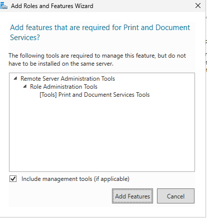
</p>

---

## Step 2 — Open Print Management

Opened:

```text
Server Manager
      ↓
Tools
      ↓
Print Management
```

Print Management provides access to:

- Print servers
- Printers
- Drivers
- Ports
- Print queues
- Deployed printers
- Custom filters

<p align="center">
  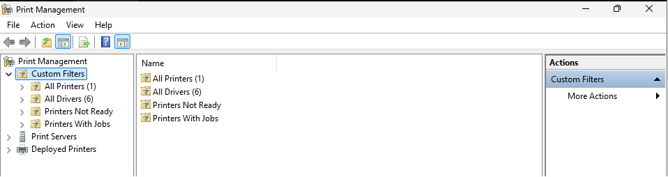
</p>

---

## Step 3 — Create the HR Printer

Created a printer queue for the Human Resources department.

The printer was given a clear descriptive name so administrators and users could identify its business purpose.

Example:

```text
HR Printer
```

A consistent printer naming convention can include:

- Department
- Location
- Floor
- Printer type
- Device number

<p align="center">
  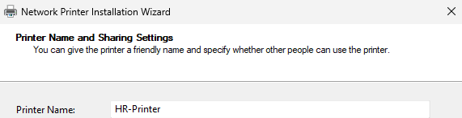
</p>

---

## Step 4 — Share the Printer

Enabled printer sharing.

Sharing created a network resource that domain clients could access through SRV01.

Example UNC path:

```text
\\SRV01\HR-Printer
```

The share name should be:

- Short
- Clear
- Unique
- Consistent
- Easy to troubleshoot

<p align="center">
  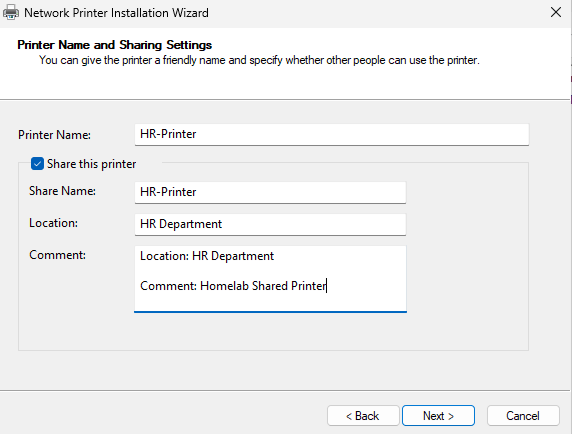
</p>

---

## Step 5 — Verify the Printer Installation

Confirmed that the printer queue was created successfully on SRV01.

This validated that Windows recognized the printer configuration and associated driver.

<p align="center">
  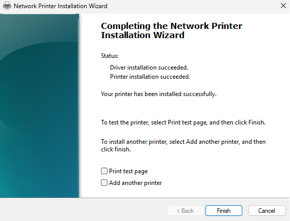
</p>

---

## Step 6 — Verify the Printer in Print Management

Reviewed the printer under the SRV01 print server in Print Management.

The console displayed the centralized printer object and confirmed that it could be managed from the server.

<p align="center">
  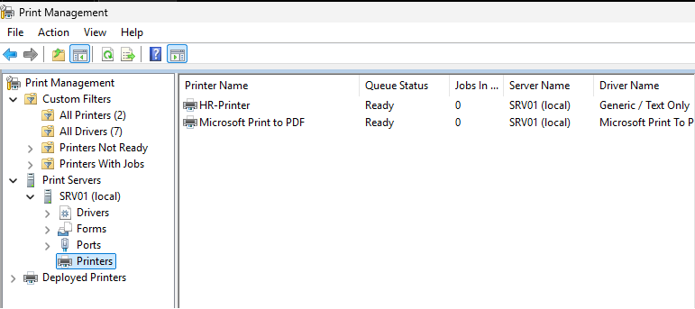
</p>

---

## Step 7 — Review Printer Sharing Configuration

Reviewed the printer sharing settings.

The configuration included:

- Share enabled
- Share name
- Printer listing
- Client rendering settings
- Optional directory publishing settings

The shared path was used later during Group Policy deployment.

<p align="center">
  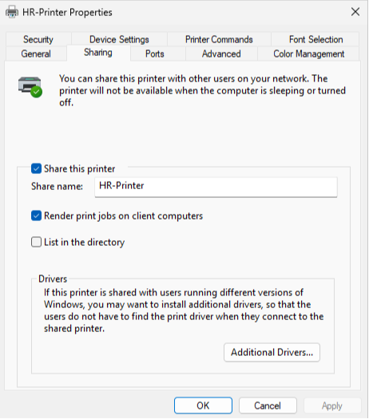
</p>

---

## Step 8 — Configure Printer Permissions

Reviewed and configured printer permissions.

Standard department users should normally receive:

```text
Print
```

Administrative rights such as:

```text
Manage Documents
```

or:

```text
Manage This Printer
```

should be restricted to approved support or infrastructure administrators.

Permissions should be assigned to security groups rather than individual users where possible.

<p align="center">
  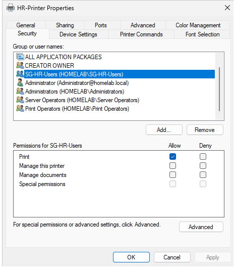
</p>

---

## Step 9 — Create the Printer Deployment GPO

Opened Group Policy Management and created a dedicated GPO for printer deployment.

Example name:

```text
HR Printer Deployment
```

A dedicated GPO makes the deployment easier to:

- Identify
- Troubleshoot
- Disable
- Back up
- Review
- Scope to the correct users

<p align="center">
  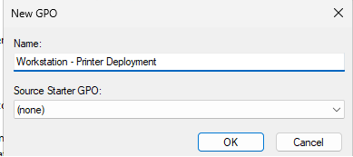
</p>

---

## Step 10 — Deploy the Printer through Group Policy

Configured the shared printer for deployment through Group Policy.

The printer was associated with the appropriate user or computer policy scope.

For an HR department printer, user-based deployment is appropriate when the printer should follow HR users.

The deployment links the shared printer to the GPO.

<p align="center">
  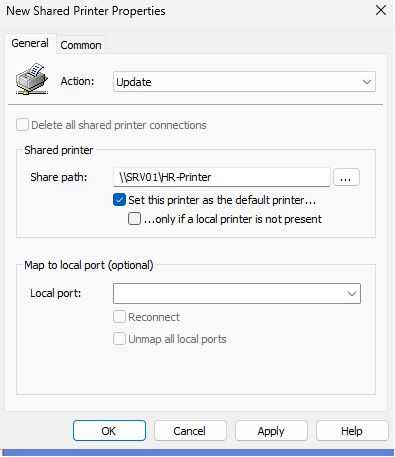
</p>

---

## Step 11 — Refresh Group Policy on CLIENT01

On CLIENT01, ran:

```cmd
gpupdate /force
```

This forced Windows to retrieve the latest Group Policy settings.

Printer deployment may also require:

- User sign-out and sign-in
- Computer restart
- Background policy processing
- Access to the print server
- Driver installation

<p align="center">
  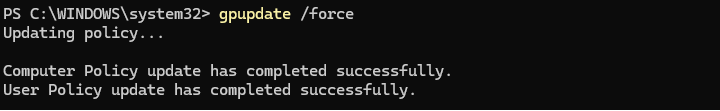
</p>

---

## Step 12 — Confirm the Printer GPO Applied

Used Group Policy Result information to confirm that the printer deployment policy applied to CLIENT01 or the signed-in user.

Useful command:

```cmd
gpresult /r
```

A detailed report can be generated using:

```cmd
gpresult /h C:\Reports\Printer-GPResult.html /f
```

<p align="center">
  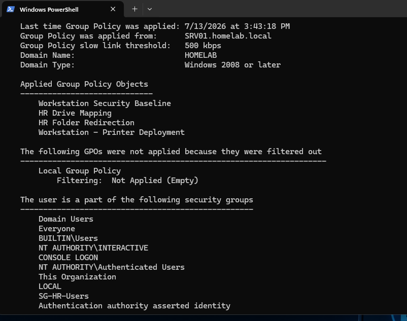
</p>

---

## Step 13 — Verify the Printer on CLIENT01

Opened Windows printer settings and confirmed that the HR printer appeared on CLIENT01.

This validated that:

- The shared printer was reachable
- The GPO was in scope
- Group Policy processed successfully
- The required driver was available
- The printer connection was created

<p align="center">
  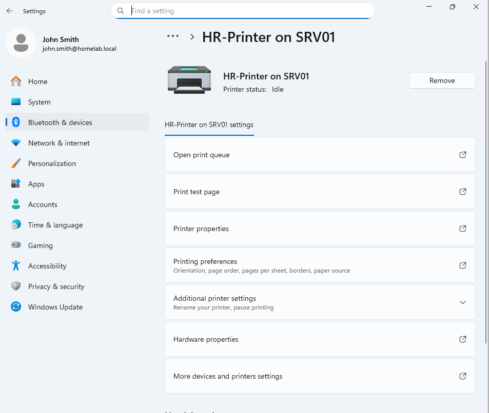
</p>

---

## Step 14 — Review the Final Print Server Configuration

Reviewed the completed print server configuration on SRV01.

The final environment included:

- Print services installed
- HR printer queue
- Shared printer
- Printer permissions
- Printer deployment GPO
- Client-side printer installation

<p align="center">
  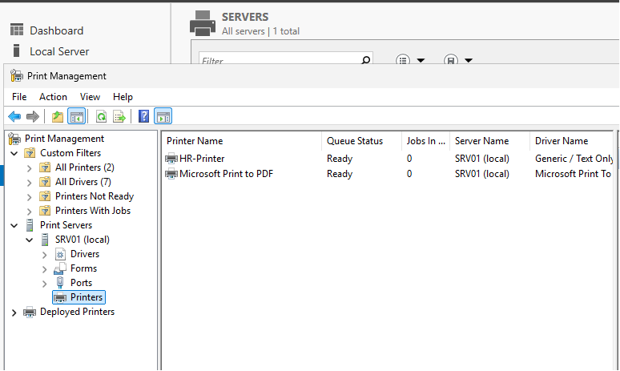
</p>

---

## Step 15 — Verify the Printer in the Print Dialog

Opened a Windows application print dialog and confirmed that the HR printer was available.

This tested the printer from the perspective of an end user rather than only through administrative tools.

The printer being visible in the print dialog confirmed that applications could select it.

<p align="center">
  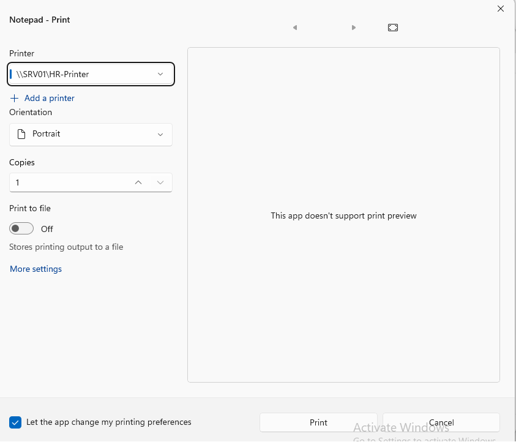
</p>

---

## Step 16 — Verify the Print Spooler Service

Reviewed the Print Spooler service.

Service name:

```text
Spooler
```

The expected state was:

```text
Running
```

The Print Spooler is required for:

- Print queue processing
- Printer discovery
- Driver interaction
- Client printer connections
- Print job management

<p align="center">
  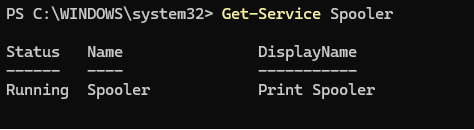
</p>

---

# Print Server Workflow

```text
Create Printer on SRV01
          │
          ▼
Install or Select Driver
          │
          ▼
Create Print Queue
          │
          ▼
Share Printer
          │
          ▼
Configure Permissions
          │
          ▼
Create Deployment GPO
          │
          ▼
Apply Policy to HR Users
          │
          ▼
CLIENT01 Receives Printer
          │
          ▼
User Selects Printer
          │
          ▼
Print Job Sent to SRV01
          │
          ▼
Spooler Processes Job
```

---

# Printer Access Model

```text
HR User
   │
   ▼
HR Security Group
   │
   ▼
Printer Permission: Print
   │
   ▼
Shared HR Printer
```

Administrative access should remain separate:

```text
Print Administrators
   │
   ├── Manage Documents
   └── Manage This Printer
```

---

# Validation Results

| Validation Check | Result |
|------------------|--------|
| Print services installed | ✅ |
| Print Management opened | ✅ |
| HR printer created | ✅ |
| Printer shared | ✅ |
| Printer installed on SRV01 | ✅ |
| Printer visible in Print Management | ✅ |
| Sharing configuration reviewed | ✅ |
| Printer permissions configured | ✅ |
| Printer deployment GPO created | ✅ |
| Printer deployed through GPO | ✅ |
| Group Policy refreshed on CLIENT01 | ✅ |
| Printer GPO confirmed as applied | ✅ |
| Printer installed on CLIENT01 | ✅ |
| Final print server configuration reviewed | ✅ |
| Printer visible in application print dialog | ✅ |
| Print Spooler service verified | ✅ |
| Physical test page printed | Not evaluated in virtual lab |
| Department-specific security targeting | Future improvement |

---

# Troubleshooting Guide

## Printer Does Not Appear on CLIENT01

Check:

1. Is the GPO linked to the correct OU?
2. Is the user or computer in the correct scope?
3. Does `gpresult` show the printer GPO?
4. Can CLIENT01 reach SRV01?
5. Does DNS resolve SRV01?
6. Is the printer shared?
7. Does the user have Print permission?
8. Is the Print Spooler running?
9. Is the driver compatible?
10. Is sign-out or restart required?

Useful commands:

```cmd
gpupdate /force
```

```cmd
gpresult /r
```

```cmd
ping SRV01.homelab.local
```

```cmd
nslookup SRV01.homelab.local
```

---

## Shared Printer Path Cannot Be Opened

Test the UNC path:

```text
\\SRV01
```

or the printer share path:

```text
\\SRV01\HR-Printer
```

Possible causes:

- DNS failure
- SMB or RPC connectivity issue
- Printer share disabled
- Firewall issue
- Incorrect share name
- Server unavailable

---

## GPO Applies but Printer Is Missing

This suggests that policy scope worked but printer installation failed.

Check:

- Driver availability
- Point and Print restrictions
- PrintService event logs
- Printer connection errors
- User permissions
- Spooler status
- Architecture compatibility

---

## Print Spooler Is Stopped

Check:

```powershell
Get-Service Spooler
```

Start it:

```powershell
Start-Service Spooler
```

Restart it:

```powershell
Restart-Service Spooler
```

Do not repeatedly restart the service without investigating why it stopped.

Possible causes include:

- Faulty printer driver
- Corrupted print job
- Windows update issue
- Spool directory problem
- Service dependency failure
- Security control

---

## Print Job Is Stuck

Check the print queue through Print Management or PowerShell.

```powershell
Get-PrintJob `
    -PrinterName "HR Printer"
```

Remove a specific failed job only after identifying it:

```powershell
Remove-PrintJob `
    -PrinterName "HR Printer" `
    -ID <JobID>
```

---

## Access Denied When Printing

Check:

- Printer security permissions
- User group membership
- GPO scope
- Deny permissions
- User authentication
- Printer share status

Useful command:

```cmd
whoami /groups
```

---

## Printer Is Installed for the Wrong Users

Check:

- GPO linked too broadly
- Incorrect user OU
- Incorrect computer OU
- Security filtering
- Group membership
- Deployment method
- Existing manual printer installation

A department printer should be targeted only to approved users or devices.

---

## Wrong Driver Installed

Symptoms may include:

- Garbled output
- Missing options
- Failed jobs
- Spooler crash
- Printer unavailable

Review installed drivers:

```powershell
Get-PrinterDriver
```

Use approved vendor or compatible drivers and test before broad deployment.

---

# Technical Decisions

## Why Use a Print Server?

A print server provides one central location for:

- Printer configuration
- Driver management
- Permissions
- Queue monitoring
- Deployment
- Troubleshooting

---

## Why Deploy through Group Policy?

Group Policy automatically provides printers to users or computers.

This reduces:

- Manual setup
- Help Desk workload
- Incorrect printer configuration
- User confusion
- Repeated installations

---

## Why Use a Dedicated Printer GPO?

A dedicated GPO improves:

- Change control
- Troubleshooting
- Rollback
- Scope management
- Documentation

---

## Why Assign Permissions to Groups?

Group-based permissions are easier to maintain than direct user permissions.

Example:

```text
HR Employees
      ↓
HR Printer Print Permission
```

When an employee joins or leaves HR, access is controlled through group membership.

---

## Why Verify through the Print Dialog?

Administrative tools may show that the printer exists, but the print dialog confirms that normal applications can actually select it.

---

# Security Notes

## Limit Administrative Printer Rights

Standard users should not receive:

```text
Manage Documents
```

or:

```text
Manage This Printer
```

unless required.

---

## Protect the Print Spooler

The Print Spooler has historically been a sensitive Windows service.

Servers that do not require printing should not run it unnecessarily.

In this lab, SRV01 requires it because it is acting as the print server.

---

## Use Approved Drivers

Untrusted or outdated drivers can create security and stability risks.

Drivers should come from:

- Microsoft
- Approved vendors
- Controlled deployment packages
- Tested repositories

---

## Restrict Point and Print

Point and Print policy should be configured carefully to prevent users from installing drivers from unauthorized print servers.

Approved print servers should be clearly defined.

---

## Review Print Permissions

Printer access should match business requirements.

Sensitive departments may require dedicated printer access and restricted queues.

---

## Monitor Print Activity

A production environment may monitor:

- Failed print jobs
- Large print jobs
- Sensitive document printing
- Printer configuration changes
- Driver installation
- Spooler failures
- Unauthorized access attempts

---

# Useful Commands

## View printers

```powershell
Get-Printer
```

---

## View printer drivers

```powershell
Get-PrinterDriver
```

---

## View printer ports

```powershell
Get-PrinterPort
```

---

## View print jobs

```powershell
Get-PrintJob `
    -PrinterName "HR Printer"
```

---

## Check Print Spooler status

```powershell
Get-Service Spooler
```

---

## Restart Print Spooler

```powershell
Restart-Service Spooler
```

---

## Force Group Policy refresh

```cmd
gpupdate /force
```

---

## Review applied Group Policy

```cmd
gpresult /r
```

---

## Generate detailed Group Policy report

```cmd
gpresult /h C:\Reports\Printer-GPResult.html /f
```

---

## Test server name resolution

```cmd
nslookup SRV01.homelab.local
```

---

## Open the print server

```text
\\SRV01
```

---

# Skills Demonstrated

- Windows Print Server Administration
- Print and Document Services
- Print Management Console
- Printer Queue Management
- Printer Sharing
- Printer Permissions
- Group Policy Printer Deployment
- Client Printer Installation
- Print Spooler Administration
- Printer Driver Awareness
- Access Control
- Group Policy Validation
- Windows Server 2025
- Windows 11 Administration
- Infrastructure Troubleshooting
- Technical Documentation

---

# Interview Notes

## What is a print server?

A print server centrally manages shared printers, drivers, permissions, print queues, and client deployment.

---

## What is a print queue?

A print queue is the logical Windows object that receives, orders, and processes print jobs.

---

## What is the Print Spooler?

The Print Spooler is the Windows service responsible for managing print queues and communication with printers.

---

## What is the difference between Print and Manage Documents?

Print allows a user to submit and manage their own jobs.

Manage Documents allows management of jobs submitted by other users.

---

## Why deploy printers with Group Policy?

Group Policy provides centralized and automatic printer installation for the intended users or computers.

---

## How would you troubleshoot a missing deployed printer?

I would check:

1. GPO scope
2. OU placement
3. Security filtering
4. `gpresult`
5. DNS and connectivity
6. Printer share
7. Permissions
8. Driver installation
9. Spooler service
10. PrintService event logs

---

## What is Point and Print?

Point and Print allows clients to connect to a print server and install the required printer connection and driver.

---

## Why should printer drivers be controlled?

Faulty or untrusted drivers can cause security issues, failed printing, or Print Spooler instability.

---

## Should every user receive Manage This Printer permission?

No.

That permission should be limited to approved printer or systems administrators.

---

# What I Learned

The most important lesson from this module was that centralized printing involves several connected parts.

A printer may exist on the server but still fail for the user because of:

- GPO scope
- Permissions
- Driver compatibility
- DNS
- Network connectivity
- Spooler service
- Client policy processing

I also learned why validation should happen from both the server and client.

```text
Printer visible in Print Management
+
Printer installed on CLIENT01
+
Printer visible in application dialog
=
Stronger validation
```

The troubleshooting order I want to remember is:

```text
Check spooler
      ↓
Check printer queue
      ↓
Check share
      ↓
Check permissions
      ↓
Check GPO
      ↓
Check gpresult
      ↓
Check driver
      ↓
Test client printing
```

---

# Future Improvements

To expand this module, I would add:

- Department security-group targeting
- Printer deployment through Group Policy Preferences
- Multiple department printers
- Printer-location naming standards
- Physical or virtual test-page validation
- Print job auditing
- Print queue monitoring
- Driver backup and restore
- Print server migration
- High availability
- PowerShell printer deployment
- Print usage reporting
- Quotas or print limits
- Point and Print restriction policy
- Dedicated print server
- Universal Print evaluation
- Microsoft Intune printer deployment

Example PowerShell printer inventory:

```powershell
Get-Printer |
Select-Object `
    Name,
    DriverName,
    PortName,
    Shared,
    ShareName,
    Published
```

---

# Key Takeaways

This module implemented centralized print management in the `homelab.local` environment.

The deployment included:

- Installing Print and Document Services
- Creating the HR printer
- Sharing the printer
- Configuring permissions
- Creating a printer deployment GPO
- Applying the policy to CLIENT01
- Verifying the printer installation
- Confirming the printer in the print dialog
- Reviewing the Print Spooler service

The main lessons were:

```text
A print server centralizes printer administration.
```

```text
Printer access should be assigned through groups.
```

```text
Group Policy reduces manual printer installation.
```

```text
The Print Spooler must be running.
```

```text
Server-side configuration and client-side validation are both required.
```

The environment now supports centralized department printer deployment.

---

<div align="center">

### Module Status

✅ Completed Successfully

**Next Module:** [File Server Auditing](../06-File-Server-Auditing/)

</div>