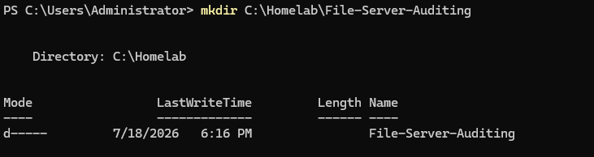
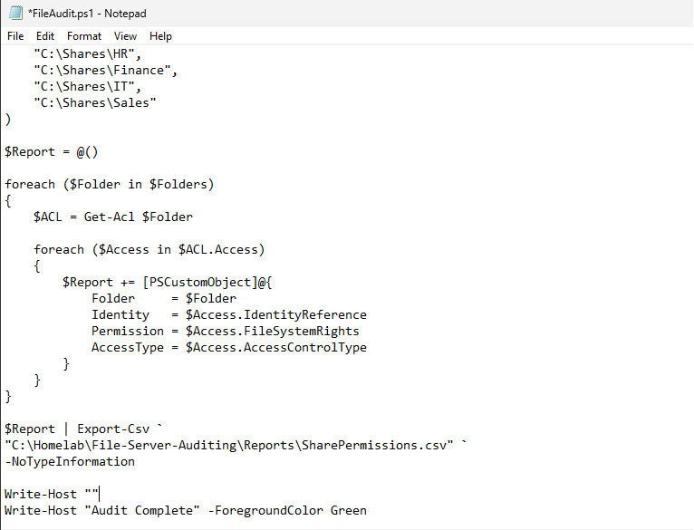
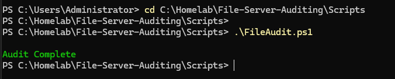
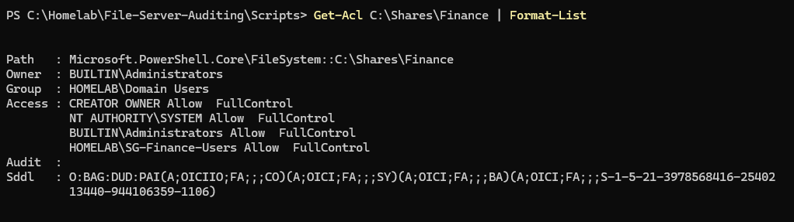
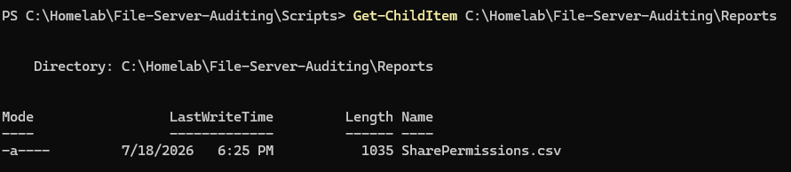
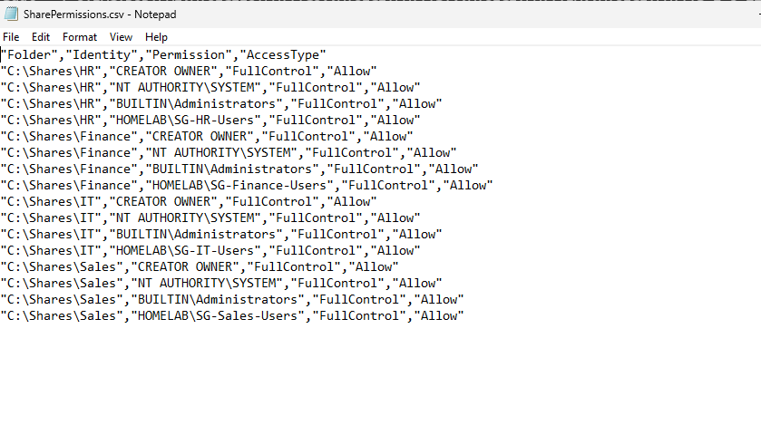
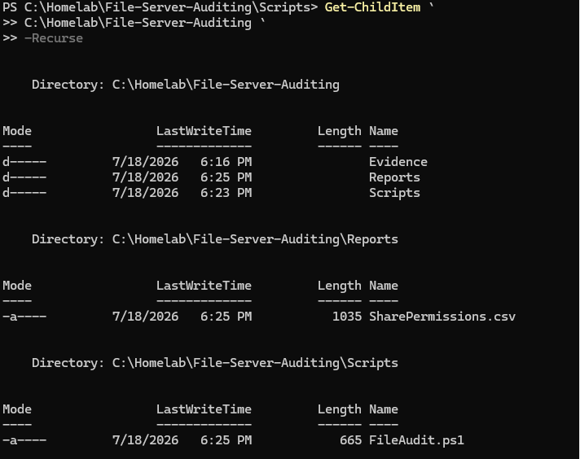

<div align="center">
  
</div>

---

# Overview

This module documents the development of a PowerShell-based file server auditing workflow for the `homelab.local` environment.

The objective was to review shared-folder permissions on SRV01 and export the results into a structured CSV report.

The audit focused on departmental shares such as:

- Human Resources
- Finance
- Other shared folders hosted on SRV01

The implementation included:

- Creating the audit project structure
- Developing the `FileAudit.ps1` script
- Querying SMB shares
- Reviewing share-level permissions
- Validating HR share access entries
- Validating Finance share access entries
- Exporting the results to CSV
- Reviewing the final permission report

The final script used in this module is:

```text
Scripts/FileAudit.ps1
```

The generated report is:

```text
Reports/SharePermissions.csv
```

This module demonstrates how PowerShell can make file-share permission reviews faster, more consistent, and easier to document.

---

# Why I Built This Module

After creating departmental file shares, I needed a way to review their permissions without opening the properties of every share manually.

As more shared folders are added, manual reviews can become slow and inconsistent.

An administrator may need to answer questions such as:

- Which shares exist on the server?
- Who has access to the HR share?
- Who has access to the Finance share?
- Which users or groups have Full Control?
- Are permissions assigned to groups or directly to users?
- Are old or unexpected access entries still present?
- Do the current permissions match the intended access model?

I wanted to understand how PowerShell could collect share-permission information and export it into a report that could be reviewed, filtered, and retained as evidence.

The most important lesson was that creating permissions is only the first step.

Permissions also need to be reviewed regularly.

```text
Configure Access
      ↓
Collect Current Permissions
      ↓
Review Exceptions
      ↓
Document Findings
      ↓
Correct Unnecessary Access
```

---

# Business Scenario

The organization stores departmental data on SRV01.

The HR and Finance shares contain sensitive information and should be accessible only to approved users and administrators.

Management requests a permissions review to confirm:

- The shared folders still exist
- Access is assigned to the correct security groups
- No unexpected user or group has excessive access
- Share permissions can be documented for audit purposes
- The review can be repeated when required

The Infrastructure Team develops a PowerShell script that reads the current share permissions and exports them into a CSV report.

The report can be used for:

- Access reviews
- Security investigations
- Internal audits
- Compliance evidence
- Troubleshooting
- Permission cleanup
- Change validation

---

# Learning Objectives

By completing this module, I practiced the following:

- Understanding file-server permission auditing
- Querying SMB shares with PowerShell
- Reviewing share-level access entries
- Identifying users and groups assigned to shares
- Reviewing access-control types
- Reviewing permission levels
- Creating reusable PowerShell reporting logic
- Exporting structured data to CSV
- Validating HR and Finance share permissions
- Understanding the difference between share and NTFS permissions
- Recognizing excessive or direct user permissions
- Protecting permission reports
- Documenting point-in-time access evidence

---

# Key Concepts Learned

## File Server Auditing

File server auditing is the process of reviewing file shares, permissions, access activity, and configuration.

It can include:

- Shared folder inventory
- Share permissions
- NTFS permissions
- File-access events
- Permission changes
- Deleted files
- Failed access attempts
- Group-based access
- Storage usage
- Stale shares

This module focuses on **share-permission auditing and reporting**.

It does not yet collect detailed Security event-log activity such as individual file opens or deletions.

---

## SMB Share

Server Message Block, or SMB, is the protocol used by Windows systems to access shared files and folders.

Examples:

```text
\\SRV01\HR
```

```text
\\SRV01\Finance
```

A share has a name, local path, description, and access-control list.

---

## Share Permissions

Share permissions control access when users connect through the network.

Common access rights include:

- Read
- Change
- Full Control

Share permissions apply only to network access.

They work together with NTFS permissions.

---

## NTFS Permissions

NTFS permissions apply to the files and folders stored on the disk.

Common NTFS permissions include:

- Full Control
- Modify
- Read and Execute
- List Folder Contents
- Read
- Write

NTFS permissions apply locally and over the network.

This module exports share-level permissions. A complete audit should also review NTFS permissions separately.

---

## Effective Access

When a user accesses a folder through the network, Windows evaluates:

```text
Share Permissions
+
NTFS Permissions
```

The effective result is normally the most restrictive combination.

Example:

```text
Share Permission: Full Control
NTFS Permission: Read
Effective Access: Read
```

A share-permission report therefore provides only one part of the total access picture.

---

## Access Control Type

A permission entry can normally be:

```text
Allow
```

or:

```text
Deny
```

Explicit Deny entries can override Allow permissions in many cases and should be used carefully.

---

## Group-Based Access

Permissions should normally be assigned to security groups rather than directly to individual users.

Example:

```text
John Smith
     ↓
HR Security Group
     ↓
HR Share Permission
```

This makes onboarding, offboarding, and access review easier.

---

## Least Privilege

Least privilege means users receive only the access required for their job.

Examples:

- HR users should not receive Finance access
- Finance users should not receive HR access
- Standard users should not receive Full Control
- Administrative access should be limited
- Old group memberships should be removed

---

## Point-in-Time Report

The generated CSV represents the permissions that existed when the script was executed.

It does not update automatically after permission changes.

A new report must be generated after:

- Group changes
- Share changes
- Access corrections
- New departments
- Security incidents
- Scheduled reviews

---

# Lab Environment Specifications

| Component | Configuration |
|------------|---------------|
| File Server | SRV01 |
| Server Operating System | Windows Server 2025 Standard Evaluation |
| Active Directory Domain | homelab.local |
| Automation Language | PowerShell |
| Audit Script | `FileAudit.ps1` |
| Report | `SharePermissions.csv` |
| Report Format | CSV |
| Primary Shares Reviewed | HR and Finance |
| Permission Type | SMB share permissions |
| Management Commands | `Get-SmbShare`, `Get-SmbShareAccess` |
| Audit Type | Point-in-time permission review |

---

# Folder Structure

```text
02-Core-Infrastructure
│
└── 06-File-Server-Auditing
    │
    ├── README.md
    │
    ├── Evidence
    │   └── Screenshots
    │       ├── 01-Project-Folder.png
    │       ├── 02-Create-Audit-Script.png
    │       ├── 03-Run-Audit-Script.png
    │       ├── 04-HR-Share-Permissions.png
    │       ├── 05-Finance-Share-Permissions.png
    │       ├── 06-Export-CSV-Report.png
    │       ├── 07-SharePermissions-CSV.png
    │       └── 08-Module-Complete.png
    │
    ├── Reports
    │   └── SharePermissions.csv
    │
    └── Scripts
        └── FileAudit.ps1
```

---

# Step-by-Step Implementation

---

## Step 1 — Create the File Auditing Project Structure

Created the module folders for:

- PowerShell script
- Generated report
- Screenshots
- Documentation

The folder structure keeps automation code separate from generated evidence.

<p align="center">
  
</p>

---

## Step 2 — Create the File Audit Script

Created:

```text
FileAudit.ps1
```

The script was designed to:

- Query shared folders on SRV01
- Retrieve share permissions
- Organize the results into PowerShell objects
- Export the data to CSV
- Provide a repeatable permissions review

Example starting commands:

```powershell
Get-SmbShare
```

```powershell
Get-SmbShareAccess
```

The script focused on non-administrative departmental shares rather than default system shares.

<p align="center">
  
</p>

---

## Step 3 — Run the Audit Script

Executed the PowerShell audit script.

Example:

```powershell
.\Scripts\FileAudit.ps1
```

The script queried the available SMB shares and collected permission entries for each selected share.

The results included information such as:

- Share name
- Account name
- Access-control type
- Access right
- Report timestamp

<p align="center">
  
</p>

---

## Step 4 — Review HR Share Permissions

Reviewed the current permissions assigned to the HR share.

Example query:

```powershell
Get-SmbShareAccess `
    -Name "HR"
```

The review checked:

- Which groups had access
- Whether access was Allow or Deny
- Which permission level was assigned
- Whether unexpected identities were present
- Whether group-based access was used

Because HR data may contain employee and personnel information, access should be limited to approved HR users and administrators.

<p align="center">
  
</p>

---

## Step 5 — Review Finance Share Permissions

Reviewed the current permissions assigned to the Finance share.

Example query:

```powershell
Get-SmbShareAccess `
    -Name "Finance"
```

Finance data may contain:

- Budget information
- Payment records
- Financial statements
- Payroll information
- Audit documents

The review confirmed which users or groups were allowed to access the share.

<p align="center">
  
</p>

---

## Step 6 — Export the Permission Results to CSV

Converted the collected permission data into a structured report.

Example:

```powershell
$Results |
Export-Csv `
    -Path ".\Reports\SharePermissions.csv" `
    -NoTypeInformation
```

CSV was selected because it can be opened and filtered using:

- Microsoft Excel
- PowerShell
- Reporting tools
- Audit platforms
- Compliance systems

<p align="center">
  
</p>

---

## Step 7 — Review the SharePermissions Report

Opened:

```text
Reports/SharePermissions.csv
```

The report documented the current share-level permissions.

Useful columns may include:

```text
ShareName
AccountName
AccessControlType
AccessRight
GeneratedAt
```

The report can help identify:

- Excessive permissions
- Direct user assignments
- Unexpected groups
- Deny entries
- Inconsistent access levels
- Shares requiring review

<p align="center">
  
</p>

---

## Step 8 — Verify the Completed Module

Reviewed the completed module and confirmed the presence of:

```text
Scripts/FileAudit.ps1
```

and:

```text
Reports/SharePermissions.csv
```

This completed the first version of the automated file-share permission review.

<p align="center">
  
</p>

---

# File Share Audit Workflow

```text
SRV01 File Shares
        │
        ▼
PowerShell Audit Script
        │
        ▼
Get-SmbShare
        │
        ▼
Get-SmbShareAccess
        │
        ▼
Create Structured Results
        │
        ▼
Export SharePermissions.csv
        │
        ▼
Administrator Review
        │
        ├── Approved Access
        ├── Excessive Access
        ├── Unexpected Group
        └── Remediation Required
```

---

# Permission Review Model

```text
User Account
      │
      ▼
Security Group Membership
      │
      ▼
Share Permission
      │
      ▼
NTFS Permission
      │
      ▼
Effective Access
```

The CSV report in this module reviews the **share-permission layer**.

A future version should combine share and NTFS information.

---

# Example Script Structure

The script may follow a structure similar to:

```powershell
$ReportDirectory = Join-Path `
    $PSScriptRoot `
    "..\Reports"

$ReportFile = Join-Path `
    $ReportDirectory `
    "SharePermissions.csv"

if (-not (Test-Path $ReportDirectory)) {
    New-Item `
        -Path $ReportDirectory `
        -ItemType Directory |
    Out-Null
}

$Results = foreach ($Share in Get-SmbShare) {

    if ($Share.Special -eq $false) {

        $Permissions = Get-SmbShareAccess `
            -Name $Share.Name

        foreach ($Permission in $Permissions) {

            [PSCustomObject]@{
                ShareName         = $Share.Name
                LocalPath         = $Share.Path
                AccountName       = $Permission.AccountName
                AccessControlType = $Permission.AccessControlType
                AccessRight       = $Permission.AccessRight
                GeneratedAt       = Get-Date
            }
        }
    }
}

$Results |
Sort-Object ShareName, AccountName |
Export-Csv `
    -Path $ReportFile `
    -NoTypeInformation
```

The repository script is the source of truth for the exact implementation.

---

# Validation Results

| Validation Check | Result |
|------------------|--------|
| Project folder created | ✅ |
| File audit script created | ✅ |
| Audit script executed | ✅ |
| SMB shares queried | ✅ |
| HR share permissions reviewed | ✅ |
| Finance share permissions reviewed | ✅ |
| Permission results organized | ✅ |
| CSV export completed | ✅ |
| `SharePermissions.csv` generated | ✅ |
| Final module files confirmed | ✅ |
| NTFS permission export | ⏭️ Future improvement |
| File-access event auditing | ⏭️ Future improvement |
| Permission-change monitoring | ⏭️ Future improvement |
| Scheduled access review | ⏭️ Future improvement |

---

# Troubleshooting Notes

## `Get-SmbShare` Returns No Department Shares

Possible causes include:

- Shares do not exist
- Script is running on the wrong server
- The account lacks permission
- The server name is incorrect
- SMB services are unavailable
- Only administrative shares exist

Check:

```powershell
Get-SmbShare |
Format-Table Name, Path, Description
```

---

## Share Name Is Not Found

Possible error:

```text
No MSFT_SmbShare objects found
```

Check the exact share name:

```powershell
Get-SmbShare |
Select-Object Name
```

Share names must match exactly.

---

## Access Denied When Running the Script

Run PowerShell using an account authorized to read SMB share information.

Do not immediately use Domain Administrator credentials if delegated access is sufficient.

---

## CSV Report Is Empty

Possible causes include:

- No share results were collected
- Script filter excluded all shares
- Export ran before data was created
- Report path was incorrect
- An error was hidden
- The wrong server was queried

Test the query directly:

```powershell
Get-SmbShare
```

Then:

```powershell
Get-SmbShareAccess -Name "HR"
```

---

## Report Is Not Created

Check:

- Reports folder exists
- Script has write permission
- File is not open in Excel
- `$PSScriptRoot` path is correct
- The script completed without errors

---

## Administrative Shares Appear in the Report

Default shares may include:

```text
ADMIN$
C$
IPC$
```

These are special administrative shares.

Filter them using the `Special` property:

```powershell
Get-SmbShare |
Where-Object Special -eq $false
```

---

## A User Appears Directly in the Permission List

Direct user permissions are not automatically wrong, but they are harder to manage than group-based permissions.

The administrator should determine:

- Why the user was added directly
- Whether approval exists
- Whether a security group should be used instead
- Whether the permission is temporary
- Whether the access is still required

---

## Share Report Looks Correct but User Still Cannot Access Files

The problem may be at the NTFS layer.

Check:

```powershell
Get-Acl "C:\Shares\HR"
```

Also check:

```cmd
whoami /groups
```

The user may have the correct share permission but insufficient NTFS permission.

---

## User Has More Access Than Expected

Possible causes include:

- Broad group membership
- Nested groups
- `Everyone` permission
- `Authenticated Users`
- Direct user assignment
- Full Control assigned too broadly
- NTFS inheritance
- Explicit Allow or Deny entries

Review both share and NTFS permissions.

---

# Security Notes

## Protect Permission Reports

The report may reveal:

- Share names
- Server paths
- Security groups
- Usernames
- Permission levels
- Administrative design
- Sensitive department names

Public evidence should use a test environment or sanitized values.

---

## Avoid Direct User Permissions

Permissions should normally be assigned to security groups.

This improves:

- Onboarding
- Offboarding
- Department transfers
- Troubleshooting
- Access reviews
- Auditability

---

## Review Full Control Assignments

Full Control allows broad management of the shared resource.

It should normally be limited to approved administrators or file-server management groups.

Department users may require only:

```text
Change
```

or:

```text
Read
```

depending on business requirements.

---

## Be Careful with Deny Entries

Explicit Deny entries may override Allow permissions.

Deny should be used only when necessary and after testing.

---

## Review Sensitive Shares More Frequently

Shares such as HR and Finance may contain confidential information.

They should have:

- Limited access
- Documented owners
- Regular review
- File-access auditing
- Backup coverage
- Retention controls
- Incident monitoring

---

## Reports Are Not Automatic Remediation

The script reports the current permissions.

It should not automatically remove access without:

- Approval
- Validation
- Change ticket
- Backup or rollback plan
- Confirmation of business impact

---

# File-System Event Auditing

This module reviews share permissions.

A more advanced file auditing implementation would also enable file-system activity logging.

That requires two parts:

```text
Advanced Audit Policy
+
Folder SACL
```

Enabling the audit policy alone is not enough.

The target folder must also contain auditing entries.

---

## DACL vs SACL

### DACL

A Discretionary Access Control List determines who is allowed or denied access.

```text
DACL
=
Permissions
```

### SACL

A System Access Control List determines which access attempts Windows records in the Security event log.

```text
SACL
=
Auditing
```

---

## Useful File Audit Event IDs

A future event-auditing module may review:

```text
4656 — A handle to an object was requested
4663 — An attempt was made to access an object
4658 — The handle to an object was closed
4660 — An object was deleted
4670 — Permissions on an object were changed
```

---

## Useful Audit Commands

Review the File System audit policy:

```cmd
auditpol /get /subcategory:"File System"
```

Review all audit settings:

```cmd
auditpol /get /category:*
```

Query file-access events:

```powershell
Get-WinEvent `
    -FilterHashtable @{
        LogName = "Security"
        Id      = 4663
    }
```

---

# Useful PowerShell Commands

## List SMB shares

```powershell
Get-SmbShare
```

---

## List non-special shares

```powershell
Get-SmbShare |
Where-Object Special -eq $false
```

---

## Review HR share permissions

```powershell
Get-SmbShareAccess `
    -Name "HR"
```

---

## Review Finance share permissions

```powershell
Get-SmbShareAccess `
    -Name "Finance"
```

---

## Review all departmental share permissions

```powershell
Get-SmbShare |
Where-Object Special -eq $false |
ForEach-Object {
    Get-SmbShareAccess `
        -Name $_.Name
}
```

---

## Review NTFS permissions

```powershell
Get-Acl "C:\Shares\HR" |
Format-List
```

---

## Export share permissions

```powershell
$Results |
Export-Csv `
    -Path ".\Reports\SharePermissions.csv" `
    -NoTypeInformation
```

---

## Review user group membership

```powershell
Get-ADPrincipalGroupMembership `
    -Identity "john.smith" |
Select-Object Name
```

---

## Display current security groups

```cmd
whoami /groups
```

---

# Skills Demonstrated

- Windows File Server Auditing
- SMB Share Administration
- Share Permission Review
- PowerShell Automation
- `Get-SmbShare`
- `Get-SmbShareAccess`
- CSV Reporting
- Access Control Review
- Least Privilege
- Group-Based Access
- HR and Finance Data Protection
- Permission Troubleshooting
- Administrative Reporting
- Windows Server 2025
- Technical Documentation

---

# Interview Notes

## What is file server auditing?

File server auditing is the process of reviewing shares, permissions, activity, and configuration to identify security or operational issues.

---

## What does this audit script collect?

It collects SMB share-level permission entries and exports them into a CSV report.

---

## What is the difference between share and NTFS permissions?

Share permissions apply only through network access.

NTFS permissions apply locally and over the network.

Both affect effective access.

---

## Why audit share permissions?

Auditing helps identify:

- Excessive access
- Unexpected users
- Direct assignments
- Full Control permissions
- Old groups
- Inconsistent access models

---

## Why assign access through security groups?

Group-based access is easier to manage, review, and update than direct user permissions.

---

## Does this report show every file a user opened?

No.

It reports configured share permissions.

File-access activity requires Advanced Audit Policy, folder SACLs, and Security event-log analysis.

---

## What is the difference between a DACL and a SACL?

A DACL controls access.

A SACL controls which access attempts are audited.

---

## Why might a user have share access but still receive Access Denied?

The user may not have sufficient NTFS permissions.

---

## Why are the reports point-in-time evidence?

The report shows the permissions present when the script was executed.

Later changes require a new report.

---

## How would you improve this audit?

I would add:

- NTFS permissions
- Group expansion
- Privileged access identification
- File access events
- Permission-change events
- Scheduled reports
- Historical comparison
- Compliance status

---

# What I Learned

The most important lesson from this module was that permission configuration should be reviewed after deployment.

The fact that a share works does not prove that its permissions are correct.

A secure result should confirm:

```text
Authorized users have access
```

and:

```text
Unauthorized users do not have access
```

The report also showed why share permissions are only one part of file access.

A user may appear to have access at the share layer but still be denied by NTFS permissions.

The complete access path is:

```text
User
  ↓
Security Group
  ↓
Share Permission
  ↓
NTFS Permission
  ↓
Effective Access
```

I also learned the difference between permission auditing and activity auditing.

```text
Permission Audit
=
Who is configured to have access?
```

```text
Activity Audit
=
Who actually accessed or changed a file?
```

This module focuses on the first question.

The workflow I want to remember is:

```text
Collect shares
      ↓
Collect permissions
      ↓
Export report
      ↓
Review high-risk entries
      ↓
Compare with approved access
      ↓
Remediate after approval
      ↓
Run the report again
```

---

# Future Improvements

To expand this module, I would add:

- NTFS permission reporting
- Effective-access analysis
- Nested-group expansion
- Direct-user permission detection
- Full Control exception report
- Shares with `Everyone` access
- Access-Based Enumeration review
- File access auditing
- File deletion auditing
- Permission-change auditing
- Advanced Audit Policy
- Folder SACL configuration
- Security event export
- Scheduled reporting
- Historical comparison
- HTML dashboard
- Email summary
- File hashes for report integrity
- Report timestamps
- Share-owner documentation
- CIS or NIST control mapping

A future report set could include:

```text
SharePermissions.csv
NTFSPermissions.csv
DirectUserPermissions.csv
FullControlExceptions.csv
FileAccessEvents.csv
PermissionChangeEvents.csv
```

---

# Key Takeaways

This module created a repeatable file-share permission audit using PowerShell.

The final workflow included:

- Querying departmental SMB shares
- Reviewing HR share permissions
- Reviewing Finance share permissions
- Exporting permission entries
- Generating `SharePermissions.csv`
- Reviewing the final audit output

The main lessons were:

```text
File permissions must be reviewed regularly.
```

```text
Share and NTFS permissions are separate layers.
```

```text
Assign access to groups instead of individual users.
```

```text
Treat HR and Finance shares as sensitive resources.
```

```text
Reports are point-in-time evidence.
```

```text
Permission auditing is different from file-activity auditing.
```

The file server now has a basic permission-review process that can later be expanded into Security event-log auditing and compliance monitoring.

---

<div align="center">

### Module Status

✅ Completed Successfully

**Script:** [`FileAudit.ps1`](Scripts/FileAudit.ps1)

**Report:** [`SharePermissions.csv`](Reports/SharePermissions.csv)

**Next Module:** [Backup and Disaster Recovery](../07-Backup-and-Disaster-Recovery/)

</div>