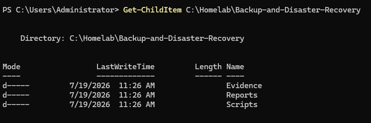
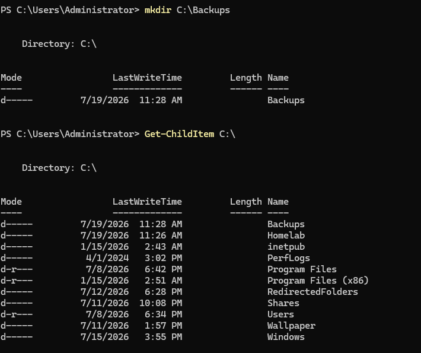
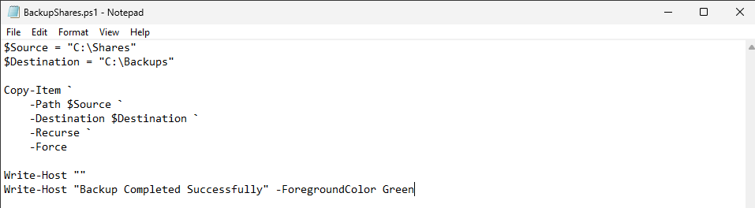
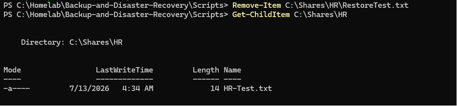
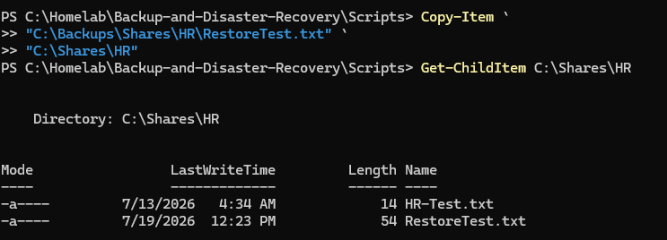
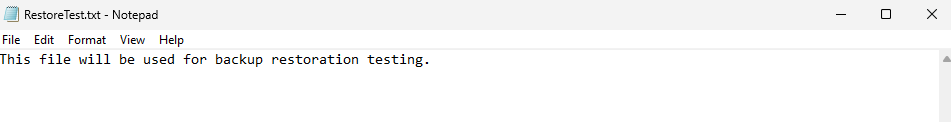

<div align="center">
  
</div>

---

# Overview

This module documents the implementation of a basic backup and file-recovery workflow for the `homelab.local` environment.

The objective was to protect departmental file shares stored on SRV01 and prove that deleted data could be recovered successfully.

The implementation included:

- Creating a dedicated backup project structure
- Creating a separate backup destination
- Developing a PowerShell backup script
- Copying departmental shares into the backup repository
- Creating a test file
- Updating the backup
- Simulating accidental data loss
- Restoring the deleted file
- Validating the recovered contents

The final script used in this module is:

```text
Scripts/BackupShares.ps1
```

This exercise reinforced an important operational principle:

```text
A backup is not proven until a restore has been completed successfully.
```

---

# Why I Built This Module

The file server contains departmental information used by HR, Finance, IT, Sales, and Management.

If a file is deleted, corrupted, encrypted, or lost during a system failure, the organization needs a recovery method.

Before building this module, I understood that backups were important, but I wanted to practice the complete recovery lifecycle rather than only copying files.

A backup process should answer several questions:

- What data is being protected?
- Where is the backup stored?
- When was the backup created?
- Can the backup be read?
- Can an individual file be restored?
- Does the restored file match the original?
- How much data could be lost between backups?

The workflow I practiced was:

```text
Protect
   ↓
Simulate Failure
   ↓
Restore
   ↓
Validate
```

---

# Business Scenario

The organization stores critical departmental information on SRV01.

Examples include:

- HR employee records
- Finance documents
- IT procedures
- Sales files
- Management reports

Management requires the Infrastructure Team to create a basic data-protection process.

The solution must:

- Copy departmental shares to a separate backup location
- Allow repeated backup execution
- Preserve directory structure
- Support individual file recovery
- Demonstrate recovery after accidental deletion
- Document the result

The backup location in this lab is stored on the same server for learning purposes.

In a production environment, backups should also be stored on separate infrastructure or offsite storage.

---

# Learning Objectives

By completing this module, I practiced the following:

- Understanding backup fundamentals
- Understanding disaster recovery
- Creating a backup repository
- Writing a PowerShell backup script
- Copying folders recursively
- Preserving departmental folder structure
- Running repeatable backup jobs
- Simulating accidental deletion
- Restoring an individual file
- Validating recovered content
- Understanding Recovery Point Objective
- Understanding Recovery Time Objective
- Recognizing the limitations of same-server backups
- Documenting recovery evidence

---

# Key Concepts Learned

## Backup

A backup is a separate copy of data that can be used when production data is unavailable or damaged.

Backups may protect against:

- Accidental deletion
- File corruption
- Hardware failure
- Ransomware
- Operating-system failure
- Administrative mistakes
- Application failure
- Disaster events

---

## Disaster Recovery

Disaster Recovery is the process of restoring systems, services, and data after an incident.

Examples include:

- File-server failure
- Ransomware
- Storage corruption
- Virtual-machine loss
- Natural disaster
- Extended power outage

This lab demonstrates file-level recovery rather than full server recovery.

---

## Business Continuity

Business Continuity focuses on keeping essential organizational operations available during and after an incident.

Backup supports business continuity by helping restore the information employees need to continue working.

---

## Recovery Point Objective

Recovery Point Objective, or RPO, describes the maximum acceptable amount of data loss measured in time.

Example:

```text
Backups run once every 24 hours
```

The organization may lose up to:

```text
24 hours of new or changed data
```

A lower RPO requires more frequent backups or replication.

---

## Recovery Time Objective

Recovery Time Objective, or RTO, describes how quickly a service or file should be restored after an outage.

Example:

```text
HR files must be restored within two hours
```

RTO influences:

- Backup technology
- Staffing
- Automation
- Storage design
- Recovery procedures

---

## Full Backup

A full backup copies all selected data.

Advantages:

- Simple restoration
- Complete data set
- Easy to understand

Disadvantages:

- More storage
- Longer backup time
- Repeated copying of unchanged files

The PowerShell workflow in this lab behaves like a basic full-copy process.

---

## Incremental Backup

An incremental backup copies data changed since the previous backup.

Advantages:

- Faster backup
- Lower storage usage

Disadvantages:

- Restoration may require several backup sets
- More complex management

---

## Backup Verification

A successful script message does not prove the backup is usable.

Verification should include:

- Destination exists
- Files are present
- File sizes appear correct
- Folder structure is preserved
- Files can be opened
- Restoration works
- Content matches the source

---

## The 3-2-1 Backup Principle

A stronger backup strategy follows the 3-2-1 principle:

```text
3 copies of data
2 different storage types
1 copy stored offsite
```

This lab uses a local backup destination, so it does not yet satisfy the complete 3-2-1 model.

---

# Lab Environment Specifications

| Component | Configuration |
|------------|---------------|
| Server | SRV01 |
| Server Operating System | Windows Server 2025 Standard Evaluation |
| Domain | homelab.local |
| Source Data | `C:\Shares` |
| Backup Destination | `C:\Backups` |
| Automation Language | PowerShell |
| Backup Script | `BackupShares.ps1` |
| Recovery Type | File-level recovery |
| Validation Method | Restore and open test file |
| Environment Type | VMware homelab |

---

# Folder Structure

```text
02-Core-Infrastructure
│
└── 07-Backup-and-Disaster-Recovery
    │
    ├── README.md
    │
    ├── Evidence
    │   └── Screenshots
    │       ├── 01-Project-Folder.png
    │       ├── 02-Create-Backup-Location.png
    │       ├── 03-Create-Backup-Script.png
    │       ├── 04-Run-Backup-Script.png
    │       ├── 05-Restore-Test-File.png
    │       ├── 06-Backup-Updated.png
    │       ├── 07-Simulate-Data-Loss.png
    │       ├── 08-Restore-File.png
    │       └── 09-Restore-Validation.png
    │
    └── Scripts
        └── BackupShares.ps1
```

---

# Step-by-Step Implementation

---

## Step 1 — Create the Backup Project Structure

Created the module structure for:

- Documentation
- PowerShell automation
- Screenshots
- Recovery evidence

This separates the script from the operational evidence.

<p align="center">
  
</p>

---

## Step 2 — Create the Backup Location

Created a dedicated backup destination:

```text
C:\Backups
```

The production departmental data remained in:

```text
C:\Shares
```

Separating the paths helps prevent the backup from being mixed with active departmental data.

<p align="center">
  
</p>

---

## Step 3 — Create the PowerShell Backup Script

Created:

```text
BackupShares.ps1
```

The script copied the departmental share structure into the backup destination.

A basic implementation may use:

```powershell
$Source = "C:\Shares"
$Destination = "C:\Backups"

if (-not (Test-Path $Source)) {
    throw "Backup source does not exist: $Source"
}

if (-not (Test-Path $Destination)) {
    New-Item `
        -Path $Destination `
        -ItemType Directory `
        -Force |
    Out-Null
}

Copy-Item `
    -Path $Source `
    -Destination $Destination `
    -Recurse `
    -Force

Write-Host "Backup completed successfully."
```

The repository script is the source of truth for the exact implementation.

<p align="center">
  
</p>

---

## Step 4 — Run the Backup Script

Executed the script from PowerShell.

Example:

```powershell
.\Scripts\BackupShares.ps1
```

The script copied the departmental folders and files into the backup location.

The result was reviewed to confirm that the backup completed without an error.

<p align="center">
  
</p>

---

## Step 5 — Create the Restore Test File

Created a test file inside one of the production departmental shares.

The purpose was to simulate a real business file that would later be deleted and recovered.

Example:

```text
C:\Shares\HR\RestoreTest.txt
```

The file contained recognizable text so the restored content could be verified.

<p align="center">
  
</p>

---

## Step 6 — Update the Backup

Ran the backup script again after creating the test file.

This ensured that the new file was copied into the backup repository before the simulated loss.

The backup copy was verified before deleting the production file.

<p align="center">
  
</p>

---

## Step 7 — Simulate Data Loss

Deleted the test file from the production HR share.

This simulated a common support incident:

```text
A user accidentally deleted an important file.
```

The production path no longer contained the file, while the backup copy remained available.

<p align="center">
  
</p>

---

## Step 8 — Restore the Deleted File

Copied the file from the backup repository back into the production HR folder.

Example:

```powershell
Copy-Item `
    -Path "C:\Backups\Shares\HR\RestoreTest.txt" `
    -Destination "C:\Shares\HR" `
    -Force
```

The exact backup path depends on how `BackupShares.ps1` created the destination structure.

<p align="center">
  
</p>

---

## Step 9 — Validate the Recovery

Opened the restored file and confirmed that its content matched the original test file.

This validated that:

- The backup contained the file
- The backup remained readable
- The restore path was correct
- The restored file opened successfully
- The recovery objective was achieved

<p align="center">
  
</p>

---

# Backup Workflow

```text
C:\Shares
    │
    ▼
BackupShares.ps1
    │
    ▼
C:\Backups
    │
    ▼
Production File Deleted
    │
    ▼
Copy File from Backup
    │
    ▼
Production File Restored
    │
    ▼
Content Validated
```

---

# Incident Recovery Workflow

```text
User Reports Missing File
          │
          ▼
Verify Original Path
          │
          ▼
Identify File Name and Last Known State
          │
          ▼
Locate Backup Copy
          │
          ▼
Restore to Approved Destination
          │
          ▼
Confirm Permissions
          │
          ▼
Open and Validate File
          │
          ▼
Document Recovery
```

---

# Validation Results

| Validation Check | Result |
|------------------|--------|
| Backup project structure created | ✅ |
| Backup destination created | ✅ |
| Backup script created | ✅ |
| Backup script executed | ✅ |
| Departmental folders copied | ✅ |
| Restore test file created | ✅ |
| Backup updated with test file | ✅ |
| Data loss simulated | ✅ |
| File restored from backup | ✅ |
| Restored content validated | ✅ |
| Restore process documented | ✅ |
| Scheduled backup job | ⏭️ Future improvement |
| Offsite backup copy | ⏭️ Future improvement |
| Full server recovery | ⏭️ Future improvement |
| Backup encryption | ⏭️ Future improvement |

---

# Troubleshooting Guide

## Backup Source Does Not Exist

Check:

```powershell
Test-Path "C:\Shares"
```

If the result is:

```text
False
```

verify:

- Correct path
- Drive availability
- Share location
- Typographical errors
- Permissions

---

## Backup Destination Does Not Exist

Create it:

```powershell
New-Item `
    -Path "C:\Backups" `
    -ItemType Directory `
    -Force
```

A well-designed script should create the destination automatically when appropriate.

---

## Access Denied During Backup

Possible causes include:

- PowerShell not running with sufficient permission
- Restricted NTFS permissions
- File locked by another process
- Antivirus or security software
- Destination permission problem

Check the source and destination ACLs:

```powershell
Get-Acl "C:\Shares"
```

```powershell
Get-Acl "C:\Backups"
```

---

## Files Are Missing from the Backup

Check:

- Source path
- Recursive copy option
- Excluded files
- Hidden files
- Errors during execution
- Destination structure
- Script output

Test:

```powershell
Get-ChildItem `
    -Path "C:\Backups" `
    -Recurse
```

---

## Backup Script Reports Success but Restore Fails

This may indicate that the backup was not verified.

Check:

- File exists in backup
- File size
- File path
- File permissions
- File integrity
- Destination path
- Whether the backup file opens

---

## Restored File Has Incorrect Permissions

A simple file copy may inherit permissions from the destination folder.

Review:

```powershell
Get-Acl "C:\Shares\HR\RestoreTest.txt"
```

The restored file should receive the intended production permissions.

---

## Destination Contains Old Files

`Copy-Item` copies files but does not automatically remove old files from the backup.

A future design may use:

```cmd
robocopy
```

with carefully selected options.

Avoid mirror or purge operations until they are fully understood, because they may delete backup data.

---

## Backup Is Stored on the Same Server

A backup stored only on SRV01 may be lost if SRV01 experiences:

- Disk failure
- Ransomware
- Virtual-machine loss
- File-system corruption
- Administrative deletion

This local copy is suitable for learning and basic file recovery, but not sufficient as the only production backup.

---

# Security Notes

## Protect Backup Data

Backups may contain the same sensitive information as production.

Examples include:

- HR records
- Financial files
- Internal procedures
- Employee information
- Management reports

Backup permissions should be at least as restrictive as production permissions.

---

## Do Not Commit Backup Data to GitHub

The repository should contain:

- Scripts
- Documentation
- Sanitized screenshots
- Example files

It should not contain:

- Real employee data
- Confidential documents
- Backup archives
- Passwords
- Recovery keys
- Production databases

---

## Use Separate Credentials Where Appropriate

In a production environment, the backup service may use a dedicated account with only the permissions required to read source data and write backup data.

---

## Protect Backups from Ransomware

A stronger backup design may include:

- Offline storage
- Immutable storage
- Separate credentials
- Restricted delete permissions
- Network isolation
- Versioning
- Offsite copies

---

## Test Restores Regularly

A backup that has never been restored is unproven.

Organizations should perform scheduled recovery tests and document the results.

---

# Useful PowerShell Commands

## Verify the source path

```powershell
Test-Path "C:\Shares"
```

---

## Verify the backup path

```powershell
Test-Path "C:\Backups"
```

---

## List source files

```powershell
Get-ChildItem `
    -Path "C:\Shares" `
    -Recurse
```

---

## List backup files

```powershell
Get-ChildItem `
    -Path "C:\Backups" `
    -Recurse
```

---

## Copy departmental shares

```powershell
Copy-Item `
    -Path "C:\Shares" `
    -Destination "C:\Backups" `
    -Recurse `
    -Force
```

---

## Restore a file

```powershell
Copy-Item `
    -Path "C:\Backups\Shares\HR\RestoreTest.txt" `
    -Destination "C:\Shares\HR" `
    -Force
```

---

## Compare file hashes

```powershell
Get-FileHash "C:\Backups\Shares\HR\RestoreTest.txt"
```

```powershell
Get-FileHash "C:\Shares\HR\RestoreTest.txt"
```

Matching hashes provide stronger evidence that the restored file matches the backup copy.

---

## Use Robocopy for a future version

```cmd
robocopy C:\Shares C:\Backups\Shares /E /COPY:DAT /R:2 /W:2 /LOG:C:\Backups\Backup.log
```

The options should be reviewed before production use.

---

# Skills Demonstrated

- Backup Operations
- Disaster Recovery
- Business Continuity
- PowerShell Automation
- File-Level Recovery
- Recovery Validation
- Windows Server 2025
- Department Share Protection
- Incident Recovery
- Data Integrity
- Troubleshooting
- Infrastructure Documentation
- RPO and RTO Awareness
- Backup Security Awareness

---

# Interview Notes

## What is the difference between backup and disaster recovery?

A backup is a protected copy of data.

Disaster recovery is the broader process of restoring systems, data, and business services after an incident.

---

## What is RPO?

RPO is the maximum acceptable amount of data loss measured in time.

---

## What is RTO?

RTO is the target time for restoring a service or resource after an incident.

---

## Why is restore testing important?

A backup may exist but still be incomplete, corrupted, inaccessible, or incorrectly configured.

Restore testing proves that recovery is possible.

---

## What is the 3-2-1 backup principle?

Maintain three copies of data, on two different storage types, with one copy stored offsite.

---

## Is a backup on the same server sufficient?

No.

It may help with accidental file deletion, but it does not protect against server loss, disk failure, or ransomware affecting the same system.

---

## How would you verify a restored file?

I would verify:

- Correct file name
- Correct destination
- File opens
- Contents are correct
- Permissions are correct
- File hash matches when available

---

## Why should backup permissions be protected?

Backups contain the same sensitive information as production and may provide an attacker with another path to the data.

---

# What I Learned

The most important lesson from this module was that successful backup execution is not the final result.

The real test is whether data can be restored.

The complete workflow is:

```text
Create backup
      ↓
Verify backup
      ↓
Simulate loss
      ↓
Restore data
      ↓
Validate content
```

I also learned that this homelab implementation has an important limitation:

```text
Production data and backup data are stored on the same server.
```

That is useful for practicing file restoration, but a production design requires separate and preferably offsite storage.

The troubleshooting process I want to remember is:

```text
Check source
      ↓
Check destination
      ↓
Review script errors
      ↓
Verify backup file
      ↓
Restore to approved location
      ↓
Check permissions
      ↓
Validate content
```

---

# Future Improvements

To expand this module, I would add:

- Windows Server Backup
- Scheduled Task automation
- Robocopy logging
- Backup versioning
- Incremental backups
- Separate backup disk
- Network backup repository
- Offsite storage
- Encrypted backups
- Immutable storage
- System State backup
- Bare-metal recovery
- Virtual-machine backup
- Recovery runbook
- Automated hash validation
- Backup success and failure alerts
- Retention policies
- Ransomware recovery testing
- Formal RPO and RTO documentation

---

# Key Takeaways

This module implemented and validated a basic backup and recovery workflow.

The process included:

- Creating a backup repository
- Developing a PowerShell backup script
- Copying departmental shares
- Creating a recovery test file
- Updating the backup
- Simulating accidental deletion
- Restoring the file
- Validating the recovered content

The main lessons were:

```text
A backup is not proven until it has been restored.
```

```text
Recovery should be tested and documented.
```

```text
Backup data must be protected like production data.
```

```text
Same-server backups are not sufficient for complete disaster recovery.
```

```text
A production strategy should include separate and offsite copies.
```

---

<div align="center">

### Module Status

✅ Completed Successfully

**Script:** [`BackupShares.ps1`](Scripts/BackupShares.ps1)

**Next Category:** [Enterprise Operations](../../03-Enterprise-Operations/)

**Next Module:** [Security Monitoring with Honey Accounts](../../03-Enterprise-Operations/01-Security-Monitoring-Honey-Accounts/)

</div>