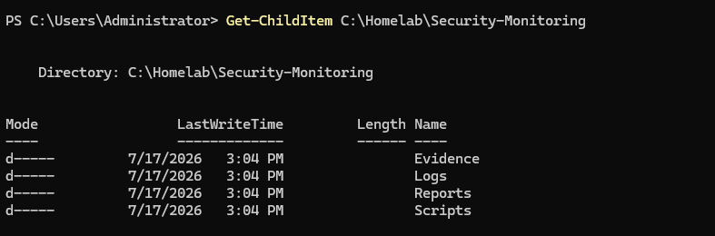
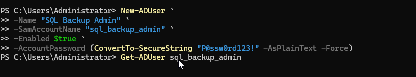
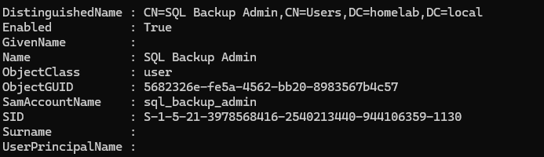
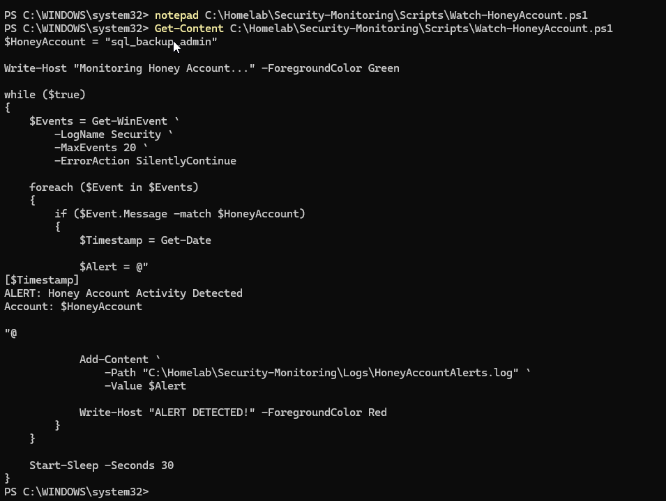
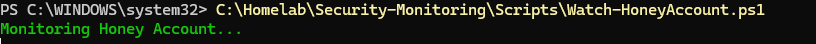
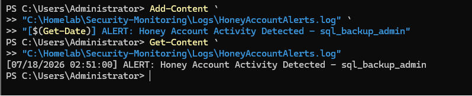
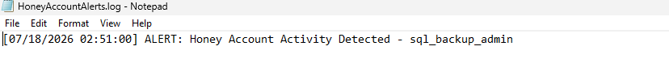
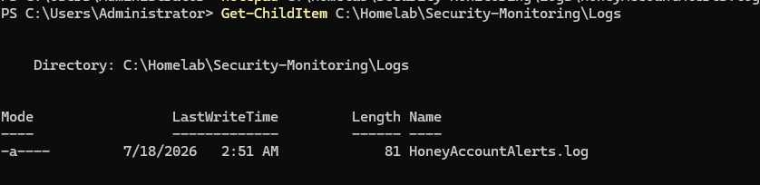
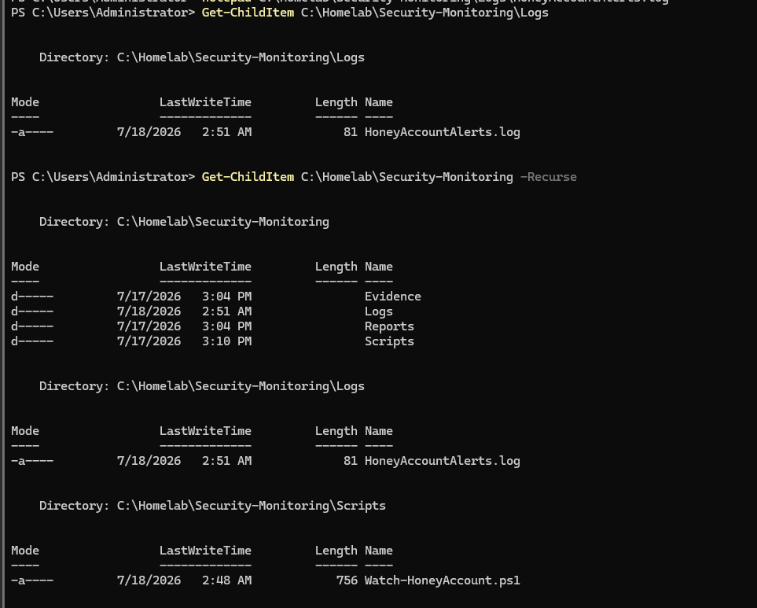

<div align="center">
  
</div>

---

# Overview

This module documents the creation of a basic security-monitoring workflow using an Active Directory honey account.

A honey account is a decoy identity that should never be used during normal business operations.

Because legitimate users and services have no reason to authenticate with the account, activity involving it can be treated as suspicious and investigated.

The implementation included:

- Creating the security-monitoring project structure
- Creating a dedicated honey account
- Verifying the account in Active Directory
- Developing a PowerShell monitoring script
- Monitoring Windows Security events
- Detecting activity associated with the honey account
- Generating a security alert
- Writing the alert to a log file
- Confirming the completed monitoring workflow

The final monitoring script is:

```text
Scripts/Watch-HoneyAccount.ps1
```

The generated alert log is:

```text
Logs/HoneyAccountAlerts.log
```

---

# Why I Built This Module

Traditional security controls attempt to prevent unauthorized activity.

Prevention is important, but organizations also need methods to detect suspicious behavior when preventive controls are bypassed.

A honey account provides a simple detection opportunity.

The account should have:

- No normal business purpose
- No approved interactive use
- No application dependency
- No privileged access
- No scheduled task
- No legitimate service authentication

If the account appears in a logon event, an administrator should ask:

```text
Why was this account used?
```

I wanted to understand how Windows Security events and PowerShell could be combined to watch for activity involving a decoy identity.

The most important lesson was:

```text
A honey account is valuable because legitimate activity should be zero.
```

---

# Business Scenario

The organization is concerned about stolen credentials and unauthorized Active Directory activity.

The Infrastructure Team wants a low-cost detection control that can identify suspicious authentication attempts.

A decoy user account is created with no legitimate business purpose.

The account is not assigned to employees, applications, services, scheduled tasks, or administrative workflows.

A PowerShell monitoring script reviews Windows Security events and creates an alert when activity associated with the decoy identity is detected.

The alert must record enough information for an administrator to begin an investigation.

---

# Detection Objective

The objective of this module is:

```text
Detect authentication activity involving an account that should never be used.
```

The monitoring workflow should identify:

- Honey account name
- Security event ID
- Date and time
- Source information available in the event
- Success or failure result
- Alert message
- Evidence location

The module demonstrates detection and reporting.

It does not replace a full SIEM, identity-protection platform, or incident-response process.

---

# Learning Objectives

By completing this module, I practiced the following:

- Understanding honey accounts
- Understanding decoy identities
- Creating a non-operational Active Directory account
- Verifying account properties
- Reviewing Windows Security events
- Understanding successful and failed logon events
- Developing a PowerShell event-monitoring script
- Filtering events for a specific username
- Generating a security alert
- Writing events to a log file
- Distinguishing detection from prevention
- Understanding false positives
- Creating a basic triage process
- Protecting monitoring evidence
- Documenting an operational security control

---

# Key Concepts Learned

## Honey Account

A honey account is a decoy identity designed to attract or reveal unauthorized activity.

It should not be used for:

- Employee sign-in
- Service authentication
- Scheduled tasks
- Applications
- Email
- Automation
- Normal administration

Any activity involving the account should be investigated.

---

## Detection vs Prevention

Prevention attempts to stop an action.

Examples:

- Strong passwords
- MFA
- Account lockout
- Firewall rules
- Least privilege

Detection identifies activity that occurred or was attempted.

Examples:

- Security event monitoring
- Honey account alerts
- Failed logon alerts
- Suspicious process detection
- SIEM correlation

A mature security program uses both.

---

## Decoy Identity

A decoy identity should look believable enough to attract unauthorized use but should not contain real data or privileges.

It should not:

- Be a Domain Administrator
- Own production resources
- Contain real employee information
- Have application dependencies
- Be shared with technicians
- Be used during demonstrations after monitoring begins

---

## Successful Logon Event

Windows Security Event ID:

```text
4624
```

indicates that a logon succeeded.

A successful honey-account logon is a high-priority event because the account should never be used.

---

## Failed Logon Event

Windows Security Event ID:

```text
4625
```

indicates that a logon failed.

A failed attempt against the honey account may indicate:

- Password spraying
- Credential guessing
- Stolen username use
- Automated scanning
- Misconfiguration
- Testing activity

---

## Explicit Credential Logon

Windows Security Event ID:

```text
4648
```

indicates that a process attempted to use explicitly supplied credentials.

This may be relevant when an account is used with:

- `runas`
- Remote administration
- Scheduled tasks
- Scripts
- Network authentication

---

## Account Lockout

Windows Security Event ID:

```text
4740
```

indicates that an account was locked out.

A locked honey account may indicate repeated failed authentication attempts.

---

## Event Log Monitoring

Windows stores authentication events in:

```text
Event Viewer
→ Windows Logs
→ Security
```

The monitoring script queries relevant event IDs and searches for the honey-account username.

---

## Alert Log

The monitoring script writes detected events into:

```text
Logs/HoneyAccountAlerts.log
```

The log provides a simple record of suspicious activity.

A production solution should forward alerts to a centralized monitoring platform.

---

## False Positive

A false positive occurs when an alert is generated by authorized or expected activity.

Possible honey-account false positives include:

- Administrator testing
- Script testing
- Account-validation scans
- Security-tool enumeration
- Incorrect service configuration
- Accidental manual use

Every test involving the honey account should be documented to distinguish it from real suspicious activity.

---

# Lab Environment Specifications

| Component | Configuration |
|------------|---------------|
| Domain Controller | SRV01 |
| Server Operating System | Windows Server 2025 Standard Evaluation |
| Active Directory Domain | homelab.local |
| Detection Object | Active Directory honey account |
| Automation Language | PowerShell |
| Monitoring Script | `Watch-HoneyAccount.ps1` |
| Evidence Source | Windows Security event log |
| Alert Log | `HoneyAccountAlerts.log` |
| Detection Type | Username-based event detection |
| Monitoring Scope | Selected authentication events |
| Environment | VMware homelab |

---

# Folder Structure

```text
03-Enterprise-Operations
│
└── 01-Security-Monitoring-Honey-Accounts
    │
    ├── README.md
    │
    ├── Evidence
    │   └── Screenshots
    │       ├── 01-Security-Monitoring-Project-Folder.png
    │       ├── 02-Honey-Account-Created.png
    │       ├── 03-Verify-Honey-Account.png
    │       ├── 04-Monitoring-Script-Created.png
    │       ├── 05-Monitoring-Script-Running.png
    │       ├── 06-Security-Event-Detected.png
    │       ├── 07-HoneyAccount-Alert-Generated.png
    │       ├── 08-HoneyAccount-Log-File.png
    │       └── 09-Security-Monitoring-Complete.png
    │
    ├── Logs
    │   └── HoneyAccountAlerts.log
    │
    └── Scripts
        └── Watch-HoneyAccount.ps1
```

---

# Step-by-Step Implementation

---

## Step 1 — Create the Security Monitoring Project Structure

Created folders for:

- PowerShell monitoring script
- Alert logs
- Screenshots
- Documentation

The structure separates monitoring logic from generated evidence.

<p align="center">
  
</p>

---

## Step 2 — Create the Honey Account

Created a dedicated Active Directory user account to act as the decoy identity.

The account was designed to have no legitimate operational use.

The account should not be assigned:

- Department access
- Administrative groups
- File permissions
- Applications
- Service dependencies
- Scheduled tasks

A production honey account should use a documented naming and placement strategy.

<p align="center">
  
</p>

---

## Step 3 — Verify the Honey Account

Verified the account in Active Directory.

Example PowerShell command:

```powershell
Get-ADUser `
    -Identity "<HoneyAccountUsername>" `
    -Properties `
        Enabled,
        Description,
        MemberOf,
        DistinguishedName
```

The review should confirm:

- Account exists
- Intended enabled or disabled state
- No privileged membership
- No legitimate resource assignment
- Correct OU placement
- Clear administrative description

Replace `<HoneyAccountUsername>` with the actual test account used in the lab.

<p align="center">
  
</p>

---

## Step 4 — Create the Monitoring Script

Created:

```text
Watch-HoneyAccount.ps1
```

The script was designed to:

- Query the Security event log
- Review selected authentication events
- Search event data for the honey-account username
- Generate an alert message
- Write the alert to a log file
- Continue monitoring

A simplified example structure is:

```powershell
$HoneyAccount = "<HoneyAccountUsername>"

$LogDirectory = Join-Path `
    $PSScriptRoot `
    "..\Logs"

$LogFile = Join-Path `
    $LogDirectory `
    "HoneyAccountAlerts.log"

if (-not (Test-Path $LogDirectory)) {
    New-Item `
        -Path $LogDirectory `
        -ItemType Directory |
    Out-Null
}

$EventIds = 4624, 4625, 4648, 4740
```

The repository script is the source of truth for the exact implementation.

<p align="center">
  
</p>

---

## Step 5 — Run the Monitoring Script

Started the PowerShell monitoring script.

Example:

```powershell
.\Scripts\Watch-HoneyAccount.ps1
```

The script monitored selected Windows Security events and checked for activity involving the decoy identity.

Depending on the implementation, the script may:

- Poll the event log on an interval
- Track the latest event record
- Query recent events
- Continue until manually stopped

<p align="center">
  
</p>

---

## Step 6 — Detect a Security Event

Generated or simulated controlled test activity involving the honey account.

The monitoring workflow detected a matching Security event.

The event should be reviewed for:

- Event ID
- Time created
- Target username
- Logon type
- Source workstation
- Source address
- Failure reason
- Authentication package
- Process information

Not every field is available in every event.

<p align="center">
  
</p>

---

## Step 7 — Generate the Honey Account Alert

The script generated an alert after identifying activity involving the decoy identity.

A useful alert should include:

```text
Timestamp
Honey account name
Event ID
Detection result
Source details
Alert severity
Recommended action
```

Example:

```text
ALERT: Authentication activity detected for honey account.
Investigation required.
```

<p align="center">
  
</p>

---

## Step 8 — Review the Alert Log

Opened:

```text
Logs/HoneyAccountAlerts.log
```

The log contained the detected security alert.

A basic log entry may include:

```text
2026-07-24 11:45:00
Event ID: 4625
Honey Account: [REDACTED]
Status: Suspicious authentication activity detected
```

The actual account name may be retained in the lab log but should be reviewed before public publication.

<p align="center">
  
</p>

---

## Step 9 — Verify the Completed Monitoring Workflow

Reviewed the completed project and confirmed the presence of:

```text
Scripts/Watch-HoneyAccount.ps1
```

and:

```text
Logs/HoneyAccountAlerts.log
```

The final workflow demonstrated:

```text
Decoy Identity
      ↓
Security Event
      ↓
PowerShell Detection
      ↓
Alert Generated
      ↓
Log Evidence Created
```

<p align="center">
  
</p>

---

# Detection Workflow

```text
Honey Account Created
          │
          ▼
No Legitimate Use Expected
          │
          ▼
Authentication Event Occurs
          │
          ▼
Windows Records Security Event
          │
          ▼
PowerShell Script Queries Event Log
          │
          ▼
Username Match Found
          │
          ▼
Alert Generated
          │
          ▼
HoneyAccountAlerts.log Updated
          │
          ▼
Administrator Investigates
```

---

# Alert Triage Workflow

```text
Alert Received
      │
      ▼
Confirm Honey Account Identity
      │
      ▼
Review Event ID and Timestamp
      │
      ▼
Identify Source Computer or Address
      │
      ▼
Determine Whether Activity Was Authorized Testing
      │
      ├── Authorized Test
      │      ↓
      │  Document and Close
      │
      └── Unexplained Activity
             ↓
       Escalate Investigation
             ↓
       Preserve Event Evidence
             ↓
       Review Related Accounts and Hosts
```

---

# Relevant Security Event IDs

| Event ID | Description | Why It Matters |
|----------|-------------|----------------|
| 4624 | Successful logon | Honey account was used successfully |
| 4625 | Failed logon | Someone attempted to authenticate |
| 4648 | Explicit credentials used | Credentials were supplied to a process |
| 4740 | Account locked out | Repeated failures may have occurred |
| 4723 | Password-change attempt | Someone attempted to change the password |
| 4724 | Password reset attempt | An administrator or actor attempted a reset |

The script should monitor only the event IDs required by the detection design.

---

# Example Monitoring Logic

A simplified implementation may look like:

```powershell
$HoneyAccount = "<HoneyAccountUsername>"

$LogDirectory = Join-Path `
    $PSScriptRoot `
    "..\Logs"

$LogFile = Join-Path `
    $LogDirectory `
    "HoneyAccountAlerts.log"

$EventIds = 4624, 4625, 4648, 4740

while ($true) {

    $StartTime = (Get-Date).AddMinutes(-2)

    $Events = Get-WinEvent `
        -FilterHashtable @{
            LogName   = "Security"
            Id        = $EventIds
            StartTime = $StartTime
        } `
        -ErrorAction SilentlyContinue

    foreach ($Event in $Events) {

        if ($Event.Message -match [regex]::Escape($HoneyAccount)) {

            $Alert = @"
[$(Get-Date -Format "yyyy-MM-dd HH:mm:ss")]
Honey account activity detected
Account: $HoneyAccount
Event ID: $($Event.Id)
Event Time: $($Event.TimeCreated)
Record ID: $($Event.RecordId)
"@

            $Alert |
            Out-File `
                -FilePath $LogFile `
                -Append `
                -Encoding utf8

            Write-Warning $Alert
        }
    }

    Start-Sleep -Seconds 30
}
```

A production implementation should avoid duplicate alerts by tracking processed event record IDs.

---

# Validation Results

| Validation Check | Result |
|------------------|--------|
| Security monitoring project created | ✅ |
| Honey account created | ✅ |
| Honey account verified | ✅ |
| Monitoring script created | ✅ |
| Monitoring script executed | ✅ |
| Security event detected | ✅ |
| Honey-account alert generated | ✅ |
| Alert written to log file | ✅ |
| Completed monitoring workflow reviewed | ✅ |
| Centralized alert forwarding | ⏭️ Future improvement |
| Email or Teams notification | ⏭️ Future improvement |
| SIEM integration | ⏭️ Future improvement |
| Automated incident ticket | ⏭️ Future improvement |

---

# Troubleshooting Guide

## Security Events Are Not Available

Check whether auditing is enabled:

```cmd
auditpol /get /subcategory:"Logon"
```

```cmd
auditpol /get /subcategory:"Account Lockout"
```

The required audit categories must be configured for the events being monitored.

---

## Access Denied When Reading the Security Log

Reading the Security log requires appropriate permission.

Run the script using an authorized administrative or event-log-reading account.

Do not grant broader privileges than required.

---

## Script Does Not Detect the Account

Check:

- Exact username
- Domain prefix
- Case handling
- Event ID filter
- Event time range
- Security log location
- Whether the event occurred on another computer
- Whether the script searches event messages correctly

Test manually:

```powershell
Get-WinEvent `
    -FilterHashtable @{
        LogName = "Security"
        Id      = 4625
    } `
    -MaxEvents 20 |
Select-Object `
    TimeCreated,
    Id,
    Message
```

---

## Events Are on a Different System

A failed logon may be recorded on:

- Domain controller
- Workstation
- Member server
- Remote Desktop host
- Application server

The monitoring design must query the system where the relevant event is written.

---

## Duplicate Alerts Are Generated

Polling the same time range repeatedly may process the same event more than once.

A stronger script should track:

```text
RecordId
```

and skip previously processed events.

---

## Log File Is Not Created

Check:

- Logs directory exists
- Script has write permission
- Path is built correctly
- `$PSScriptRoot` is used
- An event match occurred
- File is not locked

---

## No Alert After Controlled Testing

Verify that the test actually created the expected event.

Check:

```powershell
Get-WinEvent `
    -FilterHashtable @{
        LogName   = "Security"
        StartTime = (Get-Date).AddMinutes(-10)
    } |
Where-Object Message -match "<HoneyAccountUsername>"
```

---

## Honey Account Was Used Legitimately

This creates a false positive and weakens the control.

Remove the account from:

- Scripts
- Services
- Scheduled tasks
- Documentation examples
- Training procedures
- Support workflows

The account should return to zero legitimate use.

---

# Security Notes

## Do Not Give the Honey Account Privileges

The account should not be added to:

```text
Domain Admins
Enterprise Admins
Schema Admins
Administrators
Backup Operators
Server Operators
```

The goal is detection, not creation of a dangerous privileged credential.

---

## Do Not Store Sensitive Data in the Account

Avoid using:

- Real employee names
- Real email addresses
- Real job titles
- Real phone numbers
- Confidential descriptions
- Production passwords

The account should be believable without impersonating a real person.

---

## Use a Strong Password

Even though the account is a decoy, it should still use a strong password.

A weak password may allow compromise and turn the account into a real access path.

---

## Limit Knowledge of the Account

Only administrators responsible for the detection control should know its purpose.

Widespread knowledge may reduce its detection value.

---

## Protect the Alert Log

The alert log may reveal:

- Usernames
- Source systems
- Authentication attempts
- Event timestamps
- Internal hostnames
- Investigation details

Restrict access and sanitize public evidence.

---

## Preserve Original Event Evidence

The text alert is useful, but the original Security event should also be retained.

A production incident may require:

- Event XML
- Record ID
- Event log export
- Timestamp
- Source system
- Log hash
- Analyst notes

---

## Do Not Automatically Disable Systems Without Validation

A honey-account alert should trigger investigation.

Automatic containment may cause disruption if the event was generated by an approved test or configuration error.

---

# Incident Response Guidance

When an unexplained alert occurs:

1. Confirm the event is genuine.
2. Record the event ID and Record ID.
3. Identify the source computer or IP address.
4. Determine whether the logon succeeded.
5. Review related events before and after the detection.
6. Check whether other accounts were targeted.
7. Review the source host for suspicious processes or sessions.
8. Preserve logs.
9. Escalate according to the incident-response process.
10. Reset the honey-account password after investigation when appropriate.

---

# Useful Commands

## Verify the honey account

```powershell
Get-ADUser `
    -Identity "<HoneyAccountUsername>" `
    -Properties *
```

---

## Review failed logons

```powershell
Get-WinEvent `
    -FilterHashtable @{
        LogName = "Security"
        Id      = 4625
    } `
    -MaxEvents 20
```

---

## Review successful logons

```powershell
Get-WinEvent `
    -FilterHashtable @{
        LogName = "Security"
        Id      = 4624
    } `
    -MaxEvents 20
```

---

## Review explicit credential events

```powershell
Get-WinEvent `
    -FilterHashtable @{
        LogName = "Security"
        Id      = 4648
    } `
    -MaxEvents 20
```

---

## Review account lockouts

```powershell
Get-WinEvent `
    -FilterHashtable @{
        LogName = "Security"
        Id      = 4740
    } `
    -MaxEvents 20
```

---

## Find locked Active Directory accounts

```powershell
Search-ADAccount -LockedOut
```

---

## Review logon auditing

```cmd
auditpol /get /subcategory:"Logon"
```

---

## Review account lockout auditing

```cmd
auditpol /get /subcategory:"Account Lockout"
```

---

## Search recent events for the account

```powershell
Get-WinEvent `
    -FilterHashtable @{
        LogName   = "Security"
        StartTime = (Get-Date).AddHours(-1)
    } |
Where-Object {
    $_.Message -match "<HoneyAccountUsername>"
} |
Select-Object `
    TimeCreated,
    Id,
    RecordId,
    Message
```

---

# Skills Demonstrated

- Security Monitoring
- Active Directory Honey Accounts
- Decoy Identity Design
- Windows Security Event Analysis
- PowerShell Automation
- Event Log Querying
- Alert Generation
- Log File Creation
- Authentication Monitoring
- Incident Triage
- Detection Engineering Fundamentals
- Windows Server 2025
- Active Directory Administration
- Evidence Collection
- Enterprise Operations Documentation

---

# Interview Notes

## What is a honey account?

A honey account is a decoy identity with no legitimate business use.

Activity involving it should be investigated because normal users and services should never authenticate with it.

---

## Is a honey account a preventive control?

Primarily, no.

It is a detection control designed to reveal suspicious activity.

---

## Should a honey account be privileged?

No.

Granting privileges would create unnecessary risk.

---

## Which events would you monitor?

Common examples include:

```text
4624
4625
4648
4740
```

The exact events depend on the detection objective.

---

## What would you do after a honey-account alert?

I would verify the event, identify the source, determine whether the activity was authorized testing, preserve evidence, review related events, and escalate unexplained activity.

---

## Why should the account have zero legitimate use?

If legitimate systems use the account, alerts become noisy and harder to trust.

A clean detection rule depends on the account never being used normally.

---

## What is a false positive in this context?

An alert caused by authorized testing, accidental administrator use, or a misconfigured service rather than malicious activity.

---

## Does one failed logon prove an attack?

No.

It is suspicious because the account should not be used, but the event still requires investigation and context.

---

## Why write alerts to a log file?

The log creates a simple record for review and demonstrates alert generation.

A production environment should forward alerts to centralized monitoring.

---

## How would you improve this project?

I would add duplicate-event tracking, remote event collection, centralized logging, SIEM alerts, severity levels, ticket creation, and incident-response automation.

---

# What I Learned

The most important lesson from this module was that useful security monitoring begins with a clear expectation.

For the honey account, the expected activity is:

```text
Zero logons
```

Because the normal baseline is zero, any matching event deserves attention.

I also learned that detection quality depends on configuration discipline.

If the account is used in a script, service, or demonstration, the alert loses meaning.

The account must remain separate from normal operations.

The workflow I want to remember is:

```text
Create decoy
      ↓
Define zero legitimate use
      ↓
Monitor security events
      ↓
Detect username activity
      ↓
Generate alert
      ↓
Preserve evidence
      ↓
Investigate source
```

I also learned that a text log is only the beginning.

A real enterprise monitoring design should send the event into a SIEM where it can be correlated with:

- Source host activity
- Other failed logons
- Privileged group changes
- Endpoint alerts
- Network connections
- User behavior

---

# Future Improvements

To expand this module, I would add:

- Event Record ID tracking
- Duplicate-alert prevention
- Event XML parsing
- Source IP extraction
- Logon type interpretation
- Scheduled monitoring task
- Email alerts
- Microsoft Teams notifications
- Windows Event Forwarding
- Sysmon correlation
- Microsoft Defender integration
- Microsoft Sentinel analytics rule
- Incident ticket creation
- Alert severity levels
- Account lockout correlation
- Password-spray detection
- Multiple honey accounts
- Honey computer objects
- Dashboard reporting
- Automated evidence export
- Pester tests for the monitoring script

A future alert object could include:

```powershell
[PSCustomObject]@{
    AlertTime       = Get-Date
    HoneyAccount    = $HoneyAccount
    EventId         = $Event.Id
    EventTime       = $Event.TimeCreated
    RecordId        = $Event.RecordId
    SourceComputer  = $SourceComputer
    SourceAddress   = $SourceAddress
    Severity        = "High"
    Status          = "Investigation Required"
}
```

---

# Key Takeaways

This module created a basic detection workflow using an Active Directory honey account.

The implementation included:

- Creating a decoy identity
- Verifying the account
- Developing a PowerShell monitor
- Reviewing Windows Security events
- Detecting account activity
- Generating an alert
- Writing evidence to a log file

The main lessons were:

```text
A honey account should have no legitimate use.
```

```text
Any activity involving the account should be investigated.
```

```text
Detection complements prevention.
```

```text
The account should never be privileged.
```

```text
Alert evidence must be preserved and protected.
```

```text
A production solution should forward alerts to centralized monitoring.
```

---

<div align="center">

### Module Status

✅ Completed Successfully

**Script:** [`Watch-HoneyAccount.ps1`](Scripts/Watch-HoneyAccount.ps1)

**Alert Log:** [`HoneyAccountAlerts.log`](Logs/HoneyAccountAlerts.log)

**Next Module:** [Windows Admin Center](../02-Windows-Admin-Center/)

</div>