<div align="center">


</div>

---

# Overview

This module documents the use of Windows Admin Center to remotely administer, monitor, and troubleshoot SRV01 in the `homelab.local` environment.

The goal was to use a browser-based management platform instead of relying entirely on Remote Desktop or locally installed administrative consoles.

The implementation included:

- Opening Windows Admin Center
- Adding and connecting to SRV01
- Reviewing the server dashboard
- Examining CPU and memory usage
- Reviewing running processes
- Sorting processes by CPU and memory
- Investigating System Idle Process
- Reviewing Windows event logs
- Investigating Kernel-Power Event ID 41
- Investigating DHCP Server Event ID 1046
- Reviewing structured event metadata
- Collecting CPU performance data
- Collecting memory performance data
- Collecting disk performance data
- Exporting performance results
- Confirming the final server-management state

This module demonstrates how Windows Admin Center can support routine server administration and evidence-based troubleshooting from a centralized web interface.

---

# Why I Built This Module

Windows administrators often need to review server health, investigate services, inspect event logs, and analyze performance without starting a full Remote Desktop session.

Remote Desktop is useful, but it is not always the best first tool for administration.

Windows Admin Center provides a browser-based interface for:

- Server overview
- Performance monitoring
- Process management
- Event log review
- Service administration
- PowerShell access
- Storage management
- Network configuration
- Role administration

I built this module to understand how Windows Admin Center can be used as a centralized management tool and how it supports structured troubleshooting.

The most important lesson from this module was:

```text
A dashboard is the beginning of an investigation,
not the final diagnosis.
```

A single CPU spike, memory reading, or event-log entry should not automatically lead to a disruptive action.

---

# Business Scenario

Users report that SRV01 occasionally feels slow and that some infrastructure services have previously stopped working as expected.

The Infrastructure Team needs to:

- Connect to SRV01 remotely
- Review current server health
- Check CPU and memory utilization
- Identify resource-intensive processes
- Review critical and error events
- Investigate unexpected shutdown records
- Investigate DHCP service failures
- Collect performance evidence
- Determine whether a sustained bottleneck exists
- Document the findings

The administrator should avoid immediately restarting the server or terminating processes without evidence.

---

# Troubleshooting Method

This module follows the S.T.E.P. troubleshooting model:

```text
S — See
Observe the current symptoms and collect evidence.

T — Think
Identify likely causes and affected components.

E — Examine
Review processes, performance counters, services, and event logs.

P — Proceed
Take the least disruptive corrective action supported by evidence.
```

The workflow used in this module was:

```text
Connect to SRV01
      ↓
Review dashboard
      ↓
Check CPU and memory
      ↓
Inspect running processes
      ↓
Review event logs
      ↓
Collect performance counters
      ↓
Compare short spikes with sustained trends
      ↓
Document findings
```

---

# Learning Objectives

By completing this module, I practiced the following:

- Installing and opening Windows Admin Center
- Connecting to a Windows Server remotely
- Using browser-based server administration
- Reviewing live CPU and memory information
- Interpreting process data
- Sorting processes by CPU utilization
- Sorting processes by memory utilization
- Understanding System Idle Process
- Reviewing Windows event logs remotely
- Investigating critical system events
- Investigating service-level errors
- Understanding event descriptions and metadata
- Creating Performance Monitor workspaces
- Adding Windows performance counters
- Exporting performance data to CSV
- Analyzing CPU trends
- Analyzing available memory
- Analyzing committed memory
- Analyzing disk utilization
- Distinguishing temporary spikes from sustained bottlenecks
- Documenting technical findings

---

# Key Concepts Learned

## Windows Admin Center

Windows Admin Center is a browser-based management platform for Windows servers, clusters, and Windows clients.

It provides access to administrative tools through a centralized interface.

Common capabilities include:

- Overview dashboard
- Processes
- Services
- Event logs
- PowerShell
- Performance Monitor
- Storage
- Networking
- Firewall
- Certificates
- Roles and features
- Updates

---

## Windows Admin Center vs Remote Desktop

Windows Admin Center and Remote Desktop serve different purposes.

### Windows Admin Center

Best suited for:

- Remote administration
- Server monitoring
- Event-log review
- Service management
- Process inspection
- PowerShell access
- Infrastructure troubleshooting

### Remote Desktop

Best suited for:

- Applications requiring a full desktop
- GUI tools not exposed through Windows Admin Center
- Interactive server configuration
- Legacy administration tasks

Windows Admin Center can reduce the need to open a complete server desktop for routine administration.

---

## Server Dashboard

The Overview page provides a quick view of:

- CPU utilization
- Memory utilization
- Network activity
- Process count
- Thread count
- Disk information
- Operating system information
- Server status
- Azure integration status

Dashboard values should be treated as a current snapshot.

A single high value should be compared with longer-term performance data before a conclusion is made.

---

## CPU Utilization

CPU utilization shows how much processor capacity is currently in use.

Brief spikes may occur during:

- Event-log loading
- PowerShell execution
- Windows Admin Center queries
- Background services
- File operations
- Startup tasks
- Scheduled jobs

A more serious issue would involve:

```text
Sustained CPU usage near 80% to 90%
for an extended period
```

The process list should then be used to identify the responsible workload.

---

## Memory Utilization

High memory utilization does not automatically mean that the server has a memory problem.

Windows uses available memory for:

- Applications
- Services
- File caching
- Kernel memory
- Drivers
- Management tools

A complete memory investigation should consider:

- Available MBytes
- Percent committed bytes in use
- Process working sets
- Paged pool
- Non-paged pool
- Page-file usage
- Whether available memory continually decreases

---

## System Idle Process

System Idle Process represents unused CPU capacity.

Example:

```text
System Idle Process = 85%
```

This means approximately:

```text
CPU in use = 15%
```

The relationship is:

```text
100% - System Idle Process
=
Approximate processor utilization
```

A high System Idle Process value is normally healthy.

---

## Event Viewer

Windows event logs provide evidence about operating system, application, service, security, and hardware activity.

Important logs include:

### System

Contains events from:

- Windows services
- Drivers
- Kernel components
- DHCP Server
- DNS Server
- Storage
- Hardware
- Startup and shutdown operations

### Application

Contains events generated by:

- Applications
- Server roles
- Management software
- Custom programs

### Security

Contains events related to:

- Logons
- Account activity
- Object access
- Audit policy
- Privilege use
- Authentication

---

## Event Description vs Details

The Description tab provides a human-readable explanation.

The Details tab provides structured metadata such as:

- Event ID
- Provider
- Log name
- Severity
- Timestamp
- Computer name
- Record information

The Details tab is useful for:

- Event filtering
- Automation
- SIEM ingestion
- PowerShell queries
- Incident documentation

---

## Performance Counters

Performance counters provide numerical measurements of system activity.

Counters used in this module included:

```text
Processor(_Total)\% Processor Time
Memory\Available MBytes
Memory\% Committed Bytes In Use
PhysicalDisk(_Total)\% Disk Time
```

These counters help determine whether resource usage is temporary or sustained.

---

# Lab Environment Specifications

| Component | Configuration |
|---|---|
| Managed Server | SRV01 |
| Server Operating System | Windows Server 2025 Standard Evaluation |
| Active Directory Domain | `homelab.local` |
| Management Platform | Windows Admin Center |
| Management Method | Browser-based remote administration |
| Client Environment | Windows 11 Enterprise |
| Performance Reports | CSV |
| Primary Event Log | System |
| Monitoring Areas | CPU, memory, disk, processes, and events |
| Hypervisor | VMware Workstation Pro |

---

# Folder Structure

```text
03-Enterprise-Operations
│
└── 02-Windows-Admin-Center
    │
    ├── README.md
    │
    ├── Evidence
    │   └── Screenshots
    │       ├── 01-Windows-Admin-Center-Project-Folder.png
    │       ├── 02-Open-Windows-Admin-Center.png
    │       ├── 03-Add-SRV01-Connection.png
    │       ├── 04-Connected-Server-Dashboard.png
    │       ├── 05-Server-Overview.png
    │       ├── 06-CPU-Memory-Overview.png
    │       ├── 07-Open-Processes.png
    │       ├── 08-Processes-Sorted-By-CPU.png
    │       ├── 09-Processes-Sorted-By-Memory.png
    │       ├── 10-System-Idle-Process-Investigation.png
    │       ├── 11-Open-Event-Viewer.png
    │       ├── 12-System-Event-Log.png
    │       ├── 13-Kernel-Power-Event-ID-41.png
    │       ├── 14-DHCP-Event-ID-1046.png
    │       ├── 15-DHCP-Event-Details.png
    │       ├── 16-Performance-Monitoring.png
    │       ├── 17-Memory-Performance-Monitoring.png
    │       ├── 18-Disk-Performance-Monitoring.png
    │       └── 19-Windows-Admin-Center-Final-Validation.png
    │
    ├── Reports
    │   ├── CPU-Performance.csv
    │   ├── Available-Memory-Performance.csv
    │   └── Disk-Performance.csv
    │
    └── Notes
```

---

# Step-by-Step Implementation

---

## Step 1 — Create the Module Project Structure

Created the project folder for Windows Admin Center documentation.

The structure separates:

- Screenshots
- Reports
- Notes
- README documentation

<p align="center">
  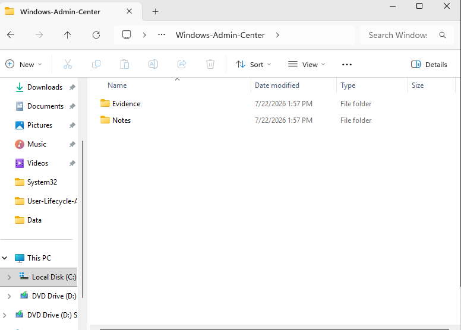
</p>

---

## Step 2 — Open Windows Admin Center

Opened Windows Admin Center through its browser-based management interface.

The interface provided access to the connection list and server-management tools.

<p align="center">
  
</p>

### Validation

This confirmed that:

```text
Windows Admin Center gateway available
+
Browser interface accessible
=
Management platform ready
```

---

## Step 3 — Add SRV01 as a Managed Connection

Added SRV01 to Windows Admin Center.

The server could be referenced by:

```text
SRV01
```

or:

```text
SRV01.homelab.local
```

The successful connection depended on:

- DNS resolution
- Network connectivity
- WinRM
- Firewall configuration
- Administrative authentication

<p align="center">
  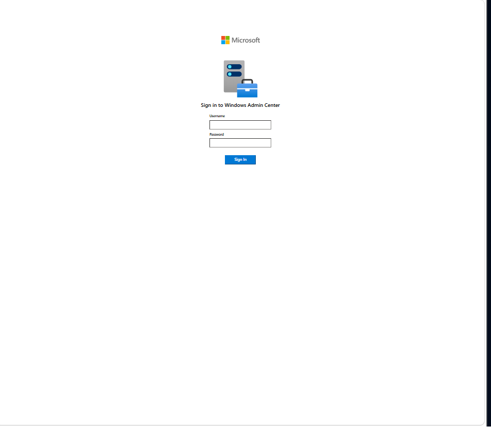
</p>

---

## Step 4 — Review the Connected Server Dashboard

Opened the SRV01 Overview page.

The dashboard displayed live information for:

- CPU
- Memory
- Ethernet activity
- Process count
- Thread count
- Server-management status

At the time of the initial capture, CPU utilization was approximately 22%, while memory utilization was approximately 79%.

<p align="center">
  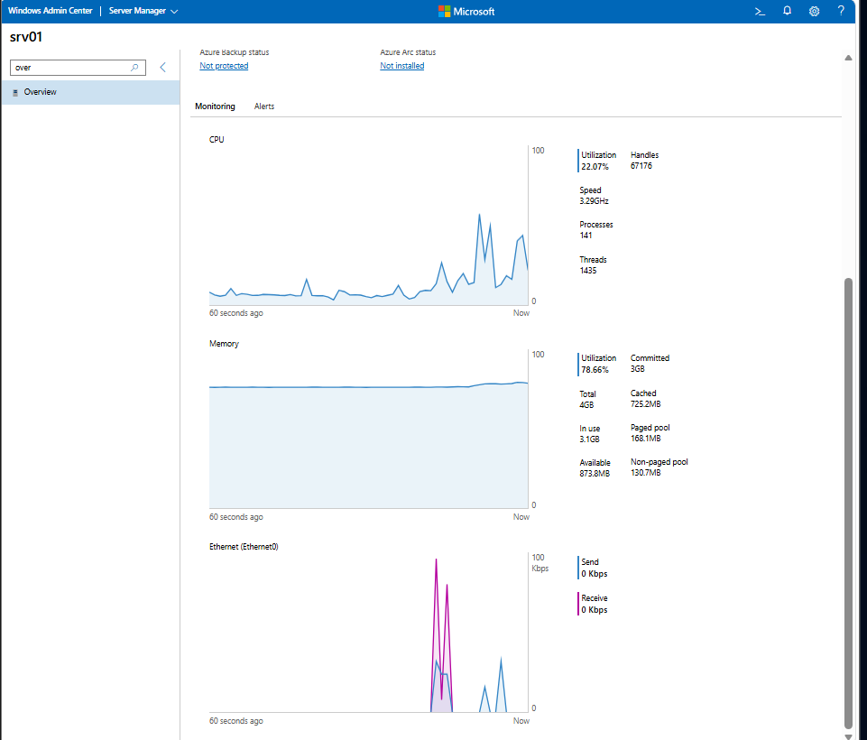
</p>

### Observation

```text
CPU: approximately 22%
Memory: approximately 79%
Available memory: approximately 874 MB
Network activity: minimal
```

This was treated as a starting point rather than proof of a bottleneck.

---

## Step 5 — Review Server Overview Information

Reviewed the server overview and system information to confirm that the correct server was being managed.

The review included:

- Server identity
- Operating system
- Domain membership
- Hardware resources
- Uptime
- Current health information

<p align="center">
  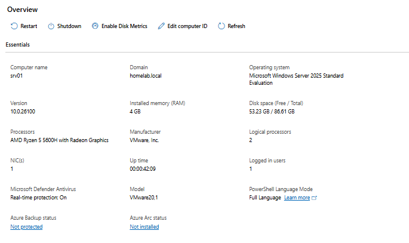
</p>

---

## Step 6 — Establish a CPU and Memory Baseline

Reviewed the CPU and memory sections of the dashboard.

At the time of capture:

```text
CPU utilization: 10.53%
Memory utilization: 77.76%
Available memory: 910.7 MB
Committed memory: 2.9 GB
Total memory: 4 GB
Processes: 142
Threads: 1,421
```

<p align="center">
  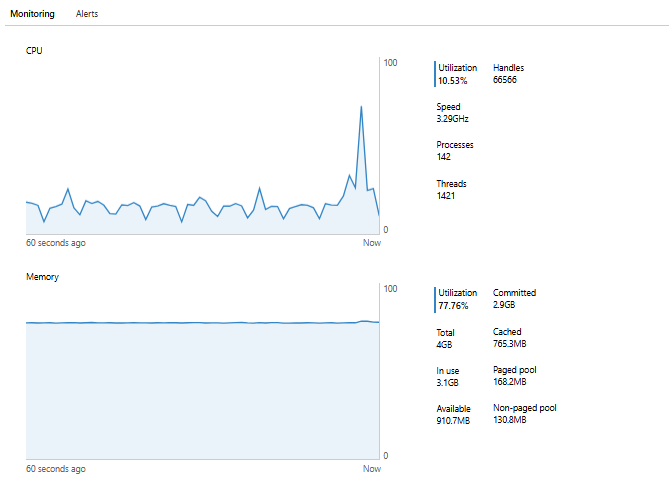
</p>

### Initial Assessment

CPU usage was low.

Memory usage was elevated, but the graph appeared stable and approximately 911 MB remained available.

No immediate memory failure was confirmed from the dashboard snapshot alone.

---

## Step 7 — Open the Processes Tool

Opened the Processes tool in Windows Admin Center.

The process table displayed:

- Process name
- Process ID
- CPU activity
- Memory usage
- Account context
- Process status

<p align="center">
  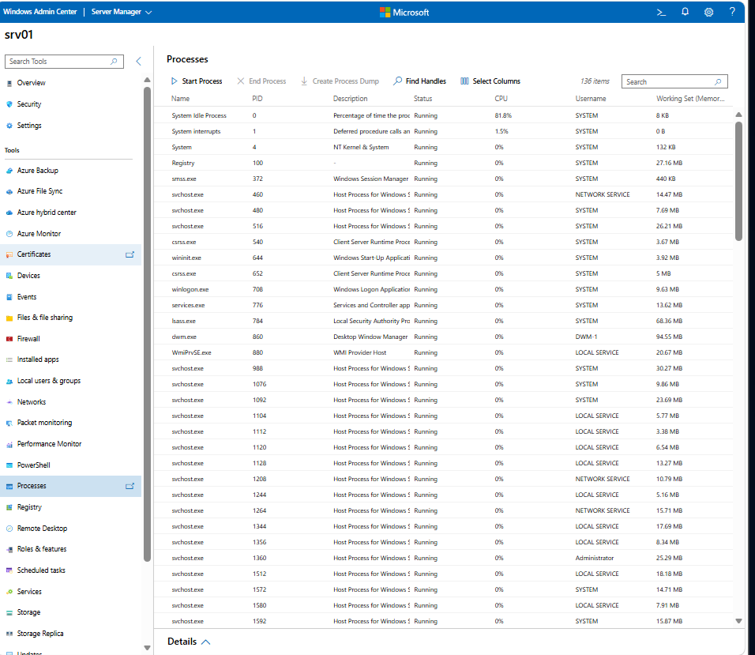
</p>

The purpose of this step was observation and investigation. No process was terminated.

---

## Step 8 — Sort Processes by CPU Usage

Sorted the process table by CPU usage.

This made it possible to identify which workloads were using processor resources at that moment.

<p align="center">
  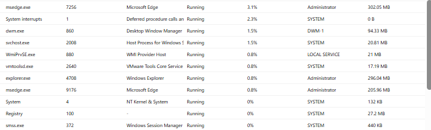
</p>

### Investigation Principle

```text
High current CPU
does not automatically mean
sustained high CPU
```

A process should be investigated over time before action is taken.

---

## Step 9 — Sort Processes by Memory Usage

Sorted the process table by memory usage.

The results were compared with the dashboard memory information.

<p align="center">
  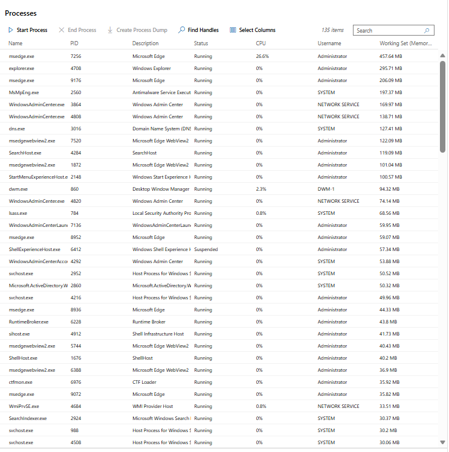
</p>

A process using more memory than others is not automatically a problem.

Indicators of a real issue would include:

- Continuous memory growth
- Falling available memory
- Heavy paging
- Application instability
- A process consuming an unexpected percentage of total RAM

---

## Step 10 — Investigate System Idle Process

Reviewed System Idle Process.

<p align="center">
  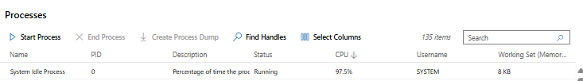
</p>

System Idle Process represents unused CPU time.

Example:

```text
System Idle Process = 90%
```

means approximately:

```text
Processor utilization = 10%
```

It should not be treated as a high-CPU application and should not be terminated.

---

## Step 11 — Open Event Viewer

Opened the Events tool in Windows Admin Center.

The interface displayed:

- Administrative Logs
- Windows Logs
- Applications and Services Logs
- Server role event channels

<p align="center">
  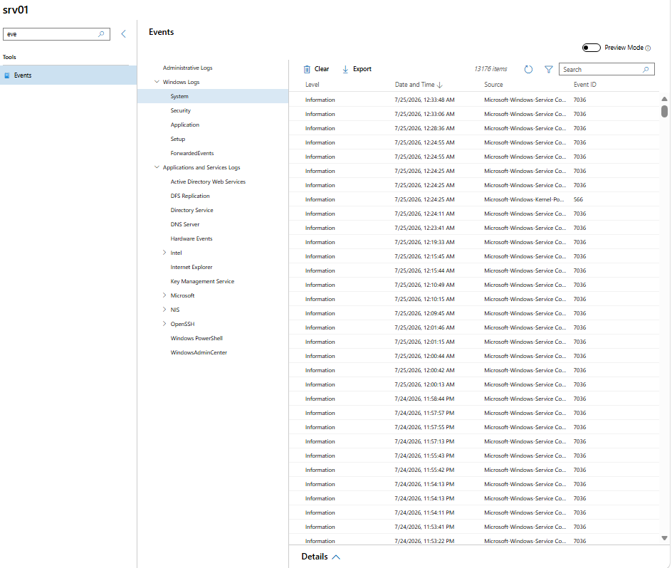
</p>

The System log was selected because this module focused on server operations, services, and unexpected restart activity.

---

## Step 12 — Review the System Event Log

Opened:

```text
Windows Logs
└── System
```

The event list showed:

- Critical events
- Error events
- Warning events
- Information events
- Source
- Event ID
- Date and time

<p align="center">
  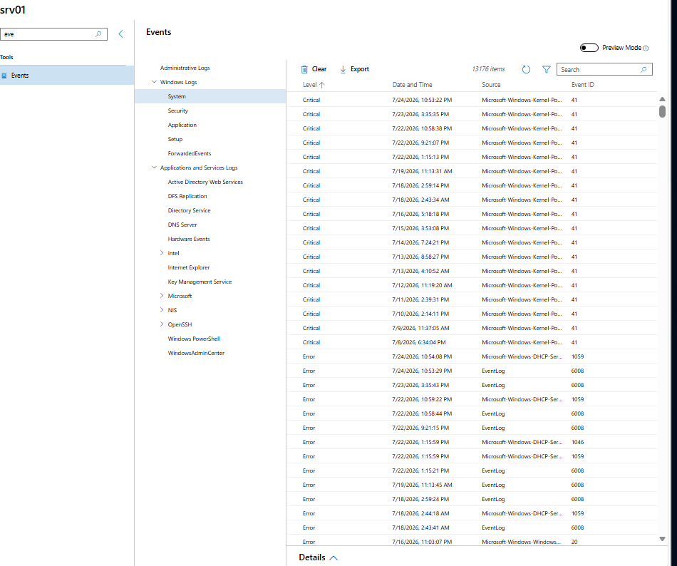
</p>

The event log was then used to investigate Event IDs 41 and 1046.

---

## Step 13 — Investigate Kernel-Power Event ID 41

Selected:

```text
Source: Microsoft-Windows-Kernel-Power
Event ID: 41
Level: Critical
```

<p align="center">
  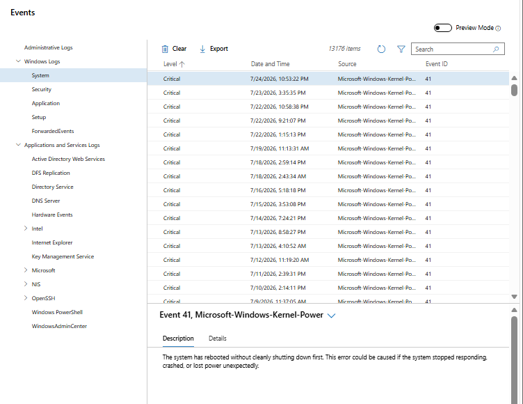
</p>

The event description stated that the system rebooted without shutting down cleanly first.

### Correct Interpretation

Event ID 41 confirms the symptom:

```text
Unexpected shutdown or restart occurred
```

It does not identify the exact cause.

Possible causes include:

- Virtual machine power-off
- Forced restart
- Host shutdown
- System crash
- Power interruption
- Server freeze
- Hypervisor reset

Because SRV01 is a virtual machine, repeated Event ID 41 entries may be related to powering off or resetting the VM without performing a graceful Windows shutdown.

---

## Step 14 — Investigate DHCP Server Event ID 1046

Filtered the System log for Event ID 1046.

Selected:

```text
Source: Microsoft-Windows-DHCP-Server
Event ID: 1046
Level: Error
```

<p align="center">
  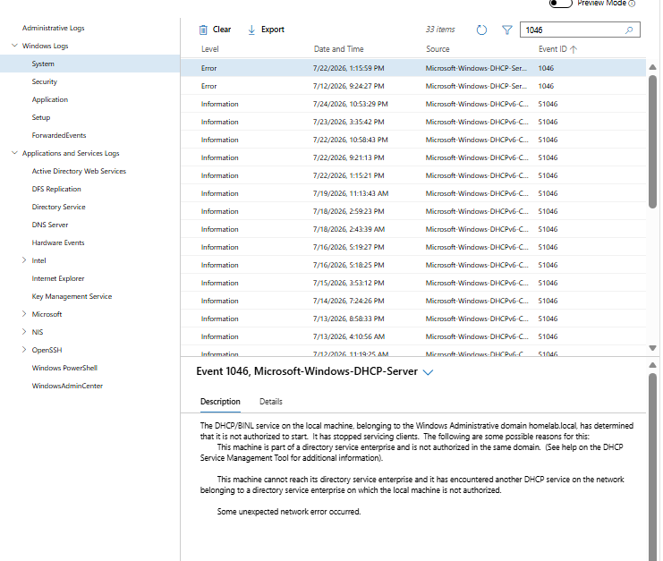
</p>

The description showed that the DHCP/BINL service determined it was not authorized in the `homelab.local` Active Directory domain and stopped servicing clients.

### Failure Chain

```text
DHCP Server role installed
        ↓
Server not authorized in Active Directory
        ↓
DHCP service refuses to issue leases
        ↓
Clients may fail to receive valid network configuration
```

This is a security mechanism that helps prevent unauthorized DHCP servers from servicing domain networks.

---

## Step 15 — Review DHCP Event Metadata

Opened the Details tab for Event ID 1046.

The metadata included:

```text
Log Name: System
Source: Microsoft-Windows-DHCP-Server
Event ID: 1046
Level: Error
Logged: 7/22/2026 1:15:59 PM
```

<p align="center">
  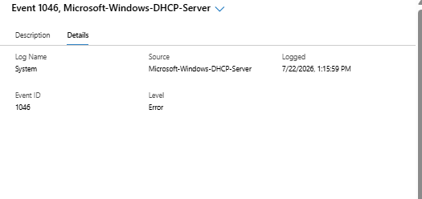
</p>

This information is useful for:

- Filtering logs
- Exporting evidence
- Writing PowerShell queries
- Creating SIEM rules
- Incident documentation

---

## Step 16 — Monitor Processor Performance

Created a Windows Admin Center Performance Monitor workspace and added:

```text
Processor(_Total)\% Processor Time
```

The counter was sampled at approximately one-second intervals for several minutes.

<p align="center">
  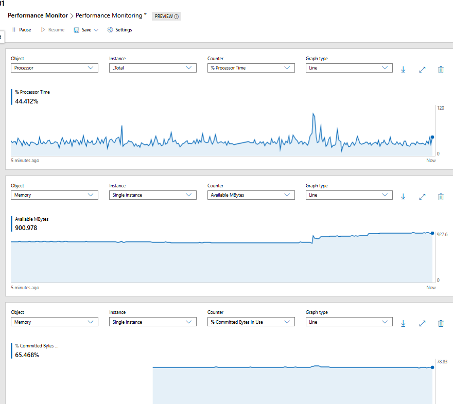
</p>

The report was exported to:

```text
Reports/CPU-Performance.csv
```

### CPU Findings

```text
Typical CPU utilization: 20% to 45%
Highest observed spike: approximately 72.68%
Sustained utilization above 80%: Not observed
```

### CPU Assessment

The processor showed moderate activity with brief spikes.

Because CPU usage repeatedly returned to lower levels and did not remain above 80% to 90%, no sustained CPU bottleneck was identified.

---

## Step 17 — Monitor Memory Performance

Added:

```text
Memory\Available MBytes
```

and:

```text
Memory\% Committed Bytes In Use
```

<p align="center">
  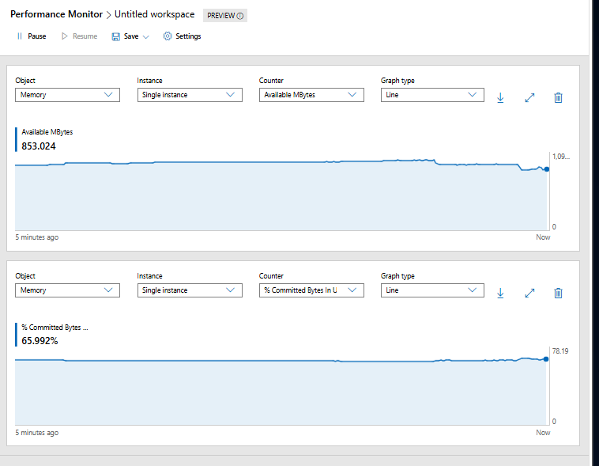
</p>

The available-memory report was exported to:

```text
Reports/Available-Memory-Performance.csv
```

### Memory Findings

At the time of the graph capture:

```text
Available memory: approximately 853 MB
Committed memory in use: approximately 65.99%
Total physical memory: 4 GB
```

Across the longer exported collection:

```text
Available memory range: approximately 908 MB to 985 MB
```

### Memory Assessment

Memory utilization was elevated but stable.

No continuous decline toward zero available memory was observed.

The server was not experiencing immediate physical-memory exhaustion during the monitoring period.

Because SRV01 has only 4 GB of RAM and hosts several services, memory should continue to be monitored as the lab grows.

---

## Step 18 — Monitor Disk Performance

Added:

```text
PhysicalDisk(_Total)\% Disk Time
```

<p align="center">
  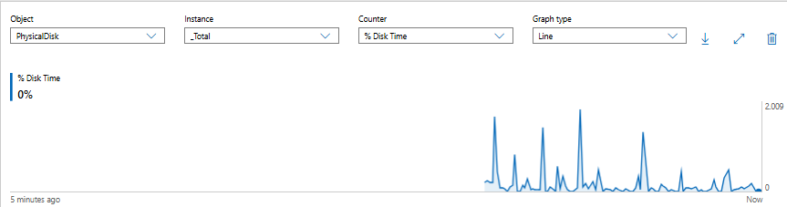
</p>

The disk-performance report was exported to:

```text
Reports/Disk-Performance.csv
```

### Disk Findings

```text
Typical disk utilization: below 0.5%
Highest observed value: approximately 1.84%
Current value during capture: 0%
```

### Disk Assessment

Disk utilization remained low.

The graph showed brief activity followed by a return to near-zero utilization.

No sustained disk-utilization bottleneck was identified.

Some CSV rows contained empty values. These were treated as missed collection samples rather than disk failures.

---

## Step 19 — Perform Final Validation

Returned to the SRV01 Overview page after completing the investigation.

Confirmed that:

- SRV01 remained connected
- Windows Admin Center remained responsive
- CPU information loaded
- Memory information loaded
- Network information loaded
- No management connection failure was present

<p align="center">
  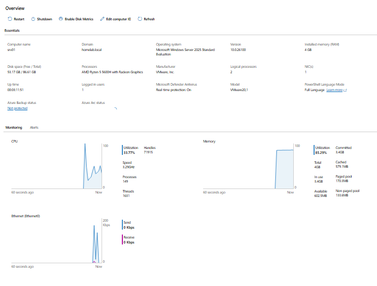
</p>

---

# Performance Summary

| Area | Finding | Assessment |
|---|---|---|
| CPU | Mostly 20%–45% | Healthy |
| CPU Peak | Approximately 72.68% | Brief spike |
| Sustained CPU Above 80% | Not observed | No CPU bottleneck |
| Available Memory | Approximately 853–985 MB | Stable but limited |
| Committed Memory | Approximately 65.99% | Elevated but not critical |
| Disk Utilization | Usually below 0.5% | Very low |
| Maximum Disk Utilization | Approximately 1.84% | Brief activity |
| Sustained Disk Pressure | Not observed | No disk bottleneck |
| Event ID 41 | Unexpected restart recorded | Root cause not proven |
| Event ID 1046 | DHCP server not authorized | Service stopped issuing leases |

---

# Final Technical Findings

## Processor

```text
Typical utilization: 20%–45%
Maximum observed spike: approximately 72.68%
Sustained CPU saturation: Not observed
Conclusion: No processor bottleneck detected
```

## Memory

```text
Total RAM: 4 GB
Available memory: approximately 853–985 MB
Committed memory: approximately 65.99%
Continuous downward trend: Not observed
Conclusion: Elevated but stable memory usage
```

## Disk

```text
Typical utilization: below 0.5%
Maximum observed utilization: approximately 1.84%
Sustained disk pressure: Not observed
Conclusion: No disk-utilization bottleneck detected
```

## Event Logs

```text
Event ID 41
Source: Microsoft-Windows-Kernel-Power
Finding: SRV01 restarted without a clean shutdown
```

```text
Event ID 1046
Source: Microsoft-Windows-DHCP-Server
Finding: DHCP stopped servicing clients because SRV01 was not
authorized in the homelab.local Active Directory domain
```

---

# Troubleshooting Guide

## Windows Admin Center Cannot Connect to SRV01

Check name resolution:

```powershell
Resolve-DnsName SRV01.homelab.local
```

Check connectivity:

```powershell
Test-Connection SRV01
```

Check WinRM:

```powershell
Test-WSMan SRV01
```

Also verify:

- SRV01 is powered on
- DNS points to the internal DNS server
- WinRM is enabled
- Firewall rules allow management traffic
- The account has appropriate administrative rights
- The server is joined to `homelab.local`

---

## Overview Dashboard Does Not Load

Possible causes:

- WinRM issue
- Browser problem
- Expired management session
- High server load
- Extension failure
- Network interruption
- Permission issue

Try:

- Refreshing the page
- Reconnecting to SRV01
- Testing WinRM
- Reviewing Windows Admin Center logs
- Restarting the management gateway only after collecting evidence

---

## Process List Is Empty

Check:

- Administrative permission
- WinRM
- Windows Management Instrumentation
- Windows Admin Center extension status
- Server responsiveness

Do not immediately restart SRV01.

---

## CPU Appears High

Follow this order:

```text
Check dashboard
      ↓
Collect CPU counter
      ↓
Observe for several minutes
      ↓
Sort processes by CPU
      ↓
Review event logs
      ↓
Identify sustained workload
```

A short spike is not enough to prove a bottleneck.

---

## Memory Usage Appears High

Check:

```text
Available MBytes
% Committed Bytes In Use
Process memory
Paged pool
Non-paged pool
Page file
```

A stable 75% to 80% utilization may be acceptable on a small server if available memory remains stable and users are not experiencing slowdown.

---

## Disk Activity Appears High

Review:

```text
PhysicalDisk(_Total)\% Disk Time
PhysicalDisk(_Total)\Avg. Disk sec/Read
PhysicalDisk(_Total)\Avg. Disk sec/Write
PhysicalDisk(_Total)\Current Disk Queue Length
```

High disk utilization should be correlated with latency and queue length.

---

## Event ID 41 Appears Repeatedly

Investigate:

- Forced virtual machine power-offs
- Host shutdowns
- Hypervisor resets
- Windows crashes
- Power interruptions
- Server freezes
- Unexpected restarts

Event ID 41 proves an unclean shutdown occurred, but it does not identify the exact cause.

---

## DHCP Event ID 1046 Appears

Check whether the DHCP server is authorized:

```powershell
Get-DhcpServerInDC
```

Authorize SRV01 when appropriate:

```powershell
Add-DhcpServerInDC `
    -DnsName "SRV01.homelab.local" `
    -IPAddress "192.168.241.10"
```

Restart the DHCP service:

```powershell
Restart-Service DHCPServer
```

Verify service status:

```powershell
Get-Service DHCPServer
```

Test client lease renewal:

```cmd
ipconfig /release
ipconfig /renew
ipconfig /all
```

---

## Performance Monitor Workspace Is Blank

Add counters manually.

Example CPU counter:

```text
Object: Processor
Instance: _Total
Counter: % Processor Time
Graph type: Line
```

Example memory counter:

```text
Object: Memory
Instance: Single instance
Counter: Available MBytes
Graph type: Line
```

Example disk counter:

```text
Object: PhysicalDisk
Instance: _Total
Counter: % Disk Time
Graph type: Line
```

---

## CSV Export Contains Blank Values

Blank values may represent missed collection intervals.

Possible causes:

- Browser delay
- Management refresh
- Temporary counter-provider delay
- Workspace pause
- Network interruption

Keep the original report unchanged as evidence and exclude blank values during analysis.

---

# Useful PowerShell Commands

## Test server connectivity

```powershell
Test-Connection SRV01
```

---

## Test DNS resolution

```powershell
Resolve-DnsName SRV01.homelab.local
```

---

## Test WinRM

```powershell
Test-WSMan SRV01
```

---

## Review computer information

```powershell
Get-ComputerInfo |
Select-Object `
    CsName,
    WindowsProductName,
    WindowsVersion,
    OsBuildNumber,
    CsDomain,
    CsManufacturer,
    CsModel,
    @{Name="TotalMemoryGB";Expression={
        [math]::Round($_.CsTotalPhysicalMemory / 1GB, 2)
    }},
    OsLastBootUpTime
```

---

## Review processes by accumulated CPU time

```powershell
Get-Process |
Sort-Object CPU -Descending |
Select-Object -First 10 `
    ProcessName,
    Id,
    CPU,
    @{Name="MemoryMB";Expression={
        [math]::Round($_.WorkingSet64 / 1MB, 2)
    }}
```

The `CPU` property returned by `Get-Process` is accumulated processor time, not current CPU percentage.

---

## Review processes by memory usage

```powershell
Get-Process |
Sort-Object WorkingSet64 -Descending |
Select-Object -First 10 `
    ProcessName,
    Id,
    @{Name="MemoryMB";Expression={
        [math]::Round($_.WorkingSet64 / 1MB, 2)
    }},
    CPU
```

---

## Collect CPU performance

```powershell
Get-Counter `
    '\Processor(_Total)\% Processor Time' `
    -SampleInterval 2 `
    -MaxSamples 10
```

---

## Collect memory performance

```powershell
Get-Counter `
    '\Memory\Available MBytes',
    '\Memory\% Committed Bytes In Use' `
    -SampleInterval 2 `
    -MaxSamples 10
```

---

## Collect disk performance

```powershell
Get-Counter `
    '\PhysicalDisk(_Total)\% Disk Time' `
    -SampleInterval 2 `
    -MaxSamples 10
```

---

## Collect multiple counters

```powershell
Get-Counter `
    '\Processor(_Total)\% Processor Time',
    '\Memory\Available MBytes',
    '\Memory\% Committed Bytes In Use',
    '\PhysicalDisk(_Total)\% Disk Time' `
    -SampleInterval 2 `
    -MaxSamples 10
```

---

## Review Kernel-Power events

```powershell
Get-WinEvent `
    -FilterHashtable @{
        LogName = "System"
        Id      = 41
    } `
    -MaxEvents 20
```

---

## Review DHCP Event ID 1046

```powershell
Get-WinEvent `
    -FilterHashtable @{
        LogName = "System"
        Id      = 1046
    } `
    -MaxEvents 20
```

---

## Review DHCP authorization

```powershell
Get-DhcpServerInDC
```

---

## Check DHCP service

```powershell
Get-Service DHCPServer
```

---

# Security Notes

## Use Least Privilege

Windows Admin Center credentials should have only the administrative rights required for the assigned tasks.

Do not use Domain Administrator credentials for every routine operation when delegated access is sufficient.

---

## Protect Administrative Sessions

Windows Admin Center provides powerful access to managed servers.

Protect the management interface using:

- Strong authentication
- HTTPS
- Restricted administrative access
- Secure workstation practices
- Session timeout
- MFA when integrated with supported identity platforms
- Network segmentation

---

## Do Not Terminate Unknown Processes

Some Windows processes are critical.

Ending the wrong process may cause:

- Authentication failures
- Service outages
- User logoff
- System instability
- Server restart

Collect evidence and identify the process before taking action.

---

## Protect Exported Reports

Performance reports may reveal:

- Server names
- Internal architecture
- Resource capacity
- Usage patterns
- Infrastructure timestamps

Sanitize reports before public publication when required.

---

## Protect Event Evidence

Event logs may include:

- Usernames
- Hostnames
- IP addresses
- Authentication data
- Internal domain information
- Service failures
- Incident timelines

Store investigation evidence in a controlled location.

---

# Validation Results

| Validation Check | Result |
|---|---|
| Windows Admin Center opened successfully | ✅ |
| SRV01 connection added | ✅ |
| SRV01 dashboard loaded | ✅ |
| Server overview reviewed | ✅ |
| CPU and memory baseline recorded | ✅ |
| Process list opened | ✅ |
| Processes sorted by CPU | ✅ |
| Processes sorted by memory | ✅ |
| System Idle Process reviewed | ✅ |
| Event Viewer opened | ✅ |
| System log reviewed | ✅ |
| Kernel-Power Event ID 41 investigated | ✅ |
| DHCP Event ID 1046 investigated | ✅ |
| DHCP event metadata reviewed | ✅ |
| CPU performance collected | ✅ |
| Memory performance collected | ✅ |
| Disk performance collected | ✅ |
| CSV reports exported | ✅ |
| Final connection validated | ✅ |
| Sustained CPU bottleneck found | No |
| Immediate memory exhaustion found | No |
| Sustained disk bottleneck found | No |

---

# Skills Demonstrated

- Windows Admin Center
- Browser-Based Server Administration
- Windows Server 2025
- Remote Server Management
- Server Health Monitoring
- Process Investigation
- CPU Analysis
- Memory Analysis
- Disk Analysis
- Windows Event Viewer
- Event ID Analysis
- Kernel-Power Troubleshooting
- DHCP Troubleshooting
- Performance Monitor
- Performance Counter Collection
- CSV Reporting
- PowerShell Administration
- WinRM Troubleshooting
- Evidence-Based Troubleshooting
- Technical Documentation

---

# Interview Notes

## What is Windows Admin Center?

Windows Admin Center is a browser-based platform used to manage Windows servers, clusters, and Windows clients through a centralized interface.

---

## How is Windows Admin Center different from Remote Desktop?

Windows Admin Center provides focused administrative tools without requiring a complete desktop session.

Remote Desktop provides interactive access to the full Windows desktop.

---

## What does System Idle Process represent?

It represents unused CPU capacity.

A high System Idle Process value normally means the processor is mostly available.

---

## Does one CPU spike prove a performance problem?

No.

CPU should be observed over time and correlated with processes, event logs, and user impact.

---

## What does Available MBytes show?

It shows the amount of physical memory that Windows can immediately make available to processes.

---

## What does percent committed bytes in use show?

It shows how much committed virtual memory is in use compared with the system commit limit.

---

## What does Event ID 41 mean?

Kernel-Power Event ID 41 means Windows detected that the system restarted without shutting down cleanly.

It does not identify the exact root cause.

---

## What does DHCP Event ID 1046 mean?

It means the DHCP server determined that it was not authorized in Active Directory and stopped servicing clients.

---

## Why does a domain DHCP server require authorization?

Authorization helps prevent unauthorized DHCP servers from issuing incorrect network settings to domain clients.

---

## How would you troubleshoot a slow Windows Server?

I would:

1. Confirm the user-reported symptoms.
2. Review the server dashboard.
3. Collect CPU, memory, disk, and network data.
4. Sort processes by resource use.
5. Review relevant event logs.
6. Determine whether the issue is temporary or sustained.
7. Perform the least disruptive corrective action.
8. Validate the result.

---

## Why export performance data?

Exported data provides a point-in-time record that can be reviewed, compared, documented, and used as evidence.

---

## Why is Event Viewer important?

Event Viewer records evidence of service failures, system activity, application errors, authentication events, and operating system problems.

---

# What I Learned

The most important lesson from this module was that performance troubleshooting requires trends, not assumptions.

The dashboard initially showed relatively high memory usage, but longer-term counters showed that memory remained stable.

```text
High utilization
does not automatically mean
resource exhaustion
```

I also learned that short CPU spikes are normal.

The CPU report showed brief increases but no sustained utilization above 80%.

```text
Short spike
≠
Sustained bottleneck
```

The event-log investigation also reinforced the difference between symptoms and causes.

Kernel-Power Event ID 41 confirmed an unexpected shutdown but did not prove why it happened.

```text
Event ID 41
=
Evidence of an unclean shutdown
```

```text
Event ID 41
≠
Exact root cause
```

DHCP Event ID 1046 was more specific because its description clearly connected the service failure to Active Directory authorization.

The troubleshooting order I want to remember is:

```text
Review dashboard
      ↓
Check resource trends
      ↓
Inspect processes
      ↓
Review event logs
      ↓
Identify likely cause
      ↓
Take controlled action
      ↓
Validate the result
```

---

# Future Improvements

To expand this module, I would add:

- Windows Admin Center gateway hardening
- Certificate-based HTTPS configuration
- Role-based access control
- Azure integration
- Windows Admin Center extension review
- Remote service administration
- Firewall administration
- Storage management
- Certificate management
- Scheduled performance collection
- Performance baseline comparison
- Additional disk latency counters
- Network performance counters
- Event export automation
- PowerShell report generation
- Centralized event forwarding
- Microsoft Sentinel integration
- Email or Teams alerting
- Additional managed servers
- Multi-server dashboard
- Historical performance reporting

Future performance reports could include:

```text
CPU-Performance.csv
Memory-Performance.csv
Disk-Performance.csv
Disk-Latency.csv
Network-Performance.csv
Server-Health-Summary.csv
```

---

# Key Takeaways

This module demonstrated remote administration and troubleshooting of SRV01 through Windows Admin Center.

The implementation included:

- Connecting to SRV01
- Reviewing the server dashboard
- Establishing CPU and memory baselines
- Investigating running processes
- Interpreting System Idle Process
- Reviewing the System event log
- Investigating Kernel-Power Event ID 41
- Investigating DHCP Server Event ID 1046
- Reviewing structured event details
- Collecting CPU performance data
- Collecting memory performance data
- Collecting disk performance data
- Exporting reports
- Validating the final management state

The primary conclusions were:

```text
No sustained CPU bottleneck was detected.
```

```text
Memory utilization was elevated but stable.
```

```text
No sustained disk-utilization bottleneck was detected.
```

```text
Kernel-Power Event ID 41 recorded an unclean shutdown.
```

```text
DHCP Event ID 1046 identified an Active Directory authorization failure.
```

```text
Windows Admin Center provided useful evidence without requiring a full Remote Desktop session.
```

---

<div align="center">

### Module Status

✅ Completed Successfully

**Performance Reports**

[`CPU-Performance.csv`](Reports/CPU-Performance.csv)

[`Available-Memory-Performance.csv`](Reports/Available-Memory-Performance.csv)

[`Disk-Performance.csv`](Reports/Disk-Performance.csv)

**Next Module:** [WSUS Patch Management](../03-WSUS-Patch-Management/)

</div>