<div align="center">


</div>

---

# Overview

This module documents the deployment and administration of Windows Server Update Services on SRV01 in the `homelab.local` environment.

The goal was to create a centralized patch-management platform that could synchronize selected updates from Microsoft Update, distribute approved updates to domain-joined computers, and report client compliance from one administrative console.

The implementation included:

- Installing the Windows Server Update Services role
- Installing Windows Internal Database connectivity
- Creating a dedicated WSUS content directory
- Completing WSUS post-installation tasks
- Opening the WSUS Administration Console
- Completing the WSUS Server Configuration Wizard
- Configuring Microsoft Update as the upstream source
- Restricting update languages
- Selecting required products
- Selecting required update classifications
- Configuring manual synchronization
- Completing the initial synchronization
- Creating a pilot computer group
- Enabling client-side targeting
- Creating a WSUS Group Policy Object
- Configuring the internal update-service location
- Configuring Automatic Updates
- Applying the policy to CLIENT01
- Verifying registry-based WSUS policy settings
- Testing connectivity to port 8530
- Registering CLIENT01 with WSUS
- Approving an update for the pilot group
- Triggering update detection
- Verifying update compliance
- Generating a computer status report
- Troubleshooting synchronization and database timeouts
- Tuning the IIS WsusPool application pool
- Investigating server memory constraints

This module demonstrates how WSUS supports controlled enterprise patching through centralized synchronization, update approval, client grouping, Group Policy, and compliance reporting.

---

# Why I Built This Module

Windows administrators need a controlled method for managing operating-system updates across multiple servers and client computers.

Allowing every computer to download and install updates independently can create several problems:

- Increased internet bandwidth consumption
- Inconsistent patch levels
- Limited visibility into installation failures
- Unplanned restarts
- Updates being deployed without testing
- Difficulty verifying organizational compliance
- Increased risk from problematic updates

WSUS provides a centralized platform for:

- Synchronizing update metadata
- Selecting supported products
- Selecting update classifications
- Approving or declining updates
- Creating computer groups
- Testing updates through pilot deployments
- Monitoring update status
- Reviewing client compliance
- Reducing repeated internet downloads

I built this module to understand how centralized patch management works and how updates can be tested before being approved for a wider environment.

The most important lesson from this module was:

```text
Synchronization does not equal deployment.

An update must still be evaluated,
approved, detected, installed,
and reported.
```

---

# Business Scenario

The Infrastructure Team manages Windows servers and Windows client computers in the `homelab.local` domain.

The organization needs to:

- Centralize Windows update management
- Reduce direct update traffic from client computers
- Limit synchronized products to supported systems
- Test updates before wider deployment
- Prevent unapproved updates from automatically installing
- Group pilot systems separately from production systems
- Configure clients through Group Policy
- Verify that clients are communicating with the internal update server
- Confirm whether approved updates are installed or not applicable
- Produce evidence of patch compliance

The administrator should avoid approving every synchronized update for all computers without testing.

A controlled deployment process should be followed:

```text
Synchronize
      ↓
Review
      ↓
Approve for pilot group
      ↓
Detect on pilot client
      ↓
Validate compliance
      ↓
Consider wider deployment
```

---

# Patch-Management Method

This module follows a controlled patch-management model:

```text
S — Synchronize
Retrieve update metadata from Microsoft Update.

R — Review
Identify the update product, classification, applicability, and status.

A — Approve
Approve the selected update only for the pilot group.

D — Detect
Allow the pilot computer to scan against the internal WSUS server.

V — Validate
Confirm installation, non-applicability, errors, and reporting status.
```

The workflow used in this module was:

```text
Install WSUS
      ↓
Complete post-installation
      ↓
Configure upstream synchronization
      ↓
Select products and classifications
      ↓
Synchronize update metadata
      ↓
Create Pilot-Computers
      ↓
Configure WSUS-Pilot-Policy
      ↓
Register CLIENT01
      ↓
Approve a pilot update
      ↓
Trigger update detection
      ↓
Verify compliance
      ↓
Generate status report
```

---

# Learning Objectives

By completing this module, I practiced the following:

- Installing Windows Server Update Services
- Installing WSUS management tools
- Using Windows Internal Database
- Configuring a WSUS content location
- Running WSUS post-installation commands
- Using the WSUS Administration Console
- Completing the WSUS Configuration Wizard
- Configuring Microsoft Update as an upstream source
- Understanding WSUS synchronization
- Limiting synchronized languages
- Selecting update products
- Selecting update classifications
- Avoiding unnecessary legacy-product metadata
- Creating WSUS computer groups
- Understanding pilot-ring deployment
- Enabling client-side targeting
- Configuring Windows Update through Group Policy
- Configuring an internal update-service URL
- Configuring an internal statistics-server URL
- Configuring Automatic Updates
- Applying Group Policy to a client
- Verifying Windows Update registry policies
- Testing TCP connectivity to WSUS
- Registering a client with WSUS
- Approving an update for a selected group
- Triggering Windows Update detection
- Interpreting Installed/Not Applicable status
- Generating WSUS status reports
- Monitoring synchronization through PowerShell
- Reading `SoftwareDistribution.log`
- Troubleshooting Windows Internal Database timeouts
- Configuring IIS WsusPool settings
- Evaluating memory constraints
- Documenting an end-to-end patch-management workflow

---

# Key Concepts Learned

## Windows Server Update Services

Windows Server Update Services is a Windows Server role used to centrally manage Microsoft product updates.

WSUS can synchronize update metadata from Microsoft Update and make approved updates available to internal computers.

Common WSUS capabilities include:

- Update synchronization
- Product selection
- Classification selection
- Computer grouping
- Update approval
- Update declining
- Client reporting
- Compliance monitoring
- Update-status reporting

---

## Upstream and Downstream Servers

A WSUS server retrieves update metadata from an upstream source.

In this homelab, the upstream source was:

```text
Microsoft Update
```

The communication path was:

```text
Microsoft Update
        ↓
SRV01 WSUS
        ↓
CLIENT01
```

In larger environments, one WSUS server can synchronize from another WSUS server instead of directly contacting Microsoft Update.

---

## Windows Internal Database

Windows Internal Database stores the WSUS configuration and update metadata.

The database contains information such as:

- Products
- Classifications
- Updates
- Revisions
- Computer records
- Approvals
- Synchronization state
- Client status
- Reporting information

Windows Internal Database is suitable for a small WSUS deployment, but its performance can be affected by:

- Available memory
- Disk performance
- Number of selected products
- Number of classifications
- Database size
- Synchronization volume
- Database fragmentation
- Multiple server workloads

---

## WSUS Content Directory

The WSUS content directory stores downloaded update files.

The content directory used in this module was:

```text
C:\WSUS
```

Update metadata is stored in the database, while approved update files may be downloaded to the content directory.

---

## Products

Products identify the Microsoft operating systems or applications for which update metadata should be synchronized.

Products selected in this module included:

```text
Microsoft Server operating system-24H2
Windows 11
```

Selecting only required products reduces:

- Synchronization time
- Database growth
- Console load time
- Content storage
- Administrative complexity

The complete parent `Windows` category was not selected because it included many legacy and unused products.

---

## Update Classifications

Classifications describe the purpose or type of an update.

Classifications used in this module included:

```text
Critical Updates
Security Updates
Updates
Update Rollups
```

Other classifications may include:

```text
Drivers
Upgrades
Definition Updates
Feature Packs
Tools
Service Packs
```

Drivers and upgrades were excluded from the initial synchronization to keep the deployment scope controlled.

---

## Computer Groups

WSUS computer groups allow administrators to approve updates for selected systems.

The group created in this module was:

```text
Pilot-Computers
```

A pilot group reduces deployment risk by allowing updates to be tested before they are approved for a wider computer population.

---

## Client-Side Targeting

Client-side targeting assigns a computer to a WSUS group through Group Policy or registry settings.

The target group configured in this module was:

```text
Pilot-Computers
```

The group name configured in Group Policy must exactly match the group name created in WSUS.

---

## Update Approval

Synchronization does not automatically install an update.

The deployment process is:

```text
Update synchronized
        ↓
Administrator reviews update
        ↓
Update approved for computer group
        ↓
Client detects update
        ↓
Client installs or evaluates update
        ↓
Client reports status
```

The test update was approved only for:

```text
Pilot-Computers
```

It was not approved for all computers.

---

## Installed/Not Applicable

WSUS may combine two compliant states:

```text
Installed
Not Applicable
```

An update is compliant when:

- It was successfully installed, or
- The update does not apply to the computer

The final result for the approved update was:

```text
Computers with errors: 0
Computers needing this update: 0
Computers installed/not applicable: 1
Computers with no status: 0
```

---

## WSUS Client Without Direct Internet Access

A WSUS client does not need direct internet access when it can communicate with the internal WSUS server.

The client communication path was:

```text
CLIENT01
    ↓
http://SRV01:8530
```

SRV01 required internet access to synchronize from Microsoft Update, but CLIENT01 only required internal connectivity to SRV01.

---

# Lab Environment Specifications

| Component | Configuration |
|---|---|
| WSUS Server | SRV01 |
| Server FQDN | `SRV01.homelab.local` |
| Server Operating System | Windows Server 2025 Standard Evaluation |
| Active Directory Domain | `homelab.local` |
| Client Computer | CLIENT01 |
| Client FQDN | `CLIENT01.homelab.local` |
| Client Operating System | Windows 11 Enterprise |
| WSUS Database | Windows Internal Database |
| WSUS Content Directory | `C:\WSUS` |
| WSUS Port | `8530` |
| WSUS URL | `http://SRV01:8530` |
| Upstream Source | Microsoft Update |
| Update Language | English |
| Pilot Group | `Pilot-Computers` |
| Group Policy Object | `WSUS-Pilot-Policy` |
| Automatic Update Option | Auto download and notify for install |
| Hypervisor | VMware Workstation Pro |

---

# Folder Structure

```text
03-Enterprise-Operations
│
└── 03-WSUS-Patch-Management
    │
    ├── README.md
    │
    ├── Evidence
    │   ├── Screenshots
    │   │   ├── 01-WSUS-Project-Folder.png
    │   │   ├── 02-Install-WSUS-Role.png
    │   │   ├── 03-Select-WSUS-Role-Services.png
    │   │   ├── 04-WSUS-Content-Location.png
    │   │   ├── 05-WSUS-Post-Installation.png
    │   │   ├── 06-Open-WSUS-Console.png
    │   │   ├── 07-WSUS-Console-Overview.png
    │   │   ├── 08-Select-Products.png
    │   │   ├── 09-Select-Classifications.png
    │   │   ├── 10-Manual-Synchronization-Schedule.png
    │   │   ├── 11-Complete-WSUS-Configuration-Wizard.png
    │   │   ├── 12-Initial-Synchronization-Succeeded.png
    │   │   ├── 13-Create-Pilot-Computer-Group.png
    │   │   ├── 14-Configure-WSUS-Client-GPO.png
    │   │   ├── 15-Enable-Client-Side-Targeting.png
    │   │   ├── 16-Configure-Automatic-Updates.png
    │   │   ├── 17-Verify-WSUS-Client-Policy.png
    │   │   ├── 18-CLIENT01-Registered-in-WSUS.png
    │   │   ├── 19-Approve-Update-for-Pilot-Group.png
    │   │   ├── 20-CLIENT01-Receives-Approved-Update.png
    │   │   ├── 21-Verify-Update-Deployment.png
    │   │   └── 22-WSUS-Computer-Status-Report.png
    │   │
    │   └── Troubleshooting
    │       ├── WSUS-Initial-Synchronization-Troubleshooting.png
    │       └── WSUS-Resource-Troubleshooting.png
    │
    ├── Scripts
    │   ├── Check-WSUS-Synchronization.ps1
    │   ├── Verify-WSUS-Server.ps1
    │   └── Verify-WSUS-Client.ps1
    │
    ├── Configuration
    │   └── WSUS-GPO-Settings.md
    │
    └── Documentation
        ├── WSUS-Deployment-Procedure.md
        ├── WSUS-Troubleshooting.md
        └── WSUS-Rollback-Plan.md
```

---

# Step-by-Step Implementation

---

## Step 1 — Create the WSUS Module Structure

Created the project folder for WSUS documentation.

The structure separates:

- Screenshots
- Troubleshooting evidence
- Scripts
- Configuration notes
- Deployment documentation
- README documentation

<p align="center">
  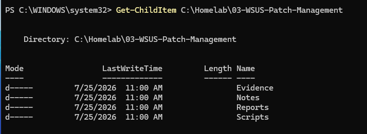
</p>

---

## Step 2 — Install the WSUS Role

Installed Windows Server Update Services and its management tools on SRV01.

```powershell
Install-WindowsFeature `
    -Name UpdateServices `
    -IncludeManagementTools
```

<p align="center">
  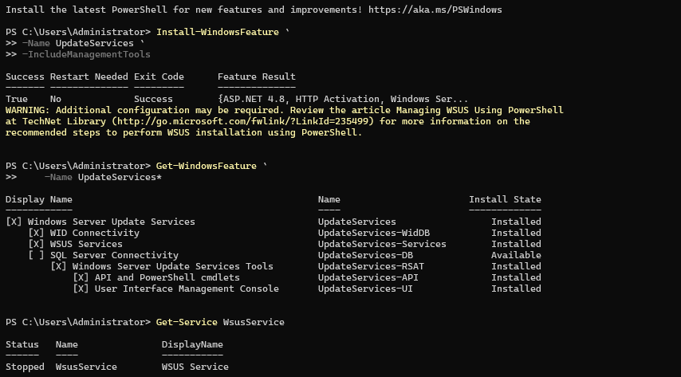
</p>

### Validation

The installation result confirmed that the WSUS role was successfully installed.

```text
WSUS role installed
+
Management tools installed
=
Server ready for post-installation
```

---

## Step 3 — Verify WSUS Role Services

Reviewed the installed WSUS components.

```powershell
Get-WindowsFeature -Name UpdateServices*
```

The installation included:

```text
Windows Server Update Services
WID Connectivity
WSUS Services
WSUS Management Tools
```

<p align="center">
  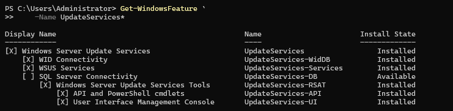
</p>

---

## Step 4 — Create the WSUS Content Directory

Created a dedicated update-content directory:

```powershell
New-Item `
    -Path "C:\WSUS" `
    -ItemType Directory `
    -Force
```

The selected path was:

```text
C:\WSUS
```

<p align="center">
  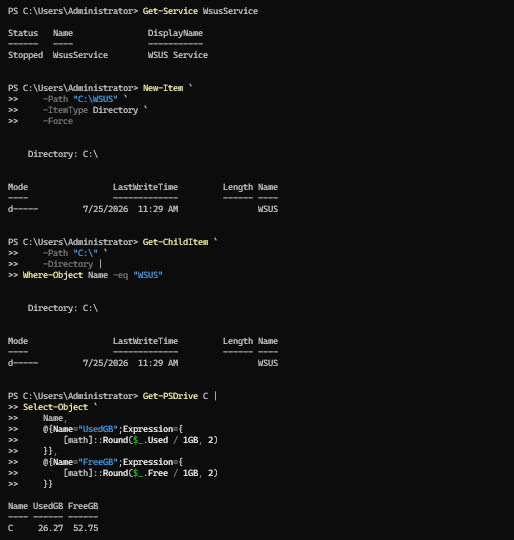
</p>

The content directory separates WSUS update files from operating-system files and makes storage monitoring easier.

---

## Step 5 — Complete WSUS Post-Installation

Ran the WSUS post-installation command:

```powershell
& "C:\Program Files\Update Services\Tools\WsusUtil.exe" `
    postinstall CONTENT_DIR="C:\WSUS"
```

Verified the WSUS service:

```powershell
Get-Service WsusService
```

Expected state:

```text
Running
```

<p align="center">
  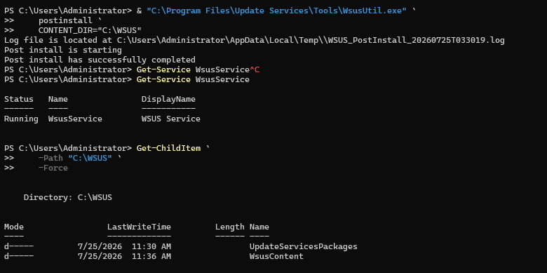
</p>

---

## Step 6 — Open the WSUS Administration Console

Opened the console from:

```text
Server Manager
└── Tools
    └── Windows Server Update Services
```

The console connected to:

```text
SRV01
```

<p align="center">
  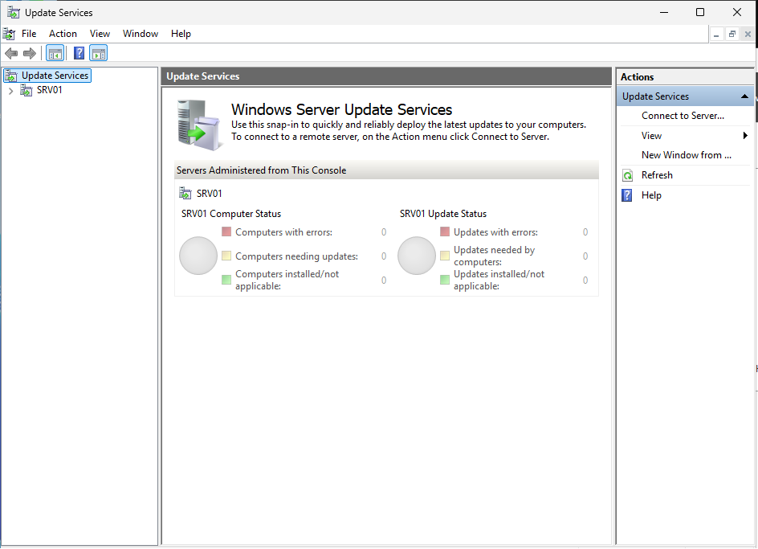
</p>

---

## Step 7 — Review the WSUS Console Overview

Selected SRV01 in the WSUS console.

The dashboard displayed:

- Synchronization status
- Update status
- Computer status
- Server statistics
- Port 8530
- Last synchronization
- Client reporting information

<p align="center">
  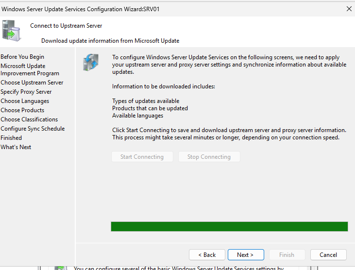
</p>

At this stage, no clients had reported and no updates had been approved.

---

## Step 8 — Select Update Products

Completed the product-selection stage of the WSUS Server Configuration Wizard.

Selected only products used in the environment:

```text
Microsoft Server operating system-24H2
Windows 11
```

<p align="center">
  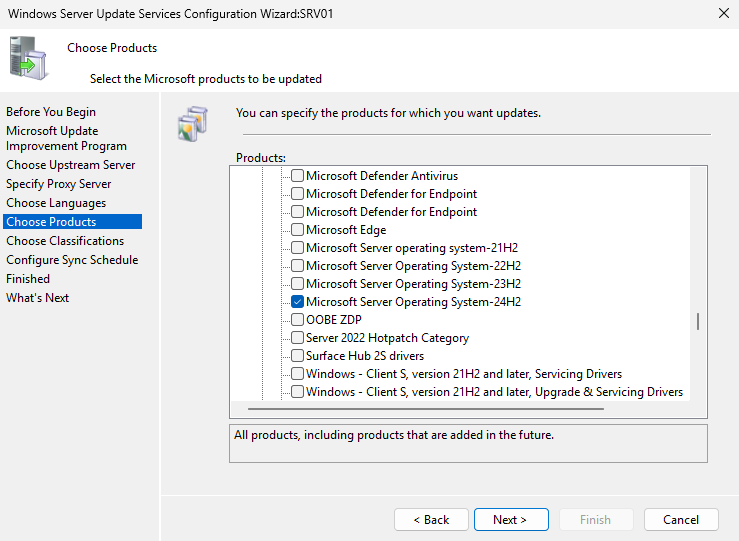
</p>

The complete `Windows` parent category was not selected because it included many legacy products.

### Product-Selection Principle

```text
Select only required products
        ↓
Reduce catalog size
        ↓
Reduce database growth
        ↓
Improve synchronization performance
```

---

## Step 9 — Select Update Classifications

Selected the following update classifications:

```text
Critical Updates
Security Updates
Updates
Update Rollups
```

<p align="center">
  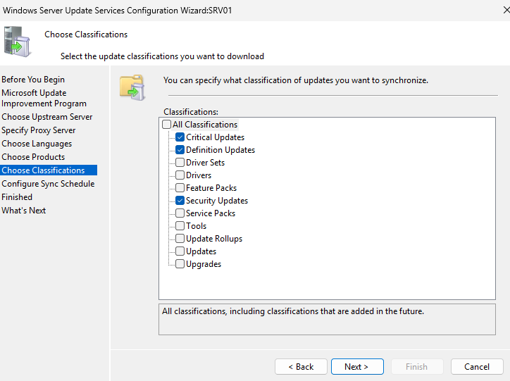
</p>

The following classifications were excluded from the initial synchronization:

```text
Drivers
Upgrades
Feature Packs
Tools
Service Packs
```

This kept the initial synchronization smaller and easier to manage.

---

## Step 10 — Configure Manual Synchronization

Selected:

```text
Synchronize manually
```

<p align="center">
  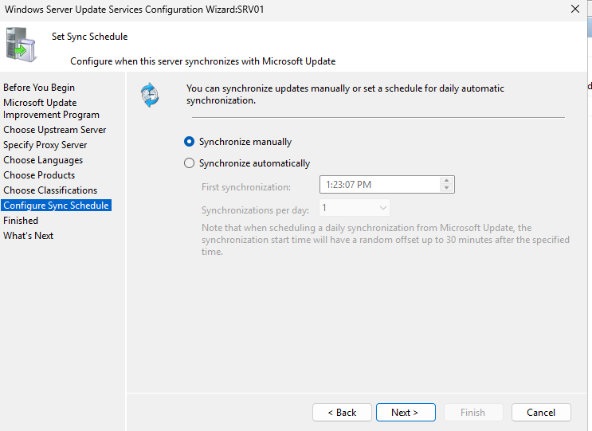
</p>

Manual synchronization allowed the environment to be monitored before automatic scheduling was enabled.

---

## Step 11 — Complete the WSUS Configuration Wizard

Completed the WSUS Server Configuration Wizard.

The wizard configured:

- Microsoft Update as the upstream source
- No proxy server
- English update language
- Selected products
- Selected classifications
- Manual synchronization

<p align="center">
  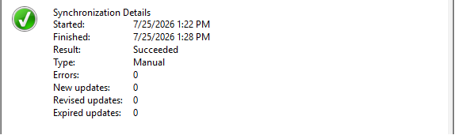
</p>

### Important Lesson

The initial synchronization attempts were started before the wizard was fully completed.

After the wizard was completed, synchronization progressed significantly faster.

---

## Step 12 — Complete the Initial Synchronization

Started the first properly configured synchronization.

The synchronization retrieved:

- Product categories
- Classification information
- Update metadata
- Revision information
- Applicability information

<p align="center">
  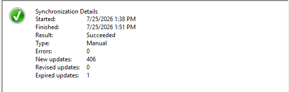
</p>

### Validation

```text
Upstream connection successful
+
Configuration Wizard completed
+
Update metadata synchronized
=
WSUS catalog ready
```

---

## Step 13 — Create the Pilot Computer Group

Created a WSUS computer group named:

```text
Pilot-Computers
```

The group was created under:

```text
Computers
└── All Computers
```

<p align="center">
  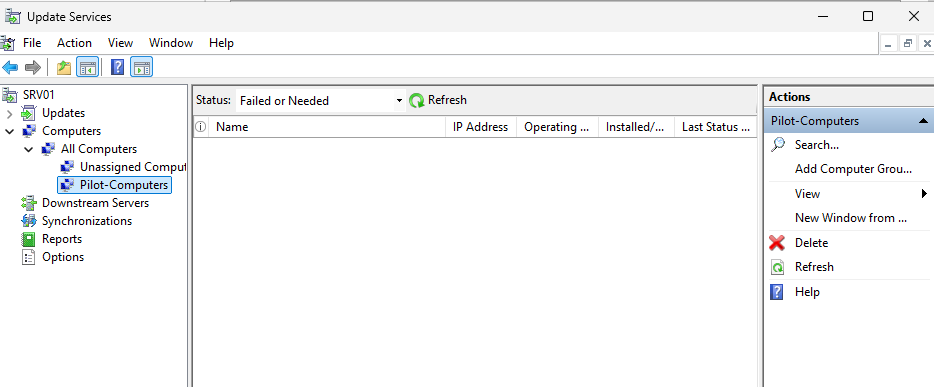
</p>

The pilot group was used to test update approval before wider deployment.

---

## Step 14 — Configure the WSUS Client Group Policy

Created a Group Policy Object named:

```text
WSUS-Pilot-Policy
```

Configured:

```text
Computer Configuration
└── Policies
    └── Administrative Templates
        └── Windows Components
            └── Windows Update
                └── Manage updates offered from Windows Server Update Service
```

Enabled:

```text
Specify intranet Microsoft update service location
```

Configured both fields as:

```text
http://SRV01:8530
```

<p align="center">
  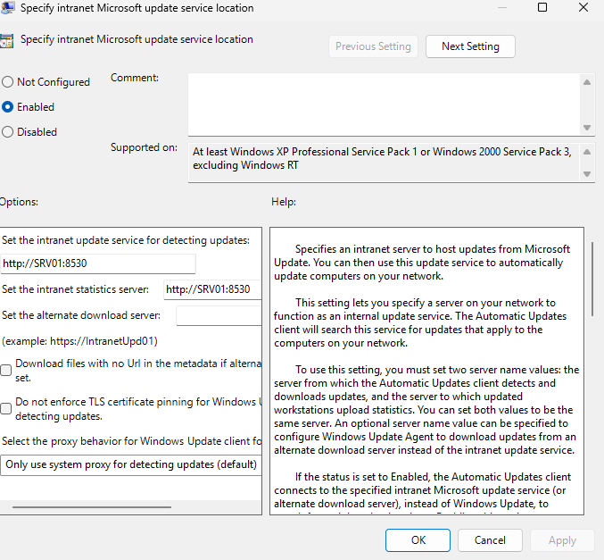
</p>

The first field configured update detection.

The second field configured update-status reporting.

---

## Step 15 — Enable Client-Side Targeting

Enabled:

```text
Enable client-side targeting
```

Configured the target group as:

```text
Pilot-Computers
```

<p align="center">
  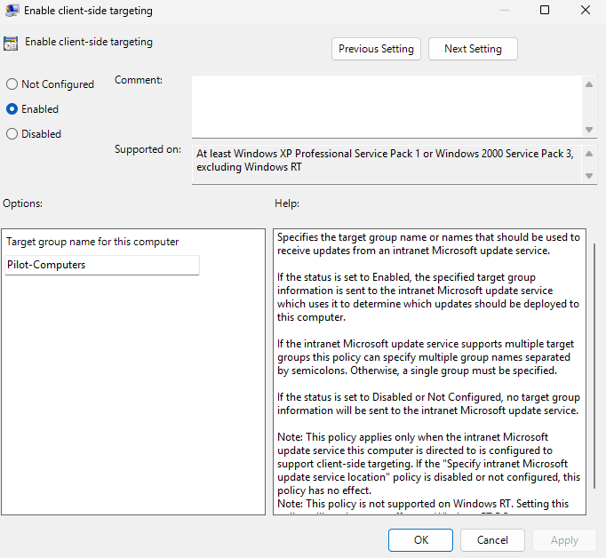
</p>

The group name had to exactly match the group created in WSUS.

---

## Step 16 — Configure Automatic Updates

Opened:

```text
Windows Update
└── Manage end user experience
    └── Configure Automatic Updates
```

Configured:

```text
Enabled
3 - Auto download and notify for install
```

<p align="center">
  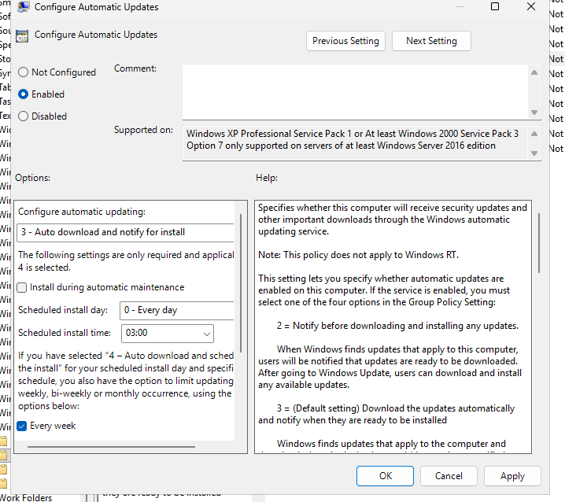
</p>

This setting allowed the client to download approved updates while keeping installation controlled during testing.

---

## Step 17 — Verify the Client WSUS Policy

Applied Group Policy on CLIENT01:

```powershell
gpupdate /force
```

Verified WSUS registry values:

```powershell
Get-ItemProperty `
    "HKLM:\SOFTWARE\Policies\Microsoft\Windows\WindowsUpdate" |
Select-Object `
    WUServer,
    WUStatusServer,
    TargetGroup,
    TargetGroupEnabled
```

Expected values:

```text
WUServer           : http://SRV01:8530
WUStatusServer     : http://SRV01:8530
TargetGroup        : Pilot-Computers
TargetGroupEnabled : 1
```

Verified Automatic Update settings:

```powershell
Get-ItemProperty `
    "HKLM:\SOFTWARE\Policies\Microsoft\Windows\WindowsUpdate\AU" |
Select-Object `
    AUOptions,
    UseWUServer
```

Expected values:

```text
AUOptions   : 3
UseWUServer : 1
```

<p align="center">
  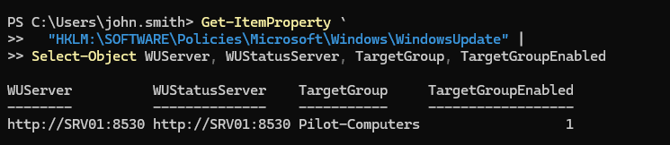
</p>

---

## Step 18 — Register CLIENT01 in WSUS

Tested connectivity:

```powershell
Test-NetConnection SRV01 -Port 8530
```

Expected result:

```text
TcpTestSucceeded : True
```

Triggered client detection and reporting:

```powershell
UsoClient StartScan
wuauclt /resetauthorization /detectnow
wuauclt /reportnow
```

CLIENT01 appeared under:

```text
Computers
└── Pilot-Computers
```

<p align="center">
  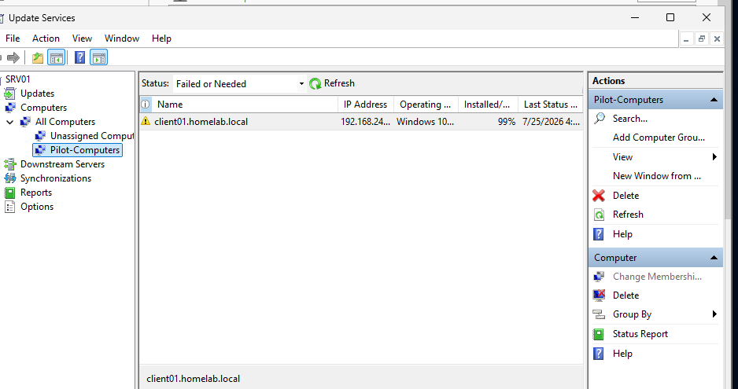
</p>

### Validation

This confirmed:

```text
GPO applied
+
Port 8530 reachable
+
Target group matched
+
Client reported to WSUS
=
CLIENT01 successfully registered
```

---

## Step 19 — Approve an Update for the Pilot Group

Opened:

```text
Updates
└── All Updates
```

Applied filters:

```text
Approval: Unapproved
Status: Needed
```

Selected an applicable update and approved it only for:

```text
Pilot-Computers
```

<p align="center">
  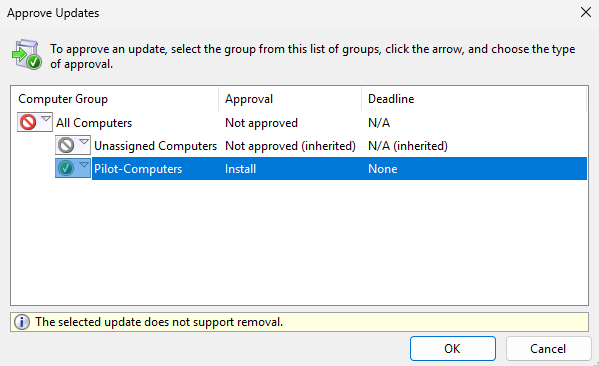
</p>

The update was not approved for `All Computers`.

### Approval Principle

```text
Test first
      ↓
Validate pilot results
      ↓
Approve more broadly
```

---

## Step 20 — Detect the Approved Update on CLIENT01

Opened Windows Update on CLIENT01 and checked for updates.

Also triggered a scan and report:

```powershell
UsoClient StartScan
wuauclt /detectnow
wuauclt /reportnow
```

<p align="center">
  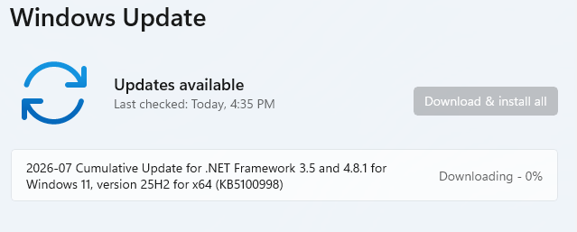
</p>

The client contacted the internal WSUS server instead of directly using Microsoft Update.

---

## Step 21 — Verify Update Deployment

Reviewed the selected update in the WSUS console.

The result showed:

```text
Computers with errors: 0
Computers needing this update: 0
Computers installed/not applicable: 1
Computers with no status: 0
```

<p align="center">
  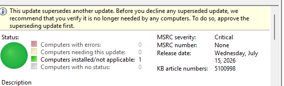
</p>

### Compliance Interpretation

```text
Needed = 0
Errors = 0
Installed/Not Applicable = 1
```

This confirmed that CLIENT01 was compliant for the selected update.

---

## Step 22 — Generate the WSUS Computer Status Report

Generated a status report for CLIENT01.

The report included:

- Computer name
- Operating system
- Update title
- Approval state
- Installation state
- Last status report
- Compliance status

<p align="center">
  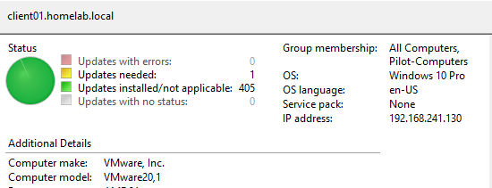
</p>

This completed the end-to-end deployment process:

```text
Synchronize
      ↓
Create pilot group
      ↓
Configure policy
      ↓
Register client
      ↓
Approve update
      ↓
Detect update
      ↓
Report compliance
```

---

# Troubleshooting Investigation

## Initial Synchronization Remained at 0%

The first synchronization remained at:

```text
0%
```

PowerShell showed:

```text
Status         : Running
Phase          : Categories
ProcessedItems : 0
TotalItems     : 4193
```

The status was checked with:

```powershell
Import-Module UpdateServices

$Wsus = Get-WsusServer `
    -Name "SRV01" `
    -PortNumber 8530

$Subscription = $Wsus.GetSubscription()

$Subscription.GetSynchronizationStatus()
```

Progress was checked with:

```powershell
$Progress = $Subscription.GetSynchronizationProgress()

[PSCustomObject]@{
    Status    = $Subscription.GetSynchronizationStatus()
    Phase     = $Progress.Phase
    Processed = $Progress.ProcessedItems
    Total     = $Progress.TotalItems
}
```

---

## Review the WSUS Log

The primary log file was:

```text
C:\Program Files\Update Services\LogFiles\SoftwareDistribution.log
```

The log was monitored with:

```powershell
Get-Content `
    "C:\Program Files\Update Services\LogFiles\SoftwareDistribution.log" `
    -Tail 20 `
    -Wait
```

Relevant entries included:

```text
Refreshing the category cache
Refreshing the revision cache
DeploymentChange
Execution Timeout Expired
Retryable SqlException
invalid update identity in XML
```

The log file length continued increasing:

```powershell
Get-Item `
    "C:\Program Files\Update Services\LogFiles\SoftwareDistribution.log" |
Select-Object `
    Length,
    LastWriteTime
```

This showed that WSUS was performing database work even though the console remained at 0%.

---

## Synchronization Root Cause

The main problem was that the WSUS Server Configuration Wizard had not been completed before synchronization was started.

The incomplete configuration meant the WSUS subscription did not yet have the final:

- Upstream source
- Language
- Product scope
- Classification scope
- Synchronization schedule

After completing the wizard, synchronization progressed much faster.

### Root-Cause Chain

```text
WSUS role installed
        ↓
Configuration Wizard incomplete
        ↓
Synchronization started early
        ↓
Categories phase remained at 0%
        ↓
Wizard completed
        ↓
Controlled product scope applied
        ↓
Synchronization progressed normally
```

---

## Windows Internal Database Timeouts

The log contained:

```text
Execution Timeout Expired
```

```text
Transaction was deadlocked on lock resources
```

```text
ImportUpdateForCatalogSync caught a Retryable SqlException
```

The timeouts indicated that Windows Internal Database was taking too long to import some update metadata.

Because the errors were marked as retryable and the log continued changing, WSUS was initially treated as slow rather than completely stopped.

No immediate SUSDB deletion or WSUS reinstallation was performed.

---

## IIS WsusPool Tuning

Opened IIS Manager:

```text
Internet Information Services Manager
└── Application Pools
    └── WsusPool
```

Configured:

```text
Queue Length: 25000
Private Memory Limit: 0
```

The WsusPool application pool was then recycled.

Verified the application-pool state:

```powershell
Import-Module WebAdministration

Get-WebAppPoolState -Name WsusPool
```

Expected:

```text
Started
```

Verified the configuration:

```powershell
Get-ItemProperty "IIS:\AppPools\WsusPool" |
Select-Object `
    Name,
    queueLength,
    @{Name="PrivateMemoryKB";Expression={
        $_.recycling.periodicRestart.privateMemory
    }}
```

Expected:

```text
Name            : WsusPool
QueueLength     : 25000
PrivateMemoryKB : 0
```

---

## Server Resource Constraints

SRV01 initially showed:

```text
Total RAM: 4 GB
Free RAM: approximately 0.57 GB
```

The server was running several roles and services:

- Active Directory Domain Services
- DNS
- DHCP
- IIS
- Windows Internal Database
- WSUS
- Windows Admin Center

Memory was checked with:

```powershell
Get-CimInstance Win32_OperatingSystem |
Select-Object `
    @{Name="TotalRAMGB";Expression={
        [math]::Round($_.TotalVisibleMemorySize / 1MB, 2)
    }},
    @{Name="FreeRAMGB";Expression={
        [math]::Round($_.FreePhysicalMemory / 1MB, 2)
    }}
```

The VM memory was increased to provide more resources for WSUS and Windows Internal Database.

### Resource Lesson

```text
Removing an IIS memory limit
does not create physical RAM.
```

Adequate server resources are still required.

---

## Canceled Synchronizations

Two early synchronization attempts were manually canceled during troubleshooting.

The log showed:

```text
Synchronization stopped
User cancelled
Synchronization was canceled
Resetting Sync Anchors after failed sync
```

The final synchronization was allowed to run without interruption after the Configuration Wizard was completed.

Repeated cancellation should be avoided because WSUS may need to repeat catalog operations.

---

## PowerShell Prompt Copying Error

During troubleshooting, the PowerShell prompt was accidentally pasted with the command.

Incorrect:

```text
PS C:\Users\Administrator> Import-Module UpdateServices
```

Correct:

```powershell
Import-Module UpdateServices
```

PowerShell interpreted `PS` as the `Get-Process` alias, which caused command errors.

The PowerShell prompt and command output should not be copied back into the terminal.

---

# Troubleshooting Guide

## WSUS Console Cannot Connect to SRV01

Check the WSUS service:

```powershell
Get-Service WsusService
```

Check IIS:

```powershell
Get-Service W3SVC
```

Check Windows Internal Database:

```powershell
Get-Service 'MSSQL$MICROSOFT##WID'
```

Check WSUS connectivity:

```powershell
Test-NetConnection SRV01 -Port 8530
```

---

## Synchronization Does Not Start

Check the upstream configuration:

```text
SRV01
└── Options
    └── Update Source and Proxy Server
```

Verify that the source is:

```text
Synchronize from Microsoft Update
```

Check internet connectivity from SRV01:

```powershell
Test-NetConnection sws.update.microsoft.com -Port 443
```

Check synchronization status:

```powershell
Import-Module UpdateServices

$Wsus = Get-WsusServer `
    -Name "SRV01" `
    -PortNumber 8530

$Subscription = $Wsus.GetSubscription()

$Subscription.GetSynchronizationStatus()
```

---

## Synchronization Remains at 0%

Check the current phase:

```powershell
$Progress = $Subscription.GetSynchronizationProgress()

$Progress | Format-List *
```

Review:

```text
Phase
ProcessedItems
TotalItems
```

Check whether the log continues changing:

```powershell
Get-Item `
    "C:\Program Files\Update Services\LogFiles\SoftwareDistribution.log" |
Select-Object `
    Length,
    LastWriteTime
```

Do not declare the server frozen based only on the GUI percentage.

---

## CLIENT01 Does Not Appear in WSUS

Apply Group Policy:

```powershell
gpupdate /force
```

Verify the WSUS registry settings:

```powershell
Get-ItemProperty `
    "HKLM:\SOFTWARE\Policies\Microsoft\Windows\WindowsUpdate"
```

Test connectivity:

```powershell
Test-NetConnection SRV01 -Port 8530
```

Trigger detection and reporting:

```powershell
UsoClient StartScan
wuauclt /resetauthorization /detectnow
wuauclt /reportnow
```

Verify that the Group Policy target name exactly matches:

```text
Pilot-Computers
```

---

## CLIENT01 Shows No Internet

Test internal WSUS connectivity:

```powershell
Test-NetConnection SRV01 -Port 8530
```

If the result is:

```text
TcpTestSucceeded : True
```

the client can still use WSUS.

The Windows network icon may report no internet while internal domain and WSUS communication remain functional.

---

## Approved Update Does Not Appear

Verify that the update is approved for:

```text
Pilot-Computers
```

Confirm that CLIENT01 belongs to the same group.

Trigger a scan:

```powershell
UsoClient StartScan
```

Trigger reporting:

```powershell
wuauclt /reportnow
```

Open:

```text
Settings
└── Windows Update
    └── Check for updates
```

Allow time for detection and reporting.

---

## Last Status Report Does Not Update

Run:

```powershell
wuauclt /reportnow
```

Confirm policy values:

```powershell
Get-ItemProperty `
    "HKLM:\SOFTWARE\Policies\Microsoft\Windows\WindowsUpdate" |
Select-Object `
    WUServer,
    WUStatusServer
```

Expected:

```text
http://SRV01:8530
```

Refresh the WSUS console after several minutes.

---

## Update Shows Installed/Not Applicable

This is a compliant result.

```text
Installed
=
The update was successfully installed
```

```text
Not Applicable
=
The update does not apply to the computer
```

Both states mean the computer does not currently require the update.

---

# Useful PowerShell Commands

## Install WSUS

```powershell
Install-WindowsFeature `
    -Name UpdateServices `
    -IncludeManagementTools
```

---

## Verify WSUS Features

```powershell
Get-WindowsFeature -Name UpdateServices*
```

---

## Complete WSUS Post-Installation

```powershell
& "C:\Program Files\Update Services\Tools\WsusUtil.exe" `
    postinstall CONTENT_DIR="C:\WSUS"
```

---

## Check WSUS Services

```powershell
Get-Service `
    WsusService,
    W3SVC,
    'MSSQL$MICROSOFT##WID' |
Select-Object `
    Name,
    Status,
    StartType
```

---

## Connect to WSUS

```powershell
Import-Module UpdateServices

$Wsus = Get-WsusServer `
    -Name "SRV01" `
    -PortNumber 8530
```

---

## Check Synchronization Status

```powershell
$Subscription = $Wsus.GetSubscription()

$Subscription.GetSynchronizationStatus()
```

---

## Check Synchronization Progress

```powershell
$Progress = $Subscription.GetSynchronizationProgress()

[PSCustomObject]@{
    Status    = $Subscription.GetSynchronizationStatus()
    Phase     = $Progress.Phase
    Processed = $Progress.ProcessedItems
    Total     = $Progress.TotalItems
    Percent   = if ($Progress.TotalItems -gt 0) {
        [math]::Round(
            ($Progress.ProcessedItems / $Progress.TotalItems) * 100,
            2
        )
    } else {
        0
    }
}
```

---

## Review Synchronization History

```powershell
$Subscription.GetSynchronizationHistory() |
Select-Object -First 10 `
    StartTime,
    EndTime,
    Result,
    Error |
Format-List
```

---

## Monitor the WSUS Log

```powershell
Get-Content `
    "C:\Program Files\Update Services\LogFiles\SoftwareDistribution.log" `
    -Tail 20 `
    -Wait
```

---

## Check IIS WsusPool

```powershell
Import-Module WebAdministration

Get-WebAppPoolState -Name WsusPool
```

---

## Review WsusPool Configuration

```powershell
Get-ItemProperty "IIS:\AppPools\WsusPool" |
Select-Object `
    Name,
    queueLength,
    @{Name="PrivateMemoryKB";Expression={
        $_.recycling.periodicRestart.privateMemory
    }}
```

---

## Verify Client WSUS Policy

```powershell
Get-ItemProperty `
    "HKLM:\SOFTWARE\Policies\Microsoft\Windows\WindowsUpdate" |
Select-Object `
    WUServer,
    WUStatusServer,
    TargetGroup,
    TargetGroupEnabled
```

---

## Verify Automatic Update Policy

```powershell
Get-ItemProperty `
    "HKLM:\SOFTWARE\Policies\Microsoft\Windows\WindowsUpdate\AU" |
Select-Object `
    AUOptions,
    UseWUServer
```

---

## Test WSUS Connectivity

```powershell
Test-NetConnection SRV01 -Port 8530
```

---

## Test WSUS Web Service

```powershell
Invoke-WebRequest `
    -Uri "http://SRV01:8530/ClientWebService/client.asmx" `
    -UseBasicParsing
```

---

## Trigger Client Detection

```powershell
UsoClient StartScan
wuauclt /resetauthorization /detectnow
```

---

## Trigger Client Reporting

```powershell
wuauclt /reportnow
```

---

## Review Installed Updates

```powershell
Get-HotFix |
Sort-Object InstalledOn -Descending |
Select-Object -First 10 `
    HotFixID,
    Description,
    InstalledOn
```

---

## Review Installed Windows Packages

```powershell
Get-WindowsPackage -Online |
Where-Object PackageState -eq "Installed" |
Sort-Object InstallTime -Descending |
Select-Object -First 10 `
    PackageName,
    InstallTime
```

---

# Security Notes

## Use Pilot Deployment Groups

Updates should be tested before wider approval.

A recommended structure is:

```text
Pilot-Computers
Production-Workstations
Production-Servers
```

Updates can move through each group after validation.

---

## Avoid Broad Product Selection

Selecting unnecessary products increases:

- Database size
- Synchronization time
- Console processing
- Storage requirements
- Maintenance complexity

Only supported products should be synchronized.

---

## Separate Drivers and Upgrades

Drivers and operating-system upgrades can create a much larger update catalog.

They should be reviewed and managed separately from normal security and quality updates.

---

## Restrict WSUS Administration

Only authorized administrators should be able to:

- Change synchronization settings
- Approve updates
- Decline updates
- Modify computer groups
- Change server options
- Generate reports

---

## Protect WSUS Evidence

Screenshots and reports may contain:

- Computer names
- Domain names
- IP addresses
- Operating-system versions
- Patch status
- Internal update architecture
- Failure details
- Security-update information

Evidence should be sanitized before public publication when required.

---

## Monitor Superseded Updates

A superseded update should not be immediately declined without confirming that no managed computer still requires it.

Supersedence should be reviewed before cleanup actions are performed.

---

# Validation Results

| Validation Check | Result |
|---|---|
| WSUS role installed | ✅ |
| WID Connectivity installed | ✅ |
| WSUS content directory created | ✅ |
| Post-installation task completed | ✅ |
| WSUS service running | ✅ |
| WSUS console opened | ✅ |
| Configuration Wizard completed | ✅ |
| Microsoft Update configured as upstream source | ✅ |
| English language selected | ✅ |
| Required products selected | ✅ |
| Required classifications selected | ✅ |
| Initial synchronization completed | ✅ |
| Pilot-Computers group created | ✅ |
| Client-side targeting enabled | ✅ |
| WSUS-Pilot-Policy created | ✅ |
| Internal update service configured | ✅ |
| Automatic Updates configured | ✅ |
| CLIENT01 policy verified | ✅ |
| Port 8530 reachable | ✅ |
| CLIENT01 registered in WSUS | ✅ |
| Update approved for pilot group | ✅ |
| CLIENT01 evaluated approved update | ✅ |
| Computers needing update | 0 |
| Computers with errors | 0 |
| Installed/Not Applicable | 1 |
| Computer status report generated | ✅ |

---

# Skills Demonstrated

- Windows Server Update Services
- Windows Server 2025
- Windows Internal Database
- IIS Administration
- IIS Application Pool Configuration
- Group Policy Management
- Windows Update Policy
- WSUS Synchronization
- Product and Classification Scoping
- Computer Group Management
- Client-Side Targeting
- Pilot-Ring Deployment
- Update Approval
- Update Compliance Reporting
- Windows Registry Validation
- PowerShell Administration
- TCP Connectivity Testing
- WSUS Client Troubleshooting
- Synchronization Log Analysis
- Database Timeout Investigation
- Server Resource Analysis
- Evidence-Based Troubleshooting
- Technical Documentation

---

# Interview Notes

## What is WSUS?

Windows Server Update Services is a Windows Server role used to centrally synchronize, approve, distribute, and report Microsoft product updates.

---

## Why use WSUS instead of direct Windows Update?

WSUS provides:

- Central approval
- Controlled deployment
- Computer grouping
- Compliance reporting
- Reduced repeated internet downloads
- Product and classification control

---

## What is an upstream WSUS source?

The upstream source is where the WSUS server retrieves update metadata.

In this project, the upstream source was Microsoft Update.

---

## What is Windows Internal Database?

Windows Internal Database is the database engine used by WSUS to store update metadata, approvals, synchronization information, and computer status.

---

## Why should product selection be limited?

Selecting unnecessary products increases synchronization time, database growth, storage use, and administrative complexity.

---

## What is a WSUS computer group?

A computer group is a logical collection of managed computers used to control update approvals.

---

## What is client-side targeting?

Client-side targeting uses Group Policy or registry values to automatically place a computer into a specific WSUS computer group.

---

## Why use a pilot group?

A pilot group allows updates to be tested on a small number of systems before wider deployment.

This reduces the risk of a problematic update affecting the entire environment.

---

## Does synchronization automatically install updates?

No.

The update still needs to be reviewed and approved for a computer group.

---

## What does Installed/Not Applicable mean?

It means the update was installed or the update does not apply to the computer.

Both states are compliant.

---

## Does a WSUS client need internet access?

Not necessarily.

The client only needs connectivity to the internal WSUS server.

The WSUS server requires internet access when synchronizing directly from Microsoft Update.

---

## Why did the initial synchronization remain at 0%?

The WSUS Configuration Wizard had not been completed, and Windows Internal Database was also experiencing slow imports and timeouts.

After completing the wizard and reducing the synchronization scope, the synchronization progressed normally.

---

## What is WsusPool?

WsusPool is the IIS application pool used by WSUS web services.

Application-pool limits can affect WSUS console and client communication stability.

---

## How would you troubleshoot a WSUS synchronization failure?

I would:

1. Confirm the WSUS service is running.
2. Confirm IIS and WID are running.
3. Verify the upstream source.
4. Test internet connectivity from the WSUS server.
5. Review synchronization history.
6. Review `SoftwareDistribution.log`.
7. Check the current synchronization phase.
8. Check product and classification scope.
9. Review IIS WsusPool settings.
10. Review server memory and disk resources.
11. Avoid deleting SUSDB or reinstalling WSUS without evidence.

---

## How would you troubleshoot a missing WSUS client?

I would:

1. Run `gpupdate /force`.
2. Verify the WSUS registry values.
3. Confirm the client uses `http://SRV01:8530`.
4. Test port 8530.
5. Confirm the client-side target group name.
6. Trigger a Windows Update scan.
7. Trigger WSUS reporting.
8. Refresh the WSUS console.

---

# What I Learned

The most important lesson from this module was that WSUS depends on correct scope and configuration.

The first synchronization remained at 0% because the Configuration Wizard had not been fully completed.

```text
Role installation
does not automatically mean
WSUS configuration is complete
```

I also learned that synchronization progress should not be judged only from the graphical percentage.

The console showed 0%, while the log showed database and cache activity.

```text
GUI progress
is only one source of evidence
```

The correct troubleshooting approach was:

```text
Check synchronization status
      ↓
Check current phase
      ↓
Review log timestamps
      ↓
Review database errors
      ↓
Check IIS
      ↓
Check server resources
```

I learned that IIS tuning and physical memory solve different problems.

```text
WsusPool tuning
improves application-pool stability
```

```text
Additional RAM
improves overall server capacity
```

I also learned that a client can successfully use an internal WSUS server even when Windows reports no direct internet connectivity.

```text
No direct internet
does not mean
no internal WSUS connectivity
```

The complete update workflow I want to remember is:

```text
Synchronize
      ↓
Review
      ↓
Approve
      ↓
Detect
      ↓
Install or evaluate
      ↓
Report
      ↓
Validate
```

---

# Future Improvements

To expand this module, I would add:

- Automatic synchronization scheduling
- Separate workstation and server groups
- Multiple pilot rings
- Production approval groups
- Automatic approval rules
- WSUS cleanup scheduling
- SUSDB reindexing
- Database statistics maintenance
- WSUS SSL configuration
- HTTPS client communication
- Dedicated WSUS server deployment
- Downstream WSUS server configuration
- Replica-mode deployment
- PowerShell-based update approval
- Automated compliance reporting
- Email update reports
- Microsoft Teams alerting
- Failed-update notifications
- Update deadline configuration
- Maintenance-window planning
- Reboot coordination
- Server-patching policies
- Workstation-patching policies
- Driver-management strategy
- Feature-update deployment
- Microsoft Defender definition updates
- WSUS backup and recovery testing
- Integration with Microsoft Sentinel
- Patch-management dashboard
- Monthly patch-cycle documentation

Future computer groups could include:

```text
Pilot-Workstations
Production-Workstations
Pilot-Servers
Production-Servers
Critical-Servers
Manual-Approval-Systems
```

Future reports could include:

```text
Monthly-Update-Compliance.csv
Failed-Updates.csv
Missing-Security-Updates.csv
Computer-Last-Report.csv
Pilot-Deployment-Results.csv
WSUS-Synchronization-History.csv
```

---

# Key Takeaways

This module demonstrated centralized Windows patch management through Windows Server Update Services.

The implementation included:

- Installing WSUS
- Configuring Windows Internal Database
- Creating a WSUS content directory
- Completing post-installation tasks
- Configuring Microsoft Update
- Selecting products and classifications
- Completing the initial synchronization
- Creating a pilot deployment group
- Configuring Group Policy
- Enabling client-side targeting
- Registering CLIENT01
- Approving a pilot update
- Triggering update detection
- Verifying update compliance
- Generating a status report
- Troubleshooting database timeouts
- Tuning WsusPool
- Reviewing memory constraints

The primary conclusions were:

```text
The WSUS Configuration Wizard must be completed before synchronization.
```

```text
Product and classification scope should be limited.
```

```text
Pilot groups reduce deployment risk.
```

```text
A synchronized update is not deployed until it is approved.
```

```text
A client can use WSUS without direct internet access.
```

```text
Installed and Not Applicable are compliant states.
```

```text
The final test update had zero errors and zero computers still needing it.
```

---

<div align="center">

### Module Status

✅ Completed Successfully

**Final Compliance Result**

```text
Computers with errors: 0
Computers needing this update: 0
Computers installed/not applicable: 1
Computers with no status: 0
```

**Next Module:** [Server Monitoring](../04-Server-Monitoring/)

</div>
