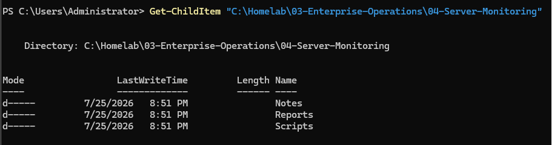
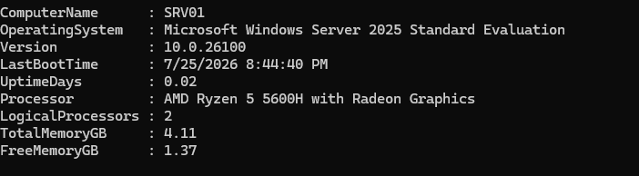
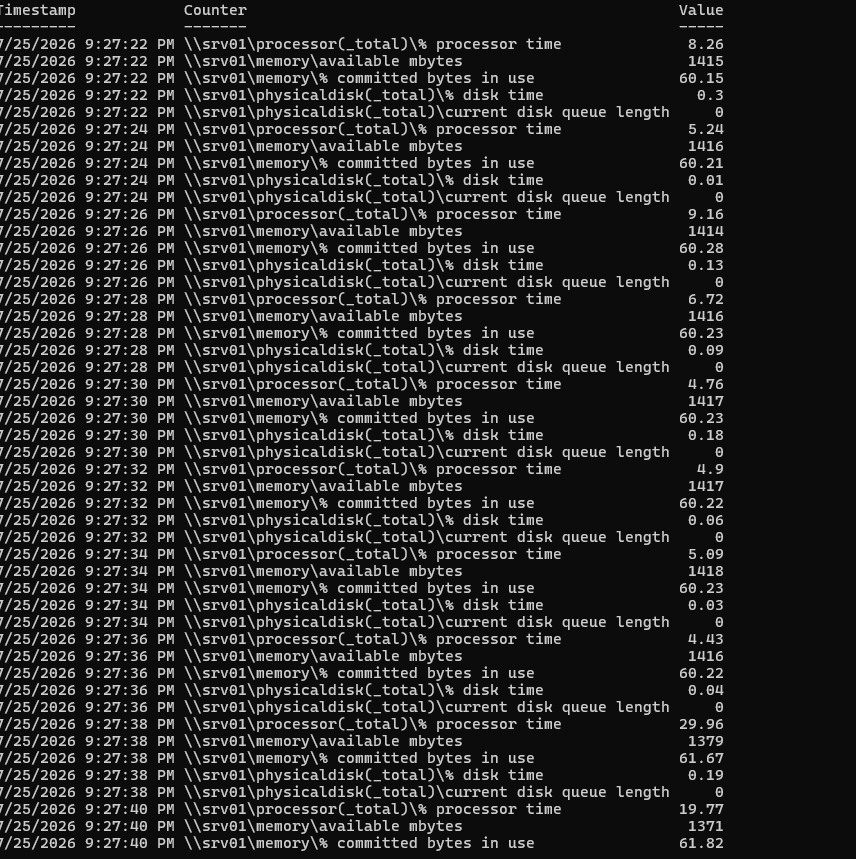
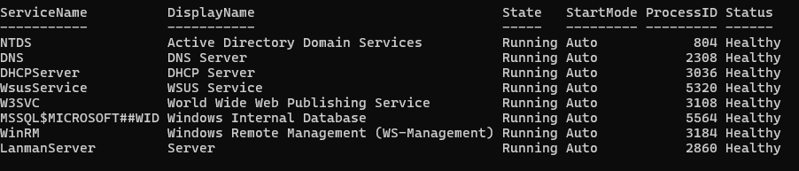
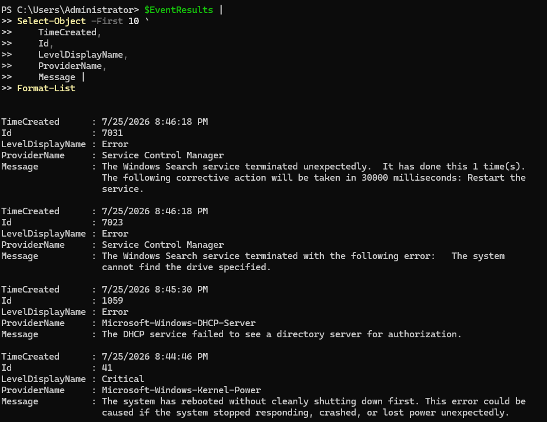
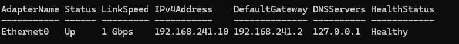
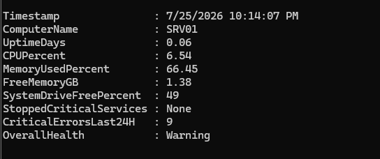
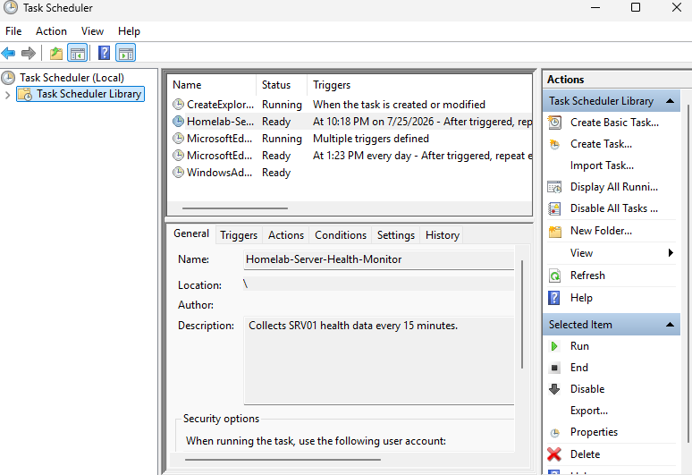
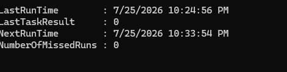
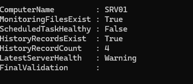

<div align="center">


</div>

---

# Overview

This module documents the implementation of a PowerShell-based server monitoring solution for SRV01 in the `homelab.local` environment.

The goal was to create a repeatable monitoring workflow that collects server-health information, exports operational reports, reviews critical services and events, checks storage and network health, and automatically records historical monitoring data.

The implementation included:

- Creating a structured Server Monitoring project folder
- Collecting an initial server-health baseline
- Recording operating-system and uptime information
- Reviewing processor and memory resources
- Reviewing local disk capacity
- Collecting live CPU performance data
- Collecting memory performance data
- Collecting disk performance data
- Exporting performance counters to CSV
- Monitoring critical infrastructure services
- Reviewing recent Critical and Error events
- Monitoring logical disk capacity
- Reviewing physical disk health
- Reviewing network-interface configuration
- Testing infrastructure service ports
- Verifying DNS resolution
- Verifying the Active Directory secure channel
- Reviewing network packet statistics
- Creating an automated server-health summary script
- Calculating an overall health state
- Creating a scheduled monitoring task
- Running the task under the Local System account
- Appending timestamped records to a historical CSV file
- Validating scheduled task execution
- Verifying all required scripts and reports
- Performing final monitoring validation

This module demonstrates how PowerShell can be used to build a lightweight server-monitoring workflow without requiring a separate enterprise monitoring platform.

---

# Why I Built This Module

Windows administrators need more than a single dashboard snapshot to understand server health.

A server may appear online while still experiencing:

- High CPU utilization
- Memory pressure
- Low disk capacity
- Failed infrastructure services
- Critical event-log entries
- DNS problems
- Network-interface errors
- Update-service failures
- Database timeouts
- Repeated unexpected restarts

Manual checks are useful, but they become inefficient when they must be repeated regularly.

I built this module to understand how PowerShell can be used to:

- Collect server-health data
- Export results
- Apply monitoring thresholds
- Create repeatable reports
- Automate scheduled collection
- Maintain historical health records
- Validate that monitoring is operating correctly

The most important lesson from this module was:

```text
A server being online
does not automatically mean
the server is healthy.
```

Another important lesson was:

```text
Monitoring should be repeatable,
measurable,
and historical.
```

---

# Business Scenario

The Infrastructure Team manages SRV01, which hosts several important services in the `homelab.local` environment.

SRV01 performs multiple infrastructure roles, including:

- Active Directory Domain Services
- DNS
- DHCP
- Windows Server Update Services
- IIS
- Windows Internal Database
- Windows Remote Management
- File and server services

The team needs to:

- Establish a server-health baseline
- Monitor processor utilization
- Monitor memory availability
- Monitor disk utilization
- Check critical service status
- Review recent system errors
- Monitor storage capacity
- Verify network configuration
- Test infrastructure ports
- Generate health reports
- Collect historical monitoring data
- Detect Warning and Critical conditions
- Confirm that monitoring runs automatically
- Document the final monitoring state

The administrator should avoid restarting services or the server without first collecting evidence.

---

# Monitoring Method

This module follows the B.A.S.E. monitoring model:

```text
B — Baseline
Record the normal state of the server.

A — Analyze
Collect performance, service, event, disk, and network data.

S — Schedule
Automate the monitoring process.

E — Evaluate
Review health thresholds and validate the monitoring workflow.
```

The monitoring workflow used in this module was:

```text
Create project structure
      ↓
Collect initial baseline
      ↓
Collect live performance counters
      ↓
Review critical services
      ↓
Review Critical and Error events
      ↓
Review disk capacity
      ↓
Review network health
      ↓
Create health-summary script
      ↓
Create scheduled task
      ↓
Generate historical records
      ↓
Perform final validation
```

---

# Learning Objectives

By completing this module, I practiced the following:

- Creating a structured monitoring repository
- Using PowerShell for server-health collection
- Querying Windows operating-system information
- Calculating server uptime
- Reviewing processor details
- Reviewing physical memory
- Reviewing local logical disks
- Using `Get-Counter`
- Collecting CPU performance counters
- Collecting memory performance counters
- Collecting disk performance counters
- Exporting data to CSV
- Querying Windows services
- Checking service startup modes
- Calculating service-health status
- Querying Windows event logs
- Filtering Critical and Error events
- Exporting event data
- Calculating free-space percentages
- Applying disk thresholds
- Reviewing physical disk health
- Reviewing storage reliability counters
- Querying network adapters
- Reviewing IPv4 addressing
- Reviewing default gateways
- Reviewing DNS configuration
- Testing TCP ports
- Testing DNS resolution
- Testing the domain secure channel
- Reviewing network packet errors
- Creating PowerShell scripts
- Creating health thresholds
- Calculating an overall health state
- Creating wrapper scripts
- Creating scheduled tasks
- Running scheduled tasks as SYSTEM
- Appending results to CSV files
- Validating scheduled task results
- Verifying monitoring files
- Documenting an automated monitoring workflow

---

# Key Concepts Learned

## Server Baseline

A server baseline is a recorded snapshot of the system under normal operating conditions.

A baseline may include:

- Computer name
- Operating system
- Operating-system version
- Last boot time
- Uptime
- Processor model
- Logical processor count
- Total memory
- Free memory
- Disk capacity
- Free disk space

A baseline provides a reference for future comparisons.

---

## Performance Counters

Windows performance counters provide numerical measurements of resource activity.

Counters used in this module included:

```text
Processor(_Total)\% Processor Time
Memory\Available MBytes
Memory\% Committed Bytes In Use
PhysicalDisk(_Total)\% Disk Time
PhysicalDisk(_Total)\Current Disk Queue Length
```

Performance counters provide better evidence than relying only on a single graphical snapshot.

---

## CPU Utilization

CPU utilization represents how much processor capacity is being used.

Brief increases may occur during:

- PowerShell execution
- Windows updates
- Database operations
- Event-log review
- Server-management queries
- Scheduled tasks
- Security scanning

A more serious processor problem would normally involve sustained high utilization.

The lab thresholds used in the summary script were:

```text
Warning  = CPU at or above 80%
Critical = CPU at or above 90%
```

---

## Memory Utilization

Memory monitoring should include more than total utilization.

Useful measurements include:

- Total physical memory
- Available memory
- Percentage of committed memory in use
- Process working sets
- Paging activity
- Whether free memory continually decreases

The lab thresholds were:

```text
Warning  = Memory at or above 80%
Critical = Memory at or above 90%
```

---

## Disk Capacity

Low disk capacity can affect:

- Windows updates
- WSUS content
- Event logs
- Windows Internal Database
- Temporary files
- Application operation
- System stability

The lab thresholds used were:

```text
Healthy  = 20% or more free space
Warning  = Less than 20% free space
Critical = Less than 10% free space
```

These thresholds can be adjusted for production environments.

---

## Service Monitoring

A server can be online while an important service is stopped.

Critical services reviewed in this module included:

```text
NTDS
DNS
DHCPServer
WsusService
W3SVC
MSSQL$MICROSOFT##WID
WinRM
LanmanServer
```

Each service was reviewed for:

- Current state
- Startup mode
- Process ID
- Calculated health status

---

## Event Monitoring

Current performance data does not always show historical failures.

Windows event logs provide evidence about:

- Unexpected shutdowns
- Service failures
- DNS failures
- DHCP failures
- Storage problems
- Authentication problems
- WSUS failures
- IIS problems
- Database timeouts

This module collected Critical and Error events from the previous seven days.

---

## Network Monitoring

Network health includes more than successful ping responses.

The monitoring checks included:

- Adapter operational state
- Link speed
- MAC address
- IPv4 address
- Default gateway
- DNS servers
- TCP service-port tests
- DNS resolution
- Active Directory secure channel
- Packet-discard statistics
- Packet-error statistics

---

## Automated Health Summary

The health-summary script combined several checks into one result.

It collected:

```text
Timestamp
Computer name
Uptime
CPU utilization
Memory utilization
Free memory
System-drive free space
Stopped critical services
Critical and Error events
Overall health
```

The script calculated one of three states:

```text
Healthy
Warning
Critical
```

---

## Scheduled Monitoring

A scheduled task allows monitoring to continue without manual execution.

The scheduled task created in this module was:

```text
Homelab-Server-Health-Monitor
```

It runs:

```text
Every 15 minutes
```

under:

```text
NT AUTHORITY\SYSTEM
```

The task appends each result to:

```text
Reports\Server-Health-History.csv
```

This creates historical monitoring data.

---

# Lab Environment Specifications

| Component | Configuration |
|---|---|
| Monitored Server | SRV01 |
| Server FQDN | `SRV01.homelab.local` |
| Server Operating System | Windows Server 2025 Standard Evaluation |
| Active Directory Domain | `homelab.local` |
| Client Computer | CLIENT01 |
| Client Operating System | Windows 11 Enterprise |
| Monitoring Method | PowerShell |
| Report Format | CSV |
| Scheduled Task | `Homelab-Server-Health-Monitor` |
| Scheduled Account | Local System |
| Monitoring Interval | 15 minutes |
| Primary Event Log | System |
| Hypervisor | VMware Workstation Pro |
| Repository Module | `04-Server-Monitoring` |

---

# Folder Structure

```text
03-Enterprise-Operations
│
└── 04-Server-Monitoring
    │
    ├── README.md
    │
    ├── Evidence
    │   └── Screenshots
    │       ├── 01-Server-Monitoring-Project-Folder.png
    │       ├── 02-Initial-Server-Health-Baseline.png
    │       ├── 03-Live-Performance-Counters.png
    │       ├── 04-Critical-Service-Health.png
    │       ├── 05-Recent-Critical-Error-Events.png
    │       ├── 06-Disk-Capacity-and-Storage-Health.png
    │       ├── 07-Network-Connectivity-and-Interface-Health.png
    │       ├── 08-Server-Health-Summary.png
    │       ├── 09-Create-Server-Monitoring-Scheduled-Task.png
    │       ├── 10-Verify-Scheduled-Monitoring-Report.png
    │       └── 11-Server-Monitoring-Final-Validation.png
    │
    ├── Reports
    │   ├── Server-Performance-Baseline.csv
    │   ├── Critical-Service-Health.csv
    │   ├── Recent-Critical-Error-Events.csv
    │   ├── Disk-Capacity-Health.csv
    │   ├── Network-Connectivity-Health.csv
    │   ├── Server-Health-Summary.csv
    │   └── Server-Health-History.csv
    │
    ├── Scripts
    │   ├── Get-Server-Health-Summary.ps1
    │   └── Run-Server-Health-Monitor.ps1
    │
    └── Notes
```

---

# Step-by-Step Implementation

---

## Step 1 — Create the Server Monitoring Project Structure

Created the project folder:

```text
C:\Homelab\03-Enterprise-Operations\04-Server-Monitoring
```

Created subfolders for:

- Evidence
- Screenshots
- Reports
- Scripts
- Notes
- README documentation

The structure was reviewed using:

```powershell
Get-ChildItem `
    "C:\Homelab\03-Enterprise-Operations\04-Server-Monitoring" `
    -Recurse
```

A tree-style view could also be generated with:

```powershell
tree `
    "C:\Homelab\03-Enterprise-Operations\04-Server-Monitoring" `
    /F
```

<p align="center">
  
</p>

### Validation

```text
Project structure created
+
Evidence folders created
+
Report folders created
+
Script folders created
=
Monitoring repository ready
```

---

## Step 2 — Collect the Initial Server Health Baseline

Collected operating-system, uptime, processor, memory, and disk information from SRV01.

```powershell
$OS = Get-CimInstance Win32_OperatingSystem
$CPU = Get-CimInstance Win32_Processor
$Disk = Get-CimInstance Win32_LogicalDisk -Filter "DriveType=3"

[PSCustomObject]@{
    ComputerName     = $env:COMPUTERNAME
    OperatingSystem  = $OS.Caption
    Version          = $OS.Version
    LastBootTime     = $OS.LastBootUpTime
    UptimeDays       = [math]::Round(
        ((Get-Date) - $OS.LastBootUpTime).TotalDays,
        2
    )
    Processor         = $CPU.Name
    LogicalProcessors = $CPU.NumberOfLogicalProcessors
    TotalMemoryGB     = [math]::Round(
        $OS.TotalVisibleMemorySize / 1MB,
        2
    )
    FreeMemoryGB      = [math]::Round(
        $OS.FreePhysicalMemory / 1MB,
        2
    )
} | Format-List
```

Disk capacity was reviewed using:

```powershell
$Disk |
Select-Object `
    DeviceID,
    VolumeName,
    @{Name="SizeGB";Expression={
        [math]::Round($_.Size / 1GB, 2)
    }},
    @{Name="FreeSpaceGB";Expression={
        [math]::Round($_.FreeSpace / 1GB, 2)
    }},
    @{Name="FreePercent";Expression={
        [math]::Round(
            ($_.FreeSpace / $_.Size) * 100,
            2
        )
    }} |
Format-Table -AutoSize
```

<p align="center">
  
</p>

### Purpose

The baseline created a reference point for:

- Uptime
- Processor capacity
- Available memory
- Disk capacity
- Future monitoring comparisons

---

## Step 3 — Collect Live Performance Counters

Collected approximately 20 seconds of performance data.

```powershell
$ReportPath = "C:\Homelab\03-Enterprise-Operations\04-Server-Monitoring\Reports"
$ReportFile = Join-Path `
    $ReportPath `
    "Server-Performance-Baseline.csv"

$Samples = Get-Counter `
    '\Processor(_Total)\% Processor Time',
    '\Memory\Available MBytes',
    '\Memory\% Committed Bytes In Use',
    '\PhysicalDisk(_Total)\% Disk Time',
    '\PhysicalDisk(_Total)\Current Disk Queue Length' `
    -SampleInterval 2 `
    -MaxSamples 10
```

Converted the counter data into structured objects:

```powershell
$Results = foreach ($SampleSet in $Samples.CounterSamples) {
    [PSCustomObject]@{
        Timestamp = $SampleSet.Timestamp
        Counter   = $SampleSet.Path
        Value     = [math]::Round(
            $SampleSet.CookedValue,
            2
        )
    }
}
```

Exported the results:

```powershell
$Results |
Export-Csv `
    -Path $ReportFile `
    -NoTypeInformation
```

<p align="center">
  
</p>

### Report

[`Server-Performance-Baseline.csv`](Reports/Server-Performance-Baseline.csv)

### Monitoring Areas

```text
Processor utilization
Available physical memory
Committed memory usage
Disk utilization
Disk queue length
```

---

## Step 4 — Monitor Critical Server Services

Reviewed critical infrastructure services using PowerShell.

```powershell
$CriticalServices = @(
    "NTDS",
    "DNS",
    "DHCPServer",
    "WsusService",
    "W3SVC",
    "MSSQL`$MICROSOFT##WID",
    "WinRM",
    "LanmanServer"
)
```

Collected service state, startup mode, process ID, and calculated status:

```powershell
$ServiceResults = foreach ($ServiceName in $CriticalServices) {
    $Service = Get-CimInstance Win32_Service `
        -Filter "Name='$ServiceName'" `
        -ErrorAction SilentlyContinue

    if ($Service) {
        [PSCustomObject]@{
            ComputerName = $env:COMPUTERNAME
            ServiceName  = $Service.Name
            DisplayName  = $Service.DisplayName
            State        = $Service.State
            StartMode    = $Service.StartMode
            ProcessID    = $Service.ProcessId
            Status       = if (
                $Service.State -eq "Running" -and
                $Service.StartMode -ne "Disabled"
            ) {
                "Healthy"
            }
            else {
                "Review Required"
            }
        }
    }
}
```

Exported the report:

```powershell
$ServiceResults |
Export-Csv `
    -Path "C:\Homelab\03-Enterprise-Operations\04-Server-Monitoring\Reports\Critical-Service-Health.csv" `
    -NoTypeInformation
```

<p align="center">
  
</p>

### Report

[`Critical-Service-Health.csv`](Reports/Critical-Service-Health.csv)

### Validation Principle

```text
Server online
does not automatically mean
critical services are running
```

---

## Step 5 — Review Recent Critical and Error Events

Collected recent Critical and Error events from the System log.

```powershell
$StartTime = (Get-Date).AddDays(-7)

$EventResults = Get-WinEvent `
    -FilterHashtable @{
        LogName   = "System"
        Level     = 1, 2
        StartTime = $StartTime
    } `
    -ErrorAction SilentlyContinue |
Select-Object -First 50 `
    TimeCreated,
    Id,
    LevelDisplayName,
    ProviderName,
    MachineName,
    @{Name="Message";Expression={
        ($_.Message -replace "`r|`n", " ").Trim()
    }}
```

Event levels:

```text
1 = Critical
2 = Error
```

Exported the results:

```powershell
$EventResults |
Export-Csv `
    -Path "C:\Homelab\03-Enterprise-Operations\04-Server-Monitoring\Reports\Recent-Critical-Error-Events.csv" `
    -NoTypeInformation
```

<p align="center">
  
</p>

### Report

[`Recent-Critical-Error-Events.csv`](Reports/Recent-Critical-Error-Events.csv)

### Events Reviewed For

- Unexpected shutdowns
- Service failures
- DNS errors
- DHCP errors
- WSUS failures
- IIS failures
- Storage problems
- Database timeouts
- Network failures

---

## Step 6 — Monitor Disk Capacity and Storage Health

Collected logical-disk capacity data.

```powershell
$DiskResults = Get-CimInstance Win32_LogicalDisk `
    -Filter "DriveType=3" |
ForEach-Object {
    $FreePercent = if ($_.Size -gt 0) {
        [math]::Round(
            ($_.FreeSpace / $_.Size) * 100,
            2
        )
    }
    else {
        0
    }

    $HealthStatus = if ($FreePercent -lt 10) {
        "Critical"
    }
    elseif ($FreePercent -lt 20) {
        "Warning"
    }
    else {
        "Healthy"
    }

    [PSCustomObject]@{
        ComputerName = $env:COMPUTERNAME
        Drive        = $_.DeviceID
        VolumeName   = $_.VolumeName
        FileSystem   = $_.FileSystem
        SizeGB       = [math]::Round(
            $_.Size / 1GB,
            2
        )
        UsedGB       = [math]::Round(
            ($_.Size - $_.FreeSpace) / 1GB,
            2
        )
        FreeSpaceGB  = [math]::Round(
            $_.FreeSpace / 1GB,
            2
        )
        FreePercent  = $FreePercent
        HealthStatus = $HealthStatus
    }
}
```

The thresholds were:

```text
Healthy  = 20% or more free space
Warning  = Less than 20% free space
Critical = Less than 10% free space
```

Physical disk status was reviewed:

```powershell
Get-PhysicalDisk |
Select-Object `
    FriendlyName,
    MediaType,
    HealthStatus,
    OperationalStatus,
    Size |
Format-Table -AutoSize
```

Storage reliability counters were also requested where supported:

```powershell
Get-PhysicalDisk |
ForEach-Object {
    $Disk = $_

    try {
        $Reliability = $Disk |
            Get-StorageReliabilityCounter

        [PSCustomObject]@{
            DiskName           = $Disk.FriendlyName
            TemperatureCelsius = $Reliability.Temperature
            ReadErrorsTotal    = $Reliability.ReadErrorsTotal
            WriteErrorsTotal   = $Reliability.WriteErrorsTotal
            Wear               = $Reliability.Wear
        }
    }
    catch {
        [PSCustomObject]@{
            DiskName           = $Disk.FriendlyName
            TemperatureCelsius = "Not Available"
            ReadErrorsTotal    = "Not Available"
            WriteErrorsTotal   = "Not Available"
            Wear               = "Not Available"
        }
    }
} |
Format-Table -AutoSize
```

Virtual hardware may not expose all storage reliability counters.

<p align="center">
  
</p>

### Report

[`Disk-Capacity-Health.csv`](Reports/Disk-Capacity-Health.csv)

---

## Step 7 — Monitor Network Connectivity and Interface Health

Collected network-adapter information:

```powershell
$NetworkAdapters = Get-NetAdapter |
Where-Object {
    $_.HardwareInterface -eq $true
}
```

Recorded:

- Adapter name
- Interface alias
- Operational state
- Link speed
- MAC address
- IPv4 address
- Default gateway
- DNS servers
- Calculated health status

```powershell
$NetworkResults = foreach ($Adapter in $NetworkAdapters) {
    $IPConfiguration = Get-NetIPConfiguration `
        -InterfaceIndex $Adapter.ifIndex `
        -ErrorAction SilentlyContinue

    $IPv4Address = (
        $IPConfiguration.IPv4Address.IPAddress
    ) -join ", "

    $Gateway = (
        $IPConfiguration.IPv4DefaultGateway.NextHop
    ) -join ", "

    $DNSServers = (
        Get-DnsClientServerAddress `
            -InterfaceIndex $Adapter.ifIndex `
            -AddressFamily IPv4 `
            -ErrorAction SilentlyContinue
    ).ServerAddresses -join ", "

    [PSCustomObject]@{
        ComputerName   = $env:COMPUTERNAME
        AdapterName    = $Adapter.Name
        InterfaceAlias = $Adapter.InterfaceAlias
        Status         = $Adapter.Status
        LinkSpeed      = $Adapter.LinkSpeed
        MACAddress     = $Adapter.MacAddress
        IPv4Address    = $IPv4Address
        DefaultGateway = $Gateway
        DNSServers     = $DNSServers
        HealthStatus   = if ($Adapter.Status -eq "Up") {
            "Healthy"
        }
        else {
            "Review Required"
        }
    }
}
```

Core service ports were tested:

```text
DNS                     TCP 53
Kerberos                TCP 88
LDAP                    TCP 389
WSUS                    TCP 8530
Windows Admin Center    TCP 6516
```

Example:

```powershell
Test-NetConnection SRV01 -Port 53
Test-NetConnection SRV01 -Port 88
Test-NetConnection SRV01 -Port 389
Test-NetConnection SRV01 -Port 8530
```

DNS resolution was verified:

```powershell
Resolve-DnsName SRV01.homelab.local
Resolve-DnsName CLIENT01.homelab.local
```

The domain secure channel was checked:

```powershell
Test-ComputerSecureChannel -Verbose
```

Network statistics were reviewed:

```powershell
Get-NetAdapterStatistics |
Select-Object `
    Name,
    ReceivedBytes,
    SentBytes,
    ReceivedUnicastPackets,
    SentUnicastPackets,
    ReceivedDiscardedPackets,
    OutboundDiscardedPackets,
    ReceivedPacketErrors,
    OutboundPacketErrors |
Format-Table -AutoSize
```

<p align="center">
  
</p>

### Report

[`Network-Connectivity-Health.csv`](Reports/Network-Connectivity-Health.csv)

---

## Step 8 — Create the Server Health Summary Script

Created:

```text
Scripts\Get-Server-Health-Summary.ps1
```

The script collected:

- Uptime
- Average CPU utilization
- Memory utilization
- Available memory
- System-drive free space
- Critical service status
- Critical and Error events from the previous 24 hours
- Overall health state

The health logic was:

```text
Healthy
CPU below 80%
Memory below 80%
Disk free space at least 20%
All critical services running
```

```text
Warning
CPU at or above 80%
Memory at or above 80%
Disk free space below 20%
Critical or Error events detected
```

```text
Critical
CPU at or above 90%
Memory at or above 90%
Disk free space below 10%
Critical service stopped
```

Core health object:

```powershell
[PSCustomObject]@{
    Timestamp               = Get-Date
    ComputerName            = $env:COMPUTERNAME
    UptimeDays              = $UptimeDays
    CPUPercent              = $CPUPercent
    MemoryUsedPercent       = $MemoryUsedPercent
    FreeMemoryGB            = $MemoryFreeGB
    SystemDriveFreePercent  = $DiskFreePercent
    StoppedCriticalServices = $StoppedServices
    CriticalErrorsLast24H   = $RecentCriticalErrors
    OverallHealth           = $HealthStatus
}
```

The current result was exported to:

```text
Reports\Server-Health-Summary.csv
```

<p align="center">
  
</p>

### Script

[`Get-Server-Health-Summary.ps1`](Scripts/Get-Server-Health-Summary.ps1)

### Report

[`Server-Health-Summary.csv`](Reports/Server-Health-Summary.csv)

---

## Step 9 — Create the Scheduled Monitoring Task

Created a wrapper script:

```text
Scripts\Run-Server-Health-Monitor.ps1
```

The wrapper script runs the health-summary script and appends the result to:

```text
Reports\Server-Health-History.csv
```

Example logic:

```powershell
$Result = & $HealthScript

if (Test-Path $HistoryFile) {
    $Result |
        Export-Csv `
            -Path $HistoryFile `
            -NoTypeInformation `
            -Append
}
else {
    $Result |
        Export-Csv `
            -Path $HistoryFile `
            -NoTypeInformation
}
```

Created the scheduled task:

```text
Homelab-Server-Health-Monitor
```

Task action:

```powershell
PowerShell.exe `
    -NoProfile `
    -ExecutionPolicy Bypass `
    -File "C:\Homelab\03-Enterprise-Operations\04-Server-Monitoring\Scripts\Run-Server-Health-Monitor.ps1"
```

Task trigger:

```text
Every 15 minutes
```

Task account:

```text
NT AUTHORITY\SYSTEM
```

Run level:

```text
Highest
```

<p align="center">
  
</p>

### Script

[`Run-Server-Health-Monitor.ps1`](Scripts/Run-Server-Health-Monitor.ps1)

---

## Step 10 — Verify Scheduled Monitoring Report Generation

Triggered the scheduled task manually:

```powershell
Start-ScheduledTask `
    -TaskName "Homelab-Server-Health-Monitor"
```

Reviewed the task result:

```powershell
Get-ScheduledTaskInfo `
    -TaskName "Homelab-Server-Health-Monitor" |
Format-List `
    LastRunTime,
    LastTaskResult,
    NextRunTime,
    NumberOfMissedRuns
```

Expected successful result:

```text
LastTaskResult : 0
```

Verified the historical monitoring file:

```powershell
$HistoryFile = "C:\Homelab\03-Enterprise-Operations\04-Server-Monitoring\Reports\Server-Health-History.csv"

Import-Csv $HistoryFile |
Format-Table -AutoSize
```

Reviewed the number of records:

```powershell
$Records = Import-Csv $HistoryFile

[PSCustomObject]@{
    ReportFile   = $HistoryFile
    RecordCount  = $Records.Count
    FirstRecord  = $Records[0].Timestamp
    LatestRecord = $Records[-1].Timestamp
}
```

<p align="center">
  
</p>

### Report

[`Server-Health-History.csv`](Reports/Server-Health-History.csv)

### Validation

```text
Scheduled task starts
      ↓
Wrapper script runs
      ↓
Health summary is collected
      ↓
Result is appended to CSV
      ↓
Historical record is created
```

---

## Step 11 — Perform Final Server Monitoring Validation

Verified all expected files:

```powershell
$ExpectedFiles = @(
    "Reports\Server-Performance-Baseline.csv",
    "Reports\Critical-Service-Health.csv",
    "Reports\Recent-Critical-Error-Events.csv",
    "Reports\Disk-Capacity-Health.csv",
    "Reports\Network-Connectivity-Health.csv",
    "Reports\Server-Health-Summary.csv",
    "Reports\Server-Health-History.csv",
    "Scripts\Get-Server-Health-Summary.ps1",
    "Scripts\Run-Server-Health-Monitor.ps1"
)
```

Verified:

- File existence
- File size
- Last modified time
- Scheduled-task status
- Last task result
- Number of historical records
- Latest server-health result

The final validation logic was:

```powershell
$FilesHealthy = (
    $ValidationResults |
    Where-Object Exists -eq $false
).Count -eq 0

$TaskHealthy = $TaskInfo.LastTaskResult -eq 0
$HistoryHealthy = $History.Count -ge 1

$OverallValidation = if (
    $FilesHealthy -and
    $TaskHealthy -and
    $HistoryHealthy
) {
    "PASSED"
}
else {
    "REVIEW REQUIRED"
}
```

Final result:

```text
MonitoringFilesExist : True
ScheduledTaskHealthy : True
HistoryRecordsExist  : True
FinalValidation      : PASSED
```

The latest server-health state may show:

```text
Healthy
Warning
Critical
```

A Warning or Critical server-health state does not mean the monitoring workflow failed.

It means the monitoring workflow detected a condition requiring review.

<p align="center">
  
</p>

---

# Monitoring Reports

| Report | Purpose |
|---|---|
| [`Server-Performance-Baseline.csv`](Reports/Server-Performance-Baseline.csv) | CPU, memory, and disk counter samples |
| [`Critical-Service-Health.csv`](Reports/Critical-Service-Health.csv) | Critical infrastructure service status |
| [`Recent-Critical-Error-Events.csv`](Reports/Recent-Critical-Error-Events.csv) | Recent System log failures |
| [`Disk-Capacity-Health.csv`](Reports/Disk-Capacity-Health.csv) | Logical-disk capacity and thresholds |
| [`Network-Connectivity-Health.csv`](Reports/Network-Connectivity-Health.csv) | Network-interface configuration |
| [`Server-Health-Summary.csv`](Reports/Server-Health-Summary.csv) | Current calculated health summary |
| [`Server-Health-History.csv`](Reports/Server-Health-History.csv) | Historical scheduled monitoring results |

---

# Monitoring Scripts

| Script | Purpose |
|---|---|
| [`Get-Server-Health-Summary.ps1`](Scripts/Get-Server-Health-Summary.ps1) | Collects and calculates current server health |
| [`Run-Server-Health-Monitor.ps1`](Scripts/Run-Server-Health-Monitor.ps1) | Runs the summary and appends results to history |

---

# Monitoring Thresholds

| Area | Healthy | Warning | Critical |
|---|---:|---:|---:|
| CPU | Below 80% | 80% or higher | 90% or higher |
| Memory | Below 80% | 80% or higher | 90% or higher |
| Disk Free Space | 20% or higher | Below 20% | Below 10% |
| Critical Services | All running | Review condition | One or more stopped |
| Recent Errors | None or reviewed | One or more detected | Operational impact confirmed |

These are lab thresholds and can be adjusted based on production requirements.

---

# Troubleshooting Guide

## Performance Counter Collection Fails

Check whether the counter exists:

```powershell
Get-Counter -ListSet Processor
Get-Counter -ListSet Memory
Get-Counter -ListSet PhysicalDisk
```

Test one counter:

```powershell
Get-Counter `
    '\Processor(_Total)\% Processor Time' `
    -MaxSamples 1
```

Possible causes:

- Counter-name localization
- Corrupted performance counters
- Missing counter provider
- Permission issue

Rebuild counters only after confirming corruption.

---

## Critical Service Is Missing

Some services may not exist if the corresponding role is not installed.

Check:

```powershell
Get-Service -Name WsusService -ErrorAction SilentlyContinue
```

A missing service should be documented rather than automatically classified as stopped.

---

## Event Report Is Empty

An empty event report may mean there were no Critical or Error events in the selected time period.

Check the count:

```powershell
Get-WinEvent `
    -FilterHashtable @{
        LogName   = "System"
        Level     = 1, 2
        StartTime = (Get-Date).AddDays(-7)
    } `
    -ErrorAction SilentlyContinue |
Measure-Object
```

An empty result is not automatically a monitoring failure.

---

## Physical Disk Counters Show Not Available

Virtual machines may not expose:

- Temperature
- Wear
- Hardware read errors
- Hardware write errors

`Not Available` is normal when the hypervisor does not provide the data.

---

## Network Port Test Fails

Confirm that the service is installed and listening.

Example:

```powershell
Get-NetTCPConnection -LocalPort 8530
```

Check the service:

```powershell
Get-Service WsusService
```

Check the firewall:

```powershell
Get-NetFirewallRule |
Where-Object DisplayName -Match "WSUS"
```

Do not open a port before confirming that the service should be listening.

---

## Secure Channel Test Returns False

Run:

```powershell
Test-ComputerSecureChannel -Verbose
```

For a domain member, the secure channel may be repaired with:

```powershell
Test-ComputerSecureChannel `
    -Repair `
    -Credential homelab\Administrator
```

A domain controller behaves differently from a normal member server, so the result should be interpreted based on the server role.

---

## Scheduled Task Does Not Run

Check the task:

```powershell
Get-ScheduledTask `
    -TaskName "Homelab-Server-Health-Monitor"
```

Check task history:

```powershell
Get-ScheduledTaskInfo `
    -TaskName "Homelab-Server-Health-Monitor"
```

Review the action:

```powershell
Get-ScheduledTask `
    -TaskName "Homelab-Server-Health-Monitor" |
Select-Object -ExpandProperty Actions |
Format-List *
```

Test the wrapper script manually:

```powershell
& "C:\Homelab\03-Enterprise-Operations\04-Server-Monitoring\Scripts\Run-Server-Health-Monitor.ps1"
```

---

## LastTaskResult Is Not 0

A nonzero result means the task encountered an error.

Check:

- Script path
- Quotes
- Execution policy
- Folder permissions
- CSV file locks
- PowerShell syntax
- Task account
- Event Viewer TaskScheduler logs

Task Scheduler logs are located under:

```text
Applications and Services Logs
└── Microsoft
    └── Windows
        └── TaskScheduler
            └── Operational
```

---

## History CSV Is Not Created

Run:

```powershell
Test-Path `
    "C:\Homelab\03-Enterprise-Operations\04-Server-Monitoring\Reports\Server-Health-History.csv"
```

Test the wrapper:

```powershell
& "C:\Homelab\03-Enterprise-Operations\04-Server-Monitoring\Scripts\Run-Server-Health-Monitor.ps1"
```

Confirm the Reports directory exists:

```powershell
Test-Path `
    "C:\Homelab\03-Enterprise-Operations\04-Server-Monitoring\Reports"
```

---

## Monitoring Shows Warning

A Warning result does not mean the monitoring system failed.

Review:

- CPU percentage
- Memory percentage
- Free disk capacity
- Recent events
- Stopped services

The Warning state means one or more configured thresholds were reached.

---

## PowerShell Reports an Incomplete Hash Literal

This may occur when code is copied partially or when an `if` statement is pasted incorrectly inside a hashtable.

A safer structure is:

```powershell
$Exists = Test-Path $FullPath

if ($Exists) {
    $Item = Get-Item $FullPath
    $SizeKB = [math]::Round(
        $Item.Length / 1KB,
        2
    )
    $Modified = $Item.LastWriteTime
}
else {
    $SizeKB = 0
    $Modified = $null
}

[PSCustomObject]@{
    File     = $RelativePath
    Exists   = $Exists
    SizeKB   = $SizeKB
    Modified = $Modified
}
```

---

## PowerShell Reports an Unexpected Backslash

PowerShell does not use a trailing backslash for line continuation.

Incorrect:

```powershell
Format-List\
```

Correct:

```powershell
Format-List
```

PowerShell uses the backtick character for line continuation when needed:

```powershell
Get-Service `
    -Name WinRM
```

---

# Useful PowerShell Commands

## Review operating-system information

```powershell
Get-CimInstance Win32_OperatingSystem |
Select-Object `
    Caption,
    Version,
    LastBootUpTime,
    TotalVisibleMemorySize,
    FreePhysicalMemory
```

---

## Calculate uptime

```powershell
$OS = Get-CimInstance Win32_OperatingSystem

(Get-Date) - $OS.LastBootUpTime
```

---

## Review processor details

```powershell
Get-CimInstance Win32_Processor |
Select-Object `
    Name,
    NumberOfCores,
    NumberOfLogicalProcessors,
    MaxClockSpeed
```

---

## Review logical disk capacity

```powershell
Get-CimInstance Win32_LogicalDisk `
    -Filter "DriveType=3" |
Select-Object `
    DeviceID,
    FileSystem,
    Size,
    FreeSpace
```

---

## Collect processor performance

```powershell
Get-Counter `
    '\Processor(_Total)\% Processor Time' `
    -SampleInterval 2 `
    -MaxSamples 10
```

---

## Collect memory performance

```powershell
Get-Counter `
    '\Memory\Available MBytes',
    '\Memory\% Committed Bytes In Use' `
    -SampleInterval 2 `
    -MaxSamples 10
```

---

## Collect disk performance

```powershell
Get-Counter `
    '\PhysicalDisk(_Total)\% Disk Time',
    '\PhysicalDisk(_Total)\Current Disk Queue Length' `
    -SampleInterval 2 `
    -MaxSamples 10
```

---

## Review critical services

```powershell
Get-Service `
    NTDS,
    DNS,
    DHCPServer,
    WsusService,
    W3SVC,
    WinRM `
    -ErrorAction SilentlyContinue
```

---

## Review recent Critical and Error events

```powershell
Get-WinEvent `
    -FilterHashtable @{
        LogName   = "System"
        Level     = 1, 2
        StartTime = (Get-Date).AddDays(-7)
    } `
    -ErrorAction SilentlyContinue
```

---

## Review physical disks

```powershell
Get-PhysicalDisk |
Select-Object `
    FriendlyName,
    MediaType,
    HealthStatus,
    OperationalStatus,
    Size
```

---

## Review network configuration

```powershell
Get-NetIPConfiguration
```

---

## Review DNS servers

```powershell
Get-DnsClientServerAddress `
    -AddressFamily IPv4
```

---

## Test DNS resolution

```powershell
Resolve-DnsName SRV01.homelab.local
```

---

## Test infrastructure ports

```powershell
Test-NetConnection SRV01 -Port 53
Test-NetConnection SRV01 -Port 88
Test-NetConnection SRV01 -Port 389
Test-NetConnection SRV01 -Port 8530
```

---

## Review network statistics

```powershell
Get-NetAdapterStatistics |
Format-Table -AutoSize
```

---

## Test the domain secure channel

```powershell
Test-ComputerSecureChannel -Verbose
```

---

## Start the monitoring task

```powershell
Start-ScheduledTask `
    -TaskName "Homelab-Server-Health-Monitor"
```

---

## Review scheduled task information

```powershell
Get-ScheduledTaskInfo `
    -TaskName "Homelab-Server-Health-Monitor" |
Format-List
```

---

## Review monitoring history

```powershell
Import-Csv `
    "C:\Homelab\03-Enterprise-Operations\04-Server-Monitoring\Reports\Server-Health-History.csv" |
Format-Table -AutoSize
```

---

# Security Notes

## Use Least Privilege

Monitoring scripts should run with only the permissions required to collect data.

The scheduled task runs as SYSTEM in this lab because it needs access to local performance, service, and event information.

In a larger environment, delegated service accounts may be more appropriate.

---

## Protect Monitoring Scripts

Scripts running with elevated rights should be protected from unauthorized modification.

Restrict write permissions on:

```text
Scripts\Get-Server-Health-Summary.ps1
Scripts\Run-Server-Health-Monitor.ps1
```

An attacker who can modify an elevated scheduled script may be able to execute unauthorized commands.

---

## Protect Scheduled Tasks

Review:

- Task account
- Task action
- Script path
- Run level
- Trigger
- File permissions

Unauthorized changes to scheduled tasks should be treated as a security concern.

---

## Protect Exported Reports

Monitoring reports may contain:

- Hostnames
- IP addresses
- Domain names
- Service names
- Operating-system versions
- Infrastructure health
- Event information
- Internal architecture

Reports should be sanitized before public publication when required.

---

## Avoid Automatic Remediation Without Validation

This module monitors and reports conditions.

It does not automatically:

- Restart services
- Delete files
- Restart the server
- Change network settings
- Clear event logs
- Expand disks

Automatic remediation should only be implemented after testing and approval.

---

## Do Not Clear Event Logs During Troubleshooting

Event logs provide historical evidence.

Clearing logs can remove information required for:

- Root-cause analysis
- Incident response
- Audit review
- Compliance
- Timeline reconstruction

---

# Validation Results

| Validation Check | Result |
|---|---|
| Project structure created | ✅ |
| Initial server baseline collected | ✅ |
| CPU counters collected | ✅ |
| Memory counters collected | ✅ |
| Disk counters collected | ✅ |
| Performance report exported | ✅ |
| Critical services reviewed | ✅ |
| Service report exported | ✅ |
| Critical and Error events collected | ✅ |
| Event report exported | ✅ |
| Disk capacity reviewed | ✅ |
| Physical disk health reviewed | ✅ |
| Network adapters reviewed | ✅ |
| Service ports tested | ✅ |
| DNS resolution tested | ✅ |
| Secure channel tested | ✅ |
| Network statistics reviewed | ✅ |
| Health-summary script created | ✅ |
| Current health report created | ✅ |
| Wrapper script created | ✅ |
| Scheduled task created | ✅ |
| Task runs as SYSTEM | ✅ |
| Task interval set to 15 minutes | ✅ |
| Scheduled task executed successfully | ✅ |
| `LastTaskResult` returned 0 | ✅ |
| Historical report generated | ✅ |
| Required files verified | ✅ |
| Final validation result | PASSED |

---

# Skills Demonstrated

- Windows Server Monitoring
- Windows Server 2025
- PowerShell Administration
- PowerShell Scripting
- CIM and WMI Queries
- Performance Counter Collection
- CPU Monitoring
- Memory Monitoring
- Disk Monitoring
- Service Monitoring
- Event Log Analysis
- Storage Health Monitoring
- Network Interface Monitoring
- DNS Validation
- TCP Port Testing
- Active Directory Secure Channel Testing
- CSV Reporting
- Monitoring Threshold Design
- Health-State Calculation
- Scheduled Task Administration
- SYSTEM-Level Task Execution
- Historical Monitoring
- Evidence-Based Troubleshooting
- Technical Documentation
- Operational Validation

---

# Interview Notes

## What is a server-health baseline?

A baseline is a recorded measurement of the server under normal conditions.

It provides a reference for future troubleshooting and performance comparison.

---

## Why collect multiple performance samples?

A single sample may capture only a temporary spike.

Multiple samples help determine whether resource usage is brief or sustained.

---

## Which counters did you use?

```text
Processor(_Total)\% Processor Time
Memory\Available MBytes
Memory\% Committed Bytes In Use
PhysicalDisk(_Total)\% Disk Time
PhysicalDisk(_Total)\Current Disk Queue Length
```

---

## Why monitor services separately?

A server can be online while a critical infrastructure service is stopped.

Service monitoring confirms whether the required workloads are actually available.

---

## Why review event logs?

Event logs provide historical evidence of failures that may no longer be visible in current performance data.

---

## What does LastTaskResult 0 mean?

It means the scheduled task completed successfully.

---

## Why run the task as SYSTEM?

SYSTEM has sufficient local permissions to query services, event logs, performance counters, and system configuration.

---

## What is the purpose of the wrapper script?

The wrapper script runs the health-summary script and appends each result to the historical CSV file.

---

## Why keep a historical CSV?

Historical data allows administrators to compare health over time and identify trends.

---

## What is the difference between monitoring health and monitoring-system validation?

Server health describes the current condition of SRV01.

Monitoring-system validation confirms that the scripts, reports, scheduled task, and historical collection process are functioning.

A server may show Warning while the monitoring system still passes validation.

---

## How would you troubleshoot high CPU?

I would:

1. Confirm the current CPU percentage.
2. Collect multiple samples.
3. Review the highest-CPU processes.
4. Review event logs.
5. Check scheduled tasks.
6. Check updates and security scans.
7. Determine whether the usage is sustained.
8. Take the least disruptive action supported by evidence.

---

## How would you troubleshoot low disk capacity?

I would:

1. Confirm free-space percentage.
2. Identify large directories.
3. Review logs and temporary files.
4. Review WSUS content.
5. Review database growth.
6. Confirm whether cleanup is safe.
7. Expand storage when required.
8. Validate free space afterward.

---

## Why should monitoring scripts be protected?

A script executed by an elevated scheduled task can become a privilege-escalation path if unauthorized users can modify it.

---

# What I Learned

The most important lesson from this module was that monitoring should not depend on a single manual check.

```text
One snapshot
does not show
a historical trend
```

I learned that CPU, memory, disk, service, event, and network information should be reviewed together.

```text
Server health
=
Performance
+
Services
+
Events
+
Storage
+
Network
```

I also learned that current health and monitoring-system health are different.

```text
Server health = Warning
```

does not automatically mean:

```text
Monitoring failed
```

The monitoring workflow may be functioning correctly and successfully detecting a warning condition.

I learned that scheduled tasks require more than successful registration.

A complete validation includes:

```text
Task created
      ↓
Task triggered
      ↓
Script executed
      ↓
Report generated
      ↓
Historical row appended
      ↓
LastTaskResult = 0
```

I also learned that report files and scripts should be validated individually.

The troubleshooting order I want to remember is:

```text
Collect baseline
      ↓
Collect performance data
      ↓
Review services
      ↓
Review events
      ↓
Review storage
      ↓
Review network
      ↓
Calculate health
      ↓
Automate collection
      ↓
Validate the workflow
```

---

# Future Improvements

To expand this module, I would add:

- Email alerts
- Microsoft Teams notifications
- Warning and Critical alert routing
- HTML health reports
- PowerShell dashboard generation
- CPU trend graphs
- Memory trend graphs
- Disk trend graphs
- Network traffic graphs
- Event-frequency reports
- Automatic report rotation
- Automatic CSV archiving
- Central report storage
- Multi-server monitoring
- Remote PowerShell collection
- Domain-wide server inventory
- JSON output
- REST API output
- Windows Event Forwarding
- Microsoft Sentinel integration
- Microsoft Defender integration
- Log Analytics integration
- Prometheus exporters
- Grafana dashboards
- Availability checks
- Service-response testing
- Certificate-expiration monitoring
- Backup-status monitoring
- Windows Update compliance checks
- WSUS synchronization checks
- Active Directory replication checks
- DNS health checks
- DHCP-scope utilization monitoring
- File-share availability checks
- Scheduled task failure alerts
- Task Scheduler event monitoring
- Threshold configuration file
- Separate Warning and Critical thresholds by server role
- Automatic ticket creation

Future reports could include:

```text
CPU-History.csv
Memory-History.csv
Disk-History.csv
Network-History.csv
Service-Failures.csv
Event-Frequency.csv
Server-Availability.csv
Certificate-Expiration.csv
Backup-Status.csv
AD-Replication-Health.csv
DNS-Health.csv
DHCP-Scope-Utilization.csv
```

---

# Key Takeaways

This module demonstrated the creation of an automated server-monitoring workflow for SRV01.

The implementation included:

- Establishing a health baseline
- Collecting performance counters
- Monitoring critical services
- Reviewing Critical and Error events
- Monitoring disk capacity
- Reviewing physical storage
- Reviewing network configuration
- Testing infrastructure ports
- Verifying DNS resolution
- Verifying domain connectivity
- Creating an automated health-summary script
- Applying monitoring thresholds
- Creating a scheduled monitoring task
- Generating historical health data
- Validating scripts and reports
- Confirming successful task execution
- Completing final monitoring validation

The primary conclusions were:

```text
Server health should be evaluated using multiple evidence sources.
```

```text
Multiple performance samples are more useful than one snapshot.
```

```text
A server can be online while a critical service is stopped.
```

```text
Historical event data may reveal failures not visible in current metrics.
```

```text
Disk and network health are essential parts of server monitoring.
```

```text
Scheduled monitoring creates repeatable historical evidence.
```

```text
LastTaskResult 0 confirms successful scheduled execution.
```

```text
A Warning server state does not mean the monitoring workflow failed.
```

```text
The final monitoring validation passed successfully.
```

---

<div align="center">

### Module Status

✅ Completed Successfully

**Monitoring Reports**

[`Server-Performance-Baseline.csv`](Reports/Server-Performance-Baseline.csv)

[`Critical-Service-Health.csv`](Reports/Critical-Service-Health.csv)

[`Recent-Critical-Error-Events.csv`](Reports/Recent-Critical-Error-Events.csv)

[`Disk-Capacity-Health.csv`](Reports/Disk-Capacity-Health.csv)

[`Network-Connectivity-Health.csv`](Reports/Network-Connectivity-Health.csv)

[`Server-Health-Summary.csv`](Reports/Server-Health-Summary.csv)

[`Server-Health-History.csv`](Reports/Server-Health-History.csv)

**Monitoring Scripts**

[`Get-Server-Health-Summary.ps1`](Scripts/Get-Server-Health-Summary.ps1)

[`Run-Server-Health-Monitor.ps1`](Scripts/Run-Server-Health-Monitor.ps1)

**Next Module:** [Remote Administration](../05-Remote-Administration/)

</div>