<div align="center">


</div>

---

# Overview

This module documents the implementation and validation of remote administration methods for SRV01 in the `homelab.local` Active Directory environment.

The goal was to administer a Windows Server remotely from CLIENT01 without depending entirely on a local console session.

The implementation combined graphical and command-line administration through:

- Remote Desktop Protocol
- Server Manager
- Computer Management
- Remote Services
- Remote Event Viewer
- SMB administrative shares
- Windows Remote Management
- PowerShell Remoting
- OpenSSH
- Reusable PowerShell validation

The project also demonstrated the difference between:

```text
Remote connectivity
Remote logon authorization
Administrative authorization
Firewall access
Service availability
```

A user may be able to reach a server but still lack permission to manage protected components.

This module used a normal domain account for Remote Desktop access and a separate administrative account for privileged management tasks.

---

# Why I Built This Module

Windows administrators frequently manage servers without being physically present at the server console.

Different administrative tasks require different remote-management methods.

Remote Desktop provides a complete graphical session, while tools such as Server Manager, Computer Management, PowerShell Remoting, SMB, and SSH allow focused administration without opening a full desktop.

I built this module to understand:

- How Remote Desktop authorization works
- How Windows remote-management tools communicate
- How administrative credentials differ from standard-user credentials
- How firewall rules affect remote administration
- How WinRM supports PowerShell Remoting
- How SSH can be used on Windows Server
- How to validate several remote-management protocols with one script
- How to apply least privilege during administrative work

The most important lesson from this module was:

```text
Successful network connectivity
does not automatically provide
administrative authorization.
```

Another important lesson was:

```text
Remote Desktop access
does not automatically grant
remote service-management rights.
```

---

# Business Scenario

The Infrastructure Team manages SRV01 in the `homelab.local` domain.

Administrators need to manage the server from CLIENT01 without always opening a physical or hypervisor console.

The team needs to:

- Connect to SRV01 through Remote Desktop
- Authorize a domain user for remote logon
- Add SRV01 to Server Manager
- Use Computer Management remotely
- Review services remotely
- Review Windows event logs remotely
- Access administrative file shares
- Test Windows Remote Management
- Execute PowerShell commands remotely
- Open an interactive PowerShell session
- Enable and validate OpenSSH
- Test SSH command-line access
- Confirm required management ports
- Produce a reusable validation report
- Document permission and firewall lessons

The administrator should avoid giving an HR user unnecessary Domain Administrator rights.

Privileged administrative tasks should use a separate administrator account.

---

# Remote Administration Model

This module follows the C.A.R.E. remote-administration model:

```text
C — Connect
Confirm name resolution, network reachability, and required ports.

A — Authenticate
Use an approved domain identity.

R — Review Permissions
Confirm that the account has the required user rights and administrative privileges.

E — Execute and Validate
Perform the remote task and confirm the expected result.
```

The workflow used in this module was:

```text
Create project structure
      ↓
Enable Remote Desktop
      ↓
Authorize John Smith for remote logon
      ↓
Connect from CLIENT01
      ↓
Add SRV01 to Server Manager
      ↓
Open Computer Management remotely
      ↓
Review services and event logs
      ↓
Access the C$ administrative share
      ↓
Validate WinRM and PowerShell Remoting
      ↓
Enable and test SSH
      ↓
Run reusable validation script
      ↓
Complete final validation
```

---

# Learning Objectives

By completing this module, I practiced the following:

- Enabling Remote Desktop on Windows Server
- Using Network Level Authentication
- Managing Remote Desktop user rights
- Adding a domain user to Remote Desktop Users
- Connecting with domain credentials
- Distinguishing domain and local accounts
- Adding a server to Server Manager
- Using Computer Management against a remote server
- Reviewing services remotely
- Reviewing event logs remotely
- Enabling remote-management firewall groups
- Using alternate administrative credentials
- Applying least privilege
- Accessing administrative SMB shares
- Copying files through `C$`
- Testing TCP ports
- Testing Windows Remote Management
- Using `Test-WSMan`
- Using `Invoke-Command`
- Creating interactive PowerShell sessions
- Installing and enabling OpenSSH Server
- Configuring the `sshd` service
- Creating an SSH firewall rule
- Connecting to Windows Server through SSH
- Understanding the Windows SSH default shell
- Running PowerShell commands from a Command Prompt SSH session
- Working with PowerShell execution policies
- Applying a process-level execution-policy bypass
- Creating a reusable remote validation script
- Exporting validation results to CSV
- Performing final multi-protocol validation
- Documenting troubleshooting notes

---

# Key Concepts Learned

## Remote Desktop Protocol

Remote Desktop Protocol provides an interactive graphical session with a remote Windows system.

The default RDP port is:

```text
TCP 3389
```

Remote Desktop requires:

- Remote Desktop enabled on the server
- Remote Desktop Services available
- Firewall access
- Valid credentials
- Remote logon authorization
- Network connectivity

---

## Network Level Authentication

Network Level Authentication requires the user to authenticate before the full Remote Desktop session is created.

NLA reduces unnecessary session creation and provides an additional security layer.

The server was configured to allow connections only from clients using Network Level Authentication.

---

## Remote Desktop Users

The built-in `Remote Desktop Users` group grants remote interactive logon permission when the related user right is configured.

The domain user used in this module was:

```text
John Smith
```

Location in Active Directory:

```text
homelab.local
└── Company
    └── HR
        └── Users
            └── John Smith
```

John Smith was added to:

```text
Builtin
└── Remote Desktop Users
```

This allowed the account to log on through Remote Desktop without making it a Domain Administrator.

---

## Standard User vs Administrator

John Smith was an HR domain user.

The account could be granted Remote Desktop access while remaining a standard user.

Privileged management tasks were performed using:

```text
homelab\Administrator
```

This demonstrated separation between:

```text
Remote logon permission
```

and:

```text
Administrative control
```

---

## Server Manager

Server Manager provides centralized management for Windows servers.

It can display:

- Server availability
- Manageability
- Events
- Services
- Roles
- Performance information
- Best Practices Analyzer results

SRV01 was added to the Server Manager server pool from CLIENT01.

---

## Computer Management

Computer Management can connect to another Windows computer and expose tools such as:

- Event Viewer
- Shared Folders
- Performance
- Device Manager
- Disk Management
- Services

Some tools may be restricted or unavailable based on:

- Server role
- Firewall settings
- Remote-procedure access
- Account permissions
- Domain-controller limitations

---

## Remote Services

Windows Service Control Manager supports remote service inspection and management.

Remote access requires:

- Administrative permissions
- Remote Service Management firewall rules
- RPC connectivity
- Service Control Manager permissions

The standard HR user could establish some remote connections but could not open the Service Control Manager database.

The administrative account was used for privileged service management.

---

## Remote Event Logs

Remote Event Viewer allows administrators to inspect logs without starting a full Remote Desktop session.

Remote event access depends on:

- Remote Event Log Management firewall rules
- RPC
- DCOM
- Administrative authorization
- Event Log service availability

---

## Administrative Shares

Windows automatically creates hidden administrative shares such as:

```text
C$
ADMIN$
IPC$
```

The `C$` share provides administrative access to the root of the system drive.

Access normally requires an administrative account.

The path used in this module was:

```text
\\SRV01\C$
```

---

## Windows Remote Management

Windows Remote Management is Microsoft's implementation of the WS-Management protocol.

WinRM supports:

- PowerShell Remoting
- Server Manager
- Remote commands
- Remote sessions
- Management automation

The standard HTTP WinRM port is:

```text
TCP 5985
```

---

## PowerShell Remoting

PowerShell Remoting allows commands to run on another Windows system.

The primary commands used were:

```powershell
Test-WSMan
Invoke-Command
Enter-PSSession
Exit-PSSession
```

The communication path was:

```text
CLIENT01
      ↓
WinRM over TCP 5985
      ↓
Kerberos authentication
      ↓
PowerShell session on SRV01
```

---

## OpenSSH

OpenSSH provides cross-platform command-line remote administration.

The default SSH port is:

```text
TCP 22
```

The Windows OpenSSH service is:

```text
sshd
```

The service was configured as:

```text
Status: Running
Startup Type: Automatic
```

---

## Windows SSH Default Shell

The SSH session opened in Windows Command Prompt rather than PowerShell.

The prompt appeared similar to:

```text
homelab\administrator@SRV01 C:\Users\Administrator>
```

Because the default shell was Command Prompt, PowerShell commands such as:

```powershell
Get-Date
Get-Service
```

were not recognized directly.

PowerShell commands were executed by calling PowerShell explicitly:

```cmd
powershell -Command "Get-Date"
powershell -Command "Get-Service sshd"
```

---

## Execution Policy

PowerShell execution policy controls whether script files can run.

The reusable validation script was initially blocked because the local policy prevented `.ps1` execution.

A temporary process-level bypass was used:

```powershell
Set-ExecutionPolicy `
    -Scope Process `
    -ExecutionPolicy Bypass `
    -Force
```

This did not permanently change the machine-wide policy.

---

# Lab Environment Specifications

| Component | Configuration |
|---|---|
| Target Server | SRV01 |
| Server FQDN | `SRV01.homelab.local` |
| Server Address | `192.168.241.10` |
| Client Computer | CLIENT01 |
| Client Address | `192.168.241.111` |
| Active Directory Domain | `homelab.local` |
| Standard Domain User | John Smith |
| User Location | `Company/HR/Users` |
| Administrative Account | `homelab\Administrator` |
| Server Operating System | Windows Server 2025 Standard Evaluation |
| Client Operating System | Windows 11 Enterprise |
| RDP Port | TCP 3389 |
| SMB Port | TCP 445 |
| WinRM Port | TCP 5985 |
| SSH Port | TCP 22 |
| SSH Service | `sshd` |
| Hypervisor | VMware Workstation Pro |

---

# Folder Structure

Troubleshooting information is stored as written notes instead of separate troubleshooting screenshots.

```text
03-Enterprise-Operations
│
└── 05-Remote-Administration
    │
    ├── README.md
    │
    ├── Evidence
    │   └── Screenshots
    │       ├── 01-Remote-Administration-Project-Folder.png
    │       ├── 02-Enable-Remote-Desktop-on-SRV01.png
    │       ├── 03-Authorize-John-Smith-for-Remote-Desktop.png
    │       ├── 04-Connect-to-SRV01-Using-Remote-Desktop.png
    │       ├── 05-Add-SRV01-to-Server-Manager.png
    │       ├── 06-Open-Remote-Computer-Management.png
    │       ├── 07-Manage-Remote-Services.png
    │       ├── 08-Review-Remote-Event-Logs.png
    │       ├── 09-Access-SRV01-Administrative-Share.png
    │       ├── 10-Verify-WinRM-and-PowerShell-Remoting.png
    │       ├── 11-Test-SSH-Remote-Administration.png
    │       ├── 12-Remote-Administration-Script.png
    │       └── 13-Remote-Administration-Final-Validation.png
    │
    ├── Reports
    │   └── Remote-Administration-Validation.csv
    │
    ├── Scripts
    │   └── Test-Remote-Administration.ps1
    │
    └── Notes
        └── Remote-Administration-Troubleshooting.md
```

---

# Step-by-Step Implementation

---

## Step 1 — Create the Remote Administration Project Structure

Created the project folder:

```text
C:\Homelab\03-Enterprise-Operations\05-Remote-Administration
```

The module was divided into:

- Evidence
- Screenshots
- Reports
- Scripts
- Notes
- README documentation

The structure was reviewed with:

```powershell
Get-ChildItem `
    "C:\Homelab\03-Enterprise-Operations\05-Remote-Administration" `
    -Recurse
```

A tree view was also available through:

```powershell
tree `
    "C:\Homelab\03-Enterprise-Operations\05-Remote-Administration" `
    /F
```

<p align="center">
  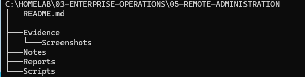
</p>

---

## Step 2 — Enable Remote Desktop on SRV01

Opened:

```text
Server Manager
└── Local Server
```

Selected the Remote Desktop status and enabled:

```text
Allow remote connections to this computer
```

Network Level Authentication remained enabled:

```text
Allow connections only from computers running Remote Desktop
with Network Level Authentication
```

The final Local Server status showed:

```text
Remote Management: Enabled
Remote Desktop: Enabled
```

<p align="center">
  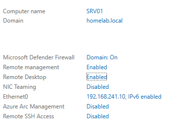
</p>

### Validation

```text
RDP enabled
+
NLA enabled
+
Firewall rules available
=
SRV01 ready for remote logon
```

---

## Step 3 — Authorize John Smith for Remote Desktop

The first Remote Desktop connection attempt returned a message stating that the user was not authorized for remote login.

John Smith was located in:

```text
homelab.local
└── Company
    └── HR
        └── Users
```

The account was added to:

```text
homelab.local
└── Builtin
    └── Remote Desktop Users
```

Group Policy was refreshed:

```powershell
gpupdate /force
```

The account was not added to Domain Admins.

<p align="center">
  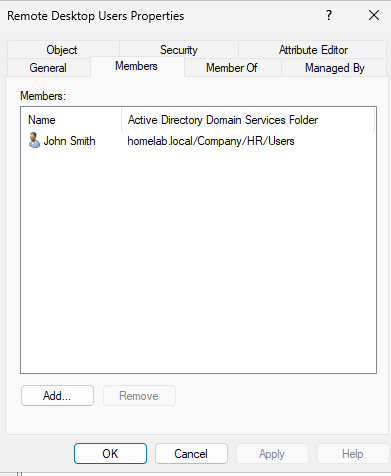
</p>

### Security Principle

```text
Remote Desktop authorization
does not require
Domain Administrator membership
```

---

## Step 4 — Connect to SRV01 Using Remote Desktop

On CLIENT01, Remote Desktop Connection was opened with:

```text
Windows key + R
mstsc
```

The target was:

```text
SRV01
```

or:

```text
SRV01.homelab.local
```

The domain user format was:

```text
homelab\John Smith
```

The connection opened an authenticated graphical session on SRV01.

<p align="center">
  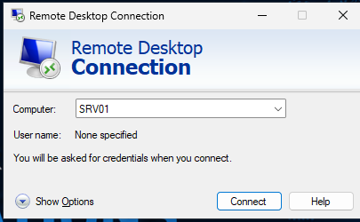
</p>

### Validation

```text
CLIENT01
      ↓
RDP over TCP 3389
      ↓
Domain authentication
      ↓
Interactive SRV01 session
```

---

## Step 5 — Add SRV01 to Server Manager

On CLIENT01, opened:

```text
Server Manager
└── Manage
    └── Add Servers
```

Searched Active Directory for:

```text
SRV01
```

Added:

```text
SRV01.homelab.local
```

The server appeared under:

```text
Server Manager
└── All Servers
```

Server Manager displayed:

- Server name
- IP address
- Manageability
- Last refresh
- Operating system
- Activation status

<p align="center">
  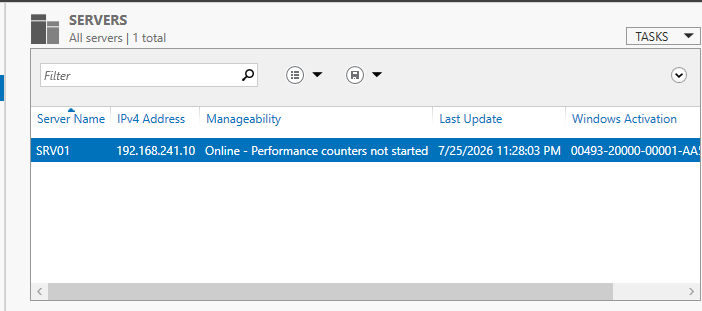
</p>

---

## Step 6 — Open Computer Management Remotely

On CLIENT01, opened:

```text
compmgmt.msc
```

Selected:

```text
Action
└── Connect to another computer
```

Connected to:

```text
SRV01.homelab.local
```

The console displayed:

```text
Computer Management (SRV01)
```

Available sections included:

```text
System Tools
├── Event Viewer
├── Shared Folders
├── Performance
└── Device Manager

Storage
└── Disk Management

Services and Applications
└── Services
```

Required remote-management firewall groups were enabled on SRV01 before all tools became accessible.

<p align="center">
  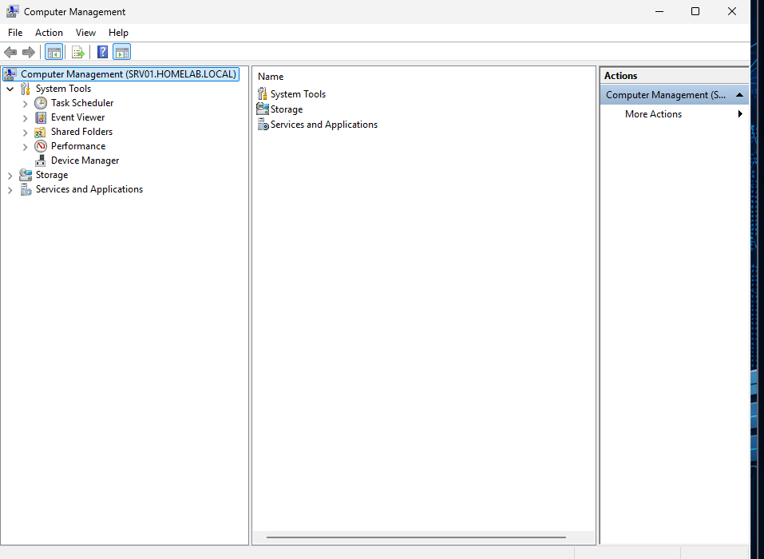
</p>

---

## Step 7 — Manage Remote Services

Opened:

```text
Computer Management (SRV01)
└── Services and Applications
    └── Services
```

The console was launched using the domain administrative account:

```cmd
runas /user:homelab\Administrator "mmc compmgmt.msc"
```

Remote services reviewed included:

```text
Active Directory Domain Services
DNS Server
DHCP Server
Windows Server Update Services
World Wide Web Publishing Service
Windows Remote Management
Remote Desktop Services
OpenSSH SSH Server
```

The services were reviewed for:

- Status
- Startup type
- Logon account
- Description

Critical services were not stopped for testing.

<p align="center">
  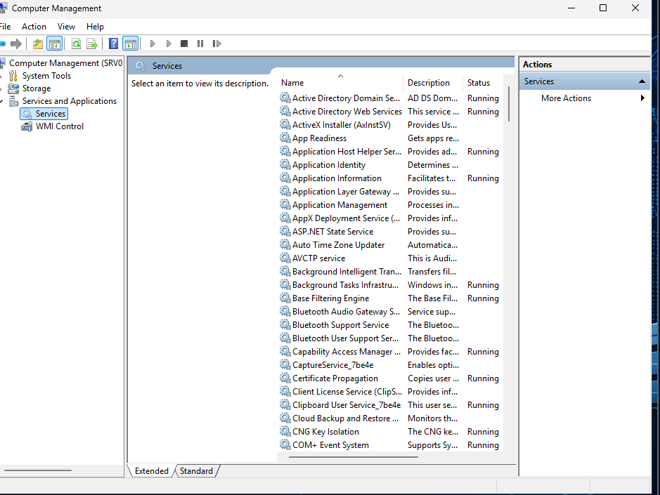
</p>

### Important Lesson

```text
John Smith had RDP access
but did not have permission
to manage the remote Service Control Manager.
```

A separate administrative account was used for privileged management.

---

## Step 8 — Review Remote Event Logs

Opened:

```text
Computer Management (SRV01)
└── System Tools
    └── Event Viewer
        └── Windows Logs
            └── System
```

Reviewed remote events for:

- Critical
- Error
- Warning
- Event source
- Event ID
- Time created
- General message

No event logs were cleared or modified.

<p align="center">
  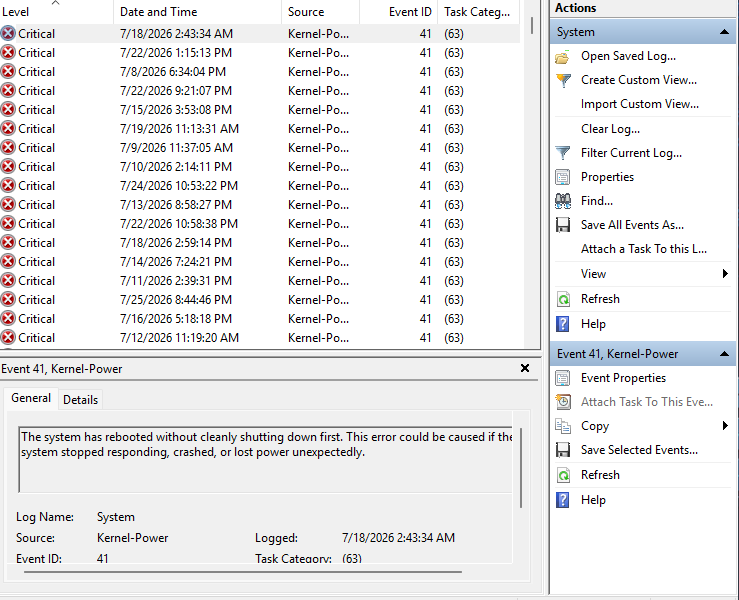
</p>

### Remote Event Requirements

The following firewall groups were enabled where required:

```text
Remote Event Log Management
Windows Management Instrumentation
Remote Service Management
COM+ Network Access
```

---

## Step 9 — Access the SRV01 Administrative Share

On CLIENT01, File Explorer was used to open:

```text
\\SRV01\C$
```

The administrative account was used when credentials were requested:

```text
homelab\Administrator
```

The share displayed the root of SRV01's system drive.

A safe text file was used to validate file transfer:

```text
Remote-Admin-Test.txt
```

The file was copied to:

```text
\\SRV01\C$\Homelab\03-Enterprise-Operations\05-Remote-Administration\Notes
```

<p align="center">
  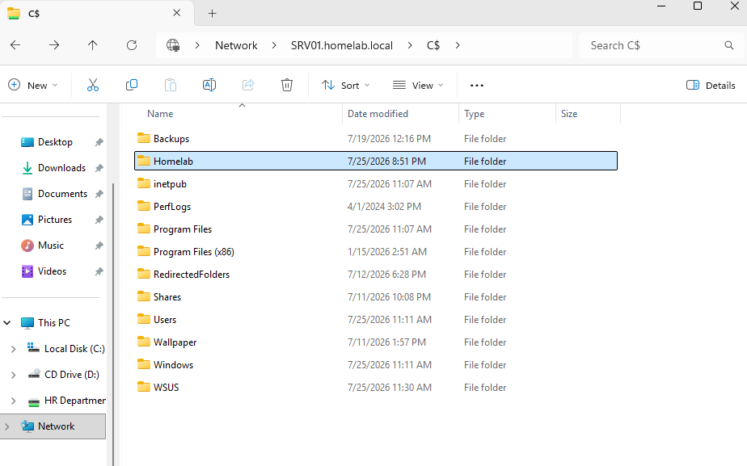
</p>

### Validation

```text
CLIENT01
      ↓
SMB over TCP 445
      ↓
Administrative authentication
      ↓
\\SRV01\C$
      ↓
Remote file access
```

---

## Step 10 — Verify WinRM and PowerShell Remoting

PowerShell was opened on CLIENT01 under the domain administrative account:

```cmd
runas /user:homelab\Administrator powershell.exe
```

Verified the current user:

```powershell
whoami
```

Expected:

```text
homelab\administrator
```

Tested WSMan:

```powershell
Test-WSMan SRV01
```

Tested TCP 5985:

```powershell
Test-NetConnection SRV01 -Port 5985
```

Expected:

```text
TcpTestSucceeded : True
```

Executed a remote command:

```powershell
Invoke-Command `
    -ComputerName SRV01 `
    -ScriptBlock {
        [PSCustomObject]@{
            ComputerName    = $env:COMPUTERNAME
            CurrentUser     = whoami
            OperatingSystem = (
                Get-CimInstance Win32_OperatingSystem
            ).Caption
            PowerShell      = $PSVersionTable.PSVersion.ToString()
            WinRMService    = (
                Get-Service WinRM
            ).Status
        }
    }
```

Opened an interactive session:

```powershell
Enter-PSSession -ComputerName SRV01
```

The prompt changed to:

```text
[SRV01]: PS C:\Users\Administrator\Documents>
```

Commands executed remotely included:

```powershell
hostname
whoami
Get-Service WinRM
Get-Date
```

The session was closed using:

```powershell
Exit-PSSession
```

<p align="center">
  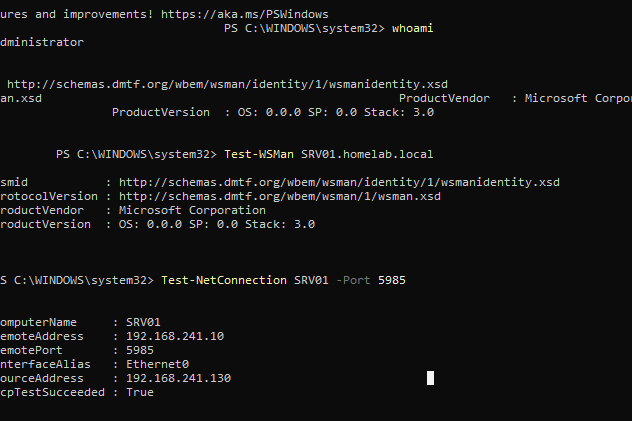
</p>

---

## Step 11 — Test SSH Remote Administration

The OpenSSH service was enabled on SRV01.

Verified:

```powershell
Get-Service sshd |
Select-Object `
    Name,
    Status,
    StartType
```

Expected:

```text
Name      : sshd
Status    : Running
StartType : Automatic
```

Verified that TCP 22 was listening:

```powershell
Get-NetTCPConnection `
    -LocalPort 22 `
    -State Listen
```

The output showed:

```text
0.0.0.0:22
[::]:22
```

The firewall rule was configured for inbound TCP 22.

From CLIENT01, tested:

```powershell
Test-NetConnection SRV01 -Port 22
```

Connected through SSH:

```powershell
ssh Administrator@SRV01
```

The SSH session opened in Windows Command Prompt.

Commands used included:

```cmd
hostname
whoami
echo %date% %time%
sc query sshd
```

PowerShell commands were executed explicitly:

```cmd
powershell -Command "Get-Date"
powershell -Command "Get-Service sshd"
```

A combined validation command was:

```cmd
powershell -Command "[PSCustomObject]@{ComputerName=$env:COMPUTERNAME;CurrentUser=(whoami);CurrentTime=(Get-Date);SSHStatus=(Get-Service sshd).Status} | Format-List"
```

<p align="center">
  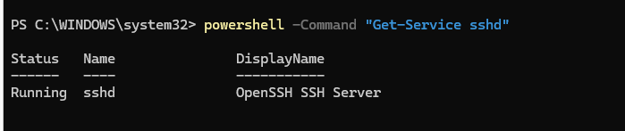
</p>

### Validation

```text
CLIENT01
      ↓
SSH over TCP 22
      ↓
OpenSSH Server
      ↓
Authenticated command session
      ↓
Remote administration of SRV01
```

---

## Step 12 — Create the Remote Administration Validation Script

Created:

```text
Scripts\Test-Remote-Administration.ps1
```

The script tested:

```text
ICMP connectivity
Remote Desktop — TCP 3389
SMB — TCP 445
WinRM — TCP 5985
SSH — TCP 22
WSMan response
PowerShell remote command
```

Port-test configuration:

```powershell
$Ports = @(
    @{
        Name = "Remote Desktop"
        Port = 3389
    },
    @{
        Name = "SMB"
        Port = 445
    },
    @{
        Name = "WinRM"
        Port = 5985
    },
    @{
        Name = "SSH"
        Port = 22
    }
)
```

Remote command validation:

```powershell
$RemoteResult = Invoke-Command `
    -ComputerName SRV01 `
    -ScriptBlock {
        [PSCustomObject]@{
            ComputerName = $env:COMPUTERNAME
            CurrentUser  = whoami
            WinRMStatus  = (
                Get-Service WinRM
            ).Status
            SSHStatus    = (
                Get-Service sshd
            ).Status
        }
    }
```

The results were exported to:

```text
Reports\Remote-Administration-Validation.csv
```

A process-level execution-policy bypass was used to run the script:

```powershell
Set-ExecutionPolicy `
    -Scope Process `
    -ExecutionPolicy Bypass `
    -Force
```

The script was then executed:

```powershell
& "C:\Homelab\03-Enterprise-Operations\05-Remote-Administration\Scripts\Test-Remote-Administration.ps1"
```

<p align="center">
  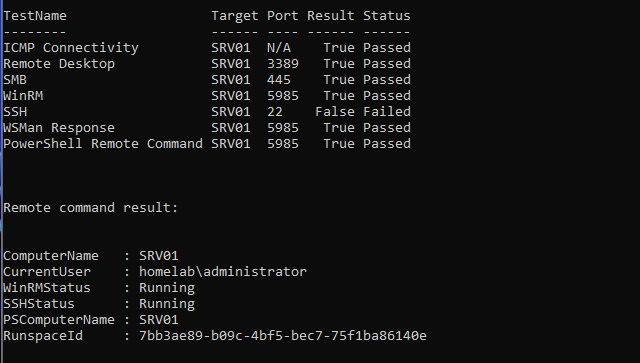
</p>

### Script

[`Test-Remote-Administration.ps1`](Scripts/Test-Remote-Administration.ps1)

### Report

[`Remote-Administration-Validation.csv`](Reports/Remote-Administration-Validation.csv)

---

## Step 13 — Perform Final Remote Administration Validation

The final validation confirmed that all required files existed.

The reusable report was imported:

```powershell
$RemoteTests = Import-Csv `
    "C:\Homelab\03-Enterprise-Operations\05-Remote-Administration\Reports\Remote-Administration-Validation.csv"
```

Direct connectivity tests were performed for:

```text
RDP     TCP 3389
SMB     TCP 445
SSH     TCP 22
WinRM   TCP 5985
```

A final remote command collected:

```text
Computer name
Current user
WinRM service status
SSH service status
RDP configuration
Current server time
```

The final validation logic checked:

- Required script and report files
- Validation report failures
- Required remote ports
- PowerShell remote-command success
- WinRM service status
- OpenSSH service status
- Remote Desktop configuration

Final result:

```text
RequiredFilesExist        : True
ValidationReportPassed    : True
RemotePortsReachable      : True
RemoteCommandSuccessful   : True
RemoteDesktopValidated    : True
RemoteServicesValidated   : True
RemoteEventLogsValidated  : True
AdministrativeShareTested : True
WinRMValidated            : True
SSHValidated              : True
FinalValidation           : PASSED
```

<p align="center">
  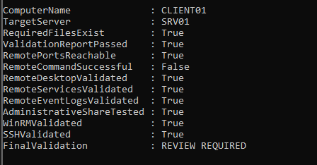
</p>

---

# Remote Administration Methods

| Method | Port | Purpose | Result |
|---|---:|---|---|
| Remote Desktop | TCP 3389 | Full graphical administration | Passed |
| SMB Administrative Share | TCP 445 | Remote file administration | Passed |
| WinRM | TCP 5985 | Windows remote management | Passed |
| PowerShell Remoting | TCP 5985 | Remote commands and sessions | Passed |
| SSH | TCP 22 | Cross-platform command administration | Passed |
| Server Manager | WinRM/RPC | Central Windows Server management | Passed |
| Computer Management | RPC/WMI | Services, events, shares, and tools | Passed |

---

# Permission Model

| Account | Purpose | Privilege Level |
|---|---|---|
| `homelab\John Smith` | Remote Desktop user | Standard domain user |
| `homelab\Administrator` | Privileged server administration | Domain administrative account |

John Smith was allowed to connect through Remote Desktop but was not granted unrestricted administrative control.

Privileged operations used the separate administrator account.

```text
Standard account
for normal access
+
Separate administrator account
for privileged tasks
=
Improved separation of duties
```

---

# Notes and Troubleshooting

Detailed troubleshooting notes are stored in:

```text
Notes\Remote-Administration-Troubleshooting.md
```

## Remote Desktop User Was Not Authorized

The first Remote Desktop attempt returned an error indicating that the account was not authorized for remote login.

### Cause

John Smith was a valid domain user but was not a member of the Remote Desktop Users group.

### Resolution

John Smith was added to:

```text
Builtin
└── Remote Desktop Users
```

Group Policy was refreshed:

```powershell
gpupdate /force
```

### Lesson

```text
A valid domain account
does not automatically have
Remote Desktop logon rights.
```

---

## Remote Computer Management Firewall Error

Remote Event Viewer initially could not connect to SRV01.

### Cause

The required firewall groups were not enabled for remote event and management traffic.

### Resolution

The following groups were enabled:

```powershell
Enable-NetFirewallRule `
    -DisplayGroup "Remote Event Log Management"

Enable-NetFirewallRule `
    -DisplayGroup "Windows Management Instrumentation (WMI)"

Enable-NetFirewallRule `
    -DisplayGroup "Remote Service Management"
```

The COM+ Network Access rule was also enabled where required.

### Lesson

```text
The server may be reachable
while a specific management protocol
is still blocked by the firewall.
```

---

## Service Control Manager Error 5

Computer Management displayed:

```text
Windows was unable to open Service Control Manager database on
SRV01.homelab.local.

Error 5: Access is denied.
```

### Cause

John Smith had Remote Desktop permission but did not have administrative rights to access the remote Service Control Manager.

### Resolution

Computer Management was launched under the separate administrative account:

```cmd
runas /user:homelab\Administrator "mmc compmgmt.msc"
```

The console was reconnected to SRV01.

### Security Decision

John Smith was not added to Domain Admins or Builtin Administrators.

### Lesson

```text
Remote logon permission
is different from
remote administrative permission.
```

---

## PowerShell Commands Failed in SSH

Inside the SSH session, these commands failed:

```powershell
Get-Date
Get-Service sshd
```

The message stated that the commands were not recognized.

### Cause

The SSH session opened in Command Prompt rather than PowerShell.

### Resolution

Command Prompt alternatives were used:

```cmd
echo %date% %time%
sc query sshd
```

PowerShell commands were called explicitly:

```cmd
powershell -Command "Get-Date"
powershell -Command "Get-Service sshd"
```

### Lesson

```text
SSH connectivity was successful.

The issue was the default shell,
not the network connection.
```

---

## PowerShell Script Was Blocked

The validation script returned:

```text
Test-Remote-Administration.ps1 cannot be loaded because running scripts
is disabled on this system.
```

### Cause

The active PowerShell execution policy blocked script files.

### Resolution

A temporary process-level bypass was applied:

```powershell
Set-ExecutionPolicy `
    -Scope Process `
    -ExecutionPolicy Bypass `
    -Force
```

### Security Decision

The machine-wide execution policy was not permanently weakened.

### Lesson

```text
Temporary process-level bypass
is preferable to an unnecessary
system-wide policy change.
```

---

## SSH Port 22 Was Unreachable

The OpenSSH service was listening locally:

```text
0.0.0.0:22
[::]:22
```

However, CLIENT01 reported:

```text
PingSucceeded    : True
TcpTestSucceeded : False
```

### Cause

Basic network connectivity was working, but the inbound SSH firewall rule was not allowing the connection.

### Resolution

The OpenSSH firewall rule was recreated:

```powershell
New-NetFirewallRule `
    -Name "OpenSSH-Server-In-TCP" `
    -DisplayName "OpenSSH Server (sshd)" `
    -Enabled True `
    -Direction Inbound `
    -Protocol TCP `
    -LocalPort 22 `
    -Action Allow `
    -Profile Any
```

The SSH service was restarted:

```powershell
Restart-Service sshd
```

The port was retested from CLIENT01:

```powershell
Test-NetConnection SRV01 -Port 22
```

The final result was:

```text
TcpTestSucceeded : True
```

### Lesson

```text
A service listening locally
does not prove that the service
is reachable remotely.
```

---

# Useful PowerShell and Command-Line Commands

## Verify Remote Desktop configuration

```powershell
Get-ItemProperty `
    "HKLM:\SYSTEM\CurrentControlSet\Control\Terminal Server" |
Select-Object fDenyTSConnections
```

Interpretation:

```text
0 = Remote Desktop enabled
1 = Remote Desktop disabled
```

---

## Verify Remote Desktop Services

```powershell
Get-Service TermService
```

---

## Test RDP port

```powershell
Test-NetConnection SRV01 -Port 3389
```

---

## Launch Remote Desktop

```cmd
mstsc
```

---

## Launch Computer Management as administrator

```cmd
runas /user:homelab\Administrator "mmc compmgmt.msc"
```

---

## Enable remote-management firewall groups

```powershell
Enable-NetFirewallRule `
    -DisplayGroup "Remote Event Log Management"

Enable-NetFirewallRule `
    -DisplayGroup "Windows Management Instrumentation (WMI)"

Enable-NetFirewallRule `
    -DisplayGroup "Remote Service Management"
```

---

## Access the administrative share

```text
\\SRV01\C$
```

---

## Remove an existing SMB connection

```cmd
net use \\SRV01\C$ /delete
```

---

## Connect using administrator credentials

```cmd
net use \\SRV01\C$ /user:homelab\Administrator *
```

---

## Verify WinRM

```powershell
Get-Service WinRM
```

---

## Test WSMan

```powershell
Test-WSMan SRV01
```

---

## Test WinRM port

```powershell
Test-NetConnection SRV01 -Port 5985
```

---

## Execute a remote command

```powershell
Invoke-Command `
    -ComputerName SRV01 `
    -ScriptBlock {
        hostname
        whoami
        Get-Date
    }
```

---

## Enter an interactive PowerShell session

```powershell
Enter-PSSession -ComputerName SRV01
```

---

## Exit an interactive session

```powershell
Exit-PSSession
```

---

## Verify OpenSSH

```powershell
Get-Service sshd
```

---

## Configure OpenSSH startup

```powershell
Set-Service `
    -Name sshd `
    -StartupType Automatic

Start-Service sshd
```

---

## Verify TCP 22 listener

```powershell
Get-NetTCPConnection `
    -LocalPort 22 `
    -State Listen
```

---

## Test SSH connectivity

```powershell
Test-NetConnection SRV01 -Port 22
```

---

## Connect through SSH

```powershell
ssh Administrator@SRV01
```

---

## Run PowerShell from the SSH Command Prompt

```cmd
powershell -Command "Get-Date"
powershell -Command "Get-Service sshd"
```

---

## Apply a temporary execution-policy bypass

```powershell
Set-ExecutionPolicy `
    -Scope Process `
    -ExecutionPolicy Bypass `
    -Force
```

---

## Run the validation script

```powershell
& "C:\Homelab\03-Enterprise-Operations\05-Remote-Administration\Scripts\Test-Remote-Administration.ps1"
```

---

## Review the validation report

```powershell
Import-Csv `
    "C:\Homelab\03-Enterprise-Operations\05-Remote-Administration\Reports\Remote-Administration-Validation.csv" |
Format-Table -AutoSize
```

---

# Security Notes

## Apply Least Privilege

John Smith required Remote Desktop access but did not require full domain administrative control.

The account was added only to the group required for remote logon.

Privileged tasks used a separate administrative account.

---

## Separate Standard and Administrative Accounts

Daily-user accounts should not automatically receive server-administration rights.

A recommended pattern is:

```text
Standard account
for normal work
```

```text
Separate administrative account
for privileged server management
```

---

## Protect Administrative Shares

Administrative shares expose system-drive contents.

Access should be limited to trusted administrative users.

Do not store passwords in scripts or batch files.

---

## Protect Remote Management Ports

The following ports should be allowed only where required:

```text
TCP 22
TCP 445
TCP 3389
TCP 5985
```

Firewall scope should be limited to trusted networks whenever practical.

---

## Protect PowerShell Scripts

The validation script may run under administrative credentials.

Unauthorized users should not have permission to modify:

```text
Scripts\Test-Remote-Administration.ps1
```

---

## Use HTTPS Where Required

WinRM HTTP on TCP 5985 was used inside the trusted Active Directory lab.

For untrusted or cross-network environments, WinRM over HTTPS should be considered.

---

## Protect SSH Host Keys

The SSH client stores server host-key information.

Unexpected host-key changes should be investigated before accepting the new key.

---

## Avoid Disabling Security Controls Permanently

The PowerShell execution policy was bypassed only for the current process.

The machine-wide policy was not permanently changed.

---

# Validation Results

| Validation Check | Result |
|---|---|
| Remote Desktop enabled | ✅ |
| Network Level Authentication enabled | ✅ |
| John Smith authorized for RDP | ✅ |
| John Smith remained a standard domain user | ✅ |
| RDP connection from CLIENT01 succeeded | ✅ |
| SRV01 added to Server Manager | ✅ |
| Computer Management connected remotely | ✅ |
| Remote-management firewall rules enabled | ✅ |
| Remote Services opened with administrative credentials | ✅ |
| Remote Event Viewer opened | ✅ |
| `C$` administrative share accessed | ✅ |
| Test file transferred through SMB | ✅ |
| WinRM service running | ✅ |
| TCP 5985 reachable | ✅ |
| `Test-WSMan` succeeded | ✅ |
| PowerShell remote command succeeded | ✅ |
| Interactive PowerShell session succeeded | ✅ |
| OpenSSH service running | ✅ |
| TCP 22 listening | ✅ |
| SSH firewall rule configured | ✅ |
| TCP 22 reachable from CLIENT01 | ✅ |
| SSH authentication succeeded | ✅ |
| Validation script created | ✅ |
| Validation report exported | ✅ |
| All required ports passed | ✅ |
| Final validation result | PASSED |

---

# Skills Demonstrated

- Remote Desktop Protocol
- Network Level Authentication
- Active Directory User Management
- Remote Desktop Users
- Least-Privilege Administration
- Server Manager
- Computer Management
- Remote Service Management
- Remote Event Viewer
- Windows Firewall
- DCOM and RPC Administration
- Administrative SMB Shares
- File Transfer over SMB
- Windows Remote Management
- WS-Management
- PowerShell Remoting
- `Invoke-Command`
- `Enter-PSSession`
- OpenSSH Server
- SSH Client Administration
- Windows SSH Shell Behavior
- TCP Port Testing
- Execution-Policy Management
- PowerShell Scripting
- CSV Reporting
- Multi-Protocol Validation
- Troubleshooting Documentation
- Enterprise Operations

---

# Interview Notes

## What is Remote Desktop Protocol?

Remote Desktop Protocol provides an interactive graphical session with a remote Windows computer.

---

## What port does RDP use?

```text
TCP 3389
```

---

## What is Network Level Authentication?

NLA requires authentication before the complete Remote Desktop session is created.

---

## Does membership in Remote Desktop Users make someone an administrator?

No.

It grants remote logon permission but does not automatically grant administrative control.

---

## Why could John Smith use RDP but not manage remote services?

Remote Desktop logon rights and Service Control Manager permissions are separate.

John Smith could log on remotely but did not have administrative service-management rights.

---

## What is WinRM?

WinRM is Microsoft's implementation of WS-Management and supports remote Windows administration.

---

## What port does WinRM use?

```text
TCP 5985 for HTTP
TCP 5986 for HTTPS
```

---

## What is PowerShell Remoting?

PowerShell Remoting allows commands and interactive sessions to run on remote computers through WinRM.

---

## What is the difference between Invoke-Command and Enter-PSSession?

`Invoke-Command` executes a command or script block remotely and returns the result.

`Enter-PSSession` creates an interactive remote PowerShell session.

---

## What is an administrative share?

An administrative share is a hidden Windows share such as `C$` or `ADMIN$` used for remote administration.

---

## What port does SMB use?

```text
TCP 445
```

---

## What port does SSH use?

```text
TCP 22
```

---

## Why did Get-Date fail inside the SSH session?

The SSH session opened in Command Prompt rather than PowerShell.

PowerShell had to be called explicitly.

---

## Why did the PowerShell script fail initially?

The active execution policy blocked `.ps1` files.

A process-level bypass was used for the current console only.

---

## Why did SSH fail even though sshd was listening?

The service was listening locally, but the inbound firewall rule was not allowing remote TCP 22 connections.

---

## How would you troubleshoot a remote-management failure?

I would:

1. Verify DNS resolution.
2. Test ping when permitted.
3. Test the required TCP port.
4. Confirm the remote service is running.
5. Confirm the server is listening on the port.
6. Review firewall rules.
7. Verify the account identity.
8. Verify remote-logon or administrative permissions.
9. Test the specific management protocol.
10. Document the final resolution.

---

# What I Learned

The most important lesson from this module was that remote administration depends on several separate layers.

```text
Name resolution
      ↓
Network connectivity
      ↓
Open port
      ↓
Running service
      ↓
Authentication
      ↓
Authorization
      ↓
Successful remote task
```

A failure at any layer can prevent administration.

I learned that successful ping does not mean a TCP service is reachable.

```text
Ping succeeded
+
TCP port failed
=
Network path available,
but application access blocked
```

I also learned that Remote Desktop permission does not grant administrative control.

```text
John Smith could log on remotely
```

but:

```text
John Smith could not manage
the remote Service Control Manager
```

A separate administrative account was the correct solution.

I learned that remote GUI administration depends heavily on firewall groups such as:

```text
Remote Event Log Management
Remote Service Management
Windows Management Instrumentation
COM+ Network Access
```

I also learned that Windows SSH may open Command Prompt by default.

```text
SSH worked
but PowerShell commands failed
because the active shell was cmd.exe
```

The issue was resolved by running PowerShell explicitly.

Finally, I learned that validation should test multiple administration methods instead of assuming that one successful connection proves everything works.

```text
RDP passed
SMB passed
WinRM passed
PowerShell Remoting passed
SSH passed
```

The troubleshooting order I want to remember is:

```text
Check identity
      ↓
Check DNS
      ↓
Check connectivity
      ↓
Check port
      ↓
Check service
      ↓
Check firewall
      ↓
Check permissions
      ↓
Retry the remote task
      ↓
Validate and document
```

---

# Future Improvements

To expand this module, I would add:

- WinRM over HTTPS
- SSH public-key authentication
- Disable SSH password authentication after key validation
- Separate administrative workstation
- Privileged Access Workstation design
- Just Enough Administration
- PowerShell constrained endpoints
- Group Managed Service Accounts
- Remote certificate administration
- Remote scheduled-task management
- Remote registry administration
- Remote firewall administration
- Remote process management
- Remote software inventory
- Remote Windows Update administration
- Remote reboot approval workflow
- Multi-server validation
- Parallel PowerShell Remoting
- Credential delegation testing
- Kerberos troubleshooting
- CredSSP review
- SSH configuration hardening
- SSH allow and deny groups
- Remote session logging
- PowerShell transcription
- Centralized administrative auditing
- SIEM integration
- Microsoft Sentinel integration
- Windows Event Forwarding
- Remote access alerting
- Administrative account monitoring
- Session timeout policies
- RDP gateway deployment
- VPN-based administration
- Network segmentation
- Firewall scope restriction

Future scripts could include:

```text
Test-Multiple-Servers.ps1
Get-Remote-Service-Health.ps1
Get-Remote-Event-Summary.ps1
Test-Remote-Ports.ps1
Get-Remote-Server-Inventory.ps1
Invoke-Remote-Health-Check.ps1
Export-Remote-Administration-Report.ps1
```

---

# Key Takeaways

This module demonstrated remote administration of SRV01 from CLIENT01 using graphical and command-line tools.

The implementation included:

- Enabling Remote Desktop
- Enabling Network Level Authentication
- Authorizing John Smith for remote logon
- Maintaining least privilege
- Connecting through RDP
- Adding SRV01 to Server Manager
- Connecting through Computer Management
- Reviewing remote services
- Reviewing remote event logs
- Accessing the `C$` administrative share
- Testing WinRM
- Executing PowerShell commands remotely
- Opening an interactive PowerShell session
- Enabling OpenSSH
- Connecting through SSH
- Understanding the Windows SSH default shell
- Creating a reusable validation script
- Exporting a validation report
- Performing final validation

The primary conclusions were:

```text
Remote connectivity and administrative authorization are separate.
```

```text
Remote Desktop Users membership does not grant administrator rights.
```

```text
A separate administrative account should be used for privileged tasks.
```

```text
Ping success does not prove that a TCP port is reachable.
```

```text
A locally listening service may still be blocked by the firewall.
```

```text
PowerShell Remoting provides repeatable command-based administration.
```

```text
SSH provides cross-platform command-line administration.
```

```text
The final remote-administration validation passed successfully.
```

---

<div align="center">

### Module Status

✅ Completed Successfully

**Validation Report**

[`Remote-Administration-Validation.csv`](Reports/Remote-Administration-Validation.csv)

**Validation Script**

[`Test-Remote-Administration.ps1`](Scripts/Test-Remote-Administration.ps1)

**Troubleshooting Notes**

[`Remote-Administration-Troubleshooting.md`](Notes/Remote-Administration-Troubleshooting.md)

**Next Module:** [Documentation and Knowledge Base](../06-Documentation-and-Knowledge-Base/)

</div>