<div align="center">


</div>

---

# Overview

This module documents the creation of an internal IT operations knowledge base for the `homelab.local` Windows environment.

The goal was to organize technical information so another IT support technician or systems administrator could understand the environment, review past incidents, follow approved procedures, troubleshoot common failures, and validate documentation completeness.

The module includes:

- Infrastructure documentation
- Server inventory
- Network and service references
- Incident records
- Knowledge base articles
- Standard operating procedures
- Change-management records
- Reusable documentation templates
- PowerShell validation
- CSV reporting

The documentation is based on real systems, procedures, and troubleshooting events from the isolated homelab environment.

No production incidents were invented.

---

# Why I Built This Module

Technical support and systems administration require more than resolving problems.

IT teams must also document:

- What happened
- Which systems were affected
- What symptoms were observed
- What troubleshooting was performed
- What caused the issue
- What resolved it
- How the resolution was validated
- When the issue should be escalated
- What configuration changes were made

Without clear documentation, the same issues may require repeated investigation.

I built this module to practice converting completed technical work into reusable operational documentation.

The most important lesson was:

```text
A resolved incident becomes more valuable
when the resolution is documented and reusable.
```

---

# Business Scenario

The fictional Homelab IT Administration team manages the following environment:

```text
Domain: homelab.local
Primary Server: SRV01
Management Workstation: CLIENT01
Hypervisor: VMware Workstation Pro
```

The environment previously relied on screenshots, PowerShell history, and individual project notes.

There was no centralized location for:

- Infrastructure information
- Troubleshooting procedures
- Incident records
- Standard operating procedures
- Change history
- Technical validation

The objective was to create a structured internal documentation repository that could support day-to-day IT operations.

---

# Documentation Model

This module separates documentation into four main categories.

## Environment Documentation

Describes the systems and services being managed.

Examples:

- Infrastructure overview
- Server inventory
- Network addressing
- Service ports
- Administrative dependencies

## Incident Records

Document a specific event that actually occurred.

Example:

```text
INC-005 — CLIENT01 Could Not Reach SRV01
```

## Knowledge Base Articles

Provide reusable troubleshooting guidance based on known issues.

Example:

```text
KB-005 — Domain Controller and DNS Unreachable
```

## Standard Operating Procedures

Explain how to perform repeatable administrative tasks.

Example:

```text
SOP-003 — Remote Server Health Check
```

---

# Real-Work Documentation Flow

```text
Issue occurs
      ↓
Incident is recorded
      ↓
Troubleshooting is performed
      ↓
Root cause is confirmed
      ↓
Resolution is validated
      ↓
Reusable knowledge article is created
      ↓
Change is recorded
      ↓
Future technicians reuse the documentation
```

---

# Learning Objectives

By completing this module, I practiced:

- Collecting live server data remotely
- Writing infrastructure documentation
- Creating server inventory records
- Documenting network ports and service dependencies
- Writing incident records
- Identifying symptoms, impact, and root cause
- Creating reusable knowledge base articles
- Writing standard operating procedures
- Documenting escalation criteria
- Recording infrastructure changes
- Creating reusable documentation templates
- Organizing internal technical documentation
- Creating a centralized documentation index
- Validating documentation through PowerShell
- Exporting documentation status to CSV
- Applying professional IT documentation standards

---

# Lab Environment

| Component | Configuration |
|---|---|
| Active Directory Domain | `homelab.local` |
| Managed Server | `SRV01` |
| Server FQDN | `SRV01.homelab.local` |
| Server IP Address | `192.168.241.10` |
| Management Workstation | `CLIENT01` |
| Client IP Address | Dynamically verified during the module |
| Administrative Account | `homelab\Administrator` |
| Standard Test User | `homelab\John Smith` |
| Server Operating System | Windows Server 2025 Standard Evaluation |
| Client Operating System | Windows 11 Enterprise |
| Hypervisor | VMware Workstation Pro |

---

# Repository Structure

```text
06-Documentation-and-Knowledge-Base
│
├── README.md
│
├── Change-Management
│   └── CHANGELOG.md
│
├── Environment
│   ├── Infrastructure-Overview.md
│   ├── Network-and-Service-Reference.md
│   └── Server-Inventory.md
│
├── Evidence
│   └── Screenshots
│       ├── 01-Documentation-Repository-Structure.png
│       ├── 02-Collect-SRV01-Infrastructure-Data.png
│       ├── 03-Infrastructure-Overview.png
│       ├── 04-SRV01-Server-Inventory.png
│       ├── 05-Network-and-Service-Reference.png
│       ├── 06-Incident-Record.png
│       ├── 07-Knowledge-Base-Article.png
│       ├── 08-Standard-Operating-Procedure.png
│       ├── 09-Change-Management-Log.png
│       ├── 10-Knowledge-Base-Index.png
│       ├── 11-Documentation-Templates.png
│       ├── 12-Documentation-Validation-Script.png
│       └── 13-Documentation-Final-Validation.png
│
├── Incident-Records
│   └── INC-005-CLIENT01-Could-Not-Reach-SRV01.md
│
├── Knowledge-Base
│   ├── INDEX.md
│   └── KB-005-Domain-Controller-and-DNS-Unreachable.md
│
├── Procedures
│   └── SOP-003-Remote-Server-Health-Check.md
│
├── Reports
│   ├── Documentation-Validation.csv
│   └── SRV01-Infrastructure-Data.txt
│
├── Scripts
│   └── Test-Documentation.ps1
│
└── Templates
    ├── Incident-Record-Template.md
    ├── Knowledge-Article-Template.md
    └── Standard-Operating-Procedure-Template.md
```

---

# Step-by-Step Implementation

## Step 1 — Create the Documentation Repository Structure

Created a structured repository for:

- Environment documentation
- Knowledge base articles
- Incident records
- Procedures
- Change management
- Reports
- Scripts
- Evidence
- Templates

The folder structure separates operational documentation by purpose.

<p align="center">
  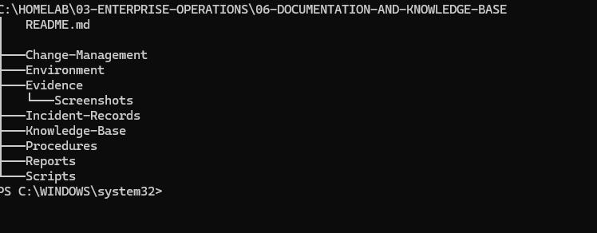
</p>

### Key Lesson

```text
Clear folder organization
improves documentation discovery,
maintenance, and reuse.
```

---

## Step 2 — Collect Live Infrastructure Data from SRV01

Infrastructure data was collected remotely from CLIENT01 using PowerShell Remoting.

The administrative credential used was:

```text
homelab\Administrator
```

Information collected included:

- Server identity
- Domain membership
- Operating system
- Manufacturer and virtual hardware model
- IPv4 configuration
- Installed Windows Server roles
- Critical service status
- Disk capacity and free space
- Last boot time

Example command:

```powershell
$ServerInfo = Invoke-Command `
    -ComputerName SRV01.homelab.local `
    -Credential $Credential `
    -ScriptBlock {
        $OS = Get-CimInstance Win32_OperatingSystem
        $Computer = Get-CimInstance Win32_ComputerSystem

        [PSCustomObject]@{
            ComputerName    = $env:COMPUTERNAME
            Domain          = $Computer.Domain
            Manufacturer    = $Computer.Manufacturer
            Model           = $Computer.Model
            OperatingSystem = $OS.Caption
            Version         = $OS.Version
            BuildNumber     = $OS.BuildNumber
            LastBootTime    = $OS.LastBootUpTime
        }
    }
```

The raw report was saved as:

```text
Reports\SRV01-Infrastructure-Data.txt
```

<p align="center">
  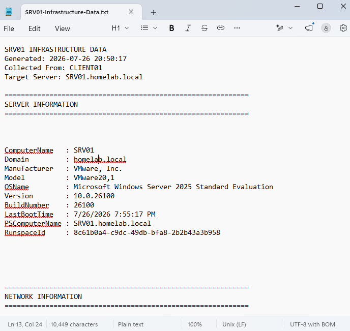
</p>

### Validation

```text
Live system information
was collected remotely
instead of being manually invented.
```

---

## Step 3 — Create the Infrastructure Overview

Created:

```text
Environment\Infrastructure-Overview.md
```

The document explains:

- The role of SRV01
- The role of CLIENT01
- Domain information
- Administrative accounts
- Remote management methods
- Core services
- Operational dependencies
- Management workflow

The documented management relationship is:

```text
Administrator
      ↓
CLIENT01
Management workstation
      ↓
SRV01
Managed infrastructure server
```

<p align="center">
  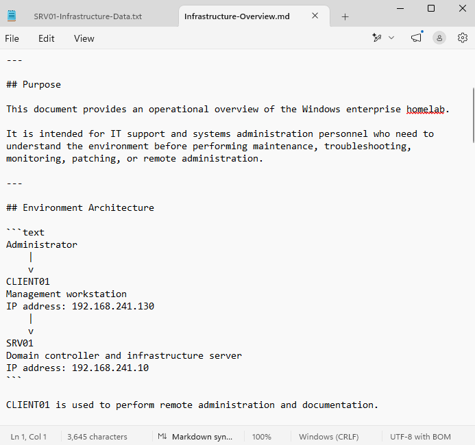
</p>

---

## Step 4 — Create the SRV01 Server Inventory

Created:

```text
Environment\Server-Inventory.md
```

The inventory contains:

- Asset name
- FQDN
- IP address
- Operating system
- Build number
- Hypervisor
- Installed roles
- Critical services
- Storage information
- Remote management methods
- Monitoring scope
- Administrative requirements
- Maintenance guidance

Key roles documented include:

```text
Active Directory Domain Services
DNS Server
DHCP Server
Windows Server Update Services
Web Server IIS
Windows Internal Database
File and Storage Services
```

<p align="center">
  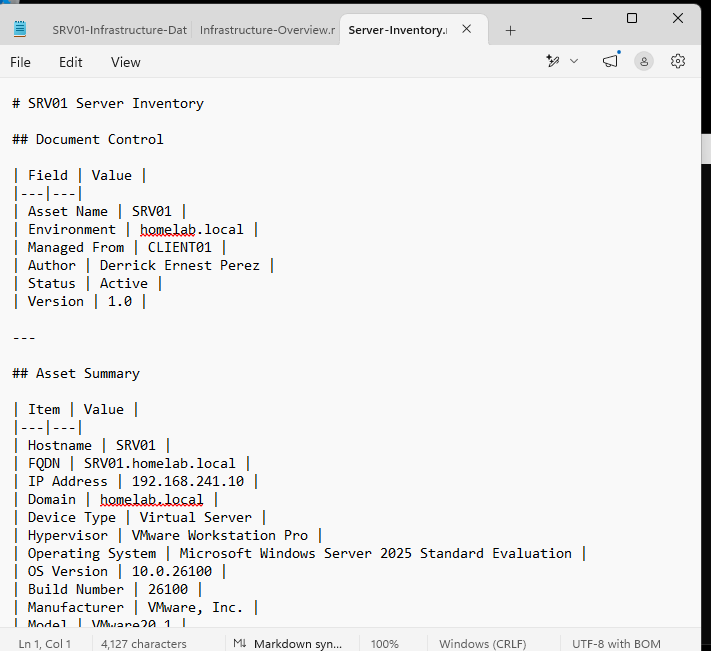
</p>

---

## Step 5 — Create the Network and Service Reference

Created:

```text
Environment\Network-and-Service-Reference.md
```

The document provides a quick reference for:

- System addresses
- DNS configuration
- Active Directory ports
- Remote administration ports
- Critical services
- Service dependencies
- Validation commands
- Troubleshooting order

Important ports documented:

| Service | Port |
|---|---:|
| SSH | TCP 22 |
| DNS | TCP/UDP 53 |
| Kerberos | TCP/UDP 88 |
| LDAP | TCP/UDP 389 |
| SMB | TCP 445 |
| RDP | TCP 3389 |
| WinRM | TCP 5985 |

<p align="center">
  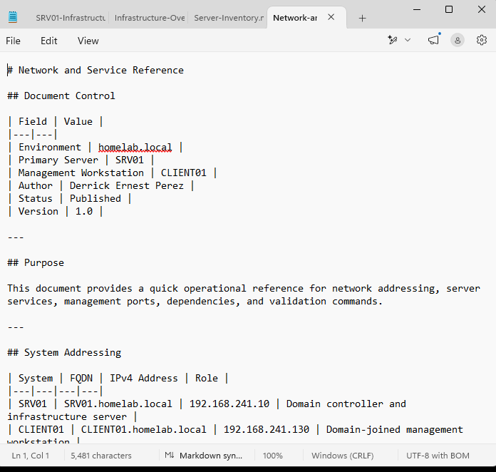
</p>

### Troubleshooting Principle

```text
Verify the network path
before troubleshooting
DNS or authentication.
```

---

## Step 6 — Document a Real Incident

Created:

```text
Incident-Records\INC-005-CLIENT01-Could-Not-Reach-SRV01.md
```

The incident occurred while attempting to collect infrastructure information remotely.

Observed errors included:

```text
ERROR_NO_SUCH_DOMAIN
Status = 1355 0x54b
Kerberos authentication failed
Resolve-DnsName timed out
Destination host unreachable
```

### Impact

The issue prevented:

- DNS resolution
- Domain controller discovery
- Kerberos authentication
- PowerShell Remoting
- Remote infrastructure collection

### Root Cause

CLIENT01 and SRV01 were not communicating correctly through the VMware virtual network.

The DNS and Kerberos failures were secondary symptoms of the underlying network-path failure.

### Resolution

- Confirmed both VMs were powered on
- Verified both virtual network adapters
- Confirmed both VMs used the same VMware network
- Verified IP configuration
- Restored communication between CLIENT01 and SRV01
- Configured CLIENT01 to use SRV01 for DNS
- Retested domain discovery
- Retested PowerShell Remoting

<p align="center">
  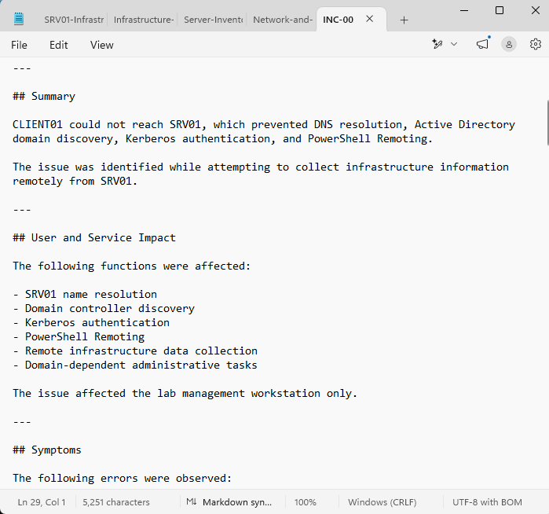
</p>

---

## Step 7 — Publish the Reusable Knowledge Base Article

Created:

```text
Knowledge-Base\KB-005-Domain-Controller-and-DNS-Unreachable.md
```

The article converts the resolved incident into a reusable troubleshooting guide.

The procedure covers:

1. VMware power and adapter checks
2. IP configuration
3. Ping by IP address
4. DNS server configuration
5. DNS cache refresh
6. FQDN resolution
7. Domain controller discovery
8. Port testing
9. Kerberos authentication
10. PowerShell Remoting validation

Recommended troubleshooting order:

```text
VM power and adapter state
        ↓
IP addressing
        ↓
Ping by IP
        ↓
DNS configuration
        ↓
Name resolution
        ↓
Domain discovery
        ↓
Kerberos and WinRM
```

<p align="center">
  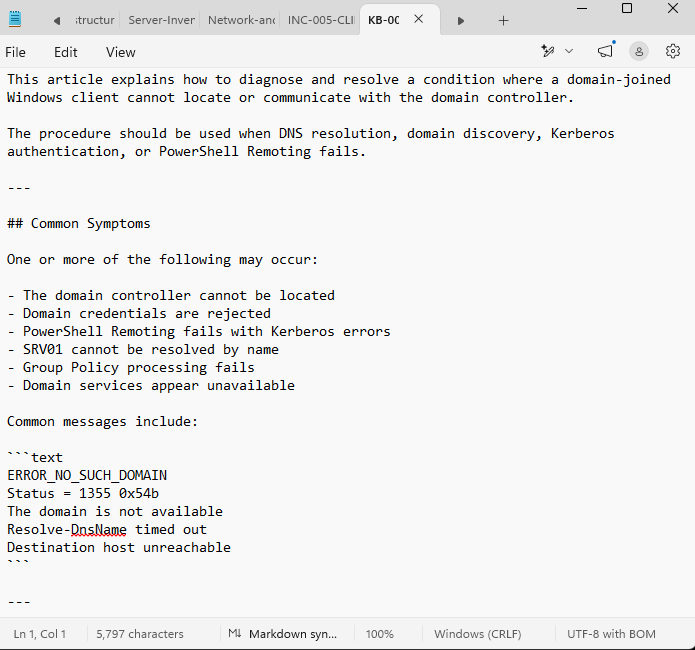
</p>

---

## Step 8 — Create the Remote Server Health Check SOP

Created:

```text
Procedures\SOP-003-Remote-Server-Health-Check.md
```

The procedure documents a routine health check for SRV01.

The SOP includes:

- Required access
- Safety requirements
- Identity validation
- Network validation
- DNS validation
- Domain controller discovery
- Port testing
- PowerShell Remoting
- Critical service checks
- Disk-space review
- Event-log review
- Success criteria
- Escalation criteria

Services reviewed include:

```text
NTDS
DNS
DHCPServer
WinRM
TermService
sshd
W3SVC
WsusService
```

<p align="center">
  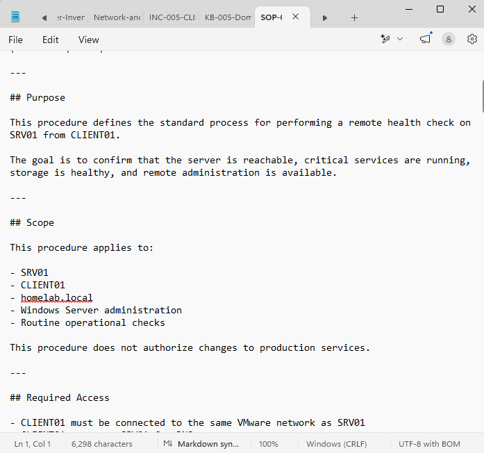
</p>

---

## Step 9 — Create the Change Management Log

Created:

```text
Change-Management\CHANGELOG.md
```

The change log records:

- Change ID
- Change type
- Date
- Requestor
- Implementer
- Affected systems
- Risk level
- Status
- Reason
- Implementation
- Validation
- Rollback guidance

Changes documented include:

```text
CHG-001 — Create Documentation Repository
CHG-002 — Configure CLIENT01 DNS to Use SRV01
CHG-003 — Restore VMware Network Communication
CHG-004 — Create Infrastructure Documentation
CHG-005 — Publish Incident, Knowledge, and Procedure Documentation
```

<p align="center">
  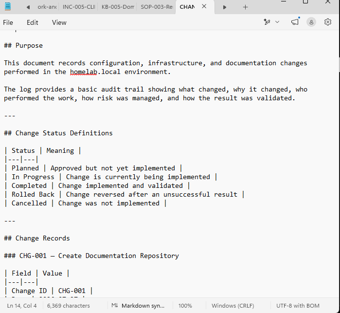
</p>

### Change Principle

```text
Every infrastructure change should include:
reason,
risk,
implementation,
validation,
and rollback.
```

---

## Step 10 — Create the Knowledge Base Index

Created:

```text
Knowledge-Base\INDEX.md
```

The index provides centralized navigation to:

- Environment documentation
- Knowledge articles
- Incident records
- Standard operating procedures
- Reports
- Change-management records

The index also maps common support scenarios to relevant documents.

Example:

```text
Domain login or Kerberos failure
→ KB-005
→ Network and Service Reference
→ INC-005
```

<p align="center">
  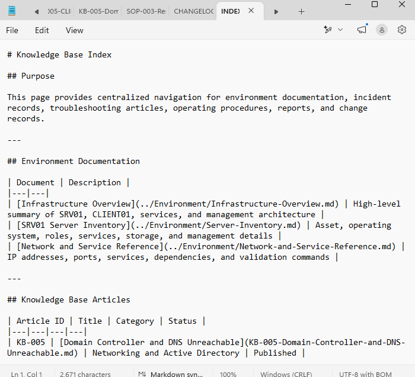
</p>

---

## Step 11 — Create Reusable Documentation Templates

Created:

```text
Templates\Incident-Record-Template.md
Templates\Knowledge-Article-Template.md
Templates\Standard-Operating-Procedure-Template.md
```

The templates standardize future documentation.

### Incident template sections

- Incident information
- Summary
- Impact
- Symptoms
- Troubleshooting
- Root cause
- Resolution
- Validation
- Prevention
- Escalation

### Knowledge article template sections

- Purpose
- Symptoms
- Prerequisites
- Troubleshooting procedure
- Root cause patterns
- Resolution
- Validation
- Escalation criteria
- Related documentation

### SOP template sections

- Purpose
- Scope
- Required access
- Security requirements
- Procedure
- Success criteria
- Failure handling
- Rollback
- Escalation criteria

<p align="center">
  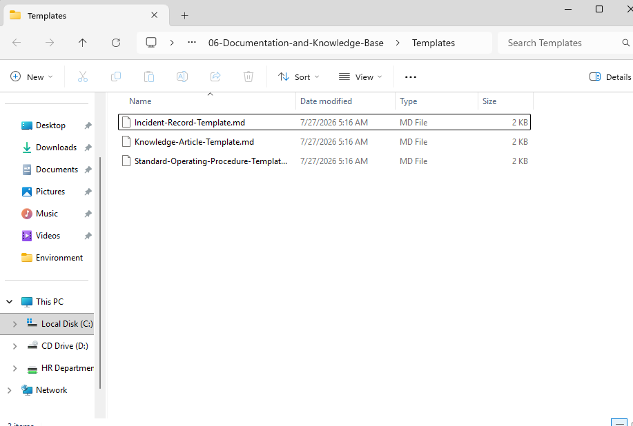
</p>

---

## Step 12 — Create the Documentation Validation Script

Created:

```text
Scripts\Test-Documentation.ps1
```

The script checks whether required documents:

- Exist
- Contain content
- Have a valid file size
- Can be included in the final repository

The script exports results to:

```text
Reports\Documentation-Validation.csv
```

Example validation fields:

```text
File
Exists
HasContent
SizeBytes
LastModified
Status
```

The script initially identified that `README.md` existed but was empty.

```text
README.md
Exists: True
HasContent: False
Status: Failed
```

The README was populated and the validation script was rerun.

Final result:

```text
FailedFiles : 0
FinalStatus : PASSED
```

<p align="center">
  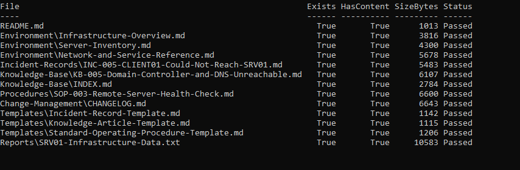
</p>

### Script

[`Test-Documentation.ps1`](Scripts/Test-Documentation.ps1)

### Validation Report

[`Documentation-Validation.csv`](Reports/Documentation-Validation.csv)

---

## Step 13 — Perform Final Documentation Validation

The final validation checked:

- Required documents
- Required screenshots
- Documentation-validation report
- Infrastructure documentation
- Incident documentation
- Knowledge article publication
- SOP creation
- Change log
- Templates

Final result:

```text
Environment                : homelab.local
ManagedServer              : SRV01
ManagementWorkstation      : CLIENT01
RequiredDocumentsExist     : True
RequiredScreenshotsExist   : True
ValidationReportPassed     : True
InfrastructureDocumented   : True
IncidentDocumented         : True
KnowledgeArticlePublished  : True
SOPCreated                 : True
ChangeLogCreated           : True
TemplatesCreated           : True
FinalValidation            : PASSED
```

<p align="center">
  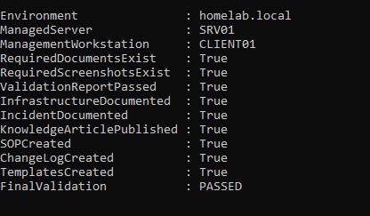
</p>

---

# Documentation Produced

| Type | Document |
|---|---|
| Environment Overview | [`Infrastructure-Overview.md`](Environment/Infrastructure-Overview.md) |
| Server Inventory | [`Server-Inventory.md`](Environment/Server-Inventory.md) |
| Network Reference | [`Network-and-Service-Reference.md`](Environment/Network-and-Service-Reference.md) |
| Incident Record | [`INC-005-CLIENT01-Could-Not-Reach-SRV01.md`](Incident-Records/INC-005-CLIENT01-Could-Not-Reach-SRV01.md) |
| Knowledge Article | [`KB-005-Domain-Controller-and-DNS-Unreachable.md`](Knowledge-Base/KB-005-Domain-Controller-and-DNS-Unreachable.md) |
| SOP | [`SOP-003-Remote-Server-Health-Check.md`](Procedures/SOP-003-Remote-Server-Health-Check.md) |
| Change Log | [`CHANGELOG.md`](Change-Management/CHANGELOG.md) |
| Knowledge Index | [`INDEX.md`](Knowledge-Base/INDEX.md) |
| Raw Infrastructure Report | [`SRV01-Infrastructure-Data.txt`](Reports/SRV01-Infrastructure-Data.txt) |
| Validation Report | [`Documentation-Validation.csv`](Reports/Documentation-Validation.csv) |

---

# Real Incident Summary

## Incident

```text
CLIENT01 could not reach SRV01.
```

## Initial Symptoms

```text
Kerberos authentication failed
Domain not available
ERROR_NO_SUCH_DOMAIN
DNS resolution timeout
Destination host unreachable
```

## Troubleshooting Path

```text
Authentication failure
        ↓
Domain discovery failure
        ↓
DNS timeout
        ↓
Direct IP test
        ↓
Network path failure identified
        ↓
VMware adapter and network review
        ↓
Connectivity restored
        ↓
DNS and domain services validated
        ↓
PowerShell Remoting restored
```

## Key Lesson

```text
The visible error
may not be the root cause.
```

The authentication and DNS errors were caused by an underlying network connectivity failure.

---

# Documentation Standards Applied

## Accuracy

Documentation was based on:

- Live PowerShell output
- Actual system configuration
- Real troubleshooting events
- Validated commands

## Security

The documentation does not include:

- Passwords
- Private keys
- Authentication tokens
- Sensitive credentials

## Repeatability

Procedures include:

- Prerequisites
- Commands
- Expected results
- Validation
- Escalation criteria

## Traceability

Configuration changes are linked to:

- Incidents
- Knowledge articles
- Procedures
- Change records

## Maintainability

Templates were created to ensure future documents follow a consistent format.

---

# Useful Commands

## Collect server identity

```powershell
Invoke-Command `
    -ComputerName SRV01 `
    -ScriptBlock {
        Get-CimInstance Win32_OperatingSystem
        Get-CimInstance Win32_ComputerSystem
    }
```

## Collect network information

```powershell
Get-NetIPAddress -AddressFamily IPv4
```

## Collect installed roles

```powershell
Get-WindowsFeature |
Where-Object InstallState -eq "Installed"
```

## Review critical services

```powershell
Get-Service `
    NTDS,
    DNS,
    DHCPServer,
    WinRM,
    TermService,
    sshd,
    W3SVC,
    WsusService
```

## Test domain discovery

```powershell
nltest /dsgetdc:homelab.local
```

## Test DNS

```powershell
Resolve-DnsName SRV01.homelab.local
```

## Test WinRM

```powershell
Test-NetConnection SRV01 -Port 5985
Test-WSMan SRV01
```

## Run the validation script

```powershell
Set-ExecutionPolicy `
    -Scope Process `
    -ExecutionPolicy Bypass `
    -Force

& "C:\Homelab\03-Enterprise-Operations\06-Documentation-and-Knowledge-Base\Scripts\Test-Documentation.ps1"
```

## Review the validation report

```powershell
Import-Csv `
    "C:\Homelab\03-Enterprise-Operations\06-Documentation-and-Knowledge-Base\Reports\Documentation-Validation.csv" |
Format-Table -AutoSize
```

---

# Validation Results

| Check | Result |
|---|---|
| Repository structure created | ✅ |
| Live SRV01 data collected | ✅ |
| Infrastructure overview created | ✅ |
| Server inventory created | ✅ |
| Network and service reference created | ✅ |
| Real incident documented | ✅ |
| Knowledge article published | ✅ |
| SOP created | ✅ |
| Change log created | ✅ |
| Knowledge base index created | ✅ |
| Documentation templates created | ✅ |
| PowerShell validation script created | ✅ |
| CSV report generated | ✅ |
| Required files contain content | ✅ |
| Required screenshots exist | ✅ |
| Final validation | PASSED |

---

# Skills Demonstrated

- Technical Documentation
- Knowledge Base Management
- Incident Documentation
- Root Cause Analysis
- Standard Operating Procedures
- Change Management
- Server Inventory
- Network Documentation
- Service Dependency Mapping
- Active Directory Troubleshooting
- DNS Troubleshooting
- Kerberos Troubleshooting
- VMware Networking
- PowerShell Remoting
- PowerShell Scripting
- CSV Reporting
- Documentation Validation
- Escalation Planning
- IT Operations
- Windows Server Administration

---

# Interview Notes

## What is a knowledge base article?

A knowledge base article is reusable documentation that explains how to diagnose, resolve, or understand a known technical issue.

## What is the difference between an incident record and a knowledge article?

An incident record documents one specific occurrence.

A knowledge article provides reusable guidance for future occurrences.

## What is an SOP?

A Standard Operating Procedure explains how to complete a repeatable operational task consistently and safely.

## What information should an incident record contain?

- Incident ID
- Affected systems
- Impact
- Symptoms
- Troubleshooting performed
- Root cause
- Resolution
- Validation
- Preventive action
- Escalation information

## Why is change management important?

Change management records what changed, why it changed, the risk involved, how it was validated, and how it can be reversed.

## Why did DNS and Kerberos fail during the incident?

CLIENT01 could not reach SRV01 through the VMware network.

Because SRV01 hosted DNS and Active Directory, the network failure caused secondary DNS, domain discovery, Kerberos, and PowerShell Remoting failures.

## Why should IP connectivity be tested before DNS?

DNS cannot respond when the DNS server is unreachable at the network layer.

## How was documentation validated?

A PowerShell script checked that required files existed, contained content, and produced a successful CSV validation report.

---

# What I Learned

I learned that professional IT documentation should be based on verified technical evidence.

```text
Do not assume.
Collect.
Validate.
Document.
```

I also learned that different documentation types serve different purposes.

```text
Incident record
= what happened

Knowledge article
= how to resolve it again

SOP
= how to perform a standard task

Change record
= what was changed
```

The networking incident reinforced the importance of troubleshooting in layers:

```text
Virtual machine state
      ↓
Network adapter
      ↓
IP addressing
      ↓
Network reachability
      ↓
DNS
      ↓
Domain discovery
      ↓
Authentication
      ↓
Remote administration
```

The most important lesson was:

```text
Fix the lowest failing layer first.
```

I also learned that documentation quality can be validated programmatically.

The validation script identified that the README existed but contained no content.

This demonstrated that:

```text
A file existing
does not mean
the documentation is complete.
```

---

# Future Improvements

Future improvements could include:

- Additional knowledge articles
- Account lockout troubleshooting
- Password reset procedure
- WSUS troubleshooting guide
- Remote Desktop troubleshooting guide
- Service outage incident template
- Network outage incident template
- Printer support articles
- User onboarding SOP
- User offboarding SOP
- Patch-management SOP
- Backup and recovery runbook
- Disaster recovery documentation
- Service ownership records
- Configuration baselines
- Document review dates
- Document approval workflows
- Markdown link validation
- Automatic stale-document detection
- GitHub issue integration
- Jira Service Management integration
- Knowledge article lifecycle management
- Automated HTML knowledge portal
- Searchable documentation website
- Version control and pull-request review
- Documentation metrics and reporting

---

# Key Takeaways

This module demonstrated how to create an internal IT operations documentation repository based on a real Windows Server homelab.

The implementation included:

- Live infrastructure data collection
- Environment documentation
- Server inventory
- Network and service mapping
- Incident documentation
- Root cause analysis
- Knowledge article creation
- SOP development
- Change management
- Documentation templates
- Centralized navigation
- Automated validation
- Final reporting

The primary conclusions were:

```text
Documentation should be based on verified evidence.
```

```text
A resolved incident should become reusable knowledge.
```

```text
Environment, incident, knowledge, procedure,
and change documentation serve different purposes.
```

```text
Network connectivity must be validated
before troubleshooting DNS or authentication.
```

```text
Documentation can be tested and validated with PowerShell.
```

```text
The final documentation validation passed successfully.
```

---

<div align="center">

## Module Status

✅ Completed Successfully

**Knowledge Base Index**

[`Knowledge-Base/INDEX.md`](Knowledge-Base/INDEX.md)

**Validation Script**

[`Scripts/Test-Documentation.ps1`](Scripts/Test-Documentation.ps1)

**Validation Report**

[`Reports/Documentation-Validation.csv`](Reports/Documentation-Validation.csv)

**Next Section**

[Cloud Identity and Microsoft 365](../../04-Cloud-Identity-and-Microsoft-365/)

</div>