<div align="center">


<br>


<br><br>

<a href="../../">
  
</a>

<a href="Evidence/Screenshots">
  
</a>

<a href="Scripts">
  
</a>

</div>

---

# Microsoft Entra ID Administration

This module documents the deployment, administration, validation, and monitoring of a Microsoft Entra ID cloud identity environment.

The project focuses on the responsibilities commonly performed by:

- Cloud support administrators
- Identity and Access Management analysts
- Microsoft 365 administrators
- Service Desk technicians
- Junior systems administrators
- Cloud operations engineers

The objective was not only to create users and groups.

The module demonstrates the complete cloud identity lifecycle:

```text
Tenant review
      ↓
Cloud user creation
      ↓
Security group design
      ↓
Access assignment
      ↓
Lifecycle change
      ↓
Account suspension
      ↓
Account restoration
      ↓
Audit-log investigation
      ↓
Sign-in analysis
      ↓
Microsoft Graph automation
      ↓
Configuration validation
      ↓
Operational documentation
```

---

# Business Scenario

The Homelab IT Administration team is extending its on-premises Windows environment into Microsoft cloud identity services.

The existing lab already includes:

```text
SRV01
Windows Server domain controller
homelab.local

CLIENT01
Windows 11 administrative workstation

SYNC01
Windows Server 2022 identity synchronization server
```

Before implementing hybrid identity, the organisation needs a documented Microsoft Entra ID environment with:

- Cloud-only test identities
- Departmental security groups
- Identity lifecycle procedures
- Administrative-role review
- Audit-log monitoring
- Sign-in investigation
- Microsoft Graph reporting
- Automated validation
- Security and operational documentation

This module establishes the cloud identity foundation that will later support hybrid identity and Microsoft 365 administration.

---

# Project Objectives

By completing this module, I practised:

- Reviewing Microsoft Entra tenant information
- Creating cloud-only user identities
- Configuring user properties
- Creating security groups
- Managing group membership
- Applying least-privilege principles
- Reviewing Microsoft Entra administrative roles
- Performing Joiner, Mover, and Leaver-style operations
- Blocking and restoring user sign-in
- Reviewing audit logs
- Reviewing successful and failed sign-in logs
- Exporting tenant information with Microsoft Graph PowerShell
- Creating CSV-based inventory reports
- Automating configuration validation
- Writing a cloud-account administration SOP
- Creating professional evidence and documentation

---

# Lab Environment

| Component | Configuration |
|---|---|
| Microsoft Entra tenant | Default Directory |
| Primary tenant domain | `d-------------.onmicrosoft.com` |
| Identity platform | Microsoft Entra ID |
| On-premises domain | `homelab.local` |
| Domain controller | `SRV01` |
| Administrative workstation | `CLIENT01` |
| Synchronisation server | `SYNC01` |
| SYNC01 operating system | Windows Server 2022 |
| Automation platform | Microsoft Graph PowerShell |
| Documentation format | Markdown |
| Reports | CSV and text |
| Evidence | Screenshots and validation output |

> Sensitive identifiers such as tenant IDs, full administrator addresses, IP addresses, correlation IDs, and temporary passwords should be blurred or removed before publishing evidence publicly.

---

# Architecture

```text
                       Microsoft Cloud
                              │
                      Microsoft Entra ID
                              │
           ┌──────────────────┼──────────────────┐
           │                  │                  │
      Cloud Users        Security Groups    Activity Logs
           │                  │                  │
           │                  │          ┌───────┴────────┐
           │                  │          │                │
      Alex Rivera       SG-Cloud-IT    Audit Logs    Sign-In Logs
      Maya Santos       SG-Cloud-HR
      Jordan Lee        SG-Cloud-Finance
                              │
                              │
                        Future Hybrid Sync
                              │
                           SYNC01
                    Windows Server 2022
                              │
                        homelab.local
                              │
                            SRV01
```

The current module focuses on cloud-only identities.

The next module will use `SYNC01` to connect the on-premises Active Directory environment to Microsoft Entra ID.

---

# Repository Structure

```text
01-Microsoft-Entra-ID
│
├── README.md
│
├── Environment
│   ├── Tenant-Overview.md
│   ├── Cloud-User-Inventory.md
│   ├── Cloud-Group-Inventory.md
│   └── Administrative-Role-Review.md
│
├── Evidence
│   └── Screenshots
│       ├── 01-Microsoft-Entra-ID-Project-Structure.png
│       ├── 02-Microsoft-Entra-Tenant-Overview.png
│       ├── 03-Cloud-Only-Test-Users.png
│       ├── 04-Microsoft-Entra-Security-Groups.png
│       ├── 04A-SG-Cloud-IT-Membership.png
│       ├── 05A-Cloud-User-Account-Blocked.png
│       ├── 05B-Cloud-User-Lifecycle-Restored.png
│       ├── 06-Microsoft-Entra-Administrative-Roles.png
│       ├── 07-Microsoft-Entra-Audit-Logs.png
│       ├── 07A-Maya-Santos-Modified-Properties.png
│       ├── 08A-Successful-Cloud-User-Sign-In.png
│       ├── 08B-Failed-Cloud-User-Sign-In.png
│       ├── 08C-Microsoft-Entra-Sign-In-Logs.png
│       ├── 09-Microsoft-Graph-Entra-Inventory.png
│       ├── 10-Microsoft-Entra-Configuration-Validation.png
│       ├── 11-Microsoft-Entra-Account-Administration-SOP.png
│       └── 12-Microsoft-Entra-ID-Final-Validation.png
│
├── Procedures
│   ├── Cloud-User-Lifecycle-Test.md
│   └── SOP-Cloud-Account-Administration.md
│
├── Reports
│   ├── Entra-Audit-Log-Review.md
│   ├── Entra-Sign-In-Log-Review.md
│   ├── Entra-Inventory-Summary.txt
│   ├── Microsoft-Entra-Final-Validation.txt


│
└── Scripts
    ├── Export-EntraInventory.ps1
    └── Test-EntraConfiguration.ps1
```

---

# Implementation Summary

## Step 1 — Create the Project Structure

Created a dedicated Microsoft Entra ID project repository containing:

- Environment documentation
- Procedures
- Reports
- PowerShell scripts
- Screenshots
- Validation evidence

<p align="center">
  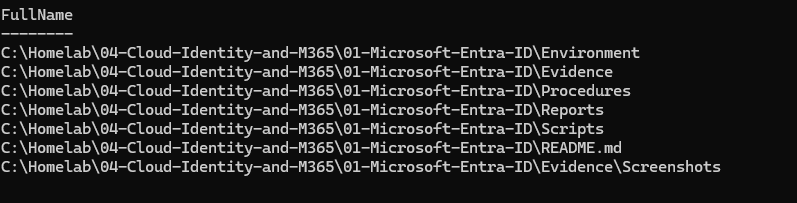
</p>

### Key Lesson

```text
A clear repository structure
makes cloud administration work
easier to review and maintain.
```

---

## Step 2 — Document the Microsoft Entra Tenant

Created:

```text
Environment\Tenant-Overview.md
```

The tenant overview documents:

- Tenant display name
- Primary domain
- Tenant type
- Country or region
- Licence level
- Administrative environment
- Identity model
- Security considerations
- Planned validation

The tenant is used for:

- Cloud identity administration
- User and group management
- Role review
- Activity monitoring
- Microsoft Graph automation
- Future hybrid identity
- Future Microsoft 365 administration

<p align="center">
  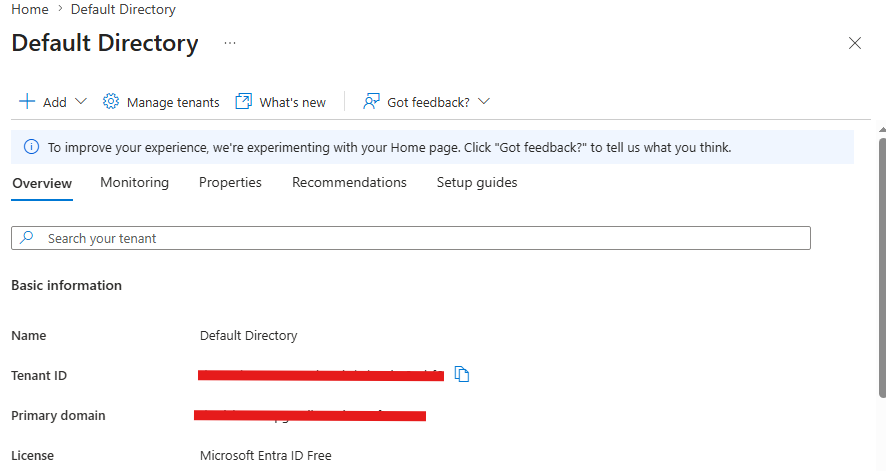
</p>

---

## Step 3 — Create Cloud-Only Users

Created three cloud-only test users:

| User | Department | Job Title | Identity Source |
|---|---|---|---|
| Alex Rivera | IT | Cloud Support Analyst | Microsoft Entra ID |
| Maya Santos | Finance | Finance Associate | Microsoft Entra ID |
| Jordan Lee | Human Resources | HR Coordinator | Microsoft Entra ID |

The users were validated as:

```text
User type: Member
Account enabled: Yes
On-premises synchronisation: No
Administrative role: None
```

Created:

```text
Environment\Cloud-User-Inventory.md
```

<p align="center">
  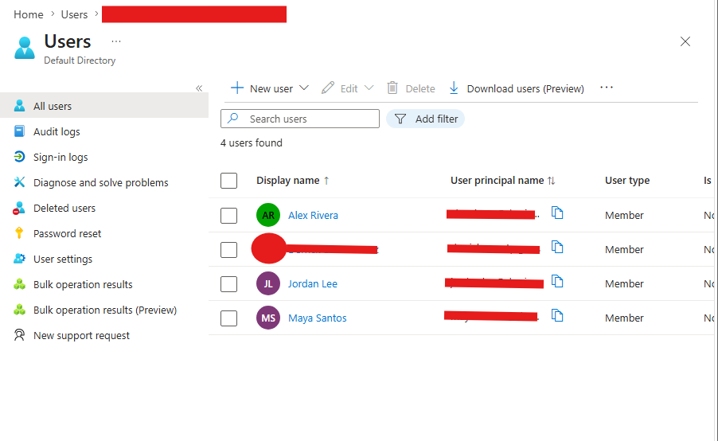
</p>

### Identity Classification

| Identity Type | Description |
|---|---|
| Cloud-only user | Created directly in Microsoft Entra ID |
| Hybrid user | Created on-premises and synchronised to Entra ID |
| Guest user | External identity invited to the tenant |

---

## Step 4 — Create Departmental Security Groups

Created the following assigned security groups:

| Group | Membership Type | Member | Purpose |
|---|---|---|---|
| `SG-Cloud-IT` | Assigned | Alex Rivera | IT cloud access |
| `SG-Cloud-Finance` | Assigned | Maya Santos | Finance cloud access |
| `SG-Cloud-HR` | Assigned | Jordan Lee | Human Resources cloud access |

Group configuration:

```text
Group type: Security
Membership type: Assigned
Identity source: Cloud
Role assignable: No
```

Created:

```text
Environment\Cloud-Group-Inventory.md
```

<p align="center">
  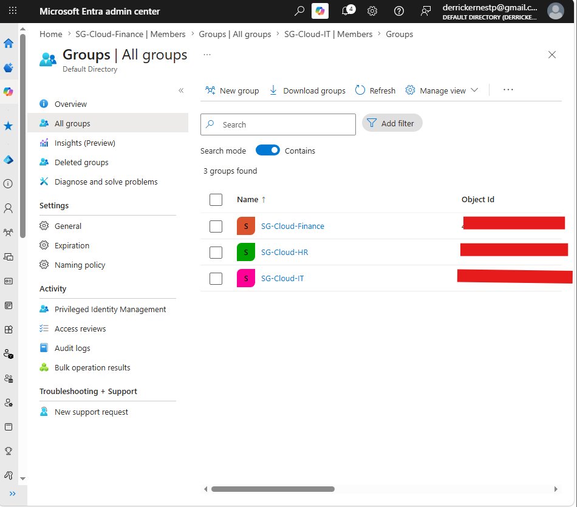
</p>

<p align="center">
  
</p>

### Access Model

```text
User
  ↓
Department security group
  ↓
Application, licence, or resource assignment
```

This approach is easier to manage than assigning access directly to individual users.

---

## Step 5 — Test User Lifecycle Administration

Used Maya Santos to simulate a temporary department transfer.

### Initial State

```text
Department: Finance
Job title: Finance Associate
Group: SG-Cloud-Finance
Account enabled: Yes
```

### Mover Process

```text
Finance user
    ↓
Finance group membership removed
    ↓
Department changed to IT
    ↓
Job title changed to IT Support Trainee
    ↓
Added to SG-Cloud-IT
```

### Temporary Suspension

The account was blocked from signing in without deleting the user object.

```text
Account enabled: No
User object retained: Yes
Properties retained: Yes
Membership visible: Yes
```

<p align="center">
  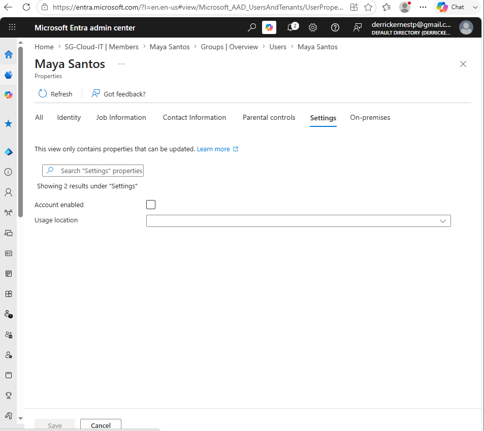
</p>

### Restoration

The user was restored to the original Finance position:

```text
Account enabled: Yes
Department: Finance
Job title: Finance Associate
SG-Cloud-Finance: Member
SG-Cloud-IT: Not a member
```

<p align="center">
  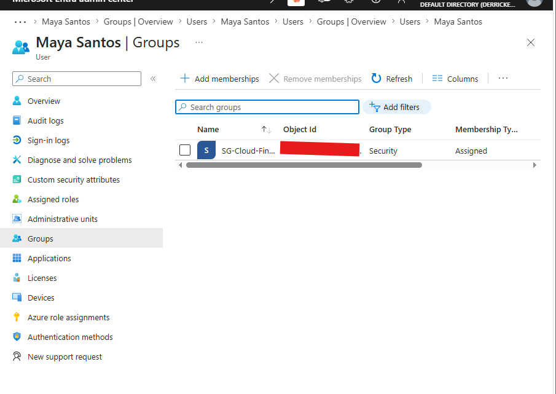
</p>

Created:

```text
Procedures\Cloud-User-Lifecycle-Test.md
```

---

## Step 6 — Review Administrative Roles

Reviewed built-in Microsoft Entra roles including:

| Role | Purpose | Risk |
|---|---|---|
| Global Administrator | Full tenant administration | Critical |
| Privileged Role Administrator | Manage role assignments | Critical |
| User Administrator | Manage users | High |
| Groups Administrator | Manage groups | High |
| Helpdesk Administrator | Limited support operations | Medium |
| Conditional Access Administrator | Manage access policies | High |
| Security Reader | Read security information | Low |
| Global Reader | Read administrative settings | Low |

Confirmed the test users had no administrative roles.

```text
Alex Rivera: No administrative role
Maya Santos: No administrative role
Jordan Lee: No administrative role
```

Created:

```text
Environment\Administrative-Role-Review.md
```

<p align="center">
  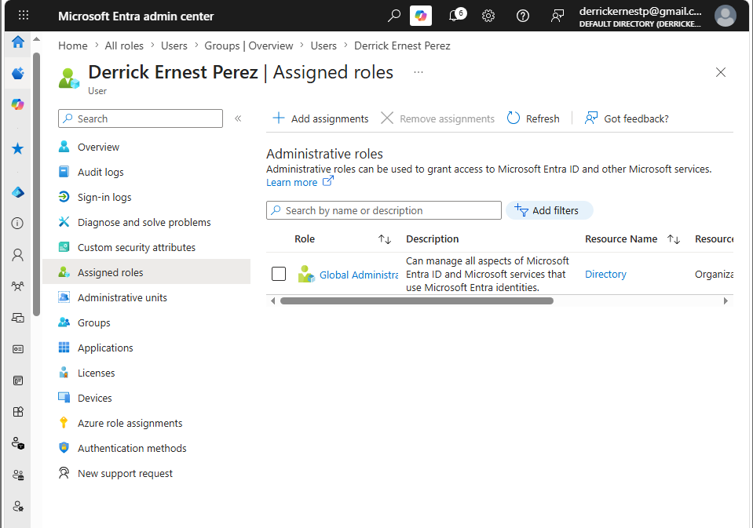
</p>

### Least-Privilege Model

```text
Administrative task
        ↓
Identify required permissions
        ↓
Select the narrowest suitable role
        ↓
Assign only for the required scope
        ↓
Review and remove when no longer needed
```

---

## Step 7 — Review Audit Logs

Reviewed Microsoft Entra audit events generated by:

- User creation
- Group creation
- Group membership changes
- User property updates
- Account disablement
- Account restoration

Relevant activities included:

```text
Add user
Add group
Add member to group
Remove member from group
Update user
```

The logs recorded:

- Activity
- Status
- Initiating administrator
- Target object
- Date and time
- Category
- Modified properties
- Correlation information

<p align="center">
  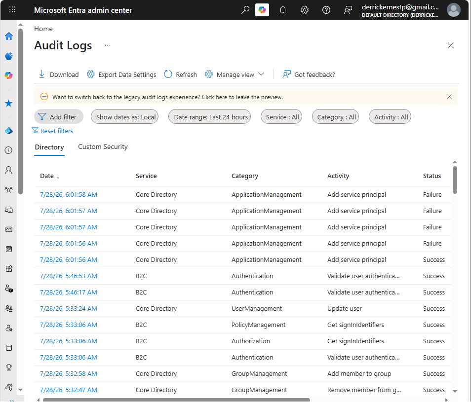
</p>

The modified-properties view confirmed that Maya Santos was restored from IT to Finance:

```text
Department
Old value: IT
New value: Finance

Job title
Old value: IT Support Trainee
New value: Finance Associate
```

<p align="center">
  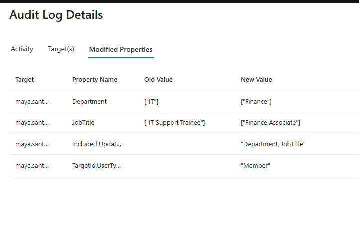
</p>

Created:

```text
Reports\Entra-Audit-Log-Review.md
Reports\Entra-Audit-Logs.csv
```

### Audit Investigation Model

```text
Administrative change
        ↓
Microsoft Entra audit event
        ↓
Initiating identity recorded
        ↓
Target object recorded
        ↓
Modified properties recorded
        ↓
Result validated
```

---

## Step 8 — Review Sign-In Logs

Generated controlled sign-in activity using Alex Rivera.

The test included:

- One successful sign-in
- One failed sign-in with an incorrect password
- Review of both events in Microsoft Entra sign-in logs

<p align="center">
  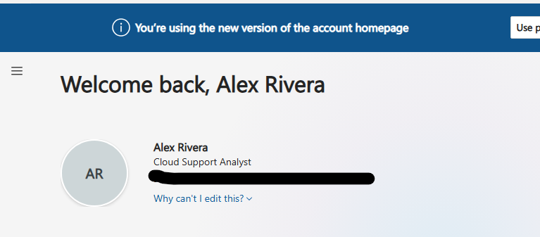
</p>

<p align="center">
  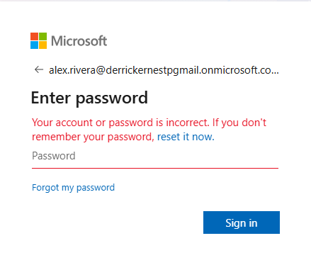
</p>

The sign-in logs were reviewed for:

- User
- Application
- Resource
- Status
- IP address
- Location
- Browser
- Operating system
- Authentication requirement
- Conditional Access result
- Error code
- Failure reason

<p align="center">
  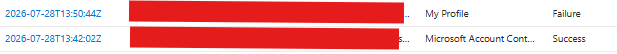
</p>

Created:

```text
Reports\Entra-Sign-In-Log-Review.md
Reports\Entra-Sign-In-Logs.csv
```

### Sign-In Investigation Model

```text
User sign-in attempt
        ↓
Microsoft Entra authentication
        ↓
Sign-in event created
        ↓
User, application, and resource recorded
        ↓
Authentication result recorded
        ↓
Administrator reviews success or failure
```

---

## Step 9 — Export Tenant Inventory with Microsoft Graph PowerShell

Installed and used the Microsoft Graph PowerShell SDK.

Connected using delegated read permissions:

```powershell
Connect-MgGraph `
    -TenantId "TENANT-ID" `
    -Scopes "User.Read.All","Group.Read.All","Organization.Read.All" `
    -UseDeviceCode `
    -ContextScope Process
```

The initial connection used a personal Microsoft account and returned:

```text
This API is not supported for MSA accounts
```

The issue was resolved by:

- Disconnecting the existing Graph session
- Clearing the cached authentication context
- Connecting with the tenant ID
- Using device-code authentication
- Selecting the work or school account
- Confirming the correct Entra tenant context

This was an important troubleshooting lesson:

```text
A successful Microsoft login
does not always mean
the correct tenant identity was used.
```

Created:

```text
Scripts\Export-EntraInventory.ps1
```

Generated:

```text
Reports\Entra-Tenant-Inventory.csv
Reports\Entra-User-Inventory.csv
Reports\Entra-Group-Inventory.csv
Reports\Entra-Inventory-Summary.txt
```

<p align="center">
  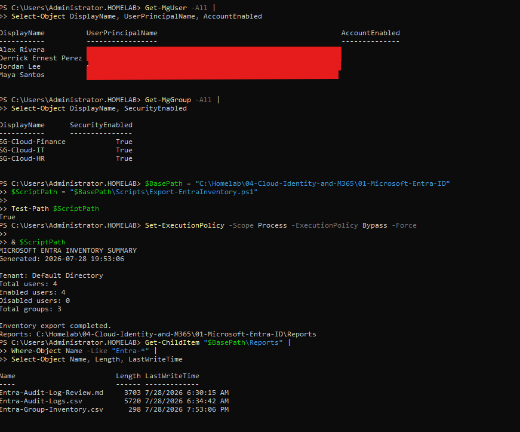
</p>

---

## Step 10 — Validate the Entra Configuration

Created:

```text
Scripts\Test-EntraConfiguration.ps1
```

The validation script checked:

- Microsoft Graph connection
- Tenant access
- User existence
- Account state
- Department
- Job title
- Cloud-only identity state
- Security-group existence
- Security-group type
- Expected membership
- Required documentation
- Required reports

An initial validation returned:

```text
PassedChecks: 22
FailedChecks: 15
FinalStatus: REVIEW REQUIRED
```

The groups and memberships passed, but user checks failed because the script used an incorrect tenant domain.

The issue was traced to:

```text
Incorrect or malformed TenantDomain variable
```

The correct domain was set as:

```powershell
$TenantDomain = "derrickernestpgmail.onmicrosoft.com"
```

A second issue occurred when the domain was entered as a standalone PowerShell line rather than a quoted variable assignment.

Incorrect:

```powershell
d-------------
```

Correct:

```powershell
$TenantDomain = "d--------onmicrosoft.com"
```

After correcting the script:

```text
FailedChecks: 0
FinalStatus: PASSED
```

<p align="center">
  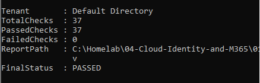
</p>

Generated:

```text
Reports\Entra-Configuration-Validation.csv
```

---

## Step 11 — Create the Cloud Account Administration SOP

Created:

```text
Procedures\SOP-Cloud-Account-Administration.md
```

The SOP documents:

- Account creation
- User property configuration
- Group assignment
- Account modification
- Temporary suspension
- Account restoration
- Validation
- Security requirements
- Escalation criteria

<p align="center">
  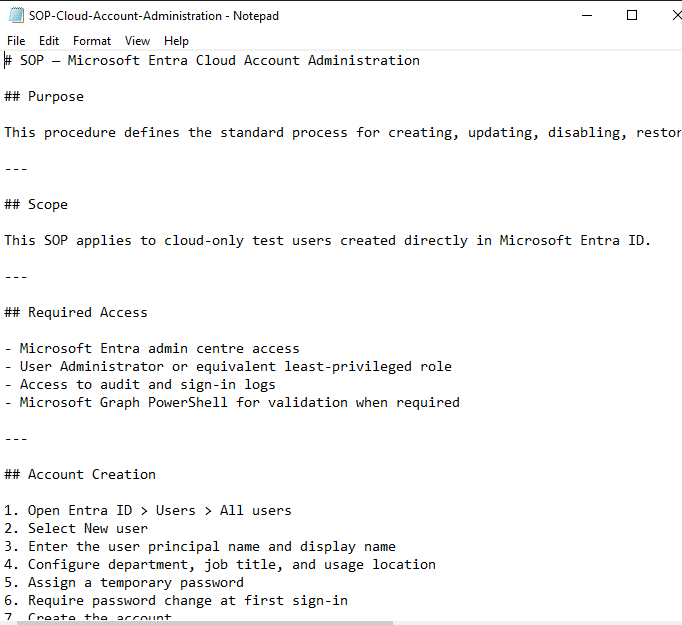
</p>

### Standard Lifecycle Process

```text
Request received
      ↓
Identity details validated
      ↓
Account created or modified
      ↓
Required groups assigned
      ↓
Unnecessary access removed
      ↓
Account state validated
      ↓
Audit activity reviewed
      ↓
Documentation updated
```

---

## Step 12 — Perform Final Validation

The final project validation checked:

- Required documents
- Required scripts
- Required reports
- Required screenshots
- Microsoft Graph validation results
- User and group configuration
- Evidence completeness

Final result:

```text
MICROSOFT ENTRA ID FINAL VALIDATION

Required files passed: True
Required screenshots passed: True
Configuration checks passed: True
Missing files: 0
Missing screenshots: 0
Failed configuration checks: 0
Final status: PASSED
```

<p align="center">
  
</p>

---

# Cloud Identity Inventory

## Users

| Display Name | Department | Job Title | Account State | Source |
|---|---|---|---|---|
| Alex Rivera | IT | Cloud Support Analyst | Enabled | Cloud-only |
| Maya Santos | Finance | Finance Associate | Enabled | Cloud-only |
| Jordan Lee | Human Resources | HR Coordinator | Enabled | Cloud-only |

## Groups

| Group | Type | Membership | Expected Member |
|---|---|---|---|
| `SG-Cloud-IT` | Security | Assigned | Alex Rivera |
| `SG-Cloud-Finance` | Security | Assigned | Maya Santos |
| `SG-Cloud-HR` | Security | Assigned | Jordan Lee |

---

# PowerShell Automation

## Export Entra inventory

```powershell
& "C:\Homelab\04-Cloud-Identity-and-M365\01-Microsoft-Entra-ID\Scripts\Export-EntraInventory.ps1"
```

## Validate Entra configuration

```powershell
& "C:\Homelab\04-Cloud-Identity-and-M365\01-Microsoft-Entra-ID\Scripts\Test-EntraConfiguration.ps1"
```

## Connect to Microsoft Graph

```powershell
Connect-MgGraph `
    -TenantId "YOUR-TENANT-ID" `
    -Scopes "User.Read.All","Group.Read.All","Organization.Read.All" `
    -UseDeviceCode `
    -ContextScope Process
```

## Verify Graph context

```powershell
Get-MgContext |
Select-Object Account, TenantId, AuthType, ContextScope, Scopes
```

## Retrieve tenant information

```powershell
Get-MgOrganization |
Select-Object DisplayName, Id
```

## Retrieve users

```powershell
Get-MgUser -All |
Select-Object DisplayName, UserPrincipalName, AccountEnabled
```

## Retrieve groups

```powershell
Get-MgGroup -All |
Select-Object DisplayName, SecurityEnabled
```

## Retrieve group members

```powershell
$Group = Get-MgGroup -Filter "displayName eq 'SG-Cloud-IT'"

Get-MgGroupMemberAsUser `
    -GroupId $Group.Id `
    -All |
Select-Object DisplayName, UserPrincipalName
```

## Disconnect from Graph

```powershell
Disconnect-MgGraph
```

---

# Reports Produced

| Report | Purpose |
|---|---|
| [`Entra-Audit-Log-Review.md`](Reports/Entra-Audit-Log-Review.md) | Documents reviewed administrative activity |
| [`Entra-Sign-In-Log-Review.md`](Reports/Entra-Sign-In-Log-Review.md) | Documents successful and failed authentication |
| [`Entra-Inventory-Summary.txt`](Reports/Entra-Inventory-Summary.txt) | High-level tenant summary |
| [`Microsoft-Entra-Final-Validation.txt`](Reports/Microsoft-Entra-Final-Validation.txt) | Final project status |

---

# Security Controls Applied

## Least Privilege

- Standard users received no administrative roles
- Department groups were not role assignable
- Read-only Graph permissions were used for inventory
- Global Administrator was not assigned to test users
- Privileged access was reviewed separately

## Credential Protection

- Temporary passwords were not stored in documentation
- Passwords were not exposed in screenshots
- Client secrets were not created or committed
- Microsoft Graph authentication used delegated sign-in
- Sensitive identifiers were excluded from public evidence

## Access Management

- Access was assigned through security groups
- Department changes included access removal and reassignment
- Temporary account suspension used account disablement
- Account restoration included final access validation
- Unnecessary membership was removed

## Monitoring

- Administrative changes were reviewed in audit logs
- Successful and failed authentication were reviewed
- Modified properties were validated
- CSV exports were saved for reporting
- Automated configuration checks were performed

---

# Troubleshooting Scenarios

| Scenario | Root Cause | Resolution |
|---|---|---|
| Users were not visible in the group | Members had not been added or group membership page was not opened | Added users through the group Members page and refreshed |
| Audit-log search returned no results | Filters, date range, or log propagation delayed results | Removed filters, widened date range, searched by target UPN, and refreshed |
| Microsoft Graph organisation query failed | Connected with a personal Microsoft account | Reconnected using tenant ID, device code, and work account |
| Graph context appeared blank | Incorrect or incomplete authentication context | Disconnected, cleared cached context, and reconnected |
| Inventory script could not be executed | Script did not exist at the expected path | Recreated and verified the script file |
| Validation script failed all user checks | Incorrect tenant domain in UPN comparison | Corrected the TenantDomain value |
| Tenant domain was treated as a command | Domain was placed on a standalone line | Replaced it with a quoted variable assignment |
| Markdown creation script failed | Backticks were used inside double-quoted PowerShell strings | Used single-quoted Markdown code fences |

---

# Root-Cause Lessons

## Microsoft Account vs Work Account

```text
Authentication succeeded
        ↓
Graph organisation query failed
        ↓
Error indicated MSA account
        ↓
Graph context reviewed
        ↓
Correct tenant account selected
        ↓
Organisation, user, and group queries succeeded
```

The lesson:

```text
Successful authentication
does not guarantee
the correct identity context.
```

## Exact Identity Values Matter

```text
Groups passed
Users failed
        ↓
User objects confirmed to exist
        ↓
UPN comparison reviewed
        ↓
Tenant domain mismatch identified
        ↓
Domain corrected
        ↓
Validation passed
```

The lesson:

```text
Automation should validate
the exact source data
used by the platform.
```

## PowerShell Syntax Matters

Incorrect:

```powershell
derrickernestpgmail.onmicrosoft.com
```

Correct:

```powershell
$TenantDomain = "derrickernestpgmail.onmicrosoft.com"
```

The lesson:

```text
Configuration values must be assigned,
quoted,
and validated before execution.
```

---

# Skills Demonstrated

## Microsoft Entra ID

- Tenant administration
- Cloud user management
- Security-group management
- User property administration
- Account enablement and disablement
- Identity lifecycle management
- Administrative-role review
- Audit-log analysis
- Sign-in-log analysis
- Least-privilege access

## Identity and Access Management

- Joiner, Mover, and Leaver workflows
- Cloud-only identity administration
- Group-based access control
- Departmental access assignment
- Temporary account suspension
- Access restoration
- Privileged-role awareness
- Identity validation

## Microsoft Graph PowerShell

- Microsoft Graph SDK installation
- Delegated authentication
- Tenant-scoped connection
- User inventory
- Group inventory
- Membership retrieval
- CSV export
- Automated validation
- Error investigation
- Authentication-context troubleshooting

## Security Monitoring

- Audit-log investigation
- Sign-in-log investigation
- Successful authentication review
- Failed authentication review
- Modified-property analysis
- Administrative activity review
- Evidence collection

## Documentation

- Tenant overview
- User inventory
- Group inventory
- Administrative-role review
- Lifecycle procedure
- Standard Operating Procedure
- Audit report
- Sign-in report
- Validation report
- Screenshots and evidence

---

# Interview Preparation

## What is Microsoft Entra ID?

Microsoft Entra ID is Microsoft’s cloud identity and access-management platform. It provides user authentication, group management, application access, administrative roles, Conditional Access, identity monitoring, and integration with Microsoft cloud services.

## What is a cloud-only identity?

A cloud-only identity is created directly in Microsoft Entra ID and is not synchronised from an on-premises Active Directory environment.

## What is the difference between a user and a security group?

A user represents an identity.

A security group represents a collection of identities used to assign access to resources, applications, policies, or licences.

## Why use group-based access?

Group-based access is easier to manage, review, and remove than assigning permissions directly to individual users.

## What is least privilege?

Least privilege means giving an identity only the permissions required to perform its assigned responsibilities.

## What is the difference between audit logs and sign-in logs?

Audit logs record administrative changes.

Sign-in logs record authentication attempts.

```text
Audit log
= what changed

Sign-in log
= who tried to authenticate
```

## What information is available in an audit log?

- Activity
- Status
- Initiating identity
- Target object
- Category
- Date and time
- Modified properties
- Correlation information

## What information is available in a sign-in log?

- User
- Application
- Resource
- Authentication result
- Error code
- IP address
- Location
- Browser
- Operating system
- Authentication method
- Conditional Access result

## Why was `Get-MgOrganization` failing?

The Graph session was authenticated with a personal Microsoft account instead of a Microsoft Entra work account.

## Why did the validation script initially fail the users?

The script compared the users against an incorrect tenant domain, so the expected UPNs did not match the actual Microsoft Entra UPNs.

## Why block an account instead of deleting it?

Blocking sign-in immediately prevents authentication while preserving the identity object, properties, and relationships for investigation or later restoration.

## Why review audit logs after account changes?

Audit logs confirm who made the change, what object was changed, which properties were modified, and whether the operation succeeded.

---

# Validation Results

| Validation Area | Result |
|---|:---:|
| Project structure created | ✅ |
| Tenant documented | ✅ |
| Cloud users created | ✅ |
| User properties configured | ✅ |
| Security groups created | ✅ |
| Memberships configured | ✅ |
| User lifecycle tested | ✅ |
| Account suspension tested | ✅ |
| Account restoration tested | ✅ |
| Administrative roles reviewed | ✅ |
| Audit logs reviewed | ✅ |
| Sign-in logs reviewed | ✅ |
| Audit CSV exported | ✅ |
| Sign-in CSV exported | ✅ |
| Microsoft Graph connected | ✅ |
| Tenant inventory exported | ✅ |
| User inventory exported | ✅ |
| Group inventory exported | ✅ |
| Configuration script created | ✅ |
| Failed validation checks | `0` |
| Final validation | `PASSED` |

---

# What I Learned

I learned that cloud identity administration involves much more than creating user accounts.

A user identity must be:

```text
Created
Configured
Assigned
Validated
Monitored
Modified
Suspended
Restored
Documented
```

I also learned that group-based access provides a cleaner and more scalable model than individual assignment.

```text
Identity
   ↓
Security group
   ↓
Resource access
```

The Microsoft Graph troubleshooting process reinforced that authentication context matters.

```text
Correct username
does not always mean
correct tenant context.
```

Audit logs and sign-in logs serve different but complementary purposes.

```text
Audit logs explain changes.

Sign-in logs explain authentication.
```

The validation-script failure demonstrated that automation must account for exact identity attributes such as UPN suffixes.

```text
One incorrect domain value
can invalidate multiple checks.
```

The most important lessons were:

```text
Use least privilege.
```

```text
Assign access through groups.
```

```text
Validate identity state after every change.
```

```text
Review logs after administrative operations.
```

```text
Automate repeatable validation.
```

```text
Document both success and failure.
```

---

# Future Improvements

Future work may include:

- Microsoft Entra Connect Sync
- Microsoft Entra Cloud Sync
- Password Hash Synchronisation
- Seamless Single Sign-On
- Hybrid user validation
- Synchronisation filtering
- Custom domain configuration
- Microsoft 365 licence assignment
- Group-based licensing
- Multifactor authentication
- Conditional Access
- Named locations
- Authentication strength
- Self-service password reset
- Identity Protection
- Privileged Identity Management
- Access reviews
- Entitlement management
- Emergency access accounts
- Break-glass account procedures
- Microsoft Graph application authentication
- Certificate-based automation
- Azure Monitor integration
- Microsoft Sentinel integration
- Automated stale-account reporting
- Automated inactive-user reporting

---

# Next Module

## Hybrid Identity

The next module will use:

```text
SYNC01
Windows Server 2022
```

Planned work includes:

- Verify `SYNC01` server configuration
- Review Active Directory readiness
- Install or validate Microsoft Entra Connect
- Configure directory synchronisation
- Configure Password Hash Synchronisation
- Select synchronisation scope
- Synchronise test users
- Validate hybrid identities
- Review synchronisation status
- Troubleshoot sync failures
- Export hybrid identity inventory
- Create operational documentation
- Perform final validation

```text
On-premises Active Directory
            ↓
          SYNC01
            ↓
 Microsoft Entra Connect
            ↓
    Microsoft Entra ID
```

---

<div align="center">

## Module Status


<br><br>

### Cloud identity administration, lifecycle management, monitoring, automation, and documentation successfully validated.

<br>

<a href="../../">
  
</a>

<a href="../02-Hybrid-Identity">
  
</a>

<br><br>


</div>
