<div align="center">


<br>


<br><br>

<a href="../../">
  
</a>

<a href="evidence/screenshots">
  
</a>

<a href="scripts">
  
</a>

</div>

---

# Hybrid Identity with Microsoft Entra Cloud Sync

This module documents the design, deployment, validation, troubleshooting, recovery, and operational handoff of a hybrid identity environment using **Microsoft Entra Cloud Sync**.

The project connects the on-premises Active Directory domain:

```text
homelab.local
```

to a Microsoft Entra tenant represented publicly as:

```text
yourtenant.onmicrosoft.com
```

Selected Active Directory users were synchronized from `SRV01` through the healthy `SYNC02` provisioning agent to Microsoft Entra ID.

The project also documents a real troubleshooting incident involving the original synchronization server, `SYNC01`.

`SYNC01` successfully registered with Microsoft Entra but repeatedly failed to maintain a healthy Cloud Sync runtime and Microsoft Service Bus relay connection.

A clean and fully updated replacement server, `SYNC02`, completed synchronization successfully under the same Active Directory and Microsoft Entra environment.

The evidence supports isolating the failure to the local Windows, .NET, or Cloud Sync agent runtime environment on `SYNC01`.

The exact low-level root cause was not conclusively identified.

---

# Business Scenario

The Homelab IT Administration team already operates an on-premises Active Directory environment.

```text
SRV01
Windows Server 2025
Domain Controller and DNS
homelab.local
192.168.241.10

CLIENT01
Domain-connected administrative workstation

SYNC01
Original Windows Server 2022
Cloud Sync agent server
Retained for troubleshooting evidence

SYNC02
Replacement Windows Server 2022
Healthy Microsoft Entra Cloud Sync agent
192.168.241.112
```

The organisation needs to extend selected on-premises identities into Microsoft Entra ID while maintaining:

- Controlled synchronization scope
- Secure cloud communication
- Password Hash Sync
- Repeatable validation
- Failure isolation
- Operational documentation
- Public evidence with sensitive information removed

The required identity flow is:

```text
On-premises Active Directory
            ↓
Selected organisational unit
            ↓
Microsoft Entra Cloud Sync agent
            ↓
Microsoft Entra ID
            ↓
Cloud authentication using
Password Hash Sync
```

---

# Project Objectives

By completing this module, I practised:

- Reviewing hybrid identity architecture
- Preparing a dedicated synchronization server
- Joining a Windows Server member server to Active Directory
- Validating DNS and LDAP connectivity
- Installing Microsoft Entra Cloud Sync
- Registering the Cloud Sync provisioning agent
- Validating Cloud Sync Windows services
- Testing Microsoft HTTPS connectivity
- Testing Microsoft Service Bus connectivity
- Restricting synchronization to a selected organisational unit
- Provisioning Active Directory users to Microsoft Entra ID
- Confirming the on-premises source of synchronized identities
- Enabling Password Hash Sync
- Testing cloud authentication with an on-premises password
- Reviewing successful Microsoft Entra sign-in logs
- Troubleshooting an unhealthy synchronization agent
- Comparing failed and healthy server deployments
- Disabling a failed agent safely
- Writing structured incident documentation
- Separating confirmed facts from assumptions
- Producing professional portfolio evidence

---

# Lab Environment

| Component | Configuration |
|---|---|
| On-premises domain | `homelab.local` |
| Domain controller | `SRV01` |
| Domain controller address | `192.168.241.10` |
| Domain controller operating system | Windows Server 2025 |
| Original synchronization server | `SYNC01` |
| Original synchronization server OS | Windows Server 2022 |
| Working synchronization server | `SYNC02` |
| Working synchronization server address | `192.168.241.112` |
| Working synchronization server OS | Windows Server 2022 |
| Administrative workstation | `CLIENT01` |
| Cloud identity platform | Microsoft Entra ID |
| Synchronization technology | Microsoft Entra Cloud Sync |
| Synchronization direction | Active Directory to Microsoft Entra ID |
| Authentication method | Password Hash Sync |
| Synchronization scope | Designated Active Directory organisational unit |
| Test identities | John Smith, Alex Garcia, Lisa Davis |
| Evidence format | PNG screenshots |
| Documentation format | Markdown |

> Sensitive identifiers such as the real tenant domain, administrator addresses, passwords, tenant IDs, job IDs, activity IDs, object IDs, connector IDs, agent IDs, correlation IDs, and diagnostic archives must not be published.

---

# Architecture

```text
                         Microsoft Cloud
                               │
                       Microsoft Entra ID
                               │
                 ┌─────────────┴─────────────┐
                 │                           │
          User Provisioning           Cloud Authentication
                 │                     Password Hash Sync
                 │                           │
                 └─────────────┬─────────────┘
                               │
                    HTTPS 443 / Service Bus
                               │
                            SYNC02
                     Windows Server 2022
                 Microsoft Entra Cloud Sync
                       192.168.241.112
                               │
                    LDAP / DNS / Kerberos
                               │
                             SRV01
                     Windows Server 2025
                 Domain Controller and DNS
                       192.168.241.10
                               │
                         homelab.local
                               │
                     OU-scoped test users
                 John Smith • Alex Garcia
                         Lisa Davis
```

## Synchronization Flow

```text
Active Directory user object
            ↓
Cloud Sync scope evaluation
            ↓
SYNC02 provisioning agent
            ↓
Microsoft Service Bus communication
            ↓
Microsoft Entra provisioning service
            ↓
Hybrid identity created or updated
```

## Password Authentication Flow

```text
Password reset in Active Directory
            ↓
Active Directory password hash changes
            ↓
SYNC02 processes the password-hash update
            ↓
Protected derived hash sent to Entra
            ↓
User authenticates to Microsoft Entra ID
```

---

# Repository Structure

```text
02-Hybrid-Identity
│
├── README.md
│
├── docs
│
├── scripts
│
└── evidence
    └── screenshots
        ├── 01-infrastructure-validation
        │   ├── 01-SYNC02-Domain-Membership.png
        │   ├── 02-SYNC02-DNS-Resolution.png
        │   └── 03-SYNC02-LDAP-Connectivity.png
        │
        ├── 02-agent-validation
        │   ├── 04-SYNC02-Cloud-Sync-Services.png
        │   ├── 05-SYNC02-Microsoft-HTTPS-Connectivity.png
        │   ├── 06-SYNC02-Service-Bus-Connectivity.png
        │   ├── 07-SYNC02-Agent-Network-Connections.png
        │   └── 08-Entra-SYNC02-Agent-Active.png
        │
        ├── 03-provisioning-validation
        │   ├── 09-Entra-Successful-Provisioning-Cycle.png
        │   ├── 10-Entra-Synchronized-Users.png
        │   ├── 11-Entra-On-Premises-Sync-Enabled.png
        │   ├── 18-Entra-Cloud-Sync-Scoping-Configuration.png
        │   └── 19-SRV01-Scoped-Active-Directory-Users.png
        │
        ├── 04-password-hash-sync
        │   ├── 12-Entra-Password-Hash-Sync-Enabled.png
        │   ├── 13-Entra-Password-Hash-Sync-Sign-In-Success.png
        │   └── 14-Entra-Successful-Sign-In-Log.png
        │
        └── 05-troubleshooting
            ├── 15-Entra-Agent-Failover-State.png
            ├── 16-SYNC01-Cloud-Sync-Service-Disabled.png
            └── 17-SYNC01-Cloud-Sync-Agent-Failure.png
```

---

# Implementation Summary

## Step 1 — Prepare the Replacement Synchronization Server

A clean Windows Server 2022 virtual machine named `SYNC02` was prepared after the original `SYNC01` deployment became unhealthy.

The replacement server was:

- Fully updated through Windows Update
- Joined to `homelab.local`
- Configured to use the domain controller for DNS
- Validated for Active Directory connectivity
- Validated for outbound Microsoft connectivity
- Installed with the Microsoft Entra Cloud Sync provisioning agent
- Registered in the Microsoft Entra tenant
- Confirmed as active in the Entra admin center

The Cloud Sync agent was installed on a dedicated member server instead of directly on the domain controller.

---

## Step 2 — Validate Domain Membership

The following command confirmed that `SYNC02` was joined to the correct Active Directory domain:

```powershell
Get-ComputerInfo |
Select-Object CsName, CsDomain, CsDomainRole
```

<p align="center">
  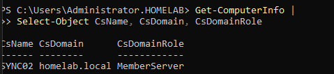
</p>

### Result

```text
Computer name: SYNC02
Domain: homelab.local
Role: Member server
```

### Key Lesson

```text
A synchronization server must be able
to identify and communicate with
the correct Active Directory domain.
```

---

## Step 3 — Validate DNS Resolution

The following command confirmed that the domain name resolved to the domain controller:

```powershell
Resolve-DnsName homelab.local
```

<p align="center">
  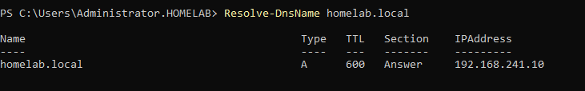
</p>

### Result

```text
homelab.local
      ↓
192.168.241.10
```

DNS is essential because the Cloud Sync agent must locate the domain controller and Active Directory services reliably.

---

## Step 4 — Validate LDAP Connectivity

The following command tested TCP connectivity to LDAP port `389` on the domain controller:

```powershell
Test-NetConnection 192.168.241.10 -Port 389 |
Select-Object ComputerName, RemotePort, TcpTestSucceeded
```

<p align="center">
  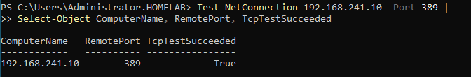
</p>

### Result

```text
Remote port: 389
TCP test: True
```

LDAP allows the provisioning agent to read Active Directory objects and attributes.

---

## Step 5 — Validate Cloud Sync Services

The following command checked the Microsoft Entra Cloud Sync services:

```powershell
Get-Service AADConnectProvisioningAgent, AzureADConnectAgentUpdater |
Select-Object Status, Name, DisplayName
```

<p align="center">
  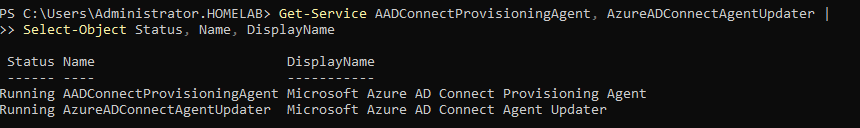
</p>

### Services

| Service | Purpose |
|---|---|
| `AADConnectProvisioningAgent` | Performs provisioning and synchronization work |
| `AzureADConnectAgentUpdater` | Keeps the Cloud Sync agent updated |

### Result

```text
AADConnectProvisioningAgent: Running
AzureADConnectAgentUpdater: Running
```

---

## Step 6 — Validate Microsoft HTTPS Connectivity

The following command tested outbound HTTPS connectivity to Microsoft authentication services:

```powershell
Test-NetConnection login.microsoftonline.com -Port 443 |
Select-Object ComputerName, RemotePort, TcpTestSucceeded
```

<p align="center">
  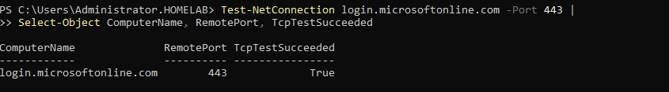
</p>

### Result

```text
Remote port: 443
TCP test: True
```

Port `443` is used for encrypted HTTPS communication with Microsoft cloud services.

---

## Step 7 — Validate Microsoft Service Bus Connectivity

The Cloud Sync agent uses Microsoft Service Bus as part of its communication channel.

The following command tested the Service Bus endpoint:

```powershell
Test-NetConnection his-asia1-seas2.servicebus.windows.net -Port 443 |
Select-Object ComputerName, RemotePort, TcpTestSucceeded
```

<p align="center">
  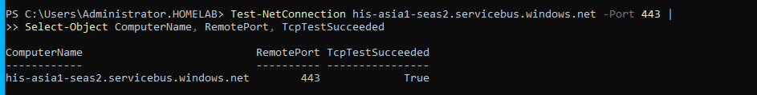
</p>

### Result

```text
Service Bus endpoint reachable: True
```

---

## Step 8 — Confirm Active Agent Network Connections

The following commands identified the Cloud Sync service process and grouped its established TCP connections by remote port:

```powershell
$service = Get-CimInstance Win32_Service `
    -Filter "Name='AADConnectProvisioningAgent'"

Get-NetTCPConnection `
    -OwningProcess $service.ProcessId `
    -State Established |
Group-Object RemotePort |
Select-Object Name, Count
```

<p align="center">
  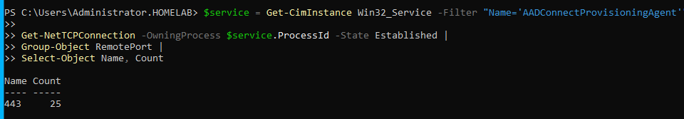
</p>

### Result

```text
Remote port: 443
Established connections: 25
```

This proved that the provisioning-agent process maintained active encrypted cloud connections.

---

## Step 9 — Confirm `SYNC02` as an Active Entra Agent

The Microsoft Entra admin center displayed `SYNC02` as an active Cloud Sync agent.

<p align="center">
  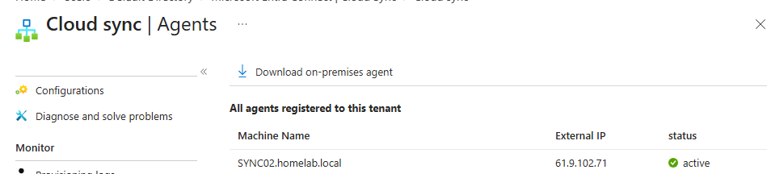
</p>

### Result

```text
Agent: SYNC02
Status: Active
```

---

## Step 10 — Validate the Provisioning Cycle

The Cloud Sync provisioning job completed successfully.

<p align="center">
  
</p>

### Result

```text
Users processed: 3
Cycle duration: approximately 24 seconds
Steady state: Achieved
Current errors: None
```

A steady state means the provisioning service completed the available work and had no remaining changes to process at that moment.

---

## Step 11 — Confirm Synchronized Users

The following users appeared in Microsoft Entra ID:

| Display Name | Source |
|---|---|
| John Smith | Windows Server Active Directory |
| Alex Garcia | Windows Server Active Directory |
| Lisa Davis | Windows Server Active Directory |

<p align="center">
  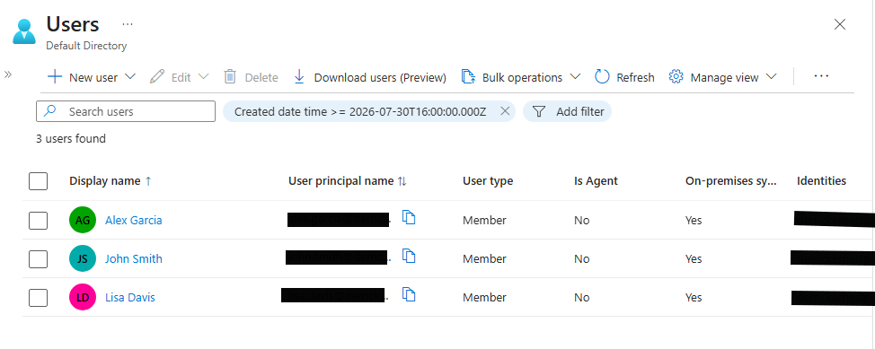
</p>

### Provisioning Path

```text
SRV01 Active Directory
        ↓
SYNC02 Cloud Sync agent
        ↓
Microsoft Entra ID
```

---

## Step 12 — Confirm On-Premises Identity Source

A synchronized user's Microsoft Entra profile showed:

```text
On-premises sync enabled: Yes
Source: Windows Server AD
```

<p align="center">
  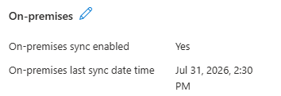
</p>

This proves that the user was synchronized from Active Directory and was not manually created as a cloud-only identity.

---

## Step 13 — Validate Synchronization Scope

Cloud Sync was restricted to the designated Active Directory organisational unit.

<p align="center">
  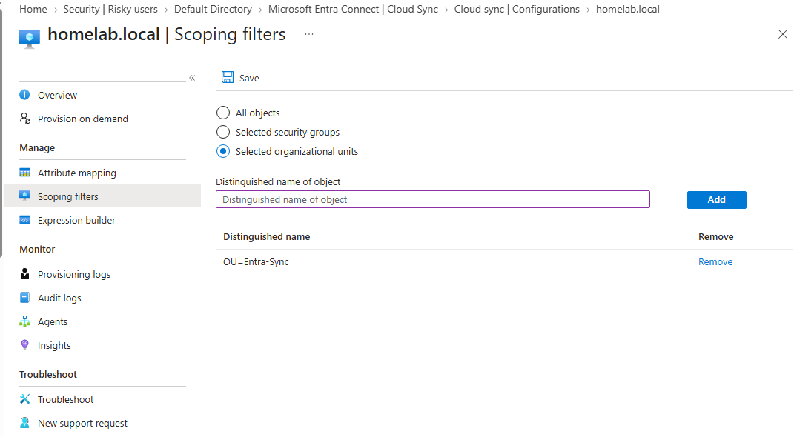
</p>

### Security Purpose

```text
Controlled OU scope
        ↓
Only intended users processed
        ↓
Administrative and unrelated accounts excluded
```

This supports least privilege and reduces the risk of accidental synchronization.

---

## Step 14 — Validate Source Users in Active Directory

The following command confirmed the users inside the scoped organisational unit:

```powershell
Get-ADUser `
    -SearchBase "OU=Entra-Sync,DC=homelab,DC=local" `
    -Filter * |
Select-Object Name, SamAccountName, Enabled
```

<p align="center">
  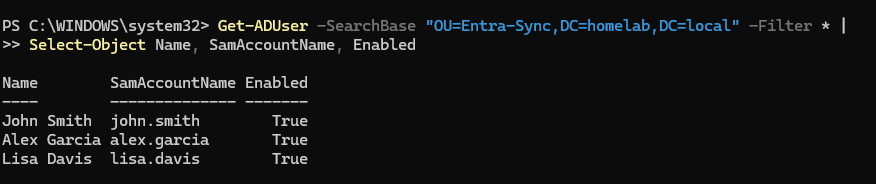
</p>

### Expected Users

```text
John Smith
Alex Garcia
Lisa Davis
```

Each source account was enabled.

---

# Password Hash Sync

## Step 15 — Confirm Password Hash Sync Status

The Password Hash Sync job was enabled and configured with a fixed five-minute interval.

<p align="center">
  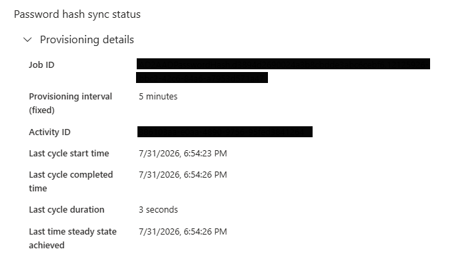
</p>

### Observed Job State

```text
Provisioning interval: 5 minutes
Cycle duration: 3 seconds
Steady state: Achieved
```

Password Hash Sync does not transmit the user's plain-text password.

A protected value derived from the on-premises Active Directory password hash is synchronized to Microsoft Entra ID.

---

## Step 16 — Perform a Functional Password Test

John Smith's password was reset in on-premises Active Directory and tested against the synchronized Microsoft Entra account.

The first cloud sign-in attempt failed even though the Password Hash Sync job was healthy.

The following command was used to inspect the Active Directory account state:

```powershell
Get-ADUser -Identity "john.smith" `
    -Properties Enabled,PasswordLastSet,PasswordNeverExpires,pwdLastSet |
Select-Object SamAccountName,Enabled,PasswordLastSet,PasswordNeverExpires,pwdLastSet
```

The result included:

```text
Enabled              : True
PasswordLastSet      :
PasswordNeverExpires : False
pwdLastSet           : 0
```

`pwdLastSet : 0` indicated that the following setting was enabled:

```text
User must change password at next logon
```

The password was reset again with that option unchecked.

The account was then rechecked to confirm:

```text
PasswordLastSet: Recent timestamp
pwdLastSet: Nonzero value
```

After the next Password Hash Sync cycle, the new password successfully authenticated to Microsoft Entra ID.

<p align="center">
  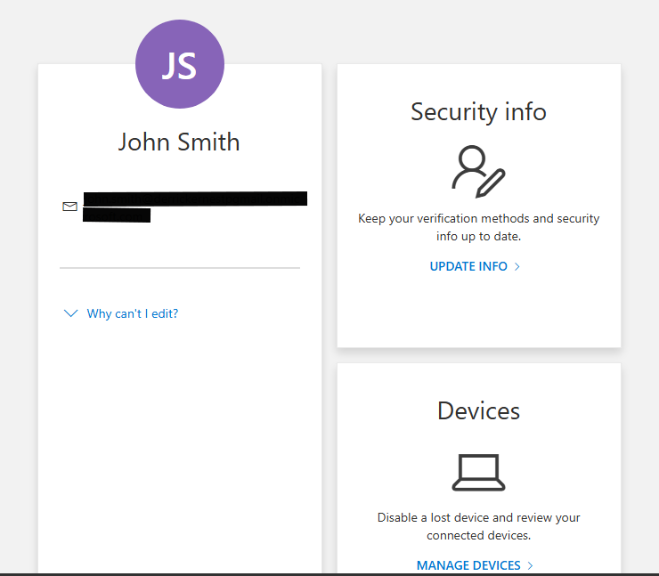
</p>

---

## Step 17 — Review the Successful Sign-In Log

The successful authentication was confirmed in Microsoft Entra sign-in logs.

<p align="center">
  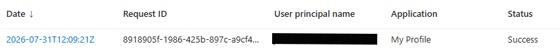
</p>

### End-to-End Validation

```text
Password reset in Active Directory
              ↓
Password hash change detected
              ↓
SYNC02 processed the change
              ↓
Protected derived hash synchronized
              ↓
Microsoft Entra accepted the password
              ↓
Successful sign-in log created
```

---

# Troubleshooting Incident

## Incident Record

| Field | Value |
|---|---|
| Incident ID | `HI-CS-001` |
| Title | Cloud Sync agent registered but repeatedly became unavailable on `SYNC01` |
| Severity | Medium |
| Environment | Homelab |
| Affected service | Microsoft Entra Cloud Sync |
| Affected host | `SYNC01` |
| Resolution | Replacement deployment on `SYNC02` |
| Exact root cause | Inconclusive |
| Final status | Resolved |

---

## Incident Summary

The original Microsoft Entra Cloud Sync agent on `SYNC01` successfully registered with Microsoft Entra but repeatedly failed to maintain a healthy provisioning and relay channel.

The Microsoft Entra portal reported timeout and gateway-related failures.

Local logs showed abnormal runtime, performance counter, collection enumeration, Microsoft Service Bus relay, and WebSocket errors.

The issue persisted after testing through a phone hotspot.

Because the same problem occurred through an alternate internet connection, the investigation shifted away from the primary network path and toward the local Windows, .NET, or Cloud Sync agent runtime environment on `SYNC01`.

A clean and fully updated replacement server named `SYNC02` was deployed.

The same Active Directory domain, Microsoft Entra tenant, synchronization scope, and general connectivity requirements worked successfully through `SYNC02`.

---

## Impact

```text
Cloud Sync agent unavailable
        ↓
Provisioning reliability lost
        ↓
User synchronization could not be trusted
        ↓
Replacement agent required
```

No production users or business systems were affected because the incident occurred in a controlled homelab environment.

---

## Symptoms

### Microsoft Entra Portal Errors

```text
HybridIdentityServiceAgentTimeout
ConnectorTimeout
GatewayTimeout
```

### Local Runtime and Agent Errors

```text
The requested Performance Counter is not a custom counter,
it has to be initialized as ReadOnly
```

```text
Collection was modified;
enumeration operation may not execute
```

Additional observed symptoms included:

- Microsoft Service Bus relay fault
- Relay listener going offline
- WebSocket connection ending unexpectedly
- `More data was expected, but EOF was reached`
- `ServiceBusClientWebSocket was expecting more bytes`

---

## Troubleshooting Method

The investigation followed a layered process:

```text
Agent registration
        ↓
Active Directory communication
        ↓
DNS resolution
        ↓
HTTPS connectivity
        ↓
Service account and permissions
        ↓
PowerShell execution environment
        ↓
Service Bus relay channel
        ↓
Performance counters
        ↓
Alternate network
        ↓
Clean replacement server comparison
```

This prevented a premature conclusion based on a single error message.

---

## Troubleshooting Timeline

| Stage | Action | Result |
|---|---|---|
| 1 | Installed and registered the Cloud Sync agent on `SYNC01` | Registration completed |
| 2 | Reviewed Microsoft Entra agent status | Agent became unhealthy or timed out |
| 3 | Validated Active Directory connectivity | LDAP succeeded |
| 4 | Validated DNS resolution | DNS succeeded |
| 5 | Validated outbound HTTPS | Port `443` succeeded |
| 6 | Reviewed gMSA and permissions | No definitive failure found |
| 7 | Reviewed PowerShell execution policy | Not identified as the cause |
| 8 | Reviewed local agent logs | Runtime, relay, counter, and WebSocket errors found |
| 9 | Tested through a phone hotspot | Same failure occurred |
| 10 | Inspected performance counters | Category existed and was readable and writable |
| 11 | Collected a diagnostic archive | Evidence preserved privately |
| 12 | Built and fully updated `SYNC02` | Server preparation succeeded |
| 13 | Installed the Cloud Sync agent on `SYNC02` | Agent remained active |
| 14 | Ran provisioning | Three users synchronized |
| 15 | Tested Password Hash Sync | Successful after correcting `pwdLastSet` |
| 16 | Disabled the `SYNC01` agent service | Failed agent isolated |

---

## Tests and Findings

| Test | Result | Interpretation |
|---|---|---|
| Agent registration | Passed | Tenant authentication and initial registration worked |
| LDAP connectivity | Passed | Active Directory was reachable |
| DNS resolution | Passed | Name resolution was functional |
| HTTPS port `443` | Passed | Basic Microsoft cloud connectivity existed |
| gMSA review | Passed or inconclusive | No confirmed service-account failure |
| PowerShell execution policy | Passed | Not identified as the blocking cause |
| Mobile hotspot test | Same failure | Primary router or ISP was unlikely to be the sole cause |
| Performance counter category | Present, readable, writable | Counter error was real but not proven as the root cause |
| Clean `SYNC02` comparison | Passed | Failure was isolated to `SYNC01` |

---

## Hypotheses Tested

### Hypothesis 1 — Incorrect Tenant Authentication

**Evidence:**

- Agent registration succeeded.
- The tenant accepted the agent registration.

**Conclusion:**

```text
Not supported as the primary cause
```

---

### Hypothesis 2 — Active Directory Was Unreachable

**Evidence:**

- LDAP port `389` was reachable.
- Domain membership and DNS worked.
- The agent could access the on-premises environment.

**Conclusion:**

```text
Not supported
```

---

### Hypothesis 3 — DNS Failure

**Evidence:**

- `homelab.local` resolved correctly.
- Microsoft cloud endpoints resolved.

**Conclusion:**

```text
Not supported
```

---

### Hypothesis 4 — General HTTPS Blockage

**Evidence:**

- TCP port `443` tests succeeded.
- Registration and other cloud communication were possible.

**Conclusion:**

```text
Not supported as a complete explanation
```

A successful TCP test proves reachability but does not prove that the full application protocol remains healthy.

---

### Hypothesis 5 — Primary Router or ISP Problem

**Evidence:**

- `SYNC01` was tested through a phone hotspot.
- The same failure continued.

**Conclusion:**

```text
Not supported as the sole cause
```

---

### Hypothesis 6 — Performance Counter Category Was Missing

The following category was investigated:

```text
Microsoft AAD App Proxy Connector
```

The category was:

- Registered
- Readable
- Manually writable

The agent still logged a performance counter initialization error.

**Conclusion:**

```text
The error was evidence of abnormal behavior,
but the performance counter category was not
proven to be the definitive root cause.
```

---

### Hypothesis 7 — Local Windows, .NET, or Agent Runtime Problem

**Evidence:**

- Runtime and collection exceptions appeared on `SYNC01`.
- Relay and WebSocket failures persisted.
- The issue continued through an alternate network.
- A clean and updated `SYNC02` succeeded under the same domain and tenant environment.

**Conclusion:**

```text
Strongly supported
```

---

## Diagnostic Package

A diagnostic archive was generated on `SYNC01`:

```text
C:\Users\Administrator.HOMELAB\Documents\
AADCloudProvisioningDiagnostics-20260730-100215.zip
```

> The diagnostic archive contains private environment data and must not be committed to the public repository.

---

## Root-Cause Statement

> The Microsoft Entra Cloud Sync failure was isolated to an abnormal local Windows, .NET, or Microsoft Entra agent runtime environment on `SYNC01`. The exact underlying component, configuration problem, or corruption was not conclusively identified. A clean and fully updated `SYNC02` server resolved the issue under the same Active Directory and Microsoft Entra environment.

This wording is intentional.

The evidence supports isolating the failure to `SYNC01`, but it does not support claiming that any single item below definitely caused or fixed the issue:

- Windows Update
- .NET
- Performance counters
- Service Bus
- WebSockets
- One specific exception
- One specific configuration change

---

## Resolution

The incident was resolved through the following process:

```text
Preserve SYNC01 and diagnostics
            ↓
Create clean SYNC02 server
            ↓
Install all available Windows updates
            ↓
Join homelab.local
            ↓
Validate DNS and LDAP
            ↓
Validate HTTPS and Service Bus
            ↓
Install Cloud Sync agent
            ↓
Register SYNC02
            ↓
Validate user provisioning
            ↓
Validate Password Hash Sync
            ↓
Disable SYNC01 agent service
```

---

## Step 18 — Confirm Agent Replacement State

The Microsoft Entra agent page showed `SYNC02` as the active working agent.

<p align="center">
  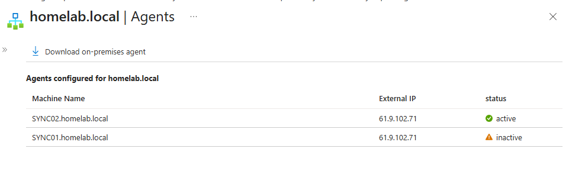
</p>

This confirms that `SYNC02` became the healthy synchronization server after the `SYNC01` incident.

---

## Step 19 — Disable the Failed `SYNC01` Agent

The following command verified the Cloud Sync provisioning service state on `SYNC01`:

```powershell
Get-Service AADConnectProvisioningAgent |
Select-Object Status, Name, StartType
```

<p align="center">
  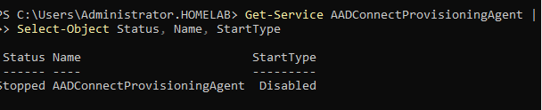
</p>

### Result

```text
Status    : Stopped
Name      : AADConnectProvisioningAgent
StartType : Disabled
```

This prevents the failed agent from restarting after a reboot or creating confusion about which server should perform synchronization.

---

## Step 20 — Preserve Original Failure Evidence

<p align="center">
  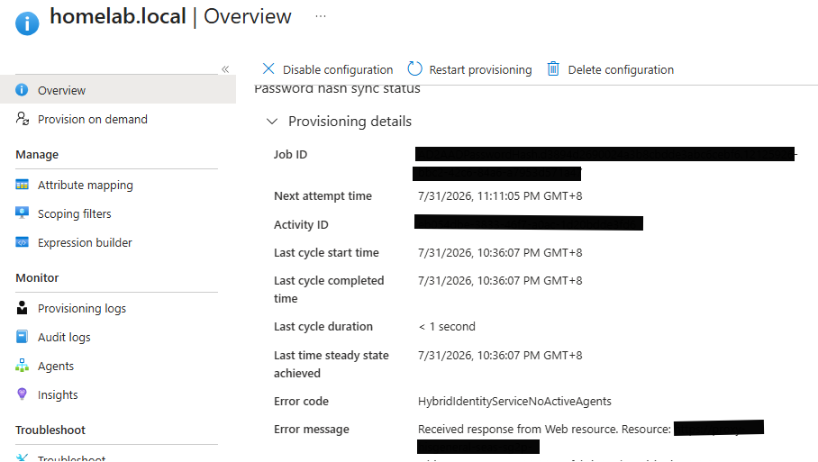
</p>

This screenshot preserves one of the original error conditions for the incident record.

---

# Password Hash Sync Troubleshooting Record

## Symptom

The newly reset on-premises password was rejected in Microsoft Entra even after the Password Hash Sync job completed and reached steady state.

## Initial Job State

```text
Provisioning interval: 5 minutes
Last cycle duration: 3 seconds
Steady state: Achieved
```

The healthy job state showed that the scheduler was running.

However, job health did not prove that the individual user account was ready for cloud authentication.

---

## Diagnostic Command

```powershell
Get-ADUser -Identity "john.smith" `
    -Properties Enabled,PasswordLastSet,PasswordNeverExpires,pwdLastSet |
Select-Object SamAccountName,Enabled,PasswordLastSet,PasswordNeverExpires,pwdLastSet
```

## Finding

```text
SamAccountName       : john.smith
Enabled              : True
PasswordLastSet      :
PasswordNeverExpires : False
pwdLastSet           : 0
```

## Meaning

```text
User must change password at next logon
was enabled.
```

## Resolution

The password was reset again in Active Directory Users and Computers with the following option unchecked:

```text
User must change password at next logon
```

The account was then checked again to confirm:

```text
PasswordLastSet: Recent timestamp
pwdLastSet: Nonzero value
```

After the next Password Hash Sync cycle:

```text
Cloud authentication: Successful
```

## Lesson

```text
A healthy synchronization job
does not automatically prove
that every user account is
ready for authentication.
```

The platform and the individual identity must be validated separately.

---

# Operational Standard Operating Procedure

## Routine Cloud Sync Health Check

### On `SYNC02`

Run:

```powershell
Get-Service AADConnectProvisioningAgent, AzureADConnectAgentUpdater |
Select-Object Status, Name, StartType
```

Expected result:

```text
AADConnectProvisioningAgent: Running
AzureADConnectAgentUpdater: Running
```

### In Microsoft Entra Admin Center

Navigate to:

```text
Identity
  ↓
Hybrid management
  ↓
Microsoft Entra Connect
  ↓
Cloud Sync
  ↓
Agents
```

Confirm:

- `SYNC02` is active
- No unexpected agent is active
- Recent cycles completed successfully
- Steady state was achieved
- No unresolved provisioning errors are present

---

## New User Provisioning Procedure

```text
Create or move user into scoped OU
            ↓
Confirm account is enabled
            ↓
Validate required attributes
            ↓
Wait for Cloud Sync cycle
            ↓
Confirm user appears in Entra
            ↓
Verify on-premises sync enabled
            ↓
Review provisioning logs if required
```

### Active Directory Validation Command

```powershell
Get-ADUser `
    -SearchBase "OU=Entra-Sync,DC=homelab,DC=local" `
    -Filter * |
Select-Object Name, SamAccountName, Enabled
```

---

## Password Synchronization Procedure

1. Reset the password in on-premises Active Directory.
2. Leave **User must change password at next logon** unchecked for this lab validation.
3. Confirm that `pwdLastSet` is nonzero.
4. Wait for the next Password Hash Sync cycle.
5. Use the complete Microsoft Entra user principal name.
6. Test through an InPrivate or private browser window.
7. Confirm the successful authentication in Microsoft Entra sign-in logs.
8. Never record or screenshot the password.

### Account Validation Command

```powershell
Get-ADUser -Identity "john.smith" `
    -Properties PasswordLastSet,pwdLastSet |
Select-Object SamAccountName,PasswordLastSet,pwdLastSet
```

---

## Failed Agent Response Procedure

```text
Record incident time
        ↓
Capture portal error
        ↓
Check Windows services
        ↓
Validate DNS and LDAP
        ↓
Validate HTTPS 443
        ↓
Validate Service Bus
        ↓
Review local logs
        ↓
Collect diagnostics privately
        ↓
Test alternate network if appropriate
        ↓
Compare against clean server
        ↓
Validate replacement completely
        ↓
Disable failed agent
        ↓
Document facts and uncertainty
```

---

# Security Controls Applied

## Least Privilege

- Synchronization was restricted to a designated organisational unit
- Only three intended lab users were processed
- The agent was installed on a dedicated member server
- Unrelated domain accounts were excluded
- The failed agent was disabled after replacement validation

## Credential Protection

- Passwords were never recorded
- Passwords were not included in screenshots
- Authentication tokens were not stored
- Diagnostic archives were kept private
- Real tenant identifiers were removed from public evidence

## Operational Safety

- `SYNC01` was not deleted immediately
- Logs and diagnostics were retained for learning
- `SYNC02` was fully validated before `SYNC01` was disabled
- Root-cause wording remained evidence-based
- Screenshots were reviewed for sensitive values before publication

---

# Public Redaction Rules

The following values must be blurred, cropped, or replaced before publication:

```text
Real tenant domain
Administrator email
Tenant ID
Subscription ID
Object ID
Connector ID
Agent ID
Job ID
Activity ID
Correlation ID
Public IP address
Password
Authentication token
Certificate private key
Diagnostic archive contents
```

Use placeholders such as:

```text
yourtenant.onmicrosoft.com
<tenant-id-redacted>
<job-id-redacted>
<activity-id-redacted>
<admin-email-redacted>
```

The following internal lab details may be included:

```text
homelab.local
SRV01
SYNC01
SYNC02
CLIENT01
Private RFC 1918 addresses
Fictitious test-user names
```

---

# Evidence Index

## Infrastructure Validation

| Screenshot | Purpose |
|---|---|
| [`01-SYNC02-Domain-Membership.png`](evidence/screenshots/01-infrastructure-validation/01-SYNC02-Domain-Membership.png) | Confirms the replacement server joined `homelab.local` |
| [`02-SYNC02-DNS-Resolution.png`](evidence/screenshots/01-infrastructure-validation/02-SYNC02-DNS-Resolution.png) | Confirms domain resolution to `SRV01` |
| [`03-SYNC02-LDAP-Connectivity.png`](evidence/screenshots/01-infrastructure-validation/03-SYNC02-LDAP-Connectivity.png) | Confirms LDAP port `389` connectivity |

## Agent Validation

| Screenshot | Purpose |
|---|---|
| [`04-SYNC02-Cloud-Sync-Services.png`](evidence/screenshots/02-agent-validation/04-SYNC02-Cloud-Sync-Services.png) | Confirms required Cloud Sync services are running |
| [`05-SYNC02-Microsoft-HTTPS-Connectivity.png`](evidence/screenshots/02-agent-validation/05-SYNC02-Microsoft-HTTPS-Connectivity.png) | Confirms outbound Microsoft HTTPS access |
| [`06-SYNC02-Service-Bus-Connectivity.png`](evidence/screenshots/02-agent-validation/06-SYNC02-Service-Bus-Connectivity.png) | Confirms the Service Bus endpoint is reachable |
| [`07-SYNC02-Agent-Network-Connections.png`](evidence/screenshots/02-agent-validation/07-SYNC02-Agent-Network-Connections.png) | Confirms active process-level cloud connections |
| [`08-Entra-SYNC02-Agent-Active.png`](evidence/screenshots/02-agent-validation/08-Entra-SYNC02-Agent-Active.png) | Confirms Microsoft Entra recognizes `SYNC02` |

## Provisioning Validation

| Screenshot | Purpose |
|---|---|
| [`09-Entra-Successful-Provisioning-Cycle.png`](evidence/screenshots/03-provisioning-validation/09-Entra-Successful-Provisioning-Cycle.png) | Confirms three users were processed and steady state was achieved |
| [`10-Entra-Synchronized-Users.png`](evidence/screenshots/03-provisioning-validation/10-Entra-Synchronized-Users.png) | Confirms synchronized users exist in Microsoft Entra |
| [`11-Entra-On-Premises-Sync-Enabled.png`](evidence/screenshots/03-provisioning-validation/11-Entra-On-Premises-Sync-Enabled.png) | Confirms Windows Server Active Directory as the source |
| [`18-Entra-Cloud-Sync-Scoping-Configuration.png`](evidence/screenshots/03-provisioning-validation/18-Entra-Cloud-Sync-Scoping-Configuration.png) | Confirms controlled synchronization scope |
| [`19-SRV01-Scoped-Active-Directory-Users.png`](evidence/screenshots/03-provisioning-validation/19-SRV01-Scoped-Active-Directory-Users.png) | Confirms the three source users in Active Directory |

## Password Hash Sync

| Screenshot | Purpose |
|---|---|
| [`12-Entra-Password-Hash-Sync-Enabled.png`](evidence/screenshots/04-password-hash-sync/12-Entra-Password-Hash-Sync-Enabled.png) | Confirms Password Hash Sync job health |
| [`13-Entra-Password-Hash-Sync-Sign-In-Success.png`](evidence/screenshots/04-password-hash-sync/13-Entra-Password-Hash-Sync-Sign-In-Success.png) | Confirms functional cloud authentication |
| [`14-Entra-Successful-Sign-In-Log.png`](evidence/screenshots/04-password-hash-sync/14-Entra-Successful-Sign-In-Log.png) | Confirms Microsoft Entra recorded the successful sign-in |

## Troubleshooting

| Screenshot | Purpose |
|---|---|
| [`15-Entra-Agent-Failover-State.png`](evidence/screenshots/05-troubleshooting/15-Entra-Agent-Failover-State.png) | Shows `SYNC02` as the working replacement |
| [`16-SYNC01-Cloud-Sync-Service-Disabled.png`](evidence/screenshots/05-troubleshooting/16-SYNC01-Cloud-Sync-Service-Disabled.png) | Confirms the failed service cannot restart |
| [`17-SYNC01-Cloud-Sync-Agent-Failure.png`](evidence/screenshots/05-troubleshooting/17-SYNC01-Cloud-Sync-Agent-Failure.png) | Preserves the original incident symptom |

---

# Troubleshooting Scenarios

| Scenario | Finding | Resolution |
|---|---|---|
| Agent registered but portal showed timeout | Runtime and relay channel failed after registration | Deployed and validated clean `SYNC02` |
| DNS suspected | Domain resolved successfully | DNS excluded as the primary cause |
| LDAP suspected | Port `389` test passed | AD connectivity excluded as the primary cause |
| HTTPS suspected | Port `443` tests passed | General HTTPS blockage excluded |
| Primary network suspected | Hotspot produced the same failure | Network excluded as the sole cause |
| Performance counter suspected | Category existed and was readable and writable | Not documented as the definitive cause |
| Service Bus relay failed on `SYNC01` | Relay and WebSocket errors persisted locally | Replaced the affected server |
| Password did not work in Entra | `pwdLastSet` was `0` | Reset password with change-at-logon unchecked |
| Two agents appeared registered | Old service remained installed | Stopped and disabled the `SYNC01` service |

---

# Root-Cause Lessons

## Registration Is Not Full Validation

```text
Agent registration succeeded
        ↓
Runtime channel later failed
        ↓
Provisioning remained unhealthy
```

The lesson:

```text
Successful registration
does not prove that
the complete synchronization path works.
```

## Network Tests Must Be Layered

```text
DNS passed
LDAP passed
HTTPS passed
Hotspot failed the same way
        ↓
Local runtime became more likely
```

The lesson:

```text
A port test proves reachability,
not complete application health.
```

## Log Errors Are Evidence, Not Automatic Proof

```text
Performance counter error observed
        ↓
Counter category verified
        ↓
Category readable and writable
        ↓
Definitive counter root cause not proven
```

The lesson:

```text
Do not convert one error message
into a root-cause claim
without supporting evidence.
```

## Clean Comparison Systems Are Powerful

```text
Same domain
Same tenant
Same synchronization goal
Different server
        ↓
SYNC02 succeeded
```

The lesson:

```text
A clean comparison deployment
can isolate a problem faster
than repeatedly changing
an unhealthy system.
```

## Job Health and User Health Are Different

```text
Password job reached steady state
        ↓
User sign-in still failed
        ↓
pwdLastSet inspected
        ↓
Account flag identified
```

The lesson:

```text
Validate the platform
and the individual identity separately.
```

---

# Skills Demonstrated

## Microsoft Entra ID

- Hybrid identity administration
- Microsoft Entra Cloud Sync
- Provisioning configuration
- Agent registration
- Agent health monitoring
- Password Hash Sync
- Hybrid user validation
- Sign-in log analysis

## Windows Server and Active Directory

- Domain membership validation
- Active Directory user queries
- LDAP connectivity testing
- DNS validation
- Windows service management
- Member-server administration
- Password account-state troubleshooting
- Organisational unit scoping

## PowerShell

- `Get-ComputerInfo`
- `Resolve-DnsName`
- `Test-NetConnection`
- `Get-Service`
- `Get-CimInstance`
- `Get-NetTCPConnection`
- `Group-Object`
- `Get-ADUser`
- Selective output formatting
- Process-level network validation

## Troubleshooting

- Layered fault isolation
- Network-path validation
- Service Bus investigation
- Runtime-log analysis
- Alternate-network testing
- Comparative server testing
- Incident documentation
- Evidence-based root-cause wording
- Remediation validation

## Security and Operations

- Least-privilege synchronization scope
- Sensitive-data redaction
- Password protection
- Failed-service isolation
- Operational handoff
- Standard Operating Procedures
- Validation checklists
- Public portfolio documentation

---

# Interview Preparation

## What is hybrid identity?

Hybrid identity connects an on-premises identity system such as Active Directory with a cloud identity platform such as Microsoft Entra ID.

## What is Microsoft Entra Cloud Sync?

Microsoft Entra Cloud Sync is a cloud-managed synchronization service that uses lightweight on-premises provisioning agents to synchronize selected Active Directory objects to Microsoft Entra ID.

## Why use a dedicated synchronization server?

A dedicated synchronization server separates identity synchronization workloads from the domain controller, reduces risk, simplifies troubleshooting, and supports clearer operational ownership.

## What is Password Hash Sync?

Password Hash Sync synchronizes a protected value derived from the on-premises Active Directory password hash so users can authenticate to Microsoft Entra using their on-premises password.

## Does Password Hash Sync send the plain-text password?

No. The plain-text password is not transmitted to Microsoft Entra.

## What is LDAP port `389` used for?

LDAP port `389` is used for directory communication. In this lab, it confirmed that `SYNC02` could reach the domain controller and communicate with Active Directory.

## Why is port `443` required?

Port `443` is used for encrypted HTTPS communication between the Cloud Sync agent and Microsoft cloud services.

## What does steady state mean?

Steady state means the provisioning engine completed the currently available work and had no pending changes to process at that moment.

## Why did the first password test fail?

The account had:

```text
pwdLastSet : 0
```

This indicated that **User must change password at next logon** was enabled.

## How was the password issue resolved?

The password was reset again with the change-at-next-logon option unchecked. After the next Password Hash Sync cycle, cloud authentication succeeded.

## What happened to `SYNC01`?

`SYNC01` registered successfully but repeatedly failed to maintain a healthy Cloud Sync runtime and Microsoft Service Bus relay connection.

## What was the exact root cause?

The exact low-level cause was not conclusively identified. The failure was isolated to the local Windows, .NET, or Cloud Sync agent runtime environment on `SYNC01`.

## Why was `SYNC02` considered proof?

`SYNC02` used the same domain, tenant, synchronization objective, and general connectivity requirements but completed provisioning and Password Hash Sync successfully.

## Why was `SYNC01` disabled instead of immediately deleted?

Disabling the service prevented interference while preserving the server, logs, and diagnostic evidence for troubleshooting and future learning.

---

# Validation Results

| Validation Area | Result |
|---|:---:|
| `SYNC02` domain membership | ✅ |
| DNS resolution | ✅ |
| LDAP connectivity | ✅ |
| Cloud Sync services | ✅ |
| Microsoft HTTPS connectivity | ✅ |
| Microsoft Service Bus connectivity | ✅ |
| Agent process connections | ✅ |
| `SYNC02` active in Entra | ✅ |
| Synchronization scope | ✅ |
| Three users processed | ✅ |
| Provisioning steady state | ✅ |
| Hybrid-user source validation | ✅ |
| Password Hash Sync enabled | ✅ |
| On-premises password cloud sign-in | ✅ |
| Successful Entra sign-in log | ✅ |
| `SYNC01` failure documented | ✅ |
| `SYNC01` service stopped | ✅ |
| `SYNC01` service disabled | ✅ |
| Final validation | `PASSED` |

---

# What I Learned

I learned that hybrid identity administration involves more than installing a synchronization agent.

A complete deployment must be:

```text
Designed
Prepared
Connected
Scoped
Provisioned
Authenticated
Monitored
Troubleshot
Recovered
Documented
```

I learned that registration is only the beginning.

```text
Registered
does not always mean
healthy.
```

I learned that successful DNS, LDAP, and HTTPS tests prove basic reachability but do not prove that the full Cloud Sync runtime is functioning.

```text
Port open
does not always mean
application healthy.
```

I learned that troubleshooting must separate confirmed facts from assumptions.

```text
Observed error
is not automatically
confirmed root cause.
```

I learned that a clean replacement server can provide valuable comparison evidence.

```text
Same environment
different server
different result
        ↓
problem isolated
```

I learned that Password Hash Sync job health and individual account readiness must be validated independently.

```text
Healthy job
does not automatically mean
healthy user sign-in.
```

The most important lessons were:

```text
Validate every layer.
```

```text
Use controlled synchronization scope.
```

```text
Test actual authentication.
```

```text
Preserve failed-system evidence.
```

```text
Document uncertainty honestly.
```

```text
Validate the replacement before disabling the original.
```

---

# Future Improvements

Future work may include:

- Additional Cloud Sync agent for high availability
- Group synchronization
- Contact synchronization
- Attribute mapping review
- Accidental deletion protection
- Cloud Sync alerting
- Microsoft Entra Connect Health monitoring
- Self-service password reset
- Password writeback
- Seamless Single Sign-On
- Multifactor authentication
- Conditional Access
- Authentication strengths
- Named locations
- Identity Protection
- Group-based licensing
- Microsoft 365 administration
- Privileged Identity Management
- Access reviews
- Identity Governance
- Microsoft Sentinel integration
- Automated Cloud Sync health reporting
- Automated stale hybrid-user reporting
- Formal incident-response runbooks

---

# Next Module

## Microsoft 365 Administration

The next module may extend the synchronized identities into Microsoft 365 services.

Planned work may include:

```text
Microsoft 365 tenant review
        ↓
Licence inventory
        ↓
User licence assignment
        ↓
Exchange Online administration
        ↓
Shared mailbox management
        ↓
Microsoft Teams administration
        ↓
SharePoint and OneDrive review
        ↓
Service health monitoring
        ↓
Message centre review
        ↓
Operational documentation
```

---

<div align="center">

## Module Status


<br><br>

### Microsoft Entra Cloud Sync, scoped provisioning, Password Hash Sync, failure isolation, and operational documentation successfully validated.

<br>

<a href="../../">
  
</a>

<a href="../03-Microsoft-365-Administration">
  
</a>

<br><br>


</div>