# MFA and Conditional Access Readiness

<p align="center">
  <strong>Microsoft Entra MFA Validation, Emergency Access, Authentication Security, and Conditional Access Design</strong>
</p>

<p align="center">
  
  
  
  
</p>

---

## Module Overview

This module demonstrates the planning, implementation, testing, validation, and documentation of multifactor authentication controls in Microsoft Entra ID.

The Microsoft Entra tenant used for this homelab does not include Microsoft Entra ID P1 licensing. Because of this limitation, granular Conditional Access policies could not be deployed or tested in report-only mode.

Instead of representing unavailable features as implemented, this module separates the work into two categories:

### Completed and validated

- Authentication Methods policy baseline review
- Security Defaults configuration review
- Conditional Access licence-availability review
- Global Administrator role review
- Creation of two cloud-only emergency-access accounts
- Global Administrator assignment for both emergency accounts
- Independent sign-in testing for both emergency accounts
- Emergency-account authentication-method review
- MFA pilot security group creation
- Microsoft Authenticator pilot targeting
- Microsoft Authenticator registration
- Successful pilot-user MFA sign-in
- Sign-in-log authentication validation
- Authentication-method inventory
- Security and recovery procedures
- Conditional Access readiness documentation
- Repository validation scripting

### Designed but not deployed

- Require MFA for all users
- Require strong authentication for administrators
- Block legacy authentication
- Restrict access from untrusted locations
- Require managed or hybrid-joined devices

These controls are classified as:

```text
DESIGN ONLY — LICENCE REQUIRED
```

This module focuses on evidence-based administration, controlled pilot deployment, tenant-lockout prevention, secure recovery planning, validation, rollback preparation, and truthful documentation of licensing limitations.

---

## Business Scenario

A growing organization is expanding its use of Microsoft Entra ID for cloud and hybrid identity administration.

The organization currently relies heavily on passwords and needs stronger authentication controls before deploying additional cloud services.

The following risks were identified:

- Password-only account compromise
- Unauthorized administrator access
- MFA fatigue and accidental approval of malicious prompts
- Tenant lockout caused by access-policy misconfiguration
- Lack of tested emergency recovery identities
- Weak or inconsistent authentication-method assignments
- Legacy authentication bypassing modern MFA protections
- Access from unmanaged or untrusted devices
- Missing authentication procedures
- Incomplete security evidence and validation
- Overreliance on a single Global Administrator account

The objective of this project was to establish an MFA baseline, validate Microsoft Authenticator, create a redundant emergency-access design, and prepare professional Conditional Access policies for future licensed deployment.

---

## Objectives

This module was designed to accomplish the following:

1. Review the current Microsoft Entra Authentication Methods policy.
2. Record the existing Security Defaults state.
3. Determine whether Conditional Access is available.
4. Document the tenant’s licence limitation.
5. Review current Global Administrator assignments.
6. Create two cloud-only emergency-access accounts.
7. Assign permanent Global Administrator recovery access.
8. Test both emergency accounts independently.
9. Review the authentication methods registered to both emergency accounts.
10. Create a controlled MFA pilot security group.
11. Add one normal cloud test user to the pilot group.
12. Enable Microsoft Authenticator for the pilot group.
13. Register Microsoft Authenticator for the pilot user.
14. Perform a controlled MFA sign-in.
15. Validate the sign-in through Microsoft Entra sign-in logs.
16. Create five Conditional Access policy designs.
17. Document pilot deployment and rollback procedures.
18. Produce authentication and readiness reports.
19. Validate all required module artifacts.
20. Prevent sensitive tenant information from being published.

---

## Repository Structure

```text
04-MFA-and-Conditional-Access/
│
├── README.md
│
├── Architecture/
│   ├── Authentication-Architecture.md
│   └── Conditional-Access-Design.md
│
├── Evidence/
│   └── Screenshots/
│       ├── 01-authentication-methods-policy-baseline.png
│       ├── 02-security-defaults-baseline.png
│       ├── 03-conditional-access-licence-limitation.png
│       ├── 04-global-administrator-baseline.png
│       ├── 05-emergency-access-account-01-created.png
│       ├── 06-emergency-access-account-02-created.png
│       ├── 07-emergency-access-01-global-administrator.png
│       ├── 08-emergency-access-02-global-administrator.png
│       ├── 09-emergency-access-01-signin-validation.png
│       ├── 10-mfa-pilot-group-created.png
│       ├── 11-mfa-pilot-user-membership.png
│       ├── 12-microsoft-authenticator-pilot-policy.png
│       ├── 13-pilot-user-authenticator-registration.png
│       ├── 14-pilot-mfa-signin-authentication-details.png
│       ├── 15-emergency-access-01-authentication-status.png
│       └── 16-emergency-access-02-authentication-status.png
│
├── Policies/
│   ├── CA001-Require-MFA-All-Users.md
│   ├── CA002-Require-MFA-Administrators.md
│   ├── CA003-Block-Legacy-Authentication.md
│   ├── CA004-Restrict-Untrusted-Locations.md
│   └── CA005-Require-Managed-Device.md
│
├── Procedures/
│   ├── SOP-MFA-Registration.md
│   ├── SOP-MFA-Reset.md
│   ├── SOP-Emergency-Access.md
│   └── SOP-Conditional-Access-Deployment.md
│
├── Reports/
│   ├── Authentication-Methods-Inventory.csv
│   ├── Security-Defaults-State.txt
│   ├── Conditional-Access-Readiness.csv
│   ├── MFA-Sign-In-Validation.csv
│   └── Final-Validation.txt
│
└── Scripts/
    └── Test-MFAConditionalAccessReadiness.ps1
```

---

## High-Level Authentication Architecture

```text
                    Microsoft Entra ID
                           │
              ┌────────────┴────────────┐
              │                         │
     Authentication Methods       Access Protection
              │                         │
     ┌────────┴────────┐        ┌───────┴────────┐
     │                 │        │                │
Microsoft         Software    Security       Conditional
Authenticator      OATH       Defaults        Access
     │                 │        │                │
     │                 │        │        DESIGN ONLY —
     │                 │        │        LICENCE REQUIRED
     │                 │        │
     └────────┬────────┘        │
              │                 │
              └────────┬────────┘
                       │
                 User identities
                       │
          ┌────────────┼────────────┐
          │            │            │
    Pilot user   Normal admin   Emergency admins
          │            │            │
          │            │      Software OATH MFA
          │            │
Microsoft Authenticator MFA
          │
          ▼
   Controlled sign-in
          │
          ▼
 Microsoft Entra sign-in logs
          │
          ▼
 Authentication validation
```

---

## MFA Pilot Flow

```text
Normal cloud test user
          │
          ▼
Added to SG-MFA-Pilot
          │
          ▼
Microsoft Authenticator enabled
          │
          ▼
Authentication method registered
          │
          ▼
Controlled private-browser sign-in
          │
          ▼
MFA approval required
          │
          ▼
Authentication completed
          │
          ▼
Interactive sign-in event generated
          │
          ▼
Authentication details reviewed
          │
          ▼
Successful MFA validation
```

---

## Emergency-Access Architecture

```text
Normal Administrator
        │
        ├── Routine tenant administration
        ├── User and group administration
        ├── Authentication-policy review
        └── Sign-in-log analysis

Emergency Access 01
        │
        ├── Cloud-only identity
        ├── Global Administrator
        ├── Software OATH MFA
        ├── Independently tested
        └── Reserved for tenant recovery

Emergency Access 02
        │
        ├── Cloud-only identity
        ├── Global Administrator
        ├── Software OATH MFA
        ├── Independently tested
        └── Secondary recovery path
```

---

## Conditional Access Readiness Architecture

```text
Current Microsoft Entra tenant
             │
             ├── Authentication Methods available
             ├── Security Defaults available
             └── Conditional Access unavailable
                         │
                         ▼
               Licence limitation confirmed
                         │
                         ▼
             Five professional designs created
                         │
       ┌─────────┬─────────┬─────────┬─────────┬─────────┐
       │         │         │         │         │
     CA001     CA002     CA003     CA004     CA005
       │         │         │         │         │
       └─────────┴─────────┴─────────┴─────────┴─────────┘
                         │
                         ▼
          Pilot, validation, and rollback plans
                         │
                         ▼
            Future licensed implementation readiness
```

---

## Environment

| Component | Purpose |
|---|---|
| Microsoft Entra ID | Cloud identity and authentication platform |
| Microsoft Entra admin center | Administrative configuration portal |
| Microsoft Authenticator | Pilot-user MFA method |
| Software OATH | Emergency-access MFA method |
| Security Defaults | Available baseline tenant protection |
| Conditional Access | Designed but unavailable under current licensing |
| Microsoft Entra sign-in logs | Authentication validation |
| Cloud-only pilot user | Controlled MFA testing identity |
| `SG-MFA-Pilot` | Authentication-method pilot scope |
| Normal administrator | Routine tenant administration |
| Emergency Access 01 | Primary tenant-recovery identity |
| Emergency Access 02 | Secondary tenant-recovery identity |
| GitHub | Documentation, reports, procedures, scripts, and evidence |

---

## Implementation Summary

| Area | Result | Classification |
|---|---|---|
| Authentication Methods baseline | Reviewed | COMPLETED AND VALIDATED |
| Security Defaults state | Reviewed and documented | COMPLETED AND VALIDATED |
| Conditional Access availability | Licence limitation confirmed | COMPLETED WITH DOCUMENTED LIMITATION |
| Global Administrator baseline | Reviewed | COMPLETED AND VALIDATED |
| Emergency Access 01 | Created, assigned, and tested | COMPLETED WITH DOCUMENTED LIMITATION |
| Emergency Access 02 | Created, assigned, and tested | COMPLETED WITH DOCUMENTED LIMITATION |
| MFA pilot group | Created | COMPLETED AND VALIDATED |
| Pilot-user membership | Configured | COMPLETED AND VALIDATED |
| Microsoft Authenticator policy | Scoped to pilot group | COMPLETED AND VALIDATED |
| Pilot-user registration | Successful | COMPLETED AND VALIDATED |
| Pilot-user MFA sign-in | Successful | COMPLETED AND VALIDATED |
| Sign-in-log validation | Successful | COMPLETED AND VALIDATED |
| Conditional Access designs | Five designs completed | DESIGN ONLY — LICENCE REQUIRED |
| Managed-device enforcement | Not deployed | DESIGN ONLY — LICENCE REQUIRED |
| Location-based enforcement | Not deployed | DESIGN ONLY — LICENCE REQUIRED |
| Legacy-authentication blocking | Not deployed | DESIGN ONLY — LICENCE REQUIRED |

---

# Implementation Walkthrough

## 1. Authentication Methods Baseline

The tenant’s Authentication Methods policy was reviewed before any configuration changes were made.

The review identified which authentication methods were:

- Available
- Enabled
- Disabled
- Targeted to all users
- Targeted to selected groups
- Hardware-dependent
- Licence-dependent
- Not tested

This established a reliable baseline and prevented undocumented tenant-wide authentication changes.

### Evidence

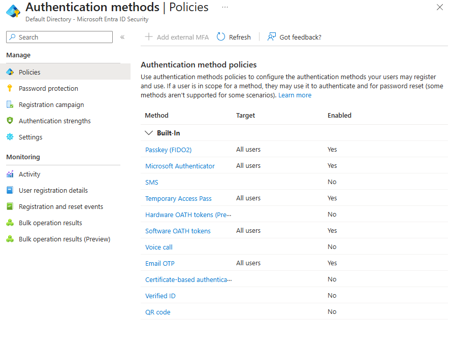

> **Authentication Methods Policy Baseline** — Current Microsoft Entra authentication methods were reviewed before MFA configuration to identify enabled methods, target assignments, and tenant capabilities.

---

## 2. Security Defaults Review

Security Defaults was reviewed as the tenant’s available baseline identity-protection mechanism.

The setting was documented before authentication testing or configuration changes.

Security Defaults provides baseline protections but does not offer the granular controls available through Conditional Access.

Conditional Access can provide more detailed control for:

- Individual users
- Security groups
- Administrative roles
- Applications
- Named locations
- Authentication strengths
- Device compliance
- Report-only evaluation
- Emergency-account exclusions

### Evidence

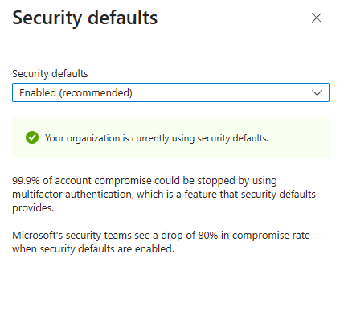

> **Security Defaults Baseline** — The tenant’s Security Defaults configuration was reviewed before MFA implementation to document the existing access-enforcement state.

---

## 3. Conditional Access Licence Review

The Conditional Access portal was reviewed to determine whether granular policy deployment was supported.

The current tenant did not include the required Microsoft Entra licence, and an eligible free trial was unavailable.

No unsupported workaround was used.

No Conditional Access policy was falsely represented as deployed.

### Result

```text
Conditional Access deployment : Not available
Reason                        : Required licence unavailable
Policy implementation         : Not deployed
Policy design                 : Completed
Classification                : DESIGN ONLY — LICENCE REQUIRED
```

### Evidence

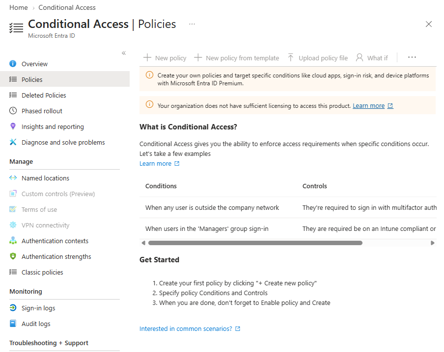

> **Conditional Access Licensing Review** — Granular Conditional Access policy deployment was unavailable under the tenant’s current licensing. Policies were therefore documented as design-only controls rather than falsely represented as deployed.

---

## 4. Global Administrator Review

The initial administrative-role review identified only one Global Administrator.

This created a tenant-lockout risk because access could be lost if:

- The administrator forgot the password.
- The registered authentication method became unavailable.
- The account was disabled.
- The account was compromised.
- A future access policy blocked the account.
- The administrator could not complete MFA.

Two cloud-only emergency-access administrators were therefore created to provide redundant recovery access.

### Final administrator design

```text
Normal administrator  → Global Administrator
Emergency Access 01   → Global Administrator
Emergency Access 02   → Global Administrator
```

### Evidence

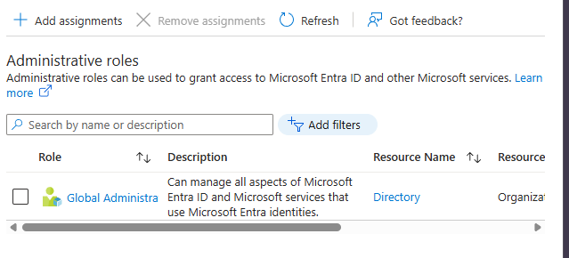

> **Global Administrator Baseline** — Existing Global Administrator assignments were reviewed before MFA enforcement and emergency-access planning to reduce the risk of tenant lockout.

---

## 5. Emergency-Access Account Creation

Two cloud-only emergency-access identities were created.

Each account was:

- Created directly in Microsoft Entra ID
- Kept cloud-only
- Left without a Microsoft 365 product licence
- Assigned the Global Administrator role
- Protected by multifactor authentication
- Tested through a separate private-browser session
- Reserved exclusively for tenant recovery

The real usernames, user principal names, tenant domain, object IDs, passwords, and recovery information were excluded from the repository.

### Evidence


> **Emergency Access Account 01** — A dedicated cloud-only identity was created as the first component of the tenant lockout-recovery design. No Microsoft 365 product licence was assigned.


> **Emergency Access Account 02** — A second independent cloud-only identity was created to provide redundant tenant recovery capability without requiring a Microsoft 365 product licence.

---

## 6. Emergency Global Administrator Assignments

Both cloud-only recovery accounts received permanent Global Administrator role assignments.

These assignments provide independent recovery paths when the normal administrator cannot access the tenant.

The emergency accounts are not intended for routine administration.

### Evidence

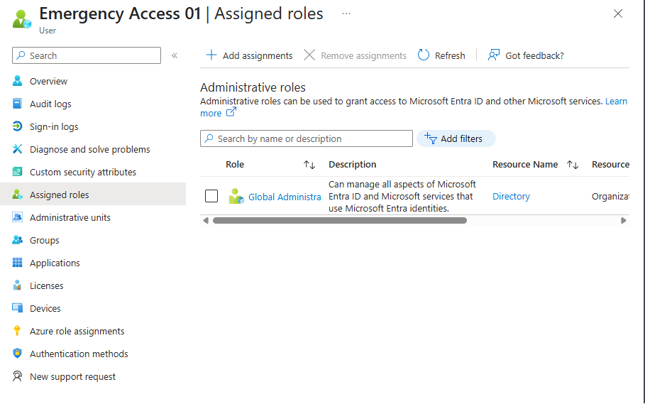

> **Emergency Access Account 01 Role Assignment** — The first cloud-only recovery identity received a permanent Global Administrator assignment for tenant-lockout recovery and is reserved exclusively for emergency use.

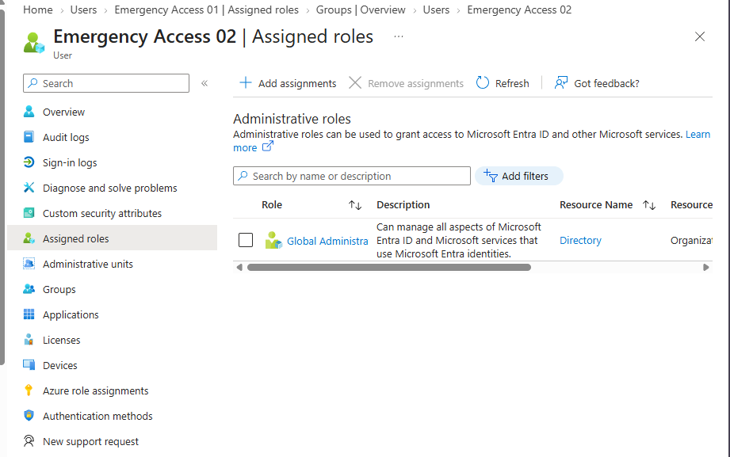

> **Emergency Access Account 02 Role Assignment** — The second cloud-only recovery identity received a permanent Global Administrator assignment, completing the redundant tenant-recovery design.

---

## 7. Emergency Sign-In Validation

Both emergency-access accounts were tested through separate private-browser sessions.

The tests confirmed that each account could:

- Sign in independently
- Complete its registered MFA challenge
- Access the Microsoft Entra admin center
- Use its Global Administrator role
- Provide a recovery path if the normal administrator becomes unavailable

### Evidence

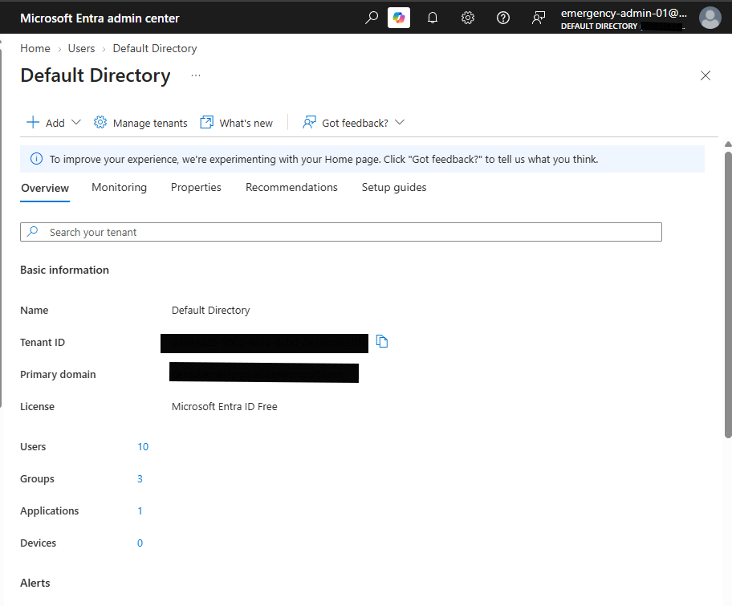

> **Emergency Access Sign-In Validation** — A cloud-only recovery administrator was tested through a separate browser session to confirm that it could access the Microsoft Entra administration portal.

---

## 8. Emergency Authentication Methods

Both emergency-access accounts were reviewed through their Authentication methods pages.

The following configuration was observed:

```text
Registered method      : Software OATH token
System-preferred MFA   : Enabled
Preferred method       : softwareOTP
Sign-in validation     : Successful
```

Software OATH provides multifactor authentication using rotating one-time passwords.

### Documented limitation

Software OATH is not phishing-resistant.

A stronger future design would use a separate phishing-resistant method for each emergency account, such as:

- FIDO2 security keys
- Passkeys
- Certificate-based authentication

### Classification

```text
COMPLETED WITH DOCUMENTED LIMITATION
```

### Evidence

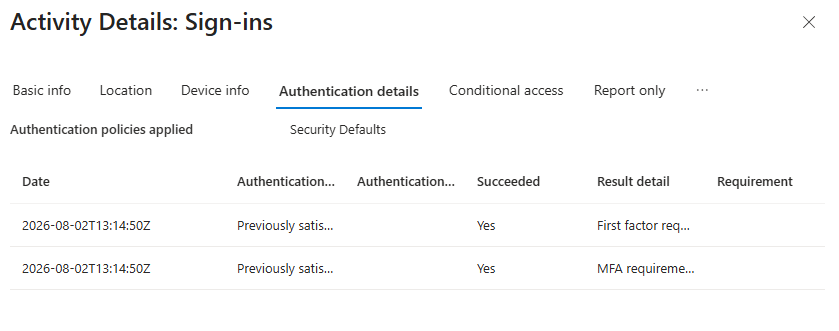

> **Emergency Access Account 01 Authentication Review** — The first cloud-only emergency administrator was confirmed to use Software OATH multifactor authentication with system-preferred MFA enabled.

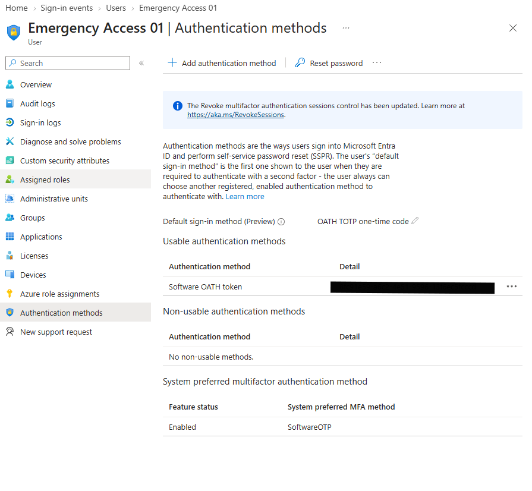

> **Emergency Access Account 02 Authentication Review** — The second cloud-only emergency administrator was confirmed to use Software OATH multifactor authentication with system-preferred MFA enabled. Phishing-resistant hardware authentication remains a documented future improvement.

---

## 9. MFA Pilot Group

A dedicated security group was created:

```text
SG-MFA-Pilot
```

The group used assigned membership.

Only one controlled normal cloud test user was added.

The following identities were not added:

- The normal Global Administrator
- Emergency Access 01
- Emergency Access 02

This reduced the risk of affecting administrative and recovery access during pilot testing.

### Evidence

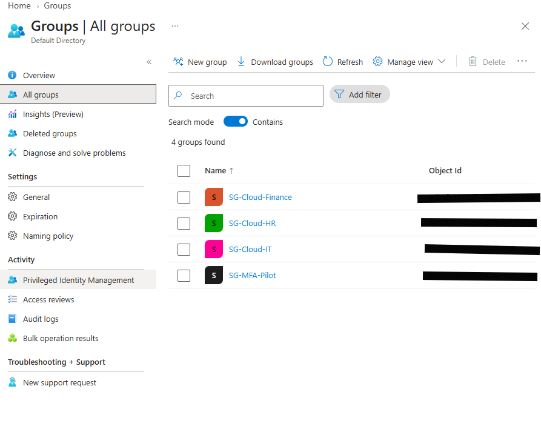

> **MFA Pilot Security Group** — A dedicated security group was created to scope controlled authentication-method testing before broader tenant adoption.

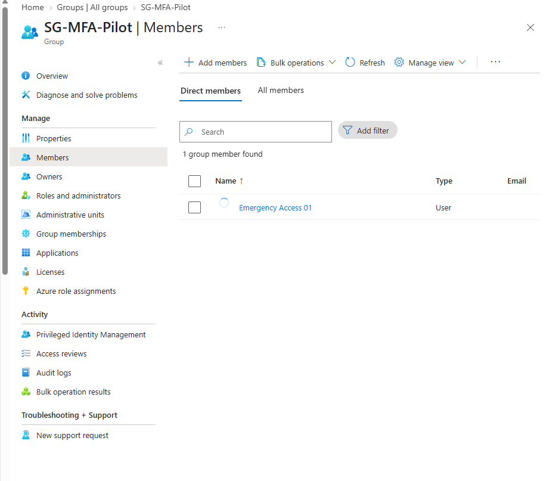

> **MFA Pilot User Assignment** — One controlled cloud-only test identity was added to the MFA pilot group to support authentication-method registration and sign-in validation without initially affecting administrative or emergency-access accounts.

---

## 10. Microsoft Authenticator Pilot Policy

Microsoft Authenticator was enabled through the Authentication Methods policy.

The method was scoped only to:

```text
SG-MFA-Pilot
```

Configuration:

```text
Authentication method : Microsoft Authenticator
Status                : Enabled
Target                : SG-MFA-Pilot
Authentication mode   : Any
Registration          : Optional
```

The broader `All users` assignment was removed before the policy was saved.

### Evidence

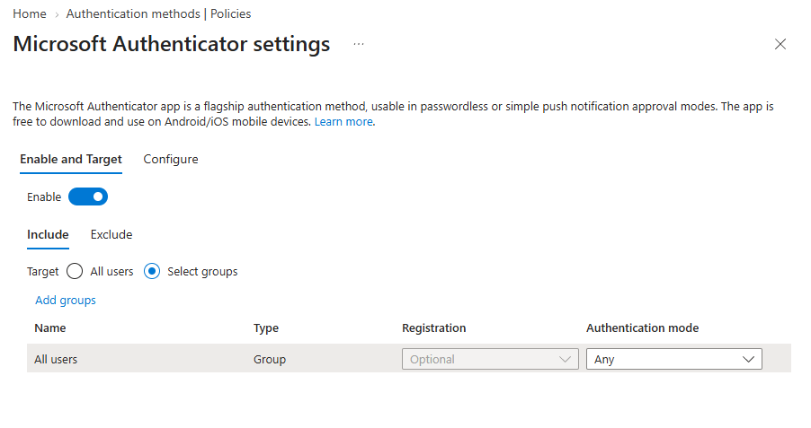

> **Microsoft Authenticator Pilot Policy** — Microsoft Authenticator was enabled for the controlled MFA pilot group using the Authentication Methods policy before user registration and sign-in testing.

---

## 11. Pilot-User Authenticator Registration

The pilot user opened:

```text
https://mysignins.microsoft.com/security-info
```

The user then:

1. Signed in through a private-browser session.
2. Selected **Add sign-in method**.
3. Selected **Microsoft Authenticator**.
4. Registered the work or school account in the mobile application.
5. Completed the validation prompt.
6. Confirmed that Microsoft Authenticator appeared on the Security info page.

The QR code was never captured or committed.

### Evidence

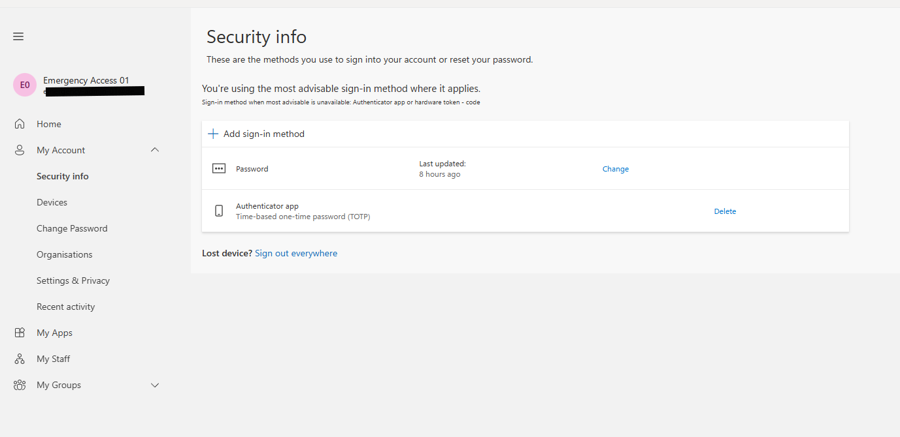

> **Pilot User Authenticator Registration** — Microsoft Authenticator was successfully registered for the controlled pilot identity through the Security Information portal, with sensitive registration data excluded from evidence.

---

## 12. MFA Sign-In Validation

A new private-browser session was opened.

The pilot user signed in to Microsoft Entra.

Observed result:

```text
Password accepted                : Yes
Microsoft Authenticator required : Yes
Approval completed               : Yes
Sign-in completed                : Yes
```

This confirmed that the pilot identity successfully completed multifactor authentication.

---

## 13. Sign-In Log Validation

The corresponding interactive sign-in event was opened through:

```text
Microsoft Entra admin center
→ Entra ID
→ Monitoring & health
→ Sign-in logs
→ User sign-ins (interactive)
```

The **Authentication details** tab was reviewed.

The sign-in log confirmed:

```text
Authentication requirement : Multifactor authentication
Authentication method      : Microsoft Authenticator
Authentication result      : Successfully completed
```

Sensitive values such as usernames, IP addresses, request IDs, correlation IDs, device identifiers, and tenant information were redacted.

### Evidence

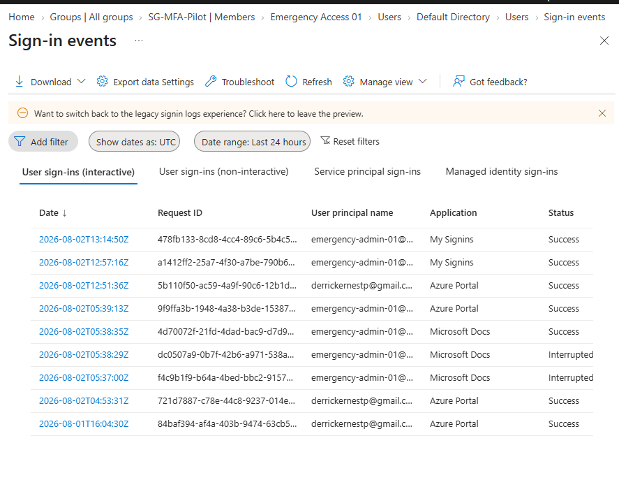

> **Pilot MFA Sign-In Validation** — Microsoft Entra sign-in logs confirmed that the controlled pilot identity successfully completed multifactor authentication using Microsoft Authenticator.

---

# Conditional Access Policy Designs

All five Conditional Access policies were documented but not deployed.

Each design includes:

- Business objective
- Planned scope
- Included users or roles
- Emergency-account exclusions
- Target resources
- Conditions
- Grant controls
- Dependencies
- Pilot deployment plan
- Validation requirements
- Rollback procedure
- Security considerations
- Final classification

---

## CA001 — Require MFA for All Users

### Objective

Require multifactor authentication for standard users accessing organizational cloud resources.

### Planned configuration

| Setting | Planned value |
|---|---|
| Users included | All users |
| Users excluded | Emergency-access accounts |
| Target resources | All cloud resources |
| Grant control | Require multifactor authentication |
| Initial state | Report-only |
| Pilot required | Yes |
| Current state | Not deployed |

### Classification

```text
DESIGN ONLY — LICENCE REQUIRED
```

### Document

[CA001 — Require MFA for All Users](Policies/CA001-Require-MFA-All-Users.md)

---

## CA002 — Require Strong Authentication for Administrators

### Objective

Require strong multifactor authentication for privileged administrative accounts.

### Planned configuration

| Setting | Planned value |
|---|---|
| Users included | Selected administrative roles |
| Users excluded | Emergency-access accounts |
| Target resources | Microsoft Admin Portals |
| Grant control | Require MFA |
| Future control | Phishing-resistant authentication strength |
| Initial state | Report-only |
| Current state | Not deployed |

### Classification

```text
DESIGN ONLY — LICENCE REQUIRED
```

### Document

[CA002 — Require Strong Authentication for Administrators](Policies/CA002-Require-MFA-Administrators.md)

---

## CA003 — Block Legacy Authentication

### Objective

Block older authentication methods and clients that do not support modern authentication and MFA.

### Planned configuration

| Setting | Planned value |
|---|---|
| Users included | All users |
| Users excluded | Emergency-access accounts |
| Target resources | All cloud resources |
| Client apps | Legacy authentication clients |
| Grant control | Block access |
| Initial state | Report-only |
| Current state | Not deployed |

The tenant does not contain licensed Exchange Online workloads. POP, IMAP, SMTP AUTH, and Exchange ActiveSync testing was therefore not performed.

### Classification

```text
DESIGN ONLY — LICENCE REQUIRED
```

### Document

[CA003 — Block Legacy Authentication](Policies/CA003-Block-Legacy-Authentication.md)

---

## CA004 — Restrict Untrusted Locations

### Objective

Apply stronger controls to sign-ins originating outside approved organizational networks.

### Planned configuration

| Setting | Planned value |
|---|---|
| Users included | Pilot users |
| Users excluded | Emergency-access accounts |
| Conditions | Locations |
| Trusted locations | Verified organizational public IP ranges |
| Untrusted locations | All other locations |
| Grant control | Require MFA or block |
| Initial state | Report-only |
| Current state | Not deployed |

The homelab does not use a fixed business public IP or a production corporate VPN.

No real public IP addresses are published.

### Classification

```text
DESIGN ONLY — LICENCE REQUIRED
```

### Document

[CA004 — Restrict Untrusted Locations](Policies/CA004-Restrict-Untrusted-Locations.md)

---

## CA005 — Require Managed or Hybrid-Joined Device

### Objective

Restrict selected cloud resources to approved, compliant, or hybrid Microsoft Entra joined devices.

### Planned configuration

| Setting | Planned value |
|---|---|
| Users included | Administrators or pilot users |
| Users excluded | Emergency-access accounts |
| Target resources | Administrative portals |
| Device platform | Windows |
| Grant control | Require compliant or hybrid-joined device |
| Initial state | Report-only |
| Current state | Not deployed |

The homelab does not include licensed Microsoft Intune device compliance.

### Classification

```text
DESIGN ONLY — LICENCE REQUIRED
```

### Document

[CA005 — Require Managed or Hybrid-Joined Device](Policies/CA005-Require-Managed-Device.md)

---

# Procedures

## MFA Registration SOP

The MFA registration procedure documents:

- Pilot-user prerequisites
- Microsoft Authenticator registration
- Private-browser testing
- QR-code handling
- MFA validation
- Troubleshooting
- Evidence-redaction rules

### Document

[SOP — MFA Registration](Procedures/SOP-MFA-Registration.md)

### Classification

```text
COMPLETED AND VALIDATED
```

---

## MFA Reset SOP

The MFA reset procedure documents:

- User identity verification
- Authentication-method review
- Lost-device handling
- Authenticator replacement
- Session revocation
- Sign-in-log review
- Emergency-account restrictions
- Evidence handling

A destructive reset was not performed because the working pilot registration did not need to be removed.

### Document

[SOP — MFA Reset](Procedures/SOP-MFA-Reset.md)

### Classification

```text
COMPLETED WITH DOCUMENTED LIMITATION
```

---

## Emergency-Access SOP

The emergency-access procedure documents:

- Account purpose
- Credential-storage requirements
- Usage restrictions
- Emergency sign-in process
- Tenant-recovery workflow
- Quarterly validation
- Compromise response
- Conditional Access exclusions
- Security Defaults considerations

### Document

[SOP — Emergency Access](Procedures/SOP-Emergency-Access.md)

### Classification

```text
COMPLETED WITH DOCUMENTED LIMITATION
```

---

## Conditional Access Deployment SOP

The Conditional Access deployment procedure documents:

- Licensing prerequisites
- Least-privilege administrative roles
- Emergency-account validation
- Pilot-group deployment
- Report-only testing
- Sign-in-log validation
- Controlled enforcement
- Gradual expansion
- Rollback procedures
- Change-record requirements

### Document

[SOP — Conditional Access Deployment](Procedures/SOP-Conditional-Access-Deployment.md)

### Classification

```text
DESIGN ONLY — LICENCE REQUIRED
```

---

# Reports

## MFA Sign-In Validation

File:

```text
Reports/MFA-Sign-In-Validation.csv
```

Recorded result:

```text
Test ID                    : MFA-TEST-001
Test identity              : Pilot cloud test user
Authentication requirement : Multifactor authentication
Authentication method      : Microsoft Authenticator
Result                     : Successfully completed
Classification             : COMPLETED AND VALIDATED
```

---

## Authentication Methods Inventory

File:

```text
Reports/Authentication-Methods-Inventory.csv
```

The report records:

- Microsoft Authenticator pilot deployment
- Software OATH use
- System-preferred MFA status
- Validated authentication methods
- Methods not validated
- Hardware and licensing limitations
- Final classifications

---

## Security Defaults Report

File:

```text
Reports/Security-Defaults-State.txt
```

The report records:

- Observed Security Defaults state
- Available protection path
- Validated MFA controls
- Conditional Access limitation
- Final classification

---

## Conditional Access Readiness Report

File:

```text
Reports/Conditional-Access-Readiness.csv
```

The report tracks:

| Policy | Design | Deployment | Emergency exclusions | Rollback |
|---|---|---|---|---|
| CA001 | Completed | Not deployed | Planned | Documented |
| CA002 | Completed | Not deployed | Planned | Documented |
| CA003 | Completed | Not deployed | Planned | Documented |
| CA004 | Completed | Not deployed | Planned | Documented |
| CA005 | Completed | Not deployed | Planned | Documented |

---

# Validation Script

The module includes:

```text
Scripts/Test-MFAConditionalAccessReadiness.ps1
```

The script validates:

- Required module directories
- README presence
- Architecture documents
- Conditional Access policy files
- Procedure files
- Report files
- Evidence screenshots
- Empty required files
- Obvious passwords or tokens
- Real `onmicrosoft.com` tenant domains
- Correct Conditional Access classifications

Expected final result:

```text
TotalChecks  : Generated by the validation script
PassedChecks : Same as TotalChecks
FailedChecks : 0
FinalStatus  : PASSED
```

The generated result is written to:

```text
Reports/Final-Validation.txt
```

---

# Security Considerations

## Authentication security

- MFA was tested using a controlled non-administrator account.
- Administrative and emergency accounts were not added to the pilot group.
- Microsoft Authenticator was not enabled for all users without testing.
- Unexpected Microsoft Authenticator prompts must never be approved.
- Number matching must be verified before approval.
- Software OATH codes must never be shared.

## Emergency access

- Two independent cloud-only recovery accounts were created.
- Both accounts retain Global Administrator.
- Both accounts were sign-in tested.
- Neither account is intended for routine administration.
- Credentials must be stored separately.
- Both accounts must not be modified simultaneously.
- Future Conditional Access policies must exclude both recovery accounts.

## Conditional Access

- Policies were not deployed without the required licensing.
- Emergency-account exclusions were included in every applicable design.
- Report-only mode was planned before enforcement.
- Tenant-wide deployment was not recommended without pilot testing.
- Rollback procedures were documented.

## Evidence protection

The following must never be committed to GitHub:

```text
Passwords
Temporary passwords
QR codes
Software OATH secrets
Recovery codes
Temporary Access Pass values
Access tokens
Refresh tokens
Tenant IDs
Object IDs
Real tenant domains
Emergency usernames
Phone numbers
Device identifiers
Public IP addresses
Request IDs
Correlation IDs
```

---

# Troubleshooting

## Microsoft Authenticator is unavailable

Verify:

- The user belongs to `SG-MFA-Pilot`.
- Microsoft Authenticator is enabled.
- The correct security group is targeted.
- The configuration was saved.
- Sufficient propagation time has passed.

## MFA prompt does not appear

Review:

- Security Defaults state
- Existing browser sessions
- Browser cookies
- Private-browser testing
- Sign-in-log authentication requirement
- Authentication-method registration

## Authentication details are not visible

Verify:

- The event is under **User sign-ins (interactive)**.
- The sign-in event row was opened.
- The browser window is wide enough.
- The tab row was scrolled if necessary.
- The event has finished processing.
- The correct pilot-user event was selected.

## Emergency account cannot sign in

Check:

- Account enabled state
- Password validity
- Global Administrator assignment
- Registered MFA method
- Software OATH code timing
- Device date and time
- Browser session
- Sign-in failure details

Do not modify both emergency accounts during the same troubleshooting session.

## Conditional Access is unavailable

This is expected when the required licence is not present.

Record the feature as:

```text
DESIGN ONLY — LICENCE REQUIRED
```

Do not classify the module as failed.

---

# Evidence Index

| No. | Evidence file | Description |
|---:|---|---|
| 01 | `01-authentication-methods-policy-baseline.png` | Authentication Methods baseline |
| 02 | `02-security-defaults-baseline.png` | Security Defaults state |
| 03 | `03-conditional-access-licence-limitation.png` | Conditional Access licensing limitation |
| 04 | `04-global-administrator-baseline.png` | Initial administrator assignments |
| 05 | `05-emergency-access-account-01-created.png` | First emergency identity |
| 06 | `06-emergency-access-account-02-created.png` | Second emergency identity |
| 07 | `07-emergency-access-01-global-administrator.png` | First recovery-role assignment |
| 08 | `08-emergency-access-02-global-administrator.png` | Second recovery-role assignment |
| 09 | `09-emergency-access-01-signin-validation.png` | Recovery-account sign-in validation |
| 10 | `10-mfa-pilot-group-created.png` | MFA pilot security group |
| 11 | `11-mfa-pilot-user-membership.png` | Pilot-user group membership |
| 12 | `12-microsoft-authenticator-pilot-policy.png` | Authenticator pilot targeting |
| 13 | `13-pilot-user-authenticator-registration.png` | Authenticator registration |
| 14 | `14-pilot-mfa-signin-authentication-details.png` | Successful MFA log validation |
| 15 | `15-emergency-access-01-authentication-status.png` | First recovery-account MFA status |
| 16 | `16-emergency-access-02-authentication-status.png` | Second recovery-account MFA status |

---

# Skills Demonstrated

## Microsoft Entra ID

- Authentication Methods policy review
- Microsoft Authenticator administration
- MFA registration
- MFA sign-in testing
- Sign-in-log analysis
- Administrative-role review
- Cloud-only user administration
- Security-group targeting
- Emergency-access design
- Security Defaults review
- Conditional Access planning

## Identity security

- Multifactor authentication
- Tenant-lockout prevention
- Privileged-access recovery
- Controlled pilot deployment
- Least-privilege planning
- Phishing-resistance awareness
- Authentication-method inventory
- Emergency-account monitoring
- Secure recovery procedures

## Administration and operations

- Portal-based configuration
- Evidence collection
- Change planning
- Pilot rollout
- Rollback preparation
- Troubleshooting
- Validation scripting
- Structured reporting
- SOP creation

## Documentation

- Architecture diagrams
- Conditional Access policy designs
- Operational procedures
- Security classifications
- Evidence captions
- Redaction standards
- Licensing-limit documentation
- Automated validation

---

# Interview Preparation

## Why was Conditional Access not deployed?

The tenant did not include the required Microsoft Entra licensing. Instead of claiming the policies were deployed, five professional policy designs were created with pilot scopes, emergency exclusions, validation requirements, dependencies, and rollback procedures.

## Why were two emergency-access accounts created?

A single Global Administrator creates a tenant-lockout risk. Two cloud-only recovery accounts provide redundant access if the normal administrator becomes unavailable or an access policy blocks administrative access.

## Why are emergency accounts not used for daily work?

Emergency accounts should remain reserved for tenant recovery. Routine use increases exposure and makes suspicious activity more difficult to identify.

## Why was a pilot group used?

The pilot group limited the initial Microsoft Authenticator configuration to one controlled normal user. This reduced the risk of disrupting administrators or recovery accounts.

## How was MFA validated?

The pilot user registered Microsoft Authenticator, signed in through a private-browser session, completed an MFA challenge, and the corresponding event was reviewed in Microsoft Entra sign-in logs.

## What is the limitation of Software OATH?

Software OATH provides MFA using rotating one-time passwords, but it is not phishing-resistant. A stronger future design would use independent FIDO2 security keys, passkeys, or certificate-based authentication.

## What would happen before Conditional Access enforcement?

The deployment process would include:

1. Confirm the required licensing.
2. Validate two emergency-access accounts.
3. Exclude emergency accounts.
4. Create a controlled pilot scope.
5. Confirm authentication-method registration.
6. Deploy the policy in report-only mode.
7. Review sign-in results.
8. Test rollback.
9. Enforce only for the pilot group.
10. Expand gradually after successful validation.

---

# Lessons Learned

- MFA implementation should begin with a configuration baseline.
- Enabling an authentication method does not automatically guarantee enforcement.
- Administrative recovery must be established before changing access controls.
- One Global Administrator is not sufficient for resilient tenant recovery.
- Emergency accounts should remain cloud-only and independently tested.
- A pilot group reduces deployment risk.
- Sign-in logs provide stronger validation than configuration screenshots alone.
- Conditional Access should begin in report-only mode.
- Licensing limitations should be documented honestly.
- Software OATH provides MFA but not phishing resistance.
- Sensitive authentication evidence requires careful redaction.
- Design-only artifacts can still demonstrate professional planning when implementation is unavailable.

---

# Documented Limitations

| Limitation | Impact |
|---|---|
| No Microsoft Entra ID P1 licence | Conditional Access could not be deployed |
| No eligible Conditional Access trial | Report-only testing was unavailable |
| No Microsoft Intune licence | Device-compliance enforcement was unavailable |
| No fixed business public IP | Named-location testing was not performed |
| No Exchange Online licence | Legacy email-protocol testing was out of scope |
| No FIDO2 hardware security keys | Emergency accounts use Software OATH |
| Controlled homelab environment | Testing did not involve production users or services |

These limitations are documented environmental constraints rather than failed implementations.

---

# Future Improvements

- Obtain Microsoft Entra ID P1 licensing.
- Deploy CA001 in report-only mode.
- Pilot administrator authentication-strength enforcement.
- Add independent FIDO2 security keys for emergency accounts.
- Configure emergency-account sign-in alerts.
- Create quarterly emergency-access validation records.
- Introduce device compliance through Microsoft Intune.
- Configure named trusted locations.
- Test legacy-authentication blocking.
- Export authentication settings through Microsoft Graph PowerShell.
- Add Pester tests for the validation script.
- Add PSScriptAnalyzer checks.
- Add GitHub Actions for automated validation.
- Add Markdown relative-link validation.
- Add repository-wide secret scanning.
- Integrate authentication incidents with the future GLPI ticketing module.

---

# Final Validation Criteria

The module is complete when all of the following are true:

```text
Authentication baseline reviewed
Security Defaults state documented
Conditional Access licensing documented
Two emergency accounts created
Both emergency accounts assigned Global Administrator
Both emergency accounts sign-in tested
Emergency authentication methods reviewed
MFA pilot group created
Pilot user added
Microsoft Authenticator enabled for pilot
Pilot registration completed
MFA sign-in completed
Authentication details reviewed
Five Conditional Access designs created
Four SOPs created
Reports created
Architecture documents created
Evidence redacted
README completed
Validation script executed
FailedChecks : 0
FinalStatus  : PASSED
```

---

# Final Module Status

```text
Microsoft Authenticator pilot       : COMPLETED AND VALIDATED
Pilot-user MFA sign-in              : COMPLETED AND VALIDATED
Sign-in-log validation              : COMPLETED AND VALIDATED
Emergency-access accounts           : COMPLETED WITH DOCUMENTED LIMITATION
Software OATH emergency MFA         : COMPLETED WITH DOCUMENTED LIMITATION
Security Defaults review            : COMPLETED AND VALIDATED
Conditional Access availability     : COMPLETED WITH DOCUMENTED LIMITATION
Conditional Access policy designs   : DESIGN ONLY — LICENCE REQUIRED
Managed-device enforcement          : DESIGN ONLY — LICENCE REQUIRED
Location-based enforcement          : DESIGN ONLY — LICENCE REQUIRED
Legacy-authentication blocking      : DESIGN ONLY — LICENCE REQUIRED
Final repository validation         : PENDING
```

After the validation script returns:

```text
FailedChecks : 0
FinalStatus  : PASSED
```

update the final status to:

```text
Final repository validation         : COMPLETED AND VALIDATED
```

---

## Navigation

- [Return to Cloud Identity and Microsoft 365](../README.md)
- [Microsoft Entra ID](../01-Microsoft-Entra-ID/README.md)
- [Hybrid Identity](../02-Hybrid-Identity/README.md)
- [Microsoft 365 Administration](../03-Microsoft-365-Administration/README.md)
- [Identity Governance](../05-Identity-Governance/README.md)
- [Return to Repository Home](../../README.md)

---

## Disclaimer

This project was created in a controlled homelab environment for educational and portfolio purposes.

No production tenant, employer environment, customer system, or live organizational identity was used.

Sensitive tenant identifiers, passwords, usernames, MFA secrets, QR codes, recovery codes, device identifiers, IP addresses, and access tokens were intentionally excluded or redacted.