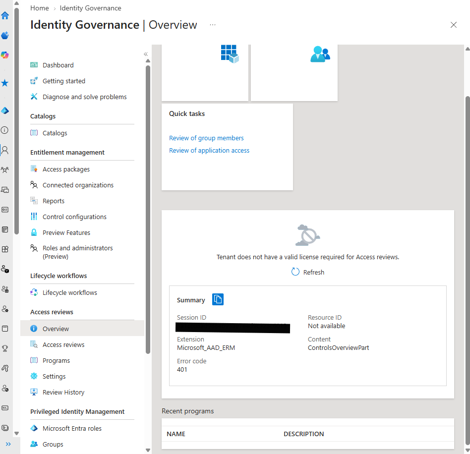
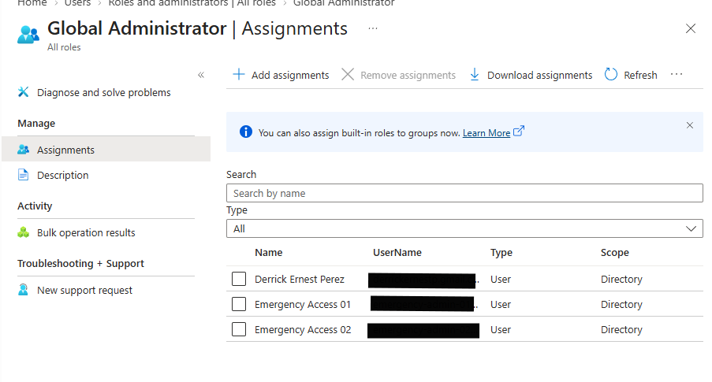
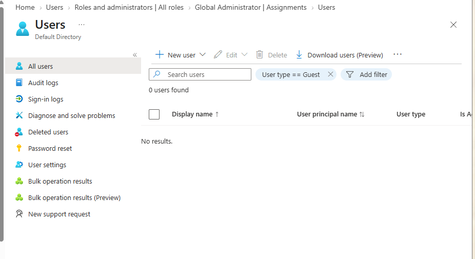
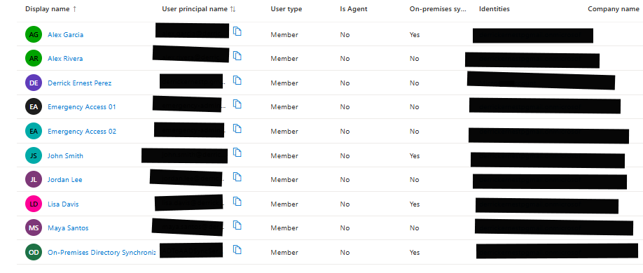
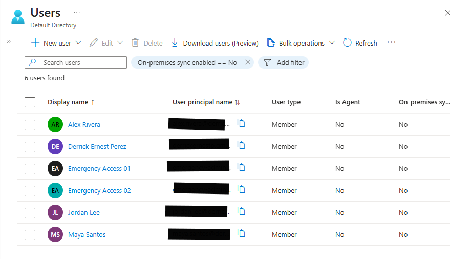
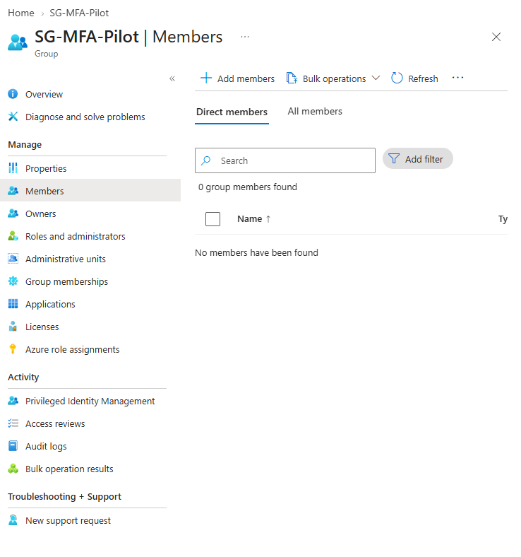
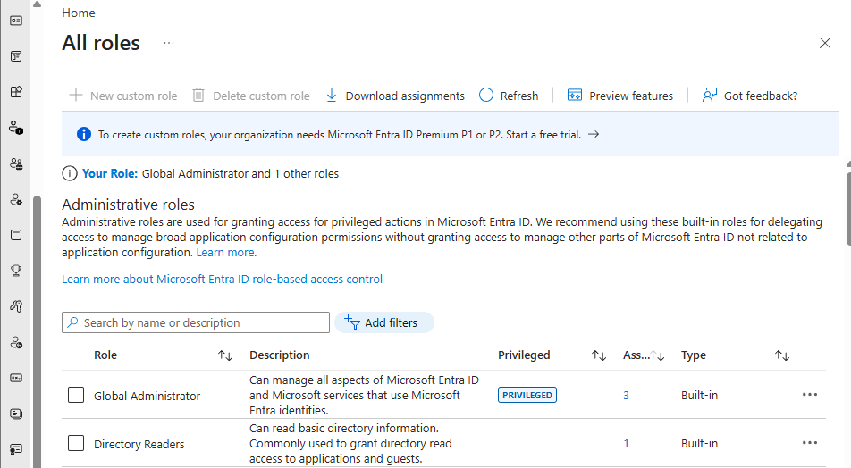
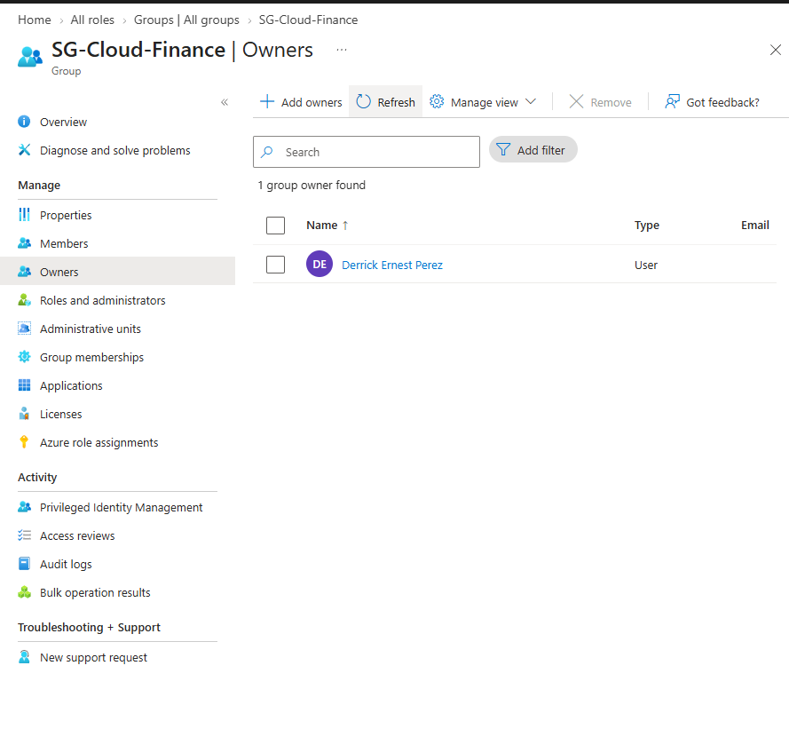
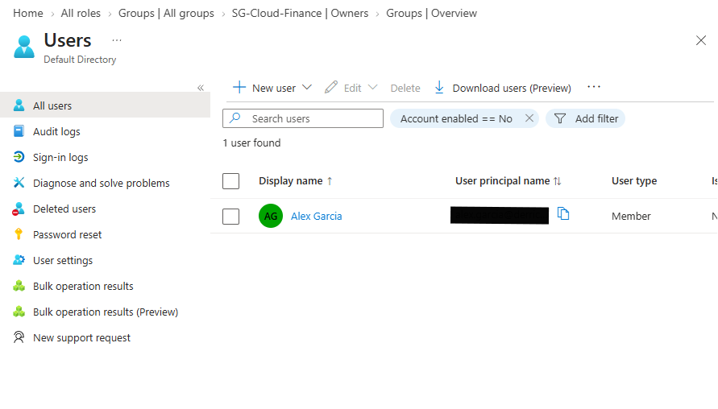

# Identity Governance Readiness

<p align="center">
  <strong>Microsoft Entra Access Reviews, Identity Lifecycle Governance, Privileged Access Review, and Manual Access Certification</strong>
</p>

<p align="center">
  
  
  
  
</p>

---

## Module Overview

This module demonstrates identity-governance planning, access certification, privileged-access review, lifecycle administration, remediation tracking, and governance documentation in Microsoft Entra ID.

The tenant used for this homelab does not include the Microsoft Entra licences required for advanced Identity Governance capabilities such as:

- Access Reviews
- Entitlement Management
- Lifecycle Workflows
- Privileged Identity Management
- Detailed inactive-user reporting

Because these capabilities were unavailable, the module implements a manual governance model using the Microsoft Entra admin center, structured review procedures, reports, templates, evidence, and validation scripts.

The module does not falsely represent licensed features as deployed.

Unavailable features are classified as:

```text
DESIGN ONLY — LICENCE REQUIRED
```

Available manual governance controls were implemented and validated.

---

## Business Scenario

A growing organization has implemented Microsoft Entra ID, hybrid identity, Microsoft Authenticator, emergency-access accounts, and cloud administration procedures.

As the identity environment expands, the organization needs a formal process for answering these questions:

- Does each user still require an account?
- Does each user still require their current group memberships?
- Are privileged roles still justified?
- Are disabled accounts retaining unnecessary access?
- Are external guest users still required?
- Do important groups have accountable owners?
- Are access changes approved and documented?
- Is access removed when users move roles or leave?
- Can administrators prove that access is reviewed regularly?
- Are licensing limitations documented honestly?

The goal of this module was to establish a practical Identity Governance Readiness framework using available Microsoft Entra capabilities and manual controls.

---

## Objectives

This module was designed to:

1. Review Identity Governance licensing and feature availability.
2. Document unavailable licensed governance capabilities.
3. Review Global Administrator assignments.
4. Review other assigned administrative roles.
5. Identify cloud-only and synchronized identities.
6. Review guest-user access.
7. Review disabled accounts.
8. Review group memberships.
9. Identify and remediate inappropriate group membership.
10. Review group ownership.
11. Assign an accountable owner to an ownerless group.
12. Document a Joiner–Mover–Leaver process.
13. Document quarterly access certification.
14. Create a Separation of Duties matrix.
15. Create an Access Request template.
16. Produce manual access-review reports.
17. Produce privileged-role review reports.
18. Document governance architecture.
19. Validate required module files.
20. Prevent sensitive identity information from being published.

---

## Repository Structure

```text
05-Identity-Governance/
│
├── README.md
│
├── Architecture/
│   └── Identity-Governance-Architecture.md
│
├── Evidence/
│   └── Screenshots/
│       ├── 01-identity-governance-licence-baseline.png
│       ├── 02-global-administrator-access-review.png
│       ├── 03-guest-user-access-review.png
│       ├── 04-user-account-baseline.png
│       ├── 05-synchronized-user-review.png
│       ├── 06-cloud-only-user-review.png
│       ├── 07-mfa-pilot-group-access-review.png
│       ├── 08-assigned-administrative-roles-review.png
│       ├── 09-security-group-owner-review.png
│       ├── 10-disabled-user-account-review.png
│       └── 11-disabled-account-access-review.png
│
├── Procedures/
│   ├── SOP-Joiner-Mover-Leaver.md
│   └── SOP-Quarterly-Access-Certification.md
│
├── Reports/
│   ├── Disabled-Account-Access-Review.csv
│   ├── Manual-Access-Review-Summary.csv
│   ├── Privileged-Role-Review.csv
│   ├── Identity-Governance-Feature-Inventory.csv
│   └── Final-Validation.txt
│
├── Scripts/
│   └── Test-IdentityGovernanceReadiness.ps1
│
└── Templates/
    ├── Separation-of-Duties-Matrix.csv
    └── Access-Request-Template.md
```

---

## High-Level Architecture

```text
                    Microsoft Entra ID
                           │
              ┌────────────┴────────────┐
              │                         │
        Identity population       Governance controls
              │                         │
     ┌────────┼────────┐       ┌────────┼─────────┐
     │        │        │       │        │         │
Cloud-only  Synced   Guest   Manual   Role      Group
 users      users    users   reviews  reviews   reviews
     │        │        │       │        │         │
     └────────┴────────┴───────┴────────┴─────────┘
                           │
                           ▼
                  Access certification
                           │
            ┌──────────────┼──────────────┐
            │              │              │
         Approve         Modify         Remove
            │              │              │
            └──────────────┴──────────────┘
                           │
                           ▼
                       Remediation
                           │
                           ▼
                  Validation and evidence
```

---

## Identity Lifecycle Architecture

```text
Joiner
  │
  ├── Approved request
  ├── Identity source selected
  ├── Account created
  ├── Required access assigned
  ├── Least privilege applied
  ├── MFA registered
  └── Access validated
  │
  ▼
Mover
  │
  ├── Existing access recorded
  ├── Old access removed
  ├── New access approved
  ├── Roles corrected
  ├── Groups updated
  └── Access revalidated
  │
  ▼
Leaver
  │
  ├── Account disabled
  ├── Sessions reviewed
  ├── Roles removed
  ├── Groups removed
  ├── Licences removed
  ├── Ownership transferred
  └── Retention documented
```

---

## Access Certification Architecture

```text
Users, groups, and roles
          │
          ▼
Manual access review
          │
          ├── Account still required?
          ├── Access still justified?
          ├── Least privilege followed?
          ├── Owner assigned?
          ├── Role appropriate?
          └── Remediation required?
          │
          ▼
Certification decision
          │
     ┌────┼────┬──────┬────────┐
     │    │    │      │        │
 Approve Modify Remove Disable Escalate
     │    │    │      │        │
     └────┴────┴──────┴────────┘
          │
          ▼
Validation and evidence
```

---

## Environment

| Component | Purpose |
|---|---|
| Microsoft Entra ID | Cloud identity and access platform |
| Microsoft Entra admin center | Administrative and governance review portal |
| On-premises Active Directory | Source of authority for synchronized users |
| Microsoft Entra Cloud Sync | Synchronization of selected identities |
| Microsoft Authenticator | MFA method for controlled pilot users |
| Software OATH | MFA method for emergency-access accounts |
| `SG-MFA-Pilot` | Controlled security group used for access review |
| Global Administrator role | Privileged tenant-wide administration |
| GitHub | Evidence, reports, procedures, templates, and validation |

---

## Implementation Summary

| Governance area | Result | Classification |
|---|---|---|
| Identity Governance licence review | Completed | COMPLETED AND VALIDATED |
| Access Reviews availability | Unavailable | DESIGN ONLY — LICENCE REQUIRED |
| Entitlement Management | Unavailable | DESIGN ONLY — LICENCE REQUIRED |
| Lifecycle Workflows | Unavailable | DESIGN ONLY — LICENCE REQUIRED |
| Privileged Identity Management | Unavailable | DESIGN ONLY — LICENCE REQUIRED |
| Guest-user review | Zero guests found | COMPLETED AND VALIDATED |
| Global Administrator review | Completed | COMPLETED AND VALIDATED |
| Other administrative roles | Manually reviewed | COMPLETED AND VALIDATED |
| Cloud-only user review | Completed | COMPLETED AND VALIDATED |
| Synchronized user review | Completed | COMPLETED AND VALIDATED |
| Disabled-account review | Completed | MANUAL REVIEW COMPLETED |
| MFA pilot group review | Incorrect membership identified and corrected | REMEDIATED |
| Group ownership review | Missing owner identified and corrected | REMEDIATED |
| Joiner–Mover–Leaver process | Documented | COMPLETED WITH DOCUMENTED LIMITATION |
| Quarterly access certification | Documented | COMPLETED WITH DOCUMENTED LIMITATION |
| Separation of Duties matrix | Created | COMPLETED WITH DOCUMENTED LIMITATION |
| Access Request template | Created | COMPLETED WITH DOCUMENTED LIMITATION |

---

# Implementation Walkthrough

## 1. Identity Governance Licence Baseline

The Microsoft Entra Identity Governance portal was reviewed before performing governance work.

The portal confirmed that the tenant did not have a valid licence for Access Reviews.

The review established that advanced governance features could not be deployed.

No trial was activated.

No unavailable feature was falsely represented as implemented.

### Result

```text
Access Reviews             : DESIGN ONLY — LICENCE REQUIRED
Entitlement Management     : DESIGN ONLY — LICENCE REQUIRED
Lifecycle Workflows        : DESIGN ONLY — LICENCE REQUIRED
Privileged Identity Management : DESIGN ONLY — LICENCE REQUIRED
```

### Evidence



> **Identity Governance Licence Baseline** — The Microsoft Entra Identity Governance portal confirmed that Access Reviews were unavailable under the tenant’s current licensing. Licensed governance capabilities were therefore documented as design-only controls.

---

## 2. Global Administrator Access Review

The tenant’s Global Administrator assignments were manually reviewed.

Three approved assignments were identified:

```text
Normal administrator
Emergency Access 01
Emergency Access 02
```

The normal administrator is used for routine tenant administration.

The emergency-access accounts are cloud-only recovery identities reserved for tenant-lockout scenarios.

The real usernames and tenant domain were excluded from the repository.

### Evidence



> **Global Administrator Access Review** — Privileged role assignments were manually reviewed to confirm that administrative access was limited to one normal administrator and two dedicated cloud-only emergency-access accounts.

---

## 3. Guest-User Access Review

The tenant was filtered by:

```text
User type = Guest
```

The review found:

```text
Guest users found : 0
Review result     : No external access detected
Classification    : COMPLETED AND VALIDATED
```

Although no guest users existed, the review remains important because external identities can retain access after their original business purpose ends.

Future guest governance should require:

- A sponsor
- A documented purpose
- A review date
- Approved group membership
- No unnecessary administrative roles
- Removal when access is no longer required

### Evidence



> **Guest User Access Review** — External guest identities were manually reviewed to identify unnecessary, inactive, or privileged external access requiring removal or further approval. No guest users were present.

---

## 4. User Account Baseline

All tenant identities were reviewed to establish the current user population.

The review distinguished between:

- Cloud-only users
- Synchronized users
- Enabled accounts
- Disabled accounts
- Administrative accounts
- Emergency-access accounts
- Test users

Detailed last-interactive and non-interactive sign-in properties were unavailable under the tenant’s current licensing.

This limitation was documented rather than treated as a failed configuration.

### Evidence



> **User Account Baseline** — The tenant’s current user population, account types, enabled states, and identity sources were reviewed. Detailed last-sign-in properties were unavailable under the tenant’s current licensing and were documented as a governance limitation.

---

## 5. Synchronized User Review

Microsoft Entra identities synchronized from on-premises Active Directory were reviewed.

For synchronized users:

- On-premises Active Directory remains the source of authority.
- Account disablement should normally begin on-premises.
- Group and attribute changes should be made in the authoritative source.
- Synchronization should be validated after changes.
- Unsupported permanent cloud overrides should be avoided.

### Evidence


> **Synchronized User Review** — Microsoft Entra identities synchronized from on-premises Active Directory were identified to establish their authoritative identity source and support correct Joiner–Mover–Leaver governance procedures.

---

## 6. Cloud-Only User Review

Accounts created directly in Microsoft Entra ID were reviewed separately.

Cloud-only identities may include:

- Normal administrators
- Emergency-access accounts
- Test users
- Pilot users
- Cloud service identities

Microsoft Entra ID is the source of authority for these accounts.

Their lifecycle must be managed directly in the cloud.

### Evidence



> **Cloud-Only User Review** — Microsoft Entra identities created directly in the cloud were identified to distinguish their source of authority from users synchronized from on-premises Active Directory.

---

## 7. MFA Pilot Group Access Review

The `SG-MFA-Pilot` security group was manually reviewed.

The initial review found that an emergency-access account had been incorrectly added as the pilot member.

This created a governance risk because emergency identities should not participate in routine testing or pilot access groups.

### Finding

```text
Finding        : Emergency-access account included in pilot group
Risk           : Recovery identity exposed to pilot configuration changes
Required action: Remove the emergency account
Status         : REMEDIATION REQUIRED
```

The emergency account was removed.

The correct normal non-administrator pilot user was added.

### Final result

```text
Approved pilot members : 1
Emergency accounts     : Not included
Unexpected members     : None
Final status           : REMEDIATED
```

### Evidence



> **MFA Pilot Group Access Review** — Membership of the MFA pilot security group was manually corrected and certified to confirm that access remained limited to one approved non-administrator test identity, with emergency-access accounts excluded.

---

## 8. Administrative Role Review

All assigned Microsoft Entra administrative roles were manually reviewed.

The review considered:

- Whether the role was still required
- Whether a less-privileged role could be used
- Whether the assigned account was active
- Whether MFA was available
- Whether the assignment was an emergency-access assignment
- Whether continued access was justified

Global Administrator access was reviewed separately because it provides tenant-wide control.

Privileged Identity Management was unavailable under the current licence.

Therefore, just-in-time activation and time-bound privileged access remain:

```text
DESIGN ONLY — LICENCE REQUIRED
```

### Evidence



> **Assigned Administrative Roles Review** — Microsoft Entra administrative roles with active assignments were manually reviewed to identify privileged access, unnecessary role assignments, and opportunities to apply least privilege.

---

## 9. Security Group Ownership Review

The `SG-MFA-Pilot` group initially had no assigned owner.

An ownerless group creates a governance problem because no person is formally accountable for:

- Approving new members
- Reviewing continued access
- Confirming the group’s business purpose
- Requesting removal of unnecessary members
- Supporting periodic certification

### Initial result

```text
Owners found    : 0
Governance issue: No accountable owner
Classification  : REMEDIATION REQUIRED
```

A normal administrator was assigned as the group owner.

Emergency-access accounts were not used as owners.

### Final result

```text
Owners found                      : 1
Emergency account listed as owner : No
Final status                      : REMEDIATED
```

### Evidence



> **Security Group Ownership Review** — The MFA pilot security group initially had no assigned owner. A normal administrator was assigned as the accountable owner to support membership approval and periodic access certification.

---

## 10. Disabled User Account Review

The tenant was filtered for:

```text
Account enabled = No
```

One disabled account was identified.

Disabling an account blocks normal sign-in, but additional access may remain, including:

- Group memberships
- Administrative roles
- Product licences
- Authentication methods
- Resource ownership
- Delegated access

The disabled account was reviewed for residual access.

### Review criteria

```text
Administrative roles : Reviewed
Group memberships    : Reviewed
Active licences      : Reviewed
Sign-in access       : Blocked
Retention need       : Reviewed
```

The account was not deleted because deletion requires separate retention and business review.

### Evidence


> **Disabled User Account Review** — Disabled Microsoft Entra identities were manually reviewed to confirm that inactive accounts did not retain unnecessary group membership, privileged roles, or cloud access.



> **Disabled Account Access Review** — The remaining access assigned to a disabled Microsoft Entra identity was reviewed to confirm that privileged roles, licences, authentication methods, and unnecessary group memberships had been removed or identified for remediation.

---

# Governance Procedures

## Joiner–Mover–Leaver Process

The Joiner–Mover–Leaver procedure documents the full identity lifecycle.

### Joiner

A new user receives only approved access.

The process includes:

- Approval verification
- Identity-source selection
- Account creation
- Required group membership
- Least-privilege role assignment
- MFA registration
- Licence review
- Sign-in validation
- Documentation

### Mover

An existing user changes role, department, or responsibilities.

The process includes:

- Recording current access
- Removing obsolete access
- Adding approved new access
- Reviewing administrative roles
- Reviewing authentication requirements
- Testing old and new access
- Updating documentation

### Leaver

A user leaves or no longer requires access.

The process includes:

- Disabling the account
- Reviewing sessions
- Removing roles
- Removing groups
- Removing licences
- Reviewing authentication methods
- Transferring resource ownership
- Recording retention requirements
- Confirming sign-in is blocked

### Document

[Joiner–Mover–Leaver SOP](Procedures/SOP-Joiner-Mover-Leaver.md)

### Classification

```text
Manual JML workflow      : Completed
Automated workflows      : Not deployed
Licence limitation       : Confirmed
Classification           : COMPLETED WITH DOCUMENTED LIMITATION
```

---

## Quarterly Access Certification

The quarterly access-certification procedure defines how access should be reviewed every three months.

The review covers:

- Cloud-only users
- Synchronized users
- Guest users
- Disabled users
- Administrative roles
- Security-group memberships
- Group ownership
- Emergency-access accounts
- Authentication readiness
- Available licences

Possible certification decisions include:

```text
APPROVE
REMOVE
MODIFY
DISABLE
RETAIN
ESCALATE
```

### Document

[Quarterly Access Certification SOP](Procedures/SOP-Quarterly-Access-Certification.md)

### Classification

```text
Manual access certification : Completed
Automated Access Reviews     : Not deployed
Licence limitation           : Confirmed
Classification               : COMPLETED WITH DOCUMENTED LIMITATION
```

---

# Governance Templates

## Separation of Duties Matrix

The Separation of Duties matrix assigns different responsibilities to:

```text
Requester
Approver
Administrator
Reviewer
```

The matrix covers:

- New user creation
- Security-group access
- Privileged-role assignment
- MFA reset
- Password reset
- Disabled-account retention
- User offboarding
- Group ownership
- Emergency-account changes
- Conditional Access deployment
- Access certification

In a production organization, these responsibilities should be distributed among different people where possible.

In the homelab, one administrator may perform more than one responsibility because separate HR, security, and management teams do not exist.

### File

```text
Templates/Separation-of-Duties-Matrix.csv
```

### Classification

```text
COMPLETED WITH DOCUMENTED LIMITATION
```

---

## Access Request Template

The Access Request template provides a reusable form for requesting:

- New user access
- Security-group membership
- Administrative roles
- Application access
- MFA registration or reset
- Temporary access
- Access modification
- Access removal
- Emergency-access changes

The template includes:

- Business justification
- Identity source
- Risk review
- Required approvals
- Implementation checks
- Validation
- Final decision
- Future review date

### File

[Access Request Template](Templates/Access-Request-Template.md)

### Classification

```text
COMPLETED WITH DOCUMENTED LIMITATION
```

---

# Reports

## Manual Access Review Summary

The manual access-review report summarizes completed reviews, findings, remediation actions, and final classifications.

### File

```text
Reports/Manual-Access-Review-Summary.csv
```

Key findings include:

```text
Emergency account in MFA pilot group : REMEDIATED
Missing MFA pilot group owner         : REMEDIATED
One disabled account                  : MANUAL REVIEW COMPLETED
Zero guest users                      : COMPLETED AND VALIDATED
Governance licence limitation         : DOCUMENTED
```

---

## Disabled Account Access Review

The disabled-account report records:

- Account state
- Administrative-role count
- Group-membership count
- Active licence count
- Sign-in access
- Required action
- Final classification

### File

```text
Reports/Disabled-Account-Access-Review.csv
```

Sensitive account identifiers are intentionally excluded.

---

## Privileged Role Review

The privileged-role report records:

- Global Administrator assignments
- Other assigned roles
- Emergency-access administrators
- Privileged Identity Management limitation
- Required review actions
- Final classifications

### File

```text
Reports/Privileged-Role-Review.csv
```

---

## Identity Governance Feature Inventory

The feature inventory separates available manual capabilities from unavailable licensed features.

### File

```text
Reports/Identity-Governance-Feature-Inventory.csv
```

The report includes:

| Feature | Status |
|---|---|
| Access Reviews | DESIGN ONLY — LICENCE REQUIRED |
| Entitlement Management | DESIGN ONLY — LICENCE REQUIRED |
| Lifecycle Workflows | DESIGN ONLY — LICENCE REQUIRED |
| Privileged Identity Management | DESIGN ONLY — LICENCE REQUIRED |
| Inactive-user reporting | COMPLETED WITH DOCUMENTED LIMITATION |
| Guest-user review | COMPLETED AND VALIDATED |
| Privileged-role review | COMPLETED AND VALIDATED |
| Group-membership certification | REMEDIATED |
| Group-owner governance | REMEDIATED |
| Disabled-account review | MANUAL REVIEW COMPLETED |

---

# Validation Script

The module includes:

```text
Scripts/Test-IdentityGovernanceReadiness.ps1
```

The script validates:

- Required directories
- README presence
- Architecture document
- Joiner–Mover–Leaver SOP
- Quarterly access-certification SOP
- Required reports
- Governance templates
- Evidence screenshots
- Empty required files
- Obvious passwords and tokens
- Real `onmicrosoft.com` tenant domains
- Correct licence classifications
- Guest-user review results
- Remediation documentation
- Disabled-account report completion
- Privileged-role report completion

Expected result:

```text
TotalChecks  : Generated by script
PassedChecks : Same as TotalChecks
FailedChecks : 0
FinalStatus  : PASSED
```

The generated result is written to:

```text
Reports/Final-Validation.txt
```

---

# Governance Findings

## Finding 1 — Emergency Account in Pilot Group

```text
Finding        : Emergency account incorrectly included
Risk           : Recovery identity exposed to routine pilot changes
Required action: Remove emergency account
Final status   : REMEDIATED
```

## Finding 2 — Missing Group Owner

```text
Finding        : SG-MFA-Pilot had no owner
Risk           : No accountable access reviewer
Required action: Assign a normal administrator as owner
Final status   : REMEDIATED
```

## Finding 3 — Disabled Account Retained

```text
Finding        : One disabled account remained
Risk           : Residual roles, groups, or licences could remain
Required action: Review remaining access and retention need
Final status   : MANUAL REVIEW COMPLETED
```

## Finding 4 — Advanced Governance Unavailable

```text
Finding        : Advanced governance features require licensing
Risk           : Reviews rely on manual processes
Required action: Create documented manual controls
Final status   : COMPLETED WITH DOCUMENTED LIMITATION
```

---

# Security Considerations

## Least privilege

Administrative access should be assigned only when required.

Global Administrator should not be used for routine help-desk work when a narrower role is sufficient.

## Emergency accounts

Emergency-access accounts must:

- Remain cloud-only
- Remain enabled
- Retain approved recovery roles
- Use working MFA
- Be tested separately
- Avoid routine use
- Remain outside normal access groups
- Be reviewed separately

## Group governance

Important groups should have:

- A documented purpose
- An accountable owner
- Approved members
- Periodic review
- No unnecessary emergency accounts
- Clear remediation procedures

## Disabled accounts

Disabled identities should be reviewed for:

- Privileged roles
- Group memberships
- Licences
- Authentication methods
- Resource ownership
- Retention requirements
- Deletion timing

## Evidence protection

The following must never be committed:

```text
Passwords
Temporary passwords
MFA secrets
QR codes
Recovery codes
Access tokens
Tenant IDs
Object IDs
Real tenant domains
Emergency usernames
Personal email addresses
Phone numbers
Private user activity
Sensitive employee details
```

---

# Troubleshooting

## Access Reviews show a licence error

This is expected when the required Identity Governance licence is unavailable.

Record:

```text
DESIGN ONLY — LICENCE REQUIRED
```

Do not classify the module as failed.

## Last sign-in columns are unavailable

Detailed sign-in activity may be unavailable because of tenant licensing.

Use available account-state, user-type, and synchronization information.

Record the limitation honestly.

## A synchronized account cannot be edited

The attribute may be controlled by on-premises Active Directory.

Make the change in the authoritative on-premises source, then validate synchronization.

## A group has no owner

Assign an appropriate normal administrator or business owner.

Do not assign an emergency-access account as the routine owner.

## An emergency account appears in a normal access group

Remove it from the group.

Do not delete or disable the emergency account.

Confirm that the group contains only approved normal users.

## A disabled account retains access

Review:

- Roles
- Groups
- Licences
- Authentication methods
- Resource ownership
- Retention need

Remove unnecessary access before deletion or long-term retention.

---

# Evidence Index

| No. | Evidence file | Description |
|---:|---|---|
| 01 | `01-identity-governance-licence-baseline.png` | Identity Governance licensing limitation |
| 02 | `02-global-administrator-access-review.png` | Global Administrator assignments |
| 03 | `03-guest-user-access-review.png` | Guest-user review |
| 04 | `04-user-account-baseline.png` | User population baseline |
| 05 | `05-synchronized-user-review.png` | Synchronized identity review |
| 06 | `06-cloud-only-user-review.png` | Cloud-only identity review |
| 07 | `07-mfa-pilot-group-access-review.png` | MFA pilot group access certification |
| 08 | `08-assigned-administrative-roles-review.png` | Assigned administrative roles |
| 09 | `09-security-group-owner-review.png` | Group-owner remediation |
| 10 | `10-disabled-user-account-review.png` | Disabled-user baseline |
| 11 | `11-disabled-account-access-review.png` | Disabled-account residual-access review |

---

# Skills Demonstrated

## Microsoft Entra administration

- Cloud-only identity review
- Synchronized identity review
- Guest-user review
- Disabled-account review
- Administrative-role review
- Group-membership review
- Group-owner assignment
- Emergency-account governance

## Identity governance

- Access certification
- Joiner–Mover–Leaver design
- Privileged-access review
- Separation of duties
- Access-request approval design
- Group ownership
- Remediation tracking
- Licence-aware governance planning

## Security and compliance

- Least-privilege review
- Residual-access analysis
- Privileged-role validation
- Account-lifecycle controls
- Evidence redaction
- Manual compensating controls
- Exception and limitation documentation

## Documentation and automation

- Architecture documentation
- SOP creation
- CSV reporting
- Governance templates
- Validation scripting
- Evidence indexing
- Final status classification

---

# Interview Preparation

## Why were Access Reviews not deployed?

The tenant did not include the required Microsoft Entra Identity Governance licensing. A manual quarterly access-certification process was created instead.

## What is identity governance?

Identity governance ensures that users have the correct access, for the correct reason, for the correct amount of time, and that access is reviewed and removed when no longer needed.

## What is the difference between a cloud-only and synchronized user?

A cloud-only user is managed directly in Microsoft Entra ID.

A synchronized user originates from on-premises Active Directory, which remains the source of authority for many attributes.

## Why is group ownership important?

A group owner is accountable for reviewing membership, approving access, maintaining the group’s purpose, and requesting removal of unnecessary members.

## Why was the emergency account removed from the MFA pilot group?

Emergency-access accounts should be isolated from routine testing and policy pilots. Their only purpose is tenant recovery.

## Why review disabled accounts?

A disabled account may still retain group memberships, administrative roles, licences, authentication methods, or resource ownership.

## What is Separation of Duties?

Separation of Duties divides sensitive responsibilities among different people, such as requester, approver, administrator, and reviewer, reducing the risk of unauthorized access.

## What is the Joiner–Mover–Leaver process?

It manages identity access through employment changes:

- Joiner: create and approve access
- Mover: remove old access and assign new access
- Leaver: disable the account and remove access

---

# Lessons Learned

- Identity governance is more than account creation.
- Access must be reviewed after it is assigned.
- Disabled accounts may retain residual access.
- Security groups require accountable owners.
- Emergency accounts should not be included in routine access groups.
- Cloud-only and synchronized identities require different lifecycle procedures.
- Privileged access must be reviewed separately.
- Manual controls can provide governance when licensed automation is unavailable.
- Governance findings should lead to remediation, not only documentation.
- Licensing limitations must be documented honestly.
- Evidence must be redacted before publication.
- Automated validation improves repository quality.

---

# Documented Limitations

| Limitation | Impact |
|---|---|
| No Identity Governance licence | Access Reviews unavailable |
| No Entitlement Management | Access packages unavailable |
| No Lifecycle Workflows | JML process remains manual |
| No Privileged Identity Management | Just-in-time roles unavailable |
| No detailed sign-in activity | Inactive-user analysis is limited |
| Single homelab administrator | Full Separation of Duties cannot be implemented |
| No production organization | Reviews use controlled test identities |

These limitations are environmental constraints, not failed implementations.

---

# Future Improvements

- Obtain eligible Microsoft Entra Identity Governance licensing.
- Deploy recurring Access Reviews.
- Configure group-membership certification.
- Configure guest-access expiration.
- Implement Entitlement Management.
- Implement Lifecycle Workflows.
- Introduce Privileged Identity Management.
- Use time-bound administrative roles.
- Export governance data through Microsoft Graph.
- Add automated inactive-account reporting.
- Integrate access requests with GLPI.
- Add approval tickets for access changes.
- Add quarterly certification reports.
- Configure emergency-account activity alerts.
- Add GitHub Actions validation.
- Add Pester tests for the validation script.

---

# Final Validation Criteria

The module is complete when:

```text
Identity Governance licence baseline captured
Global Administrator access reviewed
Guest-user population reviewed
User-account baseline captured
Synchronized users reviewed
Cloud-only users reviewed
MFA pilot group reviewed
Incorrect emergency membership remediated
Assigned administrative roles reviewed
Group ownership reviewed
Missing owner remediated
Disabled accounts reviewed
Disabled-account residual access reviewed
Joiner–Mover–Leaver SOP created
Quarterly access-certification SOP created
Separation of Duties matrix created
Access Request template created
Required reports created
Architecture document created
README completed
Evidence redacted
Validation script executed
FailedChecks : 0
FinalStatus  : PASSED
```

---

# Final Module Status

```text
Identity Governance licence review : COMPLETED AND VALIDATED
Global Administrator review         : COMPLETED AND VALIDATED
Guest-user review                   : COMPLETED AND VALIDATED
Cloud-only user review              : COMPLETED AND VALIDATED
Synchronized-user review            : COMPLETED AND VALIDATED
Privileged-role review              : COMPLETED AND VALIDATED
MFA pilot group review              : REMEDIATED
Group-owner review                  : REMEDIATED
Disabled-account review             : MANUAL REVIEW COMPLETED
Joiner–Mover–Leaver workflow        : COMPLETED WITH DOCUMENTED LIMITATION
Quarterly access certification      : COMPLETED WITH DOCUMENTED LIMITATION
Separation of Duties                : COMPLETED WITH DOCUMENTED LIMITATION
Access Reviews                      : DESIGN ONLY — LICENCE REQUIRED
Entitlement Management              : DESIGN ONLY — LICENCE REQUIRED
Lifecycle Workflows                 : DESIGN ONLY — LICENCE REQUIRED
Privileged Identity Management      : DESIGN ONLY — LICENCE REQUIRED
Final repository validation         : PENDING
```

After the validation script returns:

```text
FailedChecks : 0
FinalStatus  : PASSED
```

update the final line to:

```text
Final repository validation         : COMPLETED AND VALIDATED
```

---

## Navigation

- [Return to Cloud Identity and Microsoft 365](../README.md)
- [Microsoft Entra ID](../01-Microsoft-Entra-ID/README.md)
- [Hybrid Identity](../02-Hybrid-Identity/README.md)
- [Microsoft 365 Administration](../03-Microsoft-365-Administration/README.md)
- [MFA and Conditional Access Readiness](../04-MFA-and-Conditional-Access/README.md)
- [Return to Repository Home](../../README.md)

---

## Disclaimer

This project was created in a controlled homelab environment for educational and portfolio purposes.

No production tenant, employer environment, customer system, or live organizational identity was used.

Sensitive tenant identifiers, passwords, usernames, MFA secrets, recovery credentials, object identifiers, email addresses, device information, and access tokens were intentionally excluded or redacted.
