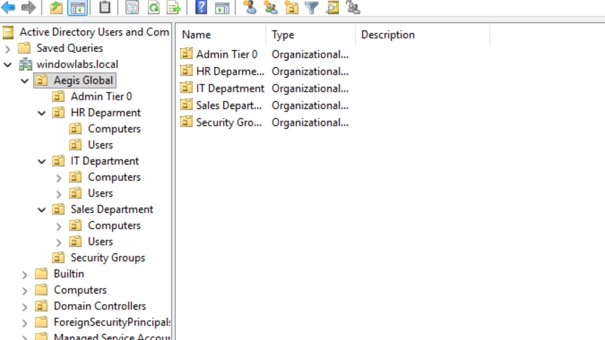

# Enterprise IT Operations & Security Homelab
### Advanced Identity, Access, & Network Management

A fully functional, simulated corporate IT environment.  
Demonstrating Active Directory, RBAC, Endpoint Hardening, and Core Networking.

 

---

## 🔗 Repository Directory

> **Navigate the Lab:** Click any folder below to view the configuration files, evidence, and incident reports for that specific domain.

| Directory | Contents |
|-----------|----------|
| **[📂 Network Infrastructure](./01-Infrastructure/01-DHCP/)** | DHCP Scopes, DNS Forwarders, Option Configuration |
| **[📂 Active Directory](./01-Infrastructure/03-Active-Directory/)** | OU hierarchy, security groups, and user provisioning |
| **[📂 Group Policy](./01-Infrastructure/04-Group-Policy/)** | Endpoint hardening, UAC interception, policy enforcement |
| **[📂 File Server](./01-Infrastructure/05-File-Server/)** | Centralized data silos, NTFS permissions, mapped drives |

---

## 🏢 Phase 1: Core Identity Architecture & RBAC

**What I Built:**
I configured Windows Server as a Domain Controller and built out a realistic company directory from scratch. 
* Designed a tiered Organizational Unit (OU) structure for `HR`, `IT`, and `Sales` to keep users and computers organized.
* Provisioned specific employee accounts and placed them into Global Security Groups to manage their permissions centrally.

**Why It Matters:** 
Instead of assigning permissions to individuals one by one, using Role-Based Access Control (RBAC) ensures that access rights automatically follow a user's job title. 

 

---

## 🔒 Phase 2: Endpoint Hardening & Group Policy

**What I Built:**
I joined a Windows 11 virtual machine to the domain and locked it down using Group Policy Objects (GPOs) to enforce the "Principle of Least Privilege."
* **UAC Hardening:** Standard users are blocked from running programs as an Administrator. The system triggers a Secure Desktop prompt requiring IT credentials.
* **Policy Verification:** I utilized "Hot Desking" (logging into the same machine as different users) and ran `gpresult /r` in the command line to prove the security policies successfully hit the targeted user.

**Why It Matters:**
This shrinks the attack surface. If a standard user accidentally downloads malware, the restricted account blocks the malware from silently installing itself with administrative rights.

 

---

## 📂 Phase 3: Centralized Data Silos & Automation

**What I Built:**
I created a corporate file server to allow employees to share files, but strictly separated the data so departments cannot see each other's private work.
* **The "Two Doors" Model:** I used *Share Permissions* to broadcast the folder to the network, but used strict *NTFS Permissions* to lock the actual contents inside so only specific departments can view them.
* **GPO Automation:** I created a Drive Mapping Group Policy that automatically connects the `S:` Drive to an employee's computer as soon as they log in.

**Why It Matters:**
It makes data access effortless for employees while preventing critical information leakage between different business departments.

 

---

## 🚀 Future Roadmap

| Phase | Technology | Status | Objective |
|-------|------------|--------|-----------|
| **Phase 4** | DHCP & DNS | 🟡 *In Progress* | Deploy automated IP allocation and DNS forwarders |
| **Phase 5** | Security Monitoring | ⚪ *Pending* | Deploy Sysmon, Wazuh SIEM, and analyze traffic via Wireshark |
| **Phase 6** | Incident Response | ⚪ *Pending* | Investigate simulated attacks and map to MITRE ATT&CK |
