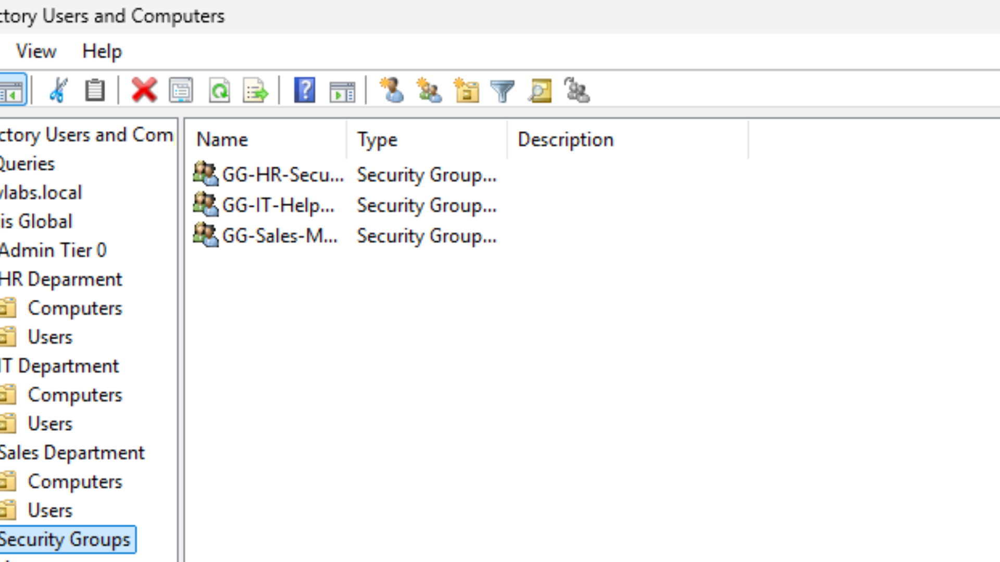
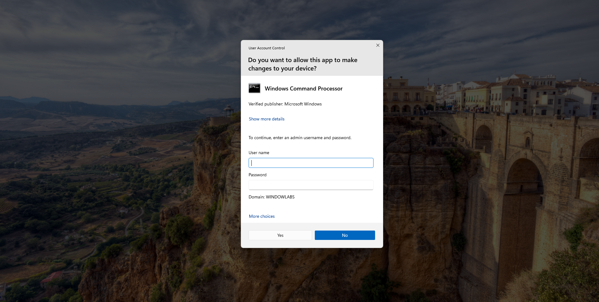
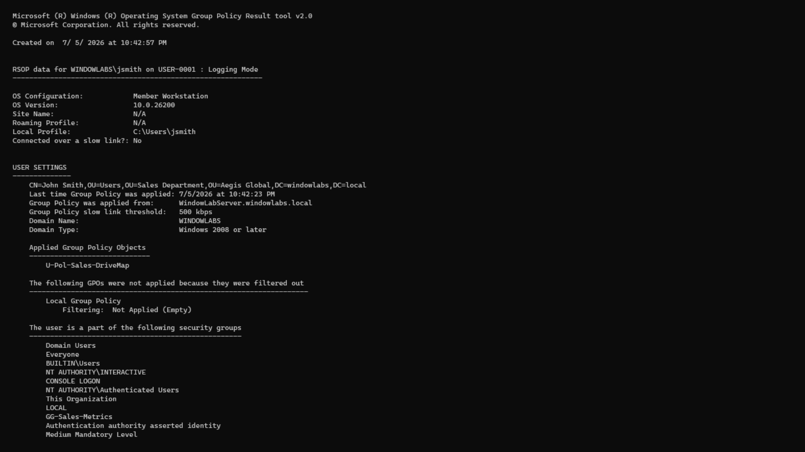
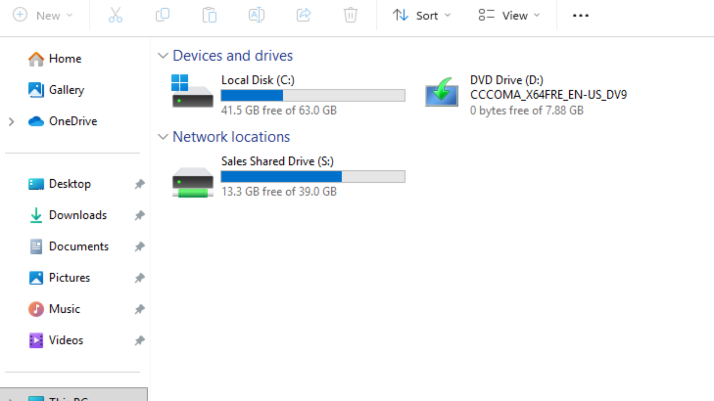

# Enterprise IT Operations & Security Homelab

### Advanced Identity, Access, & Network Management

A fully functional, simulated corporate IT environment.  

Demonstrating Active Directory, RBAC, Endpoint Hardening, and Core Networking.

 

---

## 🔗 Repository Directory

> **Navigate the Lab:** Click any folder below to view the configuration files, scripts, and documentation for that specific domain.

| Directory | Contents |

|-----------|----------|

| **[📂 Network-Infrastructure](./Network-Infrastructure/)** | DHCP/DNS scopes and topology diagrams |

| **[📂 Active-Directory](./Active-Directory/)** | OU hierarchy, security groups, and user provisioning data |

| **[📂 Group-Policy-Objects](./Group-Policy-Objects/)** | Applied GPO configurations (Drive Maps, UAC Hardening) |

| **[📂 Hybrid-Cloud-Sync](./Hybrid-Cloud-Sync/)** | Entra ID synchronization logs |

| **[📂 ITSM-Ticketing](./ITSM-Ticketing/)** | Jira Service Management incident workflows |

| **[📂 Scripts-Automation](./Scripts-Automation/)** | PowerShell scripts for automation |

---

## 🏢 Phase 1: Core Identity Architecture & RBAC

**What I Built:**

I configured Windows Server 2022 as a Domain Controller and built out a realistic company directory from scratch. 

* Designed a tiered Organizational Unit (OU) structure for `HR`, `IT`, and `Sales` to keep users and computers organized.

* Provisioned specific employee accounts and placed them into Global Security Groups to manage their permissions centrally.

**Why It Matters:** 

Instead of assigning permissions to individuals one by one, using Role-Based Access Control (RBAC) ensures that access rights automatically follow a user's job title. 

| Employee Name | Department | Privilege Level | Logon Name | Security Group |

| :--- | :--- | :--- | :--- | :--- |

| **Derrick Perez** | IT Department | Domain Administrator | `admin-dperez` | `GG-IT-Helpdesk` |

| **Jane Doe** | HR Department | Standard User | `jdoe` | `GG-HR-Security` |

| **John Smith** | Sales Department | Standard User | `jsmith` | `GG-Sales-Metrics` |

 

---

## 🔒 Phase 2: Endpoint Hardening & Group Policy

**What I Built:**

I joined a Windows 11 virtual machine to the domain and locked it down using Group Policy Objects (GPOs) to enforce the "Principle of Least Privilege."

* **UAC Hardening:** Standard users (Jane and John) are blocked from running programs as an Administrator. The system triggers a Secure Desktop prompt requiring IT credentials. My IT account (`admin-dperez`) bypasses this restriction seamlessly.

* **Policy Verification:** I utilized "Hot Desking" (logging into the same machine as different users) and ran `gpresult /r` in the command line to prove the security policies successfully hit the targeted user.

**Why It Matters:**

This shrinks the attack surface. If a standard user accidentally downloads malware, the restricted account blocks the malware from silently installing itself with administrative rights.

 

---

## 📂 Phase 3: Centralized Data Silos & Automation

**What I Built:**

I created a corporate file server to allow employees to share files, but strictly separated the data so departments cannot see each other's private work.

* **The "Two Doors" Model:** I used *Share Permissions* to broadcast the folder to the network, but used strict *NTFS Permissions* to lock the actual contents inside so only the Sales Security Group can view it.

* **GPO Automation:** I created a Drive Mapping Group Policy that automatically connects the `S:` Drive to John Smith's computer as soon as he logs in, without him needing to know the server's network address.

**Why It Matters:**

It makes data access effortless for employees while preventing critical information leakage between different business departments.

 

---

## 🚀 Future Roadmap

| Phase | Technology | Status | Objective |

|-------|------------|--------|-----------|

| **Phase 4** | DHCP & DNS | 🟡 *In Progress* | Deploy automated IP allocation and DNS forwarders |

| **Phase 5** | Jira ITSM | ⚪ *Pending* | Engineer real-world incident management workflows |

| **Phase 6** | Windows LAPS | ⚪ *Pending* | Deploy Local Administrator Password Solution |

| **Phase 7** | Entra ID | ⚪ *Pending* | Synchronize on-premises AD to Microsoft 365 Cloud |

| **Phase 8** | File Auditing | ⚪ *Pending* | Configure Object Access auditing for file modifications |

---

  
Enterprise IT Infrastructure & Operations Homelab · 2026

 

