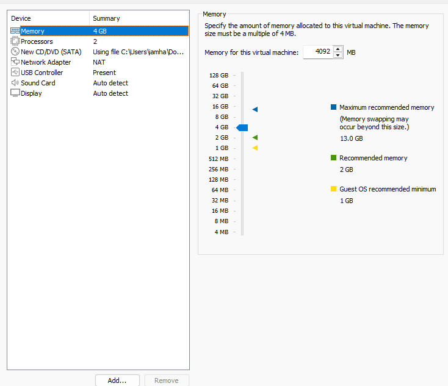
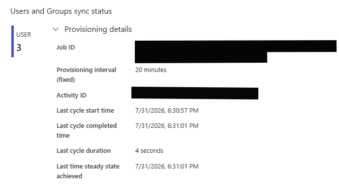
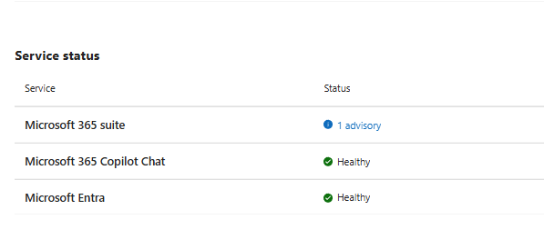

<div align="center">


<br>


<br><br>

<a href="00-Lab-Setup">
  
</a>

<a href="01-Identity-and-Access-Management">
  
</a>

<a href="02-Core-Infrastructure">
  
</a>

<a href="03-Enterprise-Operations">
  
</a>

<a href="04-Cloud-Identity-and-M365">
  
</a>

</div>

---

# IT Operations Homelab

This repository is a hands-on Microsoft IT operations portfolio built to simulate the responsibilities of an internal IT support, systems administration, cloud identity, and infrastructure operations team.

The homelab follows an enterprise-style progression:

```text
Virtualization
      ↓
Windows Server installation
      ↓
Active Directory Domain Services
      ↓
Identity and access administration
      ↓
DNS, DHCP, Group Policy, and file services
      ↓
PowerShell automation
      ↓
Security monitoring
      ↓
Patch management
      ↓
Remote administration
      ↓
Operational documentation
      ↓
Microsoft Entra ID
      ↓
Hybrid identity
      ↓
Microsoft 365 administration
```

The repository is designed to demonstrate more than configuration screenshots.

Each major module may include:

- A realistic business scenario
- Architecture and service-flow diagrams
- Step-by-step implementation
- PowerShell commands and scripts
- Screenshots and validation evidence
- Troubleshooting records
- Root-cause analysis
- Security considerations
- Standard operating procedures
- Reports and exported data
- Interview preparation
- Lessons learned
- Future improvements

---

# Project Purpose

The objective of this homelab is to build practical experience relevant to roles such as:

```text
IT Support Technician
Service Desk Analyst
Desktop Support Technician
Junior Systems Administrator
Windows Server Administrator
Microsoft 365 Administrator
Cloud Support Associate
Identity and Access Management Analyst
Infrastructure Support Engineer
Security Operations Analyst
```

The environment focuses on the daily work performed by an IT operations team:

- Provisioning and maintaining Windows servers
- Managing users, groups, and permissions
- Administering Active Directory
- Configuring network infrastructure services
- Applying security controls
- Automating repetitive tasks
- Monitoring systems and authentication activity
- Managing Windows updates
- Troubleshooting service failures
- Reviewing cloud identities and logs
- Maintaining technical documentation
- Validating changes with evidence

---

# Business Scenario

The fictional Homelab IT Administration team manages a small Microsoft-based environment.

The organisation requires:

- Centralized identity management
- Domain-joined Windows devices
- Secure user and group administration
- Internal DNS and DHCP services
- Group Policy enforcement
- Centralized file and print services
- Local administrator password protection
- User onboarding and offboarding automation
- Security monitoring
- Patch management
- Server-health monitoring
- Remote administration
- Incident and knowledge-base documentation
- Microsoft Entra cloud identity
- Hybrid identity synchronization
- Microsoft 365 tenant administration

The environment is intentionally small enough to run on personal hardware while still demonstrating enterprise administration principles.

---

# Lab Architecture

```text
                         Physical Computer
                         Windows 11 Host
                                │
                     VMware Workstation Pro
                                │
         ┌──────────────────────┼──────────────────────┐
         │                      │                      │
       SRV01                 CLIENT01              Identity Servers
 Windows Server 2025      Windows 11 Enterprise         │
         │                      │               ┌────────┴────────┐
         │                      │               │                 │
         │                      │             SYNC01            SYNC02
         │                      │          Original Agent     Healthy Agent
         │                      │               │                 │
         ├── Active Directory   │               └────────┬────────┘
         ├── DNS                │                        │
         ├── DHCP               │             HTTPS 443 / Service Bus
         ├── Group Policy       │                        │
         ├── File Services      │                Microsoft Entra ID
         ├── Print Services     │                        │
         ├── Windows LAPS       │                 Microsoft 365
         ├── WSUS               │
         ├── IIS / WID          │
         └── Monitoring         │
                                │
                         Administrative Access
                     RDP • WinRM • PowerShell • SSH
```

## Identity Architecture

```text
On-premises Active Directory
          homelab.local
                │
                │ LDAP / DNS / Kerberos
                ↓
              SYNC02
   Microsoft Entra Cloud Sync Agent
                │
                │ HTTPS 443 / Service Bus
                ↓
        Microsoft Entra ID
                │
                ├── Cloud-only users
                ├── Synchronized users
                ├── Security groups
                ├── Administrative roles
                ├── Audit logs
                └── Sign-in logs
                │
                ↓
          Microsoft 365
```

---

# Core Lab Systems

| System | Operating System | Purpose |
|---|---|---|
| Physical host | Windows 11 | Runs the virtualized lab |
| `SRV01` | Windows Server 2025 | Domain controller, DNS, DHCP, Group Policy, file, print, WSUS, monitoring, and administrative services |
| `CLIENT01` | Windows 11 Enterprise | Domain-connected client and administrative workstation |
| `SYNC01` | Windows Server 2022 | Original Microsoft Entra Cloud Sync agent retained for troubleshooting evidence |
| `SYNC02` | Windows Server 2022 | Healthy replacement Microsoft Entra Cloud Sync agent |
| Microsoft Entra tenant | Cloud platform | Cloud identity, groups, roles, audit logs, sign-in logs, and hybrid identity |
| Microsoft 365 tenant | Cloud platform | Tenant administration, users, groups, domains, roles, service health, and Message Center |

---

# Technologies Used

## Operating Systems and Virtualization

- Windows Server 2025
- Windows Server 2022
- Windows 11 Enterprise
- VMware Workstation Pro
- UEFI
- Secure Boot
- NAT networking

## Windows Infrastructure

- Active Directory Domain Services
- Active Directory Users and Computers
- Group Policy
- DNS
- DHCP
- File Server Resource Manager
- SMB file services
- Folder Redirection
- Print Management
- Windows LAPS
- Windows Server Update Services
- Windows Internal Database
- Internet Information Services
- Task Scheduler
- Windows Event Logs

## Administration and Automation

- Windows PowerShell
- Active Directory PowerShell module
- Microsoft Graph PowerShell
- Windows Admin Center
- Server Manager
- Computer Management
- PowerShell Remoting
- WinRM
- Remote Desktop Protocol
- OpenSSH
- CSV and text reporting

## Cloud Identity and Microsoft 365

- Microsoft Entra ID
- Microsoft Entra Cloud Sync
- Password Hash Sync
- Microsoft Graph
- Microsoft 365 admin center
- Microsoft Entra audit logs
- Microsoft Entra sign-in logs
- Service health
- Message Center

## Documentation and Source Control

- Markdown
- Git
- GitHub
- GitHub Codespaces
- Screenshots and validation evidence
- Standard operating procedures
- Incident records
- Knowledge-base articles

---

# Repository Map

```text
IT-Operations-Homelab
│
├── 00-Lab-Setup
│   ├── 01-Enterprise-Virtualization
│   ├── 02-Windows-Server-Installation
│   ├── 03-Initial-Server-Configuration
│   └── 04-Active-Directory-Domain-Services
│
├── 01-Identity-and-Access-Management
│   ├── 05 – Active Directory Administration
│   ├── 06-Group-Policy-Hardening
│   ├── 07-Folder-Redirection
│   ├── 08-DNS-Infrastructure
│   ├── 09-DHCP-Infrastructure
│   ├── 10-File-Services
│   ├── 11-Windows-LAPS
│   ├── 12-Print-Server-Management
│   ├── 13-User-Lifecycle-Automation
│   ├── 14-Offboarding-Automation
│   ├── 15-Active-Directory-Auditing
│   ├── 16-Security-Monitoring
│   ├── 17-Helpdesk-Automation
│   ├── 18-Group-Policy-Compliance-Reporting
│   ├── 19-File-Server-Auditing
│   └── 20-Backup-and-Disaster-Recovery
│
├── 02-Core-Infrastructure
│   ├── 01-DNS-Infrastructure
│   ├── 02-DHCP-Infrastructure
│   ├── 03-File-Services
│   ├── 04-Folder-Redirection
│   ├── 05-Print-Server-Management
│   ├── 06-File-Server-Auditing
│   └── 07-Backup-and-Disaster-Recovery
│
├── 03-Enterprise-Operations
│   ├── 01-Security-Monitoring-Honey-Accounts
│   ├── 02-Windows-Admin-Center
│   ├── 03-WSUS-Patch-Management
│   ├── 04-Server-Monitoring
│   ├── 05-Remote-Administration
│   └── 06-Documentation-and-Knowledge-Base
│
└── 04-Cloud-Identity-and-M365
    ├── 01-Microsoft-Entra-ID
    ├── 02-Hybrid-Identity
    └── 03-Microsoft-365-Administration
```

---

# Module Guide

## 00 — Lab Setup

The Lab Setup section establishes the technical foundation used by the rest of the repository.

| Module | Focus |
|---|---|
| [01 — Enterprise Virtualization](00-Lab-Setup/01-Enterprise-Virtualization) | Creates the `SRV01` virtual machine using VMware Workstation Pro, UEFI, Secure Boot, NAT, and planned resource allocation |
| [02 — Windows Server Installation](00-Lab-Setup/02-Windows-Server-Installation) | Installs Windows Server and prepares the initial administrator environment |
| [03 — Initial Server Configuration](00-Lab-Setup/03-Initial-Server-Configuration) | Configures the server name, network settings, updates, time, and initial operating-system state |
| [04 — Active Directory Domain Services](00-Lab-Setup/04-Active-Directory-Domain-Services) | Promotes `SRV01` as the domain controller for `homelab.local` |

### Foundation Flow

```text
Create virtual machine
        ↓
Install Windows Server
        ↓
Configure server identity and networking
        ↓
Install Active Directory Domain Services
        ↓
Create homelab.local
```

---

# 01 — Identity and Access Management

This section focuses on the complete lifecycle of Windows identities, access, policies, auditing, and recovery.

| Module | Focus |
|---|---|
| [05 — Active Directory Administration](01-Identity-and-Access-Management/05%20%E2%80%93%20Active%20Directory%20Administration) | Users, groups, organisational units, permissions, and Active Directory administration |
| [06 — Group Policy Hardening](01-Identity-and-Access-Management/06-Group-Policy-Hardening) | Security baselines, password policy, account lockout, and workstation restrictions |
| [07 — Folder Redirection](01-Identity-and-Access-Management/07-Folder-Redirection) | Redirects user folders to centralized server storage |
| [08 — DNS Infrastructure](01-Identity-and-Access-Management/08-DNS-Infrastructure) | DNS zones, records, forwarding, resolution, and troubleshooting |
| [09 — DHCP Infrastructure](01-Identity-and-Access-Management/09-DHCP-Infrastructure) | DHCP scopes, exclusions, options, authorization, and client leases |
| [10 — File Services](01-Identity-and-Access-Management/10-File-Services) | SMB shares, NTFS permissions, departmental folders, and access testing |
| [11 — Windows LAPS](01-Identity-and-Access-Management/11-Windows-LAPS) | Rotates and protects local administrator passwords |
| [12 — Print Server Management](01-Identity-and-Access-Management/12-Print-Server-Management) | Centralized printer deployment and administration |
| [13 — User Lifecycle Automation](01-Identity-and-Access-Management/13-User-Lifecycle-Automation) | Automates user onboarding and account creation with PowerShell |
| [14 — Offboarding Automation](01-Identity-and-Access-Management/14-Offboarding-Automation) | Disables accounts, removes access, archives data, and records offboarding actions |
| [15 — Active Directory Auditing](01-Identity-and-Access-Management/15-Active-Directory-Auditing) | Reviews account changes, authentication activity, and directory events |
| [16 — Security Monitoring](01-Identity-and-Access-Management/16-Security-Monitoring) | Detects and documents suspicious Windows and Active Directory activity |
| [17 — Helpdesk Automation](01-Identity-and-Access-Management/17-Helpdesk-Automation) | Automates common service-desk account and device checks |
| [18 — Group Policy Compliance Reporting](01-Identity-and-Access-Management/18-Group-Policy-Compliance-Reporting) | Validates policy application and exports compliance results |
| [19 — File Server Auditing](01-Identity-and-Access-Management/19-File-Server-Auditing) | Audits access to protected files and folders |
| [20 — Backup and Disaster Recovery](01-Identity-and-Access-Management/20-Backup-and-Disaster-Recovery) | Documents backup, restore, recovery, and validation procedures |

### Identity Lifecycle Model

```text
Joiner
  ↓
Create identity
  ↓
Assign groups and permissions
  ↓
Apply policies
  ↓
Monitor and audit
  ↓
Mover
  ↓
Update role and access
  ↓
Leaver
  ↓
Disable, remove access, archive, and document
```

---

# 02 — Core Infrastructure

This section groups the main Windows infrastructure services that support the domain environment.

| Module | Focus |
|---|---|
| [01 — DNS Infrastructure](02-Core-Infrastructure/01-DNS-Infrastructure) | Internal name resolution and DNS administration |
| [02 — DHCP Infrastructure](02-Core-Infrastructure/02-DHCP-Infrastructure) | Centralized IPv4 address allocation |
| [03 — File Services](02-Core-Infrastructure/03-File-Services) | Departmental file storage and permissions |
| [04 — Folder Redirection](02-Core-Infrastructure/04-Folder-Redirection) | Centralized user-folder storage |
| [05 — Print Server Management](02-Core-Infrastructure/05-Print-Server-Management) | Shared printer administration |
| [06 — File Server Auditing](02-Core-Infrastructure/06-File-Server-Auditing) | Access auditing and file activity review |
| [07 — Backup and Disaster Recovery](02-Core-Infrastructure/07-Backup-and-Disaster-Recovery) | Recovery planning, backups, restores, and validation |

### Infrastructure Dependency Flow

```text
Active Directory
      ↓
DNS
      ↓
Domain location and name resolution
      ↓
DHCP
      ↓
Client network configuration
      ↓
Group Policy
      ↓
File, folder, printer, and security configuration
```

---

# 03 — Enterprise Operations

This section moves beyond initial infrastructure deployment and focuses on recurring operational work.

| Module | Focus |
|---|---|
| [01 — Security Monitoring with Honey Accounts](03-Enterprise-Operations/01-Security-Monitoring-Honey-Accounts) | Uses a decoy Active Directory identity, Windows Security events, PowerShell, and alert logs |
| [02 — Windows Admin Center](03-Enterprise-Operations/02-Windows-Admin-Center) | Provides browser-based server administration, event review, process inspection, and performance monitoring |
| [03 — WSUS Patch Management](03-Enterprise-Operations/03-WSUS-Patch-Management) | Centralizes update synchronization, pilot approvals, Group Policy, client registration, and compliance reporting |
| [04 — Server Monitoring](03-Enterprise-Operations/04-Server-Monitoring) | Collects performance, service, event, storage, network, and historical health data with PowerShell |
| [05 — Remote Administration](03-Enterprise-Operations/05-Remote-Administration) | Validates RDP, Server Manager, Computer Management, WinRM, PowerShell Remoting, SMB, and SSH |
| [06 — Documentation and Knowledge Base](03-Enterprise-Operations/06-Documentation-and-Knowledge-Base) | Creates incident records, knowledge articles, SOPs, templates, inventory, and validation reports |

### Enterprise Operations Flow

```text
Monitor
   ↓
Detect
   ↓
Investigate
   ↓
Remediate
   ↓
Validate
   ↓
Document
   ↓
Automate
   ↓
Review
```

---

# 04 — Cloud Identity and Microsoft 365

This section extends the on-premises Active Directory environment into Microsoft cloud identity and Microsoft 365 administration.

| Module | Status | Focus |
|---|:---:|---|
| [01 — Microsoft Entra ID](04-Cloud-Identity-and-M365/01-Microsoft-Entra-ID) | ✅ | Cloud-only users, security groups, lifecycle testing, roles, audit logs, sign-in logs, Microsoft Graph, and final validation |
| [02 — Hybrid Identity](04-Cloud-Identity-and-M365/02-Hybrid-Identity) | ✅ | Microsoft Entra Cloud Sync, scoped provisioning, Password Hash Sync, troubleshooting, replacement-agent validation, and operational handoff |
| [03 — Microsoft 365 Administration](04-Cloud-Identity-and-M365/03-Microsoft-365-Administration) | ✅ | Tenant information, users, groups, domains, roles, service health, Message Center, and Graph-based inventory |

### Cloud Identity Progression

```text
Cloud-only identities
        ↓
Security groups and roles
        ↓
Audit and sign-in investigation
        ↓
Microsoft Graph reporting
        ↓
Hybrid identity synchronization
        ↓
Password Hash Sync
        ↓
Microsoft 365 administration
```

---

# Featured Portfolio Evidence

The screenshots below are stored inside the actual project modules.

## Virtual Machine Foundation

<p align="center">
  <a href="00-Lab-Setup/01-Enterprise-Virtualization">
    
  </a>
</p>

This module documents the planned virtual hardware for `SRV01`, including:

```text
Windows Server 2025
2 virtual CPUs
4 GB RAM
80 GB thin-provisioned virtual disk
UEFI
Secure Boot
NAT networking
```

---

## Security Monitoring with a Honey Account

<p align="center">
  <a href="03-Enterprise-Operations/01-Security-Monitoring-Honey-Accounts">
    
  </a>
</p>

The workflow uses:

```text
Active Directory honey account
          ↓
Windows Security event
          ↓
PowerShell monitoring script
          ↓
Security alert
          ↓
HoneyAccountAlerts.log
```

---

## Centralized Server Administration

<p align="center">
  <a href="03-Enterprise-Operations/02-Windows-Admin-Center">
    
  </a>
</p>

Windows Admin Center was used to review:

- CPU and memory
- Processes
- Event logs
- Kernel-Power events
- DHCP service events
- Disk performance
- Server health

---

## Microsoft Entra ID Validation

<p align="center">
  <a href="04-Cloud-Identity-and-M365/01-Microsoft-Entra-ID">
    
  </a>
</p>

The Entra ID module validates:

```text
Cloud users
Security groups
Expected membership
Account state
Audit logs
Sign-in logs
Graph inventory
Required files
Required screenshots
Configuration checks
```

Final validation:

```text
Missing files: 0
Missing screenshots: 0
Failed configuration checks: 0
Final status: PASSED
```

---

## Hybrid Identity Provisioning

<p align="center">
  <a href="04-Cloud-Identity-and-M365/02-Hybrid-Identity">
    
  </a>
</p>

The Hybrid Identity module demonstrates:

```text
SRV01 Active Directory
        ↓
Scoped organisational unit
        ↓
SYNC02 Cloud Sync agent
        ↓
Microsoft Entra ID
        ↓
Password Hash Sync authentication
```

The module also preserves and analyzes the failed `SYNC01` deployment instead of hiding the incident.

---

## Microsoft 365 Administration

<p align="center">
  <a href="04-Cloud-Identity-and-M365/03-Microsoft-365-Administration">
    
  </a>
</p>

The Microsoft 365 module reviews:

- Organisation information
- Active users
- Cloud and synchronized identities
- Domains
- Security groups
- Administrative roles
- Service health
- Message Center
- User account administration
- Microsoft Graph reporting

The tenant did not contain Microsoft 365 product licences, so licence-dependent workloads were documented honestly as out of scope.

---

# Selected PowerShell and Automation Work

PowerShell is used throughout the repository for administration, validation, reporting, and troubleshooting.

## Active Directory Administration

Examples of Active Directory operations include:

```powershell
Get-ADUser -Filter *
Get-ADGroup -Filter *
Get-ADOrganizationalUnit -Filter *
Get-ADGroupMember -Identity "GroupName"
```

## Network Validation

```powershell
Resolve-DnsName homelab.local
Test-NetConnection SRV01 -Port 389
Test-NetConnection SRV01 -Port 8530
Test-NetConnection login.microsoftonline.com -Port 443
```

## Windows Service Review

```powershell
Get-Service |
Sort-Object Status, DisplayName

Get-Service `
    AADConnectProvisioningAgent,
    AzureADConnectAgentUpdater
```

## Server Monitoring

The repository includes PowerShell-based checks for:

- CPU utilization
- Available memory
- Disk utilization
- Critical services
- Windows event logs
- DNS resolution
- Infrastructure ports
- Secure-channel health
- Scheduled monitoring
- Historical CSV output

## Honey-Account Monitoring

The security monitoring module includes:

```text
03-Enterprise-Operations/
└── 01-Security-Monitoring-Honey-Accounts/
    ├── Scripts/
    │   └── Watch-HoneyAccount.ps1
    └── Logs/
        └── HoneyAccountAlerts.log
```

The monitoring script reviews selected Windows Security event IDs and detects activity involving a decoy identity.

## Microsoft Graph PowerShell

The cloud modules use Microsoft Graph PowerShell for:

- Tenant inventory
- User inventory
- Group inventory
- Domain inventory
- Licence inventory
- Role inventory
- Configuration validation

Example connection:

```powershell
Connect-MgGraph `
    -Scopes `
        "Organization.Read.All",
        "User.Read.All",
        "Group.Read.All",
        "Directory.Read.All" `
    -UseDeviceCode `
    -ContextScope Process
```

---

# Key Technical Achievements

## Windows Server and Active Directory

- Built `SRV01` as a Windows Server 2025 virtual machine
- Created the `homelab.local` Active Directory domain
- Configured users, groups, and organisational units
- Applied Group Policy security controls
- Configured DNS and DHCP
- Implemented centralized file and print services
- Configured Windows LAPS
- Automated user onboarding and offboarding
- Audited directory and file activity
- Documented backup and recovery procedures

## Enterprise Operations

- Built a honey-account monitoring workflow
- Generated security alerts from Windows event activity
- Administered `SRV01` with Windows Admin Center
- Investigated Windows events and performance data
- Deployed WSUS with a pilot computer group
- Configured WSUS clients through Group Policy
- Validated update compliance
- Created repeatable PowerShell server monitoring
- Scheduled historical monitoring
- Validated RDP, WinRM, PowerShell Remoting, SMB, and SSH
- Created incident records and knowledge-base articles

## Cloud Identity

- Created cloud-only Microsoft Entra users
- Created departmental security groups
- Tested joiner, mover, suspension, and restoration processes
- Reviewed administrative roles
- Investigated audit and sign-in logs
- Exported identity inventory with Microsoft Graph
- Automated Entra configuration validation
- Achieved a final validation result of `PASSED`

## Hybrid Identity

- Installed Microsoft Entra Cloud Sync
- Scoped synchronization to selected Active Directory users
- Synchronized users to Microsoft Entra ID
- Enabled and tested Password Hash Sync
- Validated successful cloud authentication
- Investigated an unhealthy original synchronization agent
- Deployed and validated replacement server `SYNC02`
- Preserved `SYNC01` for troubleshooting evidence
- Documented uncertainty without claiming an unsupported root cause

## Microsoft 365

- Reviewed organisation information
- Reviewed active users and account states
- Distinguished cloud-only and synchronized identities
- Reviewed domains, groups, members, and roles
- Reviewed service health and Message Center
- Queried tenant data through Microsoft Graph
- Confirmed the absence of subscribed licence SKUs
- Documented licence-dependent workloads as out of scope

---

# Troubleshooting Philosophy

This repository follows an evidence-based troubleshooting process.

```text
Identify the symptom
        ↓
Collect evidence
        ↓
Confirm scope and impact
        ↓
Test one layer at a time
        ↓
Separate facts from assumptions
        ↓
Apply the least disruptive change
        ↓
Validate the result
        ↓
Document the root cause or remaining uncertainty
```

## Principles Used

### Baseline Before Changing

```text
Measure first
Change second
Validate last
```

A single high CPU reading, error event, or failed connection is treated as evidence to investigate rather than automatic proof of a root cause.

### Test the Complete Path

```text
Port reachable
does not always mean
application healthy.
```

The modules validate:

- Name resolution
- TCP connectivity
- Service state
- Authentication
- Authorization
- Application behavior
- End-to-end results

### Preserve Failure Evidence

Failed configurations are not immediately deleted.

Examples include:

- Preserving `SYNC01`
- Retaining diagnostic logs
- Capturing portal errors
- Recording PowerShell output
- Documenting troubleshooting attempts

### Separate Facts from Hypotheses

The Hybrid Identity module intentionally states that the exact low-level `SYNC01` root cause was inconclusive.

The supported conclusion is:

```text
The failure was isolated to
the local Windows, .NET,
or Cloud Sync agent runtime environment.
```

The documentation does not falsely claim that one specific error or update definitely caused or fixed the issue.

### Validate Recovery

```text
Change applied
      ↓
Service checked
      ↓
Function tested
      ↓
Logs reviewed
      ↓
Expected result confirmed
```

---

# Documentation Standard

Each detailed module is written as a technical case study.

A typical module contains:

```text
Overview
Business scenario
Learning objectives
Lab environment
Architecture
Concept explanations
Folder structure
Implementation steps
PowerShell commands
Screenshots
Validation results
Troubleshooting
Security controls
Interview notes
Lessons learned
Future improvements
```

## Evidence Standard

Evidence may include:

- Portal screenshots
- Server Manager screenshots
- Windows Admin Center screenshots
- PowerShell output
- Event logs
- CSV reports
- Text summaries
- Configuration validation
- Network tests
- User and group inventories
- Service status
- Final validation output

## Documentation Types

The repository uses several documentation formats:

| Type | Purpose |
|---|---|
| README | Explains the complete module |
| SOP | Provides repeatable administrative steps |
| Incident record | Documents a real troubleshooting event |
| Knowledge-base article | Provides reusable troubleshooting guidance |
| Report | Records configuration or validation results |
| Script | Automates administration or checking |
| Screenshot | Provides visual implementation evidence |
| CSV | Stores structured inventory or performance data |
| Text summary | Provides readable final results |

---

# Security Practices

## Least Privilege

The lab applies least privilege by:

- Using security groups instead of direct user permissions where practical
- Separating standard and administrative accounts
- Reviewing administrative roles
- Avoiding unnecessary Global Administrator use
- Limiting Microsoft Graph permissions to required scopes
- Scoping Cloud Sync to selected identities
- Avoiding unnecessary Domain Administrator membership

## Sensitive Data Protection

Before publishing evidence, the following information should be hidden:

```text
Real tenant domain
Tenant ID
Administrator email
User principal name
Subscription ID
Object ID
Connector ID
Agent ID
Activity ID
Correlation ID
Authentication token
Device code
Password
Certificate private key
Public IP address
Billing information
Diagnostic archive contents
```

Public placeholders include:

```text
yourtenant.onmicrosoft.com
<tenant-id-redacted>
<admin-email-redacted>
<object-id-redacted>
<activity-id-redacted>
```

## Safe Lab Design

The environment uses:

- Fictitious test identities
- Private RFC 1918 addresses
- VMware NAT networking
- An isolated Active Directory domain
- Controlled test authentication
- Documented changes
- No production users
- No production business systems

---

# Skills Demonstrated

## IT Support

- Account troubleshooting
- Password and sign-in review
- DNS troubleshooting
- Network connectivity testing
- Event-log review
- Service-state checking
- Remote support
- Knowledge-base documentation
- Incident recording

## Systems Administration

- Windows Server installation
- Active Directory administration
- Group Policy
- DNS and DHCP
- File and print services
- Windows LAPS
- WSUS
- Windows Admin Center
- Server monitoring
- Backup and recovery
- Remote administration

## PowerShell

- Object retrieval
- Filtering and sorting
- Active Directory automation
- Service validation
- Network testing
- Event-log queries
- CSV export
- Scheduled tasks
- Microsoft Graph
- Configuration validation
- Error handling concepts

## Identity and Access Management

- Cloud-only identities
- Hybrid identities
- Security groups
- Joiner, mover, and leaver processes
- Account suspension
- Access removal
- Administrative-role review
- Audit logs
- Sign-in logs
- Password Hash Sync

## Cloud Administration

- Microsoft Entra ID
- Microsoft Entra Cloud Sync
- Microsoft 365 admin center
- Microsoft Graph PowerShell
- Service health
- Message Center
- Tenant and domain review
- Licence-state review

## Security Operations

- Honey accounts
- Authentication-event monitoring
- Windows Security logs
- Alert generation
- File access auditing
- Account auditing
- Least privilege
- Evidence preservation
- Root-cause analysis

## Documentation

- Technical READMEs
- Standard operating procedures
- Incident records
- Knowledge-base articles
- Change records
- Validation checklists
- Screenshots
- Architecture diagrams
- Interview preparation

---

# Interview Talking Points

## Tell me about your homelab.

This is a Microsoft-focused IT operations homelab built in VMware Workstation Pro.

It includes Windows Server 2025, Active Directory, DNS, DHCP, Group Policy, file and print services, Windows LAPS, WSUS, PowerShell automation, Windows Admin Center, server monitoring, remote administration, Microsoft Entra ID, hybrid identity, and Microsoft 365 administration.

Each module includes implementation evidence, troubleshooting, validation, and documentation.

## Why did you create this repository?

I wanted to practise the work performed by IT support technicians, systems administrators, Microsoft 365 administrators, and identity support teams.

The repository demonstrates both technical implementation and the ability to explain, troubleshoot, validate, and document operational work.

## What was the most difficult problem?

One of the most significant incidents involved the original Microsoft Entra Cloud Sync server, `SYNC01`.

The agent registered successfully but could not maintain a healthy runtime and Service Bus relay channel.

I tested Active Directory connectivity, DNS, HTTPS, service accounts, PowerShell settings, performance counters, logs, and an alternate internet connection.

A clean replacement server, `SYNC02`, worked under the same domain and tenant environment.

The exact low-level root cause remained inconclusive, so the documentation separates confirmed evidence from assumptions.

## How do you troubleshoot?

I use a layered process:

```text
Reproduce
      ↓
Collect evidence
      ↓
Check dependencies
      ↓
Test connectivity
      ↓
Check services
      ↓
Check authentication and permissions
      ↓
Review logs
      ↓
Apply a controlled change
      ↓
Validate
      ↓
Document
```

## How do you apply least privilege?

I use groups instead of direct assignments where practical, avoid unnecessary administrator roles, separate standard and privileged accounts, limit Microsoft Graph permissions, and review access during user lifecycle changes.

## What automation have you created?

The repository contains or documents automation for:

- User provisioning
- User offboarding
- Helpdesk checks
- Security monitoring
- Group Policy compliance
- Server-health monitoring
- Microsoft Entra inventory
- Configuration validation
- Microsoft Graph reporting
- Documentation validation

## Why is documentation important?

A technical fix is more valuable when another technician can understand and repeat it.

Documentation reduces repeated troubleshooting and provides evidence of what was changed, why it was changed, and how the result was validated.

---

# How to Review This Portfolio

## For Recruiters and Hiring Managers

Recommended starting points:

1. [Microsoft Entra ID](04-Cloud-Identity-and-M365/01-Microsoft-Entra-ID)
2. [Hybrid Identity](04-Cloud-Identity-and-M365/02-Hybrid-Identity)
3. [Microsoft 365 Administration](04-Cloud-Identity-and-M365/03-Microsoft-365-Administration)
4. [Windows Admin Center](03-Enterprise-Operations/02-Windows-Admin-Center)
5. [WSUS Patch Management](03-Enterprise-Operations/03-WSUS-Patch-Management)
6. [Server Monitoring](03-Enterprise-Operations/04-Server-Monitoring)
7. [Documentation and Knowledge Base](03-Enterprise-Operations/06-Documentation-and-Knowledge-Base)

## For IT Support Review

Recommended modules:

- [Active Directory Administration](01-Identity-and-Access-Management/05%20%E2%80%93%20Active%20Directory%20Administration)
- [Helpdesk Automation](01-Identity-and-Access-Management/17-Helpdesk-Automation)
- [DNS Infrastructure](02-Core-Infrastructure/01-DNS-Infrastructure)
- [Remote Administration](03-Enterprise-Operations/05-Remote-Administration)
- [Documentation and Knowledge Base](03-Enterprise-Operations/06-Documentation-and-Knowledge-Base)

## For Systems Administration Review

Recommended modules:

- [Active Directory Domain Services](00-Lab-Setup/04-Active-Directory-Domain-Services)
- [Group Policy Hardening](01-Identity-and-Access-Management/06-Group-Policy-Hardening)
- [File Services](02-Core-Infrastructure/03-File-Services)
- [Windows LAPS](01-Identity-and-Access-Management/11-Windows-LAPS)
- [WSUS Patch Management](03-Enterprise-Operations/03-WSUS-Patch-Management)
- [Server Monitoring](03-Enterprise-Operations/04-Server-Monitoring)

## For Identity and Cloud Review

Recommended modules:

- [Microsoft Entra ID](04-Cloud-Identity-and-M365/01-Microsoft-Entra-ID)
- [Hybrid Identity](04-Cloud-Identity-and-M365/02-Hybrid-Identity)
- [Microsoft 365 Administration](04-Cloud-Identity-and-M365/03-Microsoft-365-Administration)

## For Security Operations Review

Recommended modules:

- [Security Monitoring with Honey Accounts](03-Enterprise-Operations/01-Security-Monitoring-Honey-Accounts)
- [Active Directory Auditing](01-Identity-and-Access-Management/15-Active-Directory-Auditing)
- [Security Monitoring](01-Identity-and-Access-Management/16-Security-Monitoring)
- [File Server Auditing](01-Identity-and-Access-Management/19-File-Server-Auditing)
- [Microsoft Entra Sign-In and Audit Logs](04-Cloud-Identity-and-M365/01-Microsoft-Entra-ID)

---

# Validation Approach

A module is not considered complete only because a configuration page was opened.

Validation may require:

```text
Object exists
      +
Configuration matches design
      +
Service is running
      +
Connection succeeds
      +
User workflow succeeds
      +
Expected log is generated
      +
Evidence is captured
      =
Validated implementation
```

Examples include:

- Confirming an Active Directory user exists
- Confirming expected group membership
- Testing DNS resolution
- Testing TCP ports
- Confirming a Windows service is running
- Confirming a WSUS client registers
- Confirming an update reports compliant
- Confirming a synchronized identity appears in Entra
- Confirming Password Hash Sync authentication works
- Confirming Microsoft Graph returns expected data
- Confirming required files and screenshots exist

---

# Key Lessons

```text
A port being open
does not prove
the application is healthy.
```

```text
A service running
does not prove
the complete workflow works.
```

```text
A successful registration
does not prove
ongoing synchronization health.
```

```text
A healthy scheduled job
does not prove
every user account is ready.
```

```text
No output
can be a valid result.
```

```text
An error message
is evidence,
not automatic proof of root cause.
```

```text
A resolved incident
becomes more valuable
when the resolution is documented.
```

```text
Validate the platform
and the individual user workflow
separately.
```

```text
Document limitations honestly.
```

---

# Future Roadmap

Planned areas for continued expansion include:

## Cloud Identity

- Multifactor authentication
- Security defaults
- Conditional Access
- Authentication strengths
- Named locations
- Emergency-access accounts
- Self-service password reset
- Password writeback
- Identity Governance
- Access reviews
- Privileged Identity Management

## Microsoft 365

- Microsoft 365 product licensing
- Exchange Online
- Shared mailboxes
- Mail-flow testing
- Microsoft Teams
- SharePoint Online
- OneDrive
- Group-based licensing
- Microsoft Purview
- Retention and compliance
- Automated service-health reporting
- Message Center summaries

## Security Operations

- Sysmon deployment
- Microsoft Defender
- Microsoft Sentinel
- Log Analytics
- Threat hunting
- Incident response
- Alert triage
- Detection engineering
- Security dashboards
- Automated incident enrichment

## Governance, Risk, and Compliance

- NIST Cybersecurity Framework
- CIS Benchmarks
- Risk assessment
- Control mapping
- Audit evidence
- Compliance reporting
- Policy development
- Remediation tracking

## Infrastructure

- Additional domain controller
- High-availability DNS and DHCP
- Dedicated file server
- Dedicated WSUS server
- Centralized monitoring platform
- Automated backups
- Network segmentation
- Additional Windows clients
- Hyper-V or VMware ESXi
- Infrastructure as code

---

# Repository Principles

This portfolio follows several rules:

```text
Do the work.
Capture the evidence.
Explain the reason.
Validate the result.
Document the failure.
Protect sensitive data.
Improve the process.
```

The repository is not intended to show perfect first attempts.

It is intended to show:

- Practical implementation
- Troubleshooting discipline
- Technical growth
- Recovery from failure
- Clear documentation
- Honest limitations
- Repeatable administration

---

# Disclaimer

This repository documents an isolated educational homelab.

It does not contain production systems or production customer data.

Configurations should not be copied directly into a business environment without reviewing:

- Security requirements
- Licensing
- Network design
- Backup requirements
- High availability
- Change management
- Compliance requirements
- Vendor documentation
- Organizational policy

Sensitive tenant and authentication information is intentionally redacted.

---

<div align="center">

# Portfolio Status


<br><br>

### Built and documented by

## [Derrick Ernest Perez](https://github.com/derrickernestperez)

<br>

<a href="00-Lab-Setup">
  
</a>

<a href="04-Cloud-Identity-and-M365">
  
</a>

<br><br>


</div>
